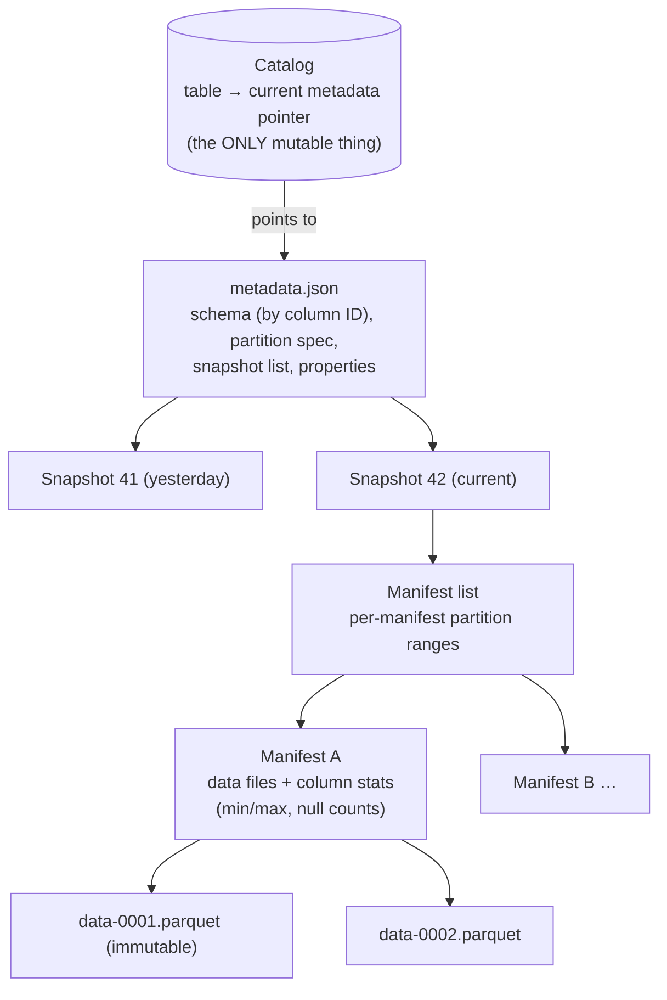
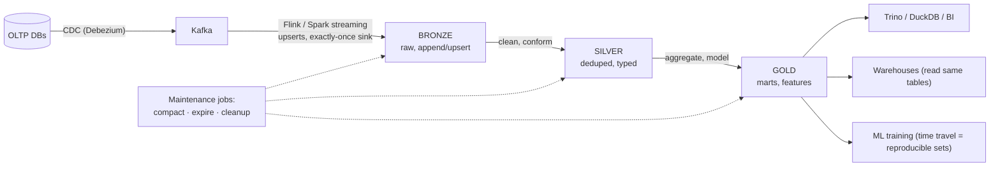

# レイクハウスとオープンテーブルフォーマット

> **翻訳についての注記:** 本ドキュメントは英語原文 `13-data-pipelines/05-lakehouse-table-formats.md` を日本語に翻訳したものです。コードブロックおよびMermaidダイアグラムは原文のまま維持しています。

## TL;DR

レイクハウスは2コピーの世界 — 安価なストレージのためのデータレイク+信頼できるSQLのためのウェアハウス — を1つに畳み込みます: **オープンテーブルフォーマット**(Apache Iceberg、Delta Lake、Apache Hudi)が、[オブジェクトストレージ](../03-storage-engines/08-object-storage.md)上の素のParquetファイルにACIDトランザクション、スキーマ進化、タイムトラベル、まともなパーティショニングを重ね、あらゆるエンジン(Spark、Flink、Trino、DuckDB、そしてウェアハウス自身)から読めるようにします。機構は**メタデータツリー+アトミックなポインタ交換**です: データファイルは不変で、コミットは**カタログ**内の現行スナップショットポインタへの1回のcompare-and-swap — だからこそカタログがデータプラットフォームの新しい支配点になりました。誰もマーケティングしない運用上の真実: テーブルには**メンテナンス**が要ります — コンパクション、スナップショット失効、孤児ファイル掃除 — 第一級のスケジュールされたワークロードとして。さもなければレイクハウスは、置き換えたはずの沼に退化します。

---

## 問題: Parquetのディレクトリはテーブルではない

第一世代のデータレイクはディレクトリの取り決めでした: `s3://lake/events/date=2026-06-11/*.parquet`、schema-on-read、エンジンは各自勝手に。予測可能な形で壊れます:

- **複数ファイルのアトミックなコミットがない。** 500ファイルを書くジョブが300で死ぬと、読者は半端なデータセットを見ます。「ディレクトリのrenameによるコミット」はオブジェクトストアに存在しません([renameなし](../03-storage-engines/08-object-storage.md))。
- **分離がない。** ライターがファイルを足している間にリーダーが一覧を取る — すべてのレポートが潜在的なファントムリードです。
- **スキーマドリフト。** プロデューサが列を足すと、コンシューマの半分がクラッシュし、残り半分は黙ってnullを読みます。
- **パーティションの硬直性。** ディレクトリレイアウトが*そのまま*パーティショニングです。粒度の変更(日次→時間次)は世界の書き直しで、アナリスト全員が魔法の述語(`WHERE date = ...`)を知らなければフルスキャンです。
- **スモールファイル。** ストリーミング取り込みはKBサイズのファイルを何千も滴らせ、一覧と開封がクエリ時間を支配します。

ウェアハウスは何十年も前にこれを全部解決しました — ストレージを所有することによって。テーブルフォーマットはストレージを所有**せずに**解決します。それが要点のすべてです: データは1コピー、エンジンは多数、バイトの周りにベンダーの壁はなし。

---

## テーブルフォーマットの仕組み

Icebergの構造(DeltaとHudiは語彙が違うだけで本質は同じ):

**コミットはポインタ交換です。** ライターは新しい不変データファイルをステージし、新しいマニフェストと新しい `metadata.json` を書き、カタログで1回のアトミックな**compare-and-swap**を行います: 「currentがv41なら、current → v42に」。並行ライターは楽観的並行性制御を使います — 敗者は本物の競合(同じファイル/パーティションに触れたか)を確認してリトライまたは中止。その単一のCASが与えるもの:

- **オブジェクトストレージの上のACID** — リーダーはポインタを一度解決し、クエリ全体で1つの一貫したスナップショットを見ます(スナップショット分離。半端に書かれたディレクトリは決して見えません)。
- **タイムトラベルとロールバック** — 古いスナップショットは失効まで残ります: `SELECT ... FOR VERSION AS OF 41`、ポインタの差し替えによる即時ロールバック、再現可能なML訓練セットと監査。
- **メタデータだけで済むスキーマ進化** — 列は名前や位置ではなく**ID**で追跡されるので、rename/追加/削除/並べ替え/拡幅はデータファイルを書き直さず、削除した列のバイトが新しい列に蘇ることもありません([expand/contractの規律](../15-deployment/03-database-migrations.md)を構造で強制)。
- **隠しパーティショニングとパーティション進化**(Icebergの代名詞) — テーブルは変換(`days(ts)`、`bucket(64, user_id)`)を保持します。生の列に対するクエリ(`WHERE ts > ...`)は魔法の述語なしで自動的にプルーニングされ、仕様は古いファイルを書き直さずに*将来の*データに対して変更できます。
- **統計によるプルーニング** — マニフェストはファイルごと・列ごとのmin/max/null数を運びます。プランナはParquetフッタに触れる前にファイルやマニフェスト丸ごとをスキップします。スケールでは、生I/OではなくこのメタデータプルーニングがクエリパフォーマンスのIます。

### フォーマットを、正直に

| | Iceberg | Delta Lake | Hudi |
|---|---|---|---|
| 出自 / 本能 | Netflix; 仕様第一、エンジン中立 | Databricks; Sparkネイティブ、Databricksでの磨き込みが最深 | Uber; ストリーミングupsert/CDC第一 |
| コミットのメタデータ | スナップショットツリー+カタログCAS | `_delta_log/` の順序付きJSON+チェックポイント | タイムライン+ファイルグループ |
| 代名詞的な強み | 隠しパーティショニング、パーティション進化、RESTカタログ仕様 | Sparkエコシステムでの成熟、UniForm相互運用 | レコードレベルインデックス、merge-on-readのupsertレイテンシ |
| ストリーミングupsert | 良い(MoR削除、equality/position deletes) | 良い | 最も強い血統 |
| エコシステムの軌跡 | 事実上の中立標準 — ウェアハウス(Snowflake、BigQuery、Redshift)、Databricks(Tabular買収後)、全クエリエンジンが読み書き | UniForm(DeltaテーブルがIcebergメタデータを公開)経由で収束中 | 健全だがより狭い |

2024〜2026年の筋書きは**交換層としてのIcebergへの収束**です(DatabricksのTabular買収。UniFormとApache XTableがフォーマット間でメタデータを翻訳)。エコシステムの重力で選ぶこと: グリーンフィールドのマルチエンジン → Iceberg。深いDatabricks → Delta(UniForm併用)。ストリーミングupsert中心の血統 → Hudiを評価。データファイルはどのみちParquetです — フォーマット戦争はメタデータ戦争です。

### Copy-on-write vs merge-on-read

不変ファイル上の更新と削除には2つの味があります: **copy-on-write**はコミット時に対象データファイルを書き直し(書き込みは遅く、読み出しは最速 — バッチ向き)、**merge-on-read**は小さな削除/差分ファイルを書いてリーダーがクエリ時にマージします(ストリーミング書き込みは速く、コンパクションが畳み込むまで読み出しは遅い — CDC取り込み向き)。現実のテーブルの多くは、取り込みはMoRで動かし、スケジュールされたコンパクションでCoW並みの読み出し性能に戻します — そしてそれは直接つながります:

---

## 運用: メンテナンスは任意ではない

レイクハウスのテーブルは生きた構造物です。テーブルごとに、[SLO](../11-observability/05-slos-error-budgets.md)付きの本物のパイプラインとしてスケジュールすること:

- **コンパクション** — 小ファイルを約128〜512MBの目標に書き直し、merge-on-readの削除を畳み込み、必要ならホットな述語列で再ソート/クラスタリング(z-order)。コンパクションのないストリーミングテーブルは*数日*で劣化します。
- **スナップショット失効** — タイムトラベルはストレージです。監査/再現性の窓を過ぎたスナップショットは失効させること。さもなくば全バージョンに永遠に支払います。
- **孤児ファイル掃除** — 失敗したジョブは、どのスナップショットも参照しないステージ済みファイルを残します。掃除すること(慎重に — 実行中コミットとの競合窓が古典的な足撃ちです)。
- **マニフェストの書き直し** — 頻繁なコミットの下ではメタデータ自体が断片化します。

そしてアーキテクチャ上の決定: **カタログが支配点です。** CASが住む場所であり、アクセス制御が付く場所であり、ますますガバナンスの場所です(Polaris、Unity、Nessie — 最後のものはテーブルにgit的なブランチ/タグを与えます: ブランチに書き、検証し、mainへfast-forward — [データのCI/CD](../15-deployment/04-cicd-gitops.md))。RESTカタログ仕様がこれをHiveの遺産から切り離しました。カタログ選定はデータベース選定と同じ重さで扱うこと。後からのカタログ移行は*全テーブルのコミットルート*の移行だからです。

### パイプラインの形

[CDC](./04-change-data-capture.md)でブロンズへ([ストリーミング](./02-stream-processing.md)はIceberg/Deltaのトランザクショナルなコミットでexactly-onceシンク)、メダリオンで精錬し、すべてのコンシューマ — 対話的SQL、ウェアハウス、ML — が*同じ*統治されたテーブルを読みます。これは[lambda/kappa](./03-lambda-kappa-architecture.md)論争の解消です: コミットが安価でアトミックだから、1つのストレージ層がバッチとストリーミングの両方に仕えます。

### それでもウェアハウスが勝つ場面

ホットデータへのサブ秒の対話的BI、大量の並行スモールクエリ、メンテナンス運用への食欲ゼロ — マネージドウェアハウスは依然正しい道具で、モダンなものはどのみちIcebergを読みます。それこそが要点です: レイクハウスの決定はもはや*二者択一*ではなく、「ストレージ層をオープンフォーマットで所有し、ウェアハウスをその上の複数のコンピュートエンジンのひとつにする」ことです。

---

## 参考文献

- [Lakehouse: A New Generation of Open Platforms that Unify Data Warehousing and Advanced Analytics](https://www.cidrdb.org/cidr2021/papers/cidr2021_paper17.pdf) — CIDR '21; テーゼ論文
- [Apache Iceberg spec](https://iceberg.apache.org/spec/) — メタデータツリーの正確な記述; [RESTカタログ仕様](https://iceberg.apache.org/concepts/catalog/)
- [Delta Lake: High-Performance ACID Table Storage over Cloud Object Stores](https://www.vldb.org/pvldb/vol13/p3411-armbrust.pdf) — VLDB '20
- [Apache Hudi docs](https://hudi.apache.org/docs/overview) — merge-on-readとレコードレベルインデックス
- [Apache XTable](https://xtable.apache.org/) — フォーマット間メタデータ翻訳
- [Project Nessie](https://projectnessie.org/) — Icebergテーブル上のgit的セマンティクス
