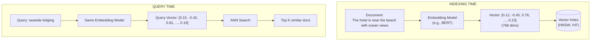
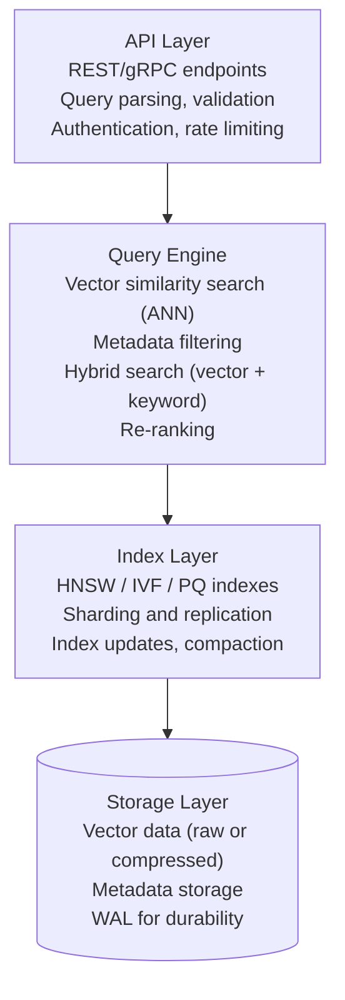
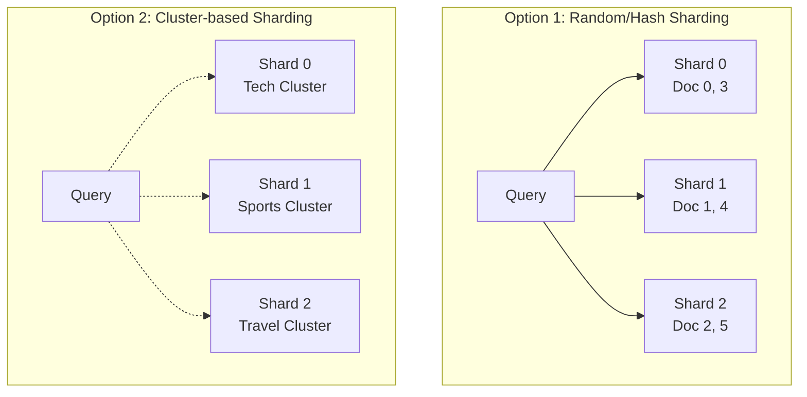

# ベクトル検索

> **注:** この記事は英語版 `14-search-systems/03-vector-search.md` の日本語翻訳です。

## TL;DR

ベクトル検索は、キーワードのマッチングではなく、高次元の埋め込み（エンベディング）を比較することで類似アイテムを見つけます。テキスト、画像、その他のデータは ML モデルを使用して密ベクトルに変換され、HNSW や IVF などの近似最近傍（ANN）アルゴリズムで検索されます。これにより、正確な用語ではなく意味を理解するセマンティック検索が実現されます。

---

## ベクトル検索が解決する課題

### キーワード検索の限界

```
Query: "affordable accommodation near the beach"

Keyword matching finds:
  ✓ "affordable beach accommodation available"
  ✗ "budget hotel by the ocean"          (no word overlap)
  ✗ "cheap seaside lodging"              (synonyms not matched)
  ✗ "inexpensive place to stay on coast" (semantic match, no keywords)

Vector search finds ALL of these because it understands meaning.
```

ベクトル検索はこれらすべてを見つけることができます。なぜなら、意味を理解するからです。

### セマンティック理解

```
┌─────────────────────────────────────────────────────────────────┐
│                    Embedding Space                               │
│                                                                 │
│     "king" ─────────────────┐                                   │
│                             │ similar direction                 │
│     "queen" ────────────────┘                                   │
│                                                                 │
│     "man" ──────────────────┐                                   │
│                             │ similar direction                 │
│     "woman" ─────────────────┘                                  │
│                                                                 │
│     Famous relationship: king - man + woman ≈ queen             │
│                                                                 │
│     Embeddings capture semantic relationships                   │
└─────────────────────────────────────────────────────────────────┘
```

埋め込みはセマンティックな関係性を捉えます。有名な例として、king - man + woman ≈ queen という関係があります。

---

## ベクトル検索の仕組み

### エンドツーエンドパイプライン



インデックス時にドキュメントを埋め込みモデルでベクトルに変換し、ベクトルインデックスに格納します。クエリ時には同じ埋め込みモデルでクエリベクトルを生成し、ANN 検索で類似ドキュメントの Top K を取得します。

### 距離メトリクス

```python
import numpy as np

def cosine_similarity(a, b):
    """
    Measures angle between vectors (most common for text)
    Range: -1 (opposite) to 1 (identical)
    """
    return np.dot(a, b) / (np.linalg.norm(a) * np.linalg.norm(b))

def euclidean_distance(a, b):
    """
    Measures straight-line distance
    Range: 0 (identical) to infinity
    """
    return np.linalg.norm(a - b)

def dot_product(a, b):
    """
    Measures alignment (used when vectors are normalized)
    Higher = more similar
    """
    return np.dot(a, b)

# Example
doc_vector = np.array([0.12, -0.45, 0.78, 0.23])
query_vector = np.array([0.15, -0.42, 0.81, 0.19])

print(f"Cosine: {cosine_similarity(doc_vector, query_vector):.4f}")  # 0.9987
print(f"Euclidean: {euclidean_distance(doc_vector, query_vector):.4f}")  # 0.0707
print(f"Dot Product: {dot_product(doc_vector, query_vector):.4f}")  # 0.8366

# Which to use?
# - Cosine: Text embeddings (magnitude doesn't matter)
# - Euclidean: When absolute distances matter
# - Dot Product: Normalized vectors, recommendation systems
```

使い分けの指針:
- **コサイン類似度**: テキスト埋め込み（大きさが重要でない場合）
- **ユークリッド距離**: 絶対的な距離が重要な場合
- **ドット積**: 正規化されたベクトル、推薦システム

---

## 埋め込みモデル

### テキスト埋め込み

```python
from sentence_transformers import SentenceTransformer

# Popular models for semantic search
model = SentenceTransformer('all-MiniLM-L6-v2')  # Fast, 384 dims
# model = SentenceTransformer('all-mpnet-base-v2')  # Better quality, 768 dims

documents = [
    "The hotel is near the beach with ocean views",
    "Budget accommodation by the seaside",
    "Luxury resort on the coast",
    "Mountain cabin in the woods"
]

# Generate embeddings
embeddings = model.encode(documents)
print(f"Shape: {embeddings.shape}")  # (4, 384)

# Search
query = "affordable place to stay near water"
query_embedding = model.encode(query)

# Find most similar
from sklearn.metrics.pairwise import cosine_similarity
similarities = cosine_similarity([query_embedding], embeddings)[0]

for doc, score in sorted(zip(documents, similarities), key=lambda x: -x[1]):
    print(f"{score:.4f}: {doc}")

# Output:
# 0.7823: Budget accommodation by the seaside
# 0.7156: The hotel is near the beach with ocean views
# 0.6892: Luxury resort on the coast
# 0.2341: Mountain cabin in the woods
```

### OpenAI 埋め込み

```python
from openai import OpenAI

client = OpenAI()

def get_embedding(text, model="text-embedding-3-small"):
    """
    OpenAI embedding models:
    - text-embedding-3-small: 1536 dims, cheaper
    - text-embedding-3-large: 3072 dims, better quality
    - text-embedding-ada-002: Legacy, 1536 dims
    """
    response = client.embeddings.create(
        input=text,
        model=model
    )
    return response.data[0].embedding

# Batch embedding
def get_embeddings_batch(texts, model="text-embedding-3-small"):
    response = client.embeddings.create(
        input=texts,
        model=model
    )
    return [item.embedding for item in response.data]

# Cost consideration
# text-embedding-3-small: $0.00002 / 1K tokens
# 1M documents × 500 tokens avg = 500M tokens = $10
```

### マルチモーダル埋め込み

```python
# CLIP: Images and text in same embedding space
from transformers import CLIPProcessor, CLIPModel
from PIL import Image

model = CLIPModel.from_pretrained("openai/clip-vit-base-patch32")
processor = CLIPProcessor.from_pretrained("openai/clip-vit-base-patch32")

# Embed image
image = Image.open("beach_hotel.jpg")
inputs = processor(images=image, return_tensors="pt")
image_embedding = model.get_image_features(**inputs)

# Embed text
inputs = processor(text="hotel near the beach", return_tensors="pt")
text_embedding = model.get_text_features(**inputs)

# Now can search images with text queries!
similarity = cosine_similarity(
    image_embedding.detach().numpy(),
    text_embedding.detach().numpy()
)[0][0]
```

CLIP を使用すると、画像とテキストを同じ埋め込み空間に配置でき、テキストクエリで画像を検索できます。

---

## 近似最近傍（ANN）アルゴリズム

### なぜ近似なのか？

```
Exact K-NN:
  For each query, compare to ALL vectors
  Time: O(n × d) where n = vectors, d = dimensions

  1 billion vectors × 768 dimensions = 768 billion operations
  At 10B ops/sec = 77 seconds per query

  UNACCEPTABLE for real-time search

Approximate K-NN:
  Trade accuracy for speed
  Time: O(log n) or O(√n) depending on algorithm

  Typically 95-99% recall at 1000x speedup
```

厳密な K-NN は10億ベクトルでクエリあたり77秒かかり、リアルタイム検索には使えません。近似 K-NN は精度をわずかに犠牲にして1000倍の高速化を実現し、通常95-99%の再現率を達成します。

### HNSW（Hierarchical Navigable Small World）

```
┌─────────────────────────────────────────────────────────────────┐
│                    HNSW Structure                                │
│                                                                 │
│   Layer 2 (sparse):     A ─────────────────── B                 │
│                         │                     │                 │
│                         │                     │                 │
│   Layer 1 (medium):     A ───── C ───── D ─── B                 │
│                         │       │       │     │                 │
│                         │       │       │     │                 │
│   Layer 0 (dense):      A ─ E ─ C ─ F ─ D ─ G ─ B ─ H           │
│                                                                 │
│   Search process:                                               │
│   1. Start at top layer, find closest node                      │
│   2. Drop to next layer, search neighbors                       │
│   3. Repeat until layer 0                                       │
│   4. Local search in dense graph                                │
│                                                                 │
│   Complexity: O(log n) average case                             │
└─────────────────────────────────────────────────────────────────┘

Key parameters:
  M: Number of connections per node (typically 16-64)
  ef_construction: Search depth during build (higher = better index, slower build)
  ef_search: Search depth during query (higher = better recall, slower query)
```

検索プロセスは、最上位レイヤーから開始して最も近いノードを見つけ、次のレイヤーに降りて近傍を検索し、レイヤー0まで繰り返します。計算量は平均 O(log n) です。

### IVF（Inverted File Index）

```
┌─────────────────────────────────────────────────────────────────┐
│                    IVF Structure                                 │
│                                                                 │
│   Step 1: Cluster vectors into buckets (using k-means)          │
│                                                                 │
│   ┌─────────┐  ┌─────────┐  ┌─────────┐  ┌─────────┐           │
│   │Cluster 0│  │Cluster 1│  │Cluster 2│  │Cluster 3│  ...      │
│   │ • • •   │  │  • •    │  │ • • • • │  │   • •   │           │
│   │  • •    │  │ • • •   │  │  • •    │  │  • • •  │           │
│   └─────────┘  └─────────┘  └─────────┘  └─────────┘           │
│                                                                 │
│   Step 2: At query time                                         │
│   1. Find nearest cluster centroids (nprobe clusters)           │
│   2. Only search vectors in those clusters                      │
│   3. Return top K from searched subset                          │
│                                                                 │
│   Parameters:                                                   │
│   nlist: Number of clusters (typically √n to 4√n)              │
│   nprobe: Clusters to search (higher = better recall)          │
│                                                                 │
│   Example: 1M vectors, nlist=1000, nprobe=10                   │
│   Search only 10K vectors instead of 1M = 100x speedup         │
└─────────────────────────────────────────────────────────────────┘
```

IVF はベクトルを k-means でクラスタリングし、クエリ時には最も近いクラスタセントロイドのみを検索します。100万ベクトルで nlist=1000、nprobe=10 の場合、100倍の高速化を実現します。

### アルゴリズム比較

```
┌────────────────┬────────────────┬────────────────┬────────────────┐
│ Algorithm      │ Build Time     │ Query Time     │ Memory         │
├────────────────┼────────────────┼────────────────┼────────────────┤
│ Flat (exact)   │ O(n)           │ O(n × d)       │ O(n × d)       │
│ IVF            │ O(n × k)       │ O(nprobe × n/k)│ O(n × d)       │
│ HNSW           │ O(n × log n)   │ O(log n)       │ O(n × M × d)   │
│ PQ             │ O(n × d)       │ O(n × d/m)     │ O(n × m)       │
│ IVF-PQ         │ O(n × k + d)   │ O(nprobe × n/k)│ O(n × m)       │
└────────────────┴────────────────┴────────────────┴────────────────┘
```

推奨事項:
- 10万ベクトル未満: Flat または HNSW
- 10万〜1000万ベクトル: HNSW（メモリに収まる場合）または IVF
- 1000万ベクトル超: IVF-PQ または HNSW + PQ 圧縮
- メモリ制約がある場合: PQ バリアント
- 高い再現率が必要な場合: 高い ef_search の HNSW

---

## 直積量子化（PQ）

### ベクトルの圧縮

```
Original vector (768 floats × 4 bytes = 3KB):
[0.12, -0.45, 0.78, 0.23, 0.56, -0.34, ..., 0.91]  (768 dimensions)

Product Quantization:
1. Split into subvectors (e.g., 96 subvectors of 8 dims each)
2. For each subspace, cluster into 256 centroids (1 byte ID)
3. Store centroid IDs instead of actual values

Compressed vector (96 bytes):
[23, 156, 89, 201, 45, 178, ..., 67]  (96 subvector IDs)

Compression: 3KB → 96 bytes = 32x reduction

┌─────────────────────────────────────────────────────────────────┐
│                    PQ Compression                                │
│                                                                 │
│   Original:  [──8 dims──][──8 dims──][──8 dims──]...(×96)       │
│                    │           │           │                    │
│                    ▼           ▼           ▼                    │
│              ┌─────────┐ ┌─────────┐ ┌─────────┐                │
│              │256 codes│ │256 codes│ │256 codes│ (codebooks)    │
│              └────┬────┘ └────┬────┘ └────┬────┘                │
│                   │           │           │                     │
│   Compressed:   [23]       [156]        [89]     ...(×96)       │
│                                                                 │
│   Distance calculation uses lookup tables                       │
└─────────────────────────────────────────────────────────────────┘
```

PQ は元のベクトルをサブベクトルに分割し、各サブ空間で256個のセントロイドにクラスタリングし、実際の値の代わりにセントロイド ID を格納します。3KB から 96バイトへの32倍の圧縮を実現します。

### 実装

```python
import faiss
import numpy as np

# Sample data
d = 768  # dimensions
n = 1000000  # vectors
vectors = np.random.random((n, d)).astype('float32')

# IVF-PQ index
nlist = 1000  # clusters
m = 96  # subquantizers
nbits = 8  # bits per subquantizer (256 codes)

quantizer = faiss.IndexFlatL2(d)
index = faiss.IndexIVFPQ(quantizer, d, nlist, m, nbits)

# Train and add
index.train(vectors)
index.add(vectors)

# Search
index.nprobe = 10  # search 10 clusters
query = np.random.random((1, d)).astype('float32')
distances, indices = index.search(query, k=10)

# Memory comparison
flat_memory = n * d * 4 / 1e9  # ~3 GB
pq_memory = n * m / 1e9  # ~0.1 GB
print(f"Flat: {flat_memory:.1f} GB, PQ: {pq_memory:.1f} GB")
```

---

## ベクトルデータベース

### アーキテクチャ概要



### Pinecone の例

```python
from pinecone import Pinecone

# Initialize
pc = Pinecone(api_key="your-api-key")
index = pc.Index("semantic-search")

# Upsert vectors with metadata
index.upsert(vectors=[
    {
        "id": "doc1",
        "values": [0.12, -0.45, 0.78, ...],  # 1536 dims
        "metadata": {
            "title": "Beach Hotel Guide",
            "category": "travel",
            "price_range": "budget",
            "rating": 4.5
        }
    },
    # ... more vectors
])

# Query with metadata filter
results = index.query(
    vector=[0.15, -0.42, 0.81, ...],
    top_k=10,
    filter={
        "category": {"$eq": "travel"},
        "price_range": {"$in": ["budget", "mid-range"]},
        "rating": {"$gte": 4.0}
    },
    include_metadata=True
)
```

### Weaviate の例

```python
import weaviate

client = weaviate.Client("http://localhost:8080")

# Create schema with vectorizer
client.schema.create_class({
    "class": "Document",
    "vectorizer": "text2vec-openai",  # Auto-embed on insert
    "moduleConfig": {
        "text2vec-openai": {
            "model": "text-embedding-3-small"
        }
    },
    "properties": [
        {"name": "content", "dataType": ["text"]},
        {"name": "category", "dataType": ["string"]},
        {"name": "rating", "dataType": ["number"]}
    ]
})

# Insert (auto-embedded)
client.data_object.create({
    "content": "Beautiful beach hotel with ocean views",
    "category": "travel",
    "rating": 4.5
}, "Document")

# Hybrid search (vector + keyword)
result = client.query.get("Document", ["content", "category"]) \
    .with_hybrid(query="seaside accommodation", alpha=0.5) \
    .with_where({
        "path": ["rating"],
        "operator": "GreaterThan",
        "valueNumber": 4.0
    }) \
    .with_limit(10) \
    .do()
```

### 比較

```
┌──────────────┬────────────────┬────────────────┬────────────────┐
│ Feature      │ Pinecone       │ Weaviate       │ Milvus         │
├──────────────┼────────────────┼────────────────┼────────────────┤
│ Deployment   │ Managed only   │ Self/Managed   │ Self/Managed   │
│ Hybrid Search│ Basic filter   │ Native BM25+   │ Native         │
│ Auto-embed   │ No             │ Yes            │ No             │
│ Scale        │ Billions       │ Millions       │ Billions       │
│ Index Types  │ Proprietary    │ HNSW           │ IVF,HNSW,DiskANN│
│ Open Source  │ No             │ Yes            │ Yes            │
└──────────────┴────────────────┴────────────────┴────────────────┘
```

---

## ハイブリッド検索

### なぜハイブリッドなのか？

```
Pure Vector Search weaknesses:
- Misses exact keyword matches (product IDs, names)
- May not respect user's explicit terms
- Newer/rare terms not well embedded

Pure Keyword Search weaknesses:
- No semantic understanding
- Requires exact term overlap
- Word order matters too much

Hybrid combines the best of both:
- Keyword precision + Semantic recall
- Explicit matches boosted
- Graceful degradation
```

純粋なベクトル検索は正確なキーワードマッチを見逃す場合があり、純粋なキーワード検索はセマンティックな理解ができません。ハイブリッド検索は両者の長所を組み合わせ、キーワードの精度とセマンティックな再現率を実現します。

### 逆順位融合（RRF）

```python
def reciprocal_rank_fusion(results_lists, k=60):
    """
    Combine multiple result lists using RRF

    RRF score = Σ 1 / (k + rank_i)

    k is a constant (typically 60) to prevent high-ranked
    documents from dominating
    """
    scores = {}

    for results in results_lists:
        for rank, doc_id in enumerate(results, 1):
            if doc_id not in scores:
                scores[doc_id] = 0
            scores[doc_id] += 1 / (k + rank)

    # Sort by combined score
    return sorted(scores.keys(), key=lambda x: scores[x], reverse=True)

# Example
bm25_results = ["doc1", "doc3", "doc5", "doc2", "doc4"]
vector_results = ["doc2", "doc1", "doc4", "doc6", "doc3"]

# RRF scores:
# doc1: 1/(60+1) + 1/(60+2) = 0.0164 + 0.0161 = 0.0325
# doc2: 1/(60+4) + 1/(60+1) = 0.0156 + 0.0164 = 0.0320
# doc3: 1/(60+2) + 1/(60+5) = 0.0161 + 0.0154 = 0.0315

hybrid_results = reciprocal_rank_fusion([bm25_results, vector_results])
# ["doc1", "doc2", "doc3", "doc4", "doc5", "doc6"]
```

### 線形結合

```python
def hybrid_search(query, bm25_index, vector_index, alpha=0.5):
    """
    Combine BM25 and vector scores with linear interpolation

    final_score = alpha * vector_score + (1 - alpha) * bm25_score

    alpha = 1.0: Pure vector search
    alpha = 0.0: Pure BM25
    alpha = 0.5: Equal weight
    """
    # Get BM25 scores (normalized 0-1)
    bm25_results = bm25_index.search(query)
    bm25_scores = normalize_scores(bm25_results)

    # Get vector scores (cosine similarity already 0-1)
    query_vector = embed(query)
    vector_results = vector_index.search(query_vector)
    vector_scores = {doc_id: score for doc_id, score in vector_results}

    # Combine
    combined = {}
    all_docs = set(bm25_scores.keys()) | set(vector_scores.keys())

    for doc_id in all_docs:
        bm25 = bm25_scores.get(doc_id, 0)
        vector = vector_scores.get(doc_id, 0)
        combined[doc_id] = alpha * vector + (1 - alpha) * bm25

    return sorted(combined.items(), key=lambda x: -x[1])

# Tuning alpha:
# - High-intent queries (product names): lower alpha (more BM25)
# - Exploratory queries: higher alpha (more semantic)
# - A/B test to find optimal alpha
```

alpha の調整:
- 意図が明確なクエリ（製品名）: alpha を低く（BM25 寄り）
- 探索的なクエリ: alpha を高く（セマンティック寄り）
- 最適な alpha を見つけるために A/B テストを実施します

### Elasticsearch でのベクトル検索

```json
// Dense vector field mapping
{
  "mappings": {
    "properties": {
      "content": { "type": "text" },
      "content_vector": {
        "type": "dense_vector",
        "dims": 768,
        "index": true,
        "similarity": "cosine"
      }
    }
  }
}

// Hybrid query with RRF
{
  "retriever": {
    "rrf": {
      "retrievers": [
        {
          "standard": {
            "query": {
              "match": {
                "content": "seaside accommodation"
              }
            }
          }
        },
        {
          "knn": {
            "field": "content_vector",
            "query_vector": [0.15, -0.42, 0.81, ...],
            "k": 10,
            "num_candidates": 100
          }
        }
      ],
      "rank_window_size": 100,
      "rank_constant": 60
    }
  }
}
```

---

## ベクトル検索のスケーリング

### シャーディング戦略



```
Random: Query goes to ALL shards, merge results
  ✓ Even distribution
  ✗ Every query hits every shard

Cluster: Query routed to relevant shards only
  ✓ Fewer shards per query
  ✗ Uneven distribution, cross-cluster queries slow

Recommendation: Start with random, optimize later
```

ランダムシャーディングは均等分散ですがすべてのシャードにヒットします。クラスタベースシャーディングはクエリごとのシャード数が少なくなりますが、分散が不均等になります。まずはランダムから始めて、後から最適化することを推奨します。

### GPU アクセラレーション

```python
import faiss

# CPU index
cpu_index = faiss.IndexFlatL2(768)
cpu_index.add(vectors)

# Move to GPU
gpu_resource = faiss.StandardGpuResources()
gpu_index = faiss.index_cpu_to_gpu(gpu_resource, 0, cpu_index)

# Search on GPU (10-50x faster for large batches)
distances, indices = gpu_index.search(queries, k=10)

# Multi-GPU
gpu_resources = [faiss.StandardGpuResources() for _ in range(4)]
gpu_index = faiss.index_cpu_to_all_gpus(cpu_index)

# When to use GPU:
# - Batch queries (>100 queries at once)
# - Very large indexes (>10M vectors)
# - Low latency requirements
#
# CPU is often better for:
# - Single queries
# - Memory-constrained environments
# - HNSW indexes (less GPU benefit)
```

### キャッシュ戦略

```python
from functools import lru_cache
import hashlib

class VectorSearchCache:
    def __init__(self, vector_db, cache_size=10000):
        self.vector_db = vector_db
        self.query_cache = {}  # query_hash -> results
        self.embedding_cache = {}  # text -> vector

    def search(self, query_text, top_k=10, filters=None):
        # Cache key from query + filters
        cache_key = self._make_cache_key(query_text, top_k, filters)

        if cache_key in self.query_cache:
            return self.query_cache[cache_key]

        # Get or compute embedding
        if query_text in self.embedding_cache:
            query_vector = self.embedding_cache[query_text]
        else:
            query_vector = self.embed(query_text)
            self.embedding_cache[query_text] = query_vector

        # Search
        results = self.vector_db.search(
            vector=query_vector,
            top_k=top_k,
            filters=filters
        )

        self.query_cache[cache_key] = results
        return results

    def _make_cache_key(self, query, top_k, filters):
        key_str = f"{query}|{top_k}|{sorted(filters.items()) if filters else ''}"
        return hashlib.md5(key_str.encode()).hexdigest()

# Cache considerations:
# - Query distribution is often Zipfian (some queries very popular)
# - Embedding cache saves expensive API calls
# - Invalidate on index updates
# - TTL for freshness requirements
```

キャッシュの考慮点:
- クエリ分布はしばしばジップ分布（一部のクエリが非常に人気）です
- 埋め込みキャッシュは高コストな API 呼び出しを節約します
- インデックス更新時に無効化が必要です
- 鮮度要件に応じた TTL を設定します

---

## 評価メトリクス

### Recall@K

```python
def recall_at_k(retrieved, relevant, k):
    """
    What fraction of relevant items are in top K results?

    recall@k = |retrieved@k ∩ relevant| / |relevant|
    """
    retrieved_at_k = set(retrieved[:k])
    relevant_set = set(relevant)

    return len(retrieved_at_k & relevant_set) / len(relevant_set)

# Example
relevant = ["doc1", "doc2", "doc3"]  # Ground truth
retrieved = ["doc1", "doc4", "doc2", "doc5", "doc3"]  # ANN results

print(f"Recall@1: {recall_at_k(retrieved, relevant, 1)}")  # 0.33
print(f"Recall@3: {recall_at_k(retrieved, relevant, 3)}")  # 0.67
print(f"Recall@5: {recall_at_k(retrieved, relevant, 5)}")  # 1.0

# ANN quality often measured as Recall@K vs exact search
# 95%+ recall is typically acceptable
```

### QPS vs 再現率のトレードオフ

```
┌─────────────────────────────────────────────────────────────────┐
│   Recall                                                         │
│   100% ─┬─────────────────────────────────────●                 │
│         │                           ●                            │
│    95% ─┼───────────────●                                        │
│         │          ●                                             │
│    90% ─┼─────●                                                  │
│         │  ●                                                     │
│    80% ─┼●                                                       │
│         └─┬─────┬─────┬─────┬─────┬─────┬─────► QPS             │
│           0   1K    5K   10K   20K   50K  100K                   │
│                                                                 │
│   Tuning parameters affect this tradeoff:                       │
│   • HNSW ef_search: higher = better recall, lower QPS           │
│   • IVF nprobe: higher = better recall, lower QPS               │
│                                                                 │
│   Find the sweet spot for your use case                         │
└─────────────────────────────────────────────────────────────────┘
```

チューニングパラメーターがこのトレードオフに影響します。ユースケースに合ったスイートスポットを見つけることが重要です。

---

## ベストプラクティス

### 埋め込みのベストプラクティス

```
1. Choose the right model
   □ Domain-specific models for specialized content
   □ Multilingual models for international content
   □ Same model for indexing and querying

2. Preprocessing
   □ Chunk long documents (512-1024 tokens typical)
   □ Include context in chunks (overlap or summaries)
   □ Clean text (remove boilerplate, normalize)

3. Fine-tuning
   □ Contrastive fine-tuning on your data
   □ Use user click data if available
   □ Evaluate on held-out test set
```

1. **適切なモデルの選択**: 専門コンテンツにはドメイン固有のモデルを、国際コンテンツには多言語モデルを使用し、インデキシングとクエリで同じモデルを使用します。
2. **前処理**: 長いドキュメントはチャンクに分割し（通常512-1024トークン）、チャンクにコンテキストを含め（オーバーラップやサマリー）、テキストをクリーニングします。
3. **ファインチューニング**: 自社データで対照学習によるファインチューニングを行い、ユーザーのクリックデータを活用し、ホールドアウトテストセットで評価します。

### インデックスチューニング

```
1. Start simple
   □ Flat index for < 100K vectors
   □ HNSW for < 10M vectors
   □ IVF-PQ for larger scales

2. Tune parameters
   □ HNSW: Start M=16, ef=64, increase as needed
   □ IVF: nlist = sqrt(n), nprobe = nlist/10
   □ Benchmark on representative queries

3. Monitor and iterate
   □ Track recall vs exact search
   □ Monitor p99 latency
   □ Re-tune as data grows
```

### 本番チェックリスト

```
□ Embedding versioning (model changes break similarity)
□ Index backup and recovery
□ Graceful degradation (fallback to keyword search)
□ Query timeout handling
□ Rate limiting on embedding API calls
□ Cost monitoring (embeddings + storage + compute)
□ A/B testing framework for relevance changes
```

埋め込みのバージョン管理（モデル変更で類似性が壊れる）、インデックスのバックアップとリカバリ、グレースフルデグラデーション（キーワード検索へのフォールバック）、クエリタイムアウトの処理、埋め込み API 呼び出しのレート制限、コスト監視、関連性変更のための A/B テストフレームワークが重要です。

---

## 参考文献

- [Efficient and robust approximate nearest neighbor search using HNSW](https://arxiv.org/abs/1603.09320)
- [Product Quantization for Nearest Neighbor Search](https://ieeexplore.ieee.org/document/5432202)
- [Faiss Wiki](https://github.com/facebookresearch/faiss/wiki)
- [Pinecone Learning Center](https://www.pinecone.io/learn/)
- [Sentence Transformers Documentation](https://www.sbert.net/)
- [OpenAI Embeddings Guide](https://platform.openai.com/docs/guides/embeddings)
