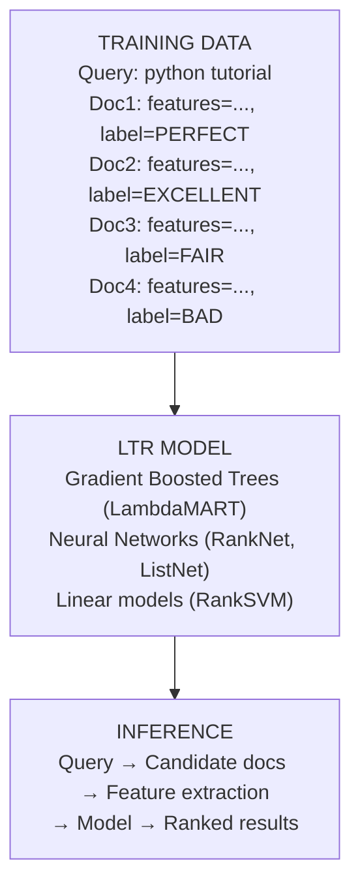
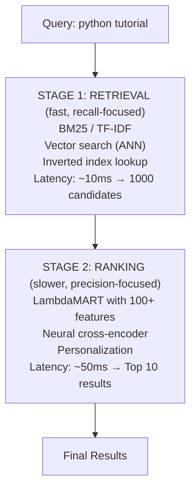

# ランキングアルゴリズム

> **注:** この記事は英語版 `14-search-systems/04-ranking-algorithms.md` の日本語翻訳です。

## TL;DR

ランキングアルゴリズムは検索結果の順序を決定します。基本的な関連性スコア（BM25）に加えて、現代のシステムでは数百の特徴量を組み合わせた ML モデルによる Learning to Rank（LTR）を使用します。主要なアプローチには、ポイントワイズ、ペアワイズ、リストワイズがあります。パーソナライゼーションにより、ユーザーの行動や嗜好に基づいてランキングをさらに最適化します。

---

## ランキングが解決する課題

### BM25 だけでは不十分な理由

```
Query: "python tutorial"

BM25 ranking (text relevance only):
1. "Python Tutorial for Beginners - Complete Course"     score: 45.2
2. "Python Tutorial - w3schools"                         score: 44.8
3. "Advanced Python Tutorial - Metaclasses"              score: 42.1
4. "Python 2.7 Tutorial (Deprecated)"                    score: 41.5

What BM25 misses:
- Doc 1 has 10M views, Doc 3 has 1K views (popularity)
- User is a beginner (personalization)
- Doc 4 is outdated (freshness)
- Doc 2 loads in 0.5s, Doc 1 loads in 3s (quality signals)

Better ranking considers ALL these signals:
1. "Python Tutorial for Beginners - Complete Course"     (popular + matches user level)
2. "Python Tutorial - w3schools"                         (fast, authoritative)
3. "Advanced Python Tutorial - Metaclasses"              (wrong level for user)
4. "Python 2.7 Tutorial (Deprecated)"                    (outdated, demoted)
```

BM25 はテキストの関連性のみを見ますが、人気度、パーソナライゼーション、鮮度、品質シグナルなどを見逃します。より良いランキングはこれらすべてのシグナルを考慮します。

### ランキング特徴量

```
┌─────────────────────────────────────────────────────────────────┐
│                    Ranking Feature Categories                    │
│                                                                 │
│   TEXT RELEVANCE                                                │
│   • BM25 score                                                  │
│   • TF-IDF score                                                │
│   • Query term coverage                                         │
│   • Title/body match ratio                                      │
│   • Phrase match bonus                                          │
│                                                                 │
│   DOCUMENT QUALITY                                              │
│   • PageRank / Authority score                                  │
│   • Domain reputation                                           │
│   • Content freshness                                           │
│   • Page load speed                                             │
│   • Mobile friendliness                                         │
│                                                                 │
│   POPULARITY                                                    │
│   • Click-through rate (CTR)                                    │
│   • Total views / impressions                                   │
│   • Dwell time                                                  │
│   • Share count                                                 │
│   • Bounce rate                                                 │
│                                                                 │
│   USER CONTEXT                                                  │
│   • User's past clicks                                          │
│   • User's expertise level                                      │
│   • Geographic location                                         │
│   • Device type                                                 │
│   • Time of day                                                 │
│                                                                 │
│   QUERY-DOCUMENT                                                │
│   • Historical CTR for this query-doc pair                      │
│   • Co-click patterns                                           │
│   • Query intent match                                          │
└─────────────────────────────────────────────────────────────────┘
```

ランキング特徴量は、テキスト関連性、ドキュメント品質、人気度、ユーザーコンテキスト、クエリ-ドキュメントの5カテゴリに分類されます。

---

## Learning to Rank（LTR）

### 概要



### 関連性ラベル

```python
# Label schemes

# Binary
RELEVANT = 1
NOT_RELEVANT = 0

# Graded (most common)
PERFECT = 4      # Exact answer to query
EXCELLENT = 3    # Highly relevant, authoritative
GOOD = 2         # Relevant, useful
FAIR = 1         # Marginally relevant
BAD = 0          # Not relevant

# Implicit signals (derived from behavior)
def infer_label_from_clicks(impression):
    """
    Derive relevance from user behavior
    """
    if impression.dwell_time > 60:  # Stayed > 1 min
        return EXCELLENT
    elif impression.clicked and impression.dwell_time > 10:
        return GOOD
    elif impression.clicked:
        return FAIR
    else:
        return BAD

# Click models for debiasing
# Users click more on higher positions (position bias)
# Need to account for this in training data
```

段階的ラベル（PERFECT〜BAD）が最も一般的です。暗黙的なシグナル（クリックや滞在時間）からラベルを推論する方法もありますが、ポジションバイアス（上位結果ほどクリックされやすい）を考慮する必要があります。

---

## LTR アプローチ

### ポイントワイズ

```python
"""
Pointwise: Predict absolute relevance score for each document
Treat ranking as regression/classification problem
"""

import lightgbm as lgb
from sklearn.model_selection import train_test_split

# Training data: (query, doc) → features, label
# Each example is independent
X = [
    [45.2, 10000000, 0.85, 3.2, 0.92],  # BM25, views, CTR, freshness, quality
    [44.8, 5000000, 0.72, 2.8, 0.88],
    [42.1, 1000, 0.45, 1.5, 0.65],
]
y = [4, 3, 1]  # Relevance labels

# Train regression model
model = lgb.LGBMRegressor(
    objective='regression',
    n_estimators=100,
    learning_rate=0.1
)
model.fit(X, y)

# At inference: score each doc, sort by score
def rank_pointwise(query, candidates, model):
    features = [extract_features(query, doc) for doc in candidates]
    scores = model.predict(features)
    ranked = sorted(zip(candidates, scores), key=lambda x: -x[1])
    return [doc for doc, score in ranked]

# Pros: Simple, fast training
# Cons: Doesn't optimize for ranking metrics (NDCG, MAP)
```

ポイントワイズは各ドキュメントの絶対的な関連性スコアを予測します。シンプルで学習が速いですが、ランキングメトリクス（NDCG、MAP）を直接最適化しません。

### ペアワイズ

```python
"""
Pairwise: Learn to compare document pairs
For each query, learn: is doc_a better than doc_b?
"""

class RankNet:
    """
    RankNet uses logistic loss on document pairs
    P(doc_a > doc_b) = sigmoid(score_a - score_b)
    """

    def __init__(self, n_features):
        self.weights = np.zeros(n_features)

    def score(self, features):
        return np.dot(features, self.weights)

    def train(self, pairs, labels, lr=0.01):
        """
        pairs: list of (features_a, features_b)
        labels: 1 if a > b, 0 if b > a
        """
        for (feat_a, feat_b), label in zip(pairs, labels):
            score_a = self.score(feat_a)
            score_b = self.score(feat_b)

            # P(a > b)
            prob = 1 / (1 + np.exp(-(score_a - score_b)))

            # Gradient
            grad = (label - prob) * (feat_a - feat_b)
            self.weights += lr * grad

# Generate pairs from graded labels
def generate_pairs(docs, labels):
    pairs = []
    pair_labels = []
    for i in range(len(docs)):
        for j in range(i + 1, len(docs)):
            if labels[i] != labels[j]:
                pairs.append((docs[i], docs[j]))
                pair_labels.append(1 if labels[i] > labels[j] else 0)
    return pairs, pair_labels

# Pros: Optimizes relative ordering
# Cons: O(n²) pairs per query, doesn't directly optimize NDCG
```

ペアワイズはドキュメントペアの比較を学習します。相対的な順序を最適化しますが、クエリあたり O(n^2) のペアが必要で、NDCG を直接最適化しません。

### リストワイズ（LambdaMART）

```python
"""
Listwise: Optimize entire ranked list at once
LambdaMART is the gold standard for production systems
"""

import lightgbm as lgb

# Prepare data in LightGBM ranking format
# Group by query, ordered by qid
train_data = lgb.Dataset(
    X_train,
    label=y_train,
    group=query_groups  # [10, 15, 8, ...] docs per query
)

# LambdaMART parameters
params = {
    'objective': 'lambdarank',
    'metric': 'ndcg',
    'ndcg_eval_at': [1, 3, 5, 10],
    'num_leaves': 31,
    'learning_rate': 0.05,
    'feature_fraction': 0.9,
    'bagging_fraction': 0.8,
    'bagging_freq': 5,
    'verbose': -1
}

model = lgb.train(
    params,
    train_data,
    num_boost_round=500,
    valid_sets=[valid_data],
    callbacks=[lgb.early_stopping(50)]
)

# How LambdaMART works:
# 1. Compute gradients based on NDCG improvement from swapping pairs
# 2. Pairs that would improve NDCG more get larger gradients
# 3. Uses gradient boosted trees to optimize
#
# Lambda gradient = |ΔNDCG| × pairwise gradient
# Focuses learning on swaps that matter for the metric

# Feature importance
importance = model.feature_importance(importance_type='gain')
for feat, imp in sorted(zip(feature_names, importance), key=lambda x: -x[1]):
    print(f"{feat}: {imp:.2f}")
```

LambdaMART は本番システムのゴールドスタンダードです。NDCG の改善に基づいて勾配を計算し、メトリクスに影響するスワップに学習を集中させます。

### ニューラルランキングモデル

```python
"""
Neural approaches for ranking
"""

import torch
import torch.nn as nn

class NeuralRanker(nn.Module):
    """
    Deep neural network for ranking
    Input: query-document feature vector
    Output: relevance score
    """

    def __init__(self, n_features, hidden_dims=[256, 128, 64]):
        super().__init__()

        layers = []
        prev_dim = n_features

        for dim in hidden_dims:
            layers.extend([
                nn.Linear(prev_dim, dim),
                nn.ReLU(),
                nn.Dropout(0.2),
                nn.BatchNorm1d(dim)
            ])
            prev_dim = dim

        layers.append(nn.Linear(prev_dim, 1))
        self.network = nn.Sequential(*layers)

    def forward(self, x):
        return self.network(x).squeeze(-1)

# ListMLE loss (listwise)
def listmle_loss(scores, labels):
    """
    Likelihood of observing the correct ranking
    """
    # Sort by true relevance
    sorted_indices = torch.argsort(labels, descending=True)
    sorted_scores = scores[sorted_indices]

    # Plackett-Luce probability
    log_likelihood = 0
    for i in range(len(sorted_scores)):
        log_likelihood += sorted_scores[i] - torch.logsumexp(sorted_scores[i:], dim=0)

    return -log_likelihood

# Cross-encoder for BERT-based ranking
class CrossEncoder(nn.Module):
    """
    BERT-based ranker: encode query and document together
    Captures deep query-document interactions
    """

    def __init__(self, model_name='bert-base-uncased'):
        super().__init__()
        from transformers import BertModel

        self.bert = BertModel.from_pretrained(model_name)
        self.classifier = nn.Linear(768, 1)

    def forward(self, input_ids, attention_mask):
        outputs = self.bert(input_ids, attention_mask=attention_mask)
        cls_embedding = outputs.last_hidden_state[:, 0, :]
        return self.classifier(cls_embedding).squeeze(-1)

# Inference is expensive: need to run BERT for each query-doc pair
# Solution: Two-stage ranking (fast retrieval → expensive reranking)
```

BERT ベースのクロスエンコーダーは深いクエリ-ドキュメント相互作用を捉えますが、推論コストが高いです。解決策は2段階ランキング（高速リトリーバル + 高コストリランキング）です。

---

## 2段階ランキング

### アーキテクチャ



### 実装

```python
class TwoStageRanker:
    def __init__(self, retriever, ranker, retrieval_k=1000, final_k=10):
        self.retriever = retriever  # BM25 or vector index
        self.ranker = ranker  # LTR model
        self.retrieval_k = retrieval_k
        self.final_k = final_k

    def search(self, query, user_context=None):
        # Stage 1: Fast retrieval
        candidates = self.retriever.retrieve(query, k=self.retrieval_k)

        # Stage 2: Feature extraction and ranking
        features = []
        for doc in candidates:
            feat = self.extract_features(query, doc, user_context)
            features.append(feat)

        # Score and rank
        scores = self.ranker.predict(features)
        ranked = sorted(zip(candidates, scores), key=lambda x: -x[1])

        return [doc for doc, score in ranked[:self.final_k]]

    def extract_features(self, query, doc, user_context):
        return {
            # Text features
            'bm25_score': self.retriever.score(query, doc),
            'title_match': query_in_title(query, doc),
            'body_match': query_in_body(query, doc),

            # Document features
            'pagerank': doc.pagerank,
            'freshness': days_since_update(doc),
            'word_count': doc.word_count,

            # Popularity features
            'total_clicks': doc.total_clicks,
            'ctr': doc.clicks / doc.impressions,
            'avg_dwell_time': doc.avg_dwell_time,

            # User features (if available)
            'user_affinity': user_doc_affinity(user_context, doc),
            'user_expertise': user_context.expertise_level if user_context else 0,
        }
```

ステージ1（リトリーバル）は高速で再現率重視（約10ms で1000候補）、ステージ2（ランキング）はより低速で精度重視（約50ms で Top 10 結果）です。

---

## パーソナライゼーション

### ユーザーシグナル

```
┌─────────────────────────────────────────────────────────────────┐
│                    Personalization Signals                       │
│                                                                 │
│   SHORT-TERM (session)                                          │
│   • Recent queries in session                                   │
│   • Clicked results this session                                │
│   • Time since session start                                    │
│   • Device, location, time of day                              │
│                                                                 │
│   LONG-TERM (user profile)                                      │
│   • Historical click patterns                                   │
│   • Topic preferences (learned from history)                    │
│   • Expertise level (beginner vs expert)                       │
│   • Preferred content types (video vs text)                     │
│   • Language preferences                                        │
│                                                                 │
│   COLLABORATIVE (similar users)                                 │
│   • Users who clicked X also clicked Y                         │
│   • Segment-level preferences                                   │
│   • Trending in user's demographic                             │
└─────────────────────────────────────────────────────────────────┘
```

パーソナライゼーションシグナルは、短期的（セッション）、長期的（ユーザープロファイル）、協調的（類似ユーザー）の3つに分類されます。

### ユーザープロファイル

```python
class UserProfile:
    def __init__(self, user_id):
        self.user_id = user_id
        self.topic_weights = {}  # topic → affinity score
        self.source_weights = {}  # source/domain → preference
        self.expertise = 0.5  # 0 = beginner, 1 = expert
        self.click_history = []

    def update_from_click(self, doc, dwell_time):
        """Update profile from user interaction"""
        # Update topic weights
        for topic, weight in doc.topics.items():
            current = self.topic_weights.get(topic, 0.5)
            # Exponential moving average
            engagement = min(dwell_time / 60, 1.0)  # Cap at 1 minute
            self.topic_weights[topic] = 0.9 * current + 0.1 * engagement * weight

        # Update source preference
        source = doc.source
        current = self.source_weights.get(source, 0.5)
        self.source_weights[source] = 0.9 * current + 0.1 * engagement

        # Update expertise based on content difficulty
        if doc.difficulty:
            self.expertise = 0.95 * self.expertise + 0.05 * doc.difficulty

    def get_personalization_features(self, doc):
        """Get features for ranking personalization"""
        return {
            'topic_affinity': sum(
                self.topic_weights.get(t, 0.5) * w
                for t, w in doc.topics.items()
            ),
            'source_preference': self.source_weights.get(doc.source, 0.5),
            'expertise_match': 1 - abs(self.expertise - doc.difficulty),
        }
```

### 埋め込みベースのパーソナライゼーション

```python
import numpy as np

class EmbeddingPersonalizer:
    """
    Represent users and documents in same embedding space
    Personalization = similarity between user and doc embeddings
    """

    def __init__(self, embedding_dim=128):
        self.embedding_dim = embedding_dim
        self.user_embeddings = {}  # user_id → embedding
        self.item_embeddings = {}  # doc_id → embedding

    def get_user_embedding(self, user_id, click_history):
        """
        User embedding = weighted average of clicked item embeddings
        More recent clicks weighted higher
        """
        if not click_history:
            return np.zeros(self.embedding_dim)

        weights = np.exp(-np.arange(len(click_history)) * 0.1)  # Recency decay
        weights /= weights.sum()

        embeddings = [
            self.item_embeddings.get(doc_id, np.zeros(self.embedding_dim))
            for doc_id in click_history
        ]

        return np.average(embeddings, axis=0, weights=weights)

    def personalization_score(self, user_embedding, doc_embedding):
        """Cosine similarity as personalization signal"""
        if np.linalg.norm(user_embedding) == 0:
            return 0.5  # No personalization for new users

        return np.dot(user_embedding, doc_embedding) / (
            np.linalg.norm(user_embedding) * np.linalg.norm(doc_embedding)
        )

# Matrix factorization for learning embeddings
class MatrixFactorization:
    """
    Learn user/item embeddings from click matrix
    """

    def __init__(self, n_users, n_items, n_factors=128):
        self.user_factors = np.random.randn(n_users, n_factors) * 0.01
        self.item_factors = np.random.randn(n_items, n_factors) * 0.01

    def train(self, clicks, n_epochs=10, lr=0.01, reg=0.01):
        """
        clicks: list of (user_id, item_id, rating)
        """
        for epoch in range(n_epochs):
            np.random.shuffle(clicks)

            for user_id, item_id, rating in clicks:
                pred = np.dot(self.user_factors[user_id], self.item_factors[item_id])
                error = rating - pred

                # SGD update
                user_grad = error * self.item_factors[item_id] - reg * self.user_factors[user_id]
                item_grad = error * self.user_factors[user_id] - reg * self.item_factors[item_id]

                self.user_factors[user_id] += lr * user_grad
                self.item_factors[item_id] += lr * item_grad
```

### 多様化

```python
def mmr_rerank(candidates, query_embedding, lambda_param=0.5, k=10):
    """
    Maximal Marginal Relevance (MMR)
    Balance relevance and diversity

    MMR = λ × Sim(doc, query) - (1-λ) × max(Sim(doc, selected))
    """
    selected = []
    remaining = list(candidates)

    while len(selected) < k and remaining:
        best_score = float('-inf')
        best_doc = None

        for doc in remaining:
            # Relevance to query
            relevance = cosine_similarity(doc.embedding, query_embedding)

            # Maximum similarity to already selected docs
            if selected:
                max_sim = max(
                    cosine_similarity(doc.embedding, s.embedding)
                    for s in selected
                )
            else:
                max_sim = 0

            # MMR score
            mmr = lambda_param * relevance - (1 - lambda_param) * max_sim

            if mmr > best_score:
                best_score = mmr
                best_doc = doc

        selected.append(best_doc)
        remaining.remove(best_doc)

    return selected

# Intent diversification
def diversify_by_intent(candidates, query, k=10):
    """
    Ensure results cover different interpretations of query
    """
    # Classify query intent
    intents = classify_intents(query)  # e.g., ["informational", "navigational"]

    # Classify each doc's intent
    intent_buckets = {intent: [] for intent in intents}
    for doc in candidates:
        doc_intent = classify_doc_intent(doc)
        if doc_intent in intent_buckets:
            intent_buckets[doc_intent].append(doc)

    # Interleave from each bucket
    results = []
    idx = 0
    while len(results) < k:
        for intent in intents:
            if idx < len(intent_buckets[intent]):
                results.append(intent_buckets[intent][idx])
                if len(results) >= k:
                    break
        idx += 1

    return results
```

MMR（Maximal Marginal Relevance）は関連性と多様性のバランスを取ります。インテント多様化はクエリの異なる解釈をカバーする結果を保証します。

---

## クリックモデル

### ポジションバイアス

```
┌─────────────────────────────────────────────────────────────────┐
│                    Position Bias in Clicks                       │
│                                                                 │
│   Position 1: ████████████████████████████████████  CTR: 35%   │
│   Position 2: ████████████████████████              CTR: 20%   │
│   Position 3: ████████████████                      CTR: 15%   │
│   Position 4: ██████████                            CTR: 10%   │
│   Position 5: ████████                              CTR: 8%    │
│   Position 6: ██████                                CTR: 5%    │
│   Position 7: ████                                  CTR: 3%    │
│                                                                 │
│   Users click top results more, regardless of relevance        │
│   Must account for this when using clicks as training signal   │
└─────────────────────────────────────────────────────────────────┘
```

ユーザーは関連性に関係なく上位の結果をより多くクリックします。クリックを学習シグナルとして使用する際にはこのバイアスを考慮する必要があります。

### ポジションベースモデル（PBM）

```python
"""
Position-Based Model (PBM)
P(click) = P(examine) × P(attractive)
"""

class PositionBasedModel:
    def __init__(self, n_positions=10):
        # P(examine | position) - learned examination probability
        self.examination_probs = np.ones(n_positions) * 0.5
        # P(attractive | document) - learned attractiveness
        self.attractiveness = {}  # doc_id → prob

    def fit(self, click_logs, n_iterations=100):
        """
        EM algorithm to learn examination and attractiveness

        click_logs: [(query, [(doc_id, position, clicked), ...])]
        """
        for _ in range(n_iterations):
            # E-step: estimate latent variables
            exam_counts = np.zeros(len(self.examination_probs))
            exam_click_counts = np.zeros(len(self.examination_probs))
            attr_counts = {}
            attr_click_counts = {}

            for query, results in click_logs:
                for doc_id, position, clicked in results:
                    exam_prob = self.examination_probs[position]
                    attr_prob = self.attractiveness.get(doc_id, 0.5)

                    if clicked:
                        exam_counts[position] += 1
                        exam_click_counts[position] += 1
                        attr_counts[doc_id] = attr_counts.get(doc_id, 0) + 1
                        attr_click_counts[doc_id] = attr_click_counts.get(doc_id, 0) + 1
                    else:
                        p_not_exam = 1 - exam_prob
                        p_exam_not_attr = exam_prob * (1 - attr_prob)

                        p_exam_given_no_click = p_exam_not_attr / (p_not_exam + p_exam_not_attr)

                        exam_counts[position] += p_exam_given_no_click
                        attr_counts[doc_id] = attr_counts.get(doc_id, 0) + p_exam_given_no_click

            # M-step: update parameters
            for pos in range(len(self.examination_probs)):
                if exam_counts[pos] > 0:
                    self.examination_probs[pos] = exam_click_counts[pos] / exam_counts[pos]

            for doc_id in attr_counts:
                if attr_counts[doc_id] > 0:
                    self.attractiveness[doc_id] = attr_click_counts[doc_id] / attr_counts[doc_id]

    def get_relevance(self, doc_id):
        """De-biased relevance estimate"""
        return self.attractiveness.get(doc_id, 0.5)
```

PBM は EM アルゴリズムを使用して閲覧確率と魅力度を学習し、バイアスを除去した関連性推定値を提供します。

### 逆傾向重み付け（IPW）

```python
def train_with_ipw(model, click_data, position_bias):
    """
    Weight training examples by inverse of position bias

    A click at position 5 is more meaningful than at position 1
    because users rarely examine position 5
    """
    for query, doc, position, clicked in click_data:
        if clicked:
            # Weight inversely by position bias
            propensity = position_bias[position]
            weight = 1.0 / propensity

            # Clip to avoid extreme weights
            weight = min(weight, 10.0)

            features = extract_features(query, doc)
            model.partial_fit(features, label=1, sample_weight=weight)
        else:
            # Non-clicks are tricky:
            # - Could be not relevant
            # - Could be not examined
            # Often just use clicks as positive, random negatives
            pass

# Estimating position bias from randomization experiments
def estimate_position_bias(randomized_logs):
    """
    Run experiment where some results are randomly shuffled
    Compare CTR at each position when doc placement is random
    """
    position_clicks = defaultdict(int)
    position_impressions = defaultdict(int)

    for query, results in randomized_logs:
        for doc_id, position, clicked in results:
            position_impressions[position] += 1
            if clicked:
                position_clicks[position] += 1

    # Normalize by position 1
    bias = {}
    base_ctr = position_clicks[0] / position_impressions[0]

    for pos in position_impressions:
        ctr = position_clicks[pos] / position_impressions[pos]
        bias[pos] = ctr / base_ctr

    return bias
```

ポジション5でのクリックはポジション1でのクリックよりも意味があります。なぜなら、ユーザーはポジション5をあまり閲覧しないからです。

---

## 評価メトリクス

### NDCG（Normalized Discounted Cumulative Gain）

```python
import numpy as np

def dcg(relevances, k=None):
    """
    Discounted Cumulative Gain

    DCG = Σ (2^rel - 1) / log2(position + 1)

    Higher relevance at top positions contributes more
    """
    if k is not None:
        relevances = relevances[:k]

    gains = 2 ** np.array(relevances) - 1
    discounts = np.log2(np.arange(len(relevances)) + 2)  # +2 because position starts at 1

    return np.sum(gains / discounts)

def ndcg(relevances, k=None):
    """
    Normalized DCG - compare to ideal ranking

    NDCG = DCG / IDCG

    Range: 0 to 1 (1 = perfect ranking)
    """
    actual = dcg(relevances, k)
    ideal = dcg(sorted(relevances, reverse=True), k)

    if ideal == 0:
        return 0
    return actual / ideal

# Example
relevances = [3, 2, 3, 0, 1, 2]  # Actual ranking
print(f"NDCG@3: {ndcg(relevances, 3):.4f}")  # 0.9203
print(f"NDCG@5: {ndcg(relevances, 5):.4f}")  # 0.8468

# Ideal ranking would be [3, 3, 2, 2, 1, 0]
```

NDCG は理想的なランキングと比較して、実際のランキングの品質を 0〜1 の範囲で評価します（1 = 完璧なランキング）。

### MRR（Mean Reciprocal Rank）

```python
def reciprocal_rank(relevances, threshold=1):
    """
    Position of first relevant result

    RR = 1 / position_of_first_relevant
    """
    for i, rel in enumerate(relevances, 1):
        if rel >= threshold:
            return 1.0 / i
    return 0

def mrr(queries_relevances):
    """
    Mean Reciprocal Rank across queries
    """
    rrs = [reciprocal_rank(rels) for rels in queries_relevances]
    return np.mean(rrs)

# Example
query_results = [
    [0, 0, 1, 0, 1],  # First relevant at position 3 → RR = 0.33
    [1, 0, 0, 0, 0],  # First relevant at position 1 → RR = 1.0
    [0, 1, 0, 0, 0],  # First relevant at position 2 → RR = 0.5
]
print(f"MRR: {mrr(query_results):.4f}")  # 0.6111
```

### オンラインメトリクス

```python
def compute_online_metrics(impression_logs):
    """
    Metrics computed from live traffic
    """
    metrics = {
        # Engagement
        'ctr': clicks / impressions,
        'clicks_per_session': total_clicks / sessions,

        # Satisfaction
        'successful_sessions': sessions_with_click_and_dwell / sessions,
        'avg_dwell_time': sum(dwell_times) / clicks,
        'pogo_stick_rate': quick_returns / clicks,  # Bad signal

        # Effort
        'queries_per_session': queries / sessions,  # Lower often better
        'time_to_first_click': avg(first_click_times),

        # Coverage
        'zero_result_rate': zero_result_queries / queries,
        'abandonment_rate': no_click_sessions / sessions,
    }

    return metrics

# A/B test analysis
def analyze_ab_test(control_logs, treatment_logs):
    """
    Compare ranking algorithms
    """
    control_metrics = compute_online_metrics(control_logs)
    treatment_metrics = compute_online_metrics(treatment_logs)

    for metric in control_metrics:
        control_val = control_metrics[metric]
        treatment_val = treatment_metrics[metric]
        lift = (treatment_val - control_val) / control_val * 100

        # Statistical significance
        p_value = compute_p_value(control_logs, treatment_logs, metric)

        print(f"{metric}: {control_val:.4f} → {treatment_val:.4f} "
              f"({lift:+.2f}%, p={p_value:.4f})")
```

オンラインメトリクスはライブトラフィックから計算され、エンゲージメント、満足度、ユーザー負荷、カバレッジの4カテゴリに分類されます。

---

## ベストプラクティス

```
Feature Engineering:
□ Start with proven features (BM25, PageRank, freshness)
□ Log features at serving time for consistency
□ Feature normalization (per-query or global)
□ Handle missing features gracefully

Model Training:
□ Use listwise loss (LambdaMART) for ranking
□ Sufficient training data (>10K queries ideally)
□ Cross-validation with query-level splits
□ Regular retraining as data distribution shifts

Personalization:
□ Graceful fallback for new/anonymous users
□ Balance personalization vs. exploration
□ Privacy-preserving approaches
□ Avoid filter bubbles (diversity)

Evaluation:
□ Offline metrics (NDCG) + online A/B tests
□ Account for position bias in click data
□ Segment analysis (head vs. tail queries)
□ Guard against metric gaming
```

**特徴量エンジニアリング**: 実績のある特徴量から始め、サービング時に特徴量をログし、正規化を行い、欠損値を適切に処理します。

**モデル学習**: ランキングにはリストワイズ損失（LambdaMART）を使用し、十分な学習データ（理想的には1万クエリ以上）を用意し、クエリレベルの分割で交差検証を行い、データ分布の変化に合わせて定期的に再学習します。

**パーソナライゼーション**: 新規/匿名ユーザーへのグレースフルフォールバック、パーソナライゼーションと探索のバランス、プライバシー保護、フィルターバブルの回避（多様性）を考慮します。

**評価**: オフラインメトリクス（NDCG）とオンライン A/B テストを組み合わせ、クリックデータのポジションバイアスを考慮し、セグメント分析（ヘッドクエリ vs テールクエリ）を行い、メトリクスのゲーミングに注意します。

---

## 参考文献

- [Learning to Rank for Information Retrieval](https://www.nowpublishers.com/article/Details/INR-016) - Li Hang
- [From RankNet to LambdaRank to LambdaMART](https://www.microsoft.com/en-us/research/publication/from-ranknet-to-lambdarank-to-lambdamart-an-overview/)
- [A Click Model Based on User Segment](https://dl.acm.org/doi/10.1145/2505515.2505665)
- [LightGBM: A Highly Efficient Gradient Boosting Decision Tree](https://papers.nips.cc/paper/6907-lightgbm-a-highly-efficient-gradient-boosting-decision-tree)
- [Deep Learning for Search](https://www.manning.com/books/deep-learning-for-search)
