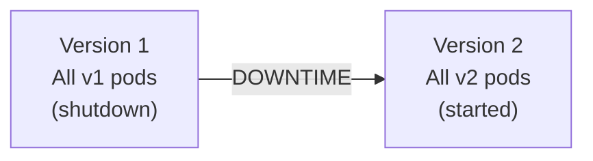
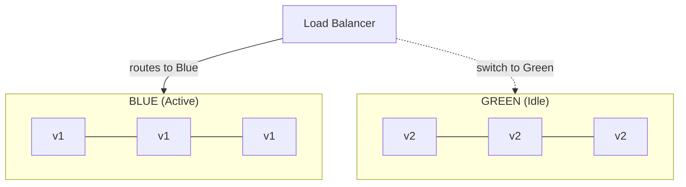
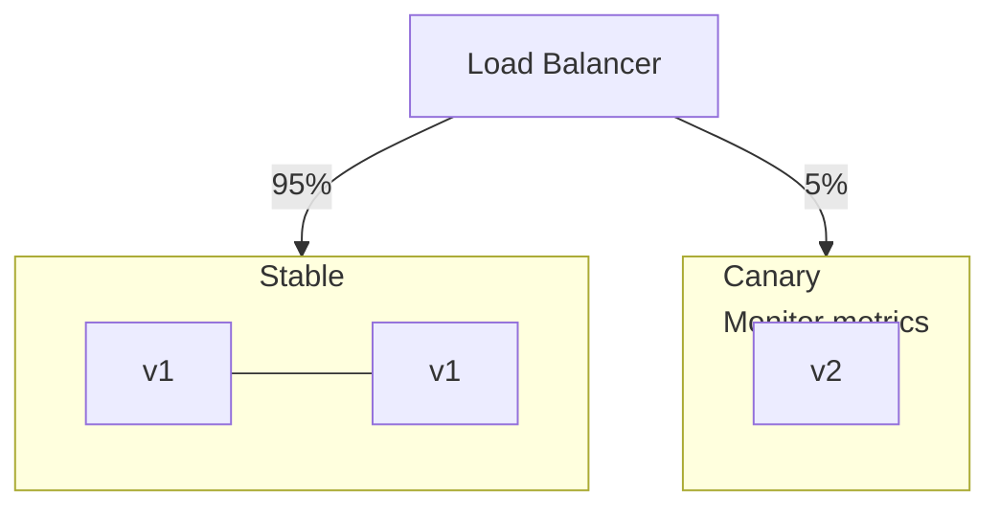
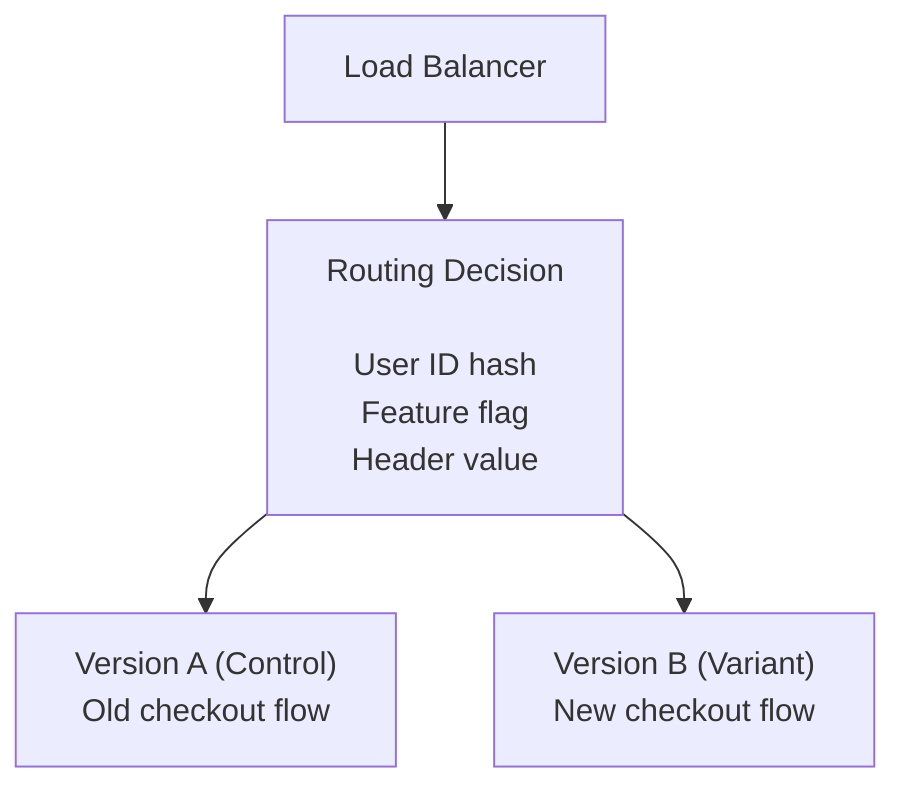
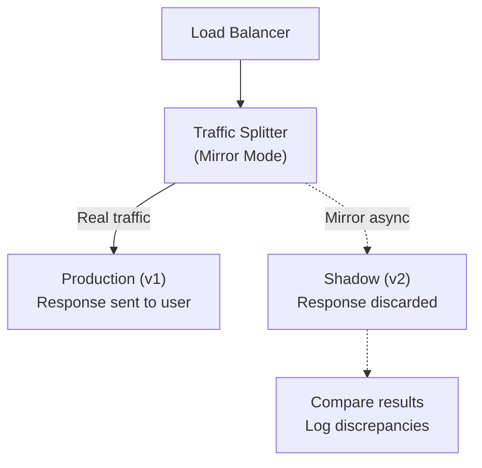

# デプロイメント戦略

> **注記:** このドキュメントは英語版からの翻訳です。最新の内容や正確な情報については、[英語版オリジナル](../../15-deployment/01-deployment-strategies.md)を参照してください。

## 要約

デプロイメント戦略は、ソフトウェアの新バージョンをリリースする方法を管理します。Blue-Green は即時ロールバックを提供し、カナリアはブラストラディウスを縮小し、ローリングアップデートはリソース使用量を最小化します。リスク許容度、リソース制約、ロールバック要件に基づいて選択してください。

---

## デプロイメントの課題

```
ソフトウェアのデプロイにはリスクがあります:
- 新しいコードにバグがある可能性
- 依存関係の振る舞いが異なる可能性
- スケールにより問題が顕在化する可能性
- ユーザーの行動が予期しない可能性

安全なデプロイの目標:
✓ ブラストラディウスの最小化（影響を受けるユーザー）
✓ 高速ロールバックの実現
✓ デプロイ中の可用性維持
✓ フルロールアウト前の本番環境での検証
```

---

## Recreate（ビッグバン）

### 動作の仕組み



```yaml
# Kubernetes Recreate Strategy
apiVersion: apps/v1
kind: Deployment
metadata:
  name: my-app
spec:
  replicas: 3
  strategy:
    type: Recreate
  template:
    spec:
      containers:
        - name: app
          image: my-app:v2
```

### トレードオフ

```
メリット:
✓ シンプル
✓ クリーンな状態（バージョン混在なし）
✓ 複数バージョンを実行できないステートフルアプリに適する

デメリット:
✗ デプロイ中のダウンタイム
✗ 段階的なロールアウトなし
✗ 簡単なロールバックなし（v1 を再デプロイする必要）

適用場面:
- 開発/ステージング環境
- 計画的なメンテナンスウィンドウが許容される場合
- 単一バージョンが必要なデータベースマイグレーション
```

---

## ローリングアップデート

### 動作の仕組み

```
Time T1: ██ v1  ██ v1  ██ v1  ░░ --  ░░ --
Time T2: ██ v1  ██ v1  ██ v2  ░░ --  ░░ --
Time T3: ██ v1  ██ v2  ██ v2  ░░ --  ░░ --
Time T4: ██ v2  ██ v2  ██ v2  ░░ --  ░░ --

段階的な置き換え:
- 新しい Pod を作成
- 古い Pod を終了
- トラフィックが自然に移行
```

```yaml
# Kubernetes Rolling Update (default)
apiVersion: apps/v1
kind: Deployment
metadata:
  name: my-app
spec:
  replicas: 5
  strategy:
    type: RollingUpdate
    rollingUpdate:
      maxSurge: 1        # Max pods above desired count
      maxUnavailable: 1  # Max pods below desired count
  template:
    spec:
      containers:
        - name: app
          image: my-app:v2
          readinessProbe:  # Critical for rolling updates!
            httpGet:
              path: /health
              port: 8080
            initialDelaySeconds: 5
            periodSeconds: 5
```

### ロールアウト進捗

```
$ kubectl rollout status deployment/my-app
Waiting for deployment "my-app" rollout to finish: 2 out of 5 new replicas have been updated...
Waiting for deployment "my-app" rollout to finish: 3 out of 5 new replicas have been updated...
Waiting for deployment "my-app" rollout to finish: 4 out of 5 new replicas have been updated...
Waiting for deployment "my-app" rollout to finish: 5 out of 5 new replicas have been updated...
deployment "my-app" successfully rolled out

# 問題がある場合はロールバック
$ kubectl rollout undo deployment/my-app
```

### トレードオフ

```
メリット:
✓ ゼロダウンタイム
✓ 段階的なロールアウト
✓ リソース効率が良い
✓ Kubernetes に組み込み済み

デメリット:
✗ v1 と v2 が同時に実行される
✗ ロールバックに時間がかかる（別のローリングアップデート）
✗ レプリカ数が多いとデプロイ時間が長い
✗ トラフィック制御なし（ランダム分配）

適用場面:
- アプリケーションが複数バージョン同時実行を許容
- 標準的な Web サービス
- トラフィック制御が不要
```

---

## Blue-Green デプロイメント

### 動作の仕組み



```
切り替え: LB を Green に向ける
ロールバック: LB を Blue に戻す（即時）
```

### Kubernetes での実装

```yaml
# Blue deployment
apiVersion: apps/v1
kind: Deployment
metadata:
  name: my-app-blue
spec:
  replicas: 3
  selector:
    matchLabels:
      app: my-app
      version: blue
  template:
    metadata:
      labels:
        app: my-app
        version: blue
    spec:
      containers:
        - name: app
          image: my-app:v1
---
# Green deployment
apiVersion: apps/v1
kind: Deployment
metadata:
  name: my-app-green
spec:
  replicas: 3
  selector:
    matchLabels:
      app: my-app
      version: green
  template:
    metadata:
      labels:
        app: my-app
        version: green
    spec:
      containers:
        - name: app
          image: my-app:v2
---
# Service (switch by changing selector)
apiVersion: v1
kind: Service
metadata:
  name: my-app
spec:
  selector:
    app: my-app
    version: blue  # Change to 'green' to switch
  ports:
    - port: 80
      targetPort: 8080
```

### 切り替えスクリプト

```bash
#!/bin/bash

# switch-traffic.sh
CURRENT=$(kubectl get svc my-app -o jsonpath='{.spec.selector.version}')
NEW_VERSION=${1:-$([ "$CURRENT" = "blue" ] && echo "green" || echo "blue")}

echo "Current version: $CURRENT"
echo "Switching to: $NEW_VERSION"

# Ensure new version is healthy
kubectl rollout status deployment/my-app-$NEW_VERSION

# Switch traffic
kubectl patch svc my-app -p "{\"spec\":{\"selector\":{\"version\":\"$NEW_VERSION\"}}}"

echo "Traffic switched to $NEW_VERSION"
```

### トレードオフ

```
メリット:
✓ 即時ロールバック（戻すだけ）
✓ 切り替え前に新バージョンのテストが容易
✓ クリーンなカットオーバー（バージョン混在なし）
✓ デプロイ時間が予測可能

デメリット:
✗ インフラコストが2倍
✗ 状態の同期（データベース）
✗ 長時間接続が切断される可能性
✗ 段階的なトラフィックシフトなし

適用場面:
- 即時ロールバックが重要
- 2倍のリソースを確保できる
- アプリケーションがバージョン混在を許容しない
- 本番環境でのテストが必要
```

---

## カナリアデプロイメント

### 動作の仕組み



```
進行:
5% → 10% → 25% → 50% → 100%
（各段階でメトリクスが良好な場合）
```

### Istio によるトラフィック分割

```yaml
# DestinationRule - Define subsets
apiVersion: networking.istio.io/v1beta1
kind: DestinationRule
metadata:
  name: my-app
spec:
  host: my-app
  subsets:
    - name: stable
      labels:
        version: v1
    - name: canary
      labels:
        version: v2
---
# VirtualService - Traffic split
apiVersion: networking.istio.io/v1beta1
kind: VirtualService
metadata:
  name: my-app
spec:
  hosts:
    - my-app
  http:
    - route:
        - destination:
            host: my-app
            subset: stable
          weight: 95
        - destination:
            host: my-app
            subset: canary
          weight: 5
```

### Flagger による自動カナリア

```yaml
apiVersion: flagger.app/v1beta1
kind: Canary
metadata:
  name: my-app
spec:
  targetRef:
    apiVersion: apps/v1
    kind: Deployment
    name: my-app
  service:
    port: 80
  analysis:
    interval: 1m
    threshold: 5
    maxWeight: 50
    stepWeight: 10
    metrics:
      - name: request-success-rate
        thresholdRange:
          min: 99
        interval: 1m
      - name: request-duration
        thresholdRange:
          max: 500
        interval: 1m
    webhooks:
      - name: load-test
        url: http://flagger-loadtester/
        timeout: 5s
        metadata:
          cmd: "hey -z 1m -q 10 -c 2 http://my-app-canary/"
```

### カナリアの監視メトリクス

```python
# Key metrics for canary analysis
canary_metrics = {
    # Success rate
    'error_rate': {
        'query': 'sum(rate(http_requests_total{status=~"5.."}[5m])) / sum(rate(http_requests_total[5m]))',
        'threshold': 0.01  # <1% errors
    },

    # Latency
    'p99_latency': {
        'query': 'histogram_quantile(0.99, rate(http_request_duration_seconds_bucket[5m]))',
        'threshold': 0.5  # <500ms
    },

    # Saturation
    'cpu_usage': {
        'query': 'avg(rate(container_cpu_usage_seconds_total{pod=~"my-app-canary.*"}[5m]))',
        'threshold': 0.8  # <80%
    },

    # Business metrics
    'conversion_rate': {
        'query': 'sum(rate(orders_completed_total[5m])) / sum(rate(checkout_started_total[5m]))',
        'threshold': 0.03  # Similar to baseline
    }
}

def should_promote_canary(metrics):
    for name, config in canary_metrics.items():
        value = query_prometheus(config['query'])
        if value > config['threshold']:
            return False, f"{name} exceeded threshold: {value} > {config['threshold']}"
    return True, "All metrics healthy"
```

### トレードオフ

```
メリット:
✓ ブラストラディウスが最小
✓ 実際の本番トラフィックでのテスト
✓ 検証付きの段階的ロールアウト
✓ 簡単なロールバック（トラフィックを戻す）
✓ プロモーション/ロールバックの自動化が可能

デメリット:
✗ 複雑なトラフィックルーティング設定
✗ 良好なオブザーバビリティが必要
✗ デプロイ時間が長い
✗ v1 と v2 が同時に実行される
✗ 状態管理の複雑さ

適用場面:
- 高リスクな変更
- 良好なオブザーバビリティが整備済み
- 長いデプロイ時間を許容できる
- 実トラフィックでの検証が必要
```

---

## A/B テストデプロイメント

### 動作の仕組み



```
目的: どちらのバージョンがより良いパフォーマンスかを測定
（コンバージョン率、エンゲージメントなど）
```

### ヘッダー/Cookie によるルーティング

```yaml
# Istio VirtualService with header-based routing
apiVersion: networking.istio.io/v1beta1
kind: VirtualService
metadata:
  name: my-app
spec:
  hosts:
    - my-app
  http:
    # Route users with specific header to variant
    - match:
        - headers:
            x-experiment-group:
              exact: "variant-b"
      route:
        - destination:
            host: my-app
            subset: version-b

    # Default to control
    - route:
        - destination:
            host: my-app
            subset: version-a
```

### 一貫性のためのスティッキーセッション

```python
# Application-level A/B routing
import hashlib

def get_experiment_variant(user_id: str, experiment: str) -> str:
    """
    Deterministic assignment based on user ID
    Same user always gets same variant
    """
    hash_input = f"{user_id}:{experiment}"
    hash_value = int(hashlib.md5(hash_input.encode()).hexdigest(), 16)

    # 50/50 split
    if hash_value % 100 < 50:
        return "control"
    else:
        return "variant"

# Track in analytics
def track_experiment_exposure(user_id: str, experiment: str, variant: str):
    analytics.track(
        user_id=user_id,
        event="experiment_exposure",
        properties={
            "experiment": experiment,
            "variant": variant
        }
    )
```

---

## シャドウデプロイメント

### 動作の仕組み



### Istio ミラー設定

```yaml
apiVersion: networking.istio.io/v1beta1
kind: VirtualService
metadata:
  name: my-app
spec:
  hosts:
    - my-app
  http:
    - route:
        - destination:
            host: my-app
            subset: v1
      mirror:
        host: my-app
        subset: v2
      mirrorPercentage:
        value: 100.0  # Mirror 100% of traffic
```

### シャドウ結果の比較

```python
class ShadowComparator:
    def __init__(self):
        self.discrepancies = []

    def compare(self, production_response, shadow_response, request):
        if production_response.status_code != shadow_response.status_code:
            self.log_discrepancy(
                type="status_code",
                request=request,
                production=production_response.status_code,
                shadow=shadow_response.status_code
            )

        # Compare response bodies (ignoring timestamps, etc.)
        prod_body = self.normalize(production_response.json())
        shadow_body = self.normalize(shadow_response.json())

        if prod_body != shadow_body:
            diff = self.compute_diff(prod_body, shadow_body)
            self.log_discrepancy(
                type="response_body",
                request=request,
                diff=diff
            )

        # Compare latency
        latency_diff = shadow_response.elapsed - production_response.elapsed
        if abs(latency_diff.total_seconds()) > 0.5:  # >500ms difference
            self.log_discrepancy(
                type="latency",
                request=request,
                production_ms=production_response.elapsed.total_seconds() * 1000,
                shadow_ms=shadow_response.elapsed.total_seconds() * 1000
            )
```

### トレードオフ

```
メリット:
✓ ユーザーへのリスクゼロ（シャドウレスポンスは破棄）
✓ 実際の本番トラフィック
✓ 切り替え前に振る舞いを比較可能
✓ リファクタリングの検証に適する

デメリット:
✗ コンピュートコストが2倍
✗ 副作用（書き込み）の慎重な取り扱いが必要
✗ 実際のユーザー体験のテストにはならない
✗ 比較ロジックが複雑

適用場面:
- 大規模リファクタリング
- パフォーマンスの検証
- 実トラフィックパターンでのテスト
- 書き込み操作を冪等/分離可能にできる場合
```

---

## デプロイメント戦略の比較

| 戦略 | ダウンタイム | ロールバック | リスク | コスト |
|---|---|---|---|---|
| Recreate | あり | 低速 | 高 | 低 |
| ローリングアップデート | なし | 中程度 | 中 | 低 |
| Blue-Green | なし | 即時 | 中 | 高 |
| カナリア | なし | 高速 | 低 | 中 |
| シャドウ | なし | 該当なし | なし | 高 |

```
選択基準:
1. リスク許容度
2. 利用可能なリソース
3. 必要なロールバック速度
4. オブザーバビリティの成熟度
5. トラフィックルーティング能力
```

---

## 参考文献

- [Kubernetes Deployment Strategies](https://kubernetes.io/docs/concepts/workloads/controllers/deployment/)
- [Istio Traffic Management](https://istio.io/latest/docs/concepts/traffic-management/)
- [Flagger Progressive Delivery](https://flagger.app/)
- [Martin Fowler - Blue Green Deployment](https://martinfowler.com/bliki/BlueGreenDeployment.html)
- [Canary Releases - Danilo Sato](https://martinfowler.com/bliki/CanaryRelease.html)
