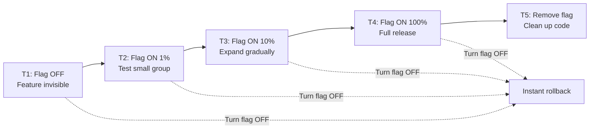
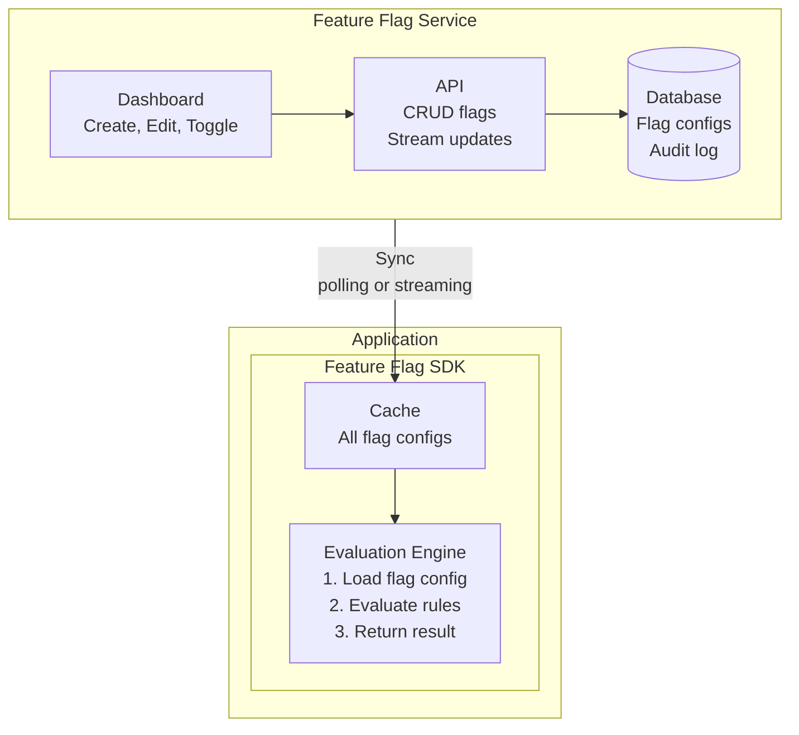
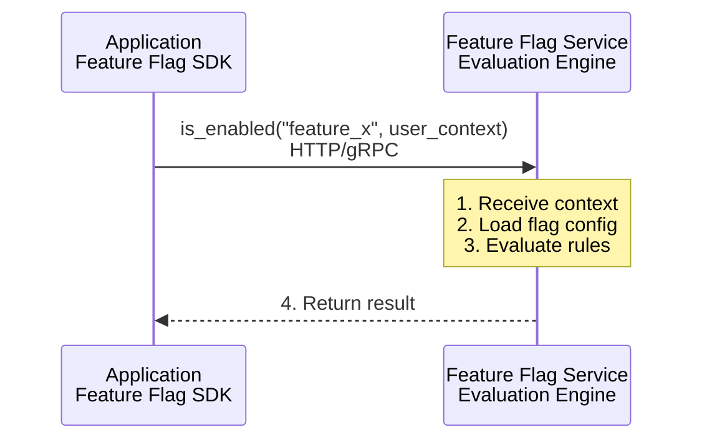

# フィーチャーフラグ

> **注記:** このドキュメントは英語版からの翻訳です。最新の内容や正確な情報については、[英語版オリジナル](../../15-deployment/02-feature-flags.md)を参照してください。

## 要約

フィーチャーフラグは、デプロイとリリースを分離し、本番環境に無効状態でコードをデプロイして段階的に有効化することを可能にします。トランクベース開発、安全なロールアウト、実験を実現します。ただし、複雑性が増すため、フラグのライフサイクル管理とクリーンアップを計画してください。

---

## なぜフィーチャーフラグか？

### デプロイ vs. リリース



```
分離:
- デプロイ: コードが本番環境に投入（低リスク）
- リリース: 機能がユーザーに有効化（制御可能）
- ロールバック: フラグを切り替え（即時、再デプロイ不要）
```

---

## フィーチャーフラグの種類

### リリースフラグ（短命）

```python
# Gradually roll out new feature
if feature_flags.is_enabled("new_checkout_flow", user_id):
    return new_checkout_flow(cart)
else:
    return old_checkout_flow(cart)

# ライフサイクル:
# 1. フラグ OFF でデプロイ
# 2. 社内ユーザーに有効化
# 3. 1%, 10%, 50%, 100% で有効化
# 4. フラグを削除し、古いコードも削除
```

### 実験フラグ（一時的）

```python
# A/B test different variants
variant = feature_flags.get_variant("checkout_button_color", user_id)

if variant == "control":
    button_color = "blue"
elif variant == "variant_a":
    button_color = "green"
elif variant == "variant_b":
    button_color = "red"

# Track conversion
analytics.track("checkout_completed", {
    "experiment": "checkout_button_color",
    "variant": variant
})

# ライフサイクル:
# 1. 統計的有意性が得られるまで実験を実行
# 2. 結果を分析
# 3. 勝者を選択し、フラグを削除
```

### 運用フラグ（長命）

```python
# Circuit breaker / kill switch
if feature_flags.is_enabled("enable_recommendations_service"):
    recommendations = recommendations_service.get(user_id)
else:
    recommendations = []  # Graceful degradation

# ライフサイクル: 長命、運用制御に使用
```

### 権限フラグ（長命）

```python
# Entitlements / premium features
if feature_flags.is_enabled("premium_analytics", user_id):
    show_advanced_analytics()
else:
    show_upgrade_prompt()

# ライフサイクル: 長命、ビジネスロジックに紐付く
```

---

## フラグの評価

### シンプルなブーリアン

```python
class SimpleFlag:
    def __init__(self, name: str, enabled: bool):
        self.name = name
        self.enabled = enabled

    def is_enabled(self) -> bool:
        return self.enabled
```

### パーセンテージロールアウト

```python
import hashlib

class PercentageFlag:
    def __init__(self, name: str, percentage: int):
        self.name = name
        self.percentage = percentage  # 0-100

    def is_enabled(self, user_id: str) -> bool:
        # Consistent hashing: same user always gets same result
        hash_input = f"{self.name}:{user_id}"
        hash_value = int(hashlib.md5(hash_input.encode()).hexdigest(), 16)
        bucket = hash_value % 100
        return bucket < self.percentage

# 10% rollout
flag = PercentageFlag("new_feature", 10)
flag.is_enabled("user_123")  # True or False (consistent for this user)
```

### ターゲティングルール

```python
class TargetedFlag:
    def __init__(self, name: str, rules: list):
        self.name = name
        self.rules = rules  # Evaluated in order

    def is_enabled(self, context: dict) -> bool:
        for rule in self.rules:
            if rule.matches(context):
                return rule.result
        return False  # Default

# Example rules
rules = [
    # Rule 1: Internal users always on
    Rule(
        condition=lambda ctx: ctx.get("email", "").endswith("@company.com"),
        result=True
    ),
    # Rule 2: Beta users
    Rule(
        condition=lambda ctx: ctx.get("user_id") in beta_user_list,
        result=True
    ),
    # Rule 3: 10% of remaining users
    Rule(
        condition=lambda ctx: percentage_check(ctx.get("user_id"), 10),
        result=True
    ),
    # Rule 4: Default off
    Rule(
        condition=lambda ctx: True,
        result=False
    )
]
```

### 多変量フラグ

```python
class MultivariateFlag:
    def __init__(self, name: str, variants: list):
        self.name = name
        self.variants = variants  # [("control", 50), ("variant_a", 25), ("variant_b", 25)]

    def get_variant(self, user_id: str) -> str:
        hash_input = f"{self.name}:{user_id}"
        hash_value = int(hashlib.md5(hash_input.encode()).hexdigest(), 16)
        bucket = hash_value % 100

        cumulative = 0
        for variant_name, percentage in self.variants:
            cumulative += percentage
            if bucket < cumulative:
                return variant_name

        return self.variants[0][0]  # Default to first
```

---

## 実装アーキテクチャ

### クライアントサイド評価



```
メリット: 低レイテンシ、オフラインでも動作
デメリット: すべてのフラグがクライアントに送信（サイズ）、同期遅延
```

### サーバーサイド評価



```
メリット: 機密ルールがサーバーサイドに留まる、常に最新
デメリット: レイテンシ、ネットワーク依存
```

### ハイブリッドアプローチ

```python
class HybridFeatureFlags:
    def __init__(self):
        self.local_cache = {}
        self.evaluation_service = FeatureFlagService()

    def is_enabled(self, flag_name: str, context: dict) -> bool:
        # Check local cache first
        cached = self.local_cache.get(flag_name)
        if cached and not cached.requires_server_evaluation:
            return cached.evaluate(context)

        # Fall back to server for complex rules
        return self.evaluation_service.evaluate(flag_name, context)

    def sync_flags(self):
        """Background sync of flags that can be evaluated locally"""
        simple_flags = self.evaluation_service.get_all_simple_flags()
        self.local_cache.update(simple_flags)
```

---

## SDK の実装

### Python SDK の例

```python
import requests
import threading
import time
from typing import Optional, Dict, Any

class FeatureFlagClient:
    def __init__(self, sdk_key: str, base_url: str = "https://flags.example.com"):
        self.sdk_key = sdk_key
        self.base_url = base_url
        self.flags: Dict[str, Any] = {}
        self._start_polling()

    def _start_polling(self):
        def poll():
            while True:
                try:
                    self._fetch_flags()
                except Exception as e:
                    print(f"Failed to fetch flags: {e}")
                time.sleep(30)  # Poll every 30 seconds

        thread = threading.Thread(target=poll, daemon=True)
        thread.start()

    def _fetch_flags(self):
        response = requests.get(
            f"{self.base_url}/api/flags",
            headers={"Authorization": f"Bearer {self.sdk_key}"}
        )
        response.raise_for_status()
        self.flags = response.json()

    def is_enabled(
        self,
        flag_key: str,
        user_id: Optional[str] = None,
        attributes: Optional[Dict] = None,
        default: bool = False
    ) -> bool:
        flag = self.flags.get(flag_key)
        if not flag:
            return default

        return self._evaluate(flag, user_id, attributes or {})

    def _evaluate(self, flag: dict, user_id: str, attributes: dict) -> bool:
        if not flag.get("enabled"):
            return False

        # Check targeting rules
        for rule in flag.get("rules", []):
            if self._matches_rule(rule, user_id, attributes):
                return rule.get("result", False)

        # Percentage rollout
        if percentage := flag.get("percentage"):
            return self._percentage_check(flag["key"], user_id, percentage)

        return flag.get("default", False)

# Usage
flags = FeatureFlagClient(sdk_key="sdk-key-123")

if flags.is_enabled("new_checkout", user_id="user_123"):
    show_new_checkout()
else:
    show_old_checkout()
```

---

## ベストプラクティス

### フラグの命名規則

```python
# 良い名前 - 説明的、一貫性がある
"enable_new_checkout_flow"
"experiment_homepage_hero_variant"
"ops_circuit_breaker_recommendations"
"permission_premium_analytics"

# 悪い名前
"flag1"
"test"
"johns_feature"
"temporary_fix_delete_later"  # 削除されることはない
```

### フラグのライフサイクル管理

```python
class FlagLifecycle:
    """Track flag status and enforce cleanup"""

    STATES = ["planning", "development", "testing", "rollout", "complete", "cleanup"]

    def __init__(self, flag_name: str):
        self.flag_name = flag_name
        self.state = "planning"
        self.created_at = datetime.now()
        self.owner = None
        self.cleanup_deadline = None

    def transition(self, new_state: str):
        if new_state == "rollout":
            # Set cleanup deadline when rollout starts
            self.cleanup_deadline = datetime.now() + timedelta(days=30)
        self.state = new_state

    def is_overdue_for_cleanup(self) -> bool:
        if self.state in ["complete", "cleanup"]:
            return datetime.now() > self.cleanup_deadline
        return False

# Automated cleanup reminders
def send_cleanup_reminders():
    for flag in get_all_flags():
        if flag.is_overdue_for_cleanup():
            send_reminder(
                to=flag.owner,
                subject=f"Feature flag '{flag.flag_name}' needs cleanup",
                body=f"Flag has been at 100% for over 30 days. Please remove."
            )
```

### フラグ負債の回避

```python
# 悪い例: ネストされたフラグ（推論が困難）
if flags.is_enabled("feature_a"):
    if flags.is_enabled("feature_b"):
        if flags.is_enabled("feature_c"):
            do_something()

# 改善: 明確な意図を持つ単一フラグ
if flags.is_enabled("feature_abc_combined"):
    do_something()

# 悪い例: 共有コード内のフラグ（すべてに影響）
def get_price(product):
    price = product.base_price
    if flags.is_enabled("new_pricing"):  # 範囲が広すぎる！
        price = calculate_new_price(product)
    return price

# 改善: 具体的なスコープ
def get_price(product, context):
    if context.feature == "checkout" and flags.is_enabled("new_pricing_checkout"):
        return calculate_new_price(product)
    return product.base_price
```

### フラグを使ったテスト

```python
import pytest
from unittest.mock import patch

class TestCheckoutWithFlags:
    def test_new_checkout_enabled(self):
        with patch('app.flags.is_enabled', return_value=True):
            result = process_checkout(cart)
            assert result.used_new_flow == True

    def test_new_checkout_disabled(self):
        with patch('app.flags.is_enabled', return_value=False):
            result = process_checkout(cart)
            assert result.used_new_flow == False

    def test_both_flows_produce_same_result(self):
        """Ensure new and old flow are functionally equivalent"""
        cart = create_test_cart()

        with patch('app.flags.is_enabled', return_value=False):
            old_result = process_checkout(cart)

        with patch('app.flags.is_enabled', return_value=True):
            new_result = process_checkout(cart)

        assert old_result.total == new_result.total
        assert old_result.items == new_result.items
```

---

## フィーチャーフラグサービス

### LaunchDarkly

```python
import ldclient
from ldclient.config import Config

ldclient.set_config(Config("sdk-key-123"))
client = ldclient.get()

user = {
    "key": "user-123",
    "email": "user@example.com",
    "custom": {
        "plan": "premium",
        "country": "US"
    }
}

# Boolean flag
show_feature = client.variation("new-feature", user, False)

# Multivariate flag
button_color = client.variation("button-color", user, "blue")
```

### Unleash（オープンソース）

```python
from UnleashClient import UnleashClient

client = UnleashClient(
    url="https://unleash.example.com/api",
    app_name="my-app",
    custom_headers={"Authorization": "token"}
)
client.initialize_client()

# Check flag
if client.is_enabled("new-feature", context={"userId": "123"}):
    show_new_feature()

# With fallback
enabled = client.is_enabled("new-feature", fallback_function=lambda: False)
```

### 自作 vs. 購入

```
自作が適している場合:
- シンプルなユースケース（ブーリアンフラグのみ）
- プライバシー/コンプライアンス要件
- 限られた予算
- 学習/制御が優先

購入が適している場合:
- 高度なターゲティングが必要
- A/B テスト機能が組み込み
- 複数環境のサポート
- 監査/コンプライアンス機能
- 多言語対応の SDK
- インフラの保守を避けたい

人気のあるオプション:
- LaunchDarkly（エンタープライズ）
- Split.io（実験重視）
- Unleash（オープンソース）
- Flagsmith（オープンソース）
- ConfigCat（シンプル、手頃）
```

---

## アンチパターン

```
1. 永続的な「一時」フラグ
   - クリーンアップ期限を設定
   - 古いフラグにアラート

2. データモデルに影響するフラグ
   - ロールバックが困難
   - 代わりにデータマイグレーションを検討

3. フラグが多すぎる
   - 認知的オーバーヘッド
   - 相互作用の複雑性
   - 組織全体の制限を設定

4. ハッピーパスのみのテスト
   - 両方のフラグ状態をテスト
   - フラグの遷移をテスト

5. モニタリングなし
   - フラグの評価を追跡
   - 予期しない状態にアラート
```

---

## 参考文献

- [Feature Toggles - Martin Fowler](https://martinfowler.com/articles/feature-toggles.html)
- [LaunchDarkly Documentation](https://docs.launchdarkly.com/)
- [Unleash Documentation](https://docs.getunleash.io/)
- [Testing Feature Flags](https://launchdarkly.com/blog/testing-with-feature-flags/)
