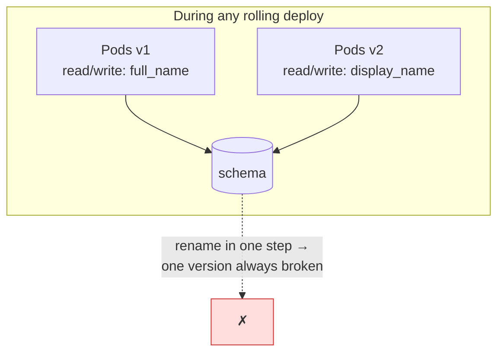
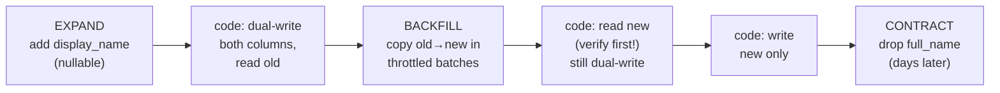

# データベーススキーママイグレーション

> **翻訳についての注記:** 本ドキュメントは英語原文 `15-deployment/03-database-migrations.md` を日本語に翻訳したものです。コードブロックおよびMermaidダイアグラムは原文のまま維持しています。

## TL;DR

スキーマ変更はデプロイです — 最もリスクの高い種類の。ステートフルで、しばしばロックを取り、ほとんど不可逆だからです。安全なマイグレーションはすべて2つのルールから生成されます: **(1)** スキーマ変更とコード変更を1ステップに結合しない — どのスキーマバージョンも前のコードバージョンと次のコードバージョンの両方で動かなければなりません(N−1互換性)。デプロイはローリングであり、ロールバックは起きるからです。**(2)** すべての破壊的変更を**expand → migrate → contract**に分解する: 新しい形を古い形の隣に追加し、二重書き込みしてバックフィルし、読み取りを切り替え、検証後にのみ古い形を削除します。大きなテーブルにはオンラインDDLの仕組み(`CREATE INDEX CONCURRENTLY`、`NOT VALID` 制約、gh-ost)を使い、バックフィルはスロットルされた冪等なバッチジョブとして実行し、マイグレーションはCIでlintし、**ロールフォワード**を計画します — データを落とすダウンマイグレーションはフィクションです。

---

## なぜ素朴なマイグレーションは障害を起こすのか

`ALTER TABLE` は開発環境(1,000行)では無害に見え、本番(10億行)ではロックを取ります。2つの異なる失敗クラス:

**ロック。** DDLは一般に(短時間か、操作の間中)排他ロックを必要とします。Postgresの「瞬時」DDLでさえ `ACCESS EXCLUSIVE` ロックの*取得*は必要です — そして長時間実行中のクエリ1つの後ろに並ぶと、以降のすべてのクエリが*その後ろ*に並びます: 1ミリ秒の変更が数分の障害を起こします。DDLは常に `lock_timeout`(例: 2秒)+リトライ付きで実行し、競合したロック取得を世界を止めずに高速に失敗させます。

**バージョンスキュー。** デプロイはローリングです: 数分間(カナリアなら数時間)、旧コードと新コードが1つのスキーマに対して同時に動きます — ロールバックはそれを数日に延ばしえます。1ステップで列をリネームすれば、旧Podは即座にクラッシュします:



よって契約は: **スキーマ変更Nはコードバージョン N−1 と N に互換でなければならない。** これは直ちに、単一ステップとしての列/テーブルのリネーム、列型の変更、既存列への `NOT NULL` 追加、まだ参照されているものの削除を禁止します。それらはすべて複数ステップのダンスになります。

### 操作の安全性リファレンス

| 操作 | Postgres | MySQL (8.0/InnoDB) |
|---|---|---|
| nullable列の追加(デフォルト書き換えなし) | ✅ 瞬時 | ✅ 瞬時 |
| 列追加+揮発性デフォルト | ✅ (11+: 書き換えなし) | ⚠️ しばしば書き換え |
| インデックス作成 | ⚠️ `CONCURRENTLY` を使う | ✅ inplace(それでもI/O重) |
| FK / CHECK制約の追加 | ⚠️ `NOT VALID` + `VALIDATE` | ⚠️ フルスキャン |
| `NOT NULL` の追加 | ⚠️ `CHECK NOT VALID` 経由 | ⚠️ inplace、負荷下でロック |
| 列型/PK型の変更 | ❌ expand-contract | ❌ expand-contract か gh-ost |
| 列/テーブルのリネーム | ❌ expand-contract(メタデータ的には速いがN−1コードを壊す) | 同左 |
| 列の削除 | ⚠️ contractステップとしてのみ | 同左 |

(`strong_migrations` や `squawk` のようなツールは、まさにこの表をCIのlintルールとしてエンコードしています — 記憶に頼らず採用してください。)

---

## Expand → Migrate → Contract

普遍のレシピを、典型的な難ケース — ホットなテーブルでの `full_name` から `display_name` へのリネーム — で示します:



1. **Expand(スキーマ):** `ALTER TABLE users ADD COLUMN display_name text;` — 追加的、瞬時、v1コードには不可視。
2. **二重書き込み(コードデプロイ):** 書き込みは両方の列を埋め、読み取りはまだ旧列を使う。重要なのは、このステップが完全にロールバック安全であること。
3. **バックフィル(データジョブ):** 過去の行をコピー — 下記参照。新しい書き込みは二重書き込みで既に正しいので、バックフィルは履歴だけを追います。
4. **検証:** 不一致を数え(`WHERE full_name IS DISTINCT FROM display_name`)、サンプルをチェックサムし、理想的には**シャドーリード** — 両方読んで比較し、差分をログし、旧値を返す。代表的な期間で差分ゼロがゲートです。
5. **読み取り切替(コードデプロイ):** 新列を読む。二重書き込みは継続し、ステップ4へのロールバックを自明に保つ。
6. **新列のみ書き込み(コードデプロイ):** 旧列に触れるのをやめる。
7. **Contract(スキーマ):** 旧列を削除 — *数日後*、もうロールバックがそれを必要としないと確信してから。そして他に読むものがないことを確認してから(ビュー、レポート、[CDCコンシューマ](../13-data-pipelines/04-change-data-capture.md) — 削除された列は変更ストリームからも消えます)。

すべてのステップが個別にデプロイ可能、個別に(contractまでは)可逆、N−1互換です。同じ骨格が型変更(悪名高い `int → bigint` 主キーマイグレーションを含む: 新列、二重書き込み、バックフィル、短いリネームトランザクションでの入れ替え)、テーブル分割、データベース間のデータ移動を扱います — 変わるのは二重書き込み/二重読みの配管だけです。フィーチャーフラグは読み取り切替ステップと自然に対になります([フィーチャーフラグ](./02-feature-flags.md)): 読み取りを徐々に切り替え、エラー率を比較し、即座に戻せます。

### スケールでのバックフィル

バックフィルは、データベースを爆発半径に持つバッチジョブです。要件:

```python
def backfill(batch_size=2000, max_replica_lag_s=5):
    last_id = checkpoint.load()                      # resumable
    while True:
        rows = db.execute("""
            UPDATE users SET display_name = full_name
            WHERE id > %s AND id <= %s AND display_name IS NULL
            RETURNING max(id)""", last_id, last_id + batch_size)
        if rows.empty: break
        last_id = rows.max_id
        checkpoint.save(last_id)                     # idempotent restarts
        while replica_lag() > max_replica_lag_s:     # throttle on real signals
            time.sleep(1)
```

- **主キーレンジでバッチ**(OFFSETではなく)、トランザクションは短く、バッチごとにコミット。
- **実測の健全性でスロットル** — レプリカ遅延、p99レイテンシ — 固定スリープではなく。最初に遅くなるべきはこのジョブであって、ユーザーではありません。([バックプレッシャー](../06-scaling/07-backpressure.md))
- **冪等+チェックポイント:** `IS NULL` ガードが再実行を安全にし、チェックポイントが再開を安価にします。長いバックフィルは*必ず*中断されます。
- 10億行のテーブルでは、バックフィルを本物の[バッチパイプライン](../13-data-pipelines/01-batch-processing.md)として実行し、分ではなく日を予算に。退屈さがゴールです。

---

## オンラインDDLの仕組み

操作自体が大きなテーブルを書き換える場合は、ノンブロッキングの機構を使います:

**Postgres。**
- `CREATE INDEX CONCURRENTLY` — 書き込みをブロックせずに構築(遅い。トランザクション内では実行不可。失敗時は `INVALID` インデックスが残るので削除して再試行)。
- 制約は2段階で: `ALTER TABLE ... ADD CONSTRAINT ... NOT VALID`(瞬時 — 新しい書き込みにのみ強制)、その後 `VALIDATE CONSTRAINT`(軽いロックだけのフルスキャン)。大きなテーブルでの `NOT NULL` への正規ルートは `NOT VALID` のCHECK制約経由です。
- すべてのDDLを `SET lock_timeout = '2s'` + リトライループで包む。

**MySQL。**
- InnoDBのオンラインDDL(`ALGORITHM=INPLACE/INSTANT`)は多くのケースをカバーしますが、巨大テーブルでは依然オブジェクトレベルかつI/Oバウンドです。
- **gh-ost**(GitHub)は一般のケースを外部から解決します: 新スキーマのゴーストテーブルを作り、行をバッチでコピーし、進行中の変更を**binlogの追尾**で適用し(トリガーなし — トリガーを使い書き込みオーバーヘッドを足す `pt-online-schema-change` と異なる)、最後に名前をアトミックに入れ替えます。一時停止可能、レプリカ遅延でスロットル可能、リハーサル可能。

これのマネージド版(PlanetScaleのデプロイリクエスト等)は同じゴーストテーブルの仕組みの製品化です — *差し戻し可能な*スキーマ変更という追加とともに。それが進行方向です。

---

## デリバリーパイプラインの中のマイグレーション

- **マイグレーションはコード:** バージョン管理されたファイル(Flyway/Alembic/golang-migrate/Rails)を、2つのデプロイが競合しないようアドバイザリロック付きの自動化で適用し([CI/CDとGitOps](./04-cicd-gitops.md))、スキーマ履歴テーブルに記録します。本番で人間が手でDDLを実行しないこと。
- **操作の順序:** expandフェーズのマイグレーションは、それを使うコードのロールアウト*前*に適用。contractフェーズのマイグレーションは、古い形を使わなくなったコードが完全にロールアウトされ、**そこより前へのロールバックを放棄すると決めた後**に適用。前者は自動化し、後者は人間のゲートにします。
- **CIでlint:** 危険な操作(上の表)を機械的に拒否 — `squawk`、`strong_migrations`、または独自ルール。すべてのマイグレーションを現実的サイズのデータセットクローンで実行する(最低でもロックを `EXPLAIN` する)CIチェックを足すこと。
- **ロールフォワードを計画する。** 自動生成のダウンマイグレーションはデータを失うか(`DROP COLUMN` をどう戻す?)、嘘をつきます。「down」はこう扱います: 互換性を回復する新しい*前進*マイグレーションを出荷する。expand/contractの規律こそがこれを安全にします — どの時点でも*前の*コードバージョンが動き続けることが、唯一意味のあるロールバックだからです。
- **DMLとDDLを1つのマイグレーションファイルに混ぜない:** スキーマステップは速くロックに敏感、データステップは遅くスロットルに敏感。違うツール、違う監督です。

---

## チェックリスト

- [ ] すべてのマイグレーションがN−1互換(旧コードが新スキーマで動く)
- [ ] 破壊的変更はexpand → migrate → contractに分解され、各ステップが個別にデプロイされる
- [ ] すべてのDDLに `lock_timeout` + リトライ。大きなテーブルには `CONCURRENTLY` / `NOT VALID` / gh-ost
- [ ] バックフィル: PKレンジのバッチ、冪等、チェックポイント付き、レプリカ遅延でスロットル
- [ ] 読み取り切替前の検証ゲート(カウント/チェックサム/シャドーリード)。段階的切替にフラグ
- [ ] contractステップはロールバック地平線の後まで遅延。下流の読者(ビュー、CDC、レポート)を確認済み
- [ ] CIがマイグレーションの危険操作をlint。適用は自動化され直列化される
- [ ] ロールバックの物語 = ロールフォワード。クローンでテスト済み、信仰ではなく

---

## 参考文献

- [gh-ost](https://github.com/github/gh-ost) — GitHubのトリガーレスオンラインスキーマ変更。設計ドキュメントは必読
- [pt-online-schema-change](https://docs.percona.com/percona-toolkit/pt-online-schema-change.html) — トリガーベースの先行ツール
- [strong_migrations](https://github.com/ankane/strong_migrations) / [squawk](https://github.com/sbdchd/squawk) — 上記ルールをエンコードした危険操作linter
- [PostgreSQL: lock levels of DDL](https://www.postgresql.org/docs/current/explicit-locking.html) / [Braintree: PostgreSQL migrations without downtime](https://medium.com/paypal-tech/postgresql-at-scale-database-schema-changes-without-downtime-20d3749ed680)
- [Evolutionary Database Design](https://martinfowler.com/articles/evodb.html) — Fowler & Sadalage; expand/contractの起源
