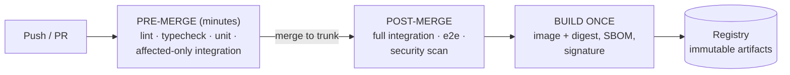
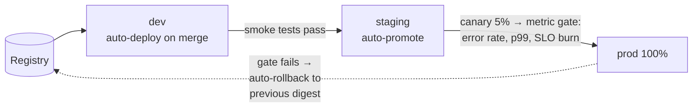
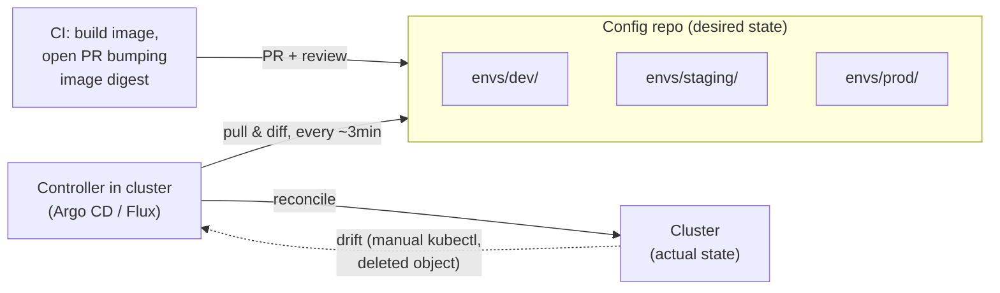

# CI/CDとGitOps

> **翻訳についての注記:** 本ドキュメントは英語原文 `15-deployment/04-cicd-gitops.md` を日本語に翻訳したものです。コードブロックおよびMermaidダイアグラムは原文のまま維持しています。

## TL;DR

CI/CDは、人間が実行者ではなくレビュアーであるまま、コミットを稼働中のソフトウェアに変えるシステムです。**CI**: トランクベース開発と、mainを常にリリース可能に保つ高速で決定的なチェック。**CD**: 不変のアーティファクトを一度だけビルドし、*同じアーティファクト*を環境間で昇格させ、各昇格を自動化されたゲート(カナリアメトリクス、スモークテスト)で検証する — デプロイは退屈である度合いに正確に比例してルーチンになります。**GitOps**はデプロイ側の運用モデルです: すべての環境の望ましい状態が宣言的にgitに置かれ、クラスタ内のコントローラ(Argo CD、Flux)が現実をそこへ継続的に*調停*します — pushではなくpull — それにより、PRによる監査、ドリフト検知、revertによるロールバックが得られます。全体の機械はDORAの4指標で測ります。指標が連動するのは、同じ根本原因 — バッチサイズ — を共有しているからです。

---

## CI: トランクをリリース可能に保つ

**トランクベース開発が基盤です。** 短命なブランチ(数時間〜数日)を単一のトランクへマージし、未完成の機能は長命ブランチではなく[フィーチャーフラグ](./02-feature-flags.md)で隠します。長いブランチは在庫です: 利息のつく統合リスク。この記事の他のすべては、バッチサイズが小さいときに劇的にうまく機能します — それは文化論ではなく、待ち行列理論です。

**パイプラインはレイテンシ予算です。** プリマージのチェックは人間のワークフローをゲートするので、数分が持ち時間です: lint、型、ユニットテスト、そして*影響を受けるターゲットに絞った*統合テスト(モノレポではBazel/Nx/Turborepo型のグラフ認識選択)。高価な一式(フルe2e、ソーク、深いスキャン)はポストマージで実行します — そこでの失敗は*マージ*ではなく*リリース*をブロックし、マージした本人を呼び出します。譲れない性質が2つ:

- **決定的:** 密閉的なビルド(固定された依存、ロックされたツールチェーン、ネットワークの驚きなし)、共有可変状態のないテスト。フレーキーなスイートは存在しないスイートより悪い — エンジニアにリトライを押すこと、すなわち警報を無視することを訓練するからです。フレークは機械的に隔離(自動起票、自動無効化、消化リスト)し、信頼を腐らせないこと。
- **高速:** プリマージは10分未満を目標に。それを超えるとエンジニアは変更をまとめ始め、バッチサイズが敵になります。

**一度ビルドし、どこへでも昇格。** アーティファクト(コンテナイメージ。**ダイジェスト**で参照し、可変タグでは決して参照しない)は正確に一度ビルドされ、dev → staging → prodへ無変更で昇格されます。環境ごとの再ビルドは、stagingが検証したのとは別のバイナリをprodが動かすという意味です。ビルド時に来歴を付与し — SBOMと署名(Sigstore/cosign) — クラスタには署名済みダイジェストのみを許可します。その単一の制御が、アーティファクト改ざん経路の大半を閉じます。

---

## CD: 検証付きの昇格

デプロイはリリースの*力学*です。戦略自体(blue-green、カナリア、ローリング)は[デプロイ戦略](./01-deployment-strategies.md)で扱っており、`デプロイ ≠ リリース` — フラグが露出とロールアウトを分離します([フィーチャーフラグ](./02-feature-flags.md))。CDが加えるのは**昇格パイプライン**です:

- **ゲートは会議ではなくメトリクス。** 安定コホートと比較するカナリア分析(エラー率、レイテンシ、飽和。Argo Rollouts / Flaggerが自動化)が、変更諮問委員会の劇場を置き換えます。必要な人間の承認は*パイプライン内の記録されたゲート*であり、サイドチャネルではありません。
- **ロールバックはロールフォワードと同じ機構:** 前のダイジェストへ向け直すだけ。1アクションで、訓練済みで、CIシステムの健全性を要求しないこと(アーティファクトは既に存在する)。系としての規律: [データベースマイグレーション](./03-database-migrations.md)はexpand/contractに従い、前のコードバージョンが常に動くようにします — でなければ「ロールバック」は言葉であって、能力ではありません。
- ステートフルな変更の**操作順序**: expandフェーズのマイグレーション → コードのロールアウト → (かなり後で)contractフェーズのマイグレーション。パイプラインにエンコードし、記憶に頼らないこと。
- **環境は昇格のステージであり、雪片ではない。** stagingとprodの差分は設定(URL、スケール、シークレット)だけであるべきで、トポロジーであってはなりません。「stagingでは動いた」インシデントはすべて、誰も書き留めなかったその2環境の差分です。

---

## GitOps: スクリプトではなく調停

push型CD(パイプラインがクラスタへ `kubectl apply`/`terraform apply` する)は動きますが、3つの穴を残します: CIシステムがprodへの神の資格情報を持つこと、帯域外のドリフトを何も検知しないこと、「どこで何が動いているか?」が考古学になること。GitOpsは流れを反転します:

4つの性質が定義します(OpenGitOpsによる): 望ましい状態は**宣言的**、gitで**バージョン管理され不変**、エージェントが**自動的にpull**、そして**継続的に調停**。帰結:

- **gitによる監査とロールバック。** どの環境へのどの変更も、作者とレビューとrevertボタンを持つコミットです。ロールバック = `git revert` + 調停 — あらゆる変更と同じ経路なので、常にリハーサル済みです。
- **ドリフト検知。** 手で編集されたDeployment、削除されたConfigMap — コントローラは実際 ≠ 望ましいを見て、修正します(またはリソースごとの選択でアラート)。prodでの手動 `kubectl` が、現実の静かなフォークであることをやめます。
- **資格情報の反転。** クラスタがpullします。CIはprodの資格情報を決して持ちません。コントローラに必要なのはgitとレジストリへの読み取りだけ — どこへでも `apply` できるJenkins箱よりはるかに小さい爆発半径です。
- **ほぼ無料の災害復旧:** ゼロから再構築されたクラスタはリポジトリの宣言状態に収束します。(「ほぼ」: ステートフルなデータには[独自のDR](../06-scaling/09-multi-region-architecture.md)が要ります。)

### リポジトリ構成と、みんなが聞く質問

- **アプリリポジトリと設定リポジトリは分ける。** アプリのCIは、設定リポジトリに対してイメージダイジェストを上げるPRを開いて終わります。混ぜると設定変更がアプリCIを再起動し、権限が絡まります。
- **環境 = ディレクトリ。ブランチではない。** 共有ベース+環境別オーバーレイ(Kustomize/Helm)の `envs/{dev,staging,prod}/`。環境*ブランチ*はcherry-pickドリフトとマージ考古学を招きます。昇格はdiffできるファイル変更であり、パイプラインが自動化します(Kargo型の昇格ツール、またはボットPR)。
- **シークレットは平文でgitに置かない。** 実用的なモデルは2つ: git内で暗号化(SealedSecrets、SOPS — シークレットも同じ監査経路を通る)か、git内は参照のみ(External Secrets OperatorがVault/クラウドのシークレットマネージャから取得 — gitはポインタだけを持つ)。どちらかに決めること。場当たりの混在は漏れます。
- **スケールのパターン:** app-of-apps / ApplicationSetsで同じアプリを多数のクラスタ/リージョンに刻印します。設定リポジトリは稼働中のすべての台帳になります — それこそが望んだものです。

GitOpsはKubernetesの外にも適用されます — PRから駆動するTerraformのplan/apply(Atlantis型)はインフラに対する同じモデルです。原則は*gitがインターフェース、コントローラが実行者*。

---

## 機械を測る: DORA

4つの指標を、アンケートではなくパイプライン自体から:

| 指標 | エリート級の目安 | 実際に動かすもの |
|---|---|---|
| デプロイ頻度 | オンデマンド、1日複数回 | 小さなバッチ、トランクベース、自動ゲート |
| リードタイム(コミット→prod) | 1時間〜1日未満 | パイプラインのレイテンシ、手動ハンドオフの排除 |
| 変更失敗率 | 約5–15% | カナリアゲート、信頼できるテスト、フラグ |
| 復旧時間 | 1時間未満 | 1アクションの訓練済みロールバック。キルスイッチとしてのフラグ |

ペアは連動します — 速度と安定性は*トレードオフではありません*。バッチサイズが縮み検証が自動化されるほど、両方が改善します。それがDORA研究の実証的な核心であり、このアーキテクチャ全体の本当の論拠です。サービスごとに追跡し、傾向を見て、悪化するリードタイムはプラットフォームチームの本番インシデントとして扱うこと。

---

## アンチパターン

- **環境ブランチ**(`develop` → `staging` → `master` のマージ) — ドリフト、cherry-pick考古学、制御に見えてリスクを足すマージ儀式。
- **雪片のCI箱** — prodの資格情報と文書化されないプラグインを持つ手設定のJenkins: 最大のセキュリティ露出にして最も再現不能なシステム。パイプライン定義はリポジトリに、ランナーは家畜に。
- **環境ごとのアーティファクト再ビルド** — stagingはprodが決して動かさないバイナリを検証した。
- **標準作業としての手動prod `kubectl`** — そうした編集はすべて、次のデプロイが静かに巻き戻す(あるいはもっと悪いことに、巻き戻さない)監査外のドリフト。
- **誰も信用しないstaging** — 恒常的に赤いか、prodと大きく異なるなら、チームは迂回し、ゲートは飾りです。直すか、消すか。
- **フレーキーなスイートでの100%合格劇場** — 緑になるまでリトライは、テストを持たないことの遅いやり方。
- **唯一の安全装置としての承認ゲート** — 「承認」をクリックする人間が検証するのは権限であって、挙動ではありません。挙動を検証するのはメトリクスゲートです。

---

## 参考文献

- [Accelerate / DORA research](https://dora.dev/) — 速度と安定性の主張の証拠基盤
- *Continuous Delivery* — Humble & Farley; 基礎文献
- [Trunk-Based Development](https://trunkbaseddevelopment.com/)
- [OpenGitOps principles](https://opengitops.dev/) — 4性質の定義
- [Argo CD](https://argo-cd.readthedocs.io/) / [Flux](https://fluxcd.io/docs/) — 調停コントローラ; [Argo Rollouts](https://argoproj.github.io/rollouts/) / [Flagger](https://flagger.app/) — 自動カナリア分析
- [Sigstore](https://www.sigstore.dev/) / [SLSA](https://slsa.dev/) — アーティファクト署名とサプライチェーンレベル
