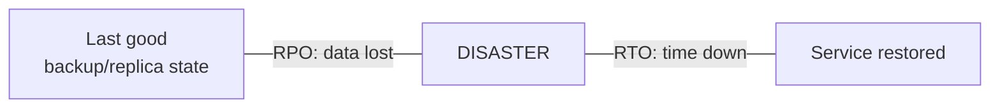
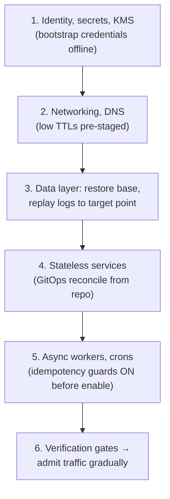

# ディザスタリカバリ

> **翻訳についての注記:** 本ドキュメントは英語原文 `15-deployment/05-disaster-recovery.md` を日本語に翻訳したものです。コードブロックおよびMermaidダイアグラムは原文のまま維持しています。

## TL;DR

高可用性(HA)はコンポーネント障害を生き延びます。**ディザスタリカバリ(DR)は相関した障害を生き延びます** — リージョン喪失、ランサムウェア、オペレーターの `DROP TABLE`、6日間静かにデータを壊し続けた悪いデプロイ。規律はこうです: システムを明示的な**RPO**(失ってよいデータ)と**RTO**(止まってよい時間)を持つティアに分類し、ティアごとにDR戦略を選び(バックアップ&リストア → パイロットライト → ウォームスタンバイ → マルチサイトアクティブ-アクティブ)、バックアップは**イミュータビリティ付きの3-2-1**に従い(レプリケーションはバックアップでは*ありません* — 破損を忠実に複製します)、**リストアをプロダクトとして**扱うこと: テストされていないバックアップは願望であり、テストされたリストアは能力です。成熟したチームを噛むのはバックアップの欠如ではなく — 瞬時にすべてへレプリケートされた論理破損が、すべての「冗長な」コピーがすでに間違ったデータで合意した後に発見されることです。ポイントインタイムリカバリ(PITR)と遅延レプリカだけが、この障害クラスへの防御です。

---

## 実際に何から守るのか

| 脅威 | HAで守れる? | 実際に救うもの |
|---|---|---|
| ディスク/ノード/AZ障害 | ✅ それがHAの仕事 | レプリケーション、マルチAZ([障害モード](../01-foundations/06-failure-modes.md)) |
| リージョン障害 | ❌ | クロスリージョンのスタンバイ+訓練済みフェイルオーバー([マルチリージョン](../06-scaling/09-multi-region-architecture.md)) |
| オペレーターのミス(`WHERE` なしの `DELETE`) | ❌ — レプリカはmsで適用する | PITR、遅延レプリカ、ソフトデリートの猶予 |
| 数日かけてデータを壊す悪いデプロイ | ❌ | PITR + 破損が*いつ*始まったかを見つける能力 |
| ランサムウェア / アカウント侵害 | ❌ — 攻撃者はまずバックアップを消す | 不変で、別の管理下にあるバックアップコピー |
| クラウドアカウントの削除 / 請求事故 / プロバイダ撤退 | ❌ | アカウント外、できればプロバイダ外のコピー |

右列のパターン: **HAの機構は障害と運命を共有し、DRの機構は共有してはならない。** 同期レプリケーションはまさに、すべてのコピーを合意させる機械です — 破損への合意も含めて。DRとは、*時間において*(スナップショット、PITR)、*コントロールプレーンにおいて*(別アカウント/資格情報)、*空間において*(リージョン、プロバイダ)隔離されたコピーと手順の集合です。

## RPOとRTO: すべてがそこから導かれる2つの数字

**ティアごとに、ビジネス判断として、インシデントの前に**設定します — これらは、すべてのアーキテクチャと予算の選択が導出される要件です:

| ティア | 例 | RPO | RTO | 適合する戦略 |
|---|---|---|---|---|
| 0 — 収益/台帳 | 決済、認証 | 約0–1分 | 数分 | ウォームスタンバイかアクティブ-アクティブ。同期/準同期レプリケーション+PITR |
| 1 — コアプロダクト | 主アプリDB | ≤ 15分 | ≤ 1–4時間 | 継続的ログアーカイブ+ウォームスタンバイ |
| 2 — 補助 | 分析、検索インデックス | ≤ 24時間 | ≤ 24時間 | 夜間バックアップ。ソースから再構築([派生データは再導出可能](../13-data-pipelines/04-change-data-capture.md)) |
| 3 — 再構築可能 | キャッシュ、スクラッチ | n/a | ベストエフォート | バックアップしない。再構築する |

正直さの確認が2つ。第一に、**RPOは意図ではなくレプリケーション/バックアップの転送に縛られます** — 毎時スナップショットで「RPO 5分」はフィクションです。継続的なWAL/binlogアーカイブが要ります。第二に、**RTOはリストアの*スループット*に縛られます**: 20TBを500MB/sでリストアすれば、ログを1秒分も再生する前に約11時間です — 実際のリストア速度を測ってください。約束を破るのは、たいていバックアップのスケジュールではなくその数字です。

## 災害を生き延びるバックアップ

**現代化された3-2-1:** 3コピー以上、2つ以上の異なるシステム、うち1つ以上は*不変で別の資格情報の下に*。最後の節がランサムウェア時代の追加です — 攻撃者(そして怒れる退職者、そしてあなた自身のバグった掃除スクリプト)はまずバックアップを消します。だから少なくとも1コピーは、あなた自身の管理者資格情報でも物理的に消せないものでなければなりません: オブジェクトロック/WORMの保持、制限された別アカウント、またはオフライン/エアギャップ([オブジェクトストレージ](../03-storage-engines/08-object-storage.md)のバージョニング+オブジェクトロックが標準実装です)。

層ごとの仕組み:

- **スナップショット**(ボリューム/データベース): 速く、増分で、RTOに優れる — ただしソースの隣に保存されます。クロスアカウント/クロスリージョンへコピーしなければ、アカウントの運命を共有します。
- **継続的ログアーカイブ**(Postgres WAL / MySQL binlog → オブジェクトストレージ): **ポイントインタイムリカバリ**の実現手段 — 最後のベースバックアップをリストアし、任意の秒までログを再生します。論理破損への唯一の精密な武器です: 悪いデプロイの*直前*、`14:02:51` まで再生する([Write-Aheadロギング](../03-storage-engines/04-write-ahead-logging.md)の二役目)。
- **遅延レプリカ**(1〜6時間遅れで変更を適用)は、オペレーターミス級に対してRTO数分のPITRです — `DROP TABLE` はまだ届いていません。昇格してサルベージします。
- **論理バックアップ/エクスポート**(ダンプ、Parquetエクスポート): 最も遅いが、エンジンバージョン非依存で、「データベース製品そのものが問題」を生き延びる唯一の種類 — ティア0データには定期的に取ること。
- **データベース以外の状態を忘れない:** オブジェクトストア(バージョニング+レプリケーション ≠ 故意の削除へのバックアップ — ロックを足す)、設定/IaC(gitに — [GitOps](./04-cicd-gitops.md)は定義からしてインフラをリストア可能にします)、シークレット(エスクロー。シークレットマネージャ自体が爆発半径の中かもしれません)、DNSゾーン、そして[CI/CDシステム自体](./04-cicd-gitops.md) — 復旧中にデプロイが必要になります。
- **バックアップは暗号化し、鍵は別途エスクローする。** アカウントと一緒に死んだKMS鍵で暗号化されたバックアップは文鎮です。鍵のエスクローはバックアップの一部です。テナント別の暗号消去はここに絡みます([マルチテナンシー](../06-scaling/12-multi-tenancy.md)): あるテナントの鍵の削除が、*他の*テナントのリストアを孤児にしてはなりません。

## リストアこそプロダクト

バックアップが欲しい人はいません。全員が欲しいのはリストアです。リストアパスのエンジニアリング:

**継続的に検証する。年次ではなく。** 昨夜のバックアップを隔離環境にリストアし、整合性チェック(ソースとの行数比較、チェックサム、アプリのスモークテスト)を走らせ、**リストア所要時間を追跡メトリクスとして**記録し、失敗にアラートを出すパイプラインを自動化します — バックアップ成功のログは無価値で、*リストア*成功が信号です(DRプロセス自体への[SLO](../11-observability/05-slos-error-budgets.md))。GitLabの2017年インシデントが正典の教訓です: 5つのバックアップ機構が設定され、必要なとき動いたのはゼロ — 災害の最中に発見されました。

**依存の順序を計画する。** 環境全体のリストアにはトポロジーがあり、循環依存(シークレットストアはデータベースが要る。データベースはシークレットが要る)は*事前に*ブートストラップ経路で断ち切らなければなりません:

**破損下では復旧ポイントを意図的に決める。** 「最新」へのリストアは破損をリストアします。Runbookには*分岐点を見つける*手順(監査ログ、フォレンジックのタイムラインとしての[CDCストリーム](../13-data-pipelines/04-change-data-capture.md)、ビジネス上の照合レポート)が必要です — そして苦渋のトレードへの答えも: 破損点より*後*に書かれたデータはリストアで失われます。だからティア0システムはPITRに[イベントログ/アウトボックス](../05-messaging/07-outbox-pattern.md)を併設し、破損後の正当な書き込みを選択的に再生できるようにします。

**Runbookも災害を生き延びなければならない:** 災害が届かない場所に保管し(最悪ティアは印刷、プロバイダ外にミラー)、名前付きの役割、判断基準(「XがY分続いたら災害を宣言」 — 午前3時の曖昧さは最初の1時間を費やします)、コミュニケーションのテンプレートを備えること。

**カレンダーで訓練する。** 四半期ごとのティア0リストア訓練と、少なくとも年1回のフルゲームデー(リージョン避難、ランサムウェアの机上演習、「プライマリのクラウドアカウントがロックされた状態でのリストア」)。すべての訓練はRTOに対する計測結果と修正リストを生みます。訓練するチームは期限切れの資格情報と文書化されていない依存を訓練で見つけます。訓練しないチームはインシデントで見つけます — 同じ発見、違う賭け金。

---

## チェックリスト

- [ ] すべてのシステムに、ビジネスが署名した文書化済みRPO/RTOのティアがある
- [ ] バックアップ転送がRPOに見合う(分単位のRPOには継続的ログアーカイブ)
- [ ] 3-2-1+不変コピー1つ以上を別資格情報の下に(オブジェクトロック/別アカウント)
- [ ] PITRを実証済み(任意のタイムスタンプへのリストア+再生、計測付き)。ティア0にはオペレーターミス対策の遅延レプリカ
- [ ] リストアのスループットを実測。RTOの約束は楽観ではなくそこから導出
- [ ] 整合性チェックとアラート付きの、日次の自動リストア検証パイプライン
- [ ] DB以外の状態をカバー: オブジェクトストレージ、IaC/設定、シークレット+鍵エスクロー、DNS、CI/CD
- [ ] 依存順のリストアRunbook。循環依存のブートストラップ経路。Runbookは災害中もアクセス可能
- [ ] 破損プレイブック: 分岐点探索の手順+破損後の選択的再生の物語
- [ ] 訓練がスケジュールされ計測される: 四半期のティア0リストア、年次ゲームデー。発見事項は完了まで追跡

---

## 参考文献

- [Google SRE Book, ch. 26: Data Integrity](https://sre.google/sre-book/data-integrity/) — データのための多層防御。24の障害モード
- [GitLab database incident postmortem (2017)](https://about.gitlab.com/blog/2017/02/10/postmortem-of-database-outage-of-january-31/) — リストア検証の教訓、公開版
- [AWS: Disaster Recovery of Workloads (whitepaper)](https://docs.aws.amazon.com/whitepapers/latest/disaster-recovery-workloads-on-aws/disaster-recovery-workloads-on-aws.html) — 4戦略のスペクトラム
- [Backblaze: the 3-2-1 backup strategy](https://www.backblaze.com/blog/the-3-2-1-backup-strategy/) — とそのイミュータビリティ時代の更新
- [PostgreSQL: continuous archiving and PITR](https://www.postgresql.org/docs/current/continuous-archiving.html)
