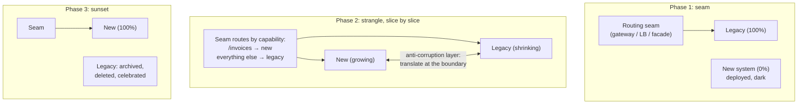

# マイグレーション戦略: ストラングラーフィグとシステム置き換え

> **翻訳についての注記:** 本ドキュメントは英語原文 `15-deployment/06-migration-strategies.md` を日本語に翻訳したものです。コードブロックおよびMermaidダイアグラムは原文のまま維持しています。

## TL;DR

稼働中のシステムの置き換えは、シニアエンジニアリングの最も一般的な仕事の形であり、ルールは: **決してビッグバンしない**。書き直しのリスクはフィードバックなしの時間に比例して蓄積するので、実行可能な戦略はすべて、置き換え先に本番トラフィックを早期に流すためのスライスの出荷方法です。道具箱: **ストラングラーフィグ**(前段にルーティングの継ぎ目を置き、一度に1スライスずつ移し、レガシーが消えるまで縮める)、**branch by abstraction**(同じ一手を1つのコードベースの内側で、インターフェースと[フラグ](./02-feature-flags.md)の背後で行う)、**二重実行/シャドー検証**(両方を動かし、出力を差分し、自信ではなくデータにカットオーバーを認可させる。副作用に注意)。移行中のデータ所有は[expand/contract](./03-database-migrations.md)に従い、フェーズごとにライターは1つ。明示的に名付けた帰還不能点まで、ロールバックはルーティング変更と等しくなければなりません。そして全員が省く部分: **サンセットの規律** — マイグレーションが完了するのは新システムが動いたときではなく、旧システムが*削除された*ときです。誰かがバーンダウンを所有しない限り、「永遠に97%移行済み」がデフォルトの結末です。

---

## なぜビッグバン書き直しは失敗するのか

書き直しの幻想: 機能を凍結し、18か月かけてクリーンに作り、週末に切り替える。失敗の力学は法則と呼べるほど予測可能です:

- **フィードバックの飢餓。** 新システムが本番トラフィックを運ばない週ごとにリスクが育ちます。レガシーシステムこそが仕様です — 数十年分のエッジケース、ブラウザの癖、「あのテナントのCSV形式」はそのコードパスにだけ生きており、カットオーバーで一度に全部発見します。
- **動く標的。** ビジネスは実際には凍結しません。追いかける間もレガシーは変わり続け、書き直しは今も成長中のシステムとの機能同等を要求されます。
- **セカンドシステム効果。** 書き直しは先送りされた夢をすべて抱え込み、より遅く、より重く到着します。
- **一方通行の扉。** 週末カットオーバーには増分のロールバックがありません — 可能な限り最大の変更と、可能な限り最小のundoです。

以下のすべてのパターンは、層を変えて適用される同じ治療です: 各ステップが退屈になるまで**マイグレーションのバッチサイズを縮める**([CI/CDと同じ議論](./04-cicd-gitops.md) — バッチサイズがリスクです)。

## ストラングラーフィグ

宿主の木を包んで育ち、やがて木が消えるイチジクに因みます。仕組み:

1. **まず継ぎ目を確立する** — *すべての*トラフィックが通る[APIゲートウェイ](../12-service-mesh/02-api-gateway.md)、ロードバランサのルール群、またはファサードサービス。継ぎ目はマイグレーションのコントロールプレーンです: ルート別・テナント別・割合別のステアリングと、即時ロールバック。継ぎ目なくしてストラングラーなし。
2. **スライスは重要度ではなく、リスク×独立性で選ぶ。** 最初のスライス: 読み取り主体で、爆発半径が小さく、結合の弱いもの(レポートのエンドポイント、設定ページ) — その仕事は価値の提供ではなく、*パイプライン*(継ぎ目、デプロイ、可観測性、ロールバック)の証明です。その後はケイパビリティ単位で進み、書き込みが重く不変条件の濃い中核は、機構が訓練された最後に。
3. 新旧が飛行中に相互運用しなければならない場所には**腐敗防止層(anti-corruption layer)**を — 境界での明示的な翻訳。レガシーのデータモデルに新システムを植民地化させないこと(そこから逃げることが要点だったのです)。
4. **リクエストだけでなくイベントも横取りする:** レガシーがキュー/バッチジョブから食わされているなら、継ぎ目はそれらの入口も覆わなければなりません — HTTPのルーターは全員が覚えていて、夜中のcronは誰も覚えていません。
5. **マイグレーションをプロダクトとして運営する:** オーナーと日付付きのケイパビリティのバーンダウン、スライス別トラフィックシェアのダッシュボード、そして*新機能は新システムにのみ実装*という常設ルール — でなければ、絞めている端の反対側でレガシーが育ち続けます。

## Branch by Abstraction

ネットワークの継ぎ目がないときのストラングラーの一手 — デプロイ済みコードベースの*内側*のサブシステム(ORM、ストレージ層、レンダリングエンジン)を、長命ブランチなしで置き換えます:

1. 旧実装の上に**インターフェース**を切り出し、全呼び出し箇所を機械的にそこへ通す(純粋なリファクタ、挙動変更ゼロ、継続的に出荷可能)。
2. 同じインターフェースの背後に新実装を、`main` の中で、ダークに構築する([トランクベース](./04-cicd-gitops.md) — 抽象こそがブランチです)。
3. [フィーチャーフラグ](./02-feature-flags.md)で呼び出し箇所ごと/コホートごとに切り替え、比較し、ランプする。
4. 旧実装を削除し、*そして稼ぎがなければ抽象そのものも*削除する。

この規律が買うもの: 数か月の置き換えの間、コードベースはすべてのコミットでコンパイルされ出荷され、「ロールバック」はフラグ反転です — 6か月の `rewrite-v2` ブランチの地獄のマージと対照的に。

## 二重実行とシャドー検証

確信は雰囲気ではなく差分から来るべきです。3つの強度:

| モード | 仕組み | 捕まえるもの |
|---|---|---|
| **シャドー(ダーク)リード** | トラフィックを新システムへミラーし、その応答は破棄し、レガシーの応答と差分する | 正しさの欠落、実負荷下の性能 — ユーザーリスクゼロで |
| **二重実行比較**(Scientist型) | *リクエストパス内で*両方を実行し、レガシーを返し、不一致を記録する | 同上+リクエスト単位の正確なフォレンジック。レイテンシが増える — サンプリングを |
| **二重書き込み** | データ移行中、書き込みを両ストアへ | カットオーバー前に新ストアを温かく検証可能に保つ([expand/contract](./03-database-migrations.md)) |

枢要なルール: **シャドー実行は副作用を二重化してはなりません。** メール送信・カード課金・イベント発行を行うリクエストのミラーリングは、それを2回行うことです — シャドーパスにはスタブ化された実行器、隔離されたシンク、または[プライマリと共有する冪等性キー](../01-foundations/08-idempotency.md)が必要です。(これは[オープンループ負荷テスト](../01-foundations/10-capacity-planning.md)と同じ機構です — 副作用を無力化した本番トラフィックのリプレイ。)

差分をSLOのように運用すること: スライス別の不一致率を日次でトリアージし、カットオーバーのゲートは実トラフィックでの*持続的な*ほぼゼロの差分(既知の良性の差分 — タイムスタンプ、順序 — は手を振らず明示的にフィルタ)。GitHubのScientistライブラリがこの実践に名前を与え、Shopifyのストアフロント移行は、同等性が証明されるまで新旧のレンダリングをリクエスト単位で比較する検証器を走らせ、それからランプしました。

## マイグレーション中のデータプレーン

コードはリクエスト単位でルーティングできますが、データには記憶があります — マイグレーションが実際に難しくなるのはここです:

- **フェーズごとにライターは1つ。** どの瞬間も、あるレコードの書き込みを所有するシステムは正確に1つで、他方は追従します(所有者からの二重書き込み、または[CDC](../13-data-pipelines/04-change-data-capture.md)レプリケーション)。マイグレーション中の2人のマスターは、自分から志願した[競合解決問題](../02-distributed-databases/04-conflict-resolution.md)です。
- 標準手順はシステム規模の[expand/contractプレイブック](./03-database-migrations.md)です: 新ストアが追従(バックフィル+継続同期) → 検証(件数、チェックサム、照合レポート) → 読み取りを切替 → 書き込みを切替(逆方向同期を動かしたまま — ロールバックを可能に保つ) → 帰還不能点を過ぎてから逆同期を撤去。
- **帰還不能点(point of no return)を明示的に名付ける**(レガシーが表現できない新システムの書き込みが存在し始める瞬間 — マイグレーションの[ピボットトランザクション](../05-messaging/09-saga-pattern.md))。その前はロールバック=ルーティング。その後はロールバック自体がマイグレーションです。意識的に、遅めに、ソークの後にスケジュールすること。
- ステートフルな移行では**テナント単位がパーセンテージランプに勝ります**([マルチテナンシー](../06-scaling/12-multi-tenancy.md)): テナントのデータセット全体が一緒に動き、照合に綺麗な境界があり、デザインパートナーのテナントが合意の上で先頭を行きます。

## サンセットの規律

マイグレーションは始まりで失敗しません。終わりで溶けるのです — チームは95%で解散し、会社は*2つ*のシステムを永遠に運用します(二重のインフラ、二重のオンコール、二重のセキュリティ面。しかもレガシーにはもうオーナーがいません)。対抗策:

- **完了=削除と定義する:** トラフィック0、[DR/保持ポリシー](./05-disaster-recovery.md)に従ったデータのアーカイブ、コード削除、インフラ撤去、Runbook/ドキュメント更新、ダッシュボード削除。それまでは完了ではない。
- 最後の5%(奇妙なテナント、2019年のcron、財務がQ4だけ使うエンドポイント)には項目ごとの明示的な決定が必要です: 移行する、より単純なもので置き換える、またはステークホルダーの承認付きで正式に殺す。オーナー不在の残余こそ、「一時的」がアーキテクチャになる経路です。
- 長い尻尾の間、**レガシーを成長に対して敵対的にする**: CIで強制される機能凍結(レガシーパスへの変更は例外ラベルを要求)、[Sunsetヘッダと呼び出し元別メトリクス](../12-service-mesh/04-api-design-patterns.md)付きのAPI廃止警告 — 呼び出し元を列挙できないものは止められません。
- バーンダウンを毎月追跡し公開する。リーダーシップが見るものは完了します。

### 書き直しが*正しい*とき

ストラングリングは、レガシーが動き続けられ、スライスできることを前提にします。本物の書き直し領域: プラットフォームが足元で死んでいる(EOLのランタイム、採用市場のない保守不能なスタック)、すべてのスライスが相続するほど中核モデルが間違っている、またはシステムが四半期で書き直せるほど小さい。それでも: まず*一部の*トラフィック(1リージョン、1テナントティア — 粗い粒度のストラングラー)で新システムを本番品質に育て、差分ハーネスは保持すること。パターンは任意ではありません。任意なのはスライスのサイズだけです。

---

## チェックリスト

- [ ] スライスを動かす前に継ぎ目を確立。ルート/テナント別ステアリング+即時ロールバックを証明済み
- [ ] 最初のスライスは*機構*のリスク低減のために選定。新機能はレガシーから締め出し
- [ ] 新↔旧のすべての境界に腐敗防止層。HTTPだけでなくキュー/cronの入口も被覆
- [ ] シャドー/二重実行の差分が稼働、副作用は無力化、不一致率がカットオーバーゲート
- [ ] データ: フェーズごとに単一ライター、バックフィル+照合、名付けた帰還不能点まで逆方向同期
- [ ] 帰還不能点まで、ロールバック=ルーティング変更でリハーサル済み。PONRはソーク後に意図的にスケジュール
- [ ] サンセット=削除。バーンダウン、オーナー、レガシーの成長凍結、ターンダウン前の呼び出し元列挙

---

## 参考文献

- [Strangler Fig Application](https://martinfowler.com/bliki/StranglerFigApplication.html) / [Branch by Abstraction](https://martinfowler.com/bliki/BranchByAbstraction.html) — Fowler; 正典の記述
- [GitHub Scientist](https://github.com/github/scientist) — ライブラリとしての二重実行実験。副作用の注意書きとともに
- [Stripe: Online migrations at scale](https://stripe.com/blog/online-migrations) — 4フェーズの二重書き込みプレイブック
- [Shopify: How we rebuilt the storefront renderer](https://shopify.engineering/how-shopify-reduced-storefront-response-times-rewrite) — 検証器でゲートされた大規模置き換え
- [Things You Should Never Do, Part I](https://www.joelonsoftware.com/2000/04/06/things-you-should-never-do-part-i/) — Spolsky; ビッグバンへの反論、今も無敗
- *Monolith to Microservices* (Sam Newman) — ストラングラー周辺のパターンカタログ全体
