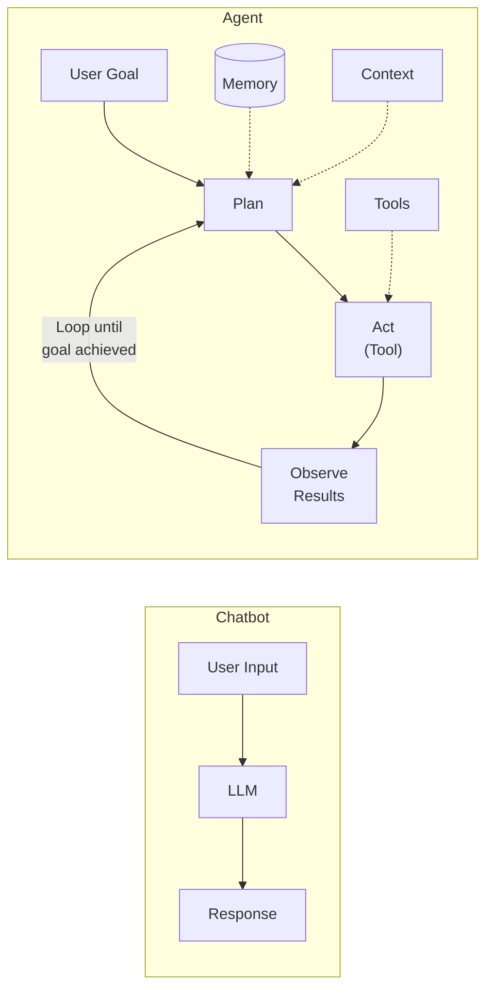
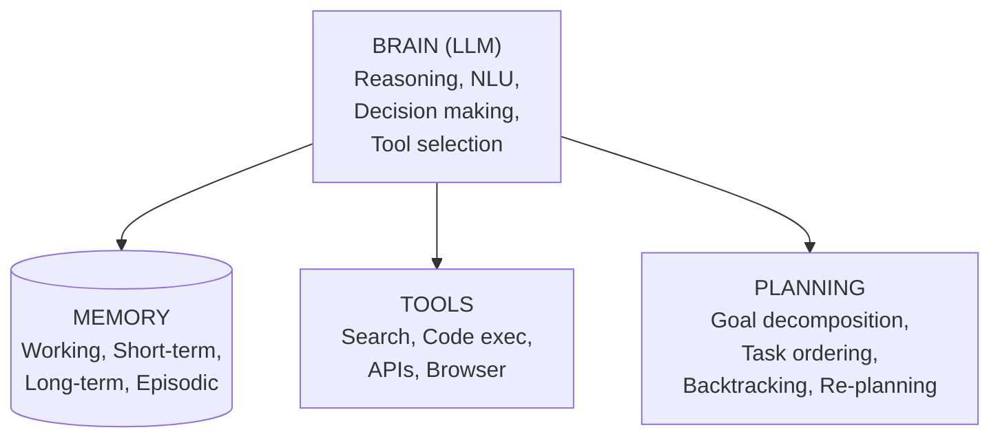
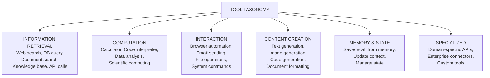
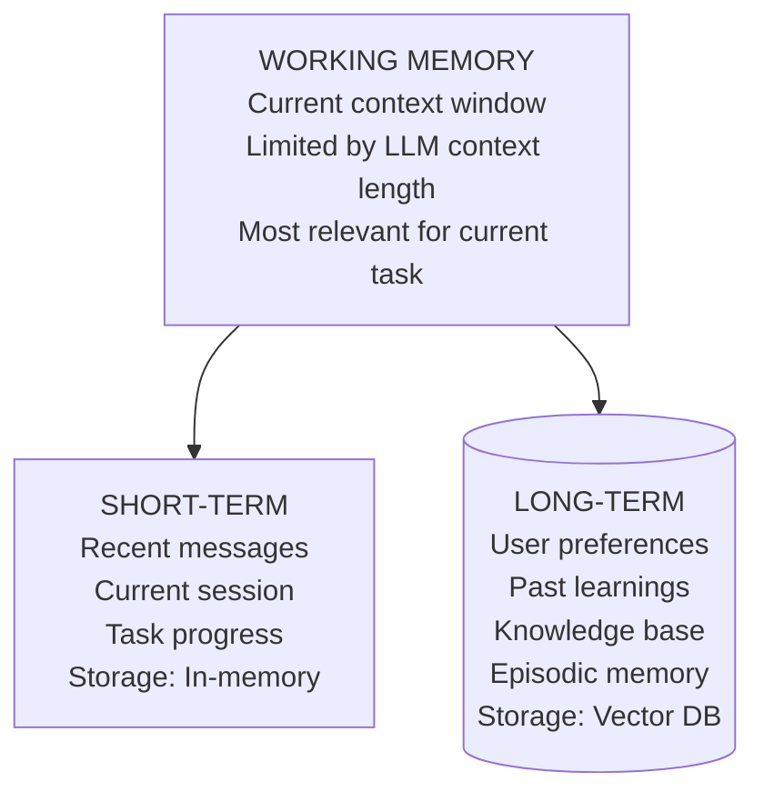

# LLMエージェント基礎

> **注:** この記事は英語版からの翻訳です。コードブロックおよびMermaidダイアグラムは原文のまま保持しています。

## TL;DR

LLMエージェントは、言語モデルにツール、メモリ、計画能力を組み合わせることで、複雑なタスクを自律的に達成します。単純なチャットボットとは異なり、エージェントは問題について推論し、アクションを実行し、結果を観察し、反復することができます。コアループは「知覚 → 思考 → 行動 → 観察 → 繰り返し」です。

---

## エージェントとチャットボットの違いとは？



### 主な違い

| 観点 | チャットボット | エージェント |
|--------|---------|-------|
| インタラクション | 単一ターン | 状態を持つマルチターン |
| アクション | テキストのみ | ツールとAPI |
| 計画 | なし | ゴール分解 |
| メモリ | なしまたは限定的 | 短期 + 長期 |
| 自律性 | リアクティブ | プロアクティブ |
| エラー処理 | なし | リトライ、代替パス |

---

## エージェントアーキテクチャ

### コアコンポーネント



### 基本エージェントループ

```python
from typing import List, Dict, Any
from abc import ABC, abstractmethod

class Tool(ABC):
    name: str
    description: str

    @abstractmethod
    def execute(self, **kwargs) -> str:
        pass

class Agent:
    def __init__(self, llm, tools: List[Tool], max_iterations: int = 10):
        self.llm = llm
        self.tools = {tool.name: tool for tool in tools}
        self.max_iterations = max_iterations
        self.memory = []

    def run(self, goal: str) -> str:
        """Main agent loop"""
        self.memory.append({"role": "user", "content": goal})

        for i in range(self.max_iterations):
            # Think: Decide what to do next
            thought, action = self.think()

            if action is None:
                # Agent decided to give final answer
                return thought

            # Act: Execute the chosen tool
            tool_name, tool_input = action
            observation = self.act(tool_name, tool_input)

            # Observe: Record the result
            self.observe(thought, tool_name, tool_input, observation)

        return "Max iterations reached without completing goal"

    def think(self) -> tuple[str, tuple | None]:
        """Use LLM to decide next action"""
        prompt = self.build_prompt()
        response = self.llm.generate(prompt)

        # Parse response for thought and action
        thought = self.extract_thought(response)
        action = self.extract_action(response)

        return thought, action

    def act(self, tool_name: str, tool_input: dict) -> str:
        """Execute the selected tool"""
        if tool_name not in self.tools:
            return f"Error: Unknown tool '{tool_name}'"

        try:
            result = self.tools[tool_name].execute(**tool_input)
            return result
        except Exception as e:
            return f"Error executing {tool_name}: {str(e)}"

    def observe(self, thought: str, tool_name: str,
                tool_input: dict, observation: str):
        """Record the step in memory"""
        self.memory.append({
            "thought": thought,
            "action": tool_name,
            "action_input": tool_input,
            "observation": observation
        })

    def build_prompt(self) -> str:
        """Build prompt with tools, memory, and instructions"""
        tool_descriptions = "\n".join([
            f"- {name}: {tool.description}"
            for name, tool in self.tools.items()
        ])

        history = self.format_memory()

        return f"""You are an AI agent that can use tools to accomplish goals.

Available tools:
{tool_descriptions}

Previous steps:
{history}

Respond with:
Thought: <your reasoning>
Action: <tool_name>
Action Input: <input as JSON>

Or if you have the final answer:
Thought: <your reasoning>
Final Answer: <your answer>
"""
```

---

## ツール

### ツール定義

```python
from pydantic import BaseModel, Field
from typing import Optional
import json

class ToolParameter(BaseModel):
    name: str
    type: str
    description: str
    required: bool = True

class Tool:
    def __init__(
        self,
        name: str,
        description: str,
        parameters: List[ToolParameter],
        function: callable
    ):
        self.name = name
        self.description = description
        self.parameters = parameters
        self.function = function

    def to_openai_function(self) -> dict:
        """Convert to OpenAI function calling format"""
        return {
            "name": self.name,
            "description": self.description,
            "parameters": {
                "type": "object",
                "properties": {
                    p.name: {"type": p.type, "description": p.description}
                    for p in self.parameters
                },
                "required": [p.name for p in self.parameters if p.required]
            }
        }

    def execute(self, **kwargs) -> str:
        return self.function(**kwargs)

# Example tools
search_tool = Tool(
    name="web_search",
    description="Search the web for current information",
    parameters=[
        ToolParameter(name="query", type="string", description="Search query")
    ],
    function=lambda query: search_api.search(query)
)

calculator_tool = Tool(
    name="calculator",
    description="Perform mathematical calculations",
    parameters=[
        ToolParameter(name="expression", type="string", description="Math expression to evaluate")
    ],
    function=lambda expression: str(eval(expression))  # In production, use safe eval
)

code_executor_tool = Tool(
    name="python_repl",
    description="Execute Python code and return the result",
    parameters=[
        ToolParameter(name="code", type="string", description="Python code to execute")
    ],
    function=lambda code: execute_python_safely(code)
)
```

### OpenAIでのツール呼び出し

```python
import openai
import json

class OpenAIAgent:
    def __init__(self, tools: List[Tool]):
        self.client = openai.OpenAI()
        self.tools = {t.name: t for t in tools}
        self.functions = [t.to_openai_function() for t in tools]

    def run(self, messages: List[dict]) -> str:
        while True:
            response = self.client.chat.completions.create(
                model="gpt-4",
                messages=messages,
                functions=self.functions,
                function_call="auto"  # Let model decide
            )

            message = response.choices[0].message

            # Check if model wants to call a function
            if message.function_call:
                function_name = message.function_call.name
                function_args = json.loads(message.function_call.arguments)

                # Execute the tool
                tool_result = self.tools[function_name].execute(**function_args)

                # Add assistant message and function result to conversation
                messages.append({
                    "role": "assistant",
                    "content": None,
                    "function_call": {
                        "name": function_name,
                        "arguments": message.function_call.arguments
                    }
                })
                messages.append({
                    "role": "function",
                    "name": function_name,
                    "content": tool_result
                })
            else:
                # Model gave final response
                return message.content
```

### ツールカテゴリ



---

## メモリシステム

### メモリの種類



### メモリの実装

```python
from datetime import datetime
from typing import List, Optional
import numpy as np

class MemoryItem:
    def __init__(
        self,
        content: str,
        metadata: dict = None,
        importance: float = 0.5,
        timestamp: datetime = None
    ):
        self.content = content
        self.metadata = metadata or {}
        self.importance = importance
        self.timestamp = timestamp or datetime.now()
        self.access_count = 0
        self.last_accessed = self.timestamp
        self.embedding: Optional[np.ndarray] = None

class AgentMemory:
    def __init__(
        self,
        embedding_model,
        vector_store,
        max_working_memory: int = 10
    ):
        self.embedding_model = embedding_model
        self.vector_store = vector_store
        self.working_memory: List[MemoryItem] = []
        self.max_working_memory = max_working_memory

    def add(self, content: str, importance: float = 0.5, metadata: dict = None):
        """Add item to memory"""
        item = MemoryItem(content, metadata, importance)
        item.embedding = self.embedding_model.embed(content)

        # Add to working memory
        self.working_memory.append(item)
        if len(self.working_memory) > self.max_working_memory:
            # Move oldest to long-term storage
            self._consolidate()

        # Also store in vector DB for long-term
        self.vector_store.add(
            embedding=item.embedding,
            content=content,
            metadata={
                **metadata,
                "importance": importance,
                "timestamp": item.timestamp.isoformat()
            }
        )

    def retrieve(self, query: str, k: int = 5) -> List[MemoryItem]:
        """Retrieve relevant memories"""
        query_embedding = self.embedding_model.embed(query)

        # Search vector store
        results = self.vector_store.search(query_embedding, k=k)

        # Combine with recency scoring
        scored_results = []
        for result in results:
            recency_score = self._calculate_recency(result.timestamp)
            combined_score = (
                0.7 * result.similarity +
                0.2 * recency_score +
                0.1 * result.importance
            )
            scored_results.append((result, combined_score))

        # Sort by combined score
        scored_results.sort(key=lambda x: x[1], reverse=True)

        return [r[0] for r in scored_results[:k]]

    def _calculate_recency(self, timestamp: datetime) -> float:
        """Exponential decay based on time"""
        hours_ago = (datetime.now() - timestamp).total_seconds() / 3600
        decay_rate = 0.99
        return decay_rate ** hours_ago

    def _consolidate(self):
        """Move old working memory to long-term storage"""
        # Remove least important items
        self.working_memory.sort(key=lambda x: x.importance, reverse=True)
        self.working_memory = self.working_memory[:self.max_working_memory]

    def get_context(self, query: str, max_tokens: int = 2000) -> str:
        """Build context string from relevant memories"""
        memories = self.retrieve(query, k=10)

        context_parts = []
        total_tokens = 0

        for memory in memories:
            # Rough token estimate
            tokens = len(memory.content.split()) * 1.3
            if total_tokens + tokens > max_tokens:
                break
            context_parts.append(memory.content)
            total_tokens += tokens

        return "\n\n".join(context_parts)
```

### 会話バッファメモリ

```python
class ConversationMemory:
    """Simple sliding window conversation memory"""

    def __init__(self, max_messages: int = 20):
        self.messages: List[dict] = []
        self.max_messages = max_messages

    def add_message(self, role: str, content: str):
        self.messages.append({"role": role, "content": content})

        # Trim if exceeds max
        if len(self.messages) > self.max_messages:
            # Keep system message if present
            if self.messages[0]["role"] == "system":
                self.messages = [self.messages[0]] + self.messages[-self.max_messages+1:]
            else:
                self.messages = self.messages[-self.max_messages:]

    def get_messages(self) -> List[dict]:
        return self.messages.copy()

    def clear(self):
        # Keep system message if present
        if self.messages and self.messages[0]["role"] == "system":
            self.messages = [self.messages[0]]
        else:
            self.messages = []

class SummaryMemory:
    """Summarize old conversations to save context"""

    def __init__(self, llm, max_messages: int = 10):
        self.llm = llm
        self.max_messages = max_messages
        self.messages: List[dict] = []
        self.summary: str = ""

    def add_message(self, role: str, content: str):
        self.messages.append({"role": role, "content": content})

        if len(self.messages) > self.max_messages:
            self._summarize_old_messages()

    def _summarize_old_messages(self):
        # Take oldest messages to summarize
        to_summarize = self.messages[:self.max_messages // 2]
        self.messages = self.messages[self.max_messages // 2:]

        # Generate summary
        conversation_text = "\n".join([
            f"{m['role']}: {m['content']}" for m in to_summarize
        ])

        new_summary = self.llm.generate(f"""
Summarize this conversation, preserving key facts and decisions:

Previous summary: {self.summary}

New messages:
{conversation_text}

Updated summary:""")

        self.summary = new_summary

    def get_context(self) -> str:
        messages_text = "\n".join([
            f"{m['role']}: {m['content']}" for m in self.messages
        ])

        if self.summary:
            return f"Previous context summary:\n{self.summary}\n\nRecent messages:\n{messages_text}"
        return messages_text
```

---

## エージェント向けプロンプトエンジニアリング

### システムプロンプト構造

```python
AGENT_SYSTEM_PROMPT = """You are an AI assistant that helps users by breaking down tasks and using tools.

## Your Capabilities
- You can search the web for current information
- You can execute Python code for calculations and data processing
- You can read and write files
- You can interact with APIs

## How to Approach Tasks
1. Understand the user's goal completely before acting
2. Break complex tasks into smaller steps
3. Use the most appropriate tool for each step
4. Verify results before proceeding
5. Ask for clarification if the request is ambiguous

## Available Tools
{tool_descriptions}

## Response Format
Think step by step. For each step:

Thought: Explain your reasoning for what to do next
Action: tool_name
Action Input: {{"param": "value"}}

After receiving tool output:
Observation: [tool output will appear here]

Continue until you can provide a final answer:
Thought: I now have enough information to answer
Final Answer: [your complete response]

## Important Guidelines
- Always verify information before presenting it as fact
- If a tool fails, try an alternative approach
- Be concise but thorough in your final answers
- Cite sources when providing factual information
"""
```

### Few-Shotの例

```python
FEW_SHOT_EXAMPLES = """
## Example 1: Simple Calculation

User: What is 15% of 847?

Thought: I need to calculate 15% of 847. I'll use the calculator tool.
Action: calculator
Action Input: {"expression": "847 * 0.15"}

Observation: 127.05

Thought: I have the answer.
Final Answer: 15% of 847 is 127.05

## Example 2: Multi-Step Research

User: What's the current stock price of Apple and how does it compare to last year?

Thought: I need to find the current stock price of Apple first.
Action: web_search
Action Input: {"query": "Apple AAPL stock price today"}

Observation: Apple (AAPL) is currently trading at $178.50...

Thought: Now I need to find the price from a year ago to compare.
Action: web_search
Action Input: {"query": "Apple AAPL stock price one year ago"}

Observation: One year ago, AAPL was trading at approximately $142.30...

Thought: Now I can calculate the change and provide a comparison.
Action: calculator
Action Input: {"expression": "((178.50 - 142.30) / 142.30) * 100"}

Observation: 25.44

Thought: I now have all the information needed.
Final Answer: Apple (AAPL) is currently trading at $178.50. Compared to one year ago ($142.30), the stock has increased by approximately 25.4%.
"""
```

---

## エラー処理とリカバリ

```python
class RobustAgent:
    def __init__(self, llm, tools, max_retries: int = 3):
        self.llm = llm
        self.tools = tools
        self.max_retries = max_retries

    def execute_with_retry(self, tool_name: str, tool_input: dict) -> str:
        """Execute tool with retry logic"""
        errors = []

        for attempt in range(self.max_retries):
            try:
                result = self.tools[tool_name].execute(**tool_input)
                return result
            except Exception as e:
                errors.append(f"Attempt {attempt + 1}: {str(e)}")

                if attempt < self.max_retries - 1:
                    # Ask LLM to fix the input
                    fixed_input = self.fix_tool_input(
                        tool_name, tool_input, str(e)
                    )
                    if fixed_input:
                        tool_input = fixed_input

        return f"Tool execution failed after {self.max_retries} attempts:\n" + \
               "\n".join(errors)

    def fix_tool_input(self, tool_name: str, tool_input: dict, error: str) -> dict:
        """Ask LLM to fix tool input based on error"""
        prompt = f"""The tool '{tool_name}' failed with this input:
{tool_input}

Error: {error}

Please provide corrected input as JSON, or respond "CANNOT_FIX" if the error cannot be fixed by changing the input.
"""
        response = self.llm.generate(prompt)

        if "CANNOT_FIX" in response:
            return None

        try:
            return json.loads(response)
        except:
            return None

    def handle_stuck_state(self, memory: List[dict]) -> str:
        """Detect and handle when agent is stuck in a loop"""
        if len(memory) < 3:
            return None

        # Check for repeated actions
        recent_actions = [m.get("action") for m in memory[-3:]]
        if len(set(recent_actions)) == 1:
            return self.generate_alternative_approach(memory)

        return None

    def generate_alternative_approach(self, memory: List[dict]) -> str:
        """Generate alternative approach when stuck"""
        prompt = f"""The agent appears to be stuck, repeating the same action.

Previous steps:
{self.format_memory(memory)}

Please suggest an alternative approach to achieve the goal.
"""
        return self.llm.generate(prompt)
```

---

## ベストプラクティス

### 設計原則

```
1. 単一責任ツール
   悪い例:  do_everything(task)
   良い例: search(query), calculate(expr), write_file(path, content)

2. 明確なツール説明
   悪い例:  "Searches stuff"
   良い例: "Search the web and return top 5 results with titles and snippets"

3. グレースフルデグラデーション
   - ツール障害を優雅に処理する
   - 可能な場合は部分的な結果を提供する
   - ユーザーに制限を説明する

4. 制限付き反復
   - 最大反復回数を設定する
   - ループやスタック状態を検出する
   - 長時間実行操作にタイムアウトを設定する

5. 観測可能な実行
   - すべての思考とアクションをログに記録する
   - トークン使用量を追跡する
   - 実行トレースを記録する
```

### セキュリティの考慮事項

```python
class SecureAgent:
    """Agent with security constraints"""

    DANGEROUS_PATTERNS = [
        r"rm\s+-rf",
        r"DROP\s+TABLE",
        r"DELETE\s+FROM",
        r"eval\s*\(",
        r"exec\s*\(",
    ]

    def validate_tool_input(self, tool_name: str, tool_input: dict) -> bool:
        """Check for dangerous operations"""
        input_str = json.dumps(tool_input)

        for pattern in self.DANGEROUS_PATTERNS:
            if re.search(pattern, input_str, re.IGNORECASE):
                raise SecurityError(f"Dangerous pattern detected: {pattern}")

        return True

    def sandbox_code_execution(self, code: str) -> str:
        """Execute code in sandboxed environment"""
        # Use restricted execution environment
        # - No file system access
        # - No network access
        # - Limited CPU/memory
        # - Timeout
        pass
```

---

## 参考文献

- [ReAct: Synergizing Reasoning and Acting in Language Models](https://arxiv.org/abs/2210.03629)
- [LangChain Documentation](https://python.langchain.com/)
- [OpenAI Function Calling](https://platform.openai.com/docs/guides/function-calling)
- [Agents Survey Paper](https://arxiv.org/abs/2309.07864)
- [AutoGPT](https://github.com/Significant-Gravitas/AutoGPT)
