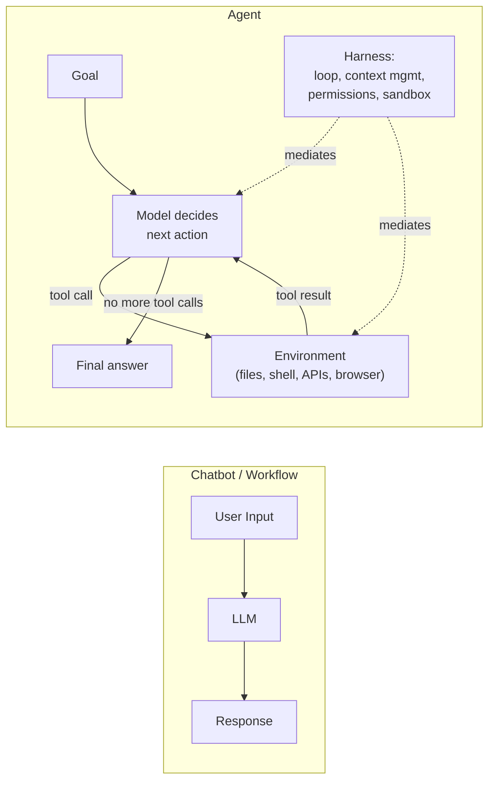
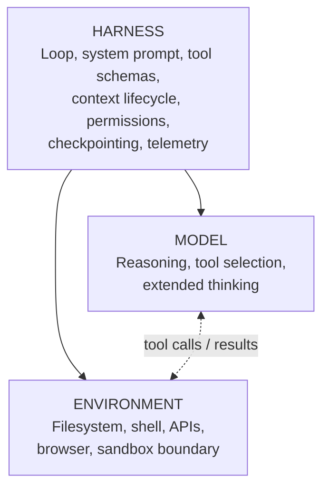
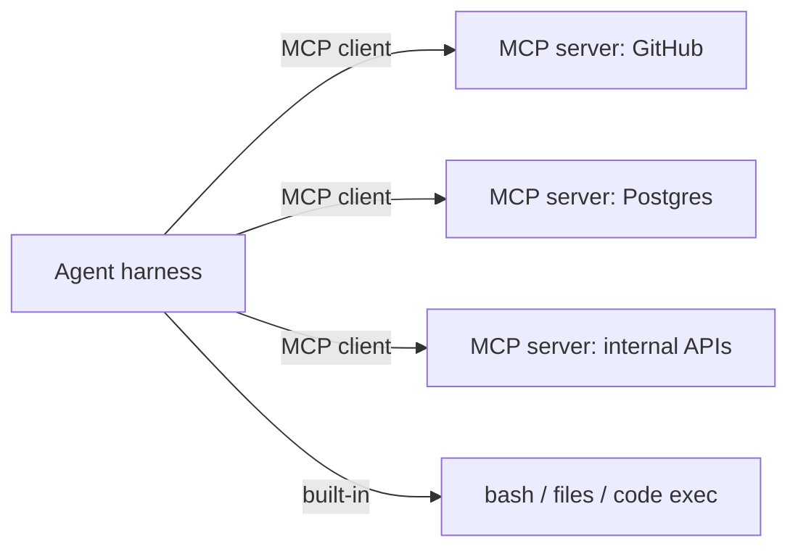
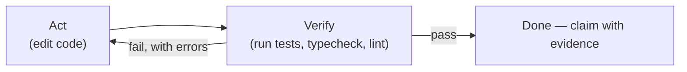

# LLMエージェント基礎

> **注:** この記事は英語版からの翻訳です。コードブロックおよびMermaidダイアグラムは原文のまま保持しています。

## TL;DR

エージェントとは、環境に対してループの中でツールを使うモデルです。モデルは推論を供給し、その周りに構築する**ハーネス** — ループ、ツール定義、コンテキスト管理、権限、サンドボックス — が、その推論のどれだけが有用な仕事に変わるかを決めます。モダンなエージェントはテキスト解析のプロンプトではなくネイティブなツール呼び出し(型付きJSONスキーマ、並列呼び出し)を使い、コンテキストウィンドウをファイルとコンパクションに裏打ちされた作業記憶として扱い、グラウンドトゥルース(テスト、リンター、スクリーンショット)に対して自分の仕事を検証し、権限でゲートされたサンドボックスの中で動きます。まず環境とフィードバックループを設計してください。モデルは最も交換可能なコンポーネントです。

---

## エージェントはチャットボットと何が違うのか?



チャットボットは1つの入力を1つの出力に写像します。**ワークフロー**はあなたが書いたコードパスに沿ってLLM呼び出しを連鎖させます。**エージェント**はモデル自身にプロセスの指揮をとらせます: 直前のツールが返した結果に基づいて次に呼ぶツールを決め、ゴールが達成されるかハーネスが止めるまで続けます。その自律性こそが価値でありリスクです — エージェントは手順を列挙できないタスクを処理し、あなたが列挙しなかった形で失敗もします。

| 観点 | チャットボット | ワークフロー | エージェント |
|--------|---------|----------|-------|
| 制御フロー | なし | あなたのコード | モデル |
| アクション | テキストのみ | 事前定義されたLLM呼び出し | 実行時に選ばれるツール |
| ステップ | 1 | 固定 | オープンエンド。ハーネスが上限 |
| 失敗モード | 悪い回答 | 悪いステップ出力 | ステップをまたいで複利するドリフト |
| コストプロファイル | 予測可能 | 予測可能 | 可変 — ハーネスで予算化 |
| 適するもの | Q&A | 分解可能な既知のタスク | 検証可能な結果を持つオープンエンドのタスク |

問題を解く最も単純な形から始めてください。本番の「エージェント」システムの大半はワークフローであり、それでよいのです — 分類は[オーケストレーションパターン](./02-orchestration-patterns.md)を参照。

## 3つのコンポーネント



- **モデル。** フロンティアモデルはエージェント的なツール使用のために特別にポストトレーニングされています: 推論とツール呼び出しをネイティブに交互配置し、エラーから回復し、数時間のタスクを持続します。モデル間の能力差は重要ですが、凡庸なハーネスはフロンティアモデルを浪費します — 公開コーディングベンチマークは常に*モデル+ハーネス*のペアを報告し、モデル単体を報告することはありません。
- **ハーネス。** モデルと世界の間のすべて。エンジニアリングの労力の大半がここに注がれます。完全な扱いは[ハーネスエンジニアリング](./09-harness-engineering.md)を参照。
- **環境。** エージェントが観測し変更できるもの。環境が豊かで検査可能なほど(本物のシェル、本物のファイルシステム、本物のテストスイート)、エージェントのフィードバックループは良くなります。進捗が*観測可能*になるよう環境を設計してください — テストを実行できるエージェントは、変更がうまくいったかを推測する必要がありません。

---

## エージェントループ

2023年式のパターン — モデルに `Thought: / Action: / Action Input:` のテキストを出力させて正規表現で解析する — は時代遅れです。すべての主要APIは**ネイティブなツール呼び出し**を公開しています: ツールをJSON Schemaとして宣言し、モデルは型付きのツール呼び出しブロックを返し、結果は構造化メッセージとして返します。解析なし、フォーマットのずれなし、並列呼び出しは無料です。

```python
import anthropic

client = anthropic.Anthropic()

TOOLS = [
    {
        "name": "bash",
        "description": "Run a shell command in the project sandbox. "
                       "Returns stdout and stderr, truncated to 50KB.",
        "input_schema": {
            "type": "object",
            "properties": {
                "command": {"type": "string", "description": "Command to execute"},
            },
            "required": ["command"],
        },
    },
    {
        "name": "edit_file",
        "description": "Replace an exact string in a file. Fails if the string "
                       "is not found or matches more than once.",
        "input_schema": {
            "type": "object",
            "properties": {
                "path": {"type": "string"},
                "old": {"type": "string"},
                "new": {"type": "string"},
            },
            "required": ["path", "old", "new"],
        },
    },
]

def agent_loop(task: str, max_turns: int = 50) -> str:
    messages = [{"role": "user", "content": task}]

    for _ in range(max_turns):
        response = client.messages.create(
            model="claude-sonnet-4-6",
            max_tokens=8192,
            system=SYSTEM_PROMPT,          # stable across turns: prompt-cache friendly
            tools=TOOLS,
            messages=messages,
        )

        if response.stop_reason != "tool_use":
            return next(b.text for b in response.content if b.type == "text")

        # Append the assistant turn verbatim, then execute every tool call
        # in it (the model may request several in parallel).
        messages.append({"role": "assistant", "content": response.content})
        results = [
            {
                "type": "tool_result",
                "tool_use_id": block.id,
                "content": execute_tool(block.name, block.input),
            }
            for block in response.content
            if block.type == "tool_use"
        ]
        messages.append({"role": "user", "content": results})

    raise RuntimeError("max_turns exceeded — task did not converge")
```

OpenAI版は `tools=[{"type": "function", ...}]` とレスポンスの `tool_calls` を使いますが、ループの形は同一です。レガシーの `functions` / `function_call` パラメータは非推奨です。

本番版がこの骨格の上に足すもの:

1. `execute_tool` の前の**権限ゲート** — アクションを読み取り/書き込み/不可逆に分類し、最後のクラスには承認を要求する。
2. **トークン予算の管理** — 毎ターンのコンテキスト使用量を追跡し、溢れる前にコンパクションを発動する([コンテキスト管理](./08-context-management.md)参照)。
3. **チェックポイント** — `messages` を永続化し、クラッシュや中断した実行が最初からではなく途中から再開できるように。
4. **テレメトリ** — 各ターンをトレースのスパンとして記録: ツール名、レイテンシ、トークン、キャッシュヒット率。
5. **ストリーミングと割り込み** — 部分的な出力を表示し、人間が実行中に舵を切れるように。

### 拡張思考

推論対応モデルは行動の前に内部の思考トークンを出力でき、ツール呼び出しの間に思考を*交互配置*できます — 結果について熟考してから次のアクションを選べます。これがプロンプトレベルの推論の足場(Chain-of-Thought、Tree-of-Thought)の大半を置き換えました。プロンプトの小細工ではなく思考予算パラメータで制御します。検証が難しくステップが不可逆な場面に予算を使い、機械的なツール使用の列では低く保ちます。

---

## ツール

ツールはエージェントにとっての世界へのAPIです。ツール設計は型システム付きのプロンプトエンジニアリングです — モデルはあなたのスキーマと説明文を新人がドキュメントを読むように読み、曖昧さは実際のトークンと誤った呼び出しのコストになります。

### 設計原則

1. **少数の直交するツールが、多数の重複するツールに勝つ。** すべてのツールは毎ターン、モデルの注意を奪い合います。2つのツールで同じことができるなら、モデルは時々悪い方を選びます。統合してください(5つのログツールではなく `search_logs(filters)`)。
2. **説明文はマイクロプロンプトである。** ツールが何をするか、隣のツールよりいつ使うべきか、何を返すか、失敗モードを記述します。上の `edit_file` の説明は、2つのよくある失敗ケースを*避ける方法*をモデルに伝えています。
3. **トークン効率の良い出力。** モデルが次のステップを決めるのに必要なものを返す — 切り詰め、ページネーション、要約。200KBのJSONをコンテキストに流し込むツールは、エラーを返すツールより害があります。
4. **教えるエラー。** `"File not found: src/uesr.py — did you mean src/user.py?"` はモデルに1ターンで自己修正させます。裸のスタックトレースはしばしば3ターンかかります。
5. 可能な限り**冪等でリトライ安全に** — ループは*必ず*リトライします。

### 汎用ツール vs 構造化ツール

実務で最もレバレッジの高いツールは汎用のものです: **シェル、ファイルの読み書き編集、コード実行**。bashツールは何百もの特化ツールを包含し、スクリプトを書くことは10回のツール呼び出しを連鎖させるよりトークン効率が良いことが多い — 「ツール使用としてのコード実行」パターンでは、エージェントは各呼び出しをコンテキストウィンドウに通す代わりに、ループでAPIを呼ぶ*プログラムを書きます*。型とガードレールが重要な場所には構造化ツールを足します: 決済、チケット更新、あらゆる不可逆な操作。

### MCP: 統合の標準

Model Context Protocol (MCP)は、ツール・リソース・プロンプトをエージェントに公開する方法を標準化します — MCPサーバーがシステム(GitHub、Postgres、Slack、ブラウザ)を一度ラップすれば、MCP対応のどのハーネスからも使えます。MCPサーバーはサードパーティ依存として扱ってください: 公開内容をレビューし、バージョンを固定し、接続した全サーバーのツール説明があなたのプロンプトに入ることを忘れずに(カタログが大きいときは遅延ロード/ツール検索を)。詳細は[コーディングエージェントのツール設計](../18-compound-engineering/02-coding-agent-tool-design.md)。



---

## メモリとコンテキスト

コンテキストウィンドウはエージェントの作業記憶であり、システムで最も希少な資源です。2つの知見がすべてを形づくります: 実効的な注意はコンテキストが埋まるにつれ劣化し(「コンテキスト腐敗」 — モデルは長いコンテキストの中央を端より思い出せない)、推論コストは再送するすべてのトークンに比例します。したがって長時間のエージェントは、最大のコンテキストではなく**コンテキスト衛生**の上に築かれます。

| 層 | 機構 | 生存範囲 |
|-------|-----------|----------|
| 作業記憶 | メッセージリストそのもの | 1実行、コンパクションまで |
| コンパクション要約 | モデルがトランスクリプトを要約し、要約+直近ターンでループ再開 | コンテキスト溢れ |
| ファイルベースのメモリ | エージェントがメモ・計画・TODOをディスクに書き(`NOTES.md`、スクラッチ)、読み直す | セッション — そして次のセッション |
| プロジェクトメモリ | 毎セッション読み込まれるキュレーション済み指示ファイル(`CLAUDE.md`型) | プロジェクト |
| 検索 | コーパスや過去エピソードへの検索ツール | それ以外すべて |

実務のデフォルト:

- **コンパクション**は意思決定、制約、ファイルパス、学んだ落とし穴を保存し、生のツール出力を捨てます。溢れたときではなく、しきい値(例: ウィンドウの80%)で発動します。
- **ファイルシステムはエージェントの外部メモリです。** 自分の `plan.md` を維持して項目にチェックを付けるエージェントは、コンパクションと中断からほぼ無償で回復します。
- **ジャストインタイムの検索がプリロードに勝ちます。** 関連しそうなものすべてをプロンプトに詰めるのではなく、検索ツール(`grep`、セマンティック検索)を与えて必要なものを引かせます。[エージェントコンテキストエンジニアリング](../18-compound-engineering/03-agent-context-engineering.md)参照。
- ベクトルストアの「エージェントメモリ」(全メッセージを埋め込み、類似度で検索)が最初の正解であることは稀です — エージェントが意図して書き、読むファイルのほうがデバッグ可能で忠実です。

---

## 検証: ループの重要な半分

エージェントが輝くのは、**答えの確認が生成より安い**タスクです — テストスイートのあるコード、不変条件のあるデータ変換、スクリーンショットできるUI変更。ハーネスはグラウンドトゥルースを利用可能にすべきです:



- モデルの自己採点より**客観的な検証器**(終了コード、差分、ピクセル比較)を。グラウンドトゥルースなしの自己評価は成功率を水増しします。
- 検証は*安価で増分的*に: 編集のたびに走らせられる高速で的を絞ったテストは、一度しか走らせない20分のスイートに勝ります。
- プログラム的なオラクルのないタスクには、ルーブリック式のLLM-as-judgeを弱い信号として使い、確信の低い結果は人間へルーティングします。
- 検証信号がまったくないタスクは自律に不向きです — 人間をループに残してください。

これは信頼性の正直な枠組みでもあります: ステップごとの成功率は複利します。ステップ成功率98%のエージェントは30ステップのタスクを約55%しか完遂しません。検証ステップこそが複利を止める方法です — 静かなドリフトを、可視で回復可能なエラーに変換します。

---

## セキュリティとサンドボックス

エージェントとは、信頼できないコードの実行問題+混乱した代理人(confused deputy)問題です。セキュリティ境界はモデルではなくハーネスです。

- **環境をサンドボックスする。** ツール実行は使い捨てのコンテナかVMの中で: プロジェクトディレクトリは読み書きマウント、それ以外は読み取り専用か不可視。ネットワークegressはallowlist経由。シークレットはツールごとに注入し、コンテキストには決して置かない。
- **アクションを分類しゲートする。** 読み取りは自動承認。ワークスペース内の書き込みは自動承認かレビュー用にバッチ。不可逆あるいは外向きのもの(push、デプロイ、メール送信、支出)は、緩和できる評価上の証拠が得られるまで明示的な承認を要求する。
- **プロンプトインジェクションを前提とする。** エージェントが読むあらゆる信頼できないコンテンツ — Webページ、Issue、メール、ツール出力 — は指示を含みうる。パターンマッチのフィルタはこれを解決しません。構造的な防御は*致命的トライアングル*の回避です: (1)信頼できない入力を読み、(2)機密データにアクセスでき、(3)外部と通信できるエージェントは、設計からして持ち出し可能です。少なくとも1本の脚を取り除くかゲートすること。
- **来歴が重要。** プロンプト内でツール結果を指示ではなくデータとしてマークする。「Issueのコメントがそうしろと言った」はモデルのバグではなく、あなたのハーネスのバグです。

```python
IRREVERSIBLE = {"deploy", "send_email", "git_push", "payment"}

async def execute_gated(tool: str, args: dict, policy: Policy) -> str:
    action_class = classify(tool, args)          # read | write | irreversible
    if action_class == "irreversible" and not policy.pre_approved(tool, args):
        approval = await request_human_approval(tool, args)
        if not approval.granted:
            return f"Denied by operator: {approval.reason}"   # the model adapts
    return await sandbox.run(tool, args)
```

---

## エージェントの評価

測れないハーネスは改善できません。公開ベンチマークは期待値を較正します — SWE-bench Verified(実GitHubイシュー)、Terminal-Bench(ターミナルタスク)、τ-bench(ポリシー制約+模擬ユーザー下のツール使用)、OSWorld(コンピュータ操作)、GAIA(ツール拡張推論) — しかしあなたのプロダクトには独自の評価セットが必要です: プログラム的な採点器を備えた50〜200の実タスクを、ハーネスのあらゆる変更で実行する。モデルレベルのスコアだけでなく、*タスク成功率*、*解決タスクあたりコスト*、*完了までのターン数*、*危険アクション率*を追跡してください。エージェントではpass@kとpass^kの違いが重要です: 8回に1回解けるタスクと8回中8回解けるタスクは、まったく別のプロダクトです。

---

## ベストプラクティス

```
1. SIMPLEST THING FIRST
   Single call → workflow → agent. Earn each step up in autonomy
   with evidence the simpler form fails.

2. DESIGN THE ENVIRONMENT, NOT JUST THE PROMPT
   Fast tests, clear errors, inspectable state. Agents are only as
   good as their feedback loops.

3. SMALL ORTHOGONAL TOOL SURFACE
   Bash + files + code execution, plus structured tools for the
   irreversible stuff. Consolidate aggressively.

4. CONTEXT HYGIENE OVER CONTEXT SIZE
   Stable prompt prefix (cache), just-in-time retrieval, compaction,
   files as memory.

5. VERIFY WITH GROUND TRUTH
   Tests, typecheckers, screenshots. The model claims; the harness
   confirms.

6. SANDBOX BY DEFAULT, GATE THE IRREVERSIBLE
   Containerized execution, egress allowlists, approval for
   outward-facing actions. Avoid the lethal trifecta.

7. BOUND EVERYTHING
   Max turns, token budgets, wall-clock timeouts, spend limits.
   Autonomy without budgets is an incident report.

8. INSTRUMENT EVERY TURN
   Traces with tokens, tools, cache hits, interventions. Evals on
   every harness change.
```

---

## 参考文献

- [Building Effective Agents](https://www.anthropic.com/research/building-effective-agents) — Anthropicのワークフロー/エージェント分類
- [Effective Context Engineering for AI Agents](https://www.anthropic.com/engineering/effective-context-engineering-for-ai-agents) — Anthropic
- [Writing Effective Tools for Agents](https://www.anthropic.com/engineering/writing-tools-for-agents) — Anthropic
- [Code Execution with MCP](https://www.anthropic.com/engineering/code-execution-with-mcp) — 連鎖ツール呼び出しの代わりのスクリプト
- [Model Context Protocol](https://modelcontextprotocol.io/) — 仕様とSDK
- [The Lethal Trifecta for AI Agents](https://simonwillison.net/2025/Jun/16/the-lethal-trifecta/) — Simon Willison
- [SWE-bench](https://www.swebench.com/) / [τ-bench](https://arxiv.org/abs/2406.12045) / [GAIA](https://arxiv.org/abs/2311.12983) — エージェントベンチマーク
- [Context Rot: How Increasing Input Tokens Impacts LLM Performance](https://research.trychroma.com/context-rot) — Chromaの研究
- [ReAct: Synergizing Reasoning and Acting in Language Models](https://arxiv.org/abs/2210.03629) — ネイティブツール呼び出しが製品化した2022年のパターン
