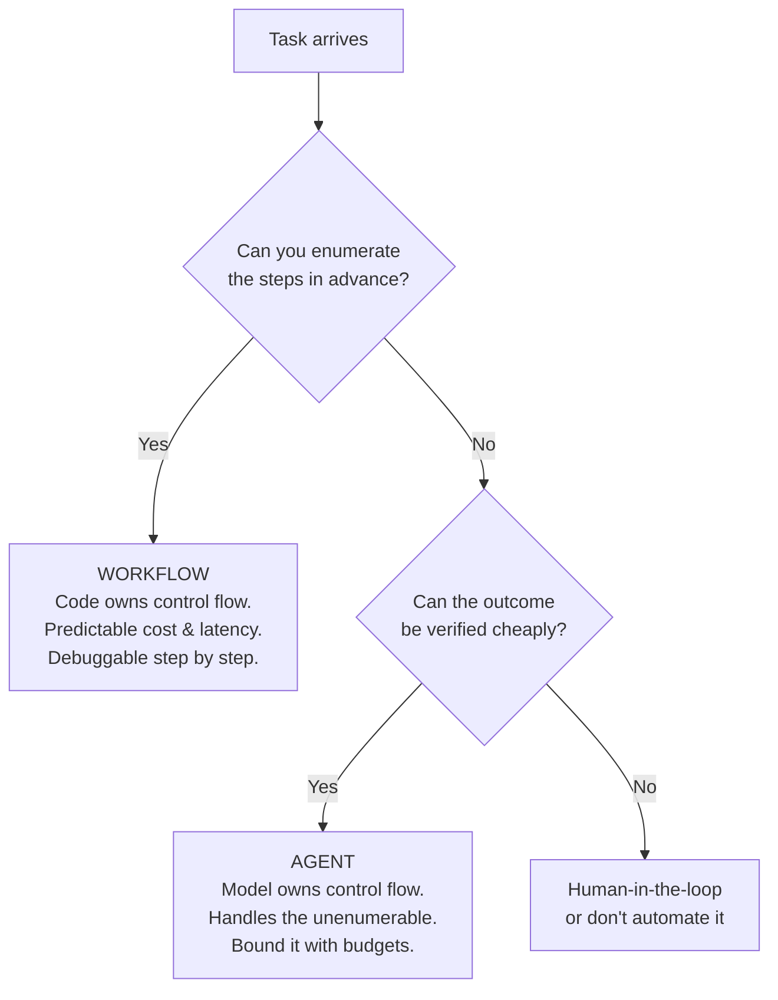
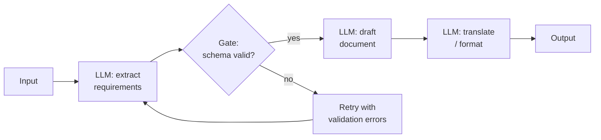
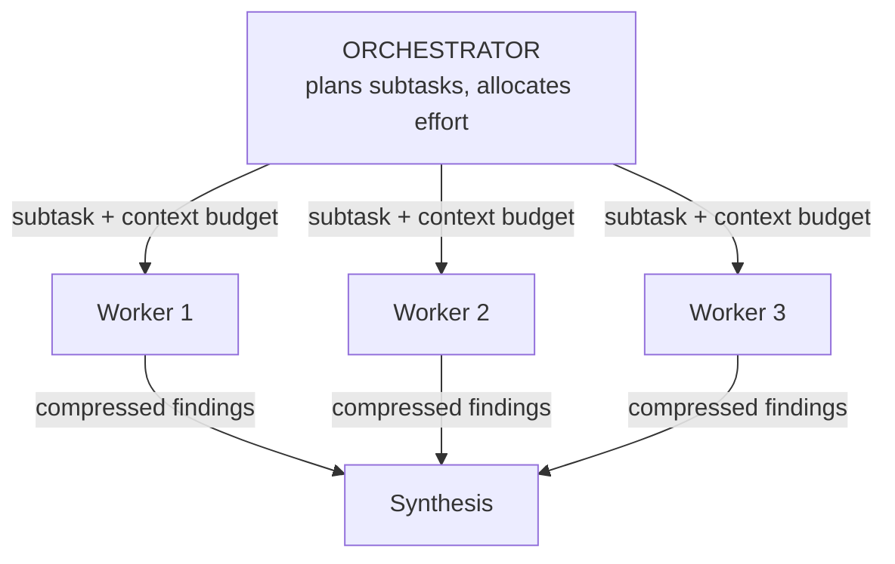
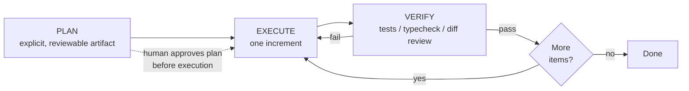

# エージェントオーケストレーションパターン

> **注:** この記事は英語版からの翻訳です。コードブロックおよびMermaidダイアグラムは原文のまま保持しています。

## TL;DR

オーケストレーションとは、LLM呼び出しと制御フローをどう構造化するかです。根本の分岐は: **ワークフロー**(あなたのコードがステップを決め、モデルが埋める)対**エージェント**(モデルがステップを決める)。本番システムは基準を満たす最も単純なパターン — 連鎖、ルーティング、並列化、オーケストレータ-ワーカー、評価器-最適化器 — を使い、検証可能な結果を持つオープンエンドのタスクにだけ自律ループへ昇格すべきです。推論モデルは2023年式のプロンプトの足場(Chain-of-Thought、Tree-of-Thought、自己整合性)の大半を内面化しました。現代のレバーは思考予算、計画-実行-検証の構造、サブエージェントのコンテキスト分離、そして耐久実行です。

---

## ワークフロー vs エージェント



この区別(Anthropicの*Building Effective Agents*が広めた)は、この分野で最も有用なものです。ワークフローは柔軟性を予測可能性と交換します — ステップが分かっているなら、コードに刻むほうが、毎リクエストでモデルに再発見させるより厳密に優れています。エージェントは予測可能性を到達範囲と交換します。過去2年で最も多かったアーキテクチャの過ちは、3ステップのワークフローで済むところにエージェント(あるいはマルチエージェントシステム)を作ることでした。

有用な系: **自律性は二値ではなくダイヤルです。** 同じタスクを、内側に1つのエージェント的ステップを持つワークフローとして出荷することも、ワークフロー型の計画に拘束されたエージェントとして出荷することもできます。評価が「硬い版は実入力で失敗する」と示したときにだけ、ダイヤルを自律側へ回してください。

---

## ワークフローパターン

### プロンプト連鎖 (Prompt Chaining)

タスクを固定の列に分解し、各呼び出しが前の呼び出しの出力を消費します。ステップ間にプログラム的な**ゲート** — 逸脱を早期に捕まえる安価な検査 — を置きます。



```python
async def marketing_chain(brief: str) -> str:
    outline = await llm(f"Extract a structured outline from this brief:\n{brief}",
                        response_format=Outline)          # typed gate: pydantic validation
    if len(outline.sections) < 3:
        outline = await llm(f"Outline too thin ({len(outline.sections)} sections). "
                            f"Expand to 4-6:\n{outline.model_dump_json()}",
                            response_format=Outline)
    draft = await llm(f"Write copy for each section:\n{outline.model_dump_json()}")
    return await llm(f"Edit for tone and tighten by 20%:\n{draft}")
```

使いどころ: 分解が安定し、各ステップに検査可能な契約があるとき。ゲートこそが要点です — 検証のない連鎖は、遅くなった単一プロンプトにすぎません。

### ルーティング (Routing)

入力を分類し、特化したプロンプト・ツールセット・モデルへディスパッチします。ルーティングは標準的な**コスト階層化**の機構でもあります: 簡単な8割を小さく速いモデルへ、難しい2割をエスカレーションします。

```python
ROUTES = {
    "refund":    {"model": SMALL, "system": REFUND_PROMPT,  "tools": [refund_lookup]},
    "technical": {"model": LARGE, "system": DEBUG_PROMPT,   "tools": [search_docs, run_repro]},
    "general":   {"model": SMALL, "system": GENERAL_PROMPT, "tools": []},
}

async def handle(ticket: str) -> str:
    route = await llm(f"Classify this ticket: {ticket}",
                      response_format=Route, model=SMALL)
    cfg = ROUTES[route.category]
    return await run(cfg, ticket)
```

使いどころ: 入力が、最適な処理の異なるカテゴリに群れるとき。分類器のラベル集合は小さく相互排他的に保ち、「unknown」は最も安価な経路ではなく最も有能な経路へ。

### 並列化 (Parallelization)

2つの異なる形があります:

- **セクショニング** — 独立した部分タスクに割り、並行実行し、統合する。(PRをセキュリティ・性能・スタイルの3並列でレビューする。)
- **投票** — *同じ*タスクをN回走らせ、集約する。分類なら多数決、問題発見なら和集合、生成なら採点器付きbest-of-N。これは自己整合性(self-consistency)の本番後継です: 重要な場面の信頼性向上にN倍を支払うのです。

```python
findings = await asyncio.gather(
    llm(SECURITY_REVIEW + diff),
    llm(PERF_REVIEW + diff),
    llm(STYLE_REVIEW + diff),
)                                   # sectioning

verdicts = await asyncio.gather(*[
    llm(f"Does this diff introduce a breaking API change? yes/no + evidence:\n{diff}")
    for _ in range(5)
])                                  # voting: flag if ≥2 say yes
```

使いどころ: 部分タスクが独立(セクショニング)、または単発の信頼性が基準未満で検証が難しい(投票)とき。レイテンシは合計ではなく最も遅い枝に近づきます。

### オーケストレータ-ワーカー (Orchestrator–Workers)

有能なモデルが*実行時に*タスクを分解し、部分タスクをワーカー呼び出し(しばしば安価なモデル、または並列インスタンス)にディスパッチして統合します。セクショニングと違い、部分タスクは事前に分かりません — 分解そのものがモデルの出力です。これはディープリサーチ系システムと、本番の「マルチエージェント」デプロイの大半の背骨パターンです。コンテキスト共有の経済学を含む完全な扱いは[マルチエージェントシステム](./03-multi-agent-systems.md)にあります。



### 評価器-最適化器 (Evaluator–Optimizer)

1つの呼び出しが生成し、別の呼び出しが明示的な基準で採点して実行可能なフィードバックを返し、合格か予算切れまでループします。評価が生成より本当に簡単なとき — 翻訳のニュアンス、検索結果の関連性、スタイルガイドへの適合 — に機能します。

```python
async def refine(task: str, max_rounds: int = 3) -> str:
    draft = await llm(task)
    for _ in range(max_rounds):
        review = await llm(f"Grade against the rubric. PASS or revisions needed.\n"
                           f"Rubric:\n{RUBRIC}\n\nDraft:\n{draft}",
                           response_format=Review)
        if review.verdict == "PASS":
            break
        draft = await llm(f"Revise. Address every point.\n"
                          f"Feedback:\n{review.feedback}\n\nDraft:\n{draft}")
    return draft
```

注意: グラウンドトゥルースのないLLM採点器は甘さへ漂い、同じモデルファミリーの生成器/採点器ペアは盲点を共有します。可能な限り、ルーブリックを客観的な検査(長さ、スキーマ、禁止表現、引用の有無)で錨止めしてください。

---

## エージェントループ

ステップを列挙できないときは、制御フローをモデルに渡します: ループの中のツール、毎ターンの環境フィードバック、ハーネスが強制する予算。機構は[エージェント基礎](./01-agent-fundamentals.md)にあります。ここで重要なのは、ループを信頼できるものにするマクロ構造です。

### 計画-実行-検証 (Plan–Execute–Verify)

エージェント的な仕事の支配的なマクロパターン。エージェントに計画を*成果物として*外在化させ(markdownのチェックリスト、ハーネスが描画するTODOリスト)、それに沿って実行し、次へ進む前に各増分をグラウンドトゥルースで検証します。



機能する理由:

- 計画は**人間のチェックポイント**です — 計画のレビューは数秒、2,000行の驚きの差分のレビューは午後いっぱいかかります。
- 計画は**コンパクションを生き延びます** — コンテキストのリセット後、エージェントは自分の計画を読み直して続行し、ゴールドリフトが激減します。
- 増分ごとの検証が、増分の境界でエラーの複利(ステップ98%問題)を止めます。

*硬直した*パターンとしてのPlan-and-Execute(一度計画し、盲目的に実行)は失敗しました。勝った版は計画を生きたものに保ちます — 現実が押し返すたびに、エージェントが計画を更新するのです。

### サブエージェントへの委譲

部分タスクのために新しいエージェントを生むことは、第一に**コンテキスト分離**の一手であり、並列性の一手ではありません。サブエージェントはコードベースのgrepに20万トークンを燃やし、2千トークンの答えを返せます — オーケストレータのコンテキストは綺麗なままです。部分タスクが自己完結し、その中間状態が親にとってノイズなら委譲する。密結合の仕事は委譲しない — 受け渡しのたびに書かれていないコンテキストが失われ、共有成果物の「断片しか見ない」サブエージェントたちは支離滅裂な結果を生みます。

### 長時間ループ: コンパクションとメモリ

1つのコンテキストウィンドウより長いタスクでは、継続性はハーネスが所有します:

- **コンパクション** — トランスクリプトを要約し(意思決定、ファイルパス、制約、未解決項目)、要約+直近ターンでループを再開する。
- **ファイルベースの状態** — エージェントが `plan.md` / `notes.md` を維持する。ループはコンテキストのリセットだけでなく、プロセスの再起動も生き延びます。
- **1ライタールール** — 長時間稼働のエージェントセッションは、そのワークスペースの唯一の書き手であるべきです。並行する変更はエージェントの世界モデルを無効化します。

### 耐久実行 (Durable Execution)

本番のエージェントループは長時間・ステートフル・故障しやすいプロセスです — 決済ワークフローと同じ問題の形であり、同じ解が適用されます: 各ステップを永続化し、クラッシュ時にリプレイし、最後のチェックポイントから再開する耐久実行エンジン(Temporal型)。ツール呼び出しはリトライポリシー付きのアクティビティに、人間の承認はシグナルになり、「37ターン目でPodが死んだ」はタスクの喪失でなくなります。エンジンを採用しないとしても、その不変条件は必要です: 全ターンの永続化、全ツールの冪等化または補償可能化、チェックポイントからの再開のテスト。

---

## 推論モデルが変えたこと

2023年のオーケストレーションの正典 — ReAct、Chain-of-Thought、Tree-of-Thought、自己整合性、Reflexion — は、熟考できないモデルのための*プロンプトレベルの回避策*の集合でした。RLで訓練された推論モデル(oシリーズ、DeepSeek-R1、Claudeの拡張思考、Geminiの思考モード)はその熟考を内面化しました: モデルは思考トークンの中で探索し、後戻りし、自己修正し、その量はプロンプトの足場ではなく**思考予算パラメータ**で買います。テスト時計算はダイヤルになりました。

| 2023年のパターン | 何をしたか | どこへ行ったか |
|---|---|---|
| ReAct(`Thought:/Action:` テキスト) | 解析されたテキストで推論+ツール使用を交互配置 | ネイティブツール呼び出し+交互思考。*アイデア*は勝ち、プロンプト形式は死んだ |
| Chain-of-Thought(「ステップごとに考えよう」) | 中間推論を引き出した | 推論RLに内面化。小型/非推論モデルと、ログすべき*監査可能な*推論では今も有用 |
| 自己整合性(N回サンプルして投票) | 多様性による信頼性 | 並列化の投票形として生存 — 検証が難しい*タスク*レベルで適用 |
| Tree-of-Thought(明示的な探索) | 代替の推論経路を探索 | 内面化(モデルは思考内で後戻りする)。安価なプログラム的評価器を持つ領域(ゲーム状態、形式証明)では明示探索が生存 |
| Reflexion(リトライをまたぐ言語的自己批判) | 失敗エピソードからの学習 | 自己生成の批判ではなく*本物の*検証器フィードバック付きの計画-実行-検証として生存 — そしてプロバイダ側ではRLの訓練データとして |

実務の指針:

- **推論モデルに足場を重ねないこと。** ネイティブな思考を持つモデルに手書きのCoT形式を強いるのは、概してトークンの無駄で、品質を下げることもあります。予算を設定し、ゴールと制約を述べ、ツールを与えてください。
- **予算は検証可能性に合わせる。** 一発勝負で検証の難しい意思決定(アーキテクチャ、移行計画)には高い思考予算を。環境が数秒ごとにフィードバックをくれる密なツールループでは低く。
- **足場が今も稼ぐ場所**: 小型モデル(コスト階層化)、推論の外在化と保存が必要な規制環境、そして1つのモデルの確信ではなく統計的な確信が必要な構造化された集約(投票)。

---

## パターンの選択

| パターン | 制御フロー | コスト | 到達範囲 | 使いどころ |
|---|---|---|---|---|
| 単一呼び出し+良いプロンプト | — | 1× | 低 | 常に最初に試す |
| プロンプト連鎖 | コード | n×逐次 | 低 | 安定した分解、検査可能なステップ |
| ルーティング | コード | 約1×+分類器 | 低 | 異質な入力、コスト階層化 |
| 並列: セクショニング | コード | n×並行 | 中 | 独立した部分タスク |
| 並列: 投票 | コード | n×並行 | 中 | 信頼性が基準未満、弱い検証器 |
| オーケストレータ-ワーカー | モデルが計画、コードが実行 | 可変 | 高 | 予測不能な分解(リサーチ、検索) |
| 評価器-最適化器 | コードのループ | 2–6× | 中 | 採点が生成より簡単 |
| エージェントループ | モデル | 非有界 — 予算化せよ | 最高 | オープンエンドで検証可能、ツール豊富なタスク |

合成が常態です: 前段にルーター、難しい枝にエージェントループ、ループ内に計画-実行-検証、リリースゲートに投票。パターンは関数のように合成し、各追加は雰囲気ではなく評価結果で元を取らねばなりません。すべての層はレイテンシとコストと、静かに失敗する新しい方法を足します。

---

## 設計で避けるべき失敗モード

- **足場の骨化。** 去年のモデルに合わせて調整したワークフローは、今年のモデルの天井になります。モデル更新のたびに「このステップはまだ必要か?」の評価を回すこと。最良のオーケストレーションコードは、削除できるコードです。
- **採点器のドリフト。** LLMの審判は表面的特徴(長さ、自信)に錨を下ろします — ラベル付き集合で較正し、審判と人間の一致度が下がったら警報を。
- **静かなループの発散。** 同じ失敗アクションを表面だけ変えてリトライするエージェント。ハーネスで繰り返しのツール呼び出しシグネチャを検出し、戦略変更を強制するかエスカレーションする。
- **予算なしの自律。** すべてのループに最大ターン・トークン・実時間・支出の上限を。評価のp95から設定し、楽観からは設定しない。
- **共有状態なしの協調。** 同じ成果物に書き込む並列ワーカーは、gitだけでなく意味論のマージ衝突を生みます。所有で分割すること([マルチエージェントシステム](./03-multi-agent-systems.md)参照)。

---

## 参考文献

- [Building Effective Agents](https://www.anthropic.com/research/building-effective-agents) — Anthropic; この記事が従うワークフロー/エージェント分類
- [DeepSeek-R1: Incentivizing Reasoning Capability in LLMs via Reinforcement Learning](https://arxiv.org/abs/2501.12948) — 推論はいかに内面化されたか
- [ReAct](https://arxiv.org/abs/2210.03629), [Tree of Thoughts](https://arxiv.org/abs/2305.10601), [Reflexion](https://arxiv.org/abs/2303.11366), [Self-Consistency](https://arxiv.org/abs/2203.11171) — 歴史的な足場と、それが分野に教えたこと
- [How We Built Our Multi-Agent Research System](https://www.anthropic.com/engineering/built-multi-agent-research-system) — 本番規模のオーケストレータ-ワーカー
- [Don't Build Multi-Agents](https://cognition.ai/blog/dont-build-multi-agents) — Cognition; コンテキスト共有の反論
- [Temporal](https://temporal.io/) — 長時間ワークフローの耐久実行
