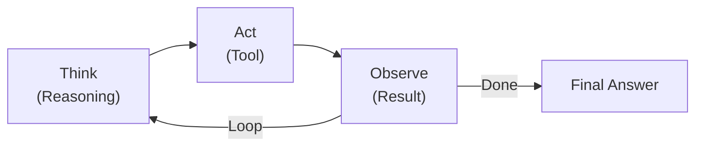
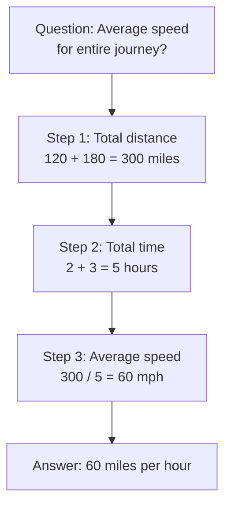
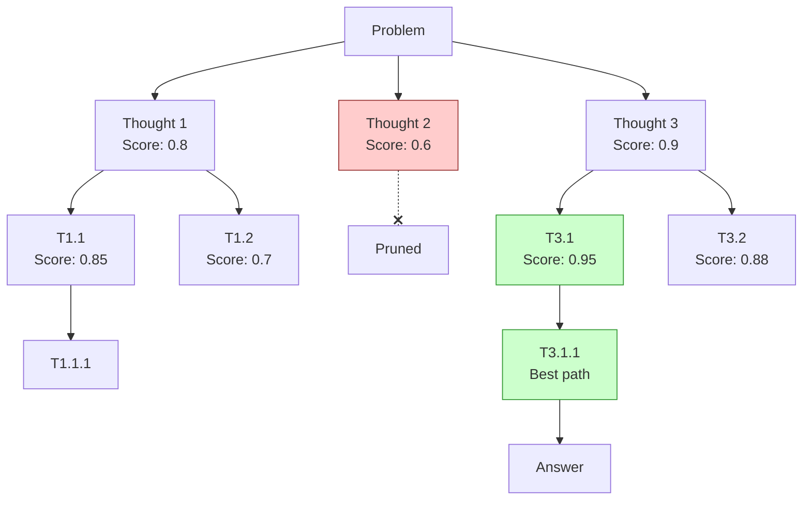
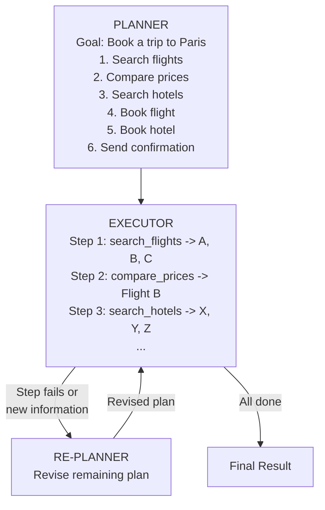
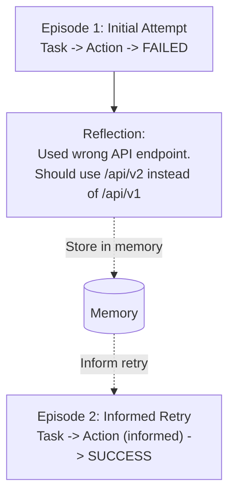

# エージェントオーケストレーションパターン

> **注:** この記事は英語版からの翻訳です。コードブロックおよびMermaidダイアグラムは原文のまま保持しています。

## TL;DR

オーケストレーションパターンは、エージェントがどのように推論、計画、タスクを実行するかを定義します。ReActは推論とアクションを交互に行い、Chain-of-Thoughtは複雑な推論を分解し、Tree-of-Thoughtは複数のパスを探索し、Plan-and-Executeは計画と実行を分離します。タスクの複雑さと信頼性要件に基づいて選択してください。

---

## ReAct（推論 + 行動）

### パターン



**例:** Thought: 東京の現在の天気を調べる必要がある -> Action: weather_api({city: "Tokyo"}) -> Observation: 22C, 曇り時々晴れ -> Thought: 回答できる -> Final Answer: 東京の天気は22Cで曇り時々晴れです

### 実装

```python
class ReActAgent:
    def __init__(self, llm, tools: List[Tool]):
        self.llm = llm
        self.tools = {t.name: t for t in tools}
        self.prompt_template = self._build_prompt_template()

    def _build_prompt_template(self) -> str:
        tools_desc = "\n".join([
            f"{t.name}: {t.description}"
            for t in self.tools.values()
        ])

        return f"""Answer the following questions as best you can. You have access to the following tools:

{tools_desc}

Use the following format:

Question: the input question you must answer
Thought: you should always think about what to do
Action: the action to take, should be one of [{', '.join(self.tools.keys())}]
Action Input: the input to the action
Observation: the result of the action
... (this Thought/Action/Action Input/Observation can repeat N times)
Thought: I now know the final answer
Final Answer: the final answer to the original input question

Begin!

Question: {{question}}
{{agent_scratchpad}}"""

    def run(self, question: str, max_steps: int = 10) -> str:
        scratchpad = ""

        for step in range(max_steps):
            # Generate next thought/action
            prompt = self.prompt_template.format(
                question=question,
                agent_scratchpad=scratchpad
            )
            response = self.llm.generate(prompt, stop=["Observation:"])

            # Check for final answer
            if "Final Answer:" in response:
                return response.split("Final Answer:")[-1].strip()

            # Parse action
            action_match = re.search(r"Action: (.+?)[\n]", response)
            action_input_match = re.search(r"Action Input: (.+?)[\n]", response)

            if not action_match or not action_input_match:
                scratchpad += f"\n{response}\nObservation: Could not parse action. Please use the correct format."
                continue

            action = action_match.group(1).strip()
            action_input = action_input_match.group(1).strip()

            # Execute action
            if action in self.tools:
                try:
                    observation = self.tools[action].execute(
                        **json.loads(action_input)
                    )
                except Exception as e:
                    observation = f"Error: {str(e)}"
            else:
                observation = f"Unknown tool: {action}"

            # Update scratchpad
            scratchpad += f"\n{response}\nObservation: {observation}"

        return "Max steps reached without finding answer"
```

### ReActの使用時機

```
適している場合:
✓ 外部情報を必要とするタスク
✓ マルチステップの問題解決
✓ 観察可能な推論が必要な場合
✓ デバッグと透明性

制限事項:
✗ ループにはまる可能性がある
✗ 効果的な先読み計画ができない場合がある
✗ 各ステップでレイテンシが追加される
✗ ステップ数に応じてトークン使用量が増加する
```

---

## Chain-of-Thought（CoT）

### パターン



### 実装

```python
class ChainOfThoughtAgent:
    def __init__(self, llm):
        self.llm = llm

    def solve(self, question: str) -> str:
        prompt = f"""Solve this problem step by step.

Question: {question}

Let's think through this step by step:
1."""

        response = self.llm.generate(prompt)
        return self.extract_final_answer(response)

    def solve_with_examples(self, question: str, examples: List[dict]) -> str:
        """Few-shot CoT with examples"""
        example_text = ""
        for ex in examples:
            example_text += f"""
Question: {ex['question']}

Let's think step by step:
{ex['reasoning']}

Therefore, the answer is: {ex['answer']}

---
"""

        prompt = f"""{example_text}
Question: {question}

Let's think step by step:"""

        response = self.llm.generate(prompt)
        return response

# Zero-shot CoT (just add "Let's think step by step")
def zero_shot_cot(llm, question: str) -> str:
    prompt = f"{question}\n\nLet's think step by step:"
    return llm.generate(prompt)
```

### Self-Consistency CoT

```python
class SelfConsistencyCoT:
    """Generate multiple reasoning paths and vote on the answer"""

    def __init__(self, llm, num_samples: int = 5):
        self.llm = llm
        self.num_samples = num_samples

    def solve(self, question: str) -> str:
        answers = []

        # Generate multiple reasoning chains
        for _ in range(self.num_samples):
            response = self.llm.generate(
                f"{question}\n\nLet's think step by step:",
                temperature=0.7  # Higher temp for diversity
            )
            answer = self.extract_answer(response)
            answers.append(answer)

        # Majority vote
        from collections import Counter
        answer_counts = Counter(answers)
        most_common = answer_counts.most_common(1)[0][0]

        return most_common

    def extract_answer(self, response: str) -> str:
        # Extract final answer from response
        # Implementation depends on expected format
        patterns = [
            r"answer is[:\s]+(.+?)[\.\n]",
            r"therefore[,:\s]+(.+?)[\.\n]",
            r"result is[:\s]+(.+?)[\.\n]"
        ]
        for pattern in patterns:
            match = re.search(pattern, response, re.IGNORECASE)
            if match:
                return match.group(1).strip()
        return response.split('\n')[-1].strip()
```

---

## Tree-of-Thought（ToT）

### パターン



### 実装

```python
from dataclasses import dataclass
from typing import List, Optional
import heapq

@dataclass
class ThoughtNode:
    content: str
    score: float
    parent: Optional['ThoughtNode'] = None
    children: List['ThoughtNode'] = None
    depth: int = 0

    def __post_init__(self):
        if self.children is None:
            self.children = []

    def __lt__(self, other):
        return self.score > other.score  # Max heap

class TreeOfThought:
    def __init__(
        self,
        llm,
        evaluator,
        max_depth: int = 3,
        branch_factor: int = 3,
        beam_width: int = 2
    ):
        self.llm = llm
        self.evaluator = evaluator
        self.max_depth = max_depth
        self.branch_factor = branch_factor
        self.beam_width = beam_width

    def solve(self, problem: str) -> str:
        # Initialize root
        root = ThoughtNode(content=problem, score=1.0, depth=0)

        # BFS with beam search
        current_level = [root]

        for depth in range(self.max_depth):
            next_level = []

            for node in current_level:
                # Generate child thoughts
                children = self.expand(node)

                # Evaluate each child
                for child in children:
                    child.score = self.evaluate(child)
                    next_level.append(child)

            # Keep top-k nodes (beam search)
            next_level.sort(key=lambda x: x.score, reverse=True)
            current_level = next_level[:self.beam_width]

            # Early termination if we found a good solution
            if current_level and self.is_solution(current_level[0]):
                break

        # Return best path
        best_node = current_level[0]
        return self.extract_solution(best_node)

    def expand(self, node: ThoughtNode) -> List[ThoughtNode]:
        """Generate possible next thoughts"""
        prompt = f"""Given the problem and current reasoning, generate {self.branch_factor} different possible next steps.

Problem: {self.get_root(node).content}

Current reasoning path:
{self.get_path_text(node)}

Generate {self.branch_factor} different next steps (one per line):"""

        response = self.llm.generate(prompt)
        thoughts = response.strip().split('\n')[:self.branch_factor]

        children = []
        for thought in thoughts:
            child = ThoughtNode(
                content=thought.strip(),
                score=0.0,
                parent=node,
                depth=node.depth + 1
            )
            node.children.append(child)
            children.append(child)

        return children

    def evaluate(self, node: ThoughtNode) -> float:
        """Evaluate how promising this thought path is"""
        path_text = self.get_path_text(node)

        prompt = f"""Evaluate this reasoning path for solving the problem.

Problem: {self.get_root(node).content}

Reasoning so far:
{path_text}

Rate from 0 to 1 how likely this path leads to a correct solution.
Consider: logical consistency, progress toward solution, feasibility.

Score (0-1):"""

        response = self.llm.generate(prompt)
        try:
            score = float(re.search(r'[\d.]+', response).group())
            return min(max(score, 0), 1)
        except:
            return 0.5

    def get_path_text(self, node: ThoughtNode) -> str:
        """Get the reasoning path from root to this node"""
        path = []
        current = node
        while current.parent:
            path.append(current.content)
            current = current.parent
        return '\n'.join(reversed(path))

    def get_root(self, node: ThoughtNode) -> ThoughtNode:
        while node.parent:
            node = node.parent
        return node

    def is_solution(self, node: ThoughtNode) -> bool:
        """Check if node represents a complete solution"""
        return node.score > 0.95 or "answer" in node.content.lower()

    def extract_solution(self, node: ThoughtNode) -> str:
        return self.get_path_text(node)
```

---

## Plan-and-Execute

### パターン



### 実装

```python
from dataclasses import dataclass
from typing import List
from enum import Enum

class StepStatus(Enum):
    PENDING = "pending"
    IN_PROGRESS = "in_progress"
    COMPLETED = "completed"
    FAILED = "failed"

@dataclass
class PlanStep:
    description: str
    status: StepStatus = StepStatus.PENDING
    result: str = ""

class PlanAndExecuteAgent:
    def __init__(self, planner_llm, executor_llm, tools: List[Tool]):
        self.planner = planner_llm
        self.executor = executor_llm
        self.tools = {t.name: t for t in tools}

    def run(self, goal: str) -> str:
        # Phase 1: Create initial plan
        plan = self.create_plan(goal)

        # Phase 2: Execute plan
        results = []
        for i, step in enumerate(plan):
            step.status = StepStatus.IN_PROGRESS

            try:
                result = self.execute_step(step, results)
                step.result = result
                step.status = StepStatus.COMPLETED
                results.append(result)
            except Exception as e:
                step.status = StepStatus.FAILED
                step.result = str(e)

                # Phase 3: Re-plan if needed
                remaining_steps = plan[i+1:]
                revised_plan = self.revise_plan(
                    goal,
                    plan[:i+1],
                    remaining_steps,
                    str(e)
                )
                plan = plan[:i+1] + revised_plan

        # Generate final response
        return self.synthesize_response(goal, plan)

    def create_plan(self, goal: str) -> List[PlanStep]:
        prompt = f"""Create a step-by-step plan to achieve this goal:

Goal: {goal}

Available tools: {', '.join(self.tools.keys())}

Output each step on a new line, numbered:
1. First step
2. Second step
...

Plan:"""

        response = self.planner.generate(prompt)

        # Parse steps
        steps = []
        for line in response.strip().split('\n'):
            match = re.match(r'\d+\.\s*(.+)', line)
            if match:
                steps.append(PlanStep(description=match.group(1)))

        return steps

    def execute_step(self, step: PlanStep, previous_results: List[str]) -> str:
        context = "\n".join([
            f"Previous result {i+1}: {r}"
            for i, r in enumerate(previous_results)
        ])

        prompt = f"""Execute this step using available tools.

Step: {step.description}

Previous results:
{context}

Available tools: {self._format_tools()}

What action should be taken? Respond with:
Tool: <tool_name>
Input: <json input>"""

        response = self.executor.generate(prompt)

        # Parse and execute
        tool_match = re.search(r'Tool:\s*(\w+)', response)
        input_match = re.search(r'Input:\s*({.+})', response, re.DOTALL)

        if tool_match and input_match:
            tool_name = tool_match.group(1)
            tool_input = json.loads(input_match.group(1))
            return self.tools[tool_name].execute(**tool_input)

        return response

    def revise_plan(
        self,
        goal: str,
        completed_steps: List[PlanStep],
        remaining_steps: List[PlanStep],
        error: str
    ) -> List[PlanStep]:
        completed_text = "\n".join([
            f"✓ {s.description}: {s.result}"
            for s in completed_steps if s.status == StepStatus.COMPLETED
        ])

        failed_text = "\n".join([
            f"✗ {s.description}: {s.result}"
            for s in completed_steps if s.status == StepStatus.FAILED
        ])

        remaining_text = "\n".join([
            f"- {s.description}" for s in remaining_steps
        ])

        prompt = f"""The plan needs revision due to a failure.

Goal: {goal}

Completed steps:
{completed_text}

Failed step:
{failed_text}

Error: {error}

Original remaining steps:
{remaining_text}

Please create a revised plan to achieve the goal given the failure. Output numbered steps:"""

        response = self.planner.generate(prompt)

        # Parse revised steps
        revised = []
        for line in response.strip().split('\n'):
            match = re.match(r'\d+\.\s*(.+)', line)
            if match:
                revised.append(PlanStep(description=match.group(1)))

        return revised

    def synthesize_response(self, goal: str, plan: List[PlanStep]) -> str:
        steps_text = "\n".join([
            f"{i+1}. {s.description} - {s.status.value}: {s.result}"
            for i, s in enumerate(plan)
        ])

        prompt = f"""Summarize the results of executing this plan.

Goal: {goal}

Execution results:
{steps_text}

Provide a clear summary of what was accomplished:"""

        return self.planner.generate(prompt)
```

---

## Reflexion

### パターン



### 実装

```python
class ReflexionAgent:
    def __init__(self, llm, tools: List[Tool], max_trials: int = 3):
        self.llm = llm
        self.tools = tools
        self.max_trials = max_trials
        self.reflections: List[str] = []

    def run(self, task: str) -> str:
        for trial in range(self.max_trials):
            # Act with reflection context
            result, trajectory = self.act(task)

            # Evaluate result
            success, feedback = self.evaluate(task, result)

            if success:
                return result

            # Reflect on failure
            reflection = self.reflect(task, trajectory, feedback)
            self.reflections.append(reflection)

        return f"Failed after {self.max_trials} attempts"

    def act(self, task: str) -> tuple[str, List[dict]]:
        """Execute task with reflections as context"""
        reflection_context = ""
        if self.reflections:
            reflection_context = "Lessons from previous attempts:\n" + \
                "\n".join([f"- {r}" for r in self.reflections])

        trajectory = []
        # ... execute with ReAct or other pattern
        # ... record trajectory

        return result, trajectory

    def evaluate(self, task: str, result: str) -> tuple[bool, str]:
        """Evaluate if task was completed successfully"""
        prompt = f"""Evaluate if this task was completed successfully.

Task: {task}
Result: {result}

Was the task completed successfully? Respond with:
Success: true/false
Feedback: <explanation of what went wrong if failed>"""

        response = self.llm.generate(prompt)

        success = "success: true" in response.lower()
        feedback = re.search(r'Feedback:\s*(.+)', response, re.DOTALL)

        return success, feedback.group(1) if feedback else ""

    def reflect(self, task: str, trajectory: List[dict], feedback: str) -> str:
        """Generate reflection on failure"""
        trajectory_text = "\n".join([
            f"Action: {t['action']}, Result: {t['result']}"
            for t in trajectory
        ])

        prompt = f"""Analyze why this attempt failed and what should be done differently.

Task: {task}

Actions taken:
{trajectory_text}

Failure feedback: {feedback}

What specific lesson should be remembered for next attempt?
Be concrete and actionable.

Lesson:"""

        return self.llm.generate(prompt).strip()
```

---

## パターン比較

| パターン | 強み | 弱み | 最適な用途 |
|---------|-----------|------------|----------|
| ReAct | 観察可能な推論 | ループにはまる可能性 | ツールベースのタスク |
| CoT | より良い複雑な推論 | 単一パスの探索 | 推論問題 |
| Tree-of-Thought | 代替案を探索 | 計算コストが高い | 複雑なパズルと計画 |
| Plan-Execute | 構造化されたアプローチ | 固定的な計画は変更が必要 | マルチステップタスク |
| Reflexion | 失敗から学習 | 複数回の試行が必要 | 試行錯誤タスク |

---

## パターンの組み合わせ

```python
class HybridAgent:
    """Combines multiple orchestration patterns"""

    def __init__(self, llm, tools):
        self.llm = llm
        self.planner = PlanAndExecuteAgent(llm, llm, tools)
        self.react = ReActAgent(llm, tools)
        self.reflexion_memory: List[str] = []

    def run(self, task: str) -> str:
        # 1. Create high-level plan
        plan = self.planner.create_plan(task)

        # 2. Execute each step with ReAct
        results = []
        for step in plan:
            result = self.execute_step_with_react(step, results)

            if "error" in result.lower():
                # 3. Reflect and retry
                reflection = self.reflect(step, result)
                self.reflexion_memory.append(reflection)
                result = self.execute_step_with_react(step, results)

            results.append(result)

        return self.synthesize(task, results)

    def execute_step_with_react(
        self,
        step: PlanStep,
        context: List[str]
    ) -> str:
        """Use ReAct for individual step execution"""
        context_text = "\n".join(context)
        reflection_text = "\n".join(self.reflexion_memory)

        prompt = f"""Execute this step:
{step.description}

Context from previous steps:
{context_text}

Lessons learned:
{reflection_text}"""

        return self.react.run(prompt)
```

---

## 参考文献

- [ReAct: Synergizing Reasoning and Acting](https://arxiv.org/abs/2210.03629)
- [Chain-of-Thought Prompting](https://arxiv.org/abs/2201.11903)
- [Tree of Thoughts](https://arxiv.org/abs/2305.10601)
- [Reflexion: Language Agents with Verbal Reinforcement Learning](https://arxiv.org/abs/2303.11366)
- [Plan-and-Solve Prompting](https://arxiv.org/abs/2305.04091)
