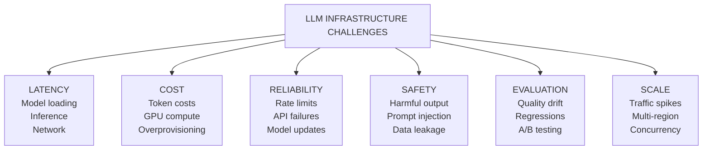
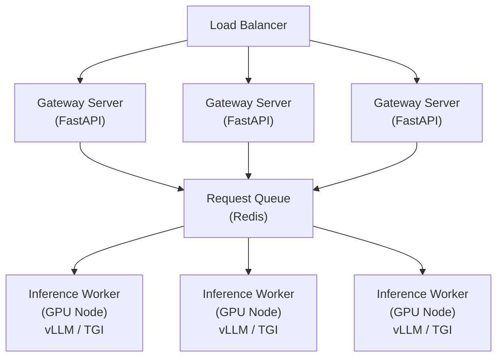
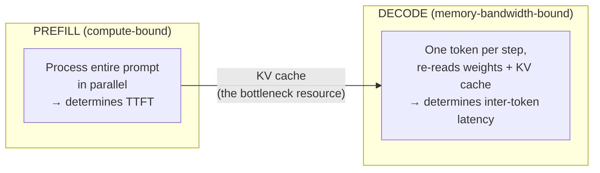
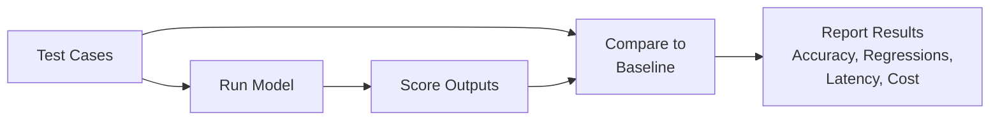
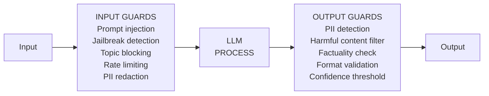

# LLMインフラストラクチャ

> **注:** この記事は英語版からの翻訳です。コードブロックおよびMermaidダイアグラムは原文のまま保持しています。

## TL;DR

本番のLLMインフラは、モデルサービング(連続バッチング、PagedAttention、プレフィックスキャッシング、投機的デコーディング、プリフィル/デコード分離)、キャッシング(まずプロバイダのプロンプトキャッシング、セマンティックキャッシングは慎重に)、制約付きデコーディングによる構造化出力、評価、コスト最適化(カスケード、量子化、バッチティア)、そしてガードレールに広がります。サービング層は2つのレジーム — 計算律速のプリフィルとメモリ帯域律速のデコード — に支配されており、モダンスタック(vLLM、SGLang、TensorRT-LLM)のほぼすべての最適化は、その非対称性をまたいでGPUを忙しく保つためのものです。リクエスト/秒だけでなく、TTFT、トークン間レイテンシ、SLO下のグッドプットを測ってください。

---

## インフラストラクチャの課題



---

## モデルサービングアーキテクチャ

### 基本的なサービングインフラストラクチャ



```python
from fastapi import FastAPI, BackgroundTasks
from pydantic import BaseModel
from typing import Optional, List
import asyncio
import uuid

app = FastAPI()

class CompletionRequest(BaseModel):
    prompt: str
    model: str = "llama-3-70b"
    max_tokens: int = 1024
    temperature: float = 0.7
    stream: bool = False

class CompletionResponse(BaseModel):
    id: str
    choices: List[dict]
    usage: dict

class LLMGateway:
    """Gateway service for LLM requests."""

    def __init__(self, config):
        self.request_queue = RequestQueue(config.redis_url)
        self.model_router = ModelRouter(config.models)
        self.rate_limiter = RateLimiter(config.rate_limits)
        self.cache = SemanticCache(config.cache_url)

    async def complete(self, request: CompletionRequest, user_id: str) -> CompletionResponse:
        """Process completion request."""

        # Rate limiting
        if not await self.rate_limiter.allow(user_id):
            raise RateLimitExceeded()

        # Check cache
        cached = await self.cache.get(request.prompt, request.model)
        if cached:
            return cached

        # Route to appropriate model/backend
        backend = await self.model_router.route(request)

        # Queue request
        request_id = str(uuid.uuid4())
        result = await self.request_queue.enqueue_and_wait(
            request_id=request_id,
            backend=backend,
            request=request
        )

        # Cache result
        await self.cache.set(request.prompt, request.model, result)

        return result


class RequestQueue:
    """Manages request queuing and batching."""

    def __init__(self, redis_url: str):
        self.redis = Redis(redis_url)
        self.pending = {}

    async def enqueue_and_wait(
        self,
        request_id: str,
        backend: str,
        request: CompletionRequest,
        timeout: float = 60.0
    ) -> CompletionResponse:
        """Enqueue request and wait for result."""

        # Create future for result
        future = asyncio.Future()
        self.pending[request_id] = future

        # Add to queue
        await self.redis.lpush(f"queue:{backend}", {
            "request_id": request_id,
            "request": request.dict()
        })

        try:
            return await asyncio.wait_for(future, timeout)
        except asyncio.TimeoutError:
            raise InferenceTimeout()
        finally:
            del self.pending[request_id]

    async def on_result(self, request_id: str, result: dict):
        """Called when inference completes."""
        if request_id in self.pending:
            self.pending[request_id].set_result(result)
```

### vLLMによる連続バッチ処理

```python
from vllm import LLM, SamplingParams
from vllm.engine.async_llm_engine import AsyncLLMEngine
import asyncio

class InferenceWorker:
    """Worker that runs model inference with continuous batching."""

    def __init__(self, model_name: str, gpu_memory_utilization: float = 0.9):
        self.engine = AsyncLLMEngine.from_engine_args(
            model=model_name,
            gpu_memory_utilization=gpu_memory_utilization,
            max_num_batched_tokens=8192,
            max_num_seqs=256,  # Max concurrent sequences
        )

    async def generate(
        self,
        prompt: str,
        sampling_params: SamplingParams,
        request_id: str
    ) -> str:
        """Generate completion with continuous batching."""

        results_generator = self.engine.generate(
            prompt=prompt,
            sampling_params=sampling_params,
            request_id=request_id
        )

        final_output = None
        async for request_output in results_generator:
            final_output = request_output

        return final_output.outputs[0].text

    async def stream_generate(
        self,
        prompt: str,
        sampling_params: SamplingParams,
        request_id: str
    ):
        """Stream tokens as they're generated."""

        results_generator = self.engine.generate(
            prompt=prompt,
            sampling_params=sampling_params,
            request_id=request_id
        )

        previous_text = ""
        async for request_output in results_generator:
            current_text = request_output.outputs[0].text
            new_text = current_text[len(previous_text):]
            previous_text = current_text

            if new_text:
                yield new_text


class BatchProcessor:
    """Processes requests in optimized batches."""

    def __init__(self, worker: InferenceWorker, batch_size: int = 32):
        self.worker = worker
        self.batch_size = batch_size
        self.request_buffer = asyncio.Queue()

    async def run(self):
        """Main processing loop."""
        while True:
            batch = await self._collect_batch()
            if batch:
                await self._process_batch(batch)

    async def _collect_batch(self, timeout: float = 0.05) -> list:
        """Collect requests into a batch."""
        batch = []

        try:
            # Wait for first request
            first = await asyncio.wait_for(
                self.request_buffer.get(),
                timeout=timeout
            )
            batch.append(first)

            # Collect more requests without waiting
            while len(batch) < self.batch_size:
                try:
                    req = self.request_buffer.get_nowait()
                    batch.append(req)
                except asyncio.QueueEmpty:
                    break
        except asyncio.TimeoutError:
            pass

        return batch

    async def _process_batch(self, batch: list):
        """Process a batch of requests concurrently."""
        tasks = []
        for request in batch:
            task = asyncio.create_task(
                self.worker.generate(
                    prompt=request["prompt"],
                    sampling_params=SamplingParams(**request["params"]),
                    request_id=request["id"]
                )
            )
            tasks.append((request, task))

        # Wait for all completions
        for request, task in tasks:
            try:
                result = await task
                await self._send_result(request["id"], result)
            except Exception as e:
                await self._send_error(request["id"], str(e))
```

### モダンな推論エンジンの内側

LLM推論には正反対のハードウェアプロファイルを持つ2つのフェーズがあり、ほぼすべてのサービング最適化はその非対称性を利用します:



**連続バッチング (Continuous batching)。** リクエストは静的バッチの最遅メンバーを待たず、*トークン*粒度でバッチに参加・離脱します。これだけで、vLLM/TGI級のエンジンが素朴なサービングより1桁高いスループットを出します — 完了したシーケンスのスロットは次のステップで即座に再利用されます。

**PagedAttention。** KVキャッシュをリクエストごとの連続バッファではなく、間接テーブル付きの固定サイズブロック(仮想メモリのページのよう)で確保します。バッチサイズの上限となっていたメモリ断片化を消し、シーケンス間のKV共有(1プロンプトからのNサンプルがプロンプトのブロックを共有)を可能にします。

**プレフィックスキャッシング (RadixAttention)。** 同じシステムプロンプト、同じfew-shotブロック、エージェント会話の履歴全体 — プロンプトのプレフィックスを共有するリクエストは、プリフィルを再計算せずプレフィックスのKVブロックを再利用します。SGLangはキャッシュを基数木として組織し、リクエスト横断の共有を最大化します。毎ターン全トランスクリプトを再送するエージェント/チャットのワークロードでは、プレフィックスキャッシングはプリフィル作業を日常的に80〜95%削減します。プロバイダ側プロンプトキャッシングのセルフホスト版です。

**チャンクドプリフィル。** 長いプロンプトのプリフィルをチャンクに割り、進行中のデコードステップと交互配置します。あるユーザーの10万トークンのプロンプトが、他の全ユーザーのトークンストリームを止めないように。単一レプリカ内のプリフィル/デコード干渉の標準的な修正です。

**投機的デコーディング。** 安価なドラフター(小型モデル、Medusa/EAGLE型の追加デコードヘッド、n-gram検索)がkトークンを提案し、ターゲットモデルが1回のフォワードパスで検証して最長の正しい並びを受理します。出力は通常のデコードと証明可能に同一で、受理率が高ければトークン間レイテンシは2〜3倍下がります(コードや構造化テキストはよく受理され、高エントロピーの創作文はされません)。

**プリフィル/デコード分離。** データセンター規模では、プリフィルとデコードは独立にサイズされた*別々のGPUプール*で動き、KVキャッシュはNVLink/RDMA越しにストリームされます(DistServe、Mooncake — Kimiのサービング基盤のアーキテクチャ)。2フェーズが同じSLOを奪い合うのを止めます: TTFTのためにプリフィル容量を、トークン/秒のためにデコード容量をスケールし、階層化KVストア(HBM → DRAM → SSD)がクラスタ全域のプレフィックスキャッシュを兼ねます。

**量子化。** FP8の重み+活性は現行ハードウェアでほぼ無損失で、BF16比でスループットをほぼ倍にします。INT4の重みのみ量子化(AWQ/GPTQ)はメモリをさらに半減させ、レイテンシ耐性のある、あるいはメモリ制約のあるデプロイに向きます。KVキャッシュの量子化(FP8)は達成可能なバッチサイズ — たいてい束縛条件 — を直接引き上げます。自分の評価で検証を — 量子化の損失は平均的なパープレキシティではなく、ロングテールの推論に集中します。

```python
# What the knobs look like in practice (vLLM)
from vllm import LLM

llm = LLM(
    model="meta-llama/Llama-3.3-70B-Instruct",
    tensor_parallel_size=4,          # shard weights across 4 GPUs
    gpu_memory_utilization=0.92,     # rest is headroom for activations
    enable_prefix_caching=True,      # radix-style KV reuse across requests
    enable_chunked_prefill=True,     # protect inter-token latency
    quantization="fp8",              # weights + activations
    kv_cache_dtype="fp8",            # bigger effective batch
    speculative_config={             # draft-model speculation
        "model": "meta-llama/Llama-3.2-1B-Instruct",
        "num_speculative_tokens": 5,
    },
)
```

**重要なメトリクス。** 対話的サービングでは生スループットは無意味です。**TTFT**(最初のトークンまで — プリフィル+キューイング)、**TPOT/ITL**(出力トークンあたり時間)、そして**グッドプット**: *レイテンシSLOを満たす*毎秒リクエスト数を追跡します。生スループットを30%上げてもp95 TTFTがSLOを超える構成は、負の価値です。

### 構造化出力と制約付きデコーディング

本番システムに必要なのは「だいたいJSON」ではなく妥当なJSONです。モダンなエンジンは出力構造を*デコード中に*強制します: 文法コンパイラ(xgrammar、llguidance、Outlines)がJSON Schemaをトークンレベルのマスクに変換し、不正なトークンはそもそもサンプリングされません。妥当性保証、ほぼゼロのオーバーヘッド、リトライループ不要。

```python
from pydantic import BaseModel

class Triage(BaseModel):
    severity: str          # "P0" | "P1" | "P2"
    component: str
    needs_human: bool

# vLLM / SGLang / OpenAI-compatible servers accept the schema directly
response = client.chat.completions.create(
    model="local-llama",
    messages=[{"role": "user", "content": f"Triage this incident:\n{report}"}],
    response_format={
        "type": "json_schema",
        "json_schema": {"name": "triage", "schema": Triage.model_json_schema(), "strict": True},
    },
)
incident = Triage.model_validate_json(response.choices[0].message.content)
```

プログラムが消費するものにはスキーマ制約付き出力を、人間向けには自由テキストを。注意点がひとつ: 制約されたモデルは不確実さを表明する代わりに、スキーマ的に妥当なゴミを*必ず*生成します — スキーマに明示的な `"unknown"`/`needs_human` の逃げ道を含めてください。

### モデルルーティング

```python
from typing import Dict, List
from dataclasses import dataclass

@dataclass
class ModelConfig:
    name: str
    endpoint: str
    max_tokens: int
    cost_per_1k_tokens: float
    latency_p50_ms: int
    capabilities: List[str]

class ModelRouter:
    """Routes requests to appropriate models."""

    def __init__(self, models: Dict[str, ModelConfig]):
        self.models = models
        self.health_checker = ModelHealthChecker()

    async def route(self, request: CompletionRequest) -> str:
        """Select best model for request."""

        # Filter by capabilities
        capable_models = [
            name for name, config in self.models.items()
            if self._can_handle(config, request)
        ]

        # Filter by health
        healthy_models = [
            name for name in capable_models
            if await self.health_checker.is_healthy(name)
        ]

        if not healthy_models:
            raise NoHealthyModelsAvailable()

        # Select based on strategy
        return await self._select_model(healthy_models, request)

    def _can_handle(self, config: ModelConfig, request: CompletionRequest) -> bool:
        """Check if model can handle request."""
        return (
            request.max_tokens <= config.max_tokens and
            request.model in [config.name, "auto"]
        )

    async def _select_model(
        self,
        candidates: List[str],
        request: CompletionRequest
    ) -> str:
        """Select from candidate models."""

        # Cost-optimized selection
        if request.model == "auto":
            return min(
                candidates,
                key=lambda m: self.models[m].cost_per_1k_tokens
            )

        # Specific model requested
        if request.model in candidates:
            return request.model

        # Fallback
        return candidates[0]


class ModelCascade:
    """Route to cheaper models first, escalate if needed."""

    def __init__(self, models: List[ModelConfig], quality_threshold: float = 0.7):
        # Sort by cost (cheapest first)
        self.models = sorted(models, key=lambda m: m.cost_per_1k_tokens)
        self.quality_threshold = quality_threshold
        self.quality_estimator = QualityEstimator()

    async def complete(self, request: CompletionRequest) -> CompletionResponse:
        """Try models in order of cost until quality threshold met."""

        for model in self.models:
            response = await self._call_model(model, request)

            # Estimate quality
            quality = await self.quality_estimator.estimate(
                request.prompt,
                response.choices[0]["text"]
            )

            if quality >= self.quality_threshold:
                return response

            # Log for analysis
            logger.info(f"Model {model.name} quality {quality} below threshold")

        # Return last (most capable) model's response
        return response
```

---

## キャッシング戦略

### プロンプトキャッシング(プロバイダ側) — まずこれを使う

すべての主要APIプロバイダは、繰り返されるプロンプト*プレフィックス*のKV状態をキャッシュし、キャッシュ済みトークンを新規入力価格の約10%で課金します(一部プロバイダはキャッシュ書き込みに小さなプレミアム)。セマンティックキャッシングと違い、これは厳密・無損失・プロバイダ管理です — 正しさのリスクはなく、あるのはエンジニアリング要件だけです: **プレフィックスをバイト単位で安定に保つこと**。

プロンプトキャッシングを機能させるルール:

- コンテキストは安定→揮発の順に: システムプロンプトとツールスキーマが先頭、セッションデータが次、進行中の会話が最後。
- メッセージ履歴は追記のみ。過去ターンの編集・並べ替え・再レンダリングは、その地点以降のキャッシュを無効化します。
- プレフィックスにタイムスタンプ・UUID・リクエスト単位のノイズを入れない。揮発データは末尾かツール結果で注入。
- API使用量フィールドの `cached_tokens` を一級メトリクスとして監視。エージェント的ワークロード — 毎ターン全トランスクリプトを再送する — では、キャッシュヒット率がモデル選択を大きく上回る、システム全体最大のコストレバーです。

多くのプロバイダは**バッチティア**(非同期・数時間レイテンシで50%引き)も提供しています — 評価、バックフィル、非対話的なパイプラインはデフォルトでそちらへ。

### セマンティックキャッシュ


メリット: 言い換えたクエリにも対応、APIコストを大幅に削減、キャッシュヒット時はサブミリ秒のレスポンス。

注意点 — セマンティックキャッシングは正しさをコストと交換するので、適用範囲を意図して絞ること: 類似度 ≥ 0.95 は同じ正答を**保証しません**(「フランスの首都」と「フランス本土の首都」は良いが、「2023年の売上」と「2024年の売上」は駄目)。キャッシュはユーザー/テナントとモデル+パラメータのハッシュで分割し、時間に敏感なものはTTLを短く、対象はステートレスで反復の多いクエリトラフィックに限定します — パーソナライズされたコンテキストをまたいでキャッシュしてはならず、会話状態が全リクエストを一意にするエージェントのターンにも決して使わないこと(そちらはプロンプトキャッシングの仕事です)。

```python
import hashlib
from typing import Optional
import numpy as np

class SemanticCache:
    """Cache LLM responses with semantic similarity matching."""

    def __init__(
        self,
        embedding_model,
        vector_store,
        kv_store,
        similarity_threshold: float = 0.95,
        ttl_seconds: int = 3600
    ):
        self.embedder = embedding_model
        self.vector_store = vector_store
        self.kv_store = kv_store  # Redis/Memcached
        self.threshold = similarity_threshold
        self.ttl = ttl_seconds

    async def get(
        self,
        prompt: str,
        model: str,
        params_hash: str = None
    ) -> Optional[dict]:
        """Try to get cached response."""

        # Try exact match first (faster)
        exact_key = self._exact_key(prompt, model, params_hash)
        exact_result = await self.kv_store.get(exact_key)
        if exact_result:
            return exact_result

        # Try semantic match
        prompt_embedding = await self.embedder.embed(prompt)

        results = await self.vector_store.search(
            embedding=prompt_embedding,
            top_k=1,
            filter={"model": model}
        )

        if results and results[0].score >= self.threshold:
            cache_key = results[0].metadata["cache_key"]
            return await self.kv_store.get(cache_key)

        return None

    async def set(
        self,
        prompt: str,
        model: str,
        response: dict,
        params_hash: str = None
    ):
        """Cache a response."""

        cache_key = self._exact_key(prompt, model, params_hash)

        # Store response
        await self.kv_store.set(cache_key, response, ex=self.ttl)

        # Store embedding for semantic search
        prompt_embedding = await self.embedder.embed(prompt)
        await self.vector_store.upsert([{
            "id": cache_key,
            "embedding": prompt_embedding,
            "metadata": {
                "model": model,
                "cache_key": cache_key,
                "prompt_preview": prompt[:100]
            }
        }])

    def _exact_key(self, prompt: str, model: str, params_hash: str = None) -> str:
        """Generate exact match cache key."""
        content = f"{model}:{prompt}:{params_hash or ''}"
        return f"llm_cache:{hashlib.sha256(content.encode()).hexdigest()}"


class TieredCache:
    """Multi-tier caching strategy."""

    def __init__(self):
        self.l1_cache = InMemoryCache(max_size=1000)  # Hot cache
        self.l2_cache = RedisCache()  # Distributed cache
        self.l3_cache = SemanticCache()  # Semantic matching

    async def get(self, prompt: str, model: str) -> Optional[dict]:
        """Try caches in order."""

        # L1: In-memory (fastest)
        key = self._key(prompt, model)
        result = self.l1_cache.get(key)
        if result:
            return result

        # L2: Redis (fast)
        result = await self.l2_cache.get(key)
        if result:
            self.l1_cache.set(key, result)  # Populate L1
            return result

        # L3: Semantic (slower but handles variations)
        result = await self.l3_cache.get(prompt, model)
        if result:
            # Populate upper tiers
            self.l1_cache.set(key, result)
            await self.l2_cache.set(key, result)
            return result

        return None
```

### KVキャッシュ管理

```python
class KVCacheManager:
    """Manage KV cache for efficient inference."""

    def __init__(self, max_cache_tokens: int = 100000):
        self.max_tokens = max_cache_tokens
        self.cache = {}  # session_id -> KVCache
        self.usage = {}  # session_id -> last_used

    def get_or_create(self, session_id: str, prefix_tokens: list) -> "KVCache":
        """Get existing cache or create new one."""

        if session_id in self.cache:
            return self.cache[session_id]

        # Evict if needed
        self._evict_if_needed()

        # Create new cache
        cache = KVCache(prefix_tokens)
        self.cache[session_id] = cache
        self.usage[session_id] = time.time()

        return cache

    def _evict_if_needed(self):
        """Evict least recently used caches."""
        total_tokens = sum(c.token_count for c in self.cache.values())

        while total_tokens > self.max_tokens and self.cache:
            # Find LRU session
            lru_session = min(self.usage, key=self.usage.get)

            total_tokens -= self.cache[lru_session].token_count
            del self.cache[lru_session]
            del self.usage[lru_session]

    def extend(self, session_id: str, new_tokens: list):
        """Extend existing cache with new tokens."""
        if session_id in self.cache:
            self.cache[session_id].extend(new_tokens)
            self.usage[session_id] = time.time()


class PrefixCache:
    """Cache common prompt prefixes."""

    def __init__(self, model_engine):
        self.engine = model_engine
        self.prefix_cache = {}  # prefix_hash -> computed_kv_cache

    def compute_prefix(self, prefix: str) -> str:
        """Compute and cache KV state for prefix."""
        prefix_hash = hashlib.sha256(prefix.encode()).hexdigest()[:16]

        if prefix_hash not in self.prefix_cache:
            # Compute KV cache for prefix
            kv_cache = self.engine.compute_kv_cache(prefix)
            self.prefix_cache[prefix_hash] = kv_cache

        return prefix_hash

    def generate_with_prefix(
        self,
        prefix_hash: str,
        continuation: str,
        params: dict
    ) -> str:
        """Generate using cached prefix."""

        if prefix_hash not in self.prefix_cache:
            raise ValueError("Prefix not found in cache")

        kv_cache = self.prefix_cache[prefix_hash]

        return self.engine.generate(
            prompt=continuation,
            kv_cache=kv_cache,
            **params
        )
```

---

## 評価とテスト

### 自動評価パイプライン



```python
from dataclasses import dataclass
from typing import List, Callable
import json

@dataclass
class TestCase:
    id: str
    prompt: str
    expected: str = None  # For exact match
    criteria: List[str] = None  # For LLM-as-judge
    tags: List[str] = None

@dataclass
class EvalResult:
    test_id: str
    passed: bool
    score: float
    latency_ms: float
    tokens_used: int
    details: dict

class LLMEvaluator:
    """Evaluate LLM outputs automatically."""

    def __init__(self, target_model, judge_model=None):
        self.target = target_model
        self.judge = judge_model or target_model

    async def run_eval(
        self,
        test_cases: List[TestCase],
        eval_functions: List[Callable] = None
    ) -> List[EvalResult]:
        """Run evaluation on test cases."""

        results = []

        for test in test_cases:
            start = time.time()

            # Generate output
            output = await self.target.generate(test.prompt)

            latency = (time.time() - start) * 1000

            # Evaluate
            scores = {}

            # Exact match
            if test.expected:
                scores["exact_match"] = float(output.strip() == test.expected.strip())

            # LLM-as-judge
            if test.criteria:
                judge_scores = await self._llm_judge(
                    test.prompt,
                    output,
                    test.criteria
                )
                scores.update(judge_scores)

            # Custom eval functions
            if eval_functions:
                for func in eval_functions:
                    scores[func.__name__] = func(test.prompt, output)

            # Aggregate score
            avg_score = sum(scores.values()) / len(scores) if scores else 0

            results.append(EvalResult(
                test_id=test.id,
                passed=avg_score >= 0.7,
                score=avg_score,
                latency_ms=latency,
                tokens_used=output.usage.total_tokens,
                details=scores
            ))

        return results

    async def _llm_judge(
        self,
        prompt: str,
        output: str,
        criteria: List[str]
    ) -> dict:
        """Use LLM to judge output quality."""

        judge_prompt = f"""Evaluate this LLM output against the criteria.

Original prompt: {prompt}

Output to evaluate: {output}

Criteria to check:
{json.dumps(criteria, indent=2)}

For each criterion, score 0-1 and explain.
Return JSON with criterion names as keys."""

        response = await self.judge.generate(
            judge_prompt,
            response_format={"type": "json_object"}
        )

        return json.loads(response)


class RegressionDetector:
    """Detect quality regressions between model versions."""

    def __init__(self, baseline_results: List[EvalResult]):
        self.baseline = {r.test_id: r for r in baseline_results}

    def compare(
        self,
        new_results: List[EvalResult],
        threshold: float = 0.05
    ) -> dict:
        """Compare new results to baseline."""

        regressions = []
        improvements = []

        for result in new_results:
            if result.test_id not in self.baseline:
                continue

            baseline = self.baseline[result.test_id]
            diff = result.score - baseline.score

            if diff < -threshold:
                regressions.append({
                    "test_id": result.test_id,
                    "baseline_score": baseline.score,
                    "new_score": result.score,
                    "diff": diff
                })
            elif diff > threshold:
                improvements.append({
                    "test_id": result.test_id,
                    "baseline_score": baseline.score,
                    "new_score": result.score,
                    "diff": diff
                })

        return {
            "regressions": regressions,
            "improvements": improvements,
            "regression_rate": len(regressions) / len(new_results),
            "passed": len(regressions) == 0
        }


class ContinuousEval:
    """Run evaluations continuously in production."""

    def __init__(self, evaluator: LLMEvaluator, sample_rate: float = 0.01):
        self.evaluator = evaluator
        self.sample_rate = sample_rate
        self.metrics = PrometheusMetrics()

    async def maybe_evaluate(self, request: dict, response: dict):
        """Sample and evaluate production traffic."""

        if random.random() > self.sample_rate:
            return

        # Create test case from production request
        test = TestCase(
            id=f"prod_{request['id']}",
            prompt=request["prompt"],
            criteria=[
                "Response is helpful and relevant",
                "Response is factually accurate",
                "Response follows safety guidelines"
            ]
        )

        # Evaluate
        results = await self.evaluator.run_eval([test])
        result = results[0]

        # Record metrics
        self.metrics.record_eval_score(result.score)
        self.metrics.record_latency(result.latency_ms)

        # Alert on low scores
        if result.score < 0.5:
            await self._alert_low_quality(request, response, result)
```

---

## コスト最適化

### トークン管理

```python
from tiktoken import encoding_for_model

class TokenManager:
    """Manage token usage and costs.

    Never hardcode prices — they change quarterly. Load a pricing table
    from config, and model all four meters: fresh input, cached input
    (~10% of fresh), output (often 4-5x input — thinking tokens bill as
    output), and batch-tier discounts (~50%).
    """

    def __init__(self, pricing: dict[str, dict[str, float]]):
        self.pricing = pricing  # per 1M tokens, from config/pricing.yaml
        self.encoders = {}

    def count_tokens(self, text: str, model: str) -> int:
        """Count tokens in text."""
        if model not in self.encoders:
            self.encoders[model] = encoding_for_model(model)
        return len(self.encoders[model].encode(text))

    def estimate_cost(
        self,
        model: str,
        input_tokens: int,
        output_tokens: int,
        cached_tokens: int = 0,
        batch: bool = False,
    ) -> float:
        """Estimate cost for a request."""
        p = self.pricing[model]
        fresh = input_tokens - cached_tokens

        cost = (
            fresh * p["input"]
            + cached_tokens * p.get("cached_input", p["input"] * 0.1)
            + output_tokens * p["output"]
        ) / 1_000_000

        return cost * 0.5 if batch else cost

    def optimize_prompt(self, prompt: str, max_tokens: int) -> str:
        """Trim prompt to fit token budget."""
        pass


class BudgetManager:
    """Manage spending budgets."""

    def __init__(self, redis_client):
        self.redis = redis_client

    async def check_budget(
        self,
        user_id: str,
        estimated_cost: float
    ) -> bool:
        """Check if user has budget for request."""

        key = f"budget:{user_id}"
        current_spend = float(await self.redis.get(key) or 0)
        limit = await self._get_limit(user_id)

        return current_spend + estimated_cost <= limit

    async def record_spend(self, user_id: str, cost: float):
        """Record spending."""
        key = f"budget:{user_id}"
        await self.redis.incrbyfloat(key, cost)

    async def _get_limit(self, user_id: str) -> float:
        """Get user's spending limit."""
        return 100.0  # Default $100/month


class CostOptimizedPipeline:
    """Pipeline that optimizes for cost."""

    def __init__(self, models: List[dict]):
        self.models = sorted(models, key=lambda m: m["cost_per_1k"])
        self.token_manager = TokenManager()

    async def complete(
        self,
        prompt: str,
        quality_threshold: float = 0.7,
        max_cost: float = None
    ) -> dict:
        """Complete with cost optimization."""

        input_tokens = self.token_manager.count_tokens(prompt, "gpt-4")

        for model in self.models:
            estimated_cost = self.token_manager.estimate_cost(
                model["name"],
                input_tokens,
                model.get("avg_output_tokens", 500)
            )

            if max_cost and estimated_cost > max_cost:
                continue

            response = await self._call_model(model, prompt)
            quality = await self._estimate_quality(prompt, response)

            if quality >= quality_threshold:
                return {
                    "response": response,
                    "model": model["name"],
                    "cost": estimated_cost,
                    "quality": quality
                }

        return await self._call_model(self.models[-1], prompt)
```

---

## ガードレールと安全性

### 入出力フィルタリング



```python
from abc import ABC, abstractmethod
from typing import Tuple, Optional
import re

class Guard(ABC):
    """Base class for guardrails."""

    @abstractmethod
    async def check(self, text: str) -> Tuple[bool, Optional[str]]:
        """Check text against guard.
        Returns (passed, reason if failed)
        """
        pass

class PromptInjectionGuard(Guard):
    """Detect prompt injection attempts."""

    INJECTION_PATTERNS = [
        r"ignore\s+(previous|above|all)\s+instructions",
        r"disregard\s+(previous|above|all)",
        r"you\s+are\s+now\s+(?:a|an)\s+\w+",
        r"new\s+instructions:",
        r"system\s*:\s*",
        r"<\|.*?\|>",  # Special tokens
    ]

    def __init__(self, llm_detector=None):
        self.patterns = [re.compile(p, re.IGNORECASE) for p in self.INJECTION_PATTERNS]
        self.llm_detector = llm_detector

    async def check(self, text: str) -> Tuple[bool, Optional[str]]:
        for pattern in self.patterns:
            if pattern.search(text):
                return False, "Potential prompt injection detected"

        if self.llm_detector:
            is_injection = await self.llm_detector.detect(text)
            if is_injection:
                return False, "LLM-detected prompt injection"

        return True, None


class PIIGuard(Guard):
    """Detect and redact PII."""

    PII_PATTERNS = {
        "email": r'\b[A-Za-z0-9._%+-]+@[A-Za-z0-9.-]+\.[A-Z|a-z]{2,}\b',
        "phone": r'\b\d{3}[-.]?\d{3}[-.]?\d{4}\b',
        "ssn": r'\b\d{3}-\d{2}-\d{4}\b',
        "credit_card": r'\b\d{4}[-\s]?\d{4}[-\s]?\d{4}[-\s]?\d{4}\b',
    }

    def __init__(self, mode: str = "block"):
        self.mode = mode
        self.patterns = {k: re.compile(v) for k, v in self.PII_PATTERNS.items()}

    async def check(self, text: str) -> Tuple[bool, Optional[str]]:
        found_pii = []

        for pii_type, pattern in self.patterns.items():
            if pattern.search(text):
                found_pii.append(pii_type)

        if found_pii:
            if self.mode == "block":
                return False, f"PII detected: {', '.join(found_pii)}"
            elif self.mode == "warn":
                return True, f"Warning: PII detected: {', '.join(found_pii)}"

        return True, None

    def redact(self, text: str) -> str:
        """Redact PII from text."""
        for pii_type, pattern in self.patterns.items():
            text = pattern.sub(f"[REDACTED_{pii_type.upper()}]", text)
        return text


class ContentModerationGuard(Guard):
    """Filter harmful content."""

    def __init__(self, moderation_api):
        self.api = moderation_api

    async def check(self, text: str) -> Tuple[bool, Optional[str]]:
        result = await self.api.moderate(text)

        if result.flagged:
            categories = [c for c, v in result.categories.items() if v]
            return False, f"Content flagged: {', '.join(categories)}"

        return True, None


class GuardrailsPipeline:
    """Complete guardrails pipeline."""

    def __init__(self):
        self.input_guards: List[Guard] = []
        self.output_guards: List[Guard] = []

    def add_input_guard(self, guard: Guard):
        self.input_guards.append(guard)

    def add_output_guard(self, guard: Guard):
        self.output_guards.append(guard)

    async def process(
        self,
        input_text: str,
        llm_func: Callable
    ) -> dict:
        """Process request through guardrails."""

        # Input guards
        for guard in self.input_guards:
            passed, reason = await guard.check(input_text)
            if not passed:
                return {
                    "blocked": True,
                    "stage": "input",
                    "guard": guard.__class__.__name__,
                    "reason": reason
                }

        # LLM call
        output = await llm_func(input_text)

        # Output guards
        for guard in self.output_guards:
            passed, reason = await guard.check(output)
            if not passed:
                return {
                    "blocked": True,
                    "stage": "output",
                    "guard": guard.__class__.__name__,
                    "reason": reason,
                    "original_output": output
                }

        return {
            "blocked": False,
            "output": output
        }


# Usage
pipeline = GuardrailsPipeline()
pipeline.add_input_guard(PromptInjectionGuard())
pipeline.add_input_guard(PIIGuard(mode="redact"))
pipeline.add_output_guard(ContentModerationGuard(openai_moderation))
pipeline.add_output_guard(PIIGuard(mode="block"))
```

### レート制限

```python
from dataclasses import dataclass
import time

@dataclass
class RateLimitConfig:
    requests_per_minute: int
    tokens_per_minute: int
    requests_per_day: int
    tokens_per_day: int

class RateLimiter:
    """Token and request rate limiting."""

    def __init__(self, redis_client, default_config: RateLimitConfig):
        self.redis = redis_client
        self.default_config = default_config

    async def check_and_consume(
        self,
        user_id: str,
        tokens: int,
        config: RateLimitConfig = None
    ) -> Tuple[bool, dict]:
        """Check rate limits and consume quota if allowed."""

        config = config or self.default_config
        now = time.time()
        minute_key = f"rl:{user_id}:minute:{int(now / 60)}"
        day_key = f"rl:{user_id}:day:{int(now / 86400)}"

        minute_requests = int(await self.redis.hget(minute_key, "requests") or 0)
        minute_tokens = int(await self.redis.hget(minute_key, "tokens") or 0)
        day_requests = int(await self.redis.hget(day_key, "requests") or 0)
        day_tokens = int(await self.redis.hget(day_key, "tokens") or 0)

        if minute_requests >= config.requests_per_minute:
            return False, {"reason": "requests_per_minute", "retry_after": 60}

        if minute_tokens + tokens > config.tokens_per_minute:
            return False, {"reason": "tokens_per_minute", "retry_after": 60}

        if day_requests >= config.requests_per_day:
            return False, {"reason": "requests_per_day", "retry_after": 86400}

        if day_tokens + tokens > config.tokens_per_day:
            return False, {"reason": "tokens_per_day", "retry_after": 86400}

        pipe = self.redis.pipeline()
        pipe.hincrby(minute_key, "requests", 1)
        pipe.hincrby(minute_key, "tokens", tokens)
        pipe.expire(minute_key, 120)
        pipe.hincrby(day_key, "requests", 1)
        pipe.hincrby(day_key, "tokens", tokens)
        pipe.expire(day_key, 172800)
        await pipe.execute()

        return True, {
            "remaining": {
                "requests_minute": config.requests_per_minute - minute_requests - 1,
                "tokens_minute": config.tokens_per_minute - minute_tokens - tokens,
            }
        }
```

---

## モニタリングとオブザーバビリティ

```python
from prometheus_client import Counter, Histogram, Gauge

class LLMMetrics:
    """Prometheus metrics for LLM infrastructure."""

    def __init__(self):
        self.requests_total = Counter(
            "llm_requests_total",
            "Total LLM requests",
            ["model", "status"]
        )

        self.request_latency = Histogram(
            "llm_request_latency_seconds",
            "Request latency",
            ["model"],
            buckets=[0.1, 0.5, 1, 2, 5, 10, 30, 60]
        )

        self.tokens_processed = Counter(
            "llm_tokens_total",
            "Total tokens processed",
            ["model", "direction"]
        )

        self.cost_total = Counter(
            "llm_cost_dollars",
            "Total cost in dollars",
            ["model"]
        )

        self.cache_hits = Counter(
            "llm_cache_hits_total",
            "Cache hits",
            ["cache_level"]
        )

        self.cache_misses = Counter(
            "llm_cache_misses_total",
            "Cache misses"
        )

        self.eval_scores = Histogram(
            "llm_eval_score",
            "Evaluation scores",
            ["model", "eval_type"],
            buckets=[0.1, 0.2, 0.3, 0.4, 0.5, 0.6, 0.7, 0.8, 0.9, 1.0]
        )

        self.guardrail_blocks = Counter(
            "llm_guardrail_blocks_total",
            "Requests blocked by guardrails",
            ["guard_type", "stage"]
        )

    def record_request(
        self,
        model: str,
        status: str,
        latency: float,
        input_tokens: int,
        output_tokens: int,
        cost: float
    ):
        self.requests_total.labels(model=model, status=status).inc()
        self.request_latency.labels(model=model).observe(latency)
        self.tokens_processed.labels(model=model, direction="input").inc(input_tokens)
        self.tokens_processed.labels(model=model, direction="output").inc(output_tokens)
        self.cost_total.labels(model=model).inc(cost)
```

---

## トレードオフ

| 判断項目 | トレードオフ |
|----------|-----------|
| **セルフホスト vs API** | 制御性とコスト vs 複雑性 |
| **キャッシュの積極性** | 速度とコスト vs 鮮度 |
| **ガードの厳格さ** | 安全性 vs 実用性 |
| **モデルカスケード** | コスト vs レイテンシ |
| **バッチサイズ** | スループット vs レイテンシ |

---

## 参考文献

- [vLLM: High-throughput LLM Serving](https://github.com/vllm-project/vllm) / [SGLang](https://github.com/sgl-project/sglang) — 支配的なオープンサービングエンジン
- [Efficient Memory Management for LLM Serving with PagedAttention](https://arxiv.org/abs/2309.06180) — vLLM論文
- [DistServe: Disaggregating Prefill and Decoding](https://arxiv.org/abs/2401.09670) / [Mooncake: KVCache-centric Disaggregated Architecture](https://arxiv.org/abs/2407.00079)
- [EAGLE: Speculative Sampling Requires Rethinking Feature Uncertainty](https://arxiv.org/abs/2401.15077) / [Medusa](https://arxiv.org/abs/2401.10774) — 投機的デコーディング
- [XGrammar: Flexible and Efficient Structured Generation](https://github.com/mlc-ai/xgrammar) / [Outlines](https://github.com/dottxt-ai/outlines) — 制約付きデコーディング
- [Anthropic Prompt Caching](https://docs.anthropic.com/en/docs/build-with-claude/prompt-caching) / [OpenAI Prompt Caching](https://platform.openai.com/docs/guides/prompt-caching)
- [OpenTelemetry GenAI Semantic Conventions](https://opentelemetry.io/docs/specs/semconv/gen-ai/) — LLMシステムの標準トレース/メトリクススキーマ
- [NeMo Guardrails](https://github.com/NVIDIA/NeMo-Guardrails) / [Guardrails AI](https://github.com/guardrails-ai/guardrails)
- [LiteLLM](https://github.com/BerriAI/litellm) — マルチプロバイダゲートウェイ、ルーティング、予算
