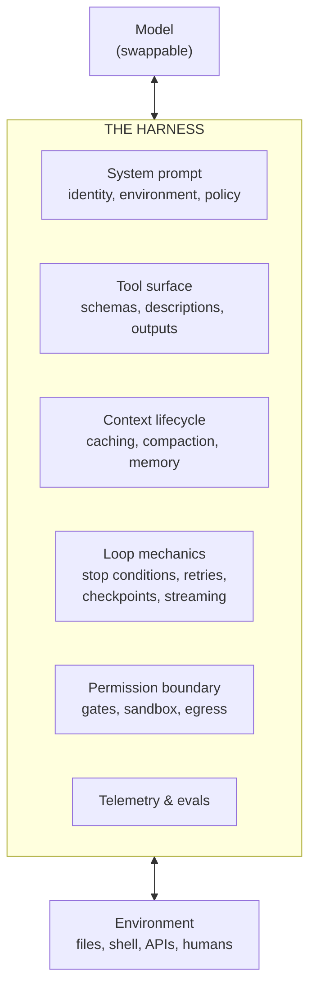
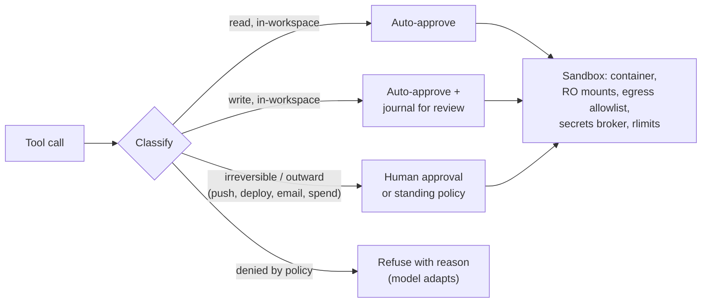

# ハーネスエンジニアリング

> **注:** この記事は英語版からの翻訳です。コードブロックおよびMermaidダイアグラムは原文のまま保持しています。

## TL;DR

ハーネスとは、モデルと外界の間に構築するすべてのもの — ループ、システムプロンプト、ツール群、コンテキストのライフサイクル、権限とサンドボックスの境界、テレメトリ — を指します。同じモデルでも、ハーネスが異なれば能力はまったく別物になります。エージェントベンチマークのスコアはすべて「モデル + ハーネス」のスコアです。ハーネスエンジニアリングとは、このレイヤーをプロダクトとして扱う規律です: キャッシュを意識したコンテキスト設計、トークン予算を持つツール、グラウンドトゥルースによる検証、ゲート付きの自律性、そしてあらゆる変更ごとに実行される評価スイート。モデルはプロバイダのスケジュールで改善されますが、ハーネスはエージェント能力のうち自分でコントロールできる部分です。

---

## なぜハーネスがプロダクトなのか



この規律を支える3つの観察:

1. **能力は共同生産される。** フロンティアモデルでも、肥大化したツールカタログ、ノイズだらけのコンテキスト、検証ループの欠如があれば、中位モデル並みの性能しか出ません。逆に、ハーネスの改善はモデルのバージョンアップよりタスク成功率を大きく動かすことが珍しくなく、しかも将来のすべてのモデルに対して効果が複利的に積み上がります。
2. **ハーネスこそが永続資産。** モデルは数ヶ月ごとに入れ替わりますが、評価スイート、ツール群、安全境界は残ります。モデルのアップグレードが「設定変更 + 評価実行」で済むようにハーネスを設計してください。
3. **ハーネスがセキュリティ境界。** モデルは読んだものすべてに説得されうる存在ですが、ハーネスはそうではありません。本当に必要な保証(データ持ち出しの禁止、未承認の支出の禁止、`rm -rf /` の禁止)は、プロンプトの文言ではなく、必ずハーネスのコードで強制しなければなりません。

---

## システムプロンプトのアーキテクチャ

システムプロンプトは、モデルに対するハーネスの設定ファイルです。プロンプトキャッシュは最初の変更点以降のすべてのトークンに課金されるため、「安定 → 揮発」の順に構成します:

```
┌──────────────────────────────────────────────┐
│ 1. Identity & objective        (never changes)│
│ 2. Environment description     (per deploy)   │
│ 3. Tool-use guidance & policy  (per deploy)   │
│ 4. Safety rules & escalation   (per deploy)   │
├─────────────── cache breakpoint ──────────────┤
│ 5. Session context (user, workspace state)    │
├─────────────── cache breakpoint ──────────────┤
│ 6. Conversation: task, tool calls, results    │
└──────────────────────────────────────────────┘
```

原則:

- **適切な抽象度で書く。** 散文に埋め込まれたハードコードの if-else は脆く、漠然とした空気感(「親切にしてください」)は無意味です。理由付きのヒューリスティクスを書いてください: *「新規ファイルの作成より既存ファイルの編集を優先する — 新規ファイルはプロジェクト構造を断片化させるため」*。理由があることで、モデルは想定外のケースにも正しく一般化できます。
- **タスク固有のデータはシステムプロンプトに置かない。** タスクの詳細はユーザーメッセージへ、参照資料はエージェントが読むファイルへ。キャッシュ済みプレフィックスの後でリクエストごとに変わるものは、キャッシュヒット率を破壊します。
- **モデルが絶対に違反してはならないポリシーは、そもそもここに書かない** — それは権限境界に置くものです。プロンプトは「デプロイ前に確認せよ」と言い、ハーネスは承認なしのデプロイを*拒否*する。多層防御であり、信頼するのは決定論的なレイヤーです。
- 思っているより短く保つこと。すべての指示は他の指示と注意を奪い合います。訓練によりモデルが確実に従う指示(「慣用的なPythonを書く」)はトークンの無駄です。

---

## ツール群の設計

ツールはインターフェースのうち、完全に自分でコントロールできる半分です(詳細は [コーディングエージェントのツール設計](../18-compound-engineering/02-coding-agent-tool-design.md)):

- **最小限の直交するツールセット。** すべてのツールのスキーマと説明文は*毎ターン*コンテキストを占有し、選択を奪い合います。よく分離された10個のツールは、重複した40個に勝ります。2つのツールの役割が重なると、モデルの挙動は非決定的に割れます。
- **説明文は構造を支える部材。** ツール説明はマイクロプロンプトです: 何をするか、隣のツールよりいつ優先すべきか、何を返すか、既知の失敗モード。プロンプトと同様に説明文もテストしてください — 評価スイートでA/Bする。
- **すべての出力に予算を。** 各ツールの最大コンテキスト占有量(例: ファイル読み込みは25Kトークン、コマンド出力は50KB)を決め、明示的なマーカー付きの切り詰めを強制します(`[truncated 4,312 lines — use offset/limit to read more]`)。ページネーション、フィルタ、応答フォーマットのパラメータ(`concise` / `detailed`)は、ダンプに勝ります。
- **エラーは教えるものであれ。** エラーメッセージはモデルにとって唯一のデバッグ信号です: 何が失敗したか、なぜか、代わりに何を試すべきかを伝える。沈黙の失敗や裸の例外は余計なターンを浪費させ、誤解を招くエラーは実行全体を汚染します。
- **bashは万能の脱出口、コード実行は強力な道具。** 500個のAPIオブジェクトをループするスクリプトは、ツール呼び出し1回と数百トークンの出力で済みます。同じ作業を個別のツール呼び出しで行えばコンテキストが溢れます。重量級のインテグレーションはコードから呼べるAPIとして公開し(MCPコード実行パターン)、型付きの構造化ツールは検証とゲートが重要なアクション — 決済、デプロイ、不可逆な操作 — のために残します。
- **カタログは遅延ロードでスケールさせる。** 数十個を超えるツールのスキーマを事前ロードしない: `search_tools` 機能を公開し、必要時に完全な定義を返す。静的プロンプトに数百のMCP由来ツール説明を置くのは、コンテキスト税であり攻撃面です。

---

## コンテキストライフサイクルのエンジニアリング

コンテキストは最も強い制約であり、支配的なコスト要因です。ハーネスは4つのメカニズムを所有します:

### 1. キャッシュ規律

推論プロバイダはキャッシュ済み入力トークンを新規の約10%で課金し、エージェントは毎ターン履歴全体を再送します — つまりキャッシュヒット率はエージェントシステム最大のコストレバーです。そこから導かれるルール:

- **会話は追記のみ(append-only)。** セッション途中で過去のメッセージを書き換えたり並べ替えたりしない。あらゆる変更は、それ以降のすべてのキャッシュを無効化します。
- **プレフィックスは安定に。** システムプロンプトとツールスキーマの変更はデプロイ時のみ。タイムスタンプ、リクエストID、「現在の日付」はコンテキストの*末尾*かツール結果に置き、先頭には決して置かない。
- キャッシュブレークポイントはプロンプト/セッション/会話の境界に配置し、キャッシュヒット率を本番の一級メトリクスとして監視する — 劣化はたいてい、誰かがプロンプトビルダーを「改善」した兆候です。

### 2. 予算管理とコンパクション

ターンごとにトークンを追跡します。閾値(ウィンドウの約70〜80%、コスト要件次第ではもっと早く)に達したらコンパクション: モデル呼び出しでトランスクリプトを「下した意思決定、発見した制約、触れたファイルパス、計画の現状、未解決項目」に要約し、システムプロンプト + 要約 + 直近のターンでループを再開します。最初に捨てるのはツール*出力*です(再導出可能だからです: エージェントはファイルを再読できますが、なぜアプローチBを選んだかは再導出できません)。コンパクションは評価で明示的にテストしてください: 要約器が悪いと、4時間のタスクは2時間目に記憶喪失になります。

### 3. メモリとしてのファイルシステム

エージェントに永続的な作業領域を与え、(システムプロンプトで)使い方を教えます: タスク計画は `plan.md`、学びは `notes.md`、成果物はコンテキストに抱え込まずディスクへ。ファイルベースの状態はコンパクション、クラッシュ、他エージェントへの引き継ぎを生き延び、人間も検査できます。セッション横断のメモリ(プロジェクト規約、ユーザー嗜好)は、モデルが監査できない埋め込みストアではなく、セッション開始時に読み込むキュレーション済み指示ファイルに置きます。[エージェントコンテキストエンジニアリング](../18-compound-engineering/03-agent-context-engineering.md) を参照。

### 4. サブエージェントへのファンアウト

サブエージェントはコンテキストのファイアウォールです: 自分のウィンドウを探索に費やし、蒸留された結果だけを返します。ハーネスは生成プリミティブを提供し、並列度とサブエージェントごとの予算に上限を設け、結果の契約を定義します(例:「2Kトークン以下、結論とファイル参照のみ — トランスクリプトは不可」)。読み込みの重い作業(検索、監査、要約)に使い、密結合の書き込みには使わないこと — 部分的な視界は支離滅裂な出力を生みます。

---

## ループ: デモとプロダクトを分かつメカニクス

```python
async def run(session: Session) -> Outcome:
    while True:
        budget.check(session)                      # turns, tokens, wall-clock, spend

        response = await model.call(
            system=PROMPT, tools=session.tools,
            messages=session.messages, stream=True,  # stream for UX + early interrupt
        )
        await session.checkpoint(response)          # durable: resume from any turn

        if response.stop_reason == "end_turn":
            return await verify_and_close(session)  # never trust "done" unverified

        calls = response.tool_calls
        decisions = await asyncio.gather(*[gate(c, session.policy) for c in calls])
        results = await asyncio.gather(*[
            execute_in_sandbox(c) if d.approved else denial_result(c, d.reason)
            for c, d in zip(calls, decisions)
        ])                                           # parallel calls run in parallel
        session.append(response, normalize(results))  # uniform shape, budget-truncated

        if loop_detector.repeating(session):         # same call-signature N times
            session.inject_steering("This approach is repeating. Re-read the plan "
                                    "and choose a different strategy, or escalate.")
```

重要なディテール:

- **停止条件は契約である。** `end_turn` はモデルが完了を*主張*しているだけ — 成功を報告する前に検証器を実行します。max-tokensによる切断(継続する)、拒否(人間に提示する)、ツール使用(ループする)を区別すること。
- **毎ターンのチェックポイント。** シリアライズされたメッセージ + ワークスペースのスナップショット = 再開可能な実行、再現可能なバグ、そして耐久実行エンジンの基盤。「Podが再起動した」のコストは1ターンであるべきで、タスク全体であってはなりません。
- **割り込み可能性はエッジケースではなく機能。** 人間は実行中に舵を切ります。注入されたユーザーメッセージは、ツール呼び出し/結果のペアリングを壊さずにターン間に着地しなければなりません。
- **ツール結果を正規化する。** 出所にかかわらず単一のエンベロープ(status、content、切り詰めマーカー、所要時間)に揃える — モデルは場当たり的な文字列より、均一な構造を測定可能なレベルでうまく扱います。
- **ループ検出はハーネスで。** 直近のツール呼び出しシグネチャをハッシュし、繰り返しを検知したらステアリングを注入するかエスカレーションします。モデルは失敗するアクションを表面だけ変えて繰り返しますが、モデルが認めるより先にハーネスがパターンを見抜けます。

### 検証レイヤー

グラウンドトゥルースをループに配線します。エージェントが信頼できるのは「確認が実行より安い」タスクだけだからです: 編集後にテスト/型チェック/lintを実行し、失敗をツール結果として返す。UIはスクリーンショットを撮る。コミット前に差分をレビューする。自己評価より終了コードを信頼してください — オラクルなしで自分の成果を採点するモデルは成功率を過大評価します。プログラム的な検証器が存在しない領域では、ルーブリックベースのLLM-as-judgeは人間へ作業を振り分ける*トリアージ*信号であり、受け入れゲートではありません。

---

## 権限境界とサンドボックス

「信頼できない入力の上で動く、説得されやすいモデル」を前提に設計します:



- **ツールの許可リストではなくアクション分類。** `bash` は安全でも危険でもありません — `cat` と `git push --force` は別物です。*効果*(読み取り / 可逆な書き込み / 不可逆 / 外向き)を分類し、クラスごとにゲートします。
- **デフォルト基盤としてのサンドボックス。** セッションごとに使い捨てのコンテナまたはmicroVM: ワークスペースは読み書きマウント、ホストは不可視、ネットワークはallowlistプロキシ経由、CPU/メモリ/ディスクに上限。シークレットはブローカーに置き、ツールの*実行*に注入する — モデルから見えるコンテキストには決して入れない。
- **プロンプトインジェクションは未解決問題。アーキテクチャで回避する。** エージェントが読むあらゆるもの — Webページ、Issue、README、ツール出力 — は指示を運びうる。ツール結果を「指示ではなくデータ」としてタグ付けし、構造的に「致命的トライアングル」を避けます: 信頼できない入力 + 機密データ + 外向きチャネルを1つのエージェントに同居させれば、設計からして持ち出し可能です。プロダクト上3つすべてが必要なら、外向きチャネルには常に人間のゲートを。
- **承認疲れはセキュリティバグ。** タスクごとに10回のダイアログを見せられたユーザーは、11回目に「常に許可」を押します。証明可能に安全なものは自動承認し、レビュー可能なものはバッチにし、割り込みは本当に不可逆なごく少数のアクションのために取っておくこと。

---

## 評価駆動のハーネス開発

ハーネスは毎週変わります。雰囲気でのレビューはスケールしません。開発ループは「**機能より先に評価を作り、評価を退行させるものは出荷しない**」です。

- **タスクスイート。** 自ドメインの実タスク50〜200件と、プログラム的な採点器(テストが通る、成果物が仕様に一致、APIの状態が正しい)。敵対的ケースも含める: ツール出力内のインジェクション試行、*拒否・エスカレーションすべき*タスク、完了にコンパクションが必要なタスク。
- **プロダクトを反映するメトリクス。** タスク成功率(信頼性の主張には pass@1 ではなく pass^k)、解決タスクあたりコスト、ターン数と実時間、ツールエラー率、キャッシュヒット率、捕捉した危険アクション試行、タスクあたりの人間介入回数。
- **ハーネスの変更もモデルの変更と同様にアブレーションする。** 新しいツール説明、新しいコンパクションプロンプト、新しいゲートポリシー — それぞれをスイートでA/Bします。ハーネスの退行は静かです: 何もクラッシュせず、成功率だけが78%から71%に漂い落ちる。
- **公開ベンチマークで較正する**(SWE-bench Verified、Terminal-Bench、τ-bench、OSWorld)。ただし最適化はしない — それらは「ハーネスがモデル能力を取りこぼしていないか」を教えるもので、プロダクトが機能しているかは教えません。
- **すべてをトレースする。** セッションごとに1トレース、ターン/ツール呼び出しごとに1スパン、OpenTelemetry GenAIセマンティック規約に従う: モデル、入出力/キャッシュトークン、ツール、レイテンシ、ゲート判断。今日の本番トレースは明日の評価ケースです — 「この失敗セッションをスイートに昇格」ボタンを早めに作ること。

---

## コストとレイテンシのエンジニアリング

| レバー | メカニズム | 典型的な効果 |
|---|---|---|
| プロンプトキャッシュヒット率 | 安定プレフィックス、追記のみの履歴 | エージェント最大の単一コストレバー |
| ハーネス内のモデル階層化 | コンパクション・ルーティング・要約は小型モデル、メインループはフロンティア | 周辺処理で2〜5倍のコスト削減 |
| ツール出力予算 | 切り詰め、ページネーション、コード実行へのバッチ化 | 小さいコンテキスト → 安く*かつ*正確 |
| 思考予算ポリシー | 不可逆な意思決定には高く、密なツールループには低く | フィードバックが安い場面で品質を落とさずレイテンシ制御 |
| 並列ツール実行 | 独立した呼び出しを `gather` | トークンではなく実時間の削減 |
| サブエージェントファンアウト | 並列探索、圧縮された返却 | レイテンシ減・トークン増 — 両方測ること |

トークン支出はこのプロダクトのユニットエコノミクスです: リクエストあたりではなく、*解決した*タスクあたりのコストを計測してください。ターンあたり30%安いが所要ターンが60%増えるエージェントは退行です。

---

## 失敗の分類

| 失敗 | 症状 | ハーネス側の対策 |
|---|---|---|
| コンテキスト腐敗 | 長いセッションの後半で品質低下 | 早めのコンパクション、ツール出力予算、ファイルベースの計画 |
| ゴールドリフト | 隣のタスクを解いた出力 | 計画を成果物化しコンパクション後に再読、元の仕様に対する検証 |
| ループ発散 | 同じ失敗呼び出しの表面だけ変えた繰り返し | シグネチャ検出 → ステアリング注入 → エスカレーション |
| ツール選択の混乱 | 重複ツール間で誤選択 | ツール統合、説明文の研磨、ツール別精度の評価 |
| コンテキスト洪水 | 1回のツール呼び出しでウィンドウが埋まる | 情報量のある切り詰めマーカー付きハードキャップ |
| キャッシュ崩壊 | コスト急騰、レイテンシ悪化 | CIでのプレフィックス安定性テスト、ヒット率アラート |
| インジェクション追従 | データ内の指示に従うエージェント | 出所タグ付け、トライアングルの分解、外向きアクションのゲート |
| 未検証の成功 | 「完了!」だがテストは失敗 | `end_turn` とユーザー向け成功表示の間に検証器 |
| 実行の喪失 | クラッシュ/タイムアウトで数時間の作業が消える | 毎ターンのチェックポイント、耐久実行、再開可能性のテスト |

---

## まとめ

1. ベンチマークスコアはモデル+ハーネスのペアに属する。ハーネスは自分が所有する側であり、モデル世代を超えて複利的に効く。
2. コンテキストは「安定 → 揮発」の順に並べ、履歴は決して変更しない — キャッシュヒット率こそエージェントのコストメトリクス。
3. ツールは少数・直交・トークン予算付きで、エラーは教えるものに。脱出口はコード実行。
4. モデルは主張し、ハーネスは検証する。ループにグラウンドトゥルースを、なければゲートに人間を。
5. セキュリティは権限境界とサンドボックスに宿る — プロンプトの文言は助言、ハーネスのコードがポリシー。
6. ハーネス機能より先に評価スイートを作る。ハーネスの退行は静かに起こる。

---

## 参考文献

- [Building Effective Agents](https://www.anthropic.com/research/building-effective-agents) — Anthropic
- [Effective Context Engineering for AI Agents](https://www.anthropic.com/engineering/effective-context-engineering-for-ai-agents) — Anthropic
- [Writing Effective Tools for Agents](https://www.anthropic.com/engineering/writing-tools-for-agents) — Anthropic
- [Code Execution with MCP](https://www.anthropic.com/engineering/code-execution-with-mcp) — 連鎖ツール呼び出しよりスクリプト
- [Claude Code Best Practices](https://www.anthropic.com/engineering/claude-code-best-practices) — 文書化された本番ハーネス
- [Model Context Protocol](https://modelcontextprotocol.io/) — ツール/コンテキスト統合の標準
- [The Lethal Trifecta for AI Agents](https://simonwillison.net/2025/Jun/16/the-lethal-trifecta/) — Simon Willison
- [Context Rot](https://research.trychroma.com/context-rot) — 長文コンテキスト劣化に関するChromaの研究
- [SWE-bench Verified](https://www.swebench.com/), [Terminal-Bench](https://www.tbench.ai/), [τ-bench](https://arxiv.org/abs/2406.12045), [OSWorld](https://os-world.github.io/) — ハーネス感度の高いベンチマーク
- [OpenTelemetry GenAI Semantic Conventions](https://opentelemetry.io/docs/specs/semconv/gen-ai/) — LLMシステムのトレーシング標準
- [Temporal](https://temporal.io/) — 耐久実行
