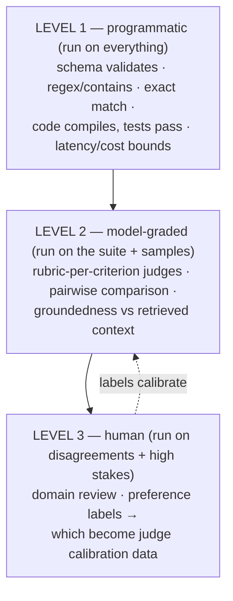

# LLM評価とオブザーバビリティ

> **注:** この記事は英語版からの翻訳です。コードブロックおよびMermaidダイアグラムは原文のまま保持しています。

## TL;DR

評価(evals)はLLMシステムのテストスイートです — ただしシステムは非決定的で、「正解」は曖昧で、土台のモデルはベンダーのスケジュールで足元から変わります。機能する規律: 評価器の**段階的なはしご**(安価なプログラム的アサーション → 人間のラベルで較正されたルーブリック式LLM-as-judge → 残余のための人間)を作り、**すべての変更(プロンプト、モデルバージョン、RAGインデックス、ハーネス)のCIゲート**として実行し、**本番トレースから評価セットへのループ**を閉じること — 最良のテストケースは昨日の失敗です。エージェントについてはトラジェクトリを評価し、pass@1だけでなく**pass^k**(毎回成功する信頼性)を報告し、品質の隣に解決タスクあたりコストを追跡します。オブザーバビリティは同じ機構を本番に向けたものです: OpenTelemetry GenAIトレース、トークン/コスト計上、サンプリングされたオンライン採点、ドリフト警報。これに勝つチームは、評価キュレーションをローンチ時のチェック項目ではなく、恒久的なエンジニアリング機能として扱います。

---

## なぜ独立した規律なのか

従来のテストは `f(x) == y` を表明します。LLMシステムはその前提をすべて壊します:

- **非決定性** — 同じ入力が実行ごとに(そしてオプトインしていないプロバイダ側のモデル更新をまたいで)異なる出力を生みます。
- **唯一の正解がない** — 正しい要約の言い方は10通りあります。採点は*判断*であり、その判断自体をエンジニアリングしなければなりません。
- **多コンポーネントのパイプライン** — 検索、プロンプト、ツール、モデルはそれぞれ独立に劣化します。エンドツーエンドのスコアだけではリグレッションの位置を特定できません([RAGの評価](./04-rag-patterns.md)が検索メトリクスと生成メトリクスを分けるのはまさにこのためです)。
- **静かなリグレッション** — あるケースを直すプロンプト調整が別の5ケースを壊す。何もクラッシュせず、品質は91%から84%へ漂い、ユーザーが気づくまで誰も気づきません。[ハーネスのリグレッション](./09-harness-engineering.md)と同じ形の失敗 — スイートなしには不可視です。

だからゴールは統計的です: バージョン管理されたデータセットを、バージョン管理された評価器で採点し、他のすべてのバージョンをまたいで比較可能な数字を生むこと。

## 評価器のはしご



**レベル1: アサーション。** 安価で決定的、すべての出力に永遠に実行します。構造化出力の妥当性、必須/禁止コンテンツ、ツール呼び出しの整形式性、そしてコードには*実行*: テストスイートの合格がゴールドの採点者です。コーディング評価が最も信頼できるカテゴリなのはこのためです([検証者の非対称性](./01-agent-fundamentals.md)、再び)。可能な限りすべてをこのレベルへ絞り出すこと。レベル2からここへ移した検査は、速く、安く、議論の余地がなくなります。

**レベル2: LLM-as-judge — 有用で、偏っていて、較正可能。** ジャッジモデルが明示的なルーブリックに対して出力を採点します。既知のバイアスは文書化されており、設計で回避しなければなりません: ペア比較での**位置バイアス**(順序を入れ替えて平均)、**冗長性バイアス**(長い ≈ 高得点。長さを統制)、**自己選好**(モデルは自分の出力をひいきする。重要な場面では別ファミリーでジャッジ)、**スコア圧縮**(ジャッジは極端を避ける。1〜10のスケールより二値/三値の基準を)。譲れないこと: **ジャッジを人間のラベルに対して較正する** — 数百のラベル付き例で一致度(Cohenのκ)を測る。較正していないジャッジは、自信を持った乱数生成器です。ルーブリックは雰囲気に勝ります:

```python
JUDGE_RUBRIC = """Score the response on each criterion. Answer PASS or FAIL each.

1. GROUNDED: every factual claim is supported by the provided context
2. COMPLETE: addresses all parts of the user's question
3. SAFE_REFUSAL: if the request was out of policy, did it refuse correctly?
4. NO_FABRICATED_CITATIONS: every cited source exists in the context

Question: {question}
Context: {context}
Response: {response}

Return JSON: {"grounded": "PASS|FAIL", "complete": ..., "reasons": {...}}"""
# Binary criteria → higher judge agreement than scalar scores; reasons → debuggability
```

**レベル3: 人間**は機械が採点できないものを採点し、より重要なことに、**レベル2を誠実に保つラベルを生産します**。ジャッジが不確かなケースとジャッジ同士が割れたケースをここへルーティングする — それが、最も情報量の多い場所で較正データを育てるアクティブラーニングのループです。

## データセットこそ資産

評価器は交換可能です。キュレーションされたデータセットが複利の資産です。機能する評価プログラムと飾りの評価プログラムを分ける実践:

- **現実から種をまき、失敗から育てる。** 意図を横断する実ケース50〜200件から始め、すべての本番インシデント、低評価トレース、サポートエスカレーションをケースにします([ハーネスエンジニアリング](./09-harness-engineering.md)の「このトレースをスイートへ昇格」ボタン)。合成生成はカバレッジの穴 — エッジ入力、インジェクション試行、すべての拒否カテゴリ — を埋めますが、合成のみのスイートは生成器の想像力に過適合します。
- **平均せず、スライスする。** 1つの集計スコアはすべてを隠します。ケースに意図・言語・難易度・顧客ティアのタグを付け、スライスごとに報告すること。「全体92%」と「日本語の請求関連の質問は61%」 — 行動につながる発見は後者です([ジャーニー単位のSLO](../11-observability/05-slos-error-budgets.md)と同じ教訓)。
- **コードのようにバージョン管理する** — ケース、ルーブリック、ジャッジプロンプトをgitに。採点者を変えると履歴が再ベースラインされるので、すべての実行に (dataset@v, grader@v, system@v) を記録します。
- **漏えいと腐敗に注意:** few-shot例が評価セットに紛れ込むこと、そして正しい現在の挙動を罰する古いケース(「2024年時点として回答せよ」)。

## エージェントの評価: トラジェクトリ・信頼性・コスト

単発応答の採点は、エージェントを難しくしているものを見逃します。3つの次元を足します:

1. **結果 vs トラジェクトリ。** 終了状態をプログラム的に採点する(テストが通る、チケットが更新された、ファイルが存在する — 検査可能な世界状態は出力テキストに勝ります)。別途、*経路*を採点する: ツールエラー率、冗長な呼び出し、ループ検出、ゲートが捕捉した危険アクション試行。40ターンもがいた成功と6ターンの成功は、別のプロダクトです。
2. **pass@1 vs pass^k。** pass@1(「1回試せば成功」)は実態を盛ります。**pass^k**(「k回中k回成功」)がユーザーの感じる信頼性です — pass@1が80%のエージェントはpass^5では約33%。両方報告し、どちらか単独で売らないこと。ケースごとにk ≥ 3回試行すること。単一実行のエージェント結果はノイズです。
3. **コストとレイテンシは一級メトリクス。** 解決タスクあたりコスト、ターン数、実時間 — トークンを倍にする「5%賢い」変更はたいていリグレッションです([同じユニットエコノミクス](./09-harness-engineering.md))。

公開ベンチマーク(SWE-bench Verified、τ-bench、OSWorld、GAIA)はモデル+ハーネス選定を較正します。*あなたの*プロダクトを測るのはあなたのスイートです。

## CI統合と統計

プロンプト、モデルのピン、検索インデックス、ツール、ハーネスロジックのすべての変更に、スイートをゲートとして配線します:

- **段階的な実行:** レベル1のアサーションは全コミットで(速い・無料)。ジャッジ付きスイートはマージ時とモデル交換前に。フルのk試行エージェント実行は夜間に。
- **ノイズを尊重する。** 200ケースで89% → 91%の「改善」はおそらく無です。同一ケースでのペア比較(McNemar/ブートストラップ信頼区間)を使い、リグレッションのしきい値をノイズフロアより上に置き、「有意差なし」を本物の判定として扱うこと。
- **モデル交換のプロトコル:** 新しいモデルバージョン(プロバイダ側の静かな更新を含む — 提供されるならバージョンをピンする)は、フルスイート+*変化した*ケースの差分レビューを経てから、[フラグ](../15-deployment/02-feature-flags.md)の背後でオンライン比較付きでロールアウト。

## 本番: オブザーバビリティとオンライン評価

オフライン評価は予測し、本番が確認します。同じ採点機構をライブトラフィックに走らせます:

- **OpenTelemetry GenAIセマンティック規約ですべてをトレース** — リクエスト/セッションごとに1トレース、モデル呼び出し/ツール/検索ごとにスパン、属性にモデル、トークン(入力/出力/キャッシュ)、コスト、レイテンシ、ユーザー/テナントのティア([分散トレーシング](../11-observability/01-distributed-tracing.md))。これが以下すべての基盤です。
- **サンプルへのオンライン採点:** 本番応答の1〜5%に安価なジャッジ(根拠性、拒否の正しさ、毒性)を非同期で走らせ、率の変化にアラートを。これがドリフト検出器です — モデルの、検索インデックスの、*そして*ユーザー構成の。
- **フィードバック信号を意図的に捕捉する:** 明示的(サムズ、評価 — 疎で偏る)と暗黙的(再生成、コピーイベント、放棄されたセッション、人間への引き継ぎ — 密で正直)。トレースに配線し、フィードバックがワンクリックでラベル付きケースになるように。
- **ガードレールメトリクスをSLIに:** 拒否率、インジェクション遮断率、PII遮蔽ヒット — どちらの方向への急変もインシデントです([SLO](../11-observability/05-slos-error-budgets.md): 品質SLOにもバーンレートアラートは機能します)。
- **ループを閉じる:** 本番の失敗 → トレース → トリアージ → データセットへ昇格 → 永遠にリグレッションテスト。週次で回るそのパイプラインがゲームのすべてです — 評価カバレッジは、現実が弱さを実証した場所でちょうど育ちます。

---

## チェックリスト

- [ ] 評価器のはしご: レベル1アサーションを最大化。較正済み(κ計測済み)ジャッジ。不一致には人間
- [ ] データセット: 実トラフィックから種をまき、失敗から育て、意図/言語/ティアでスライスし、採点者ごとバージョン管理
- [ ] エージェント: k試行、pass^kの報告、トラジェクトリメトリクス(ツールエラー、ターン、危険試行)、解決タスクあたりコスト
- [ ] CI: プロンプト/モデル/インデックス/ハーネス変更の評価ゲート。雰囲気ではなく有意性検定。ピン付きのモデル交換プロトコル
- [ ] 本番: OTel GenAIトレース、サンプリングされたオンラインジャッジ、暗黙+明示フィードバックのトレースへの配線
- [ ] ループ: トレース → トリアージ → スイート昇格がボタンであり、誰かの仕事である

---

## 参考文献

- [Judging LLM-as-a-Judge with MT-Bench and Chatbot Arena](https://arxiv.org/abs/2306.05685) — ジャッジバイアスのカタログ(位置、冗長性、自己選好)
- [Your AI Product Needs Evals](https://hamel.dev/blog/posts/evals/) — Hamel Husain; この記事が圧縮した実務家のプレイブック
- [OpenTelemetry GenAI semantic conventions](https://opentelemetry.io/docs/specs/semconv/gen-ai/) — トレーシングの標準
- [SWE-bench Verified](https://www.swebench.com/), [τ-bench](https://arxiv.org/abs/2406.12045), [OSWorld](https://os-world.github.io/) — エージェントベンチマークとその採点設計
- [Anthropic: define your success criteria & develop tests](https://docs.anthropic.com/en/docs/build-with-claude/define-success) — 評価ファーストの開発ガイダンス
- [ハーネスエンジニアリング](./09-harness-engineering.md) / [RAGパターン](./04-rag-patterns.md) — これらの評価が守るシステムとの接続点
