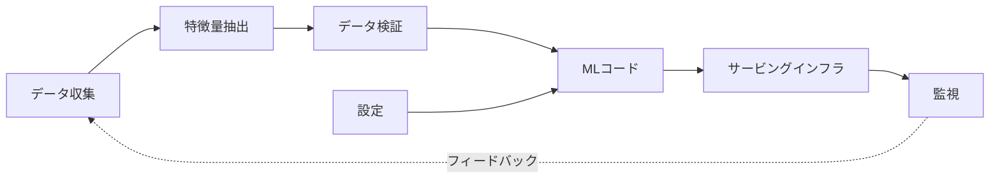

# MLシステム基礎

## TL;DR

機械学習システムが従来のソフトウェアと決定的に異なる点は1つです。その挙動は、コードだけでなく*データ*によって定義されるということです。モデルそのものは小さな箱にすぎず、運用上のリスクのほぼすべては、その周囲を取り巻くシステム — データ収集、特徴量抽出、設定、サービングインフラ、監視、そして将来の学習データを静かに作り変えていくフィードバックループ — に存在します。これはSculleyらの『*Hidden Technical Debt in Machine Learning Systems*』(2015) の中心的な主張であり、この分野全体の捉え方を作り変えるものです。あなたが作っているのはモデルではなく、正しさが統計的であり、仕様がデータセットの中に暗黙的に存在し、依存関係が予告なく足元で変化していくシステムなのです。本節で扱うすべて — 特徴量ストア、サービング、監視、学習パイプライン、ガバナンス — は、この根本的な違いを管理するために存在します。

---

## MLシステムはコードだけでなくデータによって定義される

従来のソフトウェアでは、挙動はコードによって完全に決まります。`a + b` を返す関数は永遠にその和を返します。読んで、仕様に対して網羅的にテストし、単独で推論できます。コード*そのもの*が挙動であり、その挙動は決定論的で、検査可能で、誰かがソースを編集するまで安定しています。

MLシステムはこの契約のあらゆる部分を破壊します。不正検知分類器の挙動はそのコードに書かれていません — コードは汎用的な学習手続きにすぎず、同じものが推薦システムや画像分類器を生み出すこともできます。挙動はデータから*学習*されるのであり、つまりデータセットこそが本当の仕様です。そしてその仕様は暗黙的で、巨大で、絶えず移り変わっています。2つのチームが同一のコードを異なるデータで実行すれば、まったく異なる挙動のシステムを出荷します。同じチームが1か月後に*同じソース*で同一のコードを実行しても、データが描く世界が動いているために、明確に異なるシステムを出荷することになります。

だからこそSculleyの図は、この分野全体の基礎となるメンタルモデルなのです。「MLコード」とラベル付けされた箱は小さく、その周囲には、データ収集、特徴量抽出、データ検証、設定、プロセス管理、分析ツール、サービングインフラ、監視といった、はるかに大きな箱が取り囲んでいます。そのエンジニアリング上の含意は明白です — コードに比例して注意を割り当てれば、リスクの5パーセントしか抱えていない箱に努力の90パーセントを費やすことになります。

モデルは図の中で最も小さな箱です。それをシステム全体だと見なすことが、本番MLにおける原罪です。

---

## なぜMLシステムは運用が難しいのか

4つの性質が、MLシステムを周囲のサービスよりも構造的に運用しづらいものにしており、そのそれぞれが従来のエンジニアリングが頼ってきたツールを無効化します。

**正しさは決定論的ではなく統計的である。** 従来のサービスは、正しいか、さもなければバグがあるかのどちらかです。MLシステムは*平均的には正しく*、設計上、入力の一定割合では誤ります — 95%の精度を持つモデルは20回に1回は誤りますが、それは欠陥ではなく意図された挙動です。これにより「動作している」という二値的な概念が崩れます。「モデルは正しいか?」と問うことはできず、問えるのは「このスライスにおける誤り率は、今この瞬間、許容範囲内か?」だけです — そしてその答えは入力分布の変化とともに変わります。

**きれいな仕様が存在しない。** ソート関数の仕様は1文で済みます。「不正取引を検知する」の仕様は、それ自体が不完全なプロセスでラベル付けされた何百万もの過去事例の中に符号化された、動き続け、議論があり、部分的には知り得ない標的です。仕様がデータの中に存在するため、それをレビューしたり、文章としてバージョン管理したり、インターフェースについて推論するように推論したりはできません。データが間違っていれば仕様も間違っており、コードのどこを見てもそれは分かりません。

**テストは挙動を完全には捉えられない。** ユニットテストは決定論的なロジックを固定しますが、有限のテストスイートでは、際限なくドリフトしていく入力空間にわたるモデルの挙動を捉えられません。サービングコードが成果物を読み込み、範囲内の数値を返すことはテストできますが、モデルが*良い*かどうかはユニットテストできません。なぜなら良さとは、まだ見ぬライブデータの統計的性質だからです。したがってMLにおける検証は、ビルド時に一度通過すればよいゲートではなく、ライブの挙動をベースラインと比較する継続的かつ分布的なものになります。([Model Monitoring](./04-model-monitoring.md) を参照。)

**障害は静かである。** 従来のサービスが壊れると、エラーが投げられ、レイテンシが跳ね上がり、ダッシュボードが赤くなります。MLシステムが劣化するときは、サービスは稼働し続け、レイテンシは正常で、エラー率はゼロのまま、世界が変化したために予測だけが静かに悪化します。静かな劣化はMLシステムの特徴的な障害であり、決定論的ソフトウェア向けに作られたあらゆる信頼性ツールにとっては不可視です。モデル監視という仕組み全体は、稼働監視がこの種の障害をまったく見られないために存在しています。

エンジニアリング上の教訓は、従来のサービスから来た運用の定石 — テスト、型チェック、稼働率やレイテンシに対するエラーバジェット — は依然として必要だが、もはや十分ではない、ということです。それは「コード」とラベル付けされた箱を覆っているだけで、実際に挙動を駆動するデータに対しては盲目なのです。

---

## 学習・サービング間の隔たり

すべてのMLシステムには、互いに一致しなければならないのに実装を共有することがめったにない2つの半身があります。*オフライン*の半身は大規模な履歴データセットでモデルを学習し、数時間のレイテンシ予算とリアルタイム制約のない中で品質を最適化します。*オンライン*の半身はライブトラフィックの下で予測をサービングし、ミリ秒を争う中でレイテンシと信頼性を最適化します。これらの半身は通常、異なる人々によって、異なる言語で、異なるデータストアに対して、異なるスケジュールで書かれます。

この隔たりにおける決定的な危険が**学習・サービング間のズレ**です。2つの経路が*同じ特徴量名*を*異なる意味*で計算してしまうのです。`avg_purchase_7d` のような特徴量は、学習時にはオフラインバッチでウェアハウスのテーブルから計算され、サービング時にはオンラインでストリーミングストアから再計算されます。ウィンドウ処理のロジック、タイムゾーンの扱い、NULL補完、データ鮮度が2つの実装の間でほんの少しでも異なれば、モデルは学習したものと一致しない入力をサービングされます。オフライン評価は素晴らしく見え — それは学習側のロジックで計算されたものですから — 本番品質は静かに落ちます。モデルは今や、学習したのとは微妙に異なる問いに答えているからです。

ズレが厄介なのは、エラーもアラートも生まないからです。特徴量は正しい名前、正しい型、もっともらしい値を持っています。ただ単に*誤った*値なのです。構造的な防御は場当たり的ではなく、アーキテクチャ的です。各特徴量を一度だけ定義し、両方の経路に対して単一の共有定義から計算すること([feature store](./02-feature-stores.md) の核心的な約束)、本番でサービングされた正確な特徴量値をログに残し、再生してオフライン再計算と比較できるようにすること、そしてサービングされた値と再計算された値の間の乖離を、丸め誤差程度の珍事ではなく重大インシデント級の事象として扱うことです。学習・サービング境界はMLシステムにおいて最も重要な信頼性境界であり、本番品質をめぐる謎のほとんどはここに帰着します。

---

## データ依存問題

モデルは、自身が所有せず制御もできない上流データに依存します。これは、従来のコードレベルの依存関係管理が扱う必要のなかった種類の依存です。ライブラリ依存にはバージョン番号、変更履歴、セマンティックバージョニングに従うメンテナがあり、破壊的変更は自ら名乗りを上げます。*データ*依存にはそれが一切ありません。上流のチームは、列の意味、フィールドの単位、列挙型のカーディナリティ、あるいはテーブルがカバーする母集団を変更できます — どれも型シグネチャを1つも変えずに、どれも誰にも告げずに。

Sculleyはこれらを*不安定なデータ依存*と呼びます。これらが不安定なコード依存よりも危険なのは、まさにコンパイラにとって不可視だからです。具体的でよく知られたパターンを考えてみましょう。財務チームが売上テーブルをリファクタリングし、`total_spend` を総額から純額に切り替えます。すべての型チェックが通ります。すべてのNULLチェックが通ります。ジョブは緑色で完了します。しかし変更後に学習されたすべてのモデルは、体系的に小さくなった数値から学習し、モデルの挙動は誰も選んでいない方向にシフトします。上流での静かな*意味的*変更が、下流での静かなモデルの*リグレッション*になるのです。そして両者の間隔は数週間に及ぶこともあり、原因と結果を結ぶエラーは存在しません。

第二の、より微妙な危険が*過小利用*のデータ依存です — モデルが消費するが、ほとんど必要としていない特徴量です。実質的な予測価値を加えていないのに、壊れたり、ドリフトしたり、消えたりしうる上流ソースにモデルを結びつけます。すべての入力は資産であると同時に負債であり、シグナルとしてではなくリスクとして重みを担う特徴量は、純粋に不利益です。

エンジニアリング上の含意は直接的に導かれます。データ依存は、コード依存と同じように明示的かつバージョン管理されなければなりません。モデルは自身がどの特徴量バージョンを消費したかを正確に記録すべきであり、特徴量への意味的変更は、その場での編集ではなく*新しい特徴量名*であるべきです([Training Pipelines](./05-training-pipelines.md) と [Feature Stores](./02-feature-stores.md) を参照)。入力は、学習やサービングに到達する前にベースライン分布に対して検証されなければなりません。なぜなら分布的なチェックこそ、型互換だが意味的に壊れた変更を捕捉できる唯一の仕組みだからです。そして境界をまたぐ関係は、所有者のいる*契約*でなければなりません。そうすれば違反は、より悪いモデルへと静かに吸収される代わりに、継ぎ目で大きな音を立てて失敗します。

---

## フィードバックループ:システムは自らの将来データに影響を与える

従来のソフトウェアは世界を読み取ります。MLシステムは、後で学習することになる世界をしばしば*変える*のであり、これは決定論的ソフトウェアには類例のないループを閉じます。推薦システムはユーザーが見るものを変え、それがクリックを変え、それが次の推薦システムの学習データになります。不正検知モデルは不正だと判断した取引をブロックし、それは「それらの取引がどうなっていたか」のラベルが決して存在しないことを意味し、次のモデルの不正観を歪めます。検索ランカーは既に高くランク付けしているアイテムにトラフィックを集中させ、それらが良いという証拠として扱うまさにそのエンゲージメントシグナルを製造します。

これらのフィードバックループは、本番MLにおける最も紛らわしい病理のいくつかの源です。*直接的*なループとは、モデル自身の出力が将来の入力になるものです — システムはゆっくりと自己確証的な世界観に収束し、過去の意思決定の帰結を、世界についての真実だと取り違えます。*間接的*あるいは*隠れた*ループはさらに悪質です。2つのモデルが共有環境を通じて互いに影響し合い、一方を改善することが、どちらのシステムの設計にも現れないチャネルを通じて他方を劣化させるのです。Sculleyは隠れたフィードバックループを、最も困難な形の技術的負債の1つとして指摘します。まさにどのコンポーネントもそれを所有せず、どのテストもそれを明らかにしないからです。

エンジニアリング上の含意は、MLシステムが自身について収集するデータは、世界の中立的な観測ではない、ということです — それはシステム自身の過去の挙動によって汚染されており、それを素朴に学習すれば、以前のモデルが持っていたバイアスを何であれ増幅します。防御は構造的です。現在のモデルに制御されない*探索*トラフィックの一部を保持し、システムが自分では選ばなかったであろう結果を見続けられるようにすること。表示されたものだけでなく、表示されなかった候補もログに残し、反実仮想分析がそもそも可能になるようにすること。そして、ループを通じてモデルが操作できる観測指標と、現在のモデルが制御しない取り置きトラフィック上の因果実験とを分離すること([Online Experiments](./08-online-experiments.md) を参照)。探索経路がなければ、MLシステムは次第に、自身の過去の意見を確認するための機械になっていきます。

---

## MLライフサイクルは引き継ぎのシステムである

MLライフサイクルを線形のパイプライン — データ、特徴量、学習、評価、デプロイ、サービング、監視、再学習 — として描き、ステップの連なりとして扱うのは魅力的です。より有用な捉え方は、それらの段階の間の各*矢印*が、所有権契約を伴う信頼性境界であり、システムは箱よりも矢印ではるかに頻繁に失敗する、というものです。

各引き継ぎは異なるチームによって所有され、異なる契約を保証します。データプラットフォームは、鮮度が高く、重複が除去され、スキーマがバージョン管理されたデータを特徴量層に負っています。特徴量の所有者は、時点整合な値を学習に負っています。学習は、再現可能な成果物と誠実な指標を評価に負っています。評価は、ガードレールに照らした昇格判断をデプロイに負っています。サービングは、ランタイム互換性と、ズレを防ぐ特徴量パリティを負っています。監視は、劣化の早期検知を再学習トリガーへと負っています。これらの契約のいずれか1つが非公式 — 検証されたインターフェースではなく握手 — であるとき、ライフサイクルはまさにその継ぎ目で劣化します。そして継ぎ目は組織境界をまたぐため、インシデントが所有者の名乗りを強いるまで、それは誰の責任でもなくなります。

ライフサイクルはまた、線ではなく*ループ*でもあります。最後の矢印は最初へとフィードバックします。監視は再学習を駆動し、再学習は新たなデータ依存を生み、システムは「デプロイ済み」で終わるのではなく、絶えず周回します。これがMLシステムが、機能の出荷が「完了」するようには決して「完了」しない理由です — 無期限に運用されなければならず、その運用コストは、初期モデルのコストではなく、システムの総保有コストを支配します。

---

## CACE:何かを変えればすべてが変わる

MLシステムの最も直観に反する性質はもつれ(エンタングルメント)であり、SculleyはこれをCACE原則として捉えています:**Changing Anything Changes Everything(何かを変えればすべてが変わる)**。モジュラーなソフトウェアでは、安定したインターフェースの背後でコンポーネントを単独に推論できます。MLモデルには、そのような分離がありません。モデルはすべての入力特徴量を単一の学習された関数へと混ぜ合わせるため、*1つの*特徴量の分布を変える、新しい特徴量を追加する、古いものを除去する、あるいは特徴量の計算順序を入れ替えることすら、*他のすべての*特徴量に対する学習された重みをシフトさせ、いかなる局所的分析も予測しない形でモデルの挙動を変えうるのです。

実務的な帰結は、モデルへの小さく局所的な変更などというものは存在しない、ということです。無害に見える入力特徴量を追加することは加算的ではなく — モデル全体を再バランスします。「大して効いていなかった」特徴量を落とすことは、無関係な予測スライスを劣化させうります。なぜならモデルは、別の場所の弱点を補うためにその特徴量を静かに使っていたかもしれないからです。これがMLの変更を、検査だけでは推論できず、*測定*しなければならない理由です。変更が何をもたらしたかを知る唯一の信頼できる方法は、モデル全体をベースラインに対して評価することです。なぜならいかなる変更のブラスト半径も、モデル全体だからです。

CACEはまた、学習・サービング間のズレ、データ依存、フィードバックループが組み合わさったときになぜこれほど危険かの深い理由でもあります。もつれは、それらのいずれかにおける小さな摂動が、あらゆる場所に伝播することを意味します。すべてがすべてに影響するシステムは、モジュール性によって安全にすることはできません。全体の*測定と監視*によってのみ安全にできます。それが、再現性、リネージ、監視を、あれば嬉しいものではなく第一級の関心事として扱うエンジニアリング上の根拠です。

---

## なぜ再現性、リネージ、監視が第一級なのか

挙動がデータの中に存在するため、障害が静かであるため、そしてすべてがもつれ合っているため、従来のソフトウェアでは任意の利便性にすぎない3つの性質が、MLシステムでは荷重を担う信頼性機能になります。

**再現性**とは、記録されたメタデータ — コードのコミット、データスナップショット、特徴量バージョン、パラメータ、環境ダイジェスト — から、まったく同じモデルを再構築できる能力です。これは基礎的です。なぜなら他のあらゆる保証がそれに依存するからです。再構築できないモデルにはロールバックできず、入力を再構成できない意思決定は監査できず、学習条件を再現できないリグレッションはデバッグできません。再現性契約のないモデルはリリースではなく、メンテナのいない負債です。([Training Pipelines](./05-training-pipelines.md) はこれを中心的な性質として扱います。)

**リネージ**とは、何が何を生み出したか — どのデータセットとコードがどのモデルを生み出し、逆に、どのモデルが与えられたデータセットに依存しているか — をクエリ可能な形で記録したものです。これは、あらゆるデータインシデントのたびに到来する問いに答えます。あるソーステーブルが1週間にわたってイベントを二重計上した、では*どの本番モデルがそのウィンドウで学習しており、再学習しなければならないのか?* 前向きのリネージがなければ、唯一誠実な答えは「分からない、すべて再学習しよう」であり、これは高コストであると同時に、システムが監査不能であることの自白でもあります。

**監視**は、MLにおいては稼働率とレイテンシのことではありません — それらは必要ですが、重要な障害には盲目です。ML監視は*データと予測*を見張ります。入力分布のドリフト、予測分布のシフト、特徴量の鮮度、そしてラベルが最終的に到着する場合には、ベースラインに対する実現された品質です。これが存在するのは、静かな劣化がアラートを出すべきエラーを生まないためで、それを検知する唯一の方法は、システムの統計的な挙動を継続的に測定し、「健全」だった頃の姿と比較することだからです([Model Monitoring](./04-model-monitoring.md) を参照)。

この3つは別々の衛生タスクではありません。挙動が変化するデータによって定義されるシステムを運用するために必要な最小限の機構です — 回復のための再現性、追跡のためのリネージ、検知のための監視。これらなしにモデルを出荷したチームは、ロールバックできず、追跡できず、壊れていることに気づけないものを出荷したのです。

---

## 障害モード

MLシステムに特徴的な障害は組織を越えて繰り返し現れ、それらに名前を付けることは予防の半分です。それらには家族的類似があります。どれもが、決定論的ソフトウェア向けに作られたツールにとって不可視なのです。

**学習・サービング間のズレ**とは、同じ特徴量名がオフライン経路とオンライン経路で異なる計算をされることです。オフライン指標は素晴らしく見えます。学習側のロジックを使ったからです。本番品質は落ちます。モデルが、学習したことのない入力をサービングされるからです。防御は、両方の経路に対する単一の共有特徴量定義に加えて、再生と比較のためにサービングされた値をログに残すことです。

**静かなデータ依存リグレッション**とは、上流ソースへの意味的変更 — 単位、定義、カバーする母集団 — であり、すべての型チェックとNULLチェックを通過しながら、その下流のあらゆるモデルを静かに腐らせるものです。防御は、データが学習に到達する前のベースラインに対する分布的検証と、契約が破られたときにページングされる所有者を伴う、明示的でバージョン管理されたデータ契約です。

**静かなモデル劣化**とは、世界がモデルの学習分布から緩やかにドリフトしていくことです。サービスは稼働し続け、エラーはゼロのまま、どの稼働ダッシュボードにもシグナルがないまま予測が悪化します。防御は、入力分布と予測分布を監視すること、遅延ラベルが到着したらそれを追跡すること、そしてロールバック経路を常に準備しておくことです。

**フィードバックループ汚染**とは、システムが自身の過去の意思決定が形作ったデータから学習し、ゆっくりと自己確証的な世界観へ収束していくことです。防御は、探索トラフィックを保持すること、表示されなかった候補をログに残すこと、そしてループが操作できる観測指標ではなく因果実験で検証することです。

**代理目的のミスマッチ**とは、ラベル付けは容易だがシステムが必要とする成果ではない指標を最適化することです — クリックベイトを報いるクリック率、正当なユーザーをブロックする不正検知のRecall、長期満足度を蝕む視聴時間。防御は、明示的なガードレールを伴う指標の階層、集計だけでなく最悪の偽陽性・偽陰性のレビュー、そして議論のあるプロダクトポリシーをレビュー可能なモデルの*外*に保つことです。

**もつれによる驚き**とは、CACE障害のことです。「小さな」変更 — 1つの特徴量追加、1つの入力削除 — が無関係なスライスの挙動をシフトさせます。モデルがその入力を静かに使って別の場所を補っていたからです。防御は、モデル変更について局所的な推論を決して信用せず、常にモデル全体をベースラインに対して測定することです。

---

## 意思決定フレームワーク:本当にMLが必要か?

最も重大なMLシステムの意思決定は、そもそもそれを作るかどうかです。MLは本書のあらゆるコスト — データ依存、ズレ、静かな障害、フィードバックループ、もつれ、そして恒久的な運用負担 — を持ち込みます。そして「ML問題」の大きな割合は、それらのコストを一切持たない決定論的ロジックでより良く解決されます。フレームワークは、誠実な問いの連なりです。

*その意思決定は、人が読めて、レビュアーが監査できる明示的なルールとして表現できるか?* もしそうなら、ルールを書きましょう。決定論的ロジックは検査可能で、テスト可能で、即座に説明可能で、ドリフトがありません。MLが正当化されるのは、決定境界が本当に列挙するには複雑すぎるか流動的すぎる場合 — 画像中の物体認識、数百万のアイテムの中でのランキング、新規の不正パターンの検知 — だけであって、単にルールを書くのが面倒に感じるからではありません。

*十分なラベル付きデータや行動データが存在し、それは到着し続けるか?* モデルはその学習データの質以上にはなれません。新鮮なラベルの計画がないモデルは、世界が動いた瞬間に無関係さへとドリフトしていきます。データが疎であったり、古かったり、代表的でなかったりすれば、MLは思慮深いヒューリスティックよりも性能が劣る一方、運用コストははるかに高くなります。

*個々の誤りは許容できる、あるいはレビュー可能か?* MLは統計的に正しく、設計上一部の入力で誤るため、誤った答えが回復可能な意思決定 — 平凡な推薦、人間レビューに回されるフラグ付き取引 — に適しています。単一の誤った答えが破滅的でレビュー不能な意思決定には不向きです。ただし、モデルと不可逆な行動の間に人間や決定論的なガードレールが挟まる場合は別です。

*組織はローンチ後のライフサイクルを所有できるか?* MLシステムは出荷する機能ではなく、無期限に運用するシステムです — 監視、再学習、ドリフトの調査、データ契約の維持。モデルを作れてもその運用に人を充てられないチームは、それをデプロイすべきではありません。監視されていないモデルは、データが変化するのを待つ静かな障害インシデントだからです。

最も強力なアーキテクチャはたいてい*ハイブリッド*です。決定論的ルールが厳格な安全境界と妥協できないポリシーを定め、MLはその境界の*内側*でランク付けやスコアリングを行い、そこで統計的な強みが報われ、障害は境界づけられます。避けるべきアンチパターンは、未定義のプロダクトポリシーを取り繕うためにMLを使うことです — 行動、フォールバック、許容できる障害モードが決まっていないとき、いかなるモデルもあなたの代わりにそれらを決めることはできません。

---

## 重要なポイント

1. MLシステムの挙動はコードだけでなくデータによって定義される。モデルは最も小さな箱であり、運用上のリスクのほぼすべてはその周囲のシステムに存在する。
2. MLの正しさは統計的であり、きれいな仕様を持たず、完全にはユニットテストできず、静かに失敗する — だから従来の信頼性ツールは必要だが十分ではない。
3. 学習・サービング間の隔たりは最も重要な信頼性境界である。2つの経路の間のズレが決定的な危険であり、品質をめぐる謎の最も一般的な源である。
4. データ依存は不安定でコンパイラに不可視である。上流での静かな意味的変更は、下流での静かなモデルのリグレッションになる。
5. MLシステムは後で学習するデータに影響を与えるため、探索が保持されない限り、フィードバックループはシステムを自己確証的な世界観へと収束させうる。
6. ライフサイクルは引き継ぎのループであり、各矢印は所有権契約を伴う信頼性境界で、大きな音を立てて失敗するか、静かに劣化する。
7. CACE — 何かを変えればすべてが変わる — は、モデルに局所的な変更などないことを意味する。いかなる変更のブラスト半径もモデル全体であり、だから変更は推論ではなく測定されなければならない。
8. 再現性、リネージ、監視は衛生ではなく第一級の信頼性機能である:回復、追跡、検知。
9. MLを使うのは、ルールで意思決定を表現できず、十分な新鮮なデータが存在し、誤りが許容可能かレビュー可能で、組織がライフサイクルを所有できるときだけ。さもなければ決定論的ロジックを選び、MLをルールの内側に境界づけるハイブリッドを選ぶこと。

---

## 参考文献

1. [Hidden Technical Debt in Machine Learning Systems](https://proceedings.neurips.cc/paper_files/paper/2015/file/86df7dcfd896fcaf2674f757a2463eba-Paper.pdf) — Sculley et al., 2015
2. [Rules of Machine Learning: Best Practices for ML Engineering](https://developers.google.com/machine-learning/guides/rules-of-ml) — Zinkevich
3. [TFX: A TensorFlow-Based Production-Scale Machine Learning Platform](https://dl.acm.org/doi/10.1145/3097983.3098021) — Baylor et al., 2017
4. [Data Validation for Machine Learning](https://mlsys.org/Conferences/2019/doc/2019/167.pdf) — Breck et al., 2019
5. [The ML Test Score: A Rubric for ML Production Readiness](https://research.google/pubs/pub46555/) — Breck et al., 2017
6. [Machine Learning: The High-Interest Credit Card of Technical Debt](https://research.google/pubs/pub43146/) — Sculley et al., 2014
