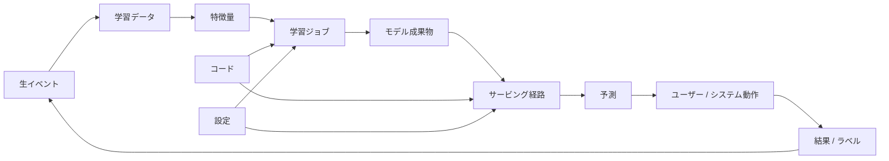
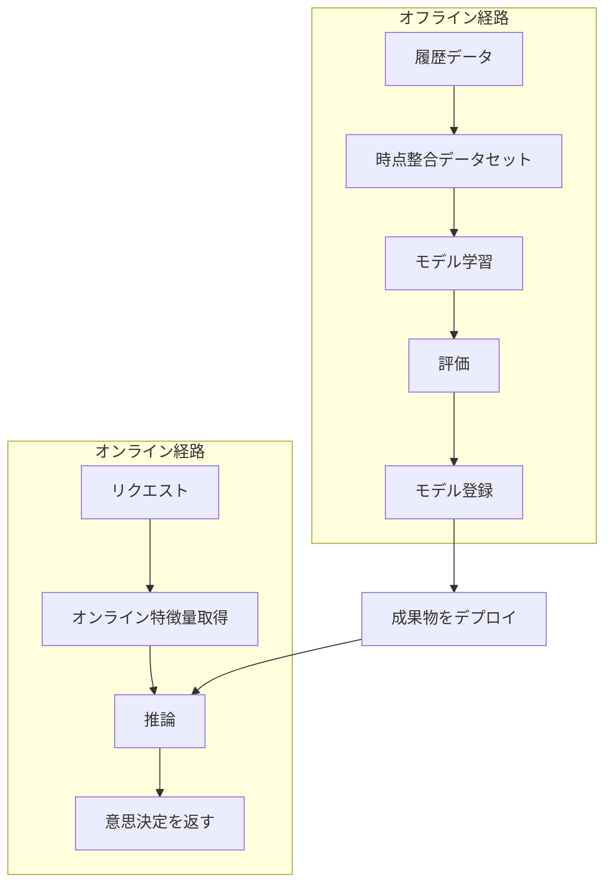

# MLシステム基礎

## TL;DR

機械学習システムは、コードだけでなく、データ、特徴量、ラベル、モデル成果物、フィードバックループに依存するソフトウェアシステムです。中心課題は「モデルを学習すること」ではなく、世界が変化しても学習、サービング、監視、再学習を整合させ続けることです。

---

## MLシステムの境界

通常のサービスはコードと設定を出荷します。MLシステムは、パイプラインによって生成された意思決定関数を出荷します。

重要なのはフィードバックループです。推薦モデルはユーザーが見るものを変え、それがクリックを変え、将来の学習データを変えます。不正検知モデルは取引を止め、観測されるラベル分布を変えます。

---

## 本番MLの構成要素

| 構成要素 | 管理するもの | よくある障害 |
|---|---|---|
| データ取り込み | 生イベントと鮮度 | パーティション欠落、重複、スキーマ変化 |
| 特徴量パイプライン | 学習とサービングで使う変換 | 学習・サービング間のズレ、古い特徴量 |
| 学習パイプライン | データセット、アルゴリズム、評価 | 再現できないモデル、リーク |
| モデルレジストリ | 成果物のバージョンと昇格状態 | 間違ったモデルのデプロイ |
| サービング層 | オンラインまたはバッチ予測 | レイテンシ悪化、リソース枯渇 |
| 監視 | データ、予測、品質、事業指標 | 静かな品質劣化 |

---

## MLシステムの制御プレーン

本番MLでは「モデル」だけを見るとブラスト半径を見誤ります。

| プレーン | 管理するもの | 弱いと起きる事故 |
|---|---|---|
| データ | 取り込み、ラベル、JOIN、バックフィル、保持 | 重複や未来ラベルで学習する |
| 特徴量 | 定義、オンライン/オフライン一致、鮮度 | 古い特徴量や意味の変わった特徴量を使う |
| モデル | 成果物、レジストリ、ランタイム、ロールバック | 間違った成果物が本番に出る |
| 意思決定 | しきい値、ポリシー、フォールバック、人間レビュー | AUCは良いがユーザーアクションが悪化する |
| 実験 | 割当、表示ログ、指標、ガードレール | 壊れた実験データで出荷判断する |
| ガバナンス | リスク階層、所有者、監査、廃止 | 高影響モデルが所有者なしで動く |

設計レビューで変更がどのプレーンに属するか説明できないなら、本番準備は不足しています。

---

## 学習とサービング

学習は大きな履歴データで品質を最適化します。サービングはライブトラフィックの下でレイテンシと信頼性を最適化します。同じ特徴量名が両方の経路で同じ意味を持つことが重要です。

---

## 設計判断

| 判断 | 選ぶ条件 | 注意点 |
|---|---|---|
| バッチ予測 | 結果を事前計算できる | 予測が古くなる |
| オンライン予測 | 今すぐユーザー向け判断が必要 | レイテンシと依存先障害 |
| ストリーミング予測 | 連続イベントを処理する | 状態管理と重複処理 |
| ライブラリとして埋め込み | 最低レイテンシが必要 | 独立更新が難しい |
| 共有モデルサービス | ロールアウトと監視を集中したい | ネットワークホップが増える |

### 問題タイプ別の設計

| 問題 | 典型構成 | 主なリスク |
|---|---|---|
| 不正/ abuse | オンラインモデル + 特徴量ストア + ルール + レビュー | 偽陽性、遅延ラベル |
| 推薦 | 候補生成 + ランカー + 再ランキング + 探索ログ | フィードバックループ |
| 検索ランキング | 検索 + ランキング + 実験 | 位置バイアス |
| チャーン予測 | バッチスコア + キャンペーン | 古いセグメント |
| 異常検知 | ストリーミング特徴量 + アラート | アラート疲れ |

アーキテクチャは意思決定ループに合わせます。

---

## 代表的な障害モード

### 学習・サービング間のズレ

学習ではある変換を使い、サービングでは別の変換を使ってしまう状態です。オフライン評価は良くても本番品質が落ちます。

対策:

- 共有された特徴量定義を使う。
- 学習とサービングの特徴量パリティテストを行う。
- サービング時の特徴量をログに残して再生できるようにする。

### データリーク

予測時には存在しない情報が学習データに入る問題です。タイムスタンプ、JOIN、ラベルの書き戻しでよく発生します。

対策:

- 時点整合なデータセットを作る。
- イベント時刻と処理時刻を分ける。
- 各特徴量が意思決定時点で利用可能だったかを確認する。

### 静かなモデル劣化

サービスは稼働し、エラーも少ないのに、世界の変化により予測品質が落ちます。

対策:

- 入力分布と予測分布を監視する。
- 遅延ラベルを結合する。
- ビジネス指標とユーザー影響を追う。
- ロールバック経路を維持する。

### 代理目的のミスマッチ

測りやすい指標を最適化して、本当に必要な成果を悪化させる問題です。

- クリック率最適化が低品質コンテンツを増やす。
- 不正検知のRecall最適化が正当ユーザーを止める。
- 視聴時間最適化が長期満足度を下げる。

対策は、主指標、ガードレール、診断指標、スライス指標を分けることです。

---

## 運用メトリクス

| レイヤー | メトリクス |
|---|---|
| データ | 鮮度、完全性、NULL率、重複率、スキーマ変更 |
| 特徴量 | オンライン/オフライン差分、鮮度、分布変化 |
| 学習 | パイプライン時間、失敗率、データ版、成果物ハッシュ |
| 評価 | Precision/Recall、キャリブレーション、スライス別品質 |
| サービング | p50/p95/p99、エラー率、タイムアウト、CPU/GPU使用率 |
| ビジネス | コンバージョン、不正損失、継続率、苦情、手動レビュー量 |

---

## アーキテクチャレビュー項目

- 学習データセットをコードとデータスナップショットから再現できるか。
- 特徴量は時点整合か。
- オンライン特徴量とオフライン特徴量は同じ契約から作られるか。
- アプリケーションコードを戻さずにモデルだけロールバックできるか。
- 各予測をモデルバージョン、特徴量、リクエスト文脈まで追跡できるか。
- デプロイ後の品質を監視しているか。

---

## 成熟度モデル

| レベル | 状態 | リスク |
|---|---|---|
| 0. ノートブック | 手動データ取得、手動評価、手動デプロイ | 再現できない |
| 1. 定期学習 | パイプラインはあるがリネージが弱い | 悪いデータで静かに学習 |
| 2. レジストリ管理 | 成果物、指標、所有者を登録 | 特徴量ズレが残る |
| 3. 制御されたロールアウト | シャドー、カナリー、ロールバック | 遅延ラベル対応が必要 |
| 4. ガバナンス付き意思決定 | リスク階層、監査、人間制御、廃止 | 手続きコストが高い |

一気に最高レベルを目指すより、再現性、レジストリ、ロールアウト、ガバナンスの順に強化します。

---

## 重要なポイント

1. モデルはMLシステムの一部にすぎない。
2. データ、特徴量、ラベル、フィードバックループは本番依存関係である。
3. 学習とサービングは一緒に設計する。
4. オフライン評価だけでは不十分。
5. モデル挙動の監視はサービス稼働監視と同じくらい重要。

---

## 参考文献

1. [Hidden Technical Debt in Machine Learning Systems](https://proceedings.neurips.cc/paper_files/paper/2015/file/86df7dcfd896fcaf2674f757a2463eba-Paper.pdf)
2. [TFX: A TensorFlow-Based Production-Scale Machine Learning Platform](https://dl.acm.org/doi/10.1145/3097983.3098021)
3. [Data Validation for Machine Learning](https://mlsys.org/Conferences/2019/doc/2019/167.pdf)
4. [TensorFlow Serving: Flexible, High-Performance ML Serving](https://arxiv.org/abs/1712.06139)
