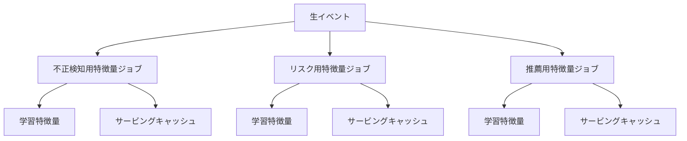
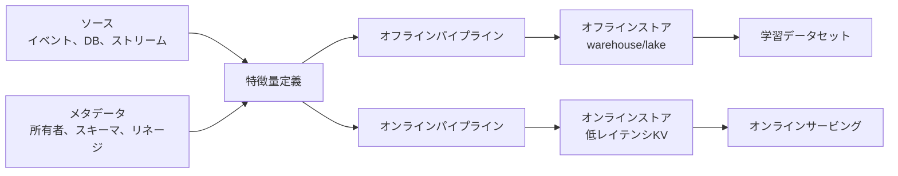
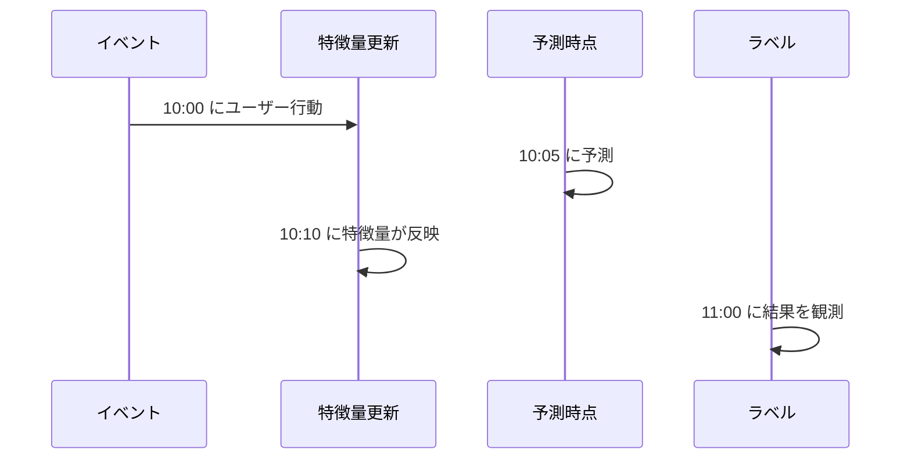

# フィーチャーストア

## TL;DR

フィーチャーストアは、オフライン学習とオンラインサービングで再利用される特徴量を管理します。単なる保存場所ではなく、一貫性を守るシステムです。重要なのは、時点整合性、鮮度、スキーマとバージョン、発見可能性、所有者、学習・サービング間のパリティです。

---

## 解決する問題

フィーチャーストアがないと、各モデルチームが独自の特徴量パイプラインを作ります。



同じ「直近7日の購入回数」がチームごとに違う意味になり、再利用性と信頼性が落ちます。

---

## アーキテクチャ



保存エンジンは違ってもかまいません。意味論は一致させる必要があります。

---

## 特徴量ビュー設計

特徴量ビューは所有とマテリアライズの単位です。

| 次元 | 設計の問い | 例 |
|---|---|---|
| エンティティ | 何をスコアするか | `user_id`, `item_id`, `merchant_id` |
| 時間窓 | どの履歴を要約するか | 10分、7日、全期間 |
| 鮮度 | どれだけ古くてよいか | 不正は秒単位、チャーンは日単位 |
| ソース | どの事実が正か | 決済イベント、ログインストリーム |
| 既定値 | ミスやNULL時どうするか | `0`、unknown、fail closed |

`risk_score` のような曖昧な名前より、`user_failed_login_count_10m` のように意味と時間窓が分かる名前にします。

---

## オフラインとオンライン

| ストア | 最適化対象 | 主なリスク |
|---|---|---|
| オフラインストア | 履歴JOIN、スキャン、バックフィル | 時点整合性のバグ |
| オンラインストア | 低レイテンシ参照 | 古い特徴量、ホットキー |
| メタデータストア | 発見、所有者、リネージ | 所有者不明の特徴量 |

---

## マテリアライズパターン

| パターン | 使う条件 | 障害モード |
|---|---|---|
| バッチ | 数時間の古さを許容 | ジョブ遅延で値が古い |
| ストリーミング | 秒/分単位の鮮度が必要 | 重複、順序乱れ、再処理バグ |
| リクエスト時計算 | 現在リクエストに依存 | レイテンシと依存先fanout |
| ハイブリッド | 履歴集約 + 現在文脈 | パリティが難しい |
| バックフィル | バグ修正や新特徴量 | 高コスト、版の混乱 |

ストリーミングでも冪等性が必要です。同じイベントを再処理しても二重計上してはいけません。

---

## 時点整合性

学習では、予測時点で利用可能だった特徴量だけを使う必要があります。



10:05の予測では、10:10に反映された値は利用できません。これを学習に使うと未来情報のリークになります。

必要な時刻:

- イベント時刻: 事実が起きた時刻。
- 取り込み時刻: システムが受け取った時刻。
- 利用可能時刻: サービングで使えるようになった時刻。
- エンティティキー: user、account、item、device、sessionなど。

### 時点JOINルール

| ルール | 理由 |
|---|---|
| 完了時刻ではなく利用可能時刻でJOINする | 未来情報リークを防ぐ |
| 最新値だけでなく履歴を保存する | 学習スナップショットと再生に必要 |
| 遅延イベントの扱いを定義する | バックテストと本番を一致させる |
| バックフィルをバージョン化する | 当時の本番値と修正後履歴を区別する |
| オンライン特徴量をログに残す | パリティ確認と事故調査に使う |

---

## 特徴量契約

特徴量契約には次を含めます。

- 名前と説明。
- エンティティキー。
- 値の型と範囲。
- 所有者。
- 鮮度SLO。
- オフラインソースとオンラインソース。
- バックフィル動作。
- NULL/default動作。
- 廃止計画。

```yaml
name: user_failed_login_count_10m
entity: user_id
type: int64
freshness_slo: 120s
default: 0
owner: identity-risk
offline_source: warehouse.login_events
online_source: redis:user-risk
availability_timestamp: materialized_at
```

---

## スキーマ進化

| 変更 | 互換性 | ロールアウト |
|---|---|---|
| 任意特徴量を追加 | 互換になりやすい | オフラインをバックフィルしてオンライン公開 |
| 必須特徴量を追加 | 破壊的 | モデル利用前に特徴量をデプロイ |
| 名前変更 | 破壊的 | 旧名と新名を一時的に二重書き |
| 型変更 | 破壊的 | 新しい特徴量名にする |
| 意味変更 | 型が同じでも破壊的 | 新バージョンと所有者承認 |
| default変更 | 危険 | missingが多いスライスを評価 |

特徴量の意味が変わるなら、型が同じでも新しい名前にする方が安全です。

---

## 障害モード

### 学習・サービング間のズレ

オフラインSQLとオンライン変換が少しずつ違っていく問題です。

対策: 1つの特徴量定義から両方を生成するか、オンラインリクエストをオフラインパイプラインで再計算して比較します。

### 古いオンライン特徴量

オンラインストアは動いているが更新が止まっている状態です。

対策: 特徴量グループごとの最新更新時刻を監視し、鮮度予算を超えたらフォールバックします。

### ホットエンティティ

人気ユーザー、人気商品、大規模加盟店などがオンラインストアのホットキーになります。

対策: ローカルキャッシュ、時間窓でのキー分割、集約特徴量の事前計算を使います。

---

## Build vs Buy

| 状況 | 単純パイプライン | フィーチャーストア |
|---|---|---|
| 単一オフラインモデル | 適している | 通常不要 |
| 多数モデルが特徴量を共有 | 不向き | 適している |
| オンライン低レイテンシ参照 | 場合による | 適している |
| リネージが必要な規制領域 | 不向き | 適している |
| プラットフォーム所有者がいない | 適している | 管理サービス以外は危険 |

所有者のないフィーチャーストアは、ただの追加データベースになります。

---

## 運用メトリクス

| メトリクス | 目的 |
|---|---|
| 特徴量鮮度ラグ | 反映停止を検出 |
| オンライン参照レイテンシ | 予測p99に影響 |
| 参照ミス率 | キー設計やバックフィル漏れを検出 |
| NULL/default率 | ソース回帰を検出 |
| オフライン/オンライン差分 | ズレを検出 |
| 特徴量利用数 | 削除と所有者管理に使う |

---

## 重要なポイント

1. フィーチャーストアは一貫性システムである。
2. 時点整合性は未来情報リークを防ぐ。
3. 特徴量鮮度はSLOとして監視する。
4. 保存先は違っても意味論は一致させる。
5. 特徴量の所有者と廃止計画は信頼性の一部。

---

## 参考文献

1. [Feast Documentation](https://docs.feast.dev/)
2. [Data Validation for Machine Learning](https://mlsys.org/Conferences/2019/doc/2019/167.pdf)
3. [Hidden Technical Debt in Machine Learning Systems](https://proceedings.neurips.cc/paper_files/paper/2015/file/86df7dcfd896fcaf2674f757a2463eba-Paper.pdf)
4. [Uber Michelangelo: Machine Learning Platform](https://www.uber.com/blog/michelangelo-machine-learning-platform/)
