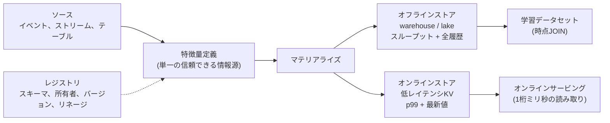

# Feature Stores

## TL;DR

フィーチャーストアは機械学習特徴量のためのデータベースではありません。最適化目標が正反対の2つのストレージエンジンを橋渡しする *整合性システム* です。オフラインストアはスループットと網羅性を最適化し、学習が何年分もの履歴をスキャンできるようにします。オンラインストアは p99 レイテンシを最適化し、サービングが特徴量を1桁ミリ秒で読めるようにします。フィーチャーストアが存在する理由は、学習のために計算された特徴量とサービングのために計算された同じ特徴量が *同じ値* であることを保証することです。1つの定義、2つのアクセスパスです。それ以外のすべて — 時点整合性のあるJOIN、マテリアライズ、鮮度SLO、バージョン管理、レジストリ — は、この2つのストアが物理的に分離されたシステムであり、放っておけば乖離していくという事実に対して、その唯一の保証を守るために存在します。

---

## フィーチャーストアが解決する問題: 学習・サービング間のズレ

このカテゴリ全体を正当化する障害は *学習・サービング間のズレ (training/serving skew)* であり、過小評価されやすいからこそ正確に述べる価値があります。あるチームが特徴量を定義します。たとえば「直近10分の失敗ログイン回数」です。学習用には、アナリストがログインイベントを格納したウェアハウステーブルに対する時間窓SQL集約として書きます。サービング用には、アプリケーションエンジニアがログイン試行ごとに Redis 上でカウンターをインクリメントする形で書きます。この2つの実装は等価に *見えます*。しかし違います。SQL版はイベントをイベントタイムスタンプで数え、Redisカウンターは到着順で数えスライディングTTLで失効します。一方は遅延到着イベントを含み、もう一方は含みません。一方はUTC深夜にリセットされ、もう一方は連続的にロールします。モデルは一方の分布で学習し、別の分布でサービングします。そして何もクラッシュしないため、劣化はサイレントです。モデルは単にオフラインメトリクスが約束したよりも悪い意思決定を行うだけです。

エンジニアリング上の含意は、*1つの特徴量を2つ実装することは利便性ではなくバグである* ということです。同じロジックを2回書けば乖離し、その乖離は原因不明の本番損失として現れるまで不可視のままです。フィーチャーストアはこれに対し、特徴量 *定義* を単一の信頼できる情報源とし、そこからオフライン値とオンライン値の両方を導出することで対処します。あるいは少なくとも、サービングされた値をログに残し、オフラインパイプラインがそれに対してリプレイしてズレを測定できるようにします。より深い原則は、[学習パイプライン](./05-training-pipelines.md)のリーク防止規律を反映しています。オフラインの世界とオンラインの世界が一致しなければ、モデルはフィクションで学習していることになります。

フィーチャーストアがなければ、このズレは構造的なものになります。各モデルチームが独自の特徴量パイプラインを作り、「直近7日のユーザー購入回数」が3つのチームで3つの異なる意味を持ち、同じロジックが6箇所で別々にデバッグされます。フィーチャーストアは、これら重複し乖離していく定義を、2つのマテリアライズパスを持つ1つの契約へと収束させるシステムです。

---

## オンライン/オフラインの二重性は CAP 的なトレードオフである

フィーチャーストアを特徴づける構造的事実は、それが *デュアルストア* システムであり、その2つのストアは矛盾するアクセスパターンに最適化されているため同じエンジンにはなり得ない、ということです。

**オフラインストア** はウェアハウスやレイク上に存在します — BigQuery、Snowflake、Redshift、あるいは Spark でクエリされるオブジェクトストレージ上の Parquet/Delta です。これは *スループットと網羅性* に最適化されています。すべての特徴量値の全履歴を保持し、学習ジョブが任意の過去の時点で任意の特徴量がどう見えたかを再構成できるようにしなければならず、数十億行に対する大規模なカラムナースキャンとJOINをサポートしなければなりません。ここではレイテンシは無関係です。10分かかる学習リードでも問題ありません。バイトあたりのコストとスキャンスループットが支配的です。

**オンラインストア** は低レイテンシのキーバリューシステムです — Redis、DynamoDB、Cassandra、あるいは RocksDB のような組み込みストア — でスコアリング対象のエンティティをキーとします。これは *p99 レイテンシ* に最適化されています。`user_id` に対して20個の特徴量を必要とするサービングリクエストは、それらを1桁ミリ秒でフェッチしなければなりません。なぜなら特徴量参照は、それ自体が厳しいレイテンシ予算を持つ予測のクリティカルパス上にあるからです。サービングは「この特徴量は今いくつか?」しか問わないため、通常はエンティティごとの *最新* 値のみを保存し、履歴は保存しません。

この2つのストアは同じ論理特徴量を保持しながら正反対のトレードオフを行い、両者を整合させ続けることが中心的なエンジニアリング課題です。これはML の衣をまとった [CAP 的](../01-foundations/03-cap-theorem.md)な緊張です。オンラインストアはアーキテクチャ的には、情報の正本がオフラインストアと上流のイベントストリームである値の、読み取り最適化された[キャッシュ](../04-caching/01-cache-strategies.md)です。あらゆるキャッシュと同様に、古くなり得るし、ミスし得るし、ホットなエンティティはあらゆる読み取り中心のKVストアと同じように[ホットキー](../02-distributed-databases/05-partitioning-strategies.md)の負荷を生みます。フィーチャーストアはこれらの分散システムの問題から逃れるわけではなく、それらを *継承* します。そしてフィーチャーストアを運用することの大部分は、完全だが遅いストアと、速いが近似的なストアとの間の整合性ギャップを管理することにあります。

---

## 時点整合性: 決定的な正しさの特性

2つのストア間の整合性が中心的なエンジニアリング課題であるとすれば、*時点整合性 (point-in-time correctness)* は中心的な正しさの特性です。その違反は、あらゆるオフラインメトリクスが優秀に見えながらモデルをサイレントに破壊します。これは[学習パイプライン](./05-training-pipelines.md)を支配するのと同じリーク問題が、ここではJOINの問題として現れたものです。

ルールは述べるのは単純ですが、破られやすいものです。時刻 *T* でラベル付けされた学習行は、*T 時点で知り得た* 特徴量値だけを見なければなりません。学習セットは、ラベル付けされたイベントのテーブル(それぞれエンティティとタイムスタンプを持つ)を、特徴量値の履歴に対してJOINすることで構築されます。素朴な実装は各エンティティをその *現在* または *最新* の特徴量値にJOINしますが、そのJOINは *未来をリーク* します。10:05 のトランザクションに対して生成された不正ラベルを考えてみましょう。特徴量「アカウントリスクスコア」は、不正が発見されアカウントがフラグ付けされた後の 10:40 に再計算されました。最新値JOINは、あたかも 10:05 に利用可能であったかのように 10:40 の値をモデルに渡します。モデルは、本番ではまだその答えを含んでいない特徴量から答えを読み取ることを学習します。オフラインAUCは急上昇し、本番性能は崩壊します。

正しい時点JOINは *as-of* JOINです。時刻 *T* の各ラベル付き行に対して、利用可能時刻が *T* 以下である最新の特徴量値を取ります。これを正しく行うには、混同しやすい3つのタイムスタンプを区別する必要があります。

- **イベント時刻 (Event time)** — 事実が実際に世界で起きた時刻(ログインは 10:00 に発生)。
- **取り込み時刻 (Ingestion time)** — システムがイベントを受け取り記録した時刻(ログは 10:03 に到着)。
- **利用可能時刻 (Availability time)** — 計算された特徴量値がオンラインストアから読めるようになった時刻(10:10 にマテリアライズされクエリ可能に)。

正しいJOINキーは *利用可能時刻* です。なぜならそれこそが、*T* における実際のサービングリクエストが実際に読めたものだからです。基となるイベントが 10:00 に発生したが 10:10 まではサービング可能にならなかった特徴量は、10:05 に下された意思決定にとっては *利用可能ではなかった* のであり、それを使うとリークします。これがフィーチャーストアがオフラインストアに最新値だけでなく *特徴量履歴* を保存しなければならない理由です。値の時系列とその利用可能タイムスタンプがなければ、誠実な as-of JOINを再構成することは不可能であり、バックテストは本番からひそかに乖離します。この規律は学習における時間ベース分割のルールを反映しています。オフラインの世界は、意思決定の瞬間にオンラインの世界が知っていたものだけを見なければなりません。

---

## マテリアライズ: 定義からオンラインストアへ特徴量を届ける

マテリアライズとは、特徴量定義を、サービング準備が整った実際の値としてオンラインストアに置く処理です。ここで鮮度対コストのトレードオフが具体化され、マテリアライズパターンの選択はフィーチャーストアにおいて最も重大な設計上の意思決定です。

**バッチ(事前計算)マテリアライズ** は、時間窓にわたって特徴量値を計算し、最新結果をオンラインストアに書き込むスケジュールされたジョブを実行します。安価でシンプルであり、オフラインパイプラインを再利用でき、数時間の古さを許容できる特徴量に対して正しく機能します — ユーザーの30日平均注文額は分単位では変化しません。その障害モードはその実行頻度に縛られます。ジョブが1時間ごとに実行されるなら、オンライン値は最大1時間古くなり、ジョブが遅延または失敗すれば、オンラインストアはサイレントに昨日の値をサービングします。

**ストリーミングマテリアライズ** は、イベントストリーム(多くの場合ソーステーブルからの[変更データキャプチャ](../13-data-pipelines/04-change-data-capture.md)フィード、またはドメインイベントのKafkaトピック)を消費し、数秒以内にオンライン値を更新します。鮮度が必要な特徴量への答えです — 失敗ログイン回数、現在のセッションアクティビティ、リアルタイムの速度系特徴量です。コストは運用の複雑さです。ストリーミング集約は *冪等* でなければなりません。リプレイまたは重複したイベントが時間窓カウンターを二重計上してはならないからです。また順序の乱れたイベントを扱わなければ時間窓が誤ります。ストリーミングマテリアライズは、ほとんどのフィーチャーストア本番インシデントが発生する場所です。

**オンデマンド(リクエスト時)計算** は、リクエスト自体に含まれるデータからサービング時に特徴量を計算します — 現在のショッピングカートの値、リクエストの位置と保存された自宅住所との距離などです。これらの特徴量は、リクエストが到着するまで存在しない入力に依存するため、事前計算できません。トレードオフはレイテンシと、*同じ* オンデマンド変換が学習のためにオフラインパイプラインでも利用可能でなければならないという新たな要件です。さもなければズレが裏口から戻ってきます。

統一的なトレードオフは鮮度対コストです。より新鮮な特徴量は、より頻繁な、あるいは継続的な計算を必要とし、それはより多くの計算コストとより広い運用上の表面積を要します。正しいパターンは特徴量ごとに、値がどれだけ古くてよいかを問うことで選びます — これは鮮度を実装の詳細から、宣言され監視される特性へと変えます。

| パターン | 鮮度 | コスト / 複雑さ | 正しいケース |
|---|---|---|---|
| バッチ事前計算 | 数時間 | 低 | ゆっくり変化する集約値(30日支出) |
| ストリーミング | 数秒 | 高(冪等性、順序) | リアルタイムシグナル(速度、ライブカウント) |
| オンデマンド | リクエスト時 | 中(パリティリスク) | リクエスト専用入力に依存(カート額) |

---

## オンラインサービングのSLOとしての特徴量鮮度

マテリアライズが整うと、*鮮度* — オンラインストアの値がどれだけ古くてよいか — はあいまいな願望ではなくサービスレベル目標になります。これはレイテンシやエラー率と同じ運用語彙に属し、[SLOとエラーバジェット](../11-observability/05-slos-error-budgets.md)で監視されます。

鮮度が明示的なSLOでなければならない理由は、古さがサービングパスの内側からは不可視だからです。オンラインストアは、値が3秒前に更新されようと3日前に更新されようと、同じレイテンシで値を返します。読み取りが成功しても、マテリアライズジョブが昨夜死んだことは何も明らかになりません。古さを検出する唯一の方法は、特徴量グループごとの *最新更新の経過時間* を測定し、宣言された予算と比較することです。不正検知の特徴量は60秒の鮮度SLOを持つかもしれませんし、チャーンの特徴量は24時間を許容するかもしれません。測定された経過時間が予算を超えたら、システムは反応すべきです — 所有者をページングする、fail close する、あるいは古い特徴量に依存しないフォールバックモデルにルーティングする — 自信を持って誤った予測をサービングし続けるのではなく。

これに続く設計ルールは、*鮮度はすべての特徴量の宣言された特性である* ということです。レジストリに記録され本番で強制されます。鮮度が述べられていない特徴量には「壊れている」の定義がなく、古さについて監視されていないマテリアライズパイプラインは、いつ起きてもおかしくないサイレント障害です。

---

## 特徴量バージョン管理: 意味の変更は新しい特徴量である

特徴量はモデルが依存するAPIであり、そのAPIの基本ルールは *意味の変更は新しい特徴量名であって、決して in-place な編集ではない* ということです。このルールが存在する理由は、モデルのオフライン挙動が、学習時に特徴量が持っていた正確な意味に固定されているからであり、デプロイ済みモデルの下でその意味を変えることは、サイレントな回帰と区別がつかないからです。

微妙な点は、*型の互換性は意味の互換性を意味しない* ということです。「セッション長」が秒のカウントからミリ秒のカウントへひそかに変わると、すべての型チェックは通り、すべてのnullチェックは通り、それを消費するすべてのモデルは今や3桁ずれた誤りになります。「アクティブユーザー」が「今週ログインした」から「今月ログインした」へ再定義されると、カラムの型は変わりませんが、特徴量は今や別の意味を持ち、古い意味で学習したモデルは劣化します。特徴量のロジックを in-place で編集すると、オフライン履歴(バックフィルされた値が本番が実際にサービングしたものを上書きする)とオンライン挙動(デプロイ済みモデルが突然異なるシグナルを読む)の両方を破損させます。

したがって規律は、特徴量を不変でバージョン管理されたオブジェクトとして扱うことです。意味の変更は、まだ稼働中の `session_length_sec:v2` と並んで `session_length_ms:v3` を生み出します。古いモデルは、再学習され v3 に対して再検証されるまで v2 を読み続けます。モデルは消費した正確な *特徴量ビューのバージョン* を固定します — [学習パイプライン](./05-training-pipelines.md)の再現性契約が記録するのと同じ固定です — それによりモデルは常に、学習時の正確な特徴量の意味に対して再構築できます。バックフィルは、本当に誤った履歴を修正する場合もバージョン管理されなければなりません。それにより「本番が実際にサービングした値」が「後で正しいと判断した値」によって決して上書きされないようにします。

---

## レジストリ: 発見、再利用、ガバナンス

フィーチャーストアにおける3つ目のストア — オフラインとオンラインの次 — は *レジストリ* であり、すべての特徴量の定義、所有者、スキーマ、バージョン、鮮度SLO、ソース、リネージを記録するメタデータカタログです。これは最も構築が不十分になりがちなコンポーネントであり、フィーチャーストアが *再利用* という中心的な約束を果たせるかどうかを決定するものです。

フィーチャーストアの経済的論拠は、特徴量は正しく構築するのが高価であり、一度構築して共有すべきだ、というものです。その約束は、新しいモデルに取り組むエンジニアが `user_failed_login_count_10m` がすでに存在することを *発見* し、誰が所有しているかを見て、その鮮度と意味を確認し、再構築せずに消費できる場合にのみ現実のものとなります。検索可能なレジストリがなければ、チームは同じ特徴量を少しずつ異なる方法で再導出し、フィーチャーストアが排除するはずだったズレが重複として忍び寄ってきます。レジストリは、マテリアライズされたテーブルの山を、共有され統治された資産へと変えるものです。

ガバナンスの側面が重要なのは、共有された特徴量が共有された依存関係、ひいては共有された障害表面を生むからです。上流チームがソースの意味の保守をひそかに止めた、12のモデルに消費される特徴量は、その12すべてにわたる潜在的なインシデントです。レジストリは、所有権が割り当てられ、利用が追跡され(未使用の特徴量は廃止でき、頻繁に使われるものは本番クリティカルとして扱える)、変更がレビューされる場所です。規制対象の意思決定 — 与信、保険、採用 — については、レジストリのリネージは監査証跡でもあります。「どの特徴量値が、どう計算され、この意思決定に供給されたか?」に答えます。所有され強制されたレジストリのないフィーチャーストアは、結局のところ単なるもう1つのデータベースです。メタデータ層こそが、それをプラットフォームにするものです。

---

## 実際のシステムはどう構築されているか

このカテゴリは、名付けられる前に本番で定義されました。**Uber の Michelangelo Palette**(2017年頃に導入)は、典型的なデュアルストア設計です。学習用の Hive/Spark ベースのオフラインストアと、サービング用の Cassandra + Redis オンラインストアを持ち、共有DSLによって一度定義された特徴量が両方のパスにマテリアライズされます — 学習・サービング間のズレに対する明示的なアーキテクチャ的回答です。**Airbnb の Zipline**(2018年から公に説明)は時点整合性に強く注力し、各ラベルのタイムスタンプを尊重する as-of JOINで学習データを生成し、まさに未来リークの障害を防ぎ、バッチとストリーミングの特徴量計算を1つの定義の背後に統一しました。

**Feast**(2019年に Gojek がオープンソース化、後に Linux Foundation / Tecton が運営するプロジェクト)は、このパターンの広く使われるオープン実装です。コードによる特徴量定義、プラガブルなオフラインストア(BigQuery、Snowflake、Redshift、ファイルベース)とプラガブルなオンラインストア(Redis、DynamoDB、Datastore)を持ち、学習用の時点整合性のある `get_historical_features` とサービング用の低レイテンシ `get_online_features` を備えます。**Tecton**(2019年に Michelangelo チームが創業)は、同じデュアルストア + ストリーミングモデルを中心に構築された商用マネージド特徴量プラットフォームであり、マネージドなマテリアライズと鮮度SLOを重視します。これらすべてにわたってアーキテクチャは韻を踏みます。1つの定義、完全な履歴のためのオフラインストア、高速読み取りのためのオンラインストア、発見のためのレジストリ、そして2つのストアを誠実に保つことを仕事とするマテリアライズ層です。

---

## 障害モード

フィーチャーストアの特徴的な障害は、そのデュアルストア構造の直接的な帰結であり、それらに名前を付けることが防止のほとんどです。

**学習・サービング間のズレ** は決定的な障害です。「同じ」特徴量のオフライン値とオンライン値が、2つのコードパスで計算されたために乖離します。防御策は、可能な限り両方を1つの定義から導出すること、そうでなければサービングされた特徴量値をログに残してオフラインパイプラインを通じてリプレイし差分を測定することです — 測定しないズレは、出荷しているズレです。

**古いオンライン特徴量** は、オンラインストアは健全で高速だが、それに供給するマテリアライズがサイレントに停止したときに発生します。読み取りは成功し、値は古いです。防御策は、予算を超えたときに fail close またはフォールバックする、特徴量グループごとの経過時間監視を伴う鮮度SLOです。

**時点リーク** はズレのオフライン側の鏡です。ラベルのタイムスタンプ時点で知り得なかった特徴量値を使う学習JOINです。オフラインメトリクスを膨らませ、本番で崩壊します。防御策は、利用可能時刻をキーとする as-of JOINと、それらのJOINを再構成可能にする保存された特徴量履歴です。

**ホットキー負荷** は、少数のエンティティ — 著名人ユーザー、バイラルなアイテム、大量取引の加盟店 — が読み取りトラフィックを一握りのオンラインストアキーに集中させ、あらゆる[パーティション化されたKVストア](../02-distributed-databases/05-partitioning-strategies.md)と同じようにテールレイテンシのスパイクを生むときに現れます。防御策はおなじみのキャッシュ道具一式です。ホットキーをレプリケートする、オンラインストアの前にローカル読み取りキャッシュを追加する、あるいは既知のホットなエンティティについて集約を事前計算して固定する、です。

---

## 意思決定フレームワーク: そもそも必要なのか?

フィーチャーストアは重要なインフラであり、最も重要な設計上の意思決定は、その問題が本当にフィーチャーストアを要求しているかどうかです。多くのチームにとって正直なデフォルトは *いいえ* です。

それを決める問いは *共有* と *サービング* に関するものです。複数のモデルが同じ特徴量を消費し、一度構築して再利用することが割に合うか? モデルはオンラインでサービングされ、同じ特徴量をバッチ学習と低レイテンシ推論の両方で計算しなければならないか — これがそもそもズレのリスクを生む条件です。特徴量は数秒以内に新鮮である必要があり、マテリアライズを現実のエンジニアリング問題にするか? 規制対象の意思決定はリネージと監査証跡を必要とするか? これらのいくつかが真であれば、フィーチャーストアの整合性、発見、鮮度の機構が元を取ります。

そうでないとき、よりシンプルなツールは許容されるだけでなく正しいのです。毎晩バッチでスコアリングする単一のオフライン専用モデルには、オンラインストアはまったく不要です — 慎重な時点クエリで構築された、バージョン管理された不変の学習テーブルで十分であり、それは[学習パイプライン](./05-training-pipelines.md)のスナップショット規律が仕事をしているのです。読まれるが学習には決して使われない単一のオンライン特徴量は、単なる[キャッシュ](../04-caching/01-cache-strategies.md)です。特徴量プラットフォームではなく Redis を使いましょう。罠は、要件ではなく *履歴書* のためにフィーチャーストアを採用することです。レジストリガバナンスがなく消費者が1つしかない、所有者のないフィーチャーストアは、それが置き換えた事前計算テーブルよりも厳密に劣ります。再利用も整合性も提供せずに運用上の表面積を増やすからです。それが解決するズレの問題を抱えたときにフィーチャーストアを構築しましょう — それ以前ではなく。

フィーチャーストアが健全であることを確認する監視は、それ自体が小さなSLOスイートであり、[モデル監視](./04-model-monitoring.md)に直接つながります。鮮度ラグ(マテリアライズは生きているか?)、オンライン読み取りp99(特徴量読み取りは予測のレイテンシ予算に収まるか?)、オンラインミス率(キー設計やバックフィルのギャップがモデルを飢えさせていないか?)、null/default率(ソースが回帰したか?)、オフライン/オンラインのパリティ差分(ズレが忍び寄っていないか?)。自身の健全性が監視されていないフィーチャーストアは、唯一の存在理由である整合性を保証できません。

---

## 重要なポイント

1. フィーチャーストアはデータベースではなく整合性システムである。その仕事は、学習用とサービング用に計算された特徴量が同じ値であることを保証することだ — 1つの定義、2つのアクセスパス。
2. 学習・サービング間のズレがそれが解決する問題である。1つの特徴量の2つの実装はサイレントに乖離し、オフラインメトリクスが良好に見えながらモデルを劣化させる。
3. オンライン/オフラインの二重性は CAP 的なトレードオフである。オフラインストアはスループットと全履歴を最適化し、オンラインストアは1桁ミリ秒のp99を最適化し、両者を整合させ続けることが中核的な課題である。
4. 時点整合性は決定的な正しさの特性である。各行のタイムスタンプ時点で知り得た値だけで学習し、利用可能時刻でJOINする。さもなければ未来がリークする。
5. イベント時刻、取り込み時刻、利用可能時刻を区別する。オンラインストアは利用可能だったものしか読めなかったのだから、利用可能時刻が誠実なJOINキーである。
6. マテリアライズ(バッチ、ストリーミング、オンデマンド)は特徴量ごとに行う鮮度対コストの意思決定である。ストリーミングは冪等性と順序の規律を要求する。
7. 特徴量鮮度はオンラインサービングのSLOである — 最新更新の経過時間として測定され、fail close またはフォールバックで強制される。古さは成功した読み取りからは不可視だからだ。
8. 意味の変更は新しい特徴量名であって、決して in-place な編集ではない。型の互換性は意味の互換性ではないため、モデルは不変の特徴量ビューのバージョンを固定する。
9. レジストリは、プラットフォームを正当化する再利用とガバナンスを提供する。所有され発見可能なメタデータがなければ、フィーチャーストアは単なるもう1つのデータベースである。
10. ほとんどの単一モデル、オフライン専用、または単一キャッシュのユースケースにフィーチャーストアは不要である。共有、オンラインサービング、鮮度、リネージが整合性機構の元を取らせるときに採用する。

---

## 参考文献

1. [Feast Documentation](https://docs.feast.dev/) — オープンソースのフィーチャーストア、オフライン/オンラインストアと時点JOIN
2. [Uber Michelangelo: Machine Learning Platform](https://www.uber.com/blog/michelangelo-machine-learning-platform/) — Palette フィーチャーストア、デュアルストアアーキテクチャ
3. [Zipline: Airbnb's Machine Learning Data Management Platform](https://www.youtube.com/watch?v=Ad-PNQghJg8) — 時点整合性のある学習データ生成
4. [Tecton: What Is a Feature Store?](https://www.tecton.ai/blog/what-is-a-feature-store/) — マネージド特徴量プラットフォームとマテリアライズモデル
5. [Hidden Technical Debt in Machine Learning Systems](https://proceedings.neurips.cc/paper_files/paper/2015/file/86df7dcfd896fcaf2674f757a2463eba-Paper.pdf) — Sculley et al., 2015
6. [Data Validation for Machine Learning](https://mlsys.org/Conferences/2019/doc/2019/167.pdf) — Breck et al., 2019
7. [Spanner: Google's Globally-Distributed Database](https://research.google/pubs/pub39966/) — Corbett et al., OSDI 2012(整合性対レイテンシの枠組み)
