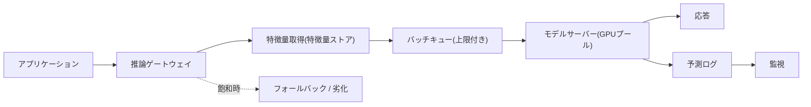

# モデルサービング

## TL;DR

モデルサービングとは、学習済みモデルを本番サービスとして稼働させる技術であり、そのリクエストハンドラは異常なほど高コストです。1回の予測は通常のWebリクエストより桁違いに多くの計算を消費することがあり、しばしば1時間あたり数ドルかかるハードウェア上で実行され、しかもモデルは何かをサーブする前にまずアクセラレータメモリへ*ロード*されていなければなりません。このことが、サービングをデータサイエンスではなくシステム設計の問題として捉え直させます。定義的な緊張関係は**レイテンシ対スループット**です。高価なアクセラレータを忙しく保つための手法 — バッチング、キューイング — は、まさにレイテンシ分布のテールを膨らませる手法と同じだからです。良いサービスシステムとは、この緊張関係を意図的に乗りこなすものです。すなわち、サービングトポロジーを選び、制御された待機でバッチングし、実際に飽和を予測する信号に基づいて自動スケーリングし、コールドスタートが遅いためレプリカをウォームに保ち、タイムアウトする代わりに優雅に劣化します。以下のすべては、推論を関数呼び出しではなく、レイテンシに制約され、スループットに制約され、ハードウェアに束縛されたサービスとして扱うことの帰結です。

サービングはまず第一に本番サービスなので、一般的なパターンが直接適用されます。レイテンシ予算のための[キャパシティ計画](../01-foundations/10-capacity-planning.md)、テール制御のための[リトライ、タイムアウト、ヘッジング](../06-scaling/10-retries-timeouts-hedging.md)、カナリーやブルーグリーンのロールアウトのための[デプロイ戦略](../15-deployment/01-deployment-strategies.md)、容量のための[自動スケーリング](../06-scaling/08-auto-scaling.md)です。LLMの領域 — 継続バッチング、KVキャッシュ、prefill/decodeの分離 — はそれ自体が独立した世界であり、[LLM Infrastructure](../17-llm-systems/05-llm-infrastructure.md)で詳しく扱います。

---

## 中心的な緊張関係: レイテンシ対スループット

モデルサービングにおける興味深い意思決定のほぼすべては、レイテンシとスループットの間にある単一のトレードオフ曲線上の一点であり、このトレードオフがなぜ実装の詳細ではなく*根本的*なのかを理解することが、このトピック全体の鍵です。

それが根本的である理由は、現代の推論ハードウェアが直列速度ではなく並列性のために作られているからです。単一のリクエストを実行しているGPUは演算ユニットのほとんどをアイドルのままにしますが、同じGPUが32リクエストを同時に実行すれば、わずかに長い実時間でおよそ32倍の有用な仕事をこなします。なぜなら支配的なコストはモデルの重みをメモリから計算ユニットへ移動させることであり、そのコストはバッチサイズに関係なくバッチごとに1回だけ支払われるからです。したがって、サービスシステムが最適化できる完全に異なる2つの数値があります。**レイテンシ**は1つのリクエストがどれだけ待つかです。**スループット**はシステムが1秒あたり何件のリクエストを完了するかです。GPU上ではこれらは単に異なるだけでなく、*緊張関係*にあります。なぜなら、スループットを上げる最も安価な方法は、各リクエストを少し待たせて他のリクエストに相乗りさせることだからです。

エンジニアリング上の含意は、製品が実際に気にかける数値をまず決めないことには、サービスシステムをチューニングできないということです。チェックアウトをブロックする不正承認の呼び出しはp99レイテンシを気にかけ、それを得るためにアイドルなハードウェアの代金を払います。すべてのユーザーのチャーンリスクをスコアリングする夜間バッチは総コストだけを気にかけ、ひどいリクエストごとのレイテンシで巨大なバッチを喜んで走らせます。ほとんどの実システムはこれらの両極の間に位置し、サービング基盤の仕事のすべては、運用者にその曲線上の*ツマミ*を — 偶然ではなく — 与えることです。

---

## サービングの領域

トポロジーやハードウェアの決定の前に、モデルはいくつかのサービング*領域*のいずれかに属し、その領域は入力が到着してから予測がどれだけ早く必要かによって固定されます。領域を正しく選ぶことは設計全体で最も影響力の大きい決定です。なぜなら、どの制約が適用されるか自体を決めるからです。

**バッチ(オフライン)スコアリング**は、すでに収集済みの大規模なデータセットに対してスケジュールに従って予測を実行します — すべてのユーザーの日次チャーンスコア、夜間の推薦更新など。ユーザー向けの意味でのレイテンシ予算を持たないため、スループットの極に位置します。すなわち、バッチサイズを最大化し、ハードウェアを飽和させ、予測あたりコストを最小化します。落とし穴は*古さ* — スコアは最後の実行時点での世界を反映します — と*無効化*、すなわち事前計算された予測がいつ信頼するには古すぎるのかという問題です。バッチは大差で最も安価な領域であり、驚くほど多くの「リアルタイム」要件は「これは実際どれだけ新鮮である必要があるのか?」という問いの下で解消します。

**オンライン同期**サービングは、リクエスト自身のレイテンシ予算内でリクエストに応答します — 不正承認、検索ランキング、ページロード時のパーソナライズなど。これは本書のあらゆる制約が効いてくる領域です。すなわち、テールレイテンシ、コールドスタート、バッチングのトレードオフ、正しい信号に基づく自動スケーリングです。これはまた最も高価でもあります。なぜなら、ハードウェアを都合の良いときではなく*今*準備させることを強いるからです。

**オンライン非同期およびストリーミング**サービングは、予測をブロッキング呼び出しから切り離します。非同期スコアリングキューは、ユーザーリクエストを開いたまま保持することなく、数秒から数分のうちにエンリッチメントやレビュールーティングを行わせます。ストリーミング推論は、パイプラインを流れるイベントを高スループットかつイベントごとに数十ミリ秒のレイテンシでスコアリングします(不正検知、異常検知)。これらの領域は、キューのセマンティクスと遅延した意思決定と引き換えに、テールレイテンシの制約を緩和します。

実務上のルールは、*鮮度要件を満たす最も安価な領域へ仕事を押しやる*ことです。日次で安定するスコアを高価なオンラインエンドポイント経由でサーブするのは、よくある回避可能な無駄です。同じ予測を夜間バッチで事前計算してキャッシュすれば、コストはわずかな割合で済みます。以下の領域 — トポロジー、バッチング、自動スケーリング — はすべてオンライン同期のケースを精緻化したものです。なぜなら、そこがシステム設計が最も難しい場所だからです。

---

## なぜGPUが経済性を変えるのか

CPUでのサービングとアクセラレータでのサービングは別の事業であり、その違いはほぼ全面的に*コストの単位としての利用率*に関するものです。

CPUのフリートは優雅に劣化し、いくらかのアイドルな余裕が問題にならない程度には安価です。アクセラレータのフリートはそのようには機能しません。GPUインスタンスは、有用な仕事をしていようとアイドルで座っていようと、大きな固定の時間コストであり、高価な部分 — アクセラレータ — は分割不可能です。「H100の30パーセント」を買うことはできません。これは利用率を、あれば嬉しい効率メトリクスから、*唯一の*メトリクスへと変えます。利用率20パーセントのGPUは80パーセント分まあまあなのではなく、非常に大きな請求書の80パーセントが燃やされているマシンです。これは[学習パイプライン](./05-training-pipelines.md)を支配するのと同じ経済性であり、入力データを与えられないA100が割増料金でアイドルするのと同様です — ただしサービングでは、その飢餓は遅いデータI/Oではなく、細くバースト的なリクエストストリームから生じます。

これがバッチングが存在する本当の理由です。バッチングは主にレイテンシ機能でもスループット機能でもありません。それは、高価で分割不可能なアクセラレータをその価格を正当化するのに十分忙しく保つメカニズムです。利用率をコストドライバーと見れば、サービングの一連の決定が連鎖的に従います。すなわち、モデルごとにGPUを専有させるのではなく多数のモデルを共有アクセラレータへ統合し(NVIDIA Tritonのようなマルチモデルサービング)、シリコンを埋めるために積極的にバッチングし、CPUではなくキュー深さに基づいてスケールします。なぜならCPUはGPUが飽和しているかどうかをほとんど何も教えてくれないからです。アクセラレータが制約であり、よく設計されたサービスシステムはそれに餌を与え続けることを中心に他のすべてを組織します。

---

## 動的バッチングはキューイングの意思決定である

バッチングを理解する最もすっきりした方法は、リクエストパスに埋め込まれた小さく意図的なキューイング理論の一片として捉えることです。

静的バッチング — ちょうどN件のリクエストが到着するまで待ってから一緒に実行する — は単純ですが、オンライントラフィックには不適切です。なぜなら低負荷下ではN件目のリクエストが決して到着せず、早く来たリクエストが無限に待つ可能性があるからです。**動的バッチング**は、これを上限付きの待機で解決します。サーバーは到着したリクエストを最大で数ミリ秒だけキューに保持し(TensorFlow Servingはこれを`batch_timeout_micros`として、NVIDIA Tritonは`max_queue_delay`として公開します)、バッチが満杯になるかタイマーが切れたときに、その時点で溜まっているリクエストをディスパッチします。待機はバッチを組み立てるために支払う代価であり、レイテンシ/スループット曲線上の直接的なツマミです。長い待機はより大きなバッチとより高いスループットを構築しますが、その代償として、キューが空のときに到着したものも含め、すべてのリクエストに追加のレイテンシがかかります。

チームを引っかける微妙な点は、これが定数ではなく*キューイング*の意思決定だということです。高負荷下ではタイマーが切れる前にバッチが満杯になるため、待機はほとんど加算されずスループットが高くなります。低負荷下ではタイマーが支配的になり、待つ必要のなかったリクエストに待機の全遅延を加えます。最悪の領域は中程度でバースト的な負荷で、キューが振動し、追加されたレイテンシが予測不能になります — まさにそこでテールが爆発します。したがって正しいバッチ待機はトラフィックの形状の関数であり、それを設定する誠実な方法は、平均について推論するのではなく、実際のピークバーストサイズでp99レイテンシを測定することです。テールをバースト下で測定せずにバッチングするサービスシステムは、記述できないスループットと約束できないレイテンシを選んでしまっています。

---

## テールレイテンシこそが本当の予算

オンラインサービングは*レイテンシ予算*によって支配され、その予算で重要な数値はほとんど決して平均ではありません。

その理由は、推論呼び出しが全体像であることが稀だからです。ユーザー向けの予測は通常fanoutします。すなわち、リクエストは認証されルーティングされなければならず、特徴量は(しばしばネットワーク越しの[特徴量ストア](./02-feature-stores.md)から)取得されなければならず、モデルは実行されなければならず、結果は後処理されログに残されなければなりません。各段階が固定のエンドツーエンド予算の一部を消費し、有用な設計規律はハードウェアを選ぶ前にその予算を明示的に書き下すことです。なぜなら、特徴量取得が100 ms予算の大半を食っているなら、より速いGPUはユーザー体験を改善しないからです。

```text
エンドツーエンドp99予算: 120 ms
  ingress + 認証/ルーティング   15 ms
  特徴量取得                   40 ms   <- しばしば本当のボトルネック
  モデル推論                   45 ms
  後処理 + ログ                20 ms
```

より深い論点は、予算が*どのパーセンタイル*に適用されるかです。平均レイテンシが20 msでもp99が300 msのモデルは、複数のモデルや複数の特徴量へfanoutするどのリクエストでも、驚くほど頻繁に遅いユーザー体験を生みます。なぜなら、10個のバックエンドに触れるリクエストは、その10個のうち*最も遅い*もののおよそp99を継承するからです。これはテールアットスケール問題であり、サービングはそれを2つの特定の方法で悪化させます。第一に、バッチングはリクエストを結合します。バッチ内の1つの遅いまたは過大なリクエストが、そのバッチ内の他のすべてのリクエストを遅らせるため、1つの病的な入力が罪のないバッチ仲間のテールを引き上げます。第二に、バースト下のキューイングがテールを非線形に膨らませます。到着が一時的にサービスレートを超えると、キューは排出されるより速く成長し、待ち時間がバーストの後ろにいる全員にとってスパイクします。防御策は、推論に適用された標準的なテール制御ツールキットです。すなわち、リクエストごとの厳格なタイムアウト、[ロードシェディング](../06-scaling/07-backpressure.md)を伴う上限付きキュー、高価なモデルが安価なモデルを飢えさせないようにする別プール、そして読み取り専用予測には時にリクエストヘッジングです。支配的なルールは、**平均ではなくp99が契約である**ということです。なぜなら、ユーザーはテールを体験するからです。

---

## コールドスタート: なぜスケールトゥゼロは危険か

モデルサービングが通常のステートレスWebサービングと異なる最も重要な点は、サービングレプリカが起動した瞬間には準備が*できていない*ことです。まずモデルをアクセラレータメモリへロードしなければならず、そのロードは遅いのです。

そのメカニズムは避けられません。モデルの重みは大きく、1回の予測が走る前にストレージからデバイスメモリへコピーされなければなりません。控えめなモデルは1、2秒でロードされ、数ギガバイトのモデルは数十秒でロードされ、数十から数百ギガバイトの重みを持つ大規模言語モデルは、オブジェクトストレージからGPUへストリーミングされ、準備完了になるまで*数分*かかることがあります。その間ずっと、レプリカは高価なインスタンスを消費しながら何もサーブしません。これがコールドスタート問題であり、クラウドの一般的な知恵を逆転させます。スケールトゥゼロ — アイドル時にサービスをレプリカ0まで落とし、次のリクエストで1つ立ち上げる — は、安価で起動の速いサービスにとっては優雅なコスト最適化です。大規模モデルにとっては罠です。スケールトゥゼロ後の最初のリクエストはロード時間全体をレイテンシとして支払い、それは数分の応答、あるいははるかに可能性が高いことにタイムアウトを意味します。

エンジニアリング上の含意は直接的に従います。レイテンシクリティカルなモデルは、ゼロからスケールするのではなく、プロビジョニングされたレプリカの*ウォームプール*を保ち、予測可能なテールの代価としてアイドル容量のコストを受け入れるべきです。自動スケーリングは十分に*予測的*でなければならず — 早期の飽和信号でスケールアップする — 新しいレプリカが既存のレプリカが圧倒される*前に*ロードを完了するようにします。なぜなら、キューがすでに満杯になってから反応するだけでは、新しい容量が数分遅れて到着するからです。アイドルコストを本当に最小化しなければならない場合(滅多に使われないモデル、大規模なモデルカタログ)、現実的な選択肢は、下限として単一のウォームレプリカを保つこと、明示的に非対話的なパスに対してのみコールドスタートレイテンシを受け入れること、あるいはロード済みモデルをローカルNVMeにキャッシュして遅いオブジェクトストレージへのホップをスキップすることです。KServeのようなプラットフォームがスケールトゥゼロを公開するのは、まさにそれが魅力的だからです — しかしそれは小さなモデルと寛容なクライアントのものであり、決してレイテンシに束縛された大規模モデルのエンドポイントのものではありません。

---

## サービングトポロジー

モデルがアプリケーションに対してどこで実行されるかは、レイテンシ、分離、スケーリング、言語選択に影響を及ぼすアーキテクチャ上の決定です。3つの正準的なトポロジーがあり、正しいものはモデルサイズ、更新頻度、そして何個のサービスが予測を必要とするかに依存します。

| トポロジー | レイテンシ | 分離とスケーリング | 適する条件 |
|---|---|---|---|
| **埋め込み(インプロセス)** | 最小 — ネットワークホップなし | なし。モデルはアプリと一緒にスケール、同じ言語ランタイム | 小さく速いモデル。超厳格な予算。呼び出し元が少ない |
| **専用モデルサーバー** | ローカル/ネットワークホップ1回 | モデルが独立してスケール・デプロイ。多言語 | 共有モデル、GPU統合、頻繁なモデル更新 |
| **マネージド推論エンドポイント** | ネットワークホップ + プロバイダーオーバーヘッド | 完全に外部。プロバイダーが容量とスケーリングを所有 | アクセラレータの運用を避けたい。バースト的または実験的な負荷 |

**埋め込みサービング**はモデルをアプリケーションプロセスへ直接リンクします。これは可能な限り最速のパス — シリアライズなし、ネットワークなし — であり、最も推論しやすいものですが、モデルのライフサイクルをアプリケーションのものと結合します。すなわち、すべてのモデル更新はアプリケーションの再デプロイであり、モデルはアプリのメモリとCPUを奪い合い、アプリはモデルが必要とするランタイムに固定されます。これは厳格なレイテンシ予算の下にある小さな勾配ブースティングモデルにとっては正しい答えであり、GPUや独立したロールアウトを必要とするものにとっては誤った答えです。

**専用モデルサーバー** — TensorFlow Serving、Triton、TorchServe、またはカスタムサービス — は、モデルを独自のデプロイ可能物として実行し、ローカルソケットまたはネットワーク越しに到達します。これは本格的なシステムにとっての主力トポロジーです。なぜなら*独立性*を買うからです。すなわち、モデルはアプリケーションコードとは別にロールアウトし(安全なカナリーとロールバックに不可欠)、複数のアプリケーションが1つのモデルと1セットのアクセラレータを共有し、モデルは好きな言語とランタイムで実行できる一方で呼び出し元は多言語のままです。コストはネットワークホップとリクエストパス内の新しい依存先であり、これはモデルサーバーが他のあらゆる下流と同様に独自のSLO、タイムアウト、フォールバックを必要とすることを意味します。

**マネージド推論エンドポイント** — SageMaker、Vertex AI、またはホスト型推論プロバイダー — は問題全体をベンダーに押し付けます。これはアクセラレータの運用とスケーリングの負担を取り除き、MLインフラの専門性を持たないチームや、急峻で実験的なワークロードにとって真に価値があります。トレードオフはマネージドサービスの通常のものです。すなわち、バッチングやコールドスタート挙動への制御が少なく、プロバイダーが課すレイテンシオーバーヘッド、定常的な大量トラフィックではセルフホスティングを上回りうる呼び出しごとのコスト、そして特徴量を第三者へ送るデータガバナンスの問題です。

ほとんどの本番システムが収束する専用サーバートポロジーの有用な図:



その図にある予測ログはオプションではありません。リクエストメタデータ、モデルバージョン、特徴量参照、予測、レイテンシを記録することが、システムをデバッグ可能にし、[モデル監視](./04-model-monitoring.md)と後のラベル結合の原材料となります。

---

## 正しい信号に基づく自動スケーリング

モデルサービスをCPU利用率で自動スケーリングするのは、よくある高くつく誤りです。なぜなら、GPUに束縛されたモデルにとってCPUはサービスが飽和しているかどうかとほとんど無相関だからです。

その理由は、ボトルネックとなるリソースがアクセラレータとその前のキューであり、そのどちらもCPU負荷として現れないからです。GPUサーバーは崩壊の縁にいる — バッチキューが成長し、p99が上昇している — 一方でCPUは30パーセントに座っていることがあります。なぜなら仕事はCPUメトリクスが見ないシリコン上で起きているからです。したがってCPUに基づくスケーリングは、レイテンシがすでに壊れた後に遅れてレプリカを追加するか、決して追加しません。実際に飽和を予測する信号は、**キュー深さとバッチ待ち時間**(リクエストがGPUの排出より速く積み上がっている)、**GPU利用率とメモリ**(アクセラレータが制約なので、それを直接測定する)、そして**推論レイテンシとタイムアウト率**(ユーザーが感じる症状)です。キュー深さに基づくスケーリングは通常、最良の単一の選択です。なぜならそれは*先行*指標だからです。キューはレイテンシが壊れる前に成長し、遅い新しいレプリカにロードする時間を与えます。

コールドスタート問題がこれらすべてを先鋭化させます。新しい大規模モデルのレプリカは準備完了になるまで数十秒から数分かかるため、自動スケーリングは既存のフリートが飽和するよりかなり前にトリガーされなければなりません。スケールアップ信号は少なくともレプリカのウォームアップ時間だけ需要に先行しなければならず、さもなければ新しい容量はインシデントが終わった後に到着します。これが、レイテンシクリティカルな大規模モデルが保守的なスケール*ダウン*(必要に見えるよりも長くウォーム容量を保つ)と積極的で予測的なスケール*アップ*を組み合わせ、決してゼロにスケールしない理由です。自動スケーラーの仕事は、必要になる*前に*ウォームなハードウェアを準備しておくことであり、それは最初に動く信号を監視している場合にのみ可能です。

---

## キャッシング

モデルサービングにおけるキャッシングは複数のレイヤーで動作し、各レイヤーは異なる種類の古さを異なる種類の速度と交換します。

**応答キャッシング**は、同一の入力に対する予測を保存します。入力空間が小さいか偏っている場合 — 同じ少数の人気アイテムが何度も繰り返しスコアリングされる — には絶大に効果的で、すべてのリクエストが一意である場合には役に立ちません。危険は正しさです。キャッシュされた予測はモデルバージョンが変わった瞬間に古くなるため、モデルバージョンがキャッシュキーの一部で*なければならず*、さもなければデプロイが静かに古いモデルの答えをサーブし続けます。あらゆるキャッシュを悩ませるのと同じサンダリングハード(thundering herd)の力学がここにも適用されます。ホットキーが失効すると、同時ミスのバーストが一斉にGPUへ殺到する可能性があります([キャッシュスタンピード](../04-caching/04-cache-stampede.md)の防御策 — リクエストの合体、早期再計算 — がそのまま転用できます)。

**埋め込みおよび特徴量キャッシング**は、最終的な答えではなく高価な中間表現をメモ化します。多くの推薦・ランキングシステムは、ユーザー埋め込みを1回計算し、1つのリクエスト内の多数の候補スコアリングにわたって再利用します。それをキャッシュすることで冗長なモデルパスを劇的に削減します。これは計算の*構成要素*をキャッシュするものであり、しばしば最終予測をキャッシュするより安全です。なぜなら埋め込みはスコアよりも変化頻度が低いからです。

**KVキャッシング**は自己回帰LLMに固有であり、最適化というよりは構造的な必然です。各新トークンを生成するには、それ以前のすべてのトークンに注意を向ける必要があり、先行トークンのキー/バリューテンソルをキャッシュしなければ、モデルはすべての単一トークンについてプレフィックス全体を再計算することになり、生成が2次になります。KVキャッシュはデコードを線形にしますが、それはシーケンス長と並行度とともに増大する大量のアクセラレータメモリを消費することによって行われます — これがKVキャッシュの*メモリ管理*をLLMの中心的なサービング問題にします。これは後述します。

---

## コスト決定としてのハードウェアの異種性

モデルをどのハードウェアでサーブするかを選ぶことは、デフォルトではなくレイテンシ対コストの決定であり、すべてのモデルをGPUモデルとして扱うのはひどい過剰支出です。

スペクトラムはCPUからGPUを経て特殊アクセラレータまで及びます。**CPU**は安価で豊富で分割可能であり、コールドスタートの重みロードの悲劇がありません。小さなモデル、低いクエリレート、または量子化されたCPUモデルが余裕で満たすレイテンシ予算にとって、それらはしばしば正しく劇的に安価な選択です。**GPU**は、モデルがCPU推論ではレイテンシ予算を吹き飛ばすほど大きい場合、またはリクエスト量がGPU上のバッチングがはるかに大きなCPUフリートを総コストで上回るほど高い場合に勝ちます — その交差点は信念ではなくスループットの計算です。**特殊アクセラレータ** — TPU、AWS Inferentiaなど — は、それらにうまくマッピングされるモデルにとって、より狭いソフトウェアエコシステムとポータビリティの摩擦という代償で、推論あたりのより良い価格を提供できます。

エンジニアリング上の含意は、反射的にGPUへ手を伸ばすのではなく*交差点を測定する*ことです。量子化後に50 ms予算内で毎秒10クエリをサーブするモデルは、ほとんど利用されていないGPU上よりCPU上のほうがはるかに安価かもしれません。そして前述の利用率の経済性は、軽負荷のGPUを利用可能な最悪のコスト結果の1つにします。交差点を動かす手法 — int8への量子化、より小さなモデルへの蒸留、TensorRTやONNX Runtimeでのコンパイル — はしばしばモデルがより安価なハードウェアで予算を満たせるようにし、次のアクセラレータ階層の代金を払う前に尽くす価値があります。ハードウェア選択はモデルのサイズ、そのレイテンシ予算、その実際のトラフィックによって駆動されるモデルごとの決定であり、正しいフリートは通常は異種混合です。

---

## システム問題としてのLLMサービング

大規模言語モデルは同じサービング問題が、その制約が質的に異なるものになる点まで強められたものであり、*なぜ*そうなるかを簡単に見ることはLLMの世界の外でも示唆に富みます。

第一の違いは、LLM推論が**デコード中はメモリ帯域幅に束縛される**ものであり、計算に束縛されるものではないということです。トークンを1つずつ生成するということは、単一トークン分の仕事を生み出すためにモデルの重みと成長するKVキャッシュを繰り返しアクセラレータへストリーミングすることを意味し、したがって限定的なリソースは計算ユニット自体ではなく、メモリがどれだけ速く計算ユニットに餌を与えられるかです。これは通常の直観を逆転させます。LLMサービングコストを支配するGPUあたりスループットは、生のFLOPsではなくメモリトラフィックとメモリ容量によって制約されます。

第二の違いは、リクエストが**極端に可変で上限のない長さ**を持つことです。1つのリクエストが10トークンを生成し、別のものが2000トークンを生成するとき、静的バッチは絶望的です。バッチ全体が最長のメンバーに人質に取られ、完了したリクエストはバッチが完了するまで離脱できません。Orca(Yu et al., OSDI 2022)が導入しvLLMが普及させた答えが、**継続バッチング**(イテレーションレベルスケジューリングとも呼ばれる)です。スケジューラは単一のデコードステップの粒度で動作し、完了したシーケンスを退去させ新しいものをトークンステップの*間に*受け入れるため、GPUは最も遅いリクエストを待ってアイドルすることがなく、新しい到着もバッチ境界を待ちません。これは動的バッチングのアイデアを論理的極限まで推し進めたものであり、LLMサービングにおける単一で最大のスループットレバーです。

第三の違いは、**KVキャッシュが希少なリソース**であり、それを管理することがシステムの仕事のある場所だということです。vLLMのPagedAttention(Kwon et al., SOSP 2023)はKVキャッシュメモリを仮想メモリのように扱い — リクエストごとに1つの連続したブロックではなく固定サイズのページで割り当て — 以前はキャッシュのほとんどを無駄にしていた断片化と過剰予約を排除し、その結果、素朴なサービングに対して最大で1桁のスループット向上を報告しました。教訓はLLMを超えて一般化します。リソースが希少でありかつスループットのボトルネックでもあるとき、最も影響力の大きいエンジニアリングは各操作がどれだけ速く走るかではなく、*そのリソースがどう割り当てられるか*にあります。LLM固有のサービングは[LLM Infrastructure](../17-llm-systems/05-llm-infrastructure.md)で完全に扱います。

---

## 障害モード

モデルサービングの特徴的な障害は組織を超えて繰り返し現れ、そのほとんどは上記の制約の直接的な帰結です。

**コールドスタートレイテンシスパイク**は、スケーリングイベントやデプロイが、サーブする前に大規模モデルをロードしなければならないレプリカを立ち上げるときに現れます。そこへルーティングされた最初のリクエストはロード時間全体の間ストールし、しばしばタイムアウトします。防御策はウォームプール、ウォームアップ時間だけ需要に先行する予測的スケールアップ、そしてレイテンシクリティカルな大規模モデルを決してゼロにスケールしないことです。

**バッチ起因のテールレイテンシ**は、スループット最適化の静かなコストです。平均レイテンシは良好に見えますが、p99が上昇します。なぜなら長すぎるバッチ待機や、バッチを汚染する1つの過大なリクエストが全員を遅らせるからです。防御策は現実的なバースト負荷下でp99を測定すること、バッチ待機とバッチサイズに上限を設けること、高価なモデルを独自のプールに隔離することです。

**大きなバッチからのOOM**は、バッチサイズ×シーケンス長×アクティベーションメモリがデバイスメモリを超えるとレプリカを殺します — しばしば異常に大きなバッチを構築するトラフィックバースト、または異常に長い入力によって引き起こされます。アクセラレータメモリはハードリミットがあり断片化するため、これは減速ではなくクラッシュです。防御策は最大バッチサイズと入力長を明示的に制限すること、そして定常状態ではなく*同時並行*のバッチメモリに対して容量をサイジングすることです。

**バージョンロード失敗**は、新しい成果物がロードできないときに発生します — 非互換なランタイム、依存関係の欠如、誤ったテンソル形状、破損したファイル。防御策は昇格前に成果物を検証すること、段階的にロールアウトすること、そして新しいモデルがヘルスチェックに通るまで以前のモデルをロード・サーブし続けることで、不良なロードが決してエンドポイントを倒さないようにすることです。

**サイレントに誤ったモデル**は最も危険です。有効な成果物が正常にロードされるものの、誤ったデータセット、セグメント、または特徴量スキーマに属しているため、サービスはエラーを一切出さずに自信に満ちた誤った予測をサーブします。防御策はメタデータとスキーマ互換性のゲート、成果物ハッシュ、そしてログに残されるすべての予測にモデルバージョンを刻印して監視が乖離を捕捉できるようにすることです。

**サンダリングハード(thundering herd)**は、多数のキャッシュエントリが一斉に失効するとき、人気のレプリカが再起動するとき、または依存先が復旧してバックログが殺到するときに襲います — GPUプールを圧倒する同期したサージです。防御策はリクエストの合体、ジッターを加えたキャッシュ失効、[ロードシェディング](../06-scaling/07-backpressure.md)を伴う上限付きキュー、そして下流の特徴量取得への[サーキットブレーカー](../06-scaling/06-circuit-breakers.md)です。

劣化ラダー — インシデントの*前*に定義される — はこれらを障害から優雅な落下へと変えます。すなわち、完全モデル → キャッシュされた予測 → より小さく安価なモデル → ルールフォールバック → 安全なデフォルトです。各段はそのユーザー影響を明示的に名指すべきです。なぜなら、不正にとっての正しい「安全なデフォルト」(手動レビュー)は、推薦にとっての正しいもの(人気コンテンツ)とは大きく異なるからです。

---

## 意思決定フレームワーク

モデルサービスシステムを設計またはレビューするとき、いくつかの問いがSLOを守るサービスと運用者を驚かせるサービスを分けます。

*製品が実際に気にかける数値はどれか — p99レイテンシか予測あたりコストか?* その答えはバッチング曲線上のどこに位置するかを決め、最初に決めるべきことです。なぜなら、それが下流のすべてのチューニング選択を規定するからです。

*モデルは埋め込みか、専用サーバー上か、マネージドエンドポイント上か、そしてそれはサイズと更新頻度に合致しているか?* 小さく速く呼び出し元の少ないモデルは埋め込み、GPU・独立したロールアウト・共有アクセスが必要なときは専用サーバーを運用し、バースト的または実験的な負荷のためにアクセラレータの運用を避けるにはマネージドエンドポイントへ手を伸ばします。

*バッチングするなら、p99は平均ではなく実際のピークバーストサイズで測定されたか?* バースト下で特性把握されていないバッチングは、誰も記述できないテールレイテンシを選んでしまっています。

*自動スケーラーはキュー深さまたはGPU飽和を監視し、レプリカのウォームアップ時間だけ需要に先行するか?* CPUに基づくスケーリング、またはキューがすでに満杯になってから反応することは、遅くロードされるレプリカが遅すぎて到着することを保証します。

*スケールトゥゼロはすべてのレイテンシクリティカルな大規模モデルでオフにされ、バーストに合わせてサイジングされたウォームプールがあるか?* コールドスタートレイテンシは、サービングSLOを最も確実に侵害する障害です。

*すべての予測ログはそのモデルバージョンを運んでおり、次のインシデントの前に劣化ラダーが存在するか?* バージョンの刻印なしにはサイレントに誤ったモデルを検出できず、定義されたラダーなしには飽和が優雅な落下ではなく障害になります。

これらにうまく答えるサービスシステムは、そのレイテンシ、コスト、障害挙動が本番で発見されるのではなく*選ばれた*ものです。

---

## 重要なポイント

1. モデルサービングはレイテンシに制約され、スループットに制約され、ハードウェアに束縛されたサービスである。その定義的な緊張関係は、スループットを上げる手法(バッチング、キューイング)がレイテンシのテールを膨らませることだ。
2. アクセラレータでは利用率がコストの単位であり — アイドルなGPUは無駄になった金だ — バッチングは主に高価で分割不可能なハードウェアを忙しく保つために存在する。
3. 動的バッチングはキューイングの意思決定だ。上限付きの待機が数ミリ秒のレイテンシをより大きなバッチと交換し、そのテールは平均化せず現実的なバースト下で測定されなければならない。
4. 平均ではなくp99が契約だ。なぜなら、fanoutとバッチ結合がテールレイテンシをユーザーが実際に感じる体験にするからだ。
5. コールドスタートはモデルサービングをステートレスWebサービングから分ける性質だ。大規模モデルはロードに数十秒から数分かかるため、スケールトゥゼロは危険でありウォームプールが常道だ。
6. トポロジー — 埋め込み、専用サーバー、マネージドエンドポイント — はモデルサイズ、更新頻度、そして何個の呼び出し元が予測を必要とするかで選ぶ。
7. CPUではなくキュー深さとGPU飽和で自動スケーリングし、遅くロードされるレプリカがインシデントの前に到着するようレプリカのウォームアップ時間だけ需要に先行する。
8. 正しいレイヤー — 応答、埋め込み、KV — でキャッシュし、常にキャッシュキーにモデルバージョンを含める。
9. ハードウェアはモデルごとのコスト/レイテンシの決定だ。CPU対GPUの交差点を測定し、次のアクセラレータ階層の代金を払う前に量子化と蒸留を尽くす。
10. LLMサービングは同じ問題がその極限にあるものだ — メモリに束縛されたデコード、継続バッチング、そして支配的なスループットレバーとしてのKVキャッシュ割り当て。

---

## 参考文献

1. [TensorFlow Serving: Flexible, High-Performance ML Serving](https://arxiv.org/abs/1712.06139) — Olston et al., 2017
2. [NVIDIA Triton Inference Server Documentation](https://docs.nvidia.com/deeplearning/triton-inference-server/user-guide/docs/) — 動的バッチング、並行モデル実行
3. [Clipper: A Low-Latency Online Prediction Serving System](https://www.usenix.org/conference/nsdi17/technical-sessions/presentation/crankshaw) — Crankshaw et al., NSDI 2017
4. [Orca: A Distributed Serving System for Transformer-Based Generative Models](https://www.usenix.org/conference/osdi22/presentation/yu) — Yu et al., OSDI 2022 (継続バッチング)
5. [Efficient Memory Management for Large Language Model Serving with PagedAttention](https://arxiv.org/abs/2309.06180) — Kwon et al., SOSP 2023 (vLLM)
6. [The Tail at Scale](https://research.google/pubs/pub40801/) — Dean & Barroso, 2013
7. [KServe Documentation](https://kserve.github.io/website/) — スケールトゥゼロとサーバーレス推論
8. [Hidden Technical Debt in Machine Learning Systems](https://proceedings.neurips.cc/paper_files/paper/2015/file/86df7dcfd896fcaf2674f757a2463eba-Paper.pdf) — Sculley et al., 2015
