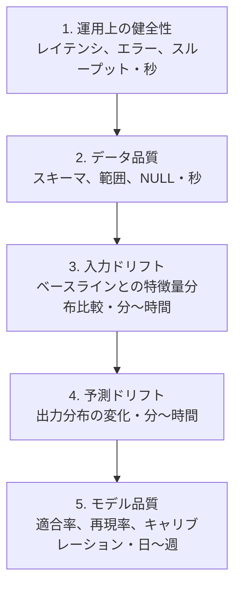
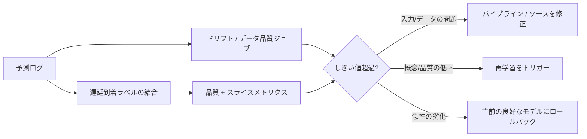

# モデル監視

## TL;DR

モデル監視とは、正しさが統計的であり、真の結果が遅れて届くか決して届かないシステムに対する観測可能性です。エラーを投げて壊れる通常のサービスとは異なり、劣化したモデルは*静かに*壊れます。すべてのHTTPレスポンスが200のまま、自信に満ちた整形済みの誤った答えを返します。監視の仕事は、統計的な劣化がビジネス上の障害になる前に観測可能にすることです。唯一完全に真実なシグナル、すなわち実際のモデル品質は、予測から数時間、数日、数週間遅れて届くラベルに依存するため、監視は*プロキシ指標の階層*として構成されます。各層は下の層より安価で速いが弱く、運用上の健全性からデータ品質、入力ドリフト、予測ドリフト、そして最後に測定された品質へと続きます。システムの価値はダッシュボードではなく、プロキシシグナルをロールバック、再学習、調査へと変換するアクション経路にあります。

> これはインフラ観測可能性に対するモデル品質側の補完です。[メトリクスと監視](../11-observability/02-metrics-monitoring.md)および[アラート](../11-observability/04-alerting.md)と組み合わせ、劣化バジェットを[SLOとエラーバジェット](../11-observability/05-slos-error-budgets.md)として表現し、アクション経路を[インシデント管理](../11-observability/07-incident-management.md)に接続してください。LLM出力品質に特化した内容は[LLM評価](../17-llm-systems/10-llm-evaluation.md)を参照してください。

---

## 定義となる問題: モデルは静かに壊れる

通常のソフトウェア観測可能性は、心地よい前提に依存しています。システムが間違っているとき、それは*そう告げる*傾向がある、という前提です。例外を投げ、500を返し、レイテンシバジェットを超過し、ログをスタックトレースで埋め尽くします。障害のシグナルは障害そのものと相関しており、だからこそサービスはエラー率を監視することで監視できます。

機械学習システムはこの前提を根本から覆します。静かに劣化したモデルは例外を投げません。整形済みのリクエストを受け取り、いつもと同じ行列積を実行し、レイテンシバジェット内で構文的に完璧な予測を返します。すべての運用メトリクスは緑です。唯一おかしいのは、その予測が*以前より悪くなっている*ことだけです。不正検知モデルがあるクラスの攻撃を見逃すようになり、推薦モデルが低品質なアイテムを上位にランクするようになり、信用モデルがあるセグメントを体系的に誤って価格付けするようになります。この障害は、サービスが稼働しているかだけを監視するモニターには見えません。

これが他のすべてを組織化するエンジニアリング上の含意です。**監視は、統計的な劣化を観測可能にするために存在する。なぜならシステムはそれを告知しないからだ。** モデルの正しさは、入力と出力の*分布*、そしてそれらの間の*関係*に宿っており、単一のレスポンスには宿りません。したがってモニターは時間にわたる分布と関係を監視しなければならず、これはエラーを数えることとは根本的に異なる規律です。最も難しいのは統計量を計算することではなく、最も欲しい統計量、すなわち「モデルはまだ正しいか?」が、通常はまだ計算できないものだということです。

---

## 真の結果の遅延問題

モデル品質をリアルタイムで測定できない理由は、真の結果が遅れて届くからです。予測は時刻Tに行われますが、それを裏付けたり覆したりする結果はずっと後に実現します。そしてこのギャップが、監視に見えるものと見えないものを定義します。

その幅を考えてみてください。クリックスルーモデルは数秒以内に自分が正しかったかを学習します。ユーザーがクリックするかしないかです。取引を承認した不正検知モデルは、30日から90日後にチャージバックが計上されるまで、誤りだったことを学習できないかもしれません。信用審査モデルは、ローンがデフォルトするまで数か月から数年待つかもしれません。長期的な継続率を最適化するコンテンツ推薦モデルは、きれいなラベルを*まったく*得られず、ノイズの多いプロキシ指標しか得られないかもしれません。いずれの場合も予測はただちに実行可能ですが、それを採点する真実はそうではありません。

エンジニアリング上の帰結は深刻です。**まだ手元にない精度に対してアラートを出すことはできない。** 不正検知モデルが今日劣化し、それを明らかにするラベルが60日後に届くなら、測定された適合率に対してアラートを出すことは、2か月と数百万ドルの損失の後に問題を発見することを意味します。真の結果の品質だけに依存する監視システムは、ラベル遅延のあるあらゆるドメインにおいて、保険金請求を待つことで火災を検知するシステムです。

これがモデル監視の中心的なアーキテクチャ上の手を強制します。すなわち、まだ測定できない品質の早期警告の代理として、**ただちに利用可能なプロキシシグナル**に依存することです。予測の*入力*は今利用可能です。予測の*出力分布*は今利用可能です。データ品質は今利用可能です。これらのどれも、モデルが間違っていることを直接告げるわけではありません。しかし各々は将来の品質と相関しており、各々は数週間ではなく数秒で発火できます。監視とは、確実性を犠牲にして可能な限り早期の警告を与える梯子へと、これらの代理を組み立てる技術です。

---

## 監視階層: プロキシ指標の各層

モデル監視システムを考える最も有用な方法は、最も安価で速いものから最も真実で遅いものへと順序付けられた5つの層のスタックとして捉えることです。各上位層は、その下の層に対する*より弱いが、より早い*プロキシ指標です。規律は上から下へと計装することです。上位層はほとんどコストがかからず最も一般的な障害を捉える一方、最下層は全体の真実を告げる唯一のものでありながら、最後に届くからです。

**第1層 — 運用上の健全性。** レイテンシ、エラー率、スループット、フォールバック率、特徴量参照ミス率。これは通常のサービス観測可能性であり、*自ら告知する*障害を捉えます。クラッシュした特徴量ストア、タイムアウトしたモデルサーバー、ロードできないデプロイなどです。予測品質については何も語りませんが、無料で即時であり、最初に配線すべき正しいものです。応答できないモデルは、正しく間違うこともできません。

**第2層 — サービング時のデータ品質。** *モデルが実際に受け取る特徴量*に対する、スキーマ適合性、値の範囲、NULL率、enumの妥当性。これは実際には最もレバレッジの高い層です。なぜなら突然のモデル劣化の最も一般的な原因はモデルそのものではなく、NULLを送り始めたり、単位を変えたり、結合を落としたりした上流のパイプラインだからです。静かに90%がNULLになった特徴量は、すべての分布が表面的にはもっともらしく見える間に、モデルの予測を静かに破壊します。サービング境界で入力を検証することで、これらがモデルに到達する前に捉えます。

**第3層 — 入力(特徴量)ドリフト。** 特徴量は個別には妥当ですが、その*分布*が、現在のモデルが学習したデータに対して変化しています。新しい市場が立ち上がり、マーケティングキャンペーンがトラフィック構成を変え、センサーが再較正されます。モデルは今や、学習中にほとんど見なかった入力空間の領域へと外挿しており、そこはモデルが静かにスキルを失う場所です。入力ドリフトはモデルが間違っていることを証明できませんが、最も間違いやすい条件を示します。

**第4層 — 予測(出力)ドリフト。** モデルの*出力*の分布が変化しました。平均スコアが上昇し、クラス構成が傾き、信頼度分布が狭まりました。これは測定された品質よりも厳密に安価なプロキシです。なぜならラベルを必要とせず、すでにログしている予測だけで済むからです。その曖昧さが弱点です。予測の変化は、世界が変わった(正当)、入力が変わった(ドリフト)、モデルが壊れた(劣化)のいずれをも意味し得て、出力ドリフト単独ではこれらを区別できません。

**第5層 — モデル品質。** 適合率、再現率、AUC、キャリブレーション、損失。ラベルが届き、それを得た予測に結合し直されたときに計算されます。これは真実を告げる唯一の層であり、常に最も遅いものです。その上にあるすべては、この層のレイテンシに対して時間を稼ぐために存在します。

この階層のエンジニアリング上の含意は予算配分のルールです。**上から下へと計装し、速いプロキシが遅い真実の永続的な代替になることを決して許さない。** 第1〜2層は、本番のあらゆるモデルに対して初日から存在すべきです。第3〜4層は、監視プラットフォームを正当化する早期警告システムです。第5層は、ついに届いたとき、プロキシが推測したすべてを立証するか弾劾するかのいずれかとなる真の結果です。

---

## ドリフトの分類体系と、それがなぜ対応を決定するか

「ドリフト」は緩く使われますが、その区別は重要です。なぜなら各種類のドリフトは異なるエンジニアリング上の対応を要求するからです。最もきれいな枠組みは、入力`X`とラベル`Y`の同時分布を分解し、どの部分が動いたかを問います。

**共変量ドリフト(特徴量ドリフト)** は`P(X)`の変化です。基礎となる入力からラベルへの関係`P(Y|X)`が保たれたまま、入力の分布が変化します。典型例は、ある地域で学習したモデルが今や別の地域からのトラフィックを処理する場合や、ユーザー行動の季節的な変化です。モデルは関係について*間違っている*わけではなく、証拠の薄い場所で動作しているのです。エンジニアリング上の含意は、共変量ドリフトはライブの特徴量分布を学習ベースラインと比較することで*ただちに、ラベルなしで*検知可能だということです。これが共変量ドリフトを早期警告の主力シグナルにしています。

**概念ドリフト** は`P(Y|X)`の変化です。入力が同一に見えても、モデルがエンコードしているまさにその関係が変化しています。不正がその典型例です。攻撃者がデプロイされたモデルに適応するため、先月「正当」を意味した同じ特徴量が、今月は「不正」を意味します。概念ドリフトは最も危険な種類です。なぜなら*入力監視には見えない*からです。特徴量は完全に安定して見えても、モデルが体系的に間違うようになり得ます。エンジニアリング上の含意は厳しいものです。概念ドリフトはラベルが届いて初めて確認でき、つまりラベル遅延のあるドメインでは最後に検知され、最も大きな損害をもたらします。予測ドリフトが唯一のラベル前のヒントであり、それも弱いものです。

**ラベルドリフト(事前確率シフト)** は`P(Y)`の変化です。ターゲットの基本率が動きました。スパムキャンペーンがスパムの割合を急増させ、経済の低迷がデフォルト率を上昇させます。ラベルドリフトは、古い基本率に較正されたあらゆるモデルやしきい値を破綻させ、もはや成り立たない事前分布に調整された意思決定しきい値と悪辣に相互作用します。これは予測ドリフトを通じて部分的に観測可能であり、ラベルが蓄積すれば完全に観測可能になります。

| ドリフトの種類 | 何が動いたか | ラベルなしで見えるか? | 典型的な対応 |
|---|---|---|---|
| 共変量 / 特徴量 | `P(X)` | はい — 特徴量をベースラインと比較 | トラフィック源を調査、新地域での再学習を検討 |
| 概念 | `P(Y\|X)` | いいえ — 弱い予測ドリフトのヒントのみ | 新しいラベルで再学習、ラベル収集を強化 |
| ラベル / 事前 | `P(Y)` | 予測ドリフト経由で部分的に | しきい値を再較正、再重み付け、再学習 |

実践的な教訓は、ドリフト検知は1つのモニターではなく*トリアージの語彙*だということです。アラートが発火したとき、最初に有用な問いは「どの分布が動いたか?」です。なぜなら答えが異なる修正を指し示すからです。共変量ドリフトは上流のデータとトラフィックを指し、概念ドリフトはラベルと再学習を指し、ラベルドリフトは再較正を指します。

---

## バージョン管理されたベースラインとの比較としてのドリフト検知

ドリフトモニターは、機構的には比較です。本番データの*現在のウィンドウ*と*参照ベースライン*の間の距離を測定し、距離が大きくなりすぎたときに警報を発します。ドリフト検知における微妙な障害のほぼすべては、統計量の選択の誤りではなく、ベースラインの選択の誤りに遡ります。

ベースラインは、**現在デプロイされているモデルが学習したときの**分布でなければなりません。先週の本番トラフィックでも、ローリングする直近のウィンドウでもありません。これがMLプラットフォームの他の部分との決定的な結びつきです。学習パイプラインは*その学習データの統計的指紋をバージョン管理されたアーティファクトとして永続化*しなければならず、監視システムは実際にトラフィックを処理しているモデルバージョンに属する指紋と比較しなければなりません。モデルが再学習され再デプロイされたら、ベースラインもそれに伴って前進しなければなりません。(これは[特徴量ストア](./02-feature-stores.md)が意味的変化を新しい特徴量名として扱い、[学習パイプライン](./05-training-pipelines.md)が不変のデータスナップショットをピン留めするのと同じバージョン管理の規律です。)本番を陳腐化したベースラインやバージョン管理されていないベースラインと比較するモニターは、この規律における最悪の障害、すなわち*ベースラインドリフト*を生み出します。これは参照自体が劣化をゆっくりと追跡するため、距離が決して大きくならず、モデルが腐っていく間に警報が決して発火しない状態です。

統計量の選択は二次的で十分に踏み固められています。ビニングされた分布にはpopulation stability indexとKL/Jensen-Shannonダイバージェンス、連続特徴量にはKolmogorov-Smirnov、enumには単純なカテゴリ比率の差分、次元ごとの比較が無意味な埋め込みには重心または距離の変化です。各々に既知の弱点があり、下の表はレシピではなくトリアージの補助です。ここでのシステム設計の要点は配管(ウィンドウ化、ベースライン化、アラート)であって、検定の選択ではありません。

| シグナル | 捉えるもの | 弱点 |
|---|---|---|
| NULL / default率 | 壊れたパイプライン、落ちた結合 | 意味的ドリフトには盲目 |
| PSI / JSダイバージェンス | 表形式の分布変化 | ビニングの選択に敏感 |
| KS検定 | 連続特徴量の変化 | 大量トラフィックでは些細な変化も「有意」になる |
| カテゴリ比率の差分 | enum / カテゴリの変化 | long tailがノイズになる |
| 埋め込み重心の変化 | テキスト/画像の表現ドリフト | 解釈や説明が難しい |
| 予測分布 | 出力挙動の変化 | 入力かモデルか、原因を言えない |

ツールはまさにこの比較パターンを中心に統合されてきました。オープンソースの**Evidently**とGoogleの**TensorFlow Data Validation**は参照スキーマに対する分布距離を計算し、**Arize**、**Fiddler**、**WhyLabs**などのマネージドプラットフォームは、ベースライン保存、ウィンドウ化された比較、スライス対応のアラートを製品化しています。これらは原理ではなくパッケージングが異なるだけです。原理は常に、*ベースラインをバージョン管理し、現在をウィンドウ化し、距離を測定し、アラートを実行可能にする*ことです。

---

## 一級のモニターとしての学習/推論スキュー

ドリフトは*時間*にわたる変化であり、スキューは*単一の瞬間*における、モデルが学習したものと推論で扱うものの間の不一致です。学習/推論スキューが独自のモニターに値するのは、それが一般的でありかつ壊滅的であり、実際には配管の障害であるのにモデルの障害を装うからです。

スキューは、*同じ瞬間の同じエンティティ*について、モデルが本番で受け取る特徴量が、学習中に受け取ったはずの特徴量と異なるときに生じます。よくある原因は分割実装です。学習特徴量はSQLのバッチジョブで計算され、推論特徴量はアプリケーションコード内の別のオンライン経路で計算され、両者が単位、デフォルト値、丸めルール、タイムゾーンでずれていきます。するとモデルは実際には見たことのない入力について推論するよう求められ、オフライン評価が優秀に見えたにもかかわらず本番品質が崩壊します。

最も強力な検知は直接的です。**意思決定時に提供された正確な特徴量ベクトルをログし、提供されたベクトルのサンプルを、同じエンティティについて学習経路が生成したであろう値と比較する。** いずれかの特徴量で非ゼロのスキュー率は欠陥であり、議論の余地はありません。これが、予測ログが監視システム全体の屋台骨である理由です。それは、後のあらゆる分析(ドリフト、スキュー、品質、スライス)がモデルが実際に見たものを再構成できるようにする結合キーです。手頃に実現できる場合のアーキテクチャ上の解毒剤は、学習特徴量と推論特徴量を*単一の共有定義*から計算し、スキューを構造的に不可能にすることです。モニターは、その理想にまだ到達していないケースを捉えるために存在します。

---

## 統計的シグナルへのアラートがなぜ難しいか

運用上のアラートは簡単です。エラー率が1%を超えたら誰かをページする。統計的アラートは、監視システムが使われるか無視されるかを決定する形で、より難しいものであり、その難しさはツールの欠落ではなく本質的なものです。

第一の問題は**ノイズ**です。分布距離はサンプリングのばらつきだけで絶えず揺らぎます。大量トラフィックのモデルでのKS検定は、予測に何の影響もないほど小さな差から「統計的に有意な」変化を報告します。なぜなら数百万のサンプルがあれば*すべて*が有意になるからです。統計的有意性はエンジニアリング上の有意性ではなく、すべての有意な変化でページするモニターは絶えずページします。

第二の問題は**季節性**です。実際の入力分布は、1日、1週間、休日カレンダーとともに呼吸します。午前3時のトラフィックは正午のトラフィックと本当に異なり、12月は7月と本当に異なります。素朴なモニターはこれらの正当なリズムをドリフトと読み、定期的に狼少年となり、オンコール担当者にそれを無視するよう訓練します。

第三の問題は**アラート疲れ**であり、これは最初の2つの帰結であり、システム全体の死です。1日に十数件の低信頼度アラートを発火するドリフトダッシュボードは、誰も読まないダッシュボードであり、無視されるモニターはモニターがないことよりも悪いです。なぜならカバレッジの幻想を生み出したからです。

エンジニアリング上の対応は、アラートを*単に真実であるだけでなく実行可能*にすることです。3つの規律がほとんどの仕事をします。第一に、**深刻度を統計ではなく影響に結びつける**。シグナルが有意であり*かつ*もっともらしく重大な結果をもたらす場合にのみページし、それ以外はすべてページャーではなくレビューキューにルーティングします。第二に、**SLOの実践からバーンレートアラートを借用する**([SLOとエラーバジェット](../11-observability/05-slos-error-budgets.md))。バジェットに対する劣化の*速度と持続性*にアラートを出すことで、短い瞬間的な変動は許容され、持続的な低下は速やかにページします。第三に、**季節的なベースラインと比較する**。平坦な参照ではなく先週同時刻と比較することで、モニターが日次のリズムを問題と取り違えるのをやめさせます。下の表は深刻度モデルの素描です。組織化の考え方は、ほとんどの統計的シグナルは*情報提供*すべきであり、ページすべきはわずかだということです。

| シグナル | ページするか? | 対応 |
|---|---|---|
| サービングエラー率が高い | はい | 可用性を復旧 |
| 重要特徴量の鮮度SLO違反 | はい | フェイルオーバーまたはモデルを無効化 |
| 予測分布の急激な変化 | 通常はいいえ | 影響に紐づかない限り営業時間内に調査 |
| ガードレールを下回る持続的な品質指標 | 場合による | ロールバックまたはトラフィック削減 |
| カナリーでのビジネスKPIの悪化 | 重要フローでははい | ロールアウトを停止 |

---

## スライスベースの監視: 集計は劣化を隠す

集計メトリクスは平均であり、平均はまさに最も重要な障害を覆い隠します。モデルは全体の適合率を平坦に保ちながら、特定のセグメント、すなわち国、端末タイプ、言語、テナント、新規ユーザーコホートがひどく劣化し得ます。なぜなら健全な多数派が苦しむ少数派を覆い隠すからです。これは運用上の危険としてのシンプソンのパラドックスです。トップラインの数字が「問題なし」と言う一方で、システムは最も失うわけにいかないユーザーを能動的に失敗させています。

エンジニアリング上の含意は、監視を**劣化が起こりやすくかつコストが高い次元に沿ってスライス**しなければならず、それらのスライスはインシデント後に発見するのではなく意図的に選ばれなければならないということです。標準的な切り口は、地理、端末とプラットフォーム、言語、顧客テナント、トラフィック源、そして法的・倫理的に適切な場合は保護対象クラスです。なぜなら保護対象セグメントで劣化するモデルは単なる品質バグではなく、公平性とコンプライアンスの障害だからです。スライス監視は集計監視よりも高価です。各スライスは安定したメトリクスを計算するのに十分なトラフィックを必要とし、あらゆる次元を素朴にスライスすると組み合わせ的に爆発します。規律は、実際のリスクを持つスライスを事前登録し、スライスごとのガードレールを設定し、セグメントごとの劣化を発見する最も安価な場所はダッシュボードであり、最も高価な場所は規制当局からの書簡だと受け入れることです。

---

## フィードバックループ: 監視が再学習をトリガーする

監視はそれ自体が目的ではありません。成熟したMLプラットフォームでは、それはシステムの是正アクションの*トリガー*です。これの最も明確な形はトリガーされる再学習です。ドリフトまたは品質シグナルがしきい値を超えると、新しいデータでモデルの再学習を発火させ、検知と修復の間のループを閉じます。これはまさに[学習パイプライン](./05-training-pipelines.md)で説明されている*トリガーされる再学習*戦略です。カレンダーではなく観測された変化によって駆動される再学習です。

再学習自動化の議論から引き継がれる決定的な規律は、**ループはそのセーフティネットが信頼できる程度にのみ自動化されるべきだ**ということです。監視シグナルを監督なしの再学習・デプロイループに直接配線することは、ノイズの多いアラートや破損したデータパーティションを、速く自動化された本番インシデントへと変換するメカニズムです。トリガーの強さは、その下流にある検証、カナリー、ロールバックの仕組みの成熟度に見合うべきです。ほとんどのシステムにとって正しい配線は、監視が検知し、人間が確認し、パイプラインが昇格ゲートの下で再学習し、新しいモデルが劣化した場合は自動ロールバックが待機している、というものです。監視は、そのシグナルがクリーンでありロールバックが速いことを示した後にのみ、完全自動化されたアクションをトリガーする権利を得ます。

---

## 戒めの事例: Zillow Offers

監視されないモデル劣化がビジネスの現実と出会った最も鮮烈な例は、**2021年11月**に閉鎖されたZillowのiBuying事業、Zillow Offersです。Zillowは価格設定モデルを使って住宅に自動の現金オファーを出し、それを購入し、マージンを乗せて転売しました。住宅市場のダイナミクスが変化したとき、モデルの価格予測は実現した販売価格から乖離していきました。これは共変量ドリフト(変化する市場)と概念ドリフト(入力から価格への関係の移動)の教科書的な衝突であり、真の結果のラベル、すなわち実際の転売価格が、購入決定の数か月後に届くドメインで起きました。

その結果、Zillowはいかなるフィードバックも是正できるよりも速く、体系的に住宅を高値で買い続けました。同社は在庫で約**3億400万ドル**を評価減し、同部門の縮小を発表し、約**2,000人の雇用、すなわち従業員の4分の1**を削減しました。エンジニアリング上の教訓は、モデルの作りが悪かったということではありません。シフトしたレジームで動作する自信に満ちたモデルが、長い真の結果の遅延と、すべての予測で実際の資金を使う自動化されたアクションループを伴うとき、それはまさにこの文書全体が扱う構成だということです。障害は唯一重要な意味で静かでした。すべての予測は整形された数字であり、その数字は十分に長い間、同じ方向に間違っていてビジネスを脅かしました。プロキシ監視、すなわちバージョン管理されたベースラインに対する入力ドリフトと予測ドリフトの監視と、それらが乖離したときに自動化されたアクションを絞ることは、まさにこの種の障害を、ラベルがそれを確認するために届く前に捉えるために存在します。

---

## 障害モード

モデル監視の特徴的な障害は組織を超えて繰り返され、それらに名前を付けることが、それらを防ぐことの大半を占めます。

**静かな劣化** は、この規律全体が対処する根本的な障害です。すべての運用メトリクスが緑のままモデルが悪化します。なぜなら劣化したモデルは自信に満ちた整形済みの誤った答えを返すからです。防御はプロキシ階層です。入力ドリフトと予測ドリフトは、運用監視には決してできないラベル前の警告を与えます。

**ラベル遅延マスキング** は静かな劣化の共犯です。真実の品質メトリクスが遅れるため、モデルは測定された精度がそれを反映する前に何週間も失敗し得ます。防御は、品質だけに決して依存しないことです。プロキシを早期警告システムとして扱い、測定された品質は最初の検知ではなく確認のために取っておきます。

**ベースラインドリフト** は自らを打ち負かすモニターです。参照分布がバージョン管理された学習指紋ではなくローリングする直近のウィンドウであるとき、ベースラインが劣化を追跡し、距離が決して大きくなりません。防御は、ベースラインをデプロイされたモデルにバージョン管理し、再学習時にのみ前進させることです。

**アラート疲れ** は社会的な障害モードです。ノイズが多く、季節的で、統計的に有意だが無意味なアラートが、オンコール担当者にダッシュボードを無視するよう訓練し、唯一の本物のアラートが洪水の中で見逃されます。防御は、影響ベースの深刻度、季節的ベースライン、バーンレートアラート、そして低信頼度シグナルをページャーではなくレビューキューにルーティングすることです。

**スライスマスキング(シンプソンのパラドックス)** は嘘をつく集計です。トップラインの品質が保たれる一方で、その下で重要なセグメントが失敗します。防御は、セグメントごとのガードレールを備えた事前登録されたスライス監視です。

**学習/推論スキュー** はモデルの障害を模倣する配管の障害です。提供された特徴量が学習された特徴量と異なるため、オフラインで完璧に評価されたモデルがオンラインで崩壊します。防御は、提供された特徴量ベクトルをログして学習経路と比較すること、あるいはより良くは両方を1つの共有定義から計算することです。

---

## 意思決定フレームワーク

監視予算が限られているとき、そして常に限られていますが、計装の順序はプロキシ階層に従うべきです。なぜならその順序がドルあたりに捉える障害数を最大化するからです。

**運用上の健全性とサービング時のデータ品質**から始めます。これらは安価で即時であり、突然の劣化の単一で最も一般的な原因、すなわち壊れた上流パイプラインを捉えます。まったく監視のないモデルは、いかなるドリフト統計の前にまず第1層と第2層を得るべきです。

次に**バージョン管理された学習ベースラインに対する予測ドリフトと入力ドリフトのモニター**を追加します。これらは監視プラットフォームを正当化する早期警告システムであり、ラベル遅延のあるドメインでラベルが届く前に利用可能な唯一のシグナルです。ベースラインのバージョン管理を正しく行わなければ、モニターは見せかけです。

特徴量が別々の学習経路と推論経路で計算されるようになったらすぐに**学習/推論スキュー検知**を追加します。なぜならスキューは一般的で壊滅的であり、他のあらゆるモニターには見えないからです。

実際のビジネスリスクまたは公平性リスクを持つセグメントに対して**スライスベースの品質監視**を追加し、追加コストを受け入れます。集計メトリクスはまさにこれらの劣化を隠すからです。

最後に、**再学習とロールバックへのループを閉じます**。ただし、検証、カナリー、ロールバックが安全に保てる程度にのみ自動化します。美しいダッシュボードを生み出すがアクション経路のない監視は、問題の簡単な半分を解決し、重要な半分をスキップしています。

これらに順番に答える監視システムは、重要な場所で観測可能であり、真の結果が遅い場所で早期に警告され、行動するよう配線されています。サービスが稼働しているかだけを監視するシステムは、まったく間違ったものを監視しています。

---

## 重要なポイント

1. 劣化したモデルは静かに失敗する。すべての運用メトリクスが緑のまま、自信に満ちた整形済みの誤った答えを返す。監視はその統計的劣化を観測可能にするために存在する。
2. 真の結果は遅れて届くか決して届かないため、監視は測定された精度を待つのではなく、ただちに利用可能なプロキシシグナルに頼らなければならない。
3. 監視を階層として構成する。運用上の健全性、データ品質、入力ドリフト、予測ドリフト、そしてモデル品質。各々が次に対するより安価で速く弱いプロキシである。上から下へと計装する。
4. ドリフトの分類体系が対応を決定する。共変量ドリフトは上流を指し、概念ドリフトは再学習を指しラベルなしには見えず、ラベルドリフトは再較正を指す。
5. ドリフト検知は*バージョン管理された学習ベースライン*との比較である。バージョン管理されていないかローリングするベースラインは静かに劣化を追跡し、決して発火しない。
6. 学習/推論スキューは一級のモニターである。提供された特徴量ベクトルをログして学習経路と比較するか、両方を1つの定義から計算する。
7. 統計的シグナルへのアラートは、ノイズ、季節性、疲れのために難しい。深刻度を影響に結びつけ、バーンレートと季節的ベースラインを使うことでアラートを実行可能にする。
8. 集計メトリクスはセグメントごとの劣化を隠す。実際のビジネスリスクと公平性リスクを持つスライスを事前登録して監視する。
9. 監視は再学習とロールバックのトリガーだが、ループはそのセーフティネットが信頼できる程度にのみ自動化されるべきである。
10. Zillow Offers(2021年11月、約3億400万ドルの評価減)は、自動化されラベル遅延のあるモデルがシフトしたレジームで静かに劣化することのコストを示す。これはまさにプロキシ監視が捉えるべきものである。

---

## 参考文献

1. [Hidden Technical Debt in Machine Learning Systems](https://proceedings.neurips.cc/paper_files/paper/2015/file/86df7dcfd896fcaf2674f757a2463eba-Paper.pdf) — Sculley et al., 2015
2. [Data Validation for Machine Learning](https://mlsys.org/Conferences/2019/doc/2019/167.pdf) — Breck et al., 2019
3. [TFX: A TensorFlow-Based Production-Scale Machine Learning Platform](https://dl.acm.org/doi/10.1145/3097983.3098021) — Baylor et al., 2017
4. [Rules of Machine Learning: Best Practices for ML Engineering](https://developers.google.com/machine-learning/guides/rules-of-ml) — Zinkevich
5. [Evidently: Open-Source ML Monitoring Documentation](https://docs.evidentlyai.com/)
6. [Arize AI: ML Observability Concepts](https://arize.com/ml-observability/)
7. [Zillow to wind down Zillow Offers (Q3 2021 shareholder letter)](https://www.zillowgroup.com/news/zillow-to-wind-down-zillow-offers-operations/) — November 2021
