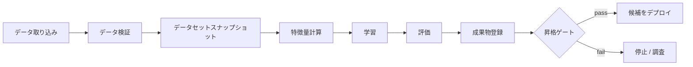
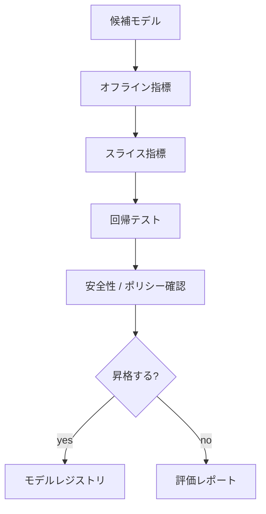

# 学習パイプライン

## TL;DR

学習パイプラインは、生データを再現可能なモデル成果物に変換します。本番パイプラインでは、入力のバージョン管理、データ検証、時点整合データセット作成、学習、評価、成果物登録、昇格ゲートが必要です。中心となる信頼性要件は再現性です。

---

## パイプライン構造



各エッジには、データセット版、コード版、特徴量定義、パラメータ、成果物ハッシュ、評価レポートを残します。

---

## パイプラインDAGの所有

| ステージ | 所有者 | 契約 |
|---|---|---|
| ソース取り込み | データ/プラットフォーム | 新鮮、重複なし、スキーマ版あり |
| ラベル生成 | プロダクト/ドメイン | ラベル定義と遅延期間 |
| 特徴量計算 | 特徴量所有者 | 時点整合な特徴量 |
| 学習 | MLチーム | 再現可能な成果物と指標 |
| 評価 | ML + プロダクト + リスク | 昇格判断とガードレール |
| レジストリ | プラットフォーム | 状態、リネージ、ロールバック先 |
| デプロイ | サービング/プラットフォーム | ランタイム互換性とロールアウト |

所有が曖昧なステージからMLパイプラインは劣化します。

---

## 再現性契約

モデルバージョンは次に答えられるべきです。

- どのコードコミットで学習したか。
- どのデータセットスナップショットとラベル期間を使ったか。
- どの特徴量定義とバックフィルを使ったか。
- どのハイパーパラメータを使ったか。
- どのコンテナイメージや環境で実行したか。
- どの評価指標とスライスが合格したか。
- 誰またはどの自動化が昇格を承認したか。

これに答えられないと、ロールバックと障害調査は推測になります。

---

## データ検証

悪いモデルが本番に届く前に、学習前に検証します。

| 検証 | 例 |
|---|---|
| スキーマ | 必須列がない |
| 型 | 数値特徴量に文字列が入る |
| 範囲 | 年齢が負、確率が1を超える |
| 分布 | 取引金額平均が5倍になる |
| 完全性 | ラベルの40%が欠落 |
| 一意性 | entity-eventペアが重複 |
| 鮮度 | 最新パーティションが古い |

検証ルールはパイプラインと一緒にバージョン管理します。

---

## 学習/評価分割戦略

| 分割 | 使う条件 | 障害モード |
|---|---|---|
| ランダム行分割 | IIDでエンティティ漏洩がない | 既知ユーザー/アイテムで過大評価 |
| 時間分割 | 未来予測が重要 | 季節性や一時イベントに敏感 |
| エンティティ分割 | 新規ユーザー/アイテムへ汎化したい | warm-start品質を過小評価 |
| グループ分割 | 世帯、チーム、加盟店、クリエイター | 正しいグループIDが必要 |
| 地域/市場分割 | 新地域展開 | 地域差と時間差が混ざる |

本番で未来を予測するなら、ランダム分割は楽観的になりがちです。

---

## データセットバージョン

学習データは巨大でGitに入れられませんが、参照はバージョン化できます。

```yaml
dataset:
  source: warehouse.ml.fraud_training_examples
  snapshot_date: 2026-06-10
  entity_time_column: decision_at
  label_window: 30d
  feature_view_versions:
    - account_risk:v12
    - device_velocity:v7
code:
  commit: 441c720
environment:
  image: registry.example.com/ml-train:2026-06-01
```

目的は、すべてをモデルレジストリに保存することではなく、決定的に再構築できることです。

---

## スナップショットとバックフィル


バックフィルは見かけ上の過去を書き換えます。過去の本番判断を調査するための当時値と、将来学習用の修正値を分けます。

---

## 評価ゲート



昇格ゲートには次を含めます。

- 主品質指標。
- ガードレール指標。
- スライス別チェック。
- 確率が重要な場合のキャリブレーション。
- サービング用のレイテンシとモデルサイズ。
- 特徴量互換性。
- 高リスク意思決定の人間承認。

---

## 実験追跡

| 成果物 | 理由 |
|---|---|
| コードコミット | Trainerを再構築する |
| データセットスナップショット | 例を再構築する |
| 特徴量版 | スコア差分を説明する |
| ハイパーパラメータ | 実験を公正に比較する |
| 指標とスライス | 昇格判断に使う |
| ランダムシード | 分散をデバッグする |
| ランタイムイメージ | 依存関係を再現する |
| コストと時間 | 学習経済性を管理する |

モデルレジストリは勝ったrunを指し、run記録はモデル廃止後も参照できるようにします。

---

## 再学習パターン

| パターン | 使う条件 | リスク |
|---|---|---|
| 手動再学習 | 低頻度変更または高リスク領域 | ドリフト対応が遅い |
| 定期再学習 | データ到着が予測可能 | 不要な再学習 |
| トリガー再学習 | ドリフトや品質低下を検知 | ノイズの多いトリガー |
| 継続学習 | 変化が速く自動化が成熟 | 悪いデータがすぐ伝播 |

多くのチームは、検証と監視が成熟するまでは、定期または人間承認つき再学習から始めるべきです。

---

## 障害モード

### 再現できないモデル

良い性能のモデルがあるが、誰も再構築できない状態です。

対策: レジストリ昇格前にリネージメタデータを必須にします。

### 悪いバックフィル

バックフィルが履歴特徴量を変え、将来の学習データを静かに変えます。

対策: 特徴量定義をバージョン化し、バックフィル範囲を記録し、検証を再実行します。

### 評価リーク

学習セットと評価セットが、時間、ユーザー、エンティティで正しく分離されていません。

対策: 実際の予測設定に合わせて分割し、リークしやすいJOINをレビューします。

---

## 運用メトリクス

| レイヤー | メトリクス |
|---|---|
| パイプライン | 成功率、時間、キュー待ち、リトライ数 |
| データ | 鮮度、検証失敗、除外行数 |
| 学習 | コスト、GPU使用率、収束、再現性失敗 |
| 評価 | 指標差分、スライス回帰、キャリブレーション |
| レジストリ | 昇格率、ロールバック率、モデル経過時間 |
| 配信 | データ到着からデプロイ可能モデルまでの時間 |

---

## 重要なポイント

1. 学習パイプラインはスケジュールされたノートブックではなく本番システムである。
2. 再現性はML信頼性の基盤。
3. データ検証は悪いモデルを学習前に止める。
4. 昇格ゲートは品質、安全性、レイテンシ、互換性を組み合わせる。
5. 再学習自動化は検証とロールバックが成熟してから進める。

---

## 参考文献

1. [TFX: A TensorFlow-Based Production-Scale Machine Learning Platform](https://dl.acm.org/doi/10.1145/3097983.3098021)
2. [Data Validation for Machine Learning](https://mlsys.org/Conferences/2019/doc/2019/167.pdf)
3. [MLflow Tracking](https://mlflow.org/docs/latest/ml/tracking/)
4. [Hidden Technical Debt in Machine Learning Systems](https://proceedings.neurips.cc/paper_files/paper/2015/file/86df7dcfd896fcaf2674f757a2463eba-Paper.pdf)
