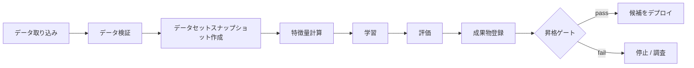

# 学習パイプライン

## TL;DR

学習パイプラインとは、生データを、デプロイできるほど信頼できるモデル成果物へと変換するシステムです。良いモデルを生み出すノートブックは学習パイプラインではありません。パイプラインとは、その結果を数か月後に、元の作者に一度も会ったことのない誰かが *再現でき、検証でき、ガバナンスでき、再実行できる* ようにするもの一切を指します。中心となる信頼性特性は再現性です。チームは、本番のどのモデルについても、どのデータ、コード、特徴量、パラメータ、環境がそれを生み出したのかを正確に説明できなければなりません。それ以外のもの — 検証、リネージ、昇格ゲート、スケジューリング — はすべて、システムの足元で世界が変化していくなかでもこの特性を守るために存在します。

---

## 学習パイプラインはスクリプトではなくシステムである

本番MLにおける決定的な誤りは、学習を「システム」ではなく「一つのステップ」として扱うことです。データサイエンティストがデータセットを取り出し、ノートブックでモデルを学習し、ファイルをエクスポートし、それをエンジニアリングに引き渡す。一度は動きます。問題は、そのモデルがいまや、メンテナンス担当も、来歴も、再構築する手段もない *依存物* になっていることです。

これが重要なのは、モデルが長い意思決定の連鎖の産物であり、そのほとんどが成果物そのものには見えないからです。同じモデルファイルが、二つの異なるデータセット、二つの異なる特徴量定義、あるいは二つの異なるライブラリバージョンから生み出され、本番でまったく異なる挙動を示すことがあります。コンパイル済みバイナリ — ソースの決定的な関数 — とは異なり、モデルはソース *に加えて* データ *に加えて* 環境 *に加えて* 数多くの暗黙的な選択の関数です。この連鎖のどこか一つでも記録されていなければ、モデルは再現不能であり、再現不能なモデルはロールバック不能、監査不能、デバッグ不能です。

これはSculleyらの *Hidden Technical Debt in Machine Learning Systems*（2015）が示した核心的洞察です。モデルコードは大きな図の中央にある小さな箱にすぎず、運用上のリスクのほとんどはその周囲の箱 — データ収集、特徴抽出、設定、データ検証、プロセス管理、サービングインフラ — に存在します。学習パイプラインとは、それら周囲の箱を、非公式なスクリプトから、バージョン管理され、所有され、監視されたコンポーネントへと変える規律です。

有用なテスト: もしモデルを構築した人が明日会社を去ったとして、システムに記録されている情報だけから、他の誰かがまったく同じモデルを再構築できるか。答えがノーなら、あなたが持っているのはパイプラインではなくノートブックです。

---

## なぜパイプラインは劣化するのか

学習パイプラインは特徴的な形で腐敗していきます。そして、どの単一のベストプラクティスよりも、その障害の軌跡を理解することのほうが有用です。

第一の劣化は **静かな入力ドリフト** です。パイプラインは動き続け、モデルを生み出し続けますが、上流のデータが意味を変えてしまいます。かつて「総売上」を意味していた列が、財務チームのリファクタの後に「純売上」を意味するようになる。パイプラインでは何も失敗しません — 型は依然として一致し、ジョブは成功します — が、変更後に学習されたすべてのモデルは微妙に誤ったデータから学習します。これがデータ検証をパイプラインの一部にしなければならない理由です（後付けではなく）。明示的にチェックしていない限り、パイプラインは意味の変化を検出できません。

第二の劣化は **リネージの腐敗** です。当初、チームは現在のモデルがどのデータセットとどのコミットから生まれたかを覚えています。数か月と数回の人事異動の後、その記憶は失われます。本番のモデルは、誰も再現方法を知らないために誰も触れようとしないブラックボックスになります。「既知の良好な」以前のバージョンも再構築できないため、ロールバックも不可能になります。

第三の劣化は **所有の拡散** です。学習パイプラインは多くのチームにまたがります — データプラットフォームが取り込みを所有し、ドメインチームがラベルを所有し、特徴量チームが変換を所有し、MLチームが学習を所有し、リスクチームが承認を所有します。いずれかの引き渡しが非公式であると、まさに最も脆弱な地点で、パイプラインは誰の責任でもなくなります。劣化したMLパイプラインの最も一般的な根本原因は技術的欠陥ではなく、契約が気づかれないまま侵食されることを許した曖昧な所有境界です。

学習パイプラインの規律とは、大部分が、これら三つの劣化を起こさせないことを拒む規律です。入力を検証し、リネージを記録し、すべてのステージに所有者を割り当てる。

---

## 学習パイプラインの解剖

本番パイプラインは冪等なステップの有向非巡回グラフであり、各ステップはバージョン管理された入力を消費し、バージョン管理された出力を生成します。その形状は、ほぼすべての成熟したMLプラットフォームで一貫しています。



これをフローチャートではなく *システム* にしているのは、すべてのエッジがメタデータ — データセット版、コード版、特徴量定義、パラメータ、成果物ハッシュ、評価レポート — を運び、すべてのノードが所有され、監視され、再実行可能であることです。学習パイプラインは構造的には末尾にモデルを置いた[バッチデータパイプライン](../13-data-pipelines/01-batch-processing.md)であり、あらゆる派生データシステムが必要とするのと同じ要求 — [冪等な](../01-foundations/08-idempotency.md)ステップ、スナップショットベースの再現性、[ワークフローオーケストレーション](../18-workflow-job-systems/05-dag-orchestration.md)の規律 — を継承します。

### ステージの所有

曖昧な所有はパイプラインが劣化する最も一般的な単一の理由であるため、所有テーブルは官僚的なオーバーヘッドではありません — それは静かな侵食を防ぐ契約です。

| ステージ | 所有者 | 保証する契約 |
|---|---|---|
| ソース取り込み | データ/プラットフォームチーム | 新鮮、重複排除済み、スキーマ版管理されたデータ |
| ラベル生成 | プロダクト/ドメインチーム | 安定したラベル定義と既知の遅延期間 |
| 特徴量計算 | 特徴量所有者 | 時点整合な特徴量値 |
| 学習 | MLチーム | 再現可能な成果物と指標 |
| 評価 | ML + プロダクト + リスク | ガードレールに対する昇格判断 |
| レジストリ | プラットフォームチーム | 成果物の状態、リネージ、ロールバック先 |
| デプロイ | サービング/プラットフォームチーム | ランタイム互換性とロールアウト制御 |

契約の列は所有者の列よりも重要です。契約が破られたとき — ラベルが約束された期間より遅れて到着する、特徴量が静かに意味を変える — パイプラインは境界で大きく失敗すべきであり、違反を吸収して破損したデータセットを下流に通してはなりません。

---

## 再現性の問題

再現性は基盤特性です。なぜなら、他のすべての信頼性保証がそれに依存するからです。再構築できないモデルにはロールバックできません。入力を再構築できない判断は監査できません。学習条件を再現できない回帰はデバッグできません。

モデルが再現可能であるのは、五つの異なる軸が固定されている場合に限られ、再現性の失敗のほとんどはそのうちの一つを忘れることから生じます。

**コード** は最も明白な軸であり、チームが最もうまく扱える軸です。なぜならGitがすでにそれを解決しているからです。モデルバージョンは、モデルクラスだけでなくパイプライン定義も含め、それを学習させた正確なコミットを記録しなければなりません。

**データ** はチームが最も下手に扱う軸です。なぜならデータは大きく、可変であり、バージョン管理の外に存在するからです。パイプラインは不変なスナップショット — 特定のパーティション、特定のタイムスタンプ、特定のラベルウィンドウ — を固定し、正確な学習セットを再構築できるようにしなければなりません。「先月のデータで学習した」は再現可能ではありません。「`2026-06-10T00:00:00Z` 時点のスナップショットを、30日のラベルウィンドウで学習した」は再現可能です。

**特徴量** は微妙な軸です。特徴量定義はモデルコードとは独立して進化するからです。`account_risk` という名前の特徴量が、三つのバージョンにわたって三つの異なる意味を持つかもしれません。モデルは消費した特徴量 *ビューバージョン* を固定しなければならず、それらのバージョンの意味は不変でなければなりません。（これが、特徴量ストアが意味の変化をインプレース編集ではなく新しい特徴量名として扱う理由です — [特徴量ストア](./02-feature-stores.md)を参照。）

**パラメータ** にはハイパーパラメータとランダムシードが含まれます。シードがなければ、同一データで二度学習したモデルが異なることがあり、分散と本物の回帰を切り分けてデバッグすることが不可能になります。

**環境** は最も不可解なインシデントを生む軸です。なぜなら目に見えないからです。NumPyのアップグレードが浮動小数点の累積順序を変える。CUDAのバージョンがカーネルの挙動を変える。コンテナイメージが再ビルドされたために、昨日学習したモデルが今日は再現できない。パイプラインはコンテナイメージをタグではなく *ダイジェスト* で固定しなければなりません — `ml-train:latest` は再現性の敵です。

五つの軸すべての実用的な符号化が *再現性契約* です。これはすべての登録モデルに付随するメタデータ記録であり、「何がこれを生み出したか?」にプログラム的に答えます。真実の源はレジストリであり — Slackのスレッドでも、wikiでも、誰かの記憶でもありません。

```yaml
# 再現性契約: モデルを再構築するのに最低限必要なもの
model_version: fraud_classifier_v42
code:        { repo: org/ml-models, commit: 441c720, pipeline: pipelines/fraud/pipeline.py }
data:        { snapshot: "2026-06-10T00:00:00Z", label_window_days: 30, split: time_based }
features:    [ account_risk:v12, device_velocity:v7 ]
parameters:  { max_depth: 6, learning_rate: 0.05, seed: 42 }
environment: { image_digest: "sha256:9f86d08...", accelerator: A100-40GB }
```

これを機能させるルール: **完全な契約なしにいかなる成果物もレジストリに入れない。** 来歴のないモデルはリリース候補ではありません。それは負債です。

---

## 検証の問題: 悪いデータが悪いモデルになる前に捕まえる

データ問題を発見する最も高くつく方法は、破損データで学習したモデルが意思決定を始めて数週間後に、本番で発見することです。二番目に高くつくのは、4時間のGPU学習が完了した後です。最も安いのは、学習が始まる前です。データ検証は、検出をできる限り早く動かすために存在します。

データ障害のカテゴリはよく理解されています。**スキーマ障害** — 列が消える、型が変わる — は最も捕まえやすく、上流のリファクタの後に最も一般的です。**範囲障害** — 負の年齢、1を超える確率、100億ドルの取引金額 — はスキーマチェックが見逃す破損を捕まえます。**分布障害** はより微妙で、より危険です。スキーマは無傷で、値は範囲内ですが、データの *形* が変わっています。新しい市場が立ち上がった、ロギングのバグがイベント量を半分にした、上流のJOINが行を落とし始めた、といった理由で。**完全性障害** — 突然ラベルの40%が欠落 — は、まだラベルを持っているサブ集団へとモデルを静かにバイアスさせます。**一意性障害** — 重複したイベント — は、その重複が表すものの見かけ上の頻度を膨らませます。

より深い原則は、*型の互換性は意味の互換性を意味しない* ということです。`event_type` 列挙型に新しい値が加わること、あるいは `total_spend` が総額から純額に切り替わることは、あらゆる型チェックとあらゆるnullチェックを通過しながら、静かにモデルを汚染します。これが、成熟した検証が *ベースライン分布* — 現在の本番モデルが学習したデータの統計的指紋 — と比較し、すべての値が個別には有効であっても逸脱をフラグする理由です。GoogleのTensorFlow Data ValidationやGreat Expectationsのようなツールは、まさにこれらの分布的契約を明示的で、バージョン管理され、学習が一GPU時間を消費する前に強制されるものにするために存在します。

運用ルールは *速く失敗し、大きく失敗する* です。検証の失敗はパイプラインを停止し、データ所有者をページするべきであり、流れ去る警告をログするべきではありません。上流の列挙型の変更は、その下流のすべてのモデルに対する破壊的変更であり、検証スイートはその破壊的変更を安く捕まえられる唯一の場所です。

---

## リーケージの問題: 良いオフライン指標が嘘をつくとき

データリーケージは学習パイプラインで最も陰険な障害です。なぜなら、壊れたモデルを優秀に見せるからです。リーケージは、学習データが予測時には利用できない情報を含んでいるときに発生します。モデルはその情報を利用することを学習し、見事なオフライン指標を出し、そしてリークした信号が存在しない本番で崩壊します。

リーケージを排除するのがこれほど難しい理由は、完全に妥当に見えるJOINやタイムスタンプの中に隠れるからです。各取引を `account_status` テーブルにJOINする不正検知モデルを考えてみてください。もし `account_status` が不正が発見された *後で* 「closed_for_fraud」に更新されたなら、そのテーブルの現在の値で学習することはモデルに答えを教えていることになります。JOINは無害に見えます。リークは *時間の次元* にあり、「この値は意思決定の瞬間に知り得たか?」と問わない限り見えません。

これが、リーケージに対する中心的な防御が *時点整合性* である理由です。学習セットのすべての特徴量値は、テーブルが今日保持している値ではなく、予測タイムスタンプの時点で実際に知り得たものを反映していなければなりません。時点整合なデータセットを構築するには、混同しやすい三つのタイムスタンプを区別する必要があります — イベントが起きたとき（イベント時刻）、システムがそれを記録したとき（取り込み時刻）、その値がサービングで利用可能になったとき（可用時刻）。10:10にマテリアライズされた特徴量は、10:05に行われた意思決定には利用できず、それを使う学習JOINは未来をリークします。

分割戦略は第二のリーケージ防御であり、本番の問いを反映しなければなりません。モデルが未来を予測するなら、ランダムな行分割は不誠実です。火曜日で学習し月曜日でテストすることを許し、先見的知識を含むパターンを学習させてしまいます。時間ベースの分割 — 過去で学習し、ホールドアウトした未来のウィンドウで評価する — は、前向きな予測を行うあらゆるシステムにとって唯一の誠実な選択です。目標が *新しい* エンティティ（モデルが一度も見たことのないユーザー、加盟店、アイテム）への汎化である場合、エンティティ分割が必要であり、どのエンティティも学習とテストの両方に現れないことを保証します。さもなければモデルの見かけ上の能力は部分的に丸暗記です。

実用的な経験則が、リークの大部分を捕まえます。*AUCを0.98より上に押し上げる単一の特徴量は、無罪が証明されるまで有罪である。* 現実世界の予測は難しく、それを自明にする特徴量はほぼ常にリークです — 偽装してエンコードされたラベル、誤ってJOINされた未来の値、ターゲットの代理となる識別子。リーケージ検出のチェックリストは短いが妥協できません。意思決定後のデータを使う特徴量があってはならず、特徴量からラベルが導出可能であってはならず、エンティティ分割は互いに素でなければならず、疑わしく強力なすべての特徴量はタイムトラベルがないか監査されなければなりません。

これを誤ることのコストは単なる悪いモデルではありません。それは *あらゆるゲートを通過した* 悪いモデルです。なぜならゲートはリークした指標を測定していたからです。リーケージは昇格プロセス全体を内側から打ち負かします。だからこそ、他のどのデータ特性よりも精査に値します。

---

## 実行エンジン: パイプラインのシステム設計が宿る場所

パイプラインのDSL — TFX、Kubeflow Pipelines、Airflow、Metaflowのいずれであれ — は *何が* 実行されるべきかを記述します。実行エンジンは *どのように*、*いつ* 実際に実行されるかを決定し、ここにこそ真に興味深いシステム的問題 — キャッシング、リネージ、スケジューリング、障害復旧 — が宿ります。

アーキテクチャはコントロールプレーンとデータプレーンを分離します。コントロールプレーン — スケジューラ、ステップキャッシュ、成果物ストア、リネージストア — は何を実行するかを決定し、何が起きたかを記録します。データプレーン — 入力を読み、計算し、出力を書くワーカープール — が重労働を行います。この分離が重要なのは、二つのプレーンがまったく異なる信頼性要件を持つからです。コントロールプレーンは耐久性と一貫性を持たなければならず（リネージを失うのは破滅的です）、一方でデータプレーンは伸縮自在で安価でなければなりません（ワーカーは使い捨てです）。

### 主要な効率レバーとしてのキャッシング

成熟したパイプラインにおける最大の効率向上は、*すでに行われた作業を再計算しない* ことから来ます。特徴量計算ステップへの入力が変わっていなければ、特徴量を再計算する理由はありません。しかし「変わっていない」は見かけによらず難しい述語です。

正しい基盤は *コンテンツアドレッシング* です。ステップのキャッシュキーは、その入力の *内容*（パスではなく）のハッシュに、コード版、環境ダイジェスト、パラメータを加えたものです。同一のコンテンツキーを持つ二つの実行は同一の出力を生むことが保証されるため、二回目は一回目の結果を再利用できます。ここでの失敗は教訓的です。なぜならすべてが不完全なキーに起因するからです。ファイルの *パス* でキーを作ると、名前が変わっただけの同一ファイルは何も無効化しないのに再現性追跡を壊します。*コード版* を省くと、変更された変換関数が静かに古いキャッシュ結果を返します。*環境* を省くと、数値挙動を変えるNumPyアップグレードが古いキャッシュにマスクされます。そして「latest」データを読んだり壁時計を参照したりするステップは *根本的にキャッシュ不能* です。なぜならその出力が宣言された入力の純粋な関数ではないからです — 非決定性とキャッシングは相互排他的です。

### 信頼の基盤としてのリネージ

リネージストアは、他のすべての信頼性特性が依存する二つの問いに答えます。*来歴*: このモデルが与えられたとき、何がそれを生み出したか? *影響*: このデータセットにバグがあったとき、どのモデルを再学習しなければならないか? それは成果物とステップ実行のクエリ可能なDAGであり、各実行はその入力（コンテンツハッシュで）、出力、完全な実行コンテキストを記録します。

影響クエリは、チームが切実に必要になるまで投資を怠るものです。データエンジニアが、あるソーステーブルが一週間イベントを二重カウントしていたことを発見したとき、重要な唯一の問いは「どの本番モデルがそのウィンドウで学習したか?」です。前方リネージがなければ、答えは「わからない、すべて再学習しよう」となり、これは高価であると同時にシステムが監査不能であることの自白です。GoogleのML Metadataとあらゆる本格的なMLプラットフォームのリネージサブシステムは、このクエリを調査ではなくルックアップにするために存在します。

ストレージの選択はクエリパターンに従います。リレーショナルデータベースは適度な規模で来歴と影響をうまく扱い、ほとんどのプラットフォームが出発点とする場所です。グラフデータベースは、影響分析が数千のモデルにわたって多くのホップを辿らなければならないときにのみ価値が出てきます。追記専用ログは、アドホックなクエリが難しくなる代償と引き換えに監査グレードの不変性を与えます。正しい答えはほぼ常に「リレーショナルで始め、トラバーサルのレイテンシが痛むときにのみ移行する」です。

---

## 学習データI/O: ボトルネックはたいてい計算ではない

ディープラーニングパイプラインの経済を支配する直感に反する真実: GPUがボトルネックであることは稀です。データ配送がボトルネックです。A100はほとんどのストレージシステムが供給できるより速く学習サンプルを消費できるため、アクセラレータは次のバッチを待ってアイドル状態になります — 何もしないために割増の時間料金を払うのです。GPU使用率が70%を下回るとき、その原因はほぼ常にモデルではなくI/Oです。

これはパイプライン設計の大部分を *データ配送* 問題として再構成します。ストレージ形式が重要です。Parquetのような列指向形式は特徴量JOINや選択的読み取りに優れ、TFRecordやWebDatasetのような逐次形式は学習が要求するストリーミングの全走査読み取りに優れ、ウェアハウスから直接読むことはデータを新鮮に保ちますがウェアハウスをボトルネックと請求の源にします。シャーディングが重要です。データは並列ワーカーが互いに素に読めるチャンクに分割されなければならず、シャードサイズは本物のチューニングパラメータです — シャードが小さすぎるとメタデータのオーバーヘッドに溺れ、大きすぎると一つが完了する間に他のすべてのワーカーをアイドルさせるストラグラーを生みます。

決定的な技法は *プリフェッチによるI/Oと計算のオーバーラップ* です。GPUがバッチNを処理している間に、データローダはすでにバッチN+1からN+4を別のワーカースレッドで取得しているべきで、アクセラレータが決して待たないようにします。プリフェッチが不十分なとき、修正の梯子は安いものから高いものへと進みます。CPUが飽和するまでI/Oワーカーを追加し、各エポックがオブジェクトストレージを再読み込みしないようにローカルNVMeにシャードをキャッシュし、プリフェッチの深さを増やし、逐次形式に切り替え、最後にネットワークレイテンシを削るために計算をストレージと同じ場所に配置します。これらすべての根底にある原則は、あらゆるパイプラインを支配するものと同じです — *最も遅いステージがスループットを決める* のであり、学習においてそのステージはたいてい行列乗算をするものではなく、バイトを動かすものです。

---

## 分散学習: コストと協調の問題

分散学習は、機械学習の技法としてではなく、機械学習の制約を持った分散システムの問題として理解するのが最善です。学習が一つを超えるアクセラレータにまたがった瞬間、パイプラインは単一マシンの学習が決して直面しなかった協調、フォールトトレランス、通信オーバーヘッドの懸念を継承します。

トポロジは異なる制約に対応します。*データ並列* — すべてのワーカーがモデルの完全なコピーを保持し、異なるデータシャードを処理し、各ステップで勾配を同期する — は、モデルが一つのデバイスに収まるがデータセットが収まらないときのデフォルトです。その限界は通信です。ワーカー数が増えると、毎ステップ後の勾配のall-reduceがボトルネックになり、ある規模を超えるとGPUを追加することが学習を *遅く* します。*モデル並列* — モデル自体を複数のデバイスに分割する — は、モデルがどの単一デバイスにも大きすぎるときの答えで、デバイスが前のステージを待ってアイドルになる「パイプラインバブル」を代償とします。FSDPやZeROのような *シャード化アプローチ* は、モデルパラメータ、勾配、オプティマイザ状態をワーカー間で分割し、各々が必要とするものをオンデマンドで集めます。これが兆パラメータモデルが学習できる仕組みであり、トレードオフはより多くの通信とより難しいデバッグです。

これがモデルアーキテクチャの議論ではなくパイプラインの議論に属する理由は、分散学習が *運用上の* 要件を作り変えるからです。長いマルチデバイスジョブは何時間も何日も実行されるため、統計的に確実にハードウェア障害とスポットインスタンスのプリエンプションに遭遇します。中断から再開できない6時間のジョブは、期待値として、安価なプリエンプティブルハードウェアでは決して完了しません。これが *チェックポイント* を最適化ではなく正しさの要件にします。ジョブは十分な状態 — モデルの重み、オプティマイザ状態、ステップカウンタ — を定期的に永続化し、再起動されたジョブがゼロからではなく最後のチェックポイントから再開できるようにしなければなりません。経済的見返りは大きく、規律あるチェックポイントとともにプライマリワーカーをスポットインスタンスで実行すると、たまのプリエンプション復旧から数パーセントのオーバーヘッドを代償に、典型的には学習コストを半分から3分の2削減します。言い換えれば、分散学習は大部分が、高価なハードウェアを優雅かつ安価に故障させることの物語です。

この節は意図的に概観に留めています。その下にあるメカニクス — 集合通信のコスト、ZeRO/FSDPのシャーディングの数学、テンソル/パイプライン並列の合成、MFUの会計、クラスタスケールでの故障の数学 — は[分散学習の内部構造](./15-distributed-training-internals.md)で独立した章として扱います。

---

## リソース管理: マルチテナントクラスタ

学習プラットフォームは共有リソースであり、共有リソースはすべての共有リソースが故障するのと同じ形で故障します。あるテナントの貪欲さが他のテナントを飢えさせるのです。不正検知チーム、レコメンデーションチーム、そして実験者の群れにサービスを提供するGPUクラスタは、ML問題である前にスケジューリング問題です。

そのメカニズムはクラスタ管理の古典的なものを、GPUワークロードの特殊性に適応させたものです。チームごとの重みを持つ *フェアシェアスケジューリング* は、単一のチームがクラスタを独占するのを防ぎます。GPU時間に対する *クォータ* はバックプレッシャーを課し、予算を有界に保ちます。*プリエンプション* は高優先度の本番再学習ジョブが低優先度の実験を退去させることを可能にし — これは実験がチェックポイントして再開するからこそ安全です。本番プールと実験プールの間の *分離* は、研究者の暴走ジョブが本番学習を劣化させないようにします。

最も微妙な要件は *ギャングスケジューリング* であり、分散ジョブに固有です。4ワーカーの学習ジョブは4つのワーカーすべてが一緒に開始する必要があります。スケジューラが3つのGPUを与えて4つ目をジョブに待たせると、ジョブは3つのGPUを人質に取ったままハングします。そのようなジョブをいくつか積み重ねると、クラスタは100%の割り当てに達しながら有用な作業は0%になります — すべてのジョブが、誰も解放しないもう一つのワーカーを待っているのです。ギャングスケジューリングは割り当てをオールオアナッシングにすることでこれを解決します。分散ジョブはワーカーすべてを一度に得るか、まったく得ないかのいずれかであり、保持しているものを解放して別のジョブが進めるようにします。これはGoogleのBorgやVolcanoのようなKubernetesバッチスケジューラを駆動するのと同じ洞察です — 分割不能なジョブの部分的割り当ては、まったく割り当てないことより悪い、という洞察です。

---

## パイプライン信頼性: 部分的障害を生き延びる

学習パイプラインは途中で失敗します。ジョブが6時間中5時間目で死ぬ、ワーカーがプリエンプトされる、一時的なネットワークの瞬断がステップを殺す。パイプラインの仕事は、これらの部分的障害を破滅的ではなく回復可能にすることであり、その規律はあらゆる[耐久性のあるワークフローシステム](../18-workflow-job-systems/06-retry-idempotency-compensation.md)を支配するのと同じ冪等性と原子性の規律です。

基盤となる不変条件は、*ステップの出力は完全に存在するか完全に存在しないかであり、決して部分的ではない* ことです。出力先に直接書き込んで途中でクラッシュするステップは、破損した半端なファイルを残し、次の実行は混乱して失敗するか、さらに悪いことに、その部分的出力を完了したものと誤認してステップをスキップします。修正は *原子的コミット* です。ステップは一時的な場所に書き込み、成功時にのみ最終的な場所に原子的にリネームします。すると再起動されたパイプラインはすべてのステップで明確な二値状態 — 完了か未完了か — を見て、完了した作業を安全にスキップし、未完了の作業を再開できます。

すべての障害がリトライされるべきではなく、リトライ可能な障害とリトライ不能な障害を混同することはそれ自体がバグです。一時的なインフラ障害 — ネットワークタイムアウト、退去されたPod — は指数バックオフでリトライすべきです。スポットインスタンスのプリエンプションはチェックポイントから再開すべきです。しかし *決定的な* 障害 — スキーマの不一致、学習ロジックの例外 — は速く失敗して人間をページしなければなりません。なぜなら3回リトライしても時間を浪費し本当の欠陥を覆い隠すだけだからです。リトライポリシーは分類問題であり、分類を誤ることは明確なバグを断続的な謎に変えます。

障害をまたぐほど長いステップ — 学習そのもの、大規模な特徴量計算 — については、随時チェックポイントが同じ論理をステップの内側に拡張します。Nステップごとに進捗を永続化することで、失敗したジョブは最後のチェックポイントから再開し、実行全体ではなく最大でもNステップ分の作業を失います。チェックポイントはコミットポイントであり、チェックポイント間のすべてはシステムがやり直す覚悟のある作業です。

---

## 再学習: どれくらいの頻度で、どれくらい自動的に

いつ再学習するかを決めることは、スケジューリングの問いに偽装されたリスク管理の問いです。再学習が稀すぎると、変化する世界からモデルがドリフトします。再学習に熱心すぎると、変化していない世界を学び直すために金を使い、その間、悪いデータが静かに悪いモデルになるリスクにさらされます。

戦略は自動化とリスクの明確な進行を形成します。*手動再学習* は、すべてのリリースで人間がループに入るべき低変化または高ステークスのモデルに適します。*定期再学習* — 日次または週次 — は、予測可能なデータ到着を持つドメインに適し、一部の実行が意味のある変化のないデータで再学習することを受け入れます。*トリガー再学習* は、ドリフトや品質の指標が閾値を越えたときに発火し、カレンダーではなく変化に応答しますが、ノイズの多いトリガーを代償とします。*継続学習* は密なループで再学習と再デプロイを行い、それを取り巻く成熟した自動化を持つ高速ドメインにのみ属します。

決定的な規律は、自動化が信頼に *先行する* のではなく *従わなければならない* ことです。手動から継続再学習への進行は、できるだけ速く登るべき梯子ではありません。各段は悪いデータが本番に速く届く新しい経路を加えます。継続学習が安全なのは、数分以内に劣化を検出するリアルタイム監視、数分以内に復旧する自動ロールバック、そしてすべてのデプロイ成果物の完全なリネージの上にあるときだけです。検証、監視、ロールバックを持つ前に再学習を自動化したチームは、自己改善するシステムを構築したのではありません。次のデータバグをフルスピードで本番インシデントに増幅する機械を構築したのです。ほとんどのチームは人間承認つき昇格を伴う定期またはトリガー再学習にとどまるべきであり、それを正当化する安全網を実証することで、自動化のさらなる一歩一歩を獲得すべきです。

---

## 経済: 使う前に見積もる

学習コストは、月次のクラウド請求での驚きではなく、実行前にチームが予測する数字であるべきです。見積もりは複雑ではありませんが、それを明示することは行動を変えます。

単一アクセラレータのジョブでは、コストは単純に学習時間にアクセラレータの時間料金を掛け、付随する計算とストレージを加えたものです。1億行に対する勾配ブースティングモデルは、1つのA100で2時間、込み込みでおよそ10ドルで学習するかもしれません。分散ジョブはデバイス数で乗算します。4つのA100で6時間のツータワー検索モデルは100ドルに近くなります。チームを驚かせる費用は *ハイパーパラメータ探索* です。なぜなら基本コストをトライアル数で乗算するからです。50トライアルは、各々を完全な実行の40%に削る早期停止を使ったとしても、100ドルの学習を数千ドルの探索に変えます。年換算すると、日次の定期再学習は数千ドルですが、月次のハイパーパラメータ探索を加えると数字は一桁跳ね上がります。

コストを見積もることの運用上の見返りは、予算化だけではありません。それは *異常検出* です。コストがすべての実行でログされる指標であるとき、突然の増加は早期警告になります — データ量が予期せず増えた、探索空間が拡大した、設定がドリフトした、ジョブがスポットインスタンスの使用をやめた。コストは「このパイプラインについて何かが変わった」の代理であり、自身のコストを監視しないパイプラインは、まるごと一つのクラスの回帰に対して盲目です。

---

## 障害モード

学習パイプラインの特徴的な障害は組織を超えて再発し、それらに名前を付けることが防止の半分です。

**再現不能なモデル** はよく動くが再構築できない — コミットが失われ、スナップショットが期限切れになり、イメージがガベージコレクトされた。それは他のすべての障害を悪化させる障害です。なぜならロールバックや監査の能力を奪うからです。防御は昇格前の必須リネージです。契約なし、レジストリエントリなし。

**悪いバックフィル** は見かけ上の過去を書き換えます。履歴特徴量値への修正が将来の学習セットを静かに変え、モデルが「改善」します — しかしその改善はより良いモデルではなく、修正されたデータの産物です。防御は、特徴量定義をバージョン管理し、バックフィル範囲を記録し、サンプルで新旧の値を比較し、本番データをインプレースで決して上書きしないことです。

**評価リーケージ** は、あらゆるゲートを通過した悪いモデルです。なぜならゲートがリーケージで破損した指標を測定したからです。それは最も危険な障害です。なぜなら昇格プロセス全体がそれを認証したからです。防御は誠実な分割、時点整合な特徴量、そしてあらゆる良すぎる指標への容赦ない疑念です。

**悪いデータを増幅する自動化** は、時期尚早な継続学習の障害モードです。単一の破損パーティションが悪いモデルになり、悪いデプロイになる — すべて人間がループにいないまま。防御は検証ゲート、カナリアロールアウト、そして深刻な分布シフトに対する人間承認です。

**パイプラインドリフト** は最も静かな障害です。パイプラインは動き続けますが、依存関係がアップグレードされデフォルトが変わるにつれて、時間とともに微妙に異なる成果物を生み出します。何も壊れません。システムは単にかつてのシステムであることをやめます。防御はすべてを固定し、定期的な再現性監査を実行することです — 過去の成果物をランダムにそのリネージから再構築し、ビットが一致するか確認します。

---

## 意思決定フレームワーク

学習パイプラインを設計またはレビューするとき、少数の問いがシステムをスクリプトから分けます。

本番のすべてのモデルは、記録されたメタデータのみから再構築できるか? できないなら、パイプラインにはロールバックも監査もなく、それが最初に直すべきことです。

検証は学習の *前に* 実行され、型をチェックするだけでなくベースライン分布と比較しているか? していないなら、パイプラインは静かな劣化を引き起こす意味のドリフトを検出できません。

学習/テスト分割は本番の問いについて誠実か — 前向き予測には時間ベース、新エンティティ汎化にはエンティティベースか? そうでないなら、オフライン指標は楽観的なフィクションです。

すべてのステージは所有され、違反時に大きく失敗する契約を持っているか? そうでないなら、パイプラインは引き渡しの境界で劣化します。

自動化は、それを安全にする安全網 — 検証、監視、ロールバック — の成熟度に見合っているか? そうでないなら、パイプラインはデータバグから本番インシデントへの高速経路です。

これらにうまく答えるパイプラインは、再現可能で、検証され、所有され、回復可能です。そうでないパイプラインは、データが変わるのを待つモデルの形をした負債です。

---

## 重要なポイント

1. 学習パイプラインはモデルを再現可能、検証済み、所有済み、再実行可能にするシステムである — モデルを生み出すノートブックはパイプラインではない。
2. 再現性は基盤特性である。コード、データ、特徴量、パラメータ、環境を固定すること。すべてのロールバックと監査がそれに依存するからである。
3. 学習前に入力をベースライン分布と比較して検証すること。型互換なデータでも意味的に破損していることがあるからである。
4. リーケージは悪いモデルを優秀に見せ、あらゆる昇格ゲートを内側から打ち負かす障害である。時点整合性と誠実な分割が唯一の防御である。
5. 実行エンジン — キャッシング、リネージ、スケジューリング — こそパイプラインの真のシステム設計が宿る場所である。
6. 学習はたいてい計算律速の前にI/O律速である。モデルではなくデータ配送の経路がスループットを決める。
7. 分散学習はコストと協調の問題である。チェックポイントが安価で故障しやすいハードウェアを経済的に使えるものにする。
8. マルチテナントクラスタはフェアシェア、クォータ、プリエンプション、ギャングスケジューリングを必要とする。さもなければ一つのテナントが残りを飢えさせる。
9. ステップの出力は原子的でなければならない — 完全に存在するか完全に存在しないか — さもなければリトライがシステムを破損させる。
10. 再学習を自動化するのは、検証、監視、ロールバックが安全に保てる速さでのみにすること。

---

## 参考文献

1. [Hidden Technical Debt in Machine Learning Systems](https://proceedings.neurips.cc/paper_files/paper/2015/file/86df7dcfd896fcaf2674f757a2463eba-Paper.pdf) — Sculley et al., 2015
2. [TFX: A TensorFlow-Based Production-Scale Machine Learning Platform](https://dl.acm.org/doi/10.1145/3097983.3098021) — Baylor et al., 2017
3. [Data Validation for Machine Learning](https://mlsys.org/Conferences/2019/doc/2019/167.pdf) — Breck et al., 2019
4. [Rules of Machine Learning: Best Practices for ML Engineering](https://developers.google.com/machine-learning/guides/rules-of-ml) — Zinkevich
5. [ZeRO: Memory Optimizations Toward Training Trillion Parameter Models](https://arxiv.org/abs/1910.02054) — Rajbhandari et al., 2019
6. [Large-scale cluster management at Google with Borg](https://research.google/pubs/pub43438/) — Verma et al., 2015
7. [Metaflow: A Human-Centric Framework for Data Science](https://netflixtechblog.com/open-sourcing-metaflow-a-human-centric-framework-for-data-science-fa72e04a5d9) — Netflix, 2019
8. [ML Metadata: A Standard for ML Artifact Lineage](https://www.tensorflow.org/tfx/guide/mlmd)
9. [Kubeflow Pipelines v2 Documentation](https://www.kubeflow.org/docs/components/pipelines/v2/)
