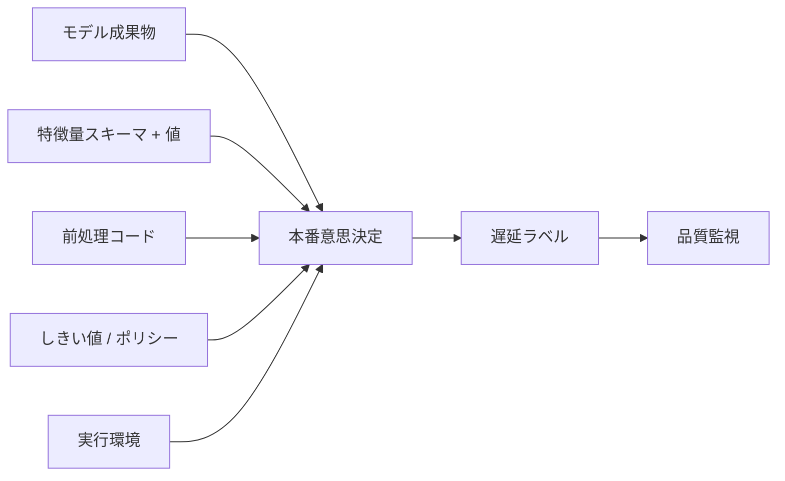
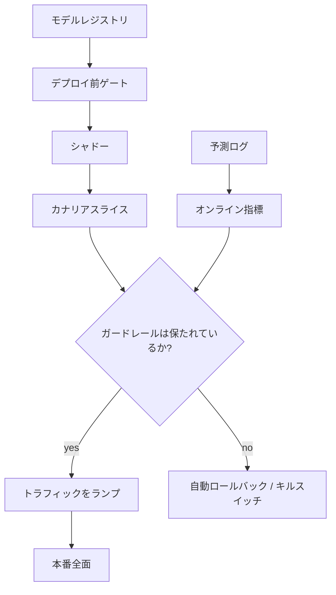

# モデルデプロイとロールアウト

## TL;DR

モデルのデプロイはコードのデプロイよりもリスクが高い。なぜならモデルをオフラインで完全にテストすることはできず、その本当の挙動はライブトラフィック上で、テストセットには決して含まれていなかったデータに対してのみ現れるからだ。その帰結として、テストスイートではなく*デプロイ戦略*こそが主要な安全機構となる。したがって段階的デリバリー（progressive delivery）——シャドー、次にカナリア、そして計測しながらのランプ、常に準備されたロールバックを伴う——は ML にとって交渉の余地がない。リリースする単位はモデルファイルではなく意思決定システムである。すなわち、特徴量契約、前処理、しきい値、そして環境に束縛された成果物であり、それらはアトミックに出荷され、まとめて可逆でなければならない。ロールバックできないモデルとは、そもそもロールフォワードすべきでなかったモデルである。

---

## テストできない成果物

通常のソフトウェアには安心できる性質がある。その正しい挙動は、原理的にはデプロイ前に知ることができる。入力を列挙し、アサーションを書き、コードがテストの言うとおりに動くという高い確信に到達できる。モデルはこの契約を破る。その挙動はデータから学習されるものであり、その挙動を正直にテストする唯一の方法は、それが実際に見ることになるライブの分布——定義上、サービングするまで手元にないもの——である。オフライン評価は*過去*の取り置きスライス上での性能を測る。本番は*現在*で動く。そこでは入力分布が変化し、新たなセグメントが出現し、上流の特徴量が意味を変え、敵対者が弱点を探っている。

このギャップは、ユニットテストを増やせば閉じられるようなテスト規律の問題ではない。これは構造的なものだ。モデルは優れた指標であらゆるオフラインゲートを通過しても、実トラフィックに出会った瞬間に破滅的に失敗しうる。なぜなら失敗は、評価されたデータと今スコアリングしているデータとの差分の中に存在するからだ。Microsoft の Tay チャットボットはその極端な版を示した。2016年3月にライブの Twitter トラフィックへリリースされ、敵対的なユーザーから学習し、24時間以内に有害な出力を生成して停止に追い込まれた。どんなオフラインスイートもこれを捕捉できなかった。なぜなら、その障害モード*こそ*がライブの相互作用だったからだ。

同じ問題のより巧妙な版が*フィードバックループ*である。デプロイされたモデルは、後で評価されることになるまさにそのデータを変えてしまう。あるアイテムを推す推薦器は、そのアイテムをよりクリックさせ、それがあたかも推薦が良かった証拠のように見える。取引をブロックする不正検知モデルは、それをラベル付けしたはずのチャージバックを防ぎ、自らのグラウンドトゥルースを消し去る。過去に凍結されたオフライン評価は、これらのループをまったく見ることができない——それらはモデルがライブトラフィックに作用し未来を形作って初めて存在する。Zillow の iBuying プログラムはビジネス規模での教訓だ。2021年11月、同社はその価格モデルが体系的に住宅に過剰支払いした後に Zillow Offers を停止し、5億ドルを超える在庫評価損を計上し、従業員のおよそ4分の1を削減した。それらのモデルは検証されていた。検証できなかったのは、今やそれらが動かしているライブ市場に対してだった。

エンジニアリング上の含意は本ドキュメント全体の主張そのものだ。**モデルをオフラインで保証できない以上、本番で、段階的に、実トラフィック上で、戻る速い経路を備えて保証しなければならない。** デプロイ戦略は、テストスイートが運べない安全保証を担う。これは通常の優先順位を逆転させる——アプリケーションコードではテストスイートが主要なゲートでロールアウトは便宜にすぎないが、モデルではロールアウト*こそ*がゲートである。

---

## モデルをデプロイすることは意思決定システムをデプロイすること

モデルデプロイが難しい第二の理由は、モデルファイルが出荷するものの中で最も小さな部分だということだ。サービング中のモデルは依存連鎖の末端にある。それは[モデルサービング](./03-model-serving.md)層の内部で動き、[特徴量ストア](./02-feature-stores.md)が計算した特徴量を消費し、特定の入力スキーマと前処理を期待し、スコアを発行し、そのスコアがしきい値またはポリシー層によってアクションに変換される。

この結合の最も危険な形が、**デプロイ時の学習/サービングスキュー（train/serve skew）**だ。モデルは学習中に特徴量の分布を学んだ。もしオンラインのサービング経路がその特徴量をわずかでも異なる方法で計算すれば——欠損値のデフォルトが異なる、時間ウィンドウが異なる、単位の不一致がある——モデルは決して学習されなかった入力を見ることになり、静かに劣化する。これは[学習パイプライン](./05-training-pipelines.md)を支配するのと同じ point-in-time 正確性の規律であり、今度はデプロイ境界で強制される。すなわち、特徴量は本番でも学習時とまったく同じ方法で計算されなければならず、デプロイがそれを保証しなければならない。

モデルとその依存先は一つのシステムであるため、それらは**アトミックに**デプロイされなければならない。サービング経路がまだ `v6` を提供しているのに特徴量 `device_velocity:v7` を期待する新モデルを出荷することは、劣化したデプロイではなく——壊れたデプロイである。リリース単位は、モデル成果物、特徴量スキーマ版、前処理コード、しきい値ポリシー、実行環境のタプルだ。下のフローチャートが理由を示す。これらの入力のすべてが本番の意思決定に流れ込み、どこかでの不一致が出力を破壊する。



学習パイプラインのものを反映した有用なテストがある。この成果物を昇格させるとき、プラットフォームは——仮定するのではなく——*検証*できるか。それが要求する特徴量スキーマが提供されているスキーマと一致すること、しきい値ポリシーがそのスコア分布に合致すること、実行イメージがそれをロードできることを。もしこれらのいずれかがチェックではなく希望であるなら、あなたは理解していない意思決定システムをデプロイしている。

---

## ロールアウトの梯子

モデルの段階的デリバリーは段（rung）の梯子であり、各段は異なる量のリスクを異なる質のフィードバックと交換する。技量とは、どの段がどの問いに答えるかを知り、それらを決して混同しないことだ。

**シャドー（ダークローンチ）**は新モデルを実本番トラフィック上で動かすが、その出力を破棄する——ユーザーは依然としてライブモデルの意思決定を見る。候補は同じリクエストをスコアリングし、プラットフォームが二つのストリームを比較する。シャドーは*ユーザーリスクがゼロ*である唯一の段であり、それゆえ、その失敗がユーザーや収益を損ないうるあらゆるモデルにとって正しい第一歩となる。それはオフラインテストが捕捉できない運用上の失敗を捕える。本番ランタイム下でロードできない成果物、オンラインで欠落している特徴量、予算を吹き飛ばすレイテンシ、現行モデルからの大きなスコア乖離。その盲点は根本的だ——候補の意思決定が決してユーザーに届かないため、シャドーは*ビジネスインパクト*を決して測れない。モデルは完璧にシャドーしてなお、より劣ったモデルでありうる。あなたはまだそれを知りようがない。シャドーにはコストもある。推論と特徴量取得の負荷を倍にするため、サンプリングしリソースを隔離しなければならず、さもなければそれ自体がインシデントになる（障害モードを参照）。

**カナリア**は主力だ。候補を実トラフィックの小さなスライス——しばしば1〜5パーセント——に提供し、ガードレール指標を監視し、ガードレールが保たれている間だけ段階的にスライスを拡大する。カナリアは候補の意思決定が実際にユーザーに影響を与える最初の段であり、それゆえライブの意思決定経路におけるエンドツーエンドの問題を検知できる最初の段である。ML におけるその中心的な限界は*遅延ラベル*だ。グラウンドトゥルース（チャージバック）が7〜30日後に届く不正検知モデルでは、2時間動くカナリアは運用上の安全性——レイテンシ、エラー、スコア分布、フォールバック率——を検証するが、意思決定の品質についてはほとんど何も語らない。カナリアは「ランプを続けるのに十分安全か」に答える。「これはより良いか」には答えない。

**A/B / オンライン実験**は、ユーザーの一部を現行モデルにコントロールとして留め置き、統計的厳密さで結果を比較することによって*因果的なビジネスインパクト*を測る段だ。これは「新モデルは実際にプロダクトにとってより良いか」に答える唯一の段である——そしてカナリアより遅く統計的に重いのは、まさに運用上の健全性チェックではなく実際の因果効果を測っているからだ。割当、サンプル比率の整合性、有意性の仕組みは[オンライン実験](./08-online-experiments.md)に属する。デプロイシステムの仕事は、候補が安全性の段を生き延びたら、それにきれいに引き渡すことだ。

**ブルーグリーン**は、前のバージョンを新しいものと並んで完全にプロビジョニングし温めたまま保ち、トラフィックがそれらの間で切り替えられる——そして決定的に、*戻す*ことも——瞬時にできるようにする。モデルにとってブルーグリーンは、主要なロールアウトパターンというより、他のパターンの下に欲しい性質だ。それはロールバックを再デプロイではなく1秒のメタデータ操作にするものである。

| 段 | 答える問い | ユーザーリスク | 盲点 |
|---|---|---|---|
| オフライン評価 | 過去のデータで良かったか | なし | ライブ分布やフィードバックループを見られない |
| シャドー | ライブトラフィックで正しく動くか | なし | ビジネスインパクトを測れない |
| カナリア | ライブの意思決定経路は安全か | 小さく有界 | 遅延ラベルが品質劣化を隠す |
| A/B実験 | 実際により良いか | 制御された | 遅く統計的に重い |
| ブルーグリーン | 瞬時に戻せるか | なし | 常時容量を倍にする |

この進行は意図的にリスク順に並んでいる。各段は前の段が与えられなかったフィードバックと引き換えに、もう少しだけ多くの現実とユーザー露出を許す。段を飛ばすこと——オフライン指標が良く見えたからといって全面デプロイへ直行すること——がビッグバン・アンチパターンであり、オフラインテストが構造的に提供できないまさにそのライブシグナルを捨て去る。

---

## ロールバックは基盤的な能力——そしてモデルではより難しい

あらゆる段階的ロールアウトは一つの前提に立っている。候補が誤動作したら、前の状態に素早く安全に戻れるという前提だ。それゆえロールバックはデプロイシステムの一機能ではなく、その基盤である。信頼できるロールバックがなければ、トラフィックをランプすることは賭けになる。なぜなら悪いカナリアへの唯一の対応が、ユーザーが被害を吸収する間の遅くパニック的な再デプロイだからだ。

ロールバックがコードよりモデルで難しいのは、決定的な一つの理由による。**ロールバックするとは、前の成果物が依然として再現可能でロード可能でなければならないということだ。** コードのロールバックは `git revert` と、CI がすでにビルドし保存した成果物の再デプロイだ。モデルのロールバックは、前のモデルがロード可能な成果物として依然として存在すること*かつ*それが依存するすべて——特徴量スキーマ版、前処理、実行イメージ、しきい値ポリシー——も依然として存在することを前提とする。これはロールバックを[学習パイプライン](./05-training-pipelines.md)由来の再現性契約に直接結びつける。**再構築または再ロードできないモデルにはロールバックできない。**

特徴的な失敗が*ロールバック健忘（rollback amnesia）*だ。`v42` の開発中に、チームは `v41` が依存していた特徴量を非推奨にしたか、`v41` のコンテナイメージをガベージコレクションしたか、特徴量スキーマを前方へ移行した。`v42` が悪化してオンコール担当が `v41` に手を伸ばすと、それはロードされない——誰も見ていない間にロールバック対象が腐っていたのだ。防御策は地味かつ絶対的だ。レジストリから前の成果物を決して削除しない、前の N バージョンを温かいスタンバイに保つ、そして*ロールバック経路をデプロイ前ゲートとして検証する*。午前3時にそれが決して可能でなかったと発見するのではなく。

高リスクシステムでは「旧サービスを再デプロイ」より「候補を無効化」を優先せよ。スプリットを100パーセント現行に戻せるトラフィックルーター、または既知の安全なフォールバックへ全トラフィックを送るキルスイッチは、ビルドも再起動もデータ移行もなく数秒で復旧する。最速のロールバックはコードに一切触れないものだ。

```text
Rollback by registry (preferred):  registry.set_active("fraud_model", "v41")   # no deploy
Rollback by kill switch (fastest):  config.set("kill_switch.fraud_model", true)  # < 1s to fallback
```

しかし、まったくロールバックできない意思決定もある。正当な支払いをブロックした、ユーザーを BAN した、コンテンツを削除した、在庫を再価格付けしたモデルは*不可逆なアクション*を生み出しており、モデルを戻しても害は戻らない。アーキテクチャ上の答えは、不可逆なアクションを可逆な第一歩の背後に保つことだ。新モデルには*決定*を許す前にまず*推薦*させる、その最も重大な出力を人間のレビューキューにルーティングする、そしてレビューが現実的でないケースのために補償アクションを設計する——un-undoable な副作用からあらゆるシステムを守るのと同じ[冪等性と補償](../01-foundations/08-idempotency.md)の規律である。これが段階的権限（staged authority）の原則だ——まず可逆なアクションで安全を証明することで、不可逆に行動する権利を獲得する。

---

## モデルとその契約をまとめてバージョン管理する

モデルは意思決定システムであるため、モデルファイルだけをバージョン管理しても不十分だ。プラットフォームはモデル*とその契約*を一つの単位としてバージョン管理しなければならない。それが消費する入力スキーマと特徴量版、約束する出力契約（スコア範囲、キャリブレーション、クラスラベル）、必要とする実行イメージ、依存するロールバック対象だ。これは学習を支配するのと同じリネージ規律のデプロイ時の顔である。真実の源は wiki や記憶ではなくレジストリだ。

最小限のリリース契約は依存関係を明示し、プラットフォームが本番で不一致を発見するのではなく昇格前に互換性を*検証*できるようにする。

```yaml
model: fraud_classifier
version: v42
feature_schema: { account_risk: v12, device_velocity: v7 }   # must match online serving
output_contract: { type: calibrated_probability, range: [0,1] }
threshold_policy: fraud_policy_v9                              # ships with the model
runtime_image: "sha256:9f86d08..."                            # by digest, not tag
rollback_target: v41                                          # must be loadable
owner: fraud-ml-oncall
```

ルールは学習のレジストリルールを反映する。**何に依存し何にフォールバックするかをプログラム的に説明できない限り、いかなる成果物も昇格可能ではない。** 最も見落とされるフィールドが `threshold_policy` だ。多くの本番モデルはアクションではなくスコアを発行する。ポリシー層がそのスコアを ブロック/レビュー/許可 にマッピングする。新モデルがよりよくキャリブレートされていてもスコア分布が異なれば、古いしきい値を再利用することは意思決定の*率*を静かに変える——本当により良いモデルが、古い `0.95` カットオフが今や異なる割合のトラフィックに対応するというだけでインシデントを引き起こしうる。しきい値はバージョン管理され、モデル*とともに*ロールアウトされ、生のスコア値ではなく意思決定率を一致させることで移行されなければならない。

---

## 監視に配線された自動ロールバックトリガー

手動ロールバックは必要だが、唯一の防衛線になるには遅すぎる。人間がダッシュボードを読む頃には、速く動く劣化はすでに被害を与え終わっている。成熟したデプロイシステムはロールバックトリガーを[モデル監視](./04-model-monitoring.md)に直接配線し、ガードレール違反がページの確認を待たずに自動で戻るようにする。

規律は、*どの*違反を単なるアラートではなく自動ロールバックにすべきかを選ぶことであり、その選択はラベル遅延に従う。**運用ガードレール**——エラー率、p99 レイテンシ、タイムアウト率、モデルロード失敗、特徴量ミス率、崩壊したまたはほぼ定数のスコア分布——は数秒から数分で観測可能で、*自動*ロールバックに配線して安全だ。なぜなら違反は曖昧さがなく、戻すことが正しい対応だからだ。**品質ガードレール**——成熟したラベル上の偽陽性率、キャリブレーションドリフト、収益や不正損失のようなビジネス指標——は遅れてノイジーに届くため、自動で戻すのではなく*ページして調査*すべきだ。さもないとノイジーな遅延指標がばたつくロールバックループを引き起こす。下のコントロールプレーンが、パーセンテージ、ガードレール評価、戻し経路を所有し、個々のモデルチームがこれらの仕組みをビジネスロジックに手書きすることが決してないようにする。



カナリアのサイズ決めは、遅延ラベル問題が最も強く噛みつくところだ。ベースライン率 p の指標でサイズ δ の劣化を検知するには、カナリアがそれを見る統計的検出力を持つ前に、おおよそ `(z_α + z_β)² · p(1−p) / δ²` のオーダーの意思決定が必要だ。2パーセントのベースライン偽陽性率を持つ不正検知モデルは、20パーセントの相対増加を検知するのにおよそ1万件の意思決定を必要とする——全トラフィックで約10時間、10パーセントのスライスでは100時間だ。いずれにせよ真のラベルは数週間かかるため、解決策はカナリアが品質を測っているふりをやめることだ。カナリアには速い代理指標上で*運用上の*安全性を保証させ、品質の測定はラベル成熟ウィンドウにわたって動く champion/challenger 比較または A/B テストに引き渡す。カナリアの代理指標だけで出荷することは、「問題なさそうに見えた」ローンチが結局ずっと間違っていたと判明する最も一般的な経路の一つだ。

---

## チャンピオン・チャレンジャーとトラフィック分割の仕組み

一度に複数のモデルをサービングすることが、梯子のあらゆる段を可能にする基盤だ。**チャンピオン**は現在本番をサービングしているモデルであり、一つ以上の**チャレンジャー**はそれに対して評価されている候補だ。前段にトラフィックルーターが座り、リクエストごとにどのモデルがスコアリングするかを決める——カナリアのためにチャレンジャーへ小さなスライスを送ったり、A/B テストのために決定論的なハッシュバケット化された割合を送ったりする。Uber の Michelangelo とほとんどの成熟した ML プラットフォームが champion/challenger を第一級のサービングプリミティブにしているのは、まさにそれが同じフリートに、何も再デプロイせずシャドー、カナリア、実験をさせるからだ。

重要な仕組みは安定した割当とクリーンな隔離だ。割当は**エンティティごとに決定論的**でなければならない——同じユーザーは一貫して同じモデルに当たらなければならない——さもなければ A/B 比較がバリアント間を行き来するユーザーによって破壊され、サンプル比率不一致が結果を静かに無効化する。シャドートラフィックは**隔離されたリソースプール**上で動かなければならない。シャドーモデルも依然として特徴量を取得し推論を実行するため、4-GPU のチャンピオン上の50パーセントシャドーは2台分の余分な GPU 負荷を呼び出し、特徴量ストアの接続プールを共有するとシャドーのレイテンシがチャンピオンの経路に漏れ込む。モデルコードではなくルーターが、トラフィックのパーセンテージ、セグメントルーティング、バージョン固定、戻しスイッチを所有する——これらの制御をコントロールプレーンに保つことが、ロールバックをコード変更ではなくメタデータ操作にする。

マルチモデルサービングはまた、単一モデルデプロイが回避する容量上の決定を強いる。ブルーグリーン式の即時ロールバックには、両バージョンが同時にロードされ温まっていなければならず、これはロールアウトの間メモリとアクセラレータのフットプリントを倍にする。大規模モデル——単一レプリカが GPU メモリの大半を占めうる——では、これが十分に高コストになるため、チームは時に即時ロールバックをより遅いものと交換し、前バージョンをコールドスタンバイに保ち数分のリロードを受け入れる。そのトレードオフは正当だが、意図的になされ、ロールバックプレイブックに書き込まれなければならない。インシデント中にオンコールが「ロールバック対象」のロードに10分かかると知るのではなく。

---

## 昇格ゲート

梯子の各段の間に昇格ゲートが座る。すなわち、候補が次のレベルの露出への権利を獲得したという、人または自動ポリシーによる明示的な決定だ。ゲートはデプロイが[ML リスクガバナンス](./09-ml-risk-governance.md)と出会うところだ。低リスクのランキングモデルは、オフライン指標とシャドー乖離がしきい値を通過したとき自動的に昇格してよいかもしれない。高リスクのモデル——信用判断、コンテンツモデレーション、安全や規制に触れるもの——は、進む前に指名された人間の承認者、記録された正当化、レビューされた評価レポートを要求すべきだ。これは通常のソフトウェアにおける[デプロイ戦略](../15-deployment/01-deployment-strategies.md)に使われる段階的権限を反映し、ランタイムのキルスイッチとして[フィーチャーフラグ](../15-deployment/02-feature-flags.md)を伴う。

デプロイ前ゲートは最も高くつく間違いを捕える最も安い場所であり、それゆえ単一のユーザーが露出される前に契約を機械的に検証すべきだ。成果物が宣言されたランタイム下でロードされること、要求される全特徴量が正しい型でオンラインに存在すること、スコア分布がほぼ定数に崩壊していないこと、重要なスライスがしきい値以下に劣化していないこと、フリートがサービング上限分の容量を持つこと、そして——チームが忘れるゲート——ロールバック対象が実際に存在しロードされること。これらのいずれかに失敗するモデルはリリース候補ではない。それはまだ爆発していない負債だ。

---

## 障害モード

モデルデプロイの繰り返される失敗は名付けられるほど具体的であり、それらを名付けることが防止のほとんどである。

**スキーマ互換だが意味的に誤り。** 特徴量が正しい型でオンラインに存在するため、あらゆる互換性チェックを通過するが、その*意味*が変わっている——`total_spend_30d` が総収益から純収益に切り替わった。モデルは今や、学習と静かに食い違う入力をスコアリングしており、何も大声で失敗しない。防御策は、所有者付きの意味論的特徴量契約、ベースライン分布に対する検証、そしてあらゆる意味変更をその場での編集ではなく新しい特徴量版として扱うことだ。

**沈黙のカナリア。** カナリアの短期代理指標は問題なく見え、トラフィックは100パーセントまでランプし、数週間後に成熟したラベルが、ずっと存在していた劣化を明かす。カナリアは運用上の健全性を測っていたのに、品質を測っているかのように読まれていた。防御策は、遅延ラベル領域での保守的なランプ、代理指標と遅延指標の別々の追跡、そしてラベル成熟より長く続く champion/challenger ウィンドウだ。

**シャドーが依存先を過負荷にする。** シャドートラフィックはユーザーに届かないが、依然として特徴量を取得し推論を実行する。サンプリングも隔離もされていないシャドーは、特徴量ストアと GPU の負荷を倍にし、それが守るはずだったまさにそのチャンピオンを劣化させうる。防御策は、シャドーを1〜5パーセントでサンプリングし、そのリソースプールを隔離することだ。

**ビッグバンデプロイ。** 新モデルを一度に全トラフィックへ押し出すことは、梯子のあらゆる段とそれが提供するライブシグナルを捨て去る。Knight Capital の2012年8月の崩壊——欠陥のある全面デプロイが休眠していた挙動を起動させた後、45分でおよそ4億4000万ドルを失った——は典型的なソフトウェアの教訓だ。モデルでの類例は、オフラインの数字が良く見えたからと候補を直接100パーセントへ出荷し、ライブ分布が同意しないと発見することだ。防御策は、段階的ロールアウトがオプションではなく必須であることだ。

**再現できないロールバック対象。** チームは `v41` にロールバックするが、それはロードされない。なぜなら必要とした特徴量が `v42` の開発中に非推奨にされたか、そのイメージがガベージコレクションされたからだ。戦略全体が依存していたロールバックが存在しない。防御策は、前の成果物を決して削除しない、前の N を温かいスタンバイに保つ、そしてロールバック経路をデプロイ前ゲートとして検証することだ。

**境界での特徴量/版の不一致。** モデルは特徴量スキーマ `v7` を期待し、サービング経路は `v6` を提供する。モデルとその契約がアトミックにバージョン管理されデプロイされなかったため、あらゆる個別コンポーネントが健全と報告する一方、システムは本番で壊れている。防御策は、モデル＋契約タプルのアトミックなデプロイと、ゲートでのプログラム的なスキーマ検証だ。

---

## 意思決定フレームワーク

梯子の正しい段は、チームがモデルについてどれだけ自信を感じるかではなく、リスクと可逆性の関数だ。

**低リスクで可逆**なモデル——最悪のケースがわずかに悪い順序付けにすぎないランキングの微調整——には、動くことを確認するためにシャドーし、次に自動運用ガードレールでカナリアし、次にランプする。A/B テストは改善を証明する必要がある場合にのみ実行する価値がある。**高リスクだが可逆**なモデル——不正スコアリング、価格付け——にはあらゆる段を延長せよ。より長いシャドー、検知する必要のある劣化に合わせてサイズ決めされた遅いカナリア、ラベル成熟ウィンドウにわたって開き続ける champion/challenger 比較、そして運用ガードレールに配線された自動ロールバック。アクションが**不可逆**なモデル——支払いのブロック、ユーザーの BAN、コンテンツの削除——には、梯子のどの段もそれ自体では不十分だ。なぜならモデルをロールバックしても害は元に戻らないからだ。モデルはまず人間のレビューキューの背後で recommend-only モードで動き、行動する権限を獲得しなければならず、キルスイッチと段階的権限を常設の制御として伴う。

三つの問いがロールアウト計画が健全かを決める。モデルと*すべての*依存先——特徴量、前処理、しきい値、ランタイム——はアトミックにデプロイしロールバックできるか。候補が誰かを傷つけられるようになる*前*にライブトラフィックへ露出する梯子の段があり、傷つけたとき戻すように配線されたガードレールがあるか。そしてロールバック対象は、希望ではなくゲートとして、今日ロード可能だと証明されているか。これらに答える計画が段階的デリバリーであり、答えない計画はカナリアの衣をまとったビッグバンデプロイだ。

---

## 重要なポイント

1. モデルをオフラインで完全にテストすることはできない——その本当の挙動はライブトラフィック上でのみ現れる——ので、テストスイートではなくデプロイ戦略が主要な安全機構だ。
2. 段階的デリバリーは ML にとって交渉の余地がない。シャドーは動くことを証明し、カナリアはライブ経路が安全であることを証明し、A/B はより良いことを証明し、ブルーグリーンは戻しを瞬時にする。「安全」を「より良い」と決して混同してはならない。
3. リリース単位は意思決定システム——モデル、特徴量スキーマ、前処理、しきい値、ランタイム——であり、アトミックにデプロイされなければならない。どこかでの不一致が出力を破壊する。
4. ロールバックは基盤的な能力であり、モデルではより難しい。なぜなら前の成果物が依然として再現可能でロード可能でなければならないからだ。再構築できないモデルにはロールバックできない。
5. 古い成果物を決して削除しない。前のバージョンを温かいスタンバイに保ち、ロールバック健忘を避けるためにロールバック経路をデプロイ前ゲートとして検証する。
6. 運用ガードレール（レイテンシ、エラー、スコア崩壊）を自動ロールバックに配線する。遅延品質指標は自動で戻すのではなくページして調査させる。
7. モデルをその契約としきい値ポリシーとともにバージョン管理し、しきい値は生のスコア値ではなく意思決定率を一致させて移行する。
8. シャドーとチャレンジャーのトラフィックも依然として特徴量と計算を消費する——サンプリングしリソースを隔離せよ、さもなければそれ自体がインシデントになる。
9. 昇格ゲートはデプロイがガバナンスと出会うところだ。要求される承認を、モデルのアクションのリスクと可逆性に合わせる。
10. 不可逆なアクションはモデルを戻してもロールバックできない。それらを可逆な第一歩、レビューキュー、段階的権限の背後に保つ。

---

## 参考文献

1. [Hidden Technical Debt in Machine Learning Systems](https://proceedings.neurips.cc/paper_files/paper/2015/file/86df7dcfd896fcaf2674f757a2463eba-Paper.pdf) — Sculley et al., 2015
2. [Meet Michelangelo: Uber's Machine Learning Platform](https://www.uber.com/blog/michelangelo-machine-learning-platform/) — Uber Engineering, 2017
3. [TensorFlow Serving: Flexible, High-Performance ML Serving](https://arxiv.org/abs/1712.06139) — Olston et al., 2017
4. [MLflow Model Registry](https://mlflow.org/docs/latest/ml/model-registry/)
5. [KServe Documentation](https://kserve.github.io/website/) — canary, traffic splitting, and rollout for model serving
6. [SEC Order: Knight Capital Americas LLC (Aug 1, 2012 deployment incident)](https://www.sec.gov/litigation/admin/2013/34-70694.pdf)
7. [The Practical Guide to Shadow Deployments and Canary Releases for ML](https://mlops.community/canary-deployments-for-machine-learning/)
