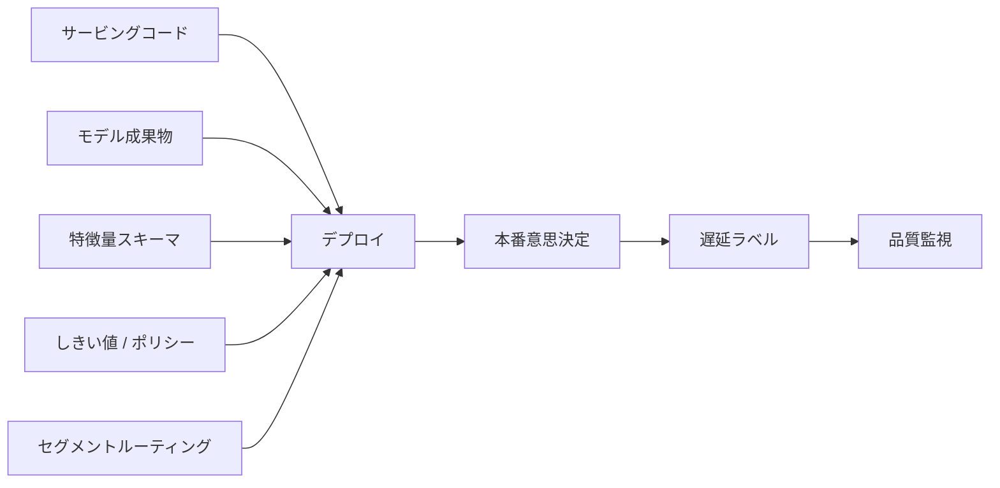
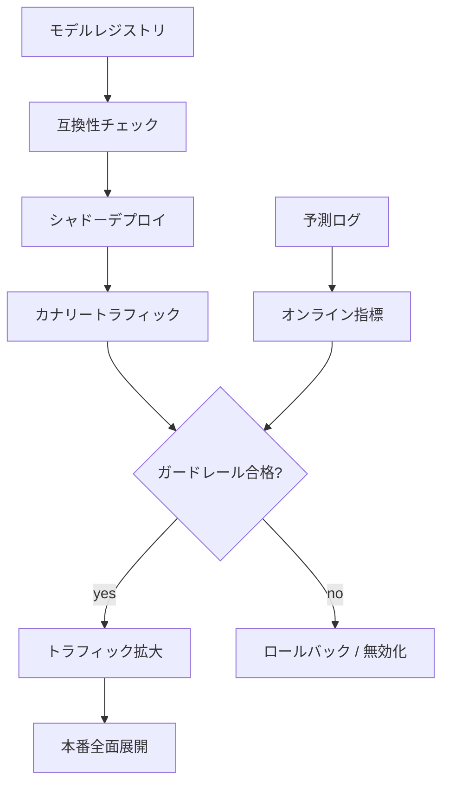

# モデルデプロイとロールアウト

## TL;DR

モデルデプロイは、モデルファイルを配置するだけではありません。特徴量契約、しきい値、キャリブレーション、セグメントルーティング、遅延ラベルに依存する意思決定ポリシーを変更します。安全なロールアウトには、成果物互換性チェック、シャドー実行、カナリー、ガードレール、ロールバック、デプロイ後の品質監視が必要です。

---

## なぜ通常のデプロイと違うのか

アプリケーションデプロイでは「新しいコードが動き、テストに通るか」が中心です。モデルデプロイではさらに次を確認します。

- サービング経路が提供する特徴量スキーマと一致するか。
- スコア分布は既存のしきい値や下流ポリシーと合うか。
- 重要スライスで安全に動くか。
- 遅延ラベルが来る前に品質低下を検知できるか。
- アプリケーションコードを戻さずに旧モデルへ戻せるか。



リリース単位はモデルファイルではなく、意思決定システム全体です。

---

## 成果物契約

デプロイ可能なモデルには、昇格前に検証できるメタデータを持たせます。

| 項目 | 目的 |
|---|---|
| モデル名とバージョン | 人間とプログラムの識別 |
| 学習データスナップショット | 再現性と監査 |
| 特徴量スキーマ版 | オンライン特徴量との互換性 |
| 出力契約 | スコア範囲、クラス、確率の意味 |
| 実行環境 | 依存関係とハードウェア互換 |
| 評価レポート | オフライン指標、スライス、ガードレール |
| サービング制約 | レイテンシ、メモリ、アクセラレータ |
| ロールバック先 | 既知の正常版 |
| 所有者 | 承認とオンコール責任 |

何から作られたか説明できない成果物を昇格させないことが基本です。

---

## ロールアウト制御



制御プレーンは、トラフィック比率、セグメント、モデル版固定、ロールバック、監査ログを管理します。個別チームがビジネスロジック内に手書きするべきではありません。

---

## ロールアウトパターン

| パターン | 検証するもの | 強み | 見えないもの |
|---|---|---|---|
| オフライン評価 | 履歴品質 | 安く速い | ライブのフィードバックループ |
| シャドー | 実トラフィックで動くか | ユーザー影響なし | 実意思決定の影響 |
| カナリー | 小量本番で安全か | ブラスト半径が小さい | 遅延ラベルによる品質劣化 |
| Champion/Challenger | 現行モデルとの比較 | 比較が明確 | 十分なトラフィックが必要 |
| A/Bテスト | 因果的に良いか | プロダクト成果を測れる | 遅く統計設計が必要 |
| キルスイッチ | 悪いモデルを止める | 被害を限定 | 安全なフォールバックが必要 |

カナリーは「続けて安全か」を答えます。A/Bテストは「良くなったか」を答えます。

---

## しきい値とポリシー

多くのモデルは最終アクションではなくスコアを返します。最終判断はポリシー層が行います。

```text
score >= 0.95  -> ブロック
score >= 0.70  -> 手動レビュー
otherwise      -> 許可
```

新モデルのスコア分布が変わると、古いしきい値を再利用するだけで事故になります。しきい値はモデルと同じくバージョン管理されたポリシー成果物です。

---

## ロールバック設計

| 依存関係 | ロールバック時の問い |
|---|---|
| モデル成果物 | 旧成果物はすぐ使えるか |
| 特徴量スキーマ | 新特徴量を旧モデルが安全に無視できるか |
| しきい値 | ポリシーを独立して戻せるか |
| 予測ログ | ラベル結合は継続できるか |
| バッチ出力 | 古い事前計算スコアを無効化できるか |
| 下流意思決定 | 不可逆アクションはレビューや補償で守られているか |

高リスクシステムでは「旧サービスを再デプロイ」より「候補モデルを無効化」を優先します。

---

## 障害モード

### スキーマ互換だが意味が違う

特徴量は存在し型も合うが意味が変わっています。例: `total_spend_30d` が総額から純額に変わる。

対策: 特徴量契約、所有者、意味論バージョン、分布検証、変更レビュー。

### 遅延ラベルでカナリーが良く見える

短期代理指標は問題ないが、数日後に真のラベルで劣化が判明します。

対策: 遅延ラベル領域ではランプを保守的にし、代理指標と真の指標を分けます。

### シャドーが依存先を過負荷にする

レスポンスには影響しなくても、特徴量取得と推論の負荷は発生します。

対策: サンプリング、リソース隔離、依存先負荷を計画に含める。

---

## 運用メトリクス

| 分類 | メトリクス |
|---|---|
| リリース | 昇格率、ロールバック率、ロールバック時間、失敗ゲート |
| 実行時 | p99、タイムアウト率、特徴量ミス率、ロード失敗 |
| トラフィック | 割当比率、サンプル比率不一致、セグメント網羅 |
| モデル挙動 | スコア分布、クラス比率、フォールバック率 |
| 品質 | 代理指標、遅延ラベル、スライス劣化、キャリブレーション |

---

## 重要なポイント

1. デプロイ対象はモデルファイルではなく意思決定システム。
2. シャドーは実行安全性、カナリーは継続安全性、実験は改善を検証する。
3. 特徴量スキーマ、しきい値、セグメントはモデルリリースの一部。
4. ロールバックはプラットフォーム操作であるべき。
5. 遅延ラベルがある領域では保守的なランプが必要。

---

## 参考文献

1. [Hidden Technical Debt in Machine Learning Systems](https://proceedings.neurips.cc/paper_files/paper/2015/file/86df7dcfd896fcaf2674f757a2463eba-Paper.pdf)
2. [TensorFlow Serving: Flexible, High-Performance ML Serving](https://arxiv.org/abs/1712.06139)
3. [MLflow Model Registry](https://mlflow.org/docs/latest/ml/model-registry/)
4. [KServe Documentation](https://kserve.github.io/website/)
