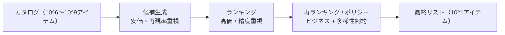

# 推薦システム

## TL;DR

推薦システムとは、数百万件のカタログから少数のアイテムを選び出し、数十ミリ秒で提示し、そしてユーザーが次に取った行動から学習するインフラです。難しいのはモデルではありません。難しいのは、レイテンシ予算を達成可能にする*ファネル*、システムが自己崩壊せずに改善し続けられるようにする*フィードバックループ*、そしてそのすべてを測定可能にする*ログの規律*です。システムとして見れば、推薦システムはデータ整合性の問題を内包したレイテンシ制約付きの多段検索パイプラインです。システムは自分が生成したデータで学習するため、そのデータをログに残し、探索し、バイアスを除去する過程の欠陥はすべて、次のモデルへと複利的に積み重なっていきます。

---

## ファネルこそがアーキテクチャである

推薦システムを決定づける唯一の制約は、カタログサイズとレイテンシ予算のギャップです。カタログには数百万のアイテムがあります。応答は数十ミリ秒で返さなければなりません。100万件のアイテムを1件ずつスコアリングするモデルでは、この予算を満たせません。したがってアーキテクチャ全体が*段階的な絞り込み*を中心に組み立てられます。安価な処理で数百万を数千へ、より高価な処理で数千を数百へ、そして最も高価な処理は、生き残った数百件のアイテムだけに触れます。

これは、スケールにおいてアイテム単位のコストが現実離れしている状況に直面するあらゆるシステムを支配する原理と同じです。高価な処理を速くするのではなく、はるかに少ないアイテムに対してのみ実行されるようにするのです。データベースはフルテーブルスキャンをB-tree探索へ変えるインデックスでこれを実現し、推薦システムはフルカタログスキャンを近似最近傍探索へ変える検索ステージでこれを実現します。ファネルが存在するのは、ステージ間のコスト非対称性が膨大だからです。検索はアイテムあたりマイクロ秒を費やすかもしれませんが、ランキングはミリ秒を費やします。そして精密なステージを賄う唯一の方法は、それに短いリストを渡すことです。

チームが過小評価しがちな帰結は、**各ステージは異なる目的を持っており、それらを混同するのは設計ミスである**ということです。検索は*再現率*を最適化します。良いアイテムを取りこぼしてはならず、後段のステージがフィルタするため凡庸なアイテムを含めることは許容します。ランキングは*精度*を最適化します。小さくすでにそれなりに良い集合を与えられ、できるだけ正確に並べ替えます。再ランキングは、スコアが無視する*制約*を最適化します。多様性、鮮度、ビジネスルール、公平性です。検索を精密にしようとするチームは、カタログ全体にわたってランキング品質の計算を支払い、レイテンシ予算を吹き飛ばします。検索の取りこぼしをランキングで直そうとするチームは、検索が表面化させられなかったアイテムを決して回復できません。ステージは意図的に専門化されているのです。

---

## 候補生成: マイクロ秒予算下での再現率

候補生成は1つの問いに答えます。*この数百万のアイテムのうち、スコアリングする価値があるのはどの数千件か?* そしてそれを概ね1ミリ秒で答えなければなりません。支配的なパターンは*埋め込み検索*です。ユーザーと各アイテムを共有空間内のベクトルとして表現し、ユーザーのベクトルに最も近いアイテムを検索します。これらのベクトルを生成するモデリング手法（two-towerネットワーク、行列分解、グラフ埋め込み）は交換可能です。重要な*システム*としての性質は、アイテムベクトルを事前計算してインデックス化できることであり、それによりサービング時の作業は単一のベクトル検索に削減されます。

この事前計算こそが検索を手頃にします。アイテム埋め込みはゆっくりとしか変化しないため、バッチジョブで計算してインデックスにロードします。ユーザー埋め込みはリクエストごとに1回計算します。すると検索は「このユーザーベクトルに最も近いアイテムベクトルを見つける」ことになり、決定的に重要なのは、その探索が*近似*であることです。数百万のベクトルに対する厳密な最近傍探索は遅すぎます。HNSWやIVF-PQのような近似最近傍（ANN）インデックスは、わずかで調整可能な量の再現率を犠牲にして、1〜2桁の速度向上と引き換えにします。エンジニアリング上の意思決定は明示的です。レイテンシ目標を達成するために、どれだけの再現率を失う覚悟があるか? 真の上位Kの95%を1msで返すANNインデックスは、100%を50msで返す厳密なインデックスよりもほぼ常に優れたシステムです。なぜなら、失われた5%の大部分は他の検索ソースによって再び表面化され、そのレイテンシ節約がファネルの残りを賄うからです。

成熟したシステムは単一のソースから検索しません。複数を*ブレンド*します。パーソナライズされた関連性のための埋め込みベースのソース、新規ユーザーが妥当なものを得られるための人気ソース、最近のアイテムが露出を得られるための鮮度ソース、「あなたのようなユーザーはこれにも反応した」というグラフソース。各ソースは異なる障害モードを持つ再現率戦略であり、それらをブレンドすることはヘッジになります。埋め込みソースはコールドユーザーで失敗し、人気ソースはパーソナライズに失敗しますが、その和集合は両者をカバーします。これは意図的に冗長な設計であり、単一のアクセスパスではすべてのクエリに対応できないため複数のインデックスを組み合わせるのと、推薦システムにおいて等価です。

---

## ランキング: 短いリストでの精度

検索がカタログを数百〜数千の候補に絞り込んだら、ランキングは高価であることを許容できます。短いリストの上で実行されるからです。この逆転こそがファネルの全要点です。アイテム数が桁違いに縮小したからこそ、アイテムあたりの予算が桁違いに増えたのです。ランキングは今や、ユーザーと各候補との間の豊富な交差特徴量を使えます。カタログ全体にわたって計算するには到底高価すぎた特徴量です。

ランキングのシステム設計上の本質はモデルアーキテクチャではなく、*特徴量ハイドレーション*です。候補をスコアリングするために、ランカーはユーザー、アイテム、そしてそれらの相互作用に関する特徴量を必要とし、それらの特徴量は異なるレイテンシを持つ異なるストアに存在します。それらを素朴に取得すると、すなわち候補ごと・特徴量ごとに1往復すると、数百の候補が数千の逐次的検索になり、レイテンシ予算を破壊します。対策は、あらゆるレイテンシ制約付きサービスを支配するのと同じバッチ処理・キャッシュの規律です。ユーザー特徴量をリクエストごとに1回（候補ごとではなく）取得し、すべてのアイテム特徴量の検索を単一のマルチゲットにバッチ化し、ホットなアイテム特徴量をメモリにキャッシュし、モデルの順伝播をバッチ全体に対して一度に計算します。ランカーの品質はモデルによって制約されますが、その*レイテンシ*は特徴量ハイドレーションがどれだけ規律正しいかによって制約され、ハイドレーションこそがランキングシステムが最も頻繁に予算を超過する場所です。

微妙ながら重要な点は、ランキングシステムがますます*複数の目的を同時に*最適化していることです。単に「ユーザーはクリックするか」だけでなく「深く関与するか、明日も満足しているか、これは長期的な継続を損なうか」です。これがモデリングだけでなくシステムの関心事である理由は、各目的が独自のログ済みシグナル、独自のラベル遅延ウィンドウ、そして最終スコアにおける独自の重みを必要とし、それらの重みは学習されるのではなく実験を通じて調整される*ポリシー*だからです。即時のクリックよりも長期的な満足度を重視するという決定は、サービング層にエンコードされたビジネス上の意思決定であり、それを損失関数に埋め込むのではなく明示的かつ調整可能に保つことこそが、チームが再学習せずにシステムの挙動を調整できるようにするものです。

---

## 再ランキング: ポリシーが明示的になる場所

ランカーは関連性順に並べられたリストを生成します。そのリストを直接出荷するのはほぼ常に間違いです。純粋な関連性は、即時の関連性を超えてビジネスとユーザーが気にかけるすべてを無視するからです。多様性、鮮度、公平性、重複排除、そしてハードルール。再ランキングは、それらの制約が明示的になるステージであり、コストが手頃な最終的な短いリストの上で動作します。

多様性は典型例であり、再ランキングがそれ自体で独立したステージである理由を明らかにします。純粋に関連性順に並べられたリストは単調になりがちです。ユーザーが一度クリックした同じアイテムの10種類のバリエーションが並ぶのは、それぞれが個別には高くスコアリングされるからです。しかし、ほぼ同一の10アイテムのリストは、わずかにスコアの低いアイテムの多様なリストよりもユーザーにとって悪く、アイテム単位の関連性スコアではそれを捉えられません。なぜなら、その悪さはどのアイテムの性質でもなく*集合*の性質だからです。再ランキングは集合を最適化します。行列式点過程、貪欲な多様性ペナルティ、あるいは明示的なカテゴリ枠を通じて、関連性と各アイテムが加える限界的な多様性とのバランスを取ります。そのメカニズムよりもアーキテクチャ上の要点が重要です。*集合レベルの目的には集合レベルのステージが必要であり*、そのステージは選ばれた少数を対象とするためアイテム単位のランキングの後に来なければなりません。

再ランキングはまた、ハードなビジネスルールが存在する場所でもあり、それらをモデルではなくここに置くのは意図的です。「在庫切れのアイテムは決して表示しない」「この規制上の制限を守る」「このユーザーのブロックリストを尊重する」「1時間前に見たものを繰り返さない」。これらは*保証*されなければならない制約であり、ソフトな傾向として学習されるものではありません。モデルはある挙動へと誘導できますが、明示的なポリシーフィルタだけがそれを約束できます。これらのルールを透明で監査可能な再ランキング層に置くことは、それらについて推論でき、再学習せずに変更でき、検証できることを意味します。これこそがコンプライアンスチームとプロダクトチームが必要とするものです。

---

## フィードバックループこそが本当のシステムである

ここまでのすべては単一のリクエストへの応答を説明したものです。推薦システムを*システム*たらしめる性質、そしてその最も深い障害モードの源泉は、それが自分の生成したデータで学習することです。モデルが何を表示するかを決め、ユーザーは表示されたものにだけ反応し、その反応が次のモデルの学習データになります。この閉ループこそが、推薦システムを継続的に改善させるものであり、同時に推薦システムを密かに自己崩壊させ得るものでもあります。

ループの基礎的な要件は、*ユーザーに実際に何が表示されたかを正直にログに残すこと*です。ほとんどのエンゲージメントデータは「ユーザーは何をクリックしたか」に答えますが、モデルが必要とする問いは「*提示された特定の選択肢の集合、特定の順序、特定のモデル版を与えられたうえで*、ユーザーは何をクリックしたか」です。最上位のアイテムへのクリックは10番目へのクリックとは全く違う意味を持ち、ユーザーがスクロールして到達すらしなかったアイテムへの非クリックは嫌悪のシグナルではありません。それはシグナルですらないのです。したがって*露出ログ*はシステム全体で最も重要なデータ成果物です。すべてのリクエストについて、何がどの位置に、どのモデルとポリシー版によって、どの実験下で表示され、ユーザーがそれぞれに何をしたかを記録します。これがなければ、システムは偏りのない指標を計算できず、キャリブレーションされたモデルを学習できず、挙動の変化をモデルの変更に帰属させることもできません。

このログは、あらゆる監査可能なシステムと同じ系譜（リネージ）の負担を負います。露出記録は、それを生成したモデル版とポリシー版を固定しなければなりません。数か月後にリグレッションをデバッグするには、どのモデルが何を表示したかを正確に知る必要があるからです。規律ある露出ログのない推薦システムは、リネージのない学習パイプラインと同じ立場にあります。何かが壊れるまでは動きますが、壊れた時点で誰も何が起きたのか説明できず、ロールバックもできません。

---

## なぜループは自己中毒に陥るのか、そしてそれをどう止めるか

自分自身のログで素朴に学習された推薦システムは、特徴的でよく文書化された形で劣化します。これらの障害の軌跡を理解することは、いかなる単一の対策よりも重要です。なぜなら、それらはすべて同じ根本原因に由来するからです。*モデルは自分が表示することを選んだアイテムについてのフィードバックしか見ないため、表示しなかったアイテムについては学習できない。*

**人気バイアス**はループの引力です。人気アイテムはより多く表示され、より多くのポジティブなフィードバックを蓄積し、モデルはそれらをより高くランク付けし、さらに多く表示されます。放置すれば、システムは少数のブロックバスターへと収束し、ロングテールは暗闇に沈みます。ユーザーがテールのアイテムを嫌うからではなく、システムがそれらに興味を表明する機会を与えるのをやめたからです。防御策は、学習時に*露出を補正*することです。アイテムが表示された頻度に比例してフィードバックの重みを下げ、稀な露出にもかかわらずエンゲージメントを獲得したアイテムが、単に人気で運が良かったのではなく真に優れていると認識されるようにします。

**フィルターバブル**は同じ力学を単一ユーザーに適用したものです。システムはユーザーがあるカテゴリを好むと学習し、それをより多く表示し、より多くの確認を得て、ユーザーがそのカテゴリしか見えなくなり、システムが他に何を楽しめるかを全く把握できなくなるまで容赦なく狭めていきます。防御策は、再ランキングにおける多様性制約と、意図的な探索です。システムは学習し続けるために、確信を持った予測の外にあるものを時折表示しなければなりません。

**ポジションバイアス**はラベルそのものを汚染します。リスト上位のアイテムは、関連性とは無関係に、上位にある*がゆえに*より多くのクリックを得ます。最上位のクリックを純粋な関連性シグナルとして扱うモデルは、品質ではなくポジションを学習し、バイアスが複利的に積み重なります。防御策はポジションを明示的にモデル化することです。ポジションをログに残し、学習中にそれを考慮してモデルがポジションを差し引いた正味の関連性を学習するようにし、すべてのアイテムが中立的なスロットにあるかのようにサービングします。

**目的関数ハック**は代理指標を最適化することの失敗です。即時のクリックだけを目的に調整されたシステムは、クリックベイトを表示することを学習します。クリックを獲得しながらそれを裏切るアイテムです。指標は改善する一方でプロダクトは劣化します。なぜなら指標は決して目標ではなく、測定可能な代用品にすぎなかったからです。防御策はガードレール指標と長期目的です。満足度と継続を予測するエンゲージメントを最適化し、クリックを改善しながらガードレールを損なうモデルはすべてブロックします。

統一的な教訓は、**推薦システムは明示的な対策なしに自分自身の学習データを最適化することを信頼できない**ということです。ループはあらゆる近道に報酬を与えるからです。露出補正、多様性制約、ポジションのバイアス除去、ガードレール指標は改良ではありません。それらは、ループが退化した均衡へ収束するのを防ぐ、荷重を支える構造です。

---

## 探索: 情報を保つための代償

フィードバックループには根本的な盲点があります。システムは、試したことのないアイテムやマッチングについて決して学習しません。モデルがユーザーが新しいカテゴリを好むかどうか不確実な場合、安全策はすでに有効だと分かっているものを表示し続けることです。しかしその確信は自己成就的です。なぜなら不確実性を減らす唯一の方法は、それを表示して反応を観察することだからです。純粋に活用だけのシステムは、自らを無知へと最適化します。

探索とは、最も確信のあるアイテムではなく、モデルが*確信を持てない*アイテムを時折表示するという意図的な決定であり、長期的な意思決定を改善する情報を集めるためにわずかな短期的コストを受け入れます。最も単純な形式は、一部のスロットをランダムまたは探索不足の候補で摂動させます。より洗練された形式は、不確実性に比例して探索を配分し、情報の見返りが最も高い場所に集中させます。すべての探索戦略の根底にあるシステム設計上の要件は同じです。*探索は探索としてログに残さなければならない。* システムが最高スコアだからではなく探索していたからアイテムを表示した場合、結果として得られるフィードバックは異なる統計的性質を持ち、それを正しく使う（偏りのない評価のため、オフポリシー学習のため）には、それが探索的であったと知る必要があります。ログのない探索は、指標に注入されたノイズにすぎません。

経済的な枠組みが有用です。探索とは、既知で有界な量の現在のエンゲージメントを費やして、フィルターバブルと人気崩壊の障害を防ぐ情報を買うことです。それを費やすことを拒むシステムは、今日お金を節約し、明日盲目になります。

---

## コールドスタート: ループには立脚すべき履歴がない

フィードバックループは履歴を前提とするため、履歴が存在しない場所、すなわち新規ユーザーと新規アイテムでまさに破綻します。これは後でパッチを当てるべきエッジケースではありません。すべての推薦システムが設計で対処しなければならない構造的なギャップです。なぜなら新規ユーザーとアイテムは絶え間なく到着するからです。

新規アイテムには相互作用から学習された埋め込みがないため、埋め込み検索ソースはそれを表面化できません。そして表面化されなければ、埋め込みを与えるはずの相互作用を決して獲得できず、これは探索だけでは破るには遅すぎる鶏と卵のデッドロックです。システムレベルの対策は、新規アイテムを行動ではなく*コンテンツ*からブートストラップすることです。メタデータ、カテゴリ、テキストから初期埋め込みを導出して初日から検索可能にし、その後、相互作用データで段階的に精緻化させます。新規アイテムにはまた、意図的な探索予算、すなわち保証された露出枠が必要です。さもなければループがそれらを飢えさせてしまうからです。

新規*ユーザー*は鏡像の問題を提示します。システムにはパーソナライズの土台が何もありません。正直な設計はこれを認め、優雅に劣化します。パーソナライズを捏造するのではなく人気と文脈（位置情報、端末、時刻、リファラル）に頼り、最初のセッションを好みを素早く学習するための集中的な探索ウィンドウとして扱います。アーキテクチャ上の要点は、ブレンドされた多源検索の設計がまさにここで報われるということです。パーソナライズソースが何も語れない間、人気ソースとコンテンツソースが体験を担い、システムはギャップの間も有用であり続けます。

---

## 埋め込みの鮮度: キャッシュ無効化の問題

アイテム埋め込みは事前計算されインデックス化されており、それが検索を高速にします。しかし事前計算はインデックスが*キャッシュ*であることを意味し、あらゆるキャッシュと同様に古くなり得ます。性質が変わったアイテム、変化したトレンド、最初のインデックス構築を待つ新規アイテム。それぞれが、サービングされるベクトルがもはや現実を反映していないケースであり、システムは時代遅れの表現に基づいて静かに検索を行います。

これは埋め込みの鮮度を古典的なキャッシュ無効化のトレードオフとして再構成します。インデックス全体をゼロから再構築するのは単純で正確ですが、遅く高価なため、頻繁には実行できず、長い陳腐化ウィンドウを残します。変更されたアイテムと新規アイテムだけを増分的に更新すれば、はるかに低いコストでインデックスを新鮮に保てますが、何が変わったかを追跡し、増分更新を定期的な完全再構築と整合させる複雑さが加わります。正しい設計は通常その両方です。新規・変更されたアイテムを最新に保つための頻繁な増分更新と、増分更新が蓄積するドリフトを補正するための定期的な完全再構築です。インデックスがどれだけ新鮮でなければならないかという決定はドメインの問題であり（ニュース推薦システムは陳腐化の許容度を分単位で測り、映画推薦システムは日単位で測る）、それが鮮度アーキテクチャ全体を決定づけます。

---

## レイテンシ予算はシステム契約である

ファネルはレイテンシ予算を満たすために存在し、その予算はステージ間に配分された明示的な契約として扱うのが最善です。数十ミリ秒という典型的なエンドツーエンド予算は、候補生成、特徴量ハイドレーション、ランキング推論、再ランキングをカバーしなければならず、すべてのステージが同じ固定された口座から支出します。あるステージが過剰に支出した場合、システムは予算を吹き飛ばすのではなく優雅に作業を削減しなければなりません。候補を減らす、高価な再ランキングパスをスキップする、キャッシュされた結果をサービングする。なぜなら、遅すぎて届く推薦は、わずかに完璧でなくとも時間通りに届く推薦より悪いからです。

支配的なコストは通常モデル推論ではなく、特徴量ハイドレーション、すなわち各ステージが必要とする特徴量を集めるI/Oです。これはI/Oが計算を支配する学習パイプラインの教訓を反映しています。サービング時の推薦システムの高価な部分は、行列の積ではなくデータの移動です。ユーザー特徴量、アイテム特徴量、相互作用特徴量をそれぞれのストアから取得することです。したがって最もレバレッジの高いレイテンシ最適化はデータ移動に関するものです。ホットな特徴量をメモリにキャッシュし、すべての検索をバッチ化し、事前計算できるものは事前計算し、特徴量をサービングパスと同じ場所に配置します。遅い推薦システムをプロファイルするチームは、ほぼ常に時間が順伝播ではなく取得に費やされていることを発見します。

---

## 障害モード

推薦システムの繰り返される障害は、ほぼ例外なく、モデルではなくフィードバックループの障害です。

**人気崩壊**は、ループが露出をエンゲージメントへ、それをさらなる露出へと増幅するにつれて、システムが少数のブロックバスターへ収束することです。テールは暗闇に沈み、カタログは事実上縮小します。防御策: 露出を補正した学習と、テールのための保証された探索予算。

**フィルターバブル**はユーザー単位の崩壊です。システムはユーザーについて他に何も知らなくなるまで、その体験を単一の確認された関心へと狭めます。防御策: 再ランキングにおける多様性制約と、意図的なユーザー単位の探索。

**ポジションバイアスの汚染**は、上位ポジションがクリックを引き起こすとモデルが学習し、大部分が自身の並び順の産物であるシグナルを最適化することです。防御策: ポジションをログに残し、学習時にそのバイアスを除去する。

**目的関数ハック**は、モデルが代理指標を最大化しながら実際のプロダクトを劣化させることです。クリックを獲得しユーザーを失うクリックベイトです。防御策: 長期目的と、クリックを改善し満足度を損なうモデルをブロックするガードレール指標。

**古い埋め込み**は静かな検索の失敗です。インデックスがもはやアイテムやトレンドを反映しないベクトルをサービングし、何もエラーを出さないため劣化が不可視です。防御策: 増分インデックス更新と定期的な完全再構築、ドメインの鮮度許容度に合わせたサイズで。

これらのいずれも、それを捕捉するようシステムが明示的に計装されていない限り、気づかれずに本番を通過します。だからこそ推薦システムの監視は、カタログ網羅率、多様性、長期的な成果を追跡しなければなりません。これらすべての障害がシステムを腐らせながら改善し得るクリックスルー率だけではいけないのです。

---

## メトリクス: なぜオフラインの数値は誤解を招くのか

推薦システムの指標は階層を成しており、危険なのは下位の段を最上位と取り違えることです。オフライン指標、すなわちモデルが保留されたエンゲージ済みアイテムを高くランク付けするかは、安価で高速ですが体系的に楽観的です。なぜなら、それらは*古い*モデルが生成したログデータ上で計算され、古いモデルが決して行わなかった推薦にユーザーがどう反応するかを観察できないからです。オフラインでより良く見えるモデルがオンラインでより悪く機能し得るのは、まさにオフライン評価が反事実に対して盲目だからです。

統制された実験からのオンライン指標が真の尺度ですが、ここでも階層が重要です。即時のエンゲージメント（クリック）は動かしやすくハックしやすい一方、実際に重要な指標、すなわち長期的な満足度、継続、消費の多様性は、より遅く、よりノイズが多く、帰属が困難です。規律とは、即時のエンゲージメントを*ガードされた*主要指標として扱うことです。システムが短期的なクリックを長期的な害で買っていないことをガードレール指標が確認した場合にのみ、それに基づいて昇格させます。これは、あらゆる重大なML展開を支配するのと同じ昇格ゲートの哲学です（[オンライン実験](./08-online-experiments.md)と[MLのリスクとガバナンス](./09-ml-risk-governance.md)を参照）。最適化する指標は、犠牲にすることを拒む指標によってガードされなければなりません。

---

## 使うべきとき

推薦システムがそのかなりの複雑さに見合うのは、ユーザーが大きなアイテム空間に直面し、関連性がユーザーと文脈によって真に変動し、フィードバックを安全にログに残し行動に移せる場合です。ファネル、フィードバックループ、バイアス除去の機構はすべて、スケールとパーソナライズの必要性によって正当化されます。

すべてを表示できるほど在庫が小さい場合、決定論的なルールの方がより説明可能で十分な場合、フィードバックが学習するには疎すぎる場合、あるいはドメインがフィードバックループを許容できない場合は、重いパーソナライズを避けましょう。なぜなら推薦システムの機構はオーバーヘッドであり、表示するものが本当に多すぎて、何を表示すべきかを学習するのに十分なシグナルがある場合にのみ報われるからです。

---

## 重要なポイント

1. 推薦システムはレイテンシ制約付きのファネルである。安価で再現率重視の検索が数百万を数千へ絞り込み、高価で精度重視のランキングが生き残りを並べ替え、ポリシー重視の再ランキングが集合レベルの制約を適用する。
2. 各ステージは異なる目的を持つ。再現率、精度、制約を混同することは、レイテンシ予算を吹き飛ばすか品質を劣化させる設計ミスである。
3. 検索が高速なのは、アイテム埋め込みが事前計算され近似最近傍インデックスからサービングされるからである。これは明示的な「再現率対レイテンシ」のトレードオフである。
4. フィードバックループこそが本当のシステムである。モデルは自分が生成したデータで学習するため、ログ、探索、バイアス除去が、改善するか自己破壊するかを決める。
5. 露出ログ（何が、どこに、どの版で表示されたか）は最も重要なデータ成果物である。それがなければシステムは測定不能でロールバック不能になる。
6. 人気バイアス、フィルターバブル、ポジションバイアス、目的関数ハックはすべてループの障害であり、モデリングの改良ではなく明示的な対策を必要とする。
7. コールドスタートはエッジケースではなく構造的なギャップである。新規アイテムをコンテンツからブートストラップし、それらのために探索予算を確保する。
8. サービング時には、特徴量ハイドレーション（I/O）が推論（計算）を支配する。レイテンシ予算はデータ移動のパスで勝ち取られる。

---

## 参考文献

1. [Deep Neural Networks for YouTube Recommendations](https://static.googleusercontent.com/media/research.google.com/en//pubs/archive/45530.pdf)
2. [Wide & Deep Learning for Recommender Systems](https://arxiv.org/abs/1606.07792)
3. [Matrix Factorization Techniques for Recommender Systems](https://datajobs.com/data-science-repo/Recommender-Systems-%5BNetflix%5D.pdf)
4. [The Use of Randomized Experiments in the Evaluation of Recommendation Systems](https://dl.acm.org/doi/10.1145/1864708.1864721)
5. [Sampling-Bias-Corrected Neural Modeling for Large Corpus Item Recommendations](https://research.google/pubs/sampling-bias-corrected-neural-modeling-for-large-corpus-item-recommendations/)
6. [FAISS: A Library for Efficient Similarity Search](https://github.com/facebookresearch/faiss)
7. [Diversity-Promoting Recommendation with Determinantal Point Processes](https://arxiv.org/abs/1603.07645)
