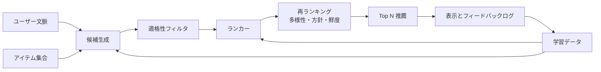
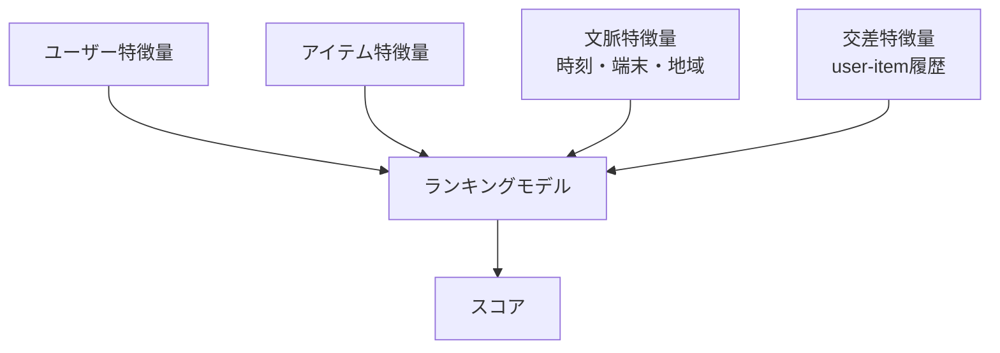

# 推薦システム

## TL;DR

推薦システムは、巨大なアイテム空間から関連性、多様性、鮮度、ビジネス制約を満たす候補を低レイテンシで返す多段システムです。基本構造は、候補生成、フィルタ、ランキング、再ランキング、探索、ログ、フィードバックです。難しい本番課題は、フィードバックループ、コールドスタート、古い埋め込み、スライス劣化、指標ミスマッチです。

---

## 多段アーキテクチャ



候補生成は大規模集合から再現率を重視して絞り込み、ランキングは小さい候補集合で精度を重視します。再ランキングは、学習させるより明示的に制御したい制約を扱います。

---

## 候補生成

| 戦略 | 強み | 弱み |
|---|---|---|
| 協調フィルタリング | 行動の類似性を学習 | 新規ユーザー/アイテムに弱い |
| コンテンツベース | メタデータで新規アイテムに対応 | 繰り返しが多くなりやすい |
| 近似最近傍検索 | ベクトルで高速検索 | 埋め込み鮮度とインデックス更新 |
| 人気/トレンド | 単純なフォールバック | 人気バイアス |
| グラフ探索 | ソーシャルや関係構造を活用 | 高コスト、コミュニティに偏る |
| ルール/編集プール | 制御しやすい | パーソナライズが弱い |

大規模システムでは複数の候補ソースを混ぜ、各候補のソースをログに残します。

---

## ランキング層



ランカーはクリック、視聴時間、購入、継続などを予測します。何を目的にするかは、MLだけでなくプロダクトと安全性の判断です。

---

## 再ランキングとポリシー

最高スコア順が常に最良とは限りません。再ランキングでは以下を制御します。

- カテゴリ、クリエイター、価格帯、トピックの多様性。
- ニュースやマーケットプレイスでの鮮度。
- 重複や類似アイテムの除去。
- 安全性やポリシーによる抑制。
- 在庫、公平性、露出制約。
- 探索枠。

制約を明示的に保つと、レビュー、監査、ロールバックが容易になります。

---

## レイテンシ予算

```text
合計p99予算: 150 ms

ユーザー/文脈取得      20 ms
候補生成              45 ms
適格性フィルタ        15 ms
特徴量取得            25 ms
ランキング            25 ms
再ランキング          10 ms
応答/ログ             10 ms
```

ランキングより特徴量取得がボトルネックになることがよくあります。アイテム特徴量は事前計算し、リクエスト時特徴量は価値の高いものに絞ります。

---

## フィードバックログ

クリックだけでは足りません。以下を記録します。

- 表示された候補と表示されなかった候補。
- ランク位置と画面。
- 候補ソース。
- モデル版とポリシー版。
- 適格性フィルタ。
- インプレッション、クリック、滞在時間、購入、非表示、通報。
- 時刻とセッション文脈。

表示ログがないと、「気に入らなかった」と「そもそも見ていない」を区別できません。

---

## 探索

純粋な活用だけでは、モデルは既に良いと思うものだけを見せ続け、新しい候補について学べなくなります。

| 戦略 | 使う条件 | リスク |
|---|---|---|
| epsilon-greedy | 単純な探索枠 | ランダム品質が低いと体験悪化 |
| Thompson sampling | 適応的に探索したい | 説明とデバッグが難しい |
| UCB | 不確実性を考慮したい | 信頼できる不確実性推定が必要 |
| 層化探索 | アイテム/ユーザースライスを網羅したい | 運用が複雑 |

探索には予算とガードレールが必要です。

---

## 障害モード

### 人気バイアス

人気アイテムが露出を集め、さらにフィードバックを集めて有利になります。

対策: 探索枠、ソース割当、露出監視、バイアス補正。

### フィルターバブル

過度なパーソナライズで体験が狭くなります。

対策: 多様性制約、長期満足度、ノベルティ予算、ユーザー制御。

### 目的関数ハック

クリック率は上がるが、信頼、継続、満足度が下がります。

対策: ガードレール、長期指標、ネガティブフィードバック、上位結果の人間レビュー。

### 古い埋め込み

候補検索が古いユーザー/アイテム埋め込みを使い、関連性が落ちます。

対策: 埋め込み鮮度SLO、増分インデックス更新、フォールバックソース。

---

## メトリクス

| レイヤー | メトリクス |
|---|---|
| 検索 | Recall@K、候補ソース比率、候補鮮度、ANNレイテンシ |
| ランキング | NDCG、MAP、AUC、キャリブレーション |
| オンライン | CTR、CVR、滞在時間、継続、非表示/通報 |
| 多様性 | カテゴリ網羅、クリエイター網羅、反復率 |
| スライス | 新規ユーザー、地域、端末、コールドスタート品質 |
| 運用 | p99、キャッシュヒット率、特徴量ストア負荷、インデックス鮮度 |

---

## 重要なポイント

1. 推薦は1つのモデルではなく、検索、ランキング、ポリシーの組み合わせ。
2. 表示ログが学習と評価の基盤。
3. 再ランキングで制約を明示する。
4. 探索が自己強化ループを防ぐ。
5. クリックだけでなく長期成果とガードレールを最適化する。

---

## 参考文献

1. [Deep Neural Networks for YouTube Recommendations](https://static.googleusercontent.com/media/research.google.com/en//pubs/archive/45530.pdf)
2. [Wide & Deep Learning for Recommender Systems](https://arxiv.org/abs/1606.07792)
3. [Matrix Factorization Techniques for Recommender Systems](https://datajobs.com/data-science-repo/Recommender-Systems-%5BNetflix%5D.pdf)
4. [The Use of Randomized Experiments in the Evaluation of Recommendation Systems](https://dl.acm.org/doi/10.1145/1864708.1864721)
