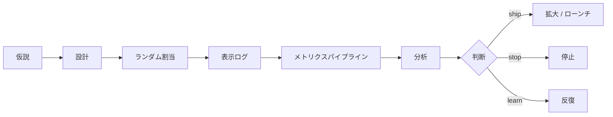
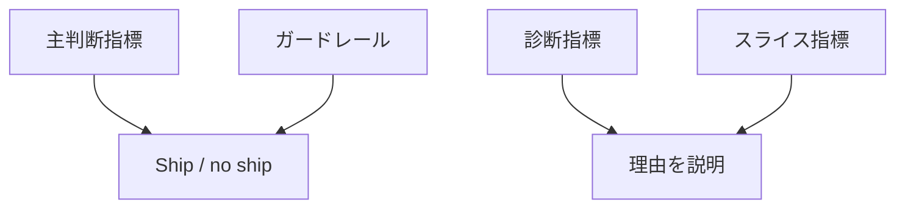

# オンライン実験

## TL;DR

オンライン実験は、ライブトラフィック上で因果的な影響を測ります。オフラインML指標と実際のプロダクト成果をつなぐ仕組みです。良い実験基盤は、割当、表示ログ、メトリクス計算、ガードレール、サンプル比率チェック、セグメント分析、ローンチ判断を管理します。

---

## 実験ライフサイクル

実験は単なるトラフィック分割ではなく、意思決定ルールを持つ測定システムです。

---

## A/B、カナリー、シャドー、バンディット

| 手法 | 主な問い | 用途 |
|---|---|---|
| シャドー | 安全に実行できるか | 実行時検証 |
| カナリー | 継続して安全か | リリース安全性 |
| A/Bテスト | 良くなったか | プロダクト/モデル品質 |
| インターリービング | ランカー比較 | 検索/推薦 |
| バンディット | 学習しながら良い案へ寄せるか | 明確な報酬がある高速最適化 |

必要な判断に対して最も弱い手法を使います。公平なプロダクト評価が必要なら、安易にバンディットを使いません。

---

## ランダム化単位

| 単位 | 使う条件 | リスク |
|---|---|---|
| リクエスト | 状態を持たない予測 | 同じユーザーで体験が揺れる |
| ユーザー | 個人化画面 | 家族/チーム効果を無視 |
| セッション | 短時間体験 | セッション間の汚染 |
| エンティティ | 商品、加盟店、クリエイター | ユーザー体験が混ざる |
| クラスタ/地域 | 干渉が強い | 大きなサンプルと長期間が必要 |

推薦やマーケットプレイスでは、一人の処置が他者の在庫や露出に影響することがあります。

---

## メトリクス階層

例:

- 主判断指標: コンバージョン、継続、不正損失、タスク成功。
- ガードレール: レイテンシ、エラー率、苦情、返金、レビュー負荷。
- 診断指標: 特徴量ミス率、スコア分布、キャッシュヒット率。
- スライス: 新規ユーザー、地域、端末、言語、高リスクテナント。

主指標が勝ってもガードレールが壊れたら出荷しません。

---

## 表示ログ

正しい表示ログが実験分析の基盤です。

- 実験IDとバリアント。
- 割当単位と安定ID。
- 表示時刻。
- モデル版とポリシー版。
- 画面や配置。
- 候補集合とランク。
- 適格性理由とフィルタ。
- 下流結果とイベント時刻。

割当だけで表示がないと、「対象だったが見ていない」ユーザーを過大に数えます。

---

## よくある統計チェック

### サンプル比率不一致

50/50の想定が60/40で観測される場合、割当、適格性、ログ、キャッシュのどこかが壊れています。

### ノベルティ効果

新しいから反応しただけで、長期的に良いとは限りません。

### 多重比較

大量の指標とスライスを見ると、偶然有意に見えるものが出ます。

### 途中停止

良く見えた瞬間に止めると偽陽性が増えます。逐次分析として設計する必要があります。

---

## ML特有の問題

- 不正、信用、チャーンでは真のラベルが遅れて届く。
- 処置トラフィックが次回学習データに入り、将来の比較を汚染する。
- 推薦/ランキングではモデルが収集されるデータ自体を変える。
- 集計勝利の裏で重要スライスが悪化する。

---

## 判断マトリクス

| 結果 | 判断 |
|---|---|
| 主指標勝利、ガードレール合格、スライス合格 | 拡大またはローンチ |
| 主指標勝利、ガードレール失敗 | 出荷しない |
| 主指標中立、診断改善 | 学習を続ける |
| 一部スライスだけ勝利 | 条件付きターゲット展開を検討 |
| サンプル比率不一致 | 原因修正まで結果無効 |
| 遅延ラベル未成熟 | カナリー継続または権限制限 |

---

## 重要なポイント

1. オンライン実験は因果効果を測り、カナリーは安全性を測る。
2. ランダム化単位は干渉構造に合わせる。
3. 表示ログは分析の前提。
4. ガードレールとスライス指標が集計勝利の事故を防ぐ。
5. 遅延ラベルとフィードバックループにより、ML実験は通常のUI実験より運用が難しい。

---

## 参考文献

1. [Trustworthy Online Controlled Experiments](https://www.cambridge.org/core/books/trustworthy-online-controlled-experiments/6A3B263E7114E81B95669A95B219C1D8)
2. [Controlled Experiments on the Web](https://ai.stanford.edu/~ronnyk/2009controlledExperimentsOnTheWebSurvey.pdf)
3. [Overlapping Experiment Infrastructure](https://research.google/pubs/overlapping-experiment-infrastructure-more-better-faster-experimentation/)
4. [CUPED](https://www.exp-platform.com/Documents/2013-02-CUPED-ImprovingSensitivityOfControlledExperiments.pdf)
