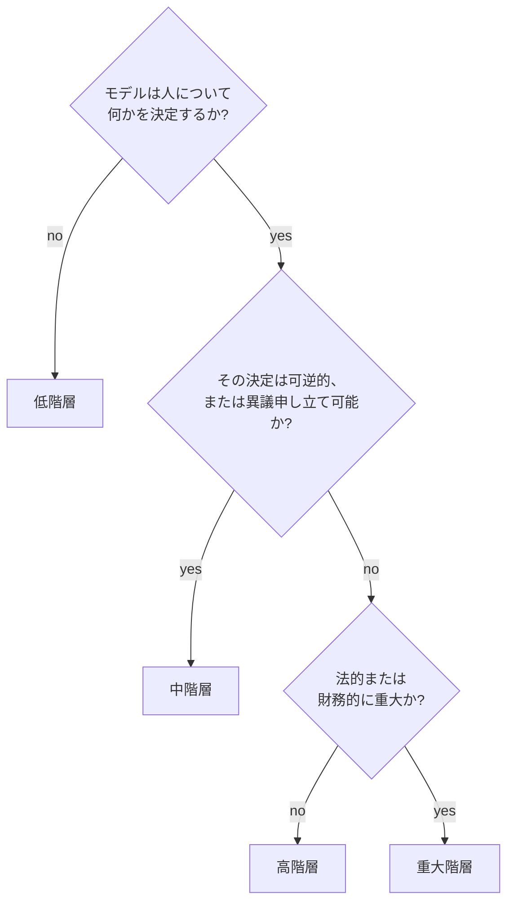

# MLリスクとガバナンス

## TL;DR

MLガバナンスとは、モデルの意思決定を監査可能で、説明責任を果たせ、可逆的なものにする*強制される制御*のシステムです。ガバナンスの中心的な失敗は、それを文書として扱ってしまうこと——Wikiに置いたモデルカード、ポリシーのPDF、一度きりの公平性レビュー——であり、デプロイ経路に組み込まれた機構として扱わないことです。何かを止めない制御は見せかけにすぎません。誰もゲートにしない公平性しきい値、レジストリが強制しないリネージ要件、モデルがすでにトラフィックを処理した後に行われる承認、などです。効果的なガバナンスとは、*システム*が自動的に強制する制御の集合です——リネージのない成果物を拒否するレジストリ、未レビューの高リスクモデルを止める昇格ゲート、あらゆる意思決定を事後に再構成できるほど密度の高い監査ログ。このファイルのすべては一つの原則から導かれます。**意図ではなくインフラを通じてガバナンスせよ。**

---

## ガバナンスは強制ではなく文書になったときに失敗する

MLガバナンスにおける決定的な過ちは、[学習パイプライン](./05-training-pipelines.md)が再現性で犯すのと同じ過ち——組織が*望む*性質を、システムが*保証する*性質として扱ってしまうこと——です。文書の上に築かれたガバナンスプログラムは、立派なバインダーを生み出しますが、実際の制御は生み出しません。モデルカードは intended use を記述しますが、モデルが転用されるのを止めるものは何もありません。ポリシーには高リスクモデルには承認が必要だと書かれていますが、デプロイスクリプトはそれをチェックしません。公平性レビューはローンチ時に一度行われただけで、世界はそれを置き去りにして進んでいきました。

エンジニアリング上の含意は鋭いものです。**デプロイのクリティカルパス上にない制御は制御ではありません。** モデルと本番の間に立ちはだかる唯一のものが、プロセスに従うことを覚えている人間だけなら、そのプロセスは締め切りのプレッシャーの下で省略され、組織再編の後に忘れられ、それを書いたチームが解散するにつれて静かに放棄されます。生き残る制御は、誰が覚えているかどうかに関わらずシステムが強制するもの——まさに*完全なリネージ契約なしにはいかなる成果物もレジストリに入らない*という学習パイプラインのルールと同じです。ガバナンスはそのルールを継承し、拡張します。必要な制御が満たされない限り、いかなるモデルも規制された階層に到達せず、しかも「満たされている」とは、レジストリが保存しゲートがチェックする状態であって、人間がチェックを入れたチェックボックスではありません。

有用なテストは、学習パイプラインの再現性テストを映し出します。ガバナンスプロセスを知るエンジニア全員が明日辞めたとして、システムは依然として未レビューの信用モデルのデプロイを拒否するでしょうか。答えが人間の記憶に依存するなら、あなたが持っているのは文書です。答えが「はい、ゲートがそれを止めます」なら、あなたが持っているのはガバナンスです。

---

## リスク階層化：すべてのモデルが同じ精査を必要とするわけではない

曲を推薦するモデルとローンを承認するモデルは、どちらも「本番のML」ですが、両者を同一にガバナンスするのはカテゴリーエラーです。ローンモデルの制御を曲のレコメンダーに適用すれば、低リスクの作業を官僚主義で埋もれさせ、ついにはチームがガバナンスを完全に迂回するようになります。レコメンダーの制御をローンモデルに適用すれば、人生を左右する意思決定システムを通常のコード変更として出してしまいます。**リスク階層化とは、精査を結果の重大さに比例して割り当てる意思決定フレームワーク**であり、他のあらゆる制御がそこから導かれるため、ガバナンスシステムにおいて唯一最も重要な設計上の選択です。

階層を決定する次元は、技術的な精度ではなく*影響*です。**誰が影響を受けるか**（社内ダッシュボードか、一般大衆か、保護対象クラスか）、**可逆性**（影響を受けた人が異議を申し立てられるか、それとも決定は最終的か）、そして**規制上のエクスポージャー**（その決定は信用、雇用、健康、住宅に関する法律の下に入るか）です。異議申し立ての経路なしに誰かの住宅ローンを拒否する高精度モデルは、プレイリストを提案する平凡なモデルよりも高リスクであり、どちらのAUCが優れているかには関係ありません。

| 階層 | 例 | システムが強制しなければならない制御 |
|---|---|---|
| 低 | 社内ランキング、開発生産性ツール | 所有者、リネージ、基本監視 |
| 中 | マーケティング個人化、サポート振り分け | ＋実験レビュー、ガードレール、スライス監視 |
| 高 | 不正保留、ダイナミックプライシング、違反執行 | ＋人間の上書き、監査ログ、ロールバック、ポリシー承認 |
| 重大 | 信用、雇用、健康、法的アクセス判断 | ＋説明可能性、異議申し立て、厳格なデータガバナンス、定期監査 |

階層は助言的なメタデータではありません。それは*デプロイ経路をパラメータ化する*入力です。エンジニアリング上の含意は、階層はどのゲートを実行するかを決めるため、早期に割り当てられ、ゲートが読める場所に保存されなければならないということです。



---

## 監査可能性とリネージ：再構成できないものはガバナンスできない

あらゆるガバナンスの問い——*なぜこの人は拒否されたのか。このモデルはレビューされたのか。何のデータから学習したのか。ロールバックできるのか。*——は再構成問題に帰着します。システムが過去の意思決定の条件を再構成できないなら、いかなるポリシーもそれをガバナンスできません。**したがってリネージは、他のあらゆる制御が依拠する基盤**であり、再現性が学習パイプラインの基盤であるのと同じです。

ガバナンス要件は、学習パイプラインの[再現性契約](./05-training-pipelines.md)を「何がこのモデルを生み出したか」から「何がこの*意思決定*を生み出したか」へと拡張します。本番の意思決定は三つの軸に沿ってトレース可能でなければなりません。それを行った**モデルバージョン**、そのバージョンを形成した**学習データと特徴量**、そして意思決定時に存在した**具体的な入力**です。この三つすべてをピン留めすれば、監査人——社内、規制当局、あるいは裁判所——は数ヶ月後に「なぜ」に答えられます。どれか一つでも欠けば、その意思決定は再構成不能であり、GDPRやEU AI Actのような規制下では、それ自体が単なる不便ではなく違反となります。

強制ポイントは、すべての高影響な意思決定に対する追記専用の**監査ログ**であり、最低限、タイムスタンプ、モデルとポリシーのバージョン、消費された特徴量参照（生の機微な値ではなくバージョンで）、スコアとしきい値、最終アクション、そしてあらゆる人間の上書きとその理由を記録します。ログは設計上イミュータブルであり——監査対象のシステムが編集できる監査証跡はガバナンスできません——そしてインシデント分析の原材料、次の再学習サイクルのためのラベルとしても二重に機能します。これを機能させる規律は、学習でリネージを機能させる規律と同じです。メタデータは*意思決定時に自動的に*取得されるのであって、記憶や散在するログから事後に再構成されるのではありません。なぜなら事後の再構成こそが、その欠如がガバナンス不能なシステムを定義する能力だからです。

---

## 承認ゲートと職務分掌

「低」より上の階層では、*誰が実際の人々の前にこれを出すことを許されるのか*という問いに、強制される答えがなければなりません。承認ゲートは、規制された階層への昇格を、モデルの作成者ではない誰かの承認を条件とする制御です——**職務分掌**、すなわちシステムを構築する人がそれを承認する唯一の人であってはならないという原則です。作成者は出荷を最適化し、レビュー担当者はユーザーに害を与えないことを最適化します。この二つの役割を一つにまとめると、「出荷しろ、指標が上がったんだ」に対する唯一のチェックがなくなります。

強制ポイントは**モデルレジストリ**であり、[デプロイとロールアウト](./06-model-deployment-rollouts.md)を支えるのと同じコンポーネントです。レジストリは各モデルのライフサイクル状態——experimental、shadow、canary、production、deprecated、retired——を保存し、昇格ゲートは、レジストリが必要な承認、完全なリネージ、そしてその階層のガードレールに対する合格評価を記録しない限り、高階層モデルを production へ進めることを拒否します。これは学習パイプラインの昇格ゲートのガバナンス版です。レジストリが真実の源であり、承認が「誰かがSlackで yes と言った」だけのモデルは承認されていません。なぜならゲートはSlackを読めないからです。

エンジニアリング上の含意は、承認は人間の記憶の中のイベントではなく、クエリ可能で強制される*レジストリ内の状態*でなければならないということです。ゲートが評価する小さな宣言的ポリシーで十分です。

```yaml
# tier>=high のモデルがトラフィックを処理する前に昇格ゲートが評価する
promote_to_production:
  require_lineage_contract: complete      # else: refuse (no contract, no registry entry)
  require_slice_metrics:    passing       # gated on pre-declared protected slices
  require_approval_from:     "risk-review" # a role distinct from the model's author
  require_rollback_target:   present       # a known-good version to revert to
```

---

## アクセス制御：重大な影響を持つモデルを誰が変更してよいのか

誰でもそれを迂回できるなら、承認ゲートは無価値です。職務分掌が成り立つのは、昇格する、しきい値を編集する、特徴量定義を上書きする*権限*それ自体が強制される制御であるときだけです。これがガバナンスのアクセス制御層であり、チームが最も頻繁に暗黙のままにしてしまうものです——すべてのエンジニアが本番の認証情報を持ち、ゲートは制約ではなく慣習になっています。

原則は、変更の影響範囲（ブラスト半径）はリスク階層に応じてスケールしなければならないということです。重大な信用モデルのしきい値を編集することは、曲のレコメンダーを編集するよりも高い権限を要するアクションであり、システムはそのように扱うべきです。高階層モデルへの変更は作成者一人では持たない認証情報を必要とし、そのような変更はすべてアイデンティティに帰属づけられて監査ログに書き込まれ、モデルが提供する本番ポリシーそれ自体がバージョン管理されアクセス制御された成果物である——オンコールエンジニアが午前2時に静かに調整できる値ではありません。エンジニアリング上の含意は、*誰が、いつ、誰の承認で何を変更したか*が、すべての重大な影響を持つモデルについて再構成可能でなければならないということであり、これによりアクセス制御は別個の関心事ではなく監査証跡の前提条件になります。承認を記録するが誰でもモデルの状態を切り替えられるレジストリは、フィクションを記録しているのです。

---

## 説明可能性と異議申し立て：モデルの性質ではなくシステム要件

規制された意思決定が誰かに不利に働くとき——ローンの拒否、求職の不採用、アカウントのフラグ付け——世界の多くの場所で法律は、その人に説明を受ける権利と異議を申し立てる経路を与えています。**GDPR第22条**（2018年以来施行）は、法的またはそれに類する重大な影響を伴う完全に自動化された意思決定の対象とされない権利、そして人間の介入を得て結果に異議を申し立てる権利を個人に与えています。**EU AI Act** は2024年に採択され、その高リスク義務を2026〜2027年にかけて段階的に施行し、これを高リスクシステムにおける人間による監督、透明性、記録保持の具体的な要件へと固めています。

エンジニアリング上の含意は、チームが見落とす部分です。**説明可能性と異議申し立ては、モデルの性質ではなくシステム要件です。** モデルが抽象的に「解釈可能」であるだけでは不十分です。システムは——モデルバージョン、入力、関連する特徴量の寄与度——を十分に記録しており、影響を受けた人が数週間後に尋ねたときに*なぜこの特定の意思決定が下されたのかを再構成できる*ものでなければなりません。そして異議申し立てには、実際の human-in-the-loop の経路が必要です。レビューキュー、上書き機構、そして意思決定を覆せる異議申し立てプロセスです。意思決定時に計算されて破棄されたSHAP値は、後では何も説明しません。同じ値を監査ログに書き込めば、その意思決定は異議申し立て可能になります。永続化されない説明可能性は制御ではありません。

これは研究色の強いトピックをインフラのトピックへと再構成します。問いは「どの解釈手法が最も忠実か」ではなく「システムは意思決定ごとに、それを説明し覆すために必要な成果物を保持しているか」——そしてその保持は強制されているのか、それとも誰かがログに残すのを覚えていることに依存しているのか、です。

---

## 継続的でゲート化された運用上の関心事としての公平性

公平性が最もしばしば失敗するのは、チームがそれを無視したからではなく、*一度だけ*チェックしたからです。ローンチ時に差別的影響について監査され、その後二度と監査されないモデルはドリフトします。なぜなら、それが提供する母集団がドリフトし、データがドリフトし、上流の特徴量が静かに意味を変えるからです。**公平性は、継続的に測定されゲートにされなければならない運用上の性質であり、一度きりの証明書ではありません。**

これをデータサイエンスの公平性指標論争の内側ではなくシステムレベルで捉えると、三つの具体的なインフラ要件が得られます。第一に、**デプロイ前に指標を定義する。** 差別的影響、機会均等、グループ間のキャリブレーションは衝突しうるものであり、どれが重要かはインシデント後に発見するものではなく、意図的に決定して記録するものです。第二に、**保護スライス全体で継続的に測定する**。品質回帰を追跡するのと同じ[スライス監視](./04-model-monitoring.md)の機構、そして平均には役立つがサブグループには害を与えるローンチを捕捉する[実験のスライス分析](./08-online-experiments.md)を再利用します。第三に、**それをゲートにする**。集計AUCを改善する一方で保護スライスを回帰させる昇格は、誰も読まないダッシュボードに記されるだけでなく、*ゲートによって止められ*なければなりません。

警告となる事例は具体的で十分に文書化されています。2019年の**Apple Card** のローンチは、アルゴリズムが同様の財務状況の男性よりも女性に低い与信限度額を提示したという公的報告の後、ニューヨーク州規制当局の調査を招きました。**Amazon は2018年に社内採用ツールを廃棄しました**。「women's」という単語を含む履歴書にペナルティを課すことを発見したからで、これは10年分の男性優位の採用データから学習していました。**オランダの育児手当スキャンダル**（SyRIおよび関連する不正検知システム、2019〜2021年頃に明るみに出た）では、自動リスクシステムが数万の家族を不正と誤って告発し、特に二重国籍を持つ家族に不均衡に偏り、2021年のオランダ政府の総辞職の一因となりました。いずれの場合も、技術的な公平性の欠陥は*ガバナンス*の欠陥の下流にありました。システムの意思決定をゲートにする、強制された継続的でスライスレベルの測定が存在しなかったのです。

---

## プライバシーとデータガバナンス

モデルはその学習データの関数であり、学習データこそ、ほとんどの規制上・倫理上のエクスポージャーが生じる場所です。三つのガバナンス上の関心事がここに存在します。**来歴と同意**：システムは学習データがどこから来たか、そしてその利用がこの目的のために許可されているかを記録しなければなりません——学習パイプラインからのリネージ契約を、法的根拠にまで拡張したものです。**特徴量内のPII**：機微属性とその代理（人種を代理する郵便番号、性別を代理する名前）は、特徴量セットに入る前にレビューされなければなりません。なぜなら、保護された代理を消費していることを誰も知らなければ、モデルを公平性についてガバナンスできないからです。**削除権 対 記憶してしまったモデル**：GDPRは消去権を与えますが、ある人のデータで学習したモデルはそれを*記憶している*かもしれず、ウェアハウスから行を削除しても重みからは削除されません。エンジニアリング上の含意は、削除は追跡された、リネージを意識した操作でなければならないということです——どのモデルが所与のレコードで学習したかを知ることは、学習パイプラインが不良データのバックフィルに必要とするのと同じ前方リネージの*影響クエリ*であり、それを持たないガバナンスシステムは、果たせない削除を約束することになります。

---

## インシデント対応と説明責任

規制された階層にあるすべてのモデルには、名前のある所有者が必要です——すでに解散したチームではなく、モデルの害に責任を負う説明責任ある個人またはオンコールローテーションです。所有者のいない**所有者不明モデル**は、最も一般的で最も危険なガバナンスの失敗の一つです。それは本番で重大な意思決定を下しながら稼働し、問題が起きたとき、それに気づき、説明し、止めることを職務とする者が誰もいません。

MLのインシデントは、サービスのインシデントとは異なるプレイブックを要求します。なぜなら、モデルは完璧に*健全*——低レイテンシ、エラーなし——でありながら、実際の害を引き起こしうるからです。関連する重大度スケールは、システムの健全性ではなく害に基づいて設定されます。

| 重大度 | 定義 | 対応 |
|---|---|---|
| Sev1 | 不可逆的な害または法的違反 | キルスイッチ、経営層へのエスカレーション、規制当局への通知 |
| Sev2 | 重大な財務的またはユーザーへの害 | ロールバック、24時間以内のインシデントレビュー |
| Sev3 | 検出可能な品質または公平性の劣化 | 調査、canaryロールバック |
| Sev4 | ドリフトまたは異常を検出 | 営業時間内にトリアージ |

ここでの決定的なガバナンス制御は**ロールバック**であり、[デプロイとロールアウト](./06-model-deployment-rollouts.md)が配線するのと同じ方法で配線されなければなりません。システムは、*設定を通じて、1分以内に、サービスを再デプロイすることなく*、モデルを無効化したり既知の良好なバージョンに戻したりできなければなりません。害を検出できるが素早く止められないガバナンスプログラムは不完全です。封じ込めの後には**インシデント事後レビュー**が来ますが、その統括する問いは「誰が誤ったか」ではなく「どのゲートやチェックがこれを捕捉できたか」です。なぜなら、インシデントの永続的な成果物は、文書の新しい一行ではなく、新たに強制される制御だからです。

---

## 規制の状況、制御へのマッピング

規制を概観する目的は、法的な網羅性ではなく、主要な規制がすべて上記の制御にマッピングされるという認識です——それらは新しいカテゴリーの作業ではなく、強制されたインフラへの要求なのです。

- **SR 11-7**（米連邦準備制度 / OCC、2011年）は、銀行業務のためのモデルリスク管理を確立しました。独立した検証、所有者付きのモデルインベントリ、継続的な監視です。これは本質的に、リスク階層化、モデルレジストリ、職務分掌の義務付けであり——ほとんどのMLチームがそれらを採用するより10年早いものでした。
- **GDPR第22条**（EU、2018年）は、説明可能性、異議申し立て、human-in-the-loop の上書き経路、そして意思決定を再構成できるほど密度の高いリネージにマッピングされます。
- **EU AI Act**（2024年採択、高リスク義務は2026〜2027年にかけて段階的に施行）は、明示的なリスク階層——禁止、高リスク、限定、最小——を定義し、高リスクシステムに対して人間による監督、透明性、データガバナンス、記録保持を義務付けます。その階層化は上記と同じ影響ベースのフレームワークに法的な歯を与えたものであり、その2026年のタイムラインこそ、これらの制御が今EUユーザーにサービスを提供する誰にとっても任意から必須へと移りつつある理由です。

エンジニアリング上の要点：すでに強制されたリスク階層化、リネージ、承認ゲート、スライス監視、ロールバックを構築したチームは、この三つすべてへのコンプライアンスのほとんどの道のりを進んでいます。文書しか持たないチームはそうではありません。

---

## 障害モード

ガバナンスが失敗する特徴的な様式は組織を超えて繰り返し現れ、それらに名前を与えることは、それらを防ぐことの半分です。

**見せかけのガバナンス**が根本的な失敗です。紙の上には存在するが何も強制しない制御——どのゲートもチェックしない公平性しきい値、ローンチ後に行われる承認、デプロイされた現実から乖離するモデルカード。防御策は、必要なすべての制御をデプロイ経路に配線し、人間ではなくシステムがそれを強制するようにすることです。

**再構成不能な意思決定**は、「なぜ」に答えられない監査です。規制当局や裁判所がなぜある人が拒否されたのかを尋ね、システムはモデルバージョン、入力、推論を再構成できません。防御策は、自動的に取得されイミュータブルに保存される、意思決定ごとの監査ログです。

**階層化されていない画一的なガバナンス**は、チームが回避するまで低リスクモデルを官僚主義で埋もれさせるか、高リスクモデルを通常のコード変更として出してしまうかのどちらかです。防御策は、影響によって精査を割り当ててゲートをパラメータ化する階層化フレームワークです。

**一度きりのチェックとしての公平性**は、ローンチ時にモデルを証明し、それをドリフトさせます。防御策は、昇格ゲートが強制する事前宣言された指標を伴う継続的なスライス監視です。

**所有者不明モデル**は、所有者なしに本番で稼働し、誰もその害に気づき、説明し、止めることをしません。防御策は、必須の所有者メタデータ、古いモデルアラート、そして廃止経路です——廃止計画のないモデルは恒久的な運用負債になります。

**形骸化したレビュー**は、キューが深すぎてSLAが厳しすぎるために意思決定の99%を承認する人間のゲートです。99%の同意率を持つレビューキューはレビューキューではありません。それはレイテンシ税です。防御策は、人間レビューをSLOを持つサービスとして扱うことです——専門家の裁定に対するレビュー担当者の精度を監視し、キューの深さを制限し、レビュー担当者をローテーションします。

---

## 意思決定フレームワーク：リスク階層 → 必要な制御

MLシステムのガバナンスを設計またはレビューすることは、短い一連の問いに帰着します。そのそれぞれが、人間がチェックを入れるボックスではなく、システムが*強制*しなければならない制御です。

1. **このモデルはどのリスク階層か**、誰が影響を受けるか、可逆性、規制上のエクスポージャーによって。階層は以下のすべてをパラメータ化します。
2. **すべての本番の意思決定を再構成できるか**——モデルバージョン、学習データ、入力——記録されたメタデータだけから。できなければ、システムは監査不能でガバナンス不能です。
3. **規制された階層への昇格は、作成者以外の誰かからの強制された承認を必要とするか**、レジストリを真実の源として。そうでなければ、職務分掌は存在しません。
4. **規制された意思決定について、それを説明し異議を申し立てるのに十分なログが残されているか**、実際の人間の上書きと異議申し立て経路を伴って。そうでなければ、GDPR第22条とEU AI Actに違反します。
5. **公平性は事前宣言された保護スライス全体で継続的に測定されゲートにされているか**、ローンチ時に一度チェックされるのではなく。
6. **モデルを設定経由で1分以内に無効化またはロールバックできるか**、サービスを再デプロイすることなく。
7. **モデルには名前のある所有者と廃止経路があるか。** 所有者のいないモデルは、誰も対応しないことを待つインシデントです。

これらに強制された制御で答えるシステムは、監査可能で、説明責任を果たせ、可逆的です。これらに文書で答えるシステムはガバナンスの見せかけを持ち、その隔たりのコストは、モデルが意思決定の対象とする人々が支払います——Apple Card、Amazon、そしてオランダの家族が学んだように。

---

## 重要なポイント

1. ガバナンスとは、MLを監査可能で、説明責任を果たせ、可逆的なものにする*強制される制御*のシステムである——デプロイ経路に配線されていない制御は見せかけである。
2. 影響による（誰が影響を受けるか、可逆性、規制上のエクスポージャー）リスク階層化が中核の意思決定フレームワークであり、他のあらゆる制御をパラメータ化する。
3. リネージは基盤である。再構成できないものはガバナンスできないため、すべての本番の意思決定はモデルバージョン、そのデータ、その入力にトレースできなければならない。
4. 承認ゲートはモデルレジストリを通じて職務分掌を強制する——承認は記憶ではなくクエリ可能な状態である。
5. 説明可能性と異議申し立ては*システム*要件である。意思決定を説明し覆すのに十分なものを永続化し、実際の人間の上書き経路を提供する（GDPR第22条、EU AI Act）。
6. 公平性は運用上のものである。デプロイ前に指標を宣言し、保護スライス全体で継続的に測定し、それをゲートにする——決して一度きりのチェックではない。
7. ロールバックはガバナンス制御である。害を検出するが1分以内に止められないシステムは不完全である。
8. すべての規制されたモデルには名前のある所有者と廃止経路が必要であり、さもなければ説明責任のない恒久的な負債になる。
9. SR 11-7、GDPR、そしてEU AI Act（2026〜2027年にかけて段階的に施行）はすべて、同じ強制される制御にマッピングされる——制御を構築すればコンプライアンスはおおむね後からついてくる。
10. ガバナンスされないMLには文書化されたコストがある。Apple Card（2019年）、Amazonの廃棄された採用ツール（2018年）、そしてオランダの育児手当スキャンダルは、モデルの失敗である前にガバナンスの失敗だった。

---

## 参考文献

1. [SR 11-7: Guidance on Model Risk Management](https://www.federalreserve.gov/supervisionreg/srletters/sr1107.htm) — US Federal Reserve / OCC, 2011
2. [EU AI Act — Official Text and Risk Classification](https://artificialintelligenceact.eu/) — adopted 2024, phased into 2026–2027
3. [GDPR Article 22 — Automated Individual Decision-Making](https://gdpr-info.eu/art-22-gdpr/)
4. [NIST AI Risk Management Framework](https://www.nist.gov/itl/ai-risk-management-framework)
5. [Model Cards for Model Reporting](https://arxiv.org/abs/1810.03993) — Mitchell et al., 2019
6. [Datasheets for Datasets](https://arxiv.org/abs/1803.09010) — Gebru et al., 2018
7. [Hidden Technical Debt in Machine Learning Systems](https://proceedings.neurips.cc/paper_files/paper/2015/file/86df7dcfd896fcaf2674f757a2463eba-Paper.pdf) — Sculley et al., 2015
8. [Amazon scraps secret AI recruiting tool that showed bias against women](https://www.reuters.com/article/us-amazon-com-jobs-automation-insight-idUSKCN1MK08G) — Reuters, 2018
9. [Apple Card investigated after gender discrimination complaints](https://www.bloomberg.com/news/articles/2019-11-09/viral-tweet-about-apple-card-leads-to-probe-into-goldman-sachs) — Bloomberg, 2019
10. [Dutch childcare benefits scandal / SyRI ruling](https://www.amnesty.org/en/latest/news/2021/10/xenophobic-machines-dutch-child-benefit-scandal/) — Amnesty International, 2021
