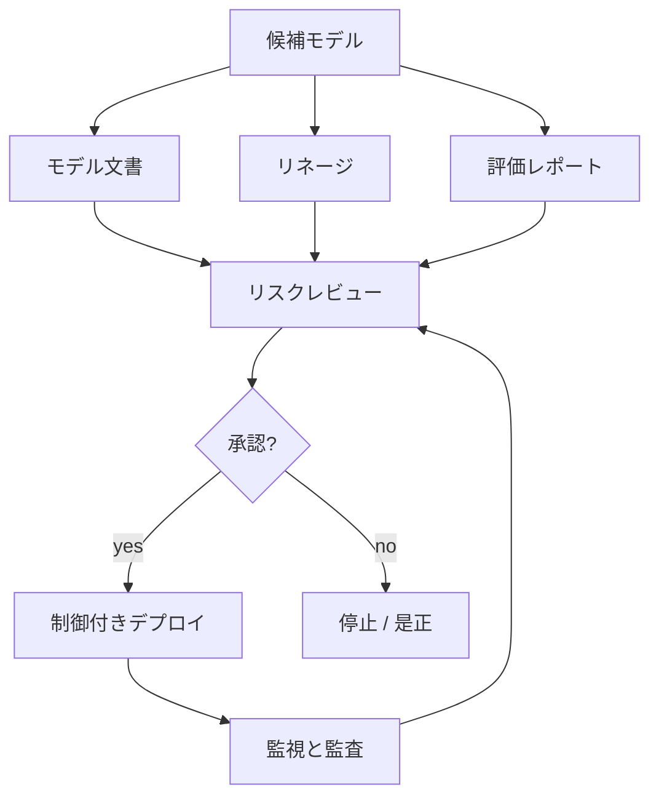

# MLリスクとガバナンス

## TL;DR

MLガバナンスは、モデル意思決定を説明可能で制御可能に保つ運用システムです。単なるコンプライアンス文書ではありません。リスク階層、モデル文書、リネージ、承認ゲート、アクセス制御、監査ログ、スライス監視、人間の上書き、インシデント対応、廃止を含みます。

---

## リスク階層

| 階層 | 例 | 必要な制御 |
|---|---|---|
| 低 | 内部推薦、開発者向けランキング | 基本リネージ、所有者、監視 |
| 中 | マーケティング個人化、サポート振り分け | 実験レビュー、ガードレール、スライス監視 |
| 高 | 不正保留、価格、違反執行 | 人間の上書き、監査ログ、ロールバック、ポリシー承認 |
| 重大 | 信用、雇用、医療、法的アクセス判断 | 形式的レビュー、説明可能性、厳格なデータ統制、定期監査 |

低リスクモデルを過剰手続きで止めず、高影響モデルを普通のコード変更として出さないために階層化します。

---

## ガバナンス制御プレーン

必要なメタデータ、昇格ゲート、監査ログ、レジストリ状態をプラットフォームに組み込むほど、運用は安定します。

---

## モデル文書

| 項目 | 問い |
|---|---|
|  intended use | どの意思決定を支援するか、誰が使うか |
| 非対象用途 | どこで使ってはいけないか |
| 学習データ | データ、期間、ラベル、除外条件 |
| 特徴量 | 特徴量グループ、機微属性の代理可能性 |
| 評価 | 指標、スライス、ガードレール |
| 制限 | 既知の失敗ケース、低信頼領域 |
| 人間の制御 | レビュー、上書き、エスカレーション、異議申立 |
| 監視 | ドリフト、品質、公平性/スライス、事業ガードレール |
| 所有者 | チーム、オンコール、レビュー周期 |

文書はWikiではなく、モデル成果物と一緒にバージョン管理します。

---

## データと特徴量リスク

| リスク | 例 | 制御 |
|---|---|---|
| 機微属性 | 年齢、健康、正確な位置 | データ分類と特徴量許可リスト |
| 代理特徴量 | 郵便番号が保護属性の代理になる | スライス評価とレビュー |
| ラベルバイアス | 過去の執行ラベルが過去ポリシーを反映 | ラベル監査と人間レビュー |
| 同意ミスマッチ | 別目的で集めたデータの利用 | データ利用契約 |
| 保持違反 | 許可期間を超えた学習データ保持 | データセット期限と削除ワークフロー |

フィーチャーストアと学習パイプラインは、分類、所有者、保持メタデータを扱うべきです。

---

## Human-in-the-Loop

| パターン | 使う条件 | 障害モード |
|---|---|---|
| 手動レビューキュー | 信頼度が低い、または高影響 | 負荷下でレビューが形骸化 |
| 人間の上書き | 緊急制御が必要 | 上書きが監査されない |
| 異議申立 | ユーザーが判断に異議を唱える | 申立データがモデル改善に戻らない |
| 二段階アクション | モデルが推薦し人間が決定 | レイテンシと人員コスト |
| 自動判断 + 監査 | 低リスク高ボリューム | 静かなバイアスや品質劣化 |

人間レビューも容量、品質、レイテンシを持つシステムです。

---

## 監査ログ

高影響判断には以下を残します。

- リクエストと判断時刻。
- モデル版とポリシー版。
- 入力特徴量または承認済み参照。
- 予測、しきい値、最終アクション。
- 人間レビュー担当者と上書き理由。
- 実験またはロールアウト割当。
- 下流結果と異議申立結果。

監査ログはインシデント分析と再学習の材料でもあります。

---

## 障害モード

### 所有者不明モデル

本番で動いているが元チームがいない状態です。

対策: 所有者メタデータ、古いモデルアラート、レビュー周期、廃止計画。

### ポリシーが重みに隠れる

事業や安全性の方針がモデル内部に暗黙化され、レビューできません。

対策: 高影響ポリシーは再ランキング、しきい値、ルールとして明示します。

### 指標だけの承認

集計AUCは改善したが、重要スライスやガードレールが悪化します。

対策: 昇格前にスライスチェックとガードレール承認を必須にします。

### 廃止経路がない

古いモデルが移行リスクを理由に残り続けます。

対策: experimental、shadow、canary、production、deprecated、retired のレジストリ状態を持たせます。

---

## 運用メトリクス

| 分類 | メトリクス |
|---|---|
| ガバナンス | リスク階層別モデル数、期限切れレビュー、文書欠落 |
| データ | 機微特徴量利用、保持違反、所有者設定率 |
| 判断 | 上書き率、異議申立率、レビューキュー遅延 |
| 品質 | スライス指標、キャリブレーション、偽陽性/偽陰性 |
| インシデント | 検知時間、モデル無効化時間、影響判断数 |
| ライフサイクル | 古いモデル年齢、廃止率、ロールバック率 |

---

## 重要なポイント

1. ガバナンスは文書置き場ではなく本番制御システム。
2. 高影響判断ほどモデル外の制御が必要。
3. リネージ、監査ログ、所有者は信頼性要件。
4. 明示的なポリシー層は重みに隠れたポリシーよりレビューしやすい。
5. 廃止経路のないモデルは運用負債になる。

---

## 参考文献

1. [Model Cards for Model Reporting](https://arxiv.org/abs/1810.03993)
2. [Datasheets for Datasets](https://arxiv.org/abs/1803.09010)
3. [NIST AI Risk Management Framework](https://www.nist.gov/itl/ai-risk-management-framework)
4. [Hidden Technical Debt in Machine Learning Systems](https://proceedings.neurips.cc/paper_files/paper/2015/file/86df7dcfd896fcaf2674f757a2463eba-Paper.pdf)
