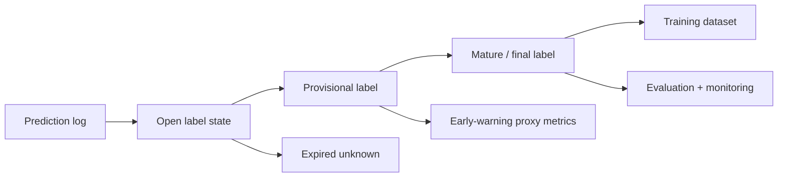
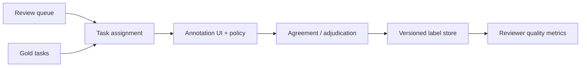

# ラベルとグラウンドトゥルースのシステム

> **翻訳についての注記:** 本ドキュメントは英語原文 `16-ml-systems/10-label-ground-truth-systems.md` を日本語に翻訳したものです。コードブロック、YAML、Mermaidダイアグラムは原文のまま維持しています。

## TL;DR

ラベルシステムとは、MLプラットフォームの中で、乱雑な実世界の結果を、訓練・評価・監視・実験・ガバナンスに使われるグラウンドトゥルースへと変換する部分です。それはラベルのCSVではなく、人間のアノテーションUIでもありません。ほとんどのデータベースより難しい正しさの問題を抱えた本番データシステムです: そこに保存される値は、実際に何が起きたかについての、遅延した、確率的な、ポリシーに形作られた主張だからです。中心的な設計課題は、**真実が到着するまで意思決定のコンテキストを保存すること**です。今日行われた予測は、そのラベルを数秒後に受け取るかもしれず、数週間後かもしれず、永遠に受け取らないかもしれません。ラベルがついに現れたとき、システムはそれを、その結果を生んだ正確な予測、モデルバージョン、特徴量の値、露出、ポリシー、アクションへと結合し直せなければなりません。その結合が間違っていれば、下流のすべてのメトリクスが間違います。悪いラベルで訓練されたモデルは世界を学んでいるのではなく、ラベルパイプラインのバグを学んでいるのです。

---

## なぜラベルは「列」ではなく「システム」なのか

ラベルを普通のデータ — `entity_id`、`timestamp`、`label` を持つテーブル — として扱いたくなります。その見方は小さすぎます。ラベルとは、ある定義のもとでの結果の解釈であり、あるプロセスを通じて収集され、先行する予測に取り付けられ、モデルの良し悪しの判断に使われるものです。この文のあらゆる部分にシステムの仕事が隠れています。

不正取引は、取引が発生した瞬間に不正とラベルされるわけではありません。チャージバックの後、手動調査の後、加盟店の異議申し立ての後、あるいはリスクチームのルールが証拠は十分に強いと判断した後にラベルされるかもしれません。レコメンデーションは、ユーザーがクリックしたというだけでポジティブとラベルされるわけではありません。そのクリックは誤操作かもしれず、ポジションバイアスかもしれず、直後の離脱が続いたかもしれません。医療モデルは数ヶ月後に診断コードを受け取るかもしれず、そのコード自体、請求ワークフローが記録内容を形作るために不完全かもしれません。いずれの場合も、ラベルは宇宙が発する客観的事実ではありません。レイテンシ、バイアス、欠損、ポリシーが内部に埋め込まれた収集プロセスの出力なのです。

エンジニアリング上の含意は深刻です: **ラベルの品質がモデルの品質を上から抑えます**。より良いモデルコードは、結果を誤った予測に結合し、難しいケースを静かに落とし、訓練ウィンドウの途中でターゲットの定義を変えるラベルパイプラインからは回復できません。これはデータベース不変条件のML版です: 上流のグラウンドトゥルースが壊れていれば、下流の正しさは不可能です。

有用なテスト: 誰かが「なぜ `model_v42` は先月 `model_v41` より再現率が8%低かったのか」と尋ねたとき、プラットフォームは予測だけでなく、採点に使われたラベル — その定義、到着時刻、ソース、アノテータまたは結果イベント、訂正履歴 — を再構築できますか? できないなら、そのチームにはラベルはあっても、ラベルシステムはありません。

---

## ラベルこそが仕様である

伝統的なソフトウェアでは仕様は明示的です。要件を読み、それに対するテストを書けます。教師ありMLでは、ラベルが実行可能な仕様です。`Y = 1` が「不正」を意味するなら、モデルはプロダクトチームが意図した不正の意味ではなく、ラベル生成プロセスが不正と呼ぶものを学びます。

これは危険な曖昧さを生みます: 2つのモデルが同じメトリクスを最適化しながら、ラベルが異なる定義を符号化しているために、異なる問題を解いていることがあり得ます。「チケットがエスカレーションされた」で訓練されたサポートルーティングモデルは、チケットの難しさではなく、組織のエスカレーション行動を学びます。「過去に採用された」で訓練された採用モデルは、候補者の質ではなく、バイアスを含む過去の採用判断を学びます。「クリックされた」で訓練されたレコメンダーは、満足ではなくクリック傾向を学びます。モデルはラベルに忠実です。ラベルがビジネス目標に不忠実かもしれないのです。

したがってラベルシステムで最も重要なアーティファクトは**ラベル定義コントラクト**です。ターゲットが正確に何を意味するか、どのイベントやレビュープロセスがそれを生むか、どの観測ウィンドウが適用されるか、どんな除外があるか、そして各訓練行に対してどのバージョンの定義が有効だったかを明記します。

```yaml
label: transaction_fraud
version: v6
positive_definition: "confirmed unauthorized transaction"
negative_definition: "no dispute or chargeback after 90 days"
observation_window_days: 90
source_events:
  - chargeback_confirmed
  - manual_review_confirmed_fraud
exclusions:
  - test_transactions
  - transactions_reversed_before_settlement
owner: risk-data-platform
valid_from: 2026-01-01T00:00:00Z
```

バージョンが重要なのは、ラベル定義が進化するからです。不正チームは新しい異議申し立て理由を不正として扱い始めるかもしれません。コンテンツモデレーションチームは境界的なヘイトスピーチのポリシーを変えるかもしれません。マーケットプレイスはキャンセルルールの変更後に「成功した予約」を再定義するかもしれません。過去のラベルがその場で上書きされると、オフライン評価は比較不能になります: 今日評価されるモデルは、6ヶ月前に出荷されたモデルとは異なるターゲットで採点されるのです。ルールは特徴量バージョニングと同じです: **ラベルの意味的変更は新しいラベルバージョンであり、決してその場での編集ではありません**。

---

## 予測ログが結合のアンカーである

信頼できるラベルシステムはすべて予測ログから始まります。ラベルは後で到着します。予測コンテキストは今しか存在しません。システムが意思決定時にそのコンテキストを捕捉しなければ、後から再構築することはできません。

最小限の予測レコードは、スコア以上のものを含みます:

```yaml
prediction_id: 01J2F9K8...
timestamp: 2026-06-24T12:01:08Z
entity_id: txn_9821
subject_id: user_442
model: fraud_classifier
model_version: v42
feature_schema: fraud_features:v12
feature_refs:
  account_risk: account_17@2026-06-24T12:01:00Z
  device_velocity: device_91@2026-06-24T12:00:58Z
score: 0.973
threshold_policy: fraud_policy_v9
action: manual_review
experiment: fraud_model_rollout_2026q2:treatment
request_context:
  country: JP
  amount_bucket: high
```

予測IDは、将来のすべての真実にとっての主キーです。ラベルは可能な限り、`user_id` と時刻の曖昧な組み合わせではなく、安定した意思決定識別子を通じて予測に結合すべきです。曖昧結合はラベルシステムがメトリクスを壊す最も一般的な方法のひとつです: 後の結果が誤った予測に取り付けられる、重複した予測が1つの結果を奪い合う、1つの結果が複数の意思決定にラベルを付ける。

予測ログが重要であるより深い理由は、モデルの品質が、孤立したエンティティではなく、*コンテキスト下の意思決定*の性質だからです。不正モデルが同じ取引を2つの異なるモデルバージョンで2回スコアリングし、片方のスコアだけが手動レビューを引き起こしたなら、最終的なラベルは正しい意思決定パスに帰属できなければなりません。レコメンダーがあるランカーではアイテムをポジション1に、別のランカーではポジション10に表示したなら、クリックラベルはそれぞれのコンテキストで異なる意味を持ちます。ログはそのコンテキストが存在する唯一の場所です。

これが、予測ロギングがラベルシステムを[モデル監視](./04-model-monitoring.md)、[オンライン実験](./08-online-experiments.md)、[レコメンデーションシステム](./07-recommendation-systems.md)、[MLリスクガバナンス](./09-ml-risk-governance.md)へと結びつける理由です。すべてが同じものを必要とします: システムが何を信じ、何をし、どのバージョンの下でそうしたかの永続的な記録です。

---

## ラベル遅延: 真実は意思決定の後に到着する

ラベル遅延は不便さではありません。アーキテクチャ全体を決定します。予測が行われた瞬間、システムは**オープンラベル区間**に入ります: 結果はまだ知られていないのに、意思決定はすでに世界に影響を与えています。

ドメインによって遅延プロファイルは根本的に異なります:

| ドメイン | 予測 | ラベルソース | 典型的な遅延 | 監視への帰結 |
|---|---|---|---|---|
| 広告 / レコメンデーション | アイテム表示 | クリック、滞在、コンバージョン | 数秒〜数日 | 速いがバイアスのあるラベル |
| 不正オーソリゼーション | 取引の承認 / レビュー / ブロック | チャージバック、調査 | 数日〜90日超 | 早期警戒にはプロキシが必要 |
| 与信審査 | ローン承認 | 延滞 / デフォルト | 数ヶ月〜数年 | 長いホールドバックとビンテージ分析 |
| 不正利用検知 | コンテンツの許可 / 削除 | ユーザー報告、モデレーターレビュー | 数分〜数週間 | 強力な人間レビューパイプラインが必要 |
| ヘルスケア | リスク予測 | 診断 / 転帰 | 数週間〜数年 | ラベルの不完全性が構造的 |

システムへの帰結は**ラベル成熟パイプライン**です。予測は未ラベルとして始まります。一部はすぐに暫定ラベルを受け取ります。一部の暫定ラベルは後で訂正されます。一部は永遠に不明のままです。訓練と評価のジョブは、必要とする成熟ウィンドウを宣言しなければなりません: クリックモデルは24時間ラベルで訓練できるかもしれませんが、不正モデルは最終評価に90日の成熟を要求しつつ、早期監視には7日のプロキシラベルを使うかもしれません。



障害モードは、未成熟なラベルを最終的な真実として読むことです。2時間後に安全に見える不正カナリアは、不正損失を測定していません。運用の健全性と、せいぜい早期プロキシを測定しただけです。30日延滞を改善するクレジットモデルが、1年デフォルトを悪化させることもあります。ラベルシステムは成熟度をデータモデルの中で明示的にし、すべてのメトリクスがどの真実の地平を表すかを語れるようにしなければなりません。

---

## ネガティブラベルはポジティブラベルより難しい

ポジティブラベルはしばしば自ら名乗り出ます: クリックが起きる、チャージバックが計上される、モデレーターが不正利用を確認する。ネガティブラベルは通常、あるウィンドウにわたるポジティブイベントの不在によって定義されます。それがネガティブラベルをより脆くします。

取引は、1日後にチャージバックが現れていないから非不正なのではありません。異議申し立てウィンドウ全体 — おそらく90日 — の後にチャージバックが現れなかったから非不正なのです。ユーザーはクリックしなかったというだけでレコメンデーションを嫌ったわけではありません。見ていなかったかもしれず、中断されたかもしれず、別の受容可能なアイテムをクリックしたかもしれません。採用されなかった応募者が悪い候補者とは限りません。そもそも面接されなかったかもしれないのです。

これはよくある訓練バグを生みます: **早すぎるネガティブ(premature negatives)**。パイプラインが観測ウィンドウが閉じる前に例をネガティブとラベルし、訓練データを偽陰性で溢れさせます。モデルは、リスクが高いが露見の遅い例は安全だと学びます。遅延ラベルのドメインでは、早すぎるネガティブは欠けたポジティブより悪いことが多いのです。高い確信度で真実の逆をモデルに教えるからです。

防御はラベル状態機械です:

```text
UNLABELED
  ├─ positive event observed before deadline → POSITIVE
  ├─ deadline passed with no positive event   → NEGATIVE
  └─ insufficient observation / data missing  → UNKNOWN
```

`UNKNOWN` は `NEGATIVE` と同じではありません。不明をネガティブとして扱うことは、MLシステムで最も古く、最も有害なショートカットのひとつです。訓練パイプラインは不明を除外するか、打ち切り(censoring)を明示的にモデル化するか、明確な重み付けを持つドメイン固有の弱ラベルを使うべきです。してはならないのは、不確実性を確信に満ちたゼロへと静かに強制変換することです。

---

## 選択バイアス: 観測すると選んだものにしかラベルは付かない

ラベルシステムは世界全体を観測しません。モデルとプロダクトがすでにフィルタした後の世界を観測します。これはラベルとフィードバックループの間の最も重要な接続です。

不正モデルは高リスク取引をブロックします。取引が完了しないため、システムはそれがチャージバックになったかどうかを観測できないかもしれません。最もリスクの高い母集団が、モデルが介入したまさにその理由で未ラベルになります。コンテンツモデレーションモデルはユーザーが報告する前にコンテンツを削除するので、許可されたコンテンツのラベル分布が変わります。レコメンダーは表示したアイテムのクリックしかログしないので、抑制したアイテムの直接のラベルを持ちません。ローンモデルは承認した応募者の返済しか観測しません。拒否された応募者にはデフォルトの結果がありません。

これが**選択的ラベル(selective labels)**です: ラベルはランダムに欠けているのではなく、意思決定ポリシーのせいで欠けています。観測されたラベルで素朴に訓練することは、現行ポリシーを強化します。モデルは承認されたローンから学び、拒否された借り手について何も知りません。表示されたレコメンデーションから学び、隠されたアイテムについて何も知りません。許可された取引から学び、ブロックされたものについてはより少なくしか知りません。

防御は構造的であり、化粧ではありません:

1. **アクションとポリシーをログする** — すべての予測とともに。訓練が異なる意思決定パスの下で観測された結果を区別できるように。
2. **探索または監査トラフィックを確保する** — 安全な範囲で。不確実なケースの一部を、その結果を学ぶために意図的に許可またはレビューする。
3. **人間レビューキューを使う** — 高リスクの曖昧なケースに。自動アクションがラベルを消してしまうところに、ラベルを作り出す。
4. **欠損を明示的にモデル化する** — 観測されたラベルが代表的であるふりをしない。
5. **ランダム化または準ランダムのホールドバックで評価する** — ビジネスが許容できるとき。選択メカニズムをきれいに破壊できるのはランダム化だけだから。

これが[オンライン実験](./08-online-experiments.md)が荷重を支える理由と同じです: 実験は、通常のログには含まれ得ない反事実を製造します。選択バイアスを無視するラベルシステムは、昨日の盲点で昨日のポリシーを検証する機械になります。

---

## 人間によるラベリングは分散合意問題である

ラベルが人間のアノテータやレビュアーから来るとき、システム設計の問題はデータ取り込みというより、ノイズのある投票者のもとでの合意に近くなります。人間は意見が割れます。ポリシーは曖昧です。レビュアーは疲れます。一部の例は本当に境界線上です。ラベルプラットフォームの仕事は、このノイズが存在しないふりをすることではなく、測定し制御することです。

基本アーキテクチャは4つの役割を分離します:



レビューキューは何が人間の判断を必要とするかを選びます。タスク割り当ては負荷、専門性、言語、利益相反、プライバシー制約のバランスを取ります。アノテーションUIはポリシーを提示し判断を捕捉します。合意と裁定は1つ以上の人間の判断をラベルに変えます。品質メトリクスはレビュアー自身がドリフトしていないかを監視します。

鍵となる設計選択は**集約ポリシー**です。低リスクのタスクではレビュアー1人で十分かもしれません。曖昧または影響の大きいタスクでは、2〜3人の独立したレビュアーを要求し、不一致を専門の裁定者にエスカレーションします。これはミニチュアのクォーラムシステムです: 票が多いほど信頼性は上がりますが、コストとレイテンシも増えます。適切なクォーラムは帰結の大きさに依存します。

| タスクタイプ | レビューポリシー | 理由 |
|---|---|---|
| 低リスクの分類 | レビュアー1人+サンプリング監査 | 安いスループットが重要 |
| コンテンツ安全性の境界ケース | 3人中2人の多数決+専門家のタイブレーク | ポリシーの曖昧性が高い |
| 規制対象の不利益決定 | 専門家レビュー+永続化された根拠 | 争訟可能性と監査が必要 |
| 訓練セットのクリーンアップ | 層化サンプルへの冗長ラベル | スケール前にノイズを推定 |

ゴールドスタンダードタスク — 既知のラベルを持つ例 — は較正メカニズムです。ポリシーを誤解したレビュアー、ボットや低品質ベンダー、時間経過によるポリシードリフトを検出します。Cohenのカッパ、Krippendorffのアルファといったアノテータ間一致メトリクスは学術的装飾ではありません。ラベリングプロセスからターゲットが学習可能かどうかを教えてくれます。訓練された人間が一致できないなら、モデルが安定した境界を学ぶと期待するのは希望的観測です。

カッパは一度手計算する価値があります。素朴な代替 — 生の一致率 — はラベリングプロセスを体系的に美化するからです。2人のレビュアーが「ポリシー違反」について200項目をラベルし、違反は稀だとします:

```text
                    Reviewer B: yes   Reviewer B: no
Reviewer A: yes            12                8
Reviewer A: no              6              174

Raw agreement:      p_o = (12 + 174) / 200 = 0.93     ← looks excellent

Chance agreement:   A says yes 10% of the time, B says yes 9%.
                    p_e = (0.10 × 0.09) + (0.90 × 0.91) = 0.828

Cohen's kappa:      κ = (p_o − p_e) / (1 − p_e) = (0.93 − 0.828) / 0.172 ≈ 0.59
```

93%の一致がκ ≈ 0.59 — 「中程度」の一致 — に崩れます。90%がネガティブという基底率では、ほとんど「no」と言う2人のレビュアーは偶然だけで常に一致するからです。モデルの判断が実際に問題になる少数クラスでは、これらのレビュアーは偶然を超えてかろうじて半分強しか一致していません。これが境界が学習可能かを予測する数字であり、ベンダーが報告する生の一致率より日常的に30ポイント低いのです。実務上の閾値: κが0.8超なら自動化された訓練ターゲットを支えられる。0.6〜0.8なら不一致の裁定付きで訓練を支えられる。0.6未満は*ポリシー*が問題であり、ポリシー文書を書き直す前にラベリング予算を使うのはノイズを買うことです。

3人以上のレビュアーが投票するとき、多数決は不注意なレビュアーを注意深いレビュアーと同じ重みで扱います。標準的なアップグレードはDawid-Skene型の集約で、EMにより各レビュアーの混同行列と各項目の真のラベルを同時推定します — ゴールドタスクでコンセンサスと一致するレビュアーがより大きな重みを得て、ラベルストアは裸の得票数ではなく事後確率(`confidence_weight`)を記録します。オープンな実装が存在します(例: `crowd-kit`)。システム側の要件は、ラベルイベントスキーマが、事前に潰された多数決ではなくレビュアーごとの投票を運ぶことだけです。そうすれば集約ポリシーは、何も再ラベルせずに改善できます。

---

## アクティブラーニング: 情報を買える場所にラベリング予算を使う

ラベルは高価なので、成熟したラベルシステムは永遠にランダムにラベルしたりしません。期待情報利得が最も高いところに人間の注意を配分します。

最も単純な戦略は**不確実性サンプリング**です: モデルの決定境界に近い例をレビュアーに送ります。それらの例がモデルに最も多くを教えるからです。分類器がある例を0.50とスコアするなら、そのラベルは0.999とスコアされた例より情報量が多い。第二の戦略は**不一致サンプリング**: チャンピオンとチャレンジャーのモデルが不一致な例を送ります。それこそが新モデルが意味のある違いを持つかを決めるケースだからです。第三は**スライス標的ラベリング**: 監視がドリフト、疎なラベル、公平性リスクを示すセグメントをオーバーサンプルします。

アクティブラーニングには微妙なシステムの罠があります: すべてのラベルが不確実な例から来るなら、訓練セットはもはや本番トラフィックを代表しません。ラベルシステムはサンプリングポリシーを記録し、訓練時に例を再重み付けするか、偏りのない参照として背景のランダムサンプルを維持しなければなりません。さもなければ、アクティブラーニングは昨日の境界近くでモデルを改善しながら、分布全体の較正を壊します。

良いパターンは2つのストリームです:

```text
1. Random audit sample: small, unbiased, stable over time
   Purpose: monitoring, calibration, trend detection

2. Targeted active-learning sample: larger, adaptive, model-driven
   Purpose: improve the model where it is uncertain or weak
```

ランダムストリームは物差しです。アクティブストリームは改善エンジンです。両者の混同はカテゴリーエラーです: 適応的なサンプルは学習には有用でも、測定には危険です。

---

## 弱ラベル、プロキシラベル、ラベル負債

多くの本番システムはきれいなグラウンドトゥルースから始まりません。弱ラベルから始まります: ヒューリスティクス、ルール、ユーザー報告、遠隔監督、検索クリック、あるいは旧モデルが生成したラベル。弱ラベルはしばしば正しいブートストラップですが、ターゲットが近似であることをチームが忘れると**ラベル負債**を生みます。

弱ラベルには明示すべき3つの性質があります:

1. **カバレッジ** — どの例にラベルを付けるか。
2. **精度** — ポジティブな弱ラベルが真にポジティブである頻度。
3. **バイアス** — 入力空間のどの領域を過大・過小に代表するか。

例えば、ユーザー報告は有用な不正利用ラベルですが、多くのユーザーに見られたコンテンツと、ユーザーが報告対象と認識するカテゴリに偏ります。クリックは有用なレコメンデーションラベルですが、ポジションと提示にバイアスされます。レガシールールは不正ラベルをブートストラップできますが、新モデルが超えるべきまさにその盲点を符号化しています。

システム設計のルールは: 弱ラベルは来歴と重みを伴ってのみ訓練に入れる。訓練行は、そのラベルが人間の専門家、チャージバック、ヒューリスティック、ユーザー報告、モデル生成の擬似ラベルのどれから来たかを知っているべきです。それらを型のない1つの `label` 列に混ぜることは、モデルがなぜある振る舞いを学んだかをデバッグする能力を破壊します。

```yaml
label_value: 1
label_source: user_report
label_source_version: abuse_taxonomy:v4
confidence_weight: 0.65
created_at: 2026-06-18T09:12:00Z
adjudication_state: unreviewed
```

弱ラベルは悪ではありません。ラベル付けされていない弱ラベルが悪なのです。成熟への道は、弱ラベルで人間レビューの焦点を絞り、監査済みサンプルでその誤差を推定し、コストが正当化されるところで影響の大きい意思決定を徐々により強いラベルへ置き換えることです。

---

## ラベルストア: 追記専用、バージョン付き、訂正可能

ラベルストアは、可変のディメンションテーブルではなく、監査ログのように設計すべきです。ラベルは変わります: 異議申し立ては覆され、モデレーターは判断を訂正し、ポリシーは進化し、重複イベントが発見され、不正調査は再開されます。ストアが古い値を上書きすれば、過去の訓練実行を再現し過去の意思決定を説明するのに必要な履歴を破壊します。

正しいパターンは、追記専用のラベルイベントと、バージョン付きのマテリアライズドビューです:

```text
label_events
  prediction_id
  label_name
  label_version
  value
  source
  confidence
  event_time
  observed_at
  supersedes_event_id
  reason

current_labels_view
  latest non-superseded label per prediction_id, label_name, label_version

mature_labels_view
  labels whose observation window has closed and whose state is final
```

`event_time` と `observed_at` の区別が重要です。`event_time` は実世界の結果が発生した時刻。`observed_at` はラベルシステムがそれを知った時刻です。3月1日時点のデータセットを構築する訓練パイプラインは、2月に発生したが3月10日まで観測されなかったラベルを、当時利用できなかったのであれば使ってはなりません。これは[フィーチャーストア](./02-feature-stores.md)におけるポイントインタイム正確性のラベル側の類似物です。

訂正は、古いイベントを置き換える(supersede)新しいイベントを作るべきです。これが再現性を保存します: 先月訓練されたモデルは、先月存在したラベル状態に対して今も評価でき、一方で新しい訓練ジョブは訂正済みの成熟ビューを使います。監査可能性と再現性が必要とするのは履歴であり、最新の真実だけではありません。

---

## ラベルを予測に結合し直す

ラベル結合は最も危険なステップです。普通のETLに見えながら、すべてのメトリクスを静かに決定するからです。結合は「この結果はどの予測に対する証拠か?」に答えなければなりません。

一般的な結合パターンは3つあります:

| パターン | 例 | リスク |
|---|---|---|
| 直接の意思決定ID | チャージバックが `prediction_id` でスコアされた取引を参照 | 最良のケース。曖昧性が低い |
| エンティティ+時間ウィンドウ | ユーザー解約ラベルが更新前の最後のサブスクリスク予測に結合 | ウィンドウ境界の誤り |
| 露出+結果 | レコメンデーションのクリックが表示アイテムとポジションに結合 | ポジションと可視性のバイアス |

直接IDは可能な限りエンジニアリングすべきです。プロダクトのアクションが後で結果を生むなら — 取引、モデレーション判断、ローン申請、レコメンデーションのインプレッション — 予測または露出のIDを下流のイベントストリームまで運ぶこと。これは普通の相関IDの規律ですが、真実のためのものです。

エンティティ-時間結合しかできない場合、ウィンドウはラベル定義コントラクトの一部でなければなりません。「ユーザーが解約した」は、サブスク更新時の予測にラベルするのか、キャンセル前の最後の予測か、キャンセル前30日間の毎週の予測すべてか。これらは異なるターゲットです。暗黙のウィンドウは隠れたラベル定義であり、隠れた定義は再現不能なメトリクスになります。

正しさのチェックは単純で、交渉の余地はありません:

1. **一意性** — 定義が明示的に許さない限り、1つの結果が複数の予測にラベルしてはならない。
2. **完全性** — 期待される結果が、欠けたIDや遅延イベントのせいで消えてはならない。
3. **時間的妥当性** — ラベルは `observed_at` より前に訓練行から見えてはならない。
4. **アクション整合性** — ラベルは取られたアクションのコンテキストで解釈されなければならない。
5. **バージョン整合性** — 訓練に使われるラベル定義バージョンは、メトリクスの宣言されたターゲットと一致しなければならない。

「謎の」オフラインメトリクスのジャンプのほとんどは、変装したラベル結合の変更です。

---

## ラベル品質の監視

ラベルがデータなら、データ品質監視が必要です。ラベルが仕様なら、ラベル監視は仕様の監視です。

有用なモニターは運用的かつ統計的です:

| シグナル | 捕捉するもの |
|---|---|
| ソース別ラベル量 | 壊れた取り込み、ベンダー障害、欠けたイベントストリーム |
| 時間・スライス別のポジティブ率 | ポリシー変更、ソースドリフト、新たな攻撃 |
| ラベル遅延分布 | バックログ、遅いソースシステム、レビューキューの飽和 |
| 不明 / 期限切れ不明の率 | 観測ギャップ、選択バイアス、欠けた結果 |
| レビュアー間の不一致率 | 曖昧なポリシー、レビュアードリフト、まずいタスク設計 |
| 訂正 / 置換の率 | 低い初期ラベル品質、不安定な定義 |
| ラベルソース構成比 | 強いラベルから弱いラベルへの静かなシフト |
| 結合失敗率 | 壊れた相関ID、スキーマ変更、ETLバグ |

ラベル遅延分布は特に重要です。チャージバックの90%が通常45日以内に到着するのに突然70日以内になったなら、すべての45日不正メトリクスは楽観にバイアスされています。レビュアーのバックログが1日から7日に伸びたなら、人間ラベルに基づく監視は以前より1週間遅れて問題を検出します。ラベルのレイテンシは、真実がシステムをどれだけ速く訂正できるかを決めるため、モデル監視SLOの一部です。

アラートはモデル監視と同じ規律に従うべきです: クリティカルなラベルの取り込み断絶はページし、ノイズの多い分布シフトはレビューに回し、深刻度を下流の影響に結びつける。低リスクなレコメンダーのラベルソース障害は営業時間まで待てるかもしれません。不正モデルのチャージバックフィード障害は本番インシデントです。監視、再訓練、ガバナンスを同時に盲目にするからです。

---

## ラベリングキューのキャパシティプランニング

人間によるラベリングシステムはキューイングシステムです。レビュアーが処理できるより速く例が到着すれば、ラベル遅延は伸び、監視は古くなり、再訓練は遅くなり、アクティブラーニングは価値を失います。リトルの法則が直接適用されます:

```text
queue_size = arrival_rate × time_in_system
reviewers_needed ≈ arrival_rate × average_handle_time / target_utilization
```

不正利用システムが1日5万件を人間レビューに送るとします。約0.6件/秒です。各レビューに45秒かかるなら、生の仕事量は毎秒27レビュアー秒 — フル稼働のレビュアー約27人分です。健全な70%稼働率に、休憩、研修、変動を加えると、人員目標は40〜50人に近づきます。ポリシー変更が人員を増やさずにレビュー率を倍にすれば、バックログは痛みにおいて線形には伸びません。キューイング遅延が複利で効き、ラベルは役立つには遅すぎる時刻に到着します。

レビュアーの稼働率はサービスの稼働率と同じホッケースティックの挙動を持ちます。レビュー人員を95%稼働で回すのは、小さなサージが数日分のバックログを作るまでは効率的に見えます。ヘッドルームは無駄ではありません。監視と再訓練にとって真実を十分新鮮に保つものです。

運用SLOはラベルの鮮度として述べるべきです:

```text
95% of high-priority abuse labels finalized within 4 hours
99% of fraud manual-review labels finalized within 24 hours
weekly random-audit sample completed within 7 days
```

ラベルがSLOに裏付けられたサービスとして扱われれば、設計選択は明確になります: 高リスク項目の優先度キュー、アクティブラーニングのサンプリングがレビュー容量を超えたときのバックプレッシャー、難しいスライスのためのレビュアー専門化、そして品質がゴールドタスクで測定される場合に限ったオーバーフローベンダーです。

---

## ラベルのプライバシー、セキュリティ、ガバナンス

ラベルはしばしば特徴量より機微です。特徴量はユーザーが取引したと言うかもしれません。ラベルはその取引が不正だった、コンテンツが違法だった、患者が疾患を発症した、応募者がデフォルトしたと言うかもしれません。したがってラベルストアは監査ログに匹敵するプライバシーとアクセス制御の要件を負います。

最低限の統制は:

1. **目的制限** — ある目的で収集されたラベルは、自動的に別の目的で有効とはならない。
2. **アクセス制御** — レビュアーとエンジニアはタスクに必要なフィールドだけを見る。
3. **監査ログ** — すべてのラベルの読み取り、書き込み、訂正、裁定が帰属可能。
4. **保持ポリシー** — ラベル履歴は再現性のために保存されるが、法的根拠が終われば失効または匿名化される。
5. **削除影響分析** — 主体が削除権を行使した場合、リネージがどのラベルと派生モデルが影響を受けるかを特定できる。

高リスクの意思決定では、ラベルガバナンスは争訟可能性(contestability)に直結します。ユーザーがモデレーション判断に不服を申し立ててラベルが覆された場合、その訂正はラベルストアに流れ、評価メトリクスを更新し、場合によっては影響分析をトリガーしなければなりません: どのモデルが誤ったラベルで訓練されたか、類似ケースも誤ラベルされていないか? ユーザーの現在の状態だけを変え、訓練ラベルを変えない訂正は、システムが同じ過ちを再学習する方法です。

---

## 障害モード

ラベルシステムの特徴的な失敗は組織を越えて繰り返されます。名前を付けることが予防の半分です。

**早すぎるネガティブ**は、観測ウィンドウが閉じる前に例がネガティブとラベルされるときに起きます。1日チャージバックのない取引が、異議申し立てウィンドウが90日あるのに非不正として扱われる。防御は、`UNKNOWN` を `NEGATIVE` と区別する明示的なラベル状態機械と、訓練パイプラインが強制する成熟ウィンドウです。

**誤った予測結合**は、しばしば曖昧なエンティティ-時間結合や欠けた相関IDを通じて、結果を誤った意思決定に取り付けます。モデル側の理由なしにオフラインメトリクスが跳ねたり崩れたりします。防御は、`prediction_id` や露出IDを下流イベントまで運び、結合の一意性と失敗率を監視することです。

**定義ドリフト**は、バージョニングせずにラベルの意味を変えます。ポリシーチームが不正や不正利用の定義を更新し、新しいラベルが古いラベルと比較不能になります。防御は、バージョン付きラベルコントラクトと追記専用の履歴です。意味的変更は新バージョンを作ります。

**選択的ラベルのバイアス**は、現行ポリシーがシステムに観測を許した結果だけで訓練します。拒否されたローン、ブロックされた取引、隠されたレコメンデーション、削除されたコンテンツには反事実の結果が欠けています。防御は、探索、監査サンプル、人間レビュー、欠損の明示的なモデル化です。

**レビュアードリフト**は、人間のアノテータが — しばしばガイドライン更新や人員変更の後に — 徐々にポリシーを異なって適用するようになるときに起きます。防御は、ゴールドタスク、アノテータ間一致の監視、裁定、定期的な再較正です。

**弱ラベルロンダリング**は、ヒューリスティック、ユーザー報告、擬似ラベルのソースが、強いグラウンドトゥルースであるかのように訓練に混ぜられるときに起きます。モデルはヒューリスティックのバイアスを学び、チームはそれを現実と誤解します。防御は、ソースの来歴、確信度の重み、弱ラベル誤差の監査済み推定です。

**可変のラベル履歴**は古いラベルを上書きし、再現性を破壊します。モデルを、訓練された当時に存在した真実の状態に対して再評価できません。防御は、置換(supersession)を伴う追記専用のラベルイベントと、現在および成熟ラベルのバージョン付きマテリアライズドビューです。

**モデル改善に化けたラベルパイプライン障害**は、ポジティブラベルの到着が止まり、精度や損失が良く見えるようになるときに起きます。防御は、品質メトリクスの解釈をゲートする、ラベル量・ソース構成・遅延の監視です。

---

## 判断のフレームワーク

ラベルインフラを設計またはレビューするとき、モデルのメトリクスを信頼する前にこれらの質問をしてください:

1. **ラベル定義は正確に何で、バージョン管理されているか?** ターゲットをコントラクトとして述べられないなら、モデルは暗黙で不安定な仕様を最適化しています。
2. **観測ウィンドウと成熟状態は何か?** ウィンドウが閉じる前にネガティブが割り当てられ得るなら、訓練セットは汚染されています。
3. **すべてのラベルは、そのコンテキストを作った正確な予測または露出に結合し直せるか?** できないなら、メトリクスは曖昧結合の信頼性しか持ちません。
4. **システム自身のアクションのせいで、どのラベルが欠けているか?** 現行ポリシーが観測可能なものを制御しているなら、素朴な訓練はバイアスされています。
5. **どんなラベルソースが存在し、それぞれどれだけ信頼できるか?** 人間の専門家、ユーザー報告、チャージバック、ヒューリスティック、擬似ラベルは交換可能な真実ではありません。
6. **ラベル履歴は追記専用で再現可能か?** 訂正が過去を上書きするなら、古い訓練実行と監査は再構築できません。
7. **ラベル量、遅延、ソース構成、結合失敗、レビュアー一致は監視されているか?** されていないなら、ラベルパイプラインの失敗はモデルの変化に化けます。
8. **ラベリング容量は鮮度SLOを満たすか?** キューが詰まれば、真実は監視・再訓練・ガバナンスに間に合いません。

これらに良く答えられるラベルシステムは、MLプラットフォームの残りを信頼できるものにします。そうでないシステムは、あらゆるオフラインメトリクス、実験結果、ドリフトアラート、ガバナンスレポートを、砂上に築かれた数字に変えます。

---

## 要点

1. ラベルは列ではありません。レイテンシ、バイアス、欠損、訂正を持つシステムが生む、遅延した、ポリシーに形作られた現実についての主張です。
2. ラベルは教師ありモデルの仕様です。ラベル定義が曖昧または不安定なら、モデルは誤ったターゲットを忠実に学びます。
3. 予測ログが結合のアンカーです: モデルバージョン、特徴量参照、アクション、ポリシー、実験、コンテキストを意思決定時に捕捉すること。さもなければ後で再構築できません。
4. ラベル遅延がアーキテクチャを決めます。メトリクスは、暫定、成熟、ネガティブ、ポジティブ、不明、期限切れ不明の状態を区別しなければなりません。
5. ネガティブラベルはポジティブより難しい。「期限までにポジティブイベントなし」を意味することが多いからです。早すぎるネガティブは静かな訓練汚染の主要因です。
6. 選択的ラベルはフィードバックループのバイアスを生みます: システムは現行ポリシーが許した意思決定の結果しか観測しません。探索、監査サンプル、人間レビューが反事実の証拠を作ります。
7. 人間によるラベリングはノイズのある合意システムです。重要な意思決定に影響するラベルには、レビュアーのクォーラム、裁定、ゴールドタスク、一致の監視を使うこと。
8. アクティブラーニングは、偏りのないランダム監査ストリームと対にすべきです。適応的サンプルはモデルを改善しますが、物差しとしては危険です。
9. 弱ラベルは、ソース、カバレッジ、確信度、バイアスが記録されているときにのみ有用です。弱いラベルと強いラベルを型のない1列に混ぜることはラベル負債を生みます。
10. ラベルストアは追記専用、バージョン付きで、可変の上書きではなく置換によって訂正可能であるべきです。
11. ラベル品質には監視が必要です: 量、ポジティブ率、遅延、不明率、ソース構成、レビュアー不一致、訂正、結合失敗。
12. ラベリングキューにはキャパシティプランニングが必要です。真実が行列に並べば、モデルプラットフォームがどれだけ立派に見えても、監視と再訓練は古くなります。

---

## 参考文献

1. [Hidden Technical Debt in Machine Learning Systems](https://proceedings.neurips.cc/paper_files/paper/2015/file/86df7dcfd896fcaf2674f757a2463eba-Paper.pdf) — Sculley et al., 2015
2. [Data Cascades in High-Stakes AI](https://research.google/pubs/data-cascades-in-high-stakes-ai/) — Sambasivan et al., CHI 2021
3. [Datasheets for Datasets](https://arxiv.org/abs/1803.09010) — Gebru et al., 2018
4. [Model Cards for Model Reporting](https://arxiv.org/abs/1810.03993) — Mitchell et al., 2019
5. [Snorkel: Rapid Training Data Creation with Weak Supervision](https://arxiv.org/abs/1711.10160) — Ratner et al., VLDB 2017
6. [Learning from Delayed Outcomes via Proxies with Applications to Recommender Systems](https://arxiv.org/abs/2010.08942) — 遅延フィードバックとプロキシラベルの枠組み
7. [Selective Labels and Deferential Fairness](https://arxiv.org/abs/1809.05699) — 高リスク意思決定システムにおける選択的ラベル
8. [Trustworthy Online Controlled Experiments](https://www.cambridge.org/core/books/trustworthy-online-controlled-experiments/6A3B263E7114E81B95669A95B219C1D8) — Kohavi, Tang & Xu, 2020
