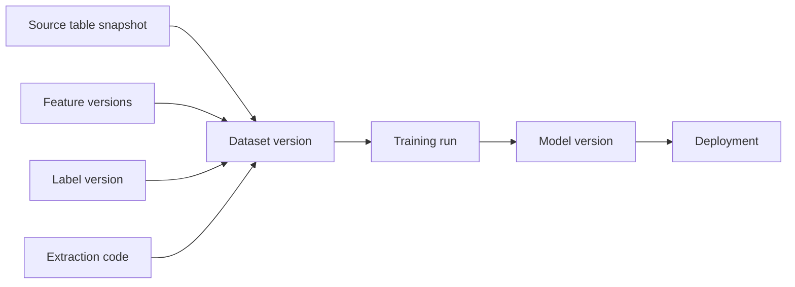
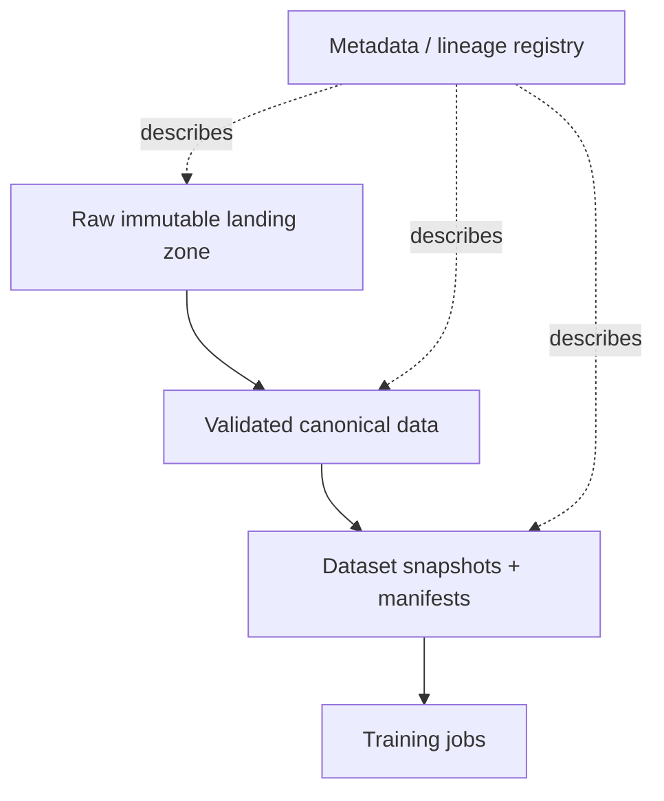

# データセット管理とバージョニング

> **翻訳についての注記:** 本ドキュメントは英語原文 `16-ml-systems/11-dataset-management-versioning.md` を日本語に翻訳したものです。コードブロック、YAML、SQL、Mermaidダイアグラムは原文のまま維持しています。

## TL;DR

データセットはファイルではありません。世界のあるスライスについての再現可能な主張です。本番MLでは、データセットがモデルの仕様なので、データセット管理はコードにおけるソース管理と同じ役割を果たします: 振る舞いを追跡可能、レビュー可能、再構築可能にするのです。難しいのはテラバイトを安く保存することではありません。難しいのは、不変性、ポイントインタイム再構築、分割の再現性、リネージ、プライバシー削除、そしてスキーマを変えずに意味が変わったデータセットの検出です。「6月のデータで訓練した」という訓練実行は再現可能ではありません。ソースバージョン、抽出時刻、特徴量バージョン、ラベル定義、観測ウィンドウ、分割割り当て、コンテンツハッシュを固定した訓練実行が再現可能なのです。核となる不変条件は単純です: **すべてのモデルは不変のデータセットスナップショットへ追跡可能でなければならず、すべてのデータセットスナップショットは再構築可能であるか、明示的に保持されなければならない。**

---

## なぜデータセット管理がML再現性の根なのか

伝統的なソフトウェアは通常、ソースコード、依存関係、コンパイラ設定から再構築できます。MLはできません。ソースコードはレシピにすぎず、データセットは材料のひとつ — しばしば支配的な材料 — です。コードを固定したままデータセットを変えれば、学習される振る舞いは変わります。つまりデータセットバージョニングはデータサイエンティストの利便性ではありません。信頼性のプリミティブです。

障害モードはお馴染みです。チームが3月にモデルを訓練しデプロイする。6月に品質が退行する。誰かが振る舞いを比較するために3月のモデルを再現しようとするが、ウェアハウスのテーブルはバックフィルされ、遅延イベントが到着し、削除された行は消え、ラベルポリシーが変わり、特徴量定義がその場で更新されていた。クエリは今も走るが、3月のモデルが見たデータセットはもう返さない。チームは*ある*モデルは再構築できても、*その*モデルは再構築できない。ロールバック、監査、デバッグは今や当て推量です。

エンジニアリングの教訓は、訓練に使われたデータセットはリリースアーティファクトだということです。アイデンティティ、所有権、リネージ、保持、互換性ルールが必要です。データセットコントラクトのないモデルアーティファクトは、ソース管理のないバイナリのようなものです: 動くかもしれませんが、説明できません。

---

## データセットのアイデンティティ: 正確には何をバージョニングしているのか

データセットバージョンは、ストレージパス以上のものを識別しなければなりません。`s3://bucket/train/2026-06` のようなパスは場所にすぎません。どの論理データが表現されているか、どのコードがそれを生んだか、どのラベル定義が使われたか、遅延イベントが含まれるか、明日2人の読み手が同じバイトを見るか — 何も述べていません。

本番のデータセットバージョンは少なくとも以下を記録すべきです:

```yaml
dataset: fraud_training_set
version: 2026-06-24.3
purpose: train
created_at: 2026-06-24T03:12:00Z
sources:
  transactions: { table: warehouse.transactions, snapshot: 881204 }
  chargebacks:  { table: warehouse.chargebacks, snapshot: 881198 }
features:
  - account_risk:v12
  - device_velocity:v7
labels:
  name: transaction_fraud
  version: v6
  observation_window_days: 90
extraction_code:
  repo: org/ml-pipelines
  commit: 441c720
split_policy:
  type: time_based
  train_until: 2026-04-01T00:00:00Z
  validation_until: 2026-05-01T00:00:00Z
content_hash: sha256:9f86d08...
row_count: 128941337
schema_hash: sha256:44aa91...
owner: fraud-ml
retention_until: 2031-06-24
```

アイデンティティには3つの層があります。**論理的アイデンティティ**はデータセットが何を意味するかを述べます: ターゲット、母集団、時間範囲、ラベル定義。**来歴のアイデンティティ**は何がそれを生んだかを述べます: ソーススナップショット、コードコミット、特徴量バージョン。**物理的アイデンティティ**はどのバイトがマテリアライズされたかを述べます: コンテンツハッシュ、スキーマハッシュ、ストレージ位置。3つすべてが必要です。物理的不変性のない論理的アイデンティティは約束にすぎません。論理的意味のない物理的バイトはParquetファイルの山です。

---

## クエリではなくスナップショット

最も一般的な再現性の誤りは、SQLクエリをデータセットバージョンとして扱うことです。クエリはスナップショットではありません。実行時点で基底テーブルが意味するものを返すプログラムです。

```sql
SELECT *
FROM transactions t
JOIN chargebacks c USING (transaction_id)
WHERE t.created_at >= '2026-01-01'
```

このクエリは、テキストが決して変わらなくても可変です。遅延イベントが到着します。バックフィルが履歴を書き換えます。チャージバックの状態が変わります。プライバシーのために行が削除されます。ソーススキーマにenum値が追加されます。クエリは安定しています。結果はそうではありません。

修正はスナップショットです: すべてのソース読み取りを不変のバージョンに束縛すること。ウェアハウスとレイクハウスのテーブルフォーマットは異なるメカニズムを提供します — BigQueryスナップショット、Snowflakeのタイムトラベル、Iceberg/Delta/Hudiのテーブルバージョン、オブジェクトストアのマニフェスト — しかし不変条件は同じです: 訓練データセットは不変の入力の関数でなければなりません。

```text
dataset_snapshot = extraction_code(commit)
                 + source_table_versions
                 + feature_versions
                 + label_version
                 + split_policy
```

どの項でも固定されていなければ、再現性は壊れています。`latest` は敵です。`current_features` は敵です。`main` は敵です。データセットコントラクトは動くエイリアスではなく、正確なバージョンを名指ししなければなりません。

### タイムトラベルは実際どう動くか — そしていつ静かに止まるか

レイクハウスのテーブルフォーマットはスナップショットをほぼ無料にします。そのメカニズムを理解すれば、なぜ安いのか、どこで壊れるのかの両方がわかります。Icebergテーブルは不変メタデータの木です: テーブルポインタがメタデータファイルを指名し、それが*スナップショット*を列挙します。各スナップショットはマニフェストリストを指し、各マニフェストは統計付きのデータファイルを指名します。コミットは新しいデータファイルと新しいメタデータ木を書きます — 古いファイルは決して変更しません:

```text
table pointer → metadata.json
                 ├─ snapshot 881198  → manifest-list → [file1, file2, ...]
                 ├─ snapshot 881204  → manifest-list → [file1, file3, ...]   (file2 replaced)
                 └─ snapshot 881219  → manifest-list → [...]
```

古いスナップショットの読み取りは、古い木を読むだけです — だからデータセットコントラクトで `snapshot: 881204` を固定するコストは書き込み時ゼロなのです:

```sql
-- Iceberg (Spark SQL)
SELECT * FROM warehouse.transactions VERSION AS OF 881204;
SELECT * FROM warehouse.transactions TIMESTAMP AS OF '2026-06-24 03:00:00';

-- Delta Lake
SELECT * FROM transactions VERSION AS OF 812;
DESCRIBE HISTORY transactions;   -- maps versions to commits, jobs, and operations

-- Snowflake
SELECT * FROM transactions AT (TIMESTAMP => '2026-06-24 03:00:00'::timestamp_tz);
```

罠は、**タイムトラベルにはガベージコレクタがあり、そのデフォルトはモデルの寿命よりはるかに短い**ことです。Deltaの `VACUUM` は、デフォルト7日の保持ウィンドウの後に参照されないファイルを削除します。Icebergの `expire_snapshots` メンテナンスも同じことをします。Snowflakeのタイムトラベルはデフォルト1日、最大90日です。`VERSION AS OF 812` を記録した訓練実行は、清掃係が来週削除する木へのポインタを記録したのです。スナップショットの固定が再現性であるのは、固定されたスナップショットが*保持されている*場合だけです。つまりデータセット管理は、(a) 訓練で消費されたスナップショットをテーブルのメンテナンスポリシーに登録して失効から除外するか、(b) 訓練ビューを独自のコンテンツアドレス化されたマニフェストへ外部にマテリアライズし — 次節のパターン — ソーステーブルを自由に失効させるか、のいずれかをしなければなりません。成熟したプラットフォームのほとんどは訓練セットには (b) を、短命の実験にのみ (a) を行います。スナップショットを永遠に除外することは、すべてのソーステーブルを無限のアーカイブに変えてしまうからです。

Git型のツールは、異なる機構で同じ設計空間を占めます: **DVC**はコンテンツハッシュ化されたデータオブジェクトをリモートに保存し、小さな `.dvc` ポインタファイルをgitにコミットします。`git checkout && dvc checkout` があらゆる過去のデータセットの正確なバイトを復元します。**lakeFS**はオブジェクトストアの名前空間全体にgitのセマンティクス(ブランチ、コミット、マージ)を被せ、訓練ジョブはコミットIDに対して走り、バックフィルはブランチ上でステージしてマージ前にレビューできます。メカニズムはIcebergと異なりますが、購入される不変条件は同一です: データセットのアイデンティティはハッシュでアドレスされる不変の参照であり、決してパスではありません。

---

## 不変性とバックフィルの罠

バックフィルは必要です。バグを訂正し、遅延データをロードし、履歴の欠落を修復します。同時に危険でもあります。見かけ上の過去を書き換えるからです。

特徴量パイプラインが2週間、失敗ログインを過小に数えていたとします。データエンジニアがバグを直し、特徴量テーブルをバックフィルします。将来の訓練は訂正済みの値を使うべきです。しかし先月訓練されたモデルは誤った値を使いました。それが本番で実際に提供されていたものだからです。バックフィルが履歴をその場で上書きすれば、プラットフォームは、モデルの実際の訓練データと、それが対応した提供時の世界を再構築する能力を失います。

正しいパターンは**訂正を追記し、意味を上書きしない**ことです:

```text
feature_values_v7_original
  account_id, feature_time, value, observed_at

feature_values_v7_correction_2026_06_24
  account_id, feature_time, corrected_value, observed_at, correction_reason

feature_values_v8
  new canonical definition after correction
```

訓練では、パイプラインはどの真実が欲しいかを選ばなければなりません。過去のモデルを再現するには、当時存在したままのビューを使う。バグ修正後に新モデルを訓練するには、訂正版か新しい特徴量バージョンを使う。どちらも正当です。混同することは正当ではありません。

これはデータベースの時制モデリングを映しています。**有効時間(valid time)** — 事実がドメインで真であった時 — と、**トランザクション時間(transaction time)** — システムがそれを知り、保存した時 — があります。MLデータセットはしばしば両方を必要とします。ラベルは1月の取引について有効でも、観測は3月かもしれません。特徴量は10:00のイベントを記述しても、利用可能になるのは10:10かもしれません。再現可能なデータセットは、意思決定または訓練の時点でモデルに利用可能だったものを尊重しなければなりません。

---

## 分割の再現性: メトリクスドリフトの隠れた源

train/validation/testの分割はデータセットバージョンの一部です。固定されていなければ、オフラインメトリクスは比較可能ではありません。

ランダム分割は簡単なのでよく使われますが、記録されたシードと割り当てテーブルのないランダムは再現可能ではありません。さらに悪いことに、ランダムな行分割はしばしば意味論的に誤っています。未来予測のモデルは時間ベースの分割を使うべきです。新しいユーザー、加盟店、文書、患者へ一般化すべきモデルは、エンティティ非交差(entity-disjoint)の分割を使うべきです。レコメンダーは、同じユーザーのインタラクションがtrainとtestを跨いで漏れるのを防ぐため、ユーザーレベルの分割が必要かもしれません。

| 分割タイプ | 正しいのは | 防ぐリーク |
|---|---|---|
| ランダム行 | IIDな例、時間・エンティティ依存なし | 最小限。しばしば弱すぎる |
| 時間ベース | 未来の振る舞いの予測 | 未来での訓練 |
| エンティティ非交差 | 未知のエンティティへの一般化 | エンティティ履歴の暗記 |
| グループ / クラスタ | グループ内の例が相関 | グループ間の汚染 |
| ポリシー時代分割 | 新しい提供ポリシー下での評価 | 旧ポリシーのログが新ポリシーの読み取りを汚染 |

分割はアドホックに再計算するのではなく、割り当てとしてマテリアライズすべきです:

```text
split_assignments
  example_id
  dataset_version
  split: train | validation | test | holdback
  assignment_reason
  assignment_seed
```

これは官僚的に見えます — 誰かが異なるシードで分割を再実行したためにメトリクスが変わるまでは。検証セットが測定器の一部なら、それを変えることは測定器を変えることです。そのように扱ってください。

エンティティ非交差の分割では、最も強い実装はシード付きシャッフルではなく*ステートレスハッシング*です。データセットが成長しても安定だからです — エンティティは、何も保存も調整もせずに、データセットバージョンを跨いでさえ、永遠に自分の割り当てを保ちます:

```python
import hashlib

def split_of(entity_id: str, salt: str = "fraud_v6") -> str:
    h = int(hashlib.sha256(f"{salt}:{entity_id}".encode()).hexdigest(), 16) % 100
    if h < 80:  return "train"
    if h < 90:  return "validation"
    return "test"
```

ソルトは[オンライン実験](./08-online-experiments.md)における実験ソルトと同じ役割を果たします: 変更すると母集団が再シャッフルされるため、データセットコントラクトの一部であり、決して静かに変わってはなりません。シード付きの `random.shuffle` は、行が1つ追加されたり、ライブラリのバージョンがRNGストリームを変えたりした瞬間に異なる答えを返します。ハッシュは、どのマシンでも、どの言語でも、何年でも同じ答えを返します — 測定器が必要とする性質です。マテリアライズされた `split_assignments` テーブルは今も書く価値があります(監査者とデバッガーが読むものです)が、ハッシングを使えば、それは割り当ての*源*ではなく*記録*になり、両者を相互検証できます。

---

## データセットマニフェスト: MLデータのコンテンツアドレッシング

大きなデータセットは通常、多数のファイルまたはパーティションです。データセットバージョンはマニフェスト — 不変オブジェクトとそのハッシュのリスト — で表現されるべきです。

```text
manifest fraud_training_set@2026-06-24.3
  part-00001.parquet sha256:aaa... rows=1048576 bytes=88MB
  part-00002.parquet sha256:bbb... rows=1048576 bytes=91MB
  ...
manifest_hash sha256:ccc...
```

マニフェストは3つの性質を与えます:

1. **再現可能な読み取り** — 訓練ジョブは、たまたまプレフィックスに一致するファイルではなく、マニフェストに指名されたファイルを読みます。
2. **完全性チェック** — 破損または置換されたファイルはハッシュ不一致で検出されます。
3. **キャッシュ可能性** — パイプラインのステップはパスやタイムスタンプではなく、マニフェストハッシュをキーにできます。

コンテンツアドレッシングは微妙なキャッシュバグも防ぎます。データセットパスが新しい内容に再利用されると、パスをキーとするパイプラインキャッシュは古い特徴量や古い評価結果を返すかもしれません。キーにマニフェストハッシュが含まれていれば、新しいバイトは自動的に新しいキャッシュキーを作ります。

---

## スキーマは意味論ではない

データセット検証は通常スキーマチェックから始まります: 必須列、型、null許容性。これらは必要ですが不十分です。最も危険なデータセット変更は、スキーマ互換の意味論的変更です。

例:

- `amount` がドルからセントに変わる。
- `country` が請求国からIP由来の国に切り替わる。
- `active_user` が7日アクティブから30日アクティブに変わる。
- `label=1` が確認済み不正から疑わしい不正に変わる。
- 以前は除外されていたテストアカウントが行に含まれるようになる。

これらはすべて型チェックを通過し得ます。したがってデータセットコントラクトには**意味論的検証**が必要です: 分布チェック、既知の不変条件、ソース母集団のカウント、オーナーがレビューする定義変更。

```yaml
expectations:
  amount:
    min: 0
    p99_max_change_vs_baseline: 0.25
    unit: USD_cents
  country:
    allowed_values_source: iso_3166
    max_unknown_rate: 0.001
  population:
    exclude_test_accounts: true
    expected_daily_volume_change: [-0.20, 0.20]
```

unitフィールドは装飾ではありません。意味論的なアサーションです。システムはすべての意味論的性質を証明できませんが、重要なものをチームに明記させ、観測可能なプロキシが動いたときに警告することはできます。

---

## データセットリネージ: 来歴と影響

データセットリネージは2つの質問に答えます:

1. **来歴(Provenance)** — 何がこのデータセットを生んだか?
2. **影響(Impact)** — 何がこのデータセットまたはソースに依存しているか?

来歴はデバッグと監査に必要です。影響はインシデント時に必要です。ソーステーブルが1週間、取引を二重計上していたなら、プラットフォームは、どのデータセットがそのソースバージョンを含んでいたか、どのモデルがそれらのデータセットで訓練されたか、どのデプロイメントがそれらのモデルを提供したかに答えられなければなりません。



リネージストアはリレーショナルテーブルとして始められます。最初からグラフデータベースが必要なことは稀です。重要なのは、すべてのエッジがwikiに手で書かれるのではなく、パイプラインによって自動的に書かれることです。手動のリネージは古びたリネージです。

---

## プライバシー削除と再現性の衝突

データセット保持はプライバシーと衝突します。再現性は不変スナップショットを保持せよと言います。プライバシー法は主体のデータの削除または匿名化を要求するかもしれません。これは文書化の問題ではなく、システム設計のトレードオフです。

一般的なアプローチは3つあります:

**ハード削除**は保持されたデータセットからレコードを取り除きます。削除を強く満たしますが、ビット単位の再現性を壊します。プラットフォームは、古いモデルがもはや正確に再構築できないことを記録しなければなりません。

**トゥームストーン+再構築**は削除された主体をマークし、将来のマテリアライズドビューから除外します。過去のマニフェストは、保持期限が切れるまで暗号化またはアクセス制限されたまま残ります。厳格なアクセスの下で監査を保存しますが、すべての削除要件を満たさないかもしれません。

**集約または匿名化された保持**は、集約的な振る舞いの再現性のために派生統計や不可逆に匿名化された行を保存し、直接識別子を削除します。プライバシーリスクを減らしますが、正確な再訓練は支えられないかもしれません。

重要な性質は正直さです。レジストリは、データセットが**再構築可能(rebuildable)**、**保持(retained)**、**プライバシー編集済み(privacy-redacted)**、**期限切れ(expired)**のどれであるかを記録すべきです。期限切れのデータセットに依存するロールバック計画は計画ではありません。

---

## データセットストレージアーキテクチャ

実用的なデータセットプラットフォームには4つのストアがあります:



**Rawの不変ランディング**はソースから到着したものを保存します。追記専用で、リプレイに使われます。

**正規化済み検証データ**はパース、重複排除、スキーマ正規化、品質ゲートを適用します。

**データセットスナップショット**は、マニフェスト、分割割り当て、ラベル/特徴量バージョンを持つ、目的別の訓練/評価データセットです。

**メタデータレジストリ**は所有権、リネージ、品質レポート、保持、使用状況を記録します。

アンチパターンは、可変の本番テーブルから直接訓練することです。最初のモデルには速く、その後は永遠に高くつきます。将来のすべてのデバッグセッションが、訓練時にデータが何を意味していたかをリバースエンジニアリングしなければならないからです。

---

## 障害モード

**クエリをバージョンとして扱う**ことは再現性の根本的な失敗です: チームはSQLテキストを保存しますが、不変のソーススナップショットや出力マニフェストは保存しません。クエリの再実行は異なるデータセットを返します。防御: ソースバージョンをスナップショットし、コンテンツアドレス化されたマニフェストをマテリアライズする。

**バックフィルによる履歴の書き換え**は、訂正されたデータが、古いモデルが実際に見たものを上書きするときに起きます。防御: 訂正を追記し、意味論的変更をバージョニングし、トランザクション時間の履歴を保存する。

**分割ドリフト**は、validation/testのメンバーシップが実行間で変わり、メトリクス比較を無意味にするときに起きます。防御: シードとポリシーを記録した、マテリアライズされた分割割り当て。

**スキーマ互換の意味論的ドリフト**は、型が有効なまま、単位、定義、母集団、ラベルの意味を変えます。防御: 意味論的コントラクト、分布チェック、オーナーがレビューするバージョン変更。

**リネージの欠落**は、どのモデルが破損したソースを使ったかにチームが答えられなくします。防御: ソースからデータセット、訓練実行、モデルへの、パイプラインが自動的に書くリネージエッジ。

**プライバシー削除がロールバックを壊す**のは、保持されたモデルが、もはや再構築できないデータセットに依存するときです。防御: データセット状態の追跡 — 保持、編集済み、期限切れ — と、データ可用性を確認するロールバック検証。

**マニフェスト/パスの不一致**は、パス配下のファイルが変わるのにデータセットバージョン名が変わらないときに起きます。防御: 実際のアイデンティティとしてのコンテンツハッシュとマニフェストハッシュ。

---

## 判断のフレームワーク

MLのデータセット管理を設計するとき、問うてください:

1. すべての本番モデルは、訓練に使った正確なデータセットスナップショットを名指しできるか?
2. そのスナップショットはクエリか、それとも不変のソースバージョン+コンテンツアドレス化されたマニフェストか?
3. ラベル定義、特徴量バージョン、分割割り当て、抽出コードは固定されているか?
4. プラットフォームは、訂正済みの現在の真実と、モデルが実際に見た過去の真実の両方を再現できるか?
5. 意味論的変更はバージョニングされているか、それともスキーマ変更だけか?
6. 悪いソースデータから影響を受けたデプロイ済みモデルまでの影響クエリに答えられるか?
7. 保持/プライバシーポリシーは、データセットが再構築可能なままかどうかを述べているか?

これらのどれかの答えがnoなら、モデルのメトリクスは存在しても、監査級ではありません。データセットはモデルの仕様です。コードと同じ真剣さで管理してください。

---

## 要点

1. データセットは世界のあるスライスについての再現可能な主張であり、ファイルパスやSQLクエリではありません。
2. データを変えるとモデルの振る舞いが変わるため、データセットバージョニングはMLにおけるソース管理に相当します。
3. 不変のソーススナップショット、特徴量バージョン、ラベル定義、抽出コード、分割割り当て、スキーマ、コンテンツハッシュを固定すること。
4. バックフィルは、古いモデルが実際に見た過去のデータを消してはなりません。訂正を追記し、意味論的変更をバージョニングすること。
5. 分割は測定器の一部であり、気軽に再計算するのではなくマテリアライズしなければなりません。
6. コンテンツアドレス化されたマニフェストは、大きなデータセットを再現可能、完全性検証可能、キャッシュ可能にします。
7. スキーマチェックは浅い失敗しか捕まえません。意味論的ドリフトには分布チェック、不変条件、オーナーがレビューするコントラクトが必要です。
8. リネージは来歴と影響の両方に、自動的に答えなければなりません。
9. プライバシー削除と再現性は衝突します。スナップショットが保持、編集済み、期限切れ、再構築可能のどれかを追跡すること。
10. 可変の本番テーブルから直接訓練することは、バージョン管理されていないコードをデプロイすることのデータセット管理版です。

---

## 参考文献

1. [Hidden Technical Debt in Machine Learning Systems](https://proceedings.neurips.cc/paper_files/paper/2015/file/86df7dcfd896fcaf2674f757a2463eba-Paper.pdf) — Sculley et al., 2015
2. [Data Validation for Machine Learning](https://mlsys.org/Conferences/2019/doc/2019/167.pdf) — Breck et al., 2019
3. [Datasheets for Datasets](https://arxiv.org/abs/1803.09010) — Gebru et al., 2018
4. [Delta Lake: High-Performance ACID Table Storage over Cloud Object Stores](https://www.vldb.org/pvldb/vol13/p3411-armbrust.pdf) — Armbrust et al., VLDB 2020
5. [Apache Iceberg Table Format](https://iceberg.apache.org/spec/) — スナップショットとマニフェストに基づくレイクハウステーブル
6. [DVC Documentation](https://dvc.org/doc) — データとモデルのバージョニングの概念
7. [レイクハウスとオープンテーブルフォーマット](../13-data-pipelines/05-lakehouse-table-formats.md)
