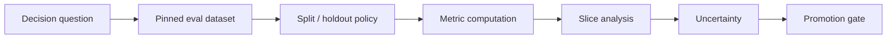

# オフライン評価とメトリクス設計

> **翻訳についての注記:** 本ドキュメントは英語原文 `16-ml-systems/12-offline-evaluation-metrics.md` を日本語に翻訳したものです。コードブロック、YAML、Mermaidダイアグラムは原文のまま維持しています。

## TL;DR

オフライン評価は、悪いモデルを棄却する最も安い場所であり、良く見えるモデルを信じる最も危険な場所です。それは、バイアスされ、遅延し、リークし、古び、プロダクト目標とずれているかもしれないラベルと分割を使い、世界の凍結された近似の上で振る舞いを測定します。中心的な規律は、評価をノートブックのセルではなく測定システムとして扱うことです: メトリクスが支える意思決定を定義し、データセットと分割を固定し、主要メトリクスをガードレールから分離し、スライスを評価し、不確実性を定量化し、較正と閾値を確認し、オフラインの改善を本番のインパクトと決して混同しないこと。オフライン評価は**「この候補はライブトラフィックに晒す価値があるか?」**に答えます。**「これはビジネスを改善するか?」**には答えません。その最終的な因果の問いはオンライン実験のものです。

---

## オフライン評価の仕事

オフライン評価が存在するのは、ライブトラフィックが高価でリスクがあるからです。モデルがシャドウ、カナリア、実験に到達する前に、チームには現行モデルより明白に悪くないという証拠が必要です。オフライン評価はその最初のフィルタを提供します。

フィルタには3つの仕事があります:

1. **退行を安く棄却する** — 過去データで負ける候補に本番のリスクを費やさない。
2. **モデル変種を速く比較する** — アーキテクチャ、特徴量、ハイパーパラメータ、訓練ウィンドウから選ぶ。
3. **デプロイ判断を準備する** — 閾値の振る舞い、較正、スライスリスク、期待される運用トレードオフを推定する。

キーワードは*フィルタ*です。オフライン評価は証明ではありません。必要だが不十分なゲートです。オフラインデータセットは歴史的で、旧ポリシーの下でログされ、不完全なプロセスでラベルされ、新モデルが引き起こしたであろう結果をしばしば欠いています。候補はオフラインで勝ちオンラインで負けることがあります。メトリクスが誤った目標を測定した、分割がリークした、ログが現行モデルにバイアスされていた、世界が変わった、などの理由で。

正しい姿勢は懐疑的であることです: オフライン評価は騙しにくくあるべきですが、最終判定として信頼されるべきではありません。

---

## 評価は測定システムである

信頼できるオフライン評価は、あらゆる測定システムと同じ構造を持ちます:



各段階が結果を無効化し得ます。意思決定の問いが曖昧なら、メトリクスは誤ったものを最適化します。データセットが可変なら、結果は再現できません。分割がリークすれば、スコアは水増しされます。スライス分析がなければ、平均が害を隠します。不確実性がなければ、ノイズが進歩に見えます。ゲートが非公式なら、チームはいいとこ取りをします。

したがって本番の評価レポートはバージョン管理されたアーティファクトであるべきです:

```yaml
candidate_model: fraud_classifier:v42
baseline_model: fraud_classifier:v41
evaluation_dataset: fraud_eval:2026-06-24.3
label: transaction_fraud:v6
split: time_holdout_2026_05
primary_metric: recall_at_0.5_percent_fpr
guardrails:
  - precision_at_current_review_capacity
  - false_positive_rate_by_country
  - p99_inference_latency
uncertainty: bootstrap_95_ci
result: blocked
reason: japan_slice_fpr_regression
```

これはデプロイメントコントラクトの評価版です。意思決定を再現可能かつレビュー可能にします。

---

## メトリクスではなく意思決定から始める

メトリクスは計算するのは簡単で、選ぶのは難しい。正しいメトリクスは、モデルが支えるプロダクトの意思決定に依存します。

不正モデルは単に不正を分類するのではありません。レビューチームの容量制約の下で、取引を許可、レビュー、ブロックするかを決めます。レコメンダーは単にクリックされたアイテムをランクするのではありません。多様性を潰さずに長期満足を改善すべきスレート(一覧)を選びます。医療リスクモデルは単にAUCを最大化するのではありません。希少な介入容量のために患者に優先順位を付けます。

つまり、メトリクスは意思決定の面に一致すべきです:

| 意思決定タイプ | より良いメトリクス族 | 理由 |
|---|---|---|
| 固定閾値下の二値アクション | 閾値での精度、再現率、FPR/FNR | 実際の動作点を測定 |
| 固定容量のレビューキュー | Precision@K、recall@K、lift@K | 容量が制約 |
| ランキングリスト | NDCG、MAP、MRR、recall@K | 順位が重要 |
| 下流ポリシーが使う確率 | 較正、Brierスコア、log loss | 確率の意味が重要 |
| 稀少イベント検出 | PR-AUC、固定FPRでの再現率 | ROC-AUCは低精度を隠し得る |
| 非対称コストの回帰 | 分位損失、重み付き誤差 | 過大予測と過小予測は異なる |
| レコメンデーションのスレート | オフラインランクメトリクス+多様性/カバレッジ | 集合の品質が重要 |

アンチパターンは、標準だからという理由でメトリクスを選ぶことです。AUCは標準ですが、無関係かもしれません。ビジネスが1日1万件しかレビューできないなら、重要なのは上位1万件の品質であり、全ケースの平均ランキングではありません。モデル出力が較正済みリスク推定として使われるなら、確率値そのものがコントラクトなので、ランキングメトリクスでは不十分です。

設計レビューはメトリクス選択をこのような表に強制すべきです:

| システム | 意思決定の制約 | 主要メトリクス | ガードレール | 診断 |
|---|---|---|---|---|
| 不正レビュー | 2万件/日のレビュー、低い偽陰性許容 | Precision@20Kと固定FPRでの再現率 | 国別偽陽性率、レビューSLA、チャージバック金額 | PR曲線、スコア十分位、特徴量ドリフト |
| 与信審査 | 法的/金融の意思決定、較正済みリスク | ポリシー下の期待コストと較正誤差 | 不利益理由の品質、保護スライスの格差、不服申立率 | ROC/PR-AUC、単調性チェック |
| 検索ランキング | 順位に敏感な関連性 | NDCG@KまたはMRR | レイテンシ、カバレッジ、多様性、ゼロ件率 | recall@K、クエリクラス別メトリクス |
| レコメンデーションのスレート | 長期満足、探索 | オンライン実験が主。オフラインNDCG/recallはフィルタ | 多様性、クリエイター/アイテム露出、解約プロキシ | 候補再現率、新規性、人気バイアス |
| 予測(フォーキャスト) | 非対称な過大/過小コスト | pinball損失または重み付き絶対誤差 | 在庫切れ/過剰在庫率 | 期間別残差、季節性誤差 |
| 不正利用モデレーション | 不服申立経路を持つ害の最小化 | 有界の偽陽性/不服申立負荷での再現率 | 保護スライスFPR、レビュアー負荷、取り消し率 | ポリシークラス別混同行列 |

主要メトリクスは本番の意思決定に対応すべきです。ガードレールは、主要メトリクスが喜んで破ってしまう制約を守ります。診断は失敗を説明しますが、結果が判明した後に静かに昇格基準になってはなりません。

---

## 正解率(Accuracy)はたいてい誤ったメトリクス

正解率は単純なので魅惑的です。そして多くの本番MLシステムにとって誤っています。

不均衡なドメインでは、正解率は主に多数派クラスを測定します。取引の99.9%が正当なら、すべてに「正当」と予測するモデルは99.9%正確で、役立たずです。不正、不正利用、解約、医療診断、セキュリティ、インシデント検出はすべて、正解率が関心事のイベントを隠す、稀なポジティブクラスに支配されています。

均衡した正解率でさえ、コストの非対称性を隠し得ます。不正における偽陽性は正当な顧客をレビューに送るかもしれず、偽陰性はお金を失うかもしれません。コンテンツモデレーションの偽陽性は言論を検閲するかもしれず、偽陰性はユーザーを害に晒すかもしれません。これらの誤りは等しいコストを持ちません。評価メトリクスはトレードオフを明示的に符号化するか、少なくとも人間が選べるようにトレードオフ曲線を報告すべきです。

混同行列が有用なのは、この会計を強制するからです:

```text
                 Predicted positive   Predicted negative
Actual positive       TP                    FN
Actual negative       FP                    TN
```

ここから、プロダクトが実際に気にする量を導出します: 1日あたりの偽陽性、見逃した不正金額、レビューキュー負荷、不服申立量、ブロックされたユーザー率、介入容量。メトリクスは運用上の帰結に翻訳されたときに意味を持ちます。

---

## 閾値はモデルの一部である

多くのモデルはスコアを出しますが、プロダクトはアクションを取ります。スコアをアクションに写像する閾値またはポリシーは意思決定システムの一部であり、モデルと一緒に評価されなければなりません。

モデルはAUCを改善しながら、現在の閾値では悪化し得ます。より良く較正されながら、スコア分布がシフトして旧閾値がレビューキューを倍増させ得ます。偽陽性で人間を溢れさせて再現率を改善し得ます。したがってすべての評価は、閾値なしメトリクスと動作点メトリクスの両方を報告すべきです。

```text
Threshold-free:
  ROC-AUC, PR-AUC, log loss, NDCG

Operating-point:
  precision at threshold 0.92
  recall at 0.5% FPR
  review volume per day
  false positives per 10K users
  expected cost under policy_v9
```

影響の大きいシステムでは、**ポリシー曲線**を評価します:

| 閾値 | レビュー量/日 | 精度 | 再現率 | 推定コスト |
|---|---:|---:|---:|---:|
| 0.70 | 80,000 | 0.08 | 0.92 | 高い運用コスト |
| 0.85 | 25,000 | 0.21 | 0.78 | バランス |
| 0.95 | 4,000 | 0.61 | 0.41 | 見逃しすぎ |

この曲線は1つの見出しメトリクスより有用です。トレードの空間を示すからです。デプロイ時の閾値移行バグも防ぎます: `v42` のスコア分布が `v41` と異なるなら、旧閾値は旧アクション率を意味しないかもしれません。

閾値移行は明示的であるべきです。現行ポリシーが1日上位25,000件の取引をレビューするなら、候補の閾値は、古い数値カットオフの再利用ではなく、容量のマッチングで選ばれるべきことが多いのです:

```text
incumbent threshold 0.85 on v41 → 25,000 reviews/day
candidate score distribution shifted upward
reusing 0.85 on v42 → 41,000 reviews/day  (ops overload)
capacity-matched v42 threshold → 0.91 for 25,000 reviews/day
```

したがってデプロイメントバンドルはモデルとポリシーの両方を記録すべきです:

```yaml
threshold_migration:
  baseline_model: fraud_classifier:v41
  candidate_model: fraud_classifier:v42
  old_policy: fraud_policy:v9
  migration_rule: match_review_capacity
  target_capacity_per_day: 25000
  selected_threshold: 0.91
  expected_precision: 0.27
  expected_recall: 0.74
  blocked_if:
    precision_delta_ci_low_below: 0
    fpr_slice_regression: true
```

閾値ポリシーのないモデルバージョンは本番の意思決定システムではありません。単なるスコア生成器です。

---

## 較正: 数字が確率を意味しなければならないとき

ランキングモデルは順序だけが必要です。リスクモデルはしばしば較正された確率を必要とします。不正モデルが0.8を出力すれば、下流のシステムはそれを「80%の不正確率」と解釈し、それに応じてレビュー、ブロック、引当金の価格付けをするかもしれません。0.8とスコアされた例の真の率が30%なら、モデルはランキングは良くても、それを消費するすべてのポリシーを誤導します。

較正は、予測確率が観測頻度と一致するかを問います:

```text
Among examples scored 0.70-0.80, is the positive rate roughly 75%?
Among examples scored 0.90-1.00, is the positive rate roughly 95%?
```

一般的なメトリクスにはBrierスコア、期待較正誤差、較正曲線、log lossがあります。較正はスライス別に評価されなければなりません。モデルはグローバルに較正されていても、ある国、デバイス、テナント、保護グループについては較正が崩れていることがあるからです。

較正は基底率が変わるとドリフトもします。不正の有病率が1%のときに訓練されたモデルは、有病率が3%になれば、ランキングがまともなままでも確率を過大・過小評価するかもしれません。だからこそデプロイ後に予測分布と遅延ラベルの監視が重要なのです。

具体的な較正レポートは、予測をビンに分け、予測リスクと観測頻度を比較します:

| スコアビン | 件数 | 平均予測値 | 観測ポジティブ率 | ギャップ | アクション |
|---|---:|---:|---:|---:|---|
| 0.00-0.10 | 800,000 | 0.04 | 0.05 | +0.01 | 合格 |
| 0.10-0.30 | 160,000 | 0.18 | 0.16 | -0.02 | 合格 |
| 0.30-0.60 | 35,000 | 0.43 | 0.31 | -0.12 | 再較正 |
| 0.60-1.00 | 5,000 | 0.78 | 0.52 | -0.26 | 高リスクポリシーはブロック |

この表は単一のBrierスコアより行動につながります。確率のコントラクトがどこで壊れるか、その破れが意思決定を駆動する閾値の近くで起きているかを示します。規制対象または金融の意思決定では、較正は事前宣言されたスライス別にも報告すべきです。グローバルな較正は、グループ固有の過大・過小推定を隠し得ます。

この表のスカラー要約が期待較正誤差(ECE) — ビンごとのギャップのトラフィック加重平均 — で、計算してみればいかに小さな機構かがわかります:

```python
def ece(y_true, y_score, n_bins=10):
    bins = np.minimum((y_score * n_bins).astype(int), n_bins - 1)
    err = 0.0
    for b in range(n_bins):
        mask = bins == b
        if mask.sum() == 0:
            continue
        gap = abs(y_score[mask].mean() - y_true[mask].mean())
        err += (mask.sum() / len(y_true)) * gap
    return err
# The table above → ECE ≈ 0.8M/1M×0.01 + 0.16×0.02 + 0.035×0.12 + 0.005×0.26 ≈ 0.017
```

算術に見える罠に注意: 巨大な低スコアビンが加重平均を支配するため、見出しのECEは0.017 — 「よく較正されている」 — でありながら、実際にブロック判断を駆動する高スコアビンは12ポイントと26ポイントずれています。意思決定システムでは、ECE*と*、ポリシーが作動するスコア領域に限定したビン別の表を報告してください。

較正が壊れているがランキングは良い場合、修正は事後の再較正器です — ホールドアウトされた較正分割(訓練データでは決してない)でフィットされた小さな単調関数で、モデルバンドルの一部として出荷されます:

```python
from sklearn.isotonic import IsotonicRegression

calibrator = IsotonicRegression(out_of_bounds="clip")
calibrator.fit(scores_calib, labels_calib)     # held-out split, not train
p_calibrated = calibrator.predict(scores_prod)
```

サンプルサイズが大きいときはアイソトニック回帰がデフォルトです(あらゆる単調な歪みにフィットします)。Plattスケーリング — スコアへのロジスティックフィット — は、較正例が数千未満ならより安全です。アイソトニックは過学習するからです。いずれにせよ較正器は、閾値ポリシーと同じライフサイクルを持つバージョン管理されたアーティファクトです: 基底率が動けば再訓練され、スライス別に評価され、モデルと一緒にロールバックされます。昨年の1%不正有病率でフィットされた較正器を持つ再較正済みモデルは、有病率が3%になると静かに較正崩れに戻ります — だからこそ[モデル監視](./04-model-monitoring.md)の予測分布と遅延ラベルのモニターは、較正器のヘルスチェックでもあるのです。

---

## ランキング評価: 順位、候補、欠けた反事実

ランキングメトリクスは、独立した例ではなく、順序付きリストを評価します。NDCG、MRR、MAP、recall@K、ヒット率、precision@Kはすべて順位を符号化します: ランク1のアイテムは、同じアイテムがランク20にあるより重要です。

隠れた問題は候補の可用性です。オフラインのランキング評価は通常、ログされたインプレッションまたはサンプルされたネガティブを使います。つまり評価は、以前のシステムが取得または表示したアイテムしか知りません。新しい検索モデルは、旧システムが決してログしなかった優れた候補を見つけるかもしれません。オフライン評価はそれを評価しないかもしれません。逆に、サンプルされたネガティブは簡単すぎて、メトリクスを水増しするかもしれません。

レコメンダーと検索システムでは、まともなオフラインレポートは以下を明記すべきです:

1. 評価に使われた候補ソース、
2. ネガティブサンプリング戦略、
3. 露出とポジションバイアスが補正されているか、
4. メトリクスがユーザー/クエリ単位で計算されてから平均されているか、
5. 関連性だけでなく、カバレッジと多様性のメトリクス。

候補セットのコンテキストのないランキングメトリクスは不完全です。候補生成器が変わったなら、旧候補セット上のランキング評価は誤った問いに答えています。

主力のNDCGは、高関連性のアイテムを早く置くことに、対数的な順位割引で報酬を与えます — 小さな例を1つ計算すれば神秘性は消えます:

```text
Query with graded relevances; model ranks items in order [3, 2, 0, 1]  (rel of each shown item)

DCG@4  = 3/log2(2) + 2/log2(3) + 0/log2(4) + 1/log2(5) = 3.00 + 1.26 + 0 + 0.43 = 4.69
Ideal ranking [3, 2, 1, 0]:
IDCG@4 = 3.00 + 1.26 + 0.50 + 0 = 4.76
NDCG@4 = 4.69 / 4.76 ≈ 0.985
```

2つの計算慣習が、チームとライブラリを跨いで結果を静かに変えます: ゲインが線形(`rel`)か指数(`2^rel − 1`)か、そして関連アイテムのないクエリをスキップするかゼロと採点するか。慣習を変えた2つの実行間の「NDCG改善」は結果ではなくバグです — 評価ハーネスは、ラベル定義がバージョニングされるのと同じように、両方の選択をメトリクスの定義に固定すべきです。

---

## リーク: 壊れたモデルを認証する評価

リークは、予測時に利用できない情報を評価例が含むときに起きます。普通のデータバグより悪質です。モデルをより良く見せるからです。

一般的なリーク源:

- 時間依存の問題に対するランダム分割、
- ポイントインタイムの値ではなく最新の特徴量値の結合、
- アクション後のフィールドを特徴量として使う、
- trainとtestを跨ぐ重複、
- 新エンティティへの一般化が重要なのに、同じユーザーやエンティティがtrainとtestの両方に現れる、
- ラベルまたはラベルプロキシが特徴量に含まれる、
- 分割前に全データセットでフィットされた前処理。

良い評価パイプラインはリークチェックを自動的に走らせます:

```text
- no feature availability_time > prediction_time
- no entity overlap for entity-disjoint split
- no duplicate content hashes across train/test
- no suspicious single-feature AUC near 1.0
- preprocessing fit only on train split
- label columns excluded from feature registry
```

疑わしい特徴量のチェックは粗雑ですが有用です: 難しいドメインで1つの特徴量だけでモデルがほぼ完璧になるなら、そうでないと証明されるまでリークと仮定してください。実世界の予測がそれほど簡単なことは稀です。

---

## スライス評価: 平均は嘘をつく

集約メトリクスは退行を隠します。候補は全体のAUCを改善しながら、新規ユーザー、小さな国、保護されたクラス、大きなテナント、高額取引を害し得ます。そのスライスが重要なら、集約は防御になりません。

スライスは事前に宣言されるべきで、メトリクスが良く見えた後に発見されるだけではいけません。一般的なスライス:

- 地理と言語、
- デバイスとプラットフォーム、
- 新規ユーザー対リピーター、
- トラフィックソース、
- テナントまたは加盟店、
- アイテム/コンテンツカテゴリ、
- 金額またはリスク帯、
- 法的・倫理的に適切な場合の保護または規制対象グループ。

課題は多重比較です。何百ものスライスを検査すれば、偶然に退行するものが出ます。解決はスライスを避けることではありません。**ガードレールスライス**と**探索的スライス**を分離することです。ガードレールスライスは事前登録され、昇格をブロックできます。探索的スライスは仮説を生み、確認を必要とします。

有用なレポート形式:

| スライス | ベースライン | 候補 | デルタ | CI | ゲート |
|---|---:|---:|---:|---:|---|
| 全トラフィック | 0.812 | 0.821 | +0.009 | [+0.005,+0.013] | 合格 |
| 新規ユーザー | 0.744 | 0.731 | -0.013 | [-0.022,-0.004] | 不合格 |
| JP | 0.801 | 0.797 | -0.004 | [-0.009,+0.001] | 監視 |

要点は、修正が最も安いデプロイ前に、害を可視化することです。

---

## 不確実性: ノイズを出荷しない

オフラインメトリクスは推定値です。報告されたAUC 0.812は宇宙についての事実ではなく、有限サンプル上の推定です。候補が0.813なら、その差はノイズかもしれません。

評価は信頼区間または不確実性の推定を報告すべきです。ブートストラップ再サンプリングでしばしば十分です: ユーザーまたはエンティティを再サンプルし、メトリクスを再計算し、デルタの分布を報告します。再サンプリングの単位が重要です。レコメンダーシステムでは、行ではなくユーザーを再サンプルします。1人のユーザーのインタラクションは相関しているからです。マーケットプレイスの実験では、それらが独立単位ならマーケットやクラスタを再サンプルします。

```text
candidate - baseline PR-AUC = +0.004
95% bootstrap CI = [-0.001, +0.009]
verdict = inconclusive, not pass
```

最小限のブートストラップアルゴリズムは、評価コントラクトの一部にできるほど単純です:

```text
unit = customer_id                    # not row_id if rows are correlated
for b in 1..1000:
    sample units with replacement
    compute metric(candidate, sample)
    compute metric(baseline, sample)
    store delta_b
ci_95 = percentile(delta, [2.5, 97.5])
pass if ci_95.lower > minimum_practical_effect
```

`minimum_practical_effect` が重要です。非常に大きな評価セットでは、小さなデルタが統計的に確信できても運用上は無意味であり得ます。AUCを0.0002改善するがp99レイテンシに20msを加え、提供コストと移行リスクを増やす候補は、p値が印象的だからといって合格すべきではありません。

昇格ゲートは、点推定だけでなく、デルタとその不確実性を評価すべきです。小さくノイジーな勝利は勝利ではありません。この規律が、モデルチームがランダムな変動を進歩として出荷するのを防ぎます。

---

## ベースライン: 正しいものに勝つ

すべての評価にはベースラインが必要です。最も強いベースラインは、同じデータセットで評価された現在の本番モデルです。それがなければ、チームは絶対的な品質と改善を区別できません。

有用なベースライン:

1. **現在の本番モデル** — 本物の現職。
2. **単純なヒューリスティック** — ルールにかろうじて勝つ過剰設計のモデルを捕まえる。
3. **同じコードでの前回の訓練実行** — 訓練の分散を推定する。
4. **アブレーションモデル** — 特徴量グループが実際に役立つかを測定する。
5. **利用可能ならオラクル的上限** — 改善の余地を推定する。

ヒューリスティックのベースラインは過小評価されています。複雑なMLシステムが「人気順にランクする」や「金額閾値超の取引をレビューする」にかろうじて勝つ程度なら、運用コストを正当化しないかもしれません。MLは複雑さに見合う働きをすべきです。

---

## コスト感応評価

多くの本番の意思決定は、非対称で不均一なコストを持ちます。5ドルの取引の偽陽性は、5,000ドルの取引の偽陽性と同じではありません。深刻な不正利用の偽陰性は、軽度のスパムの偽陰性と同じではありません。

コスト感応評価は、混同行列のセルをビジネスインパクトに翻訳します:

```text
expected_cost = FP_count × cost_FP
              + FN_count × cost_FN
              + review_count × cost_review
              + latency_cost
              + fairness_or_policy_penalties
```

正確な数字は不確かかもしれませんが、書き出すことでトレードオフが公開の場に出ます。メトリクスがずれているときも明らかになります。レビューコストなしで再現率を最適化すれば、運用チームが回せないモデルを選ぶかもしれません。苦情コストなしで収益を最適化すれば、ユーザーが嫌うモデルを選ぶかもしれません。

コストモデルはバージョン管理されるべきです。プロダクトポリシーは変わるからです。`cost_policy_v3` の下で承認されたモデルは、`v4` の下では承認されないかもしれません。

---

## オフラインとオンラインのギャップ

オフラインメトリクスは構造的な理由でオンラインのインパクトを予測し損ねます:

1. **ログポリシーのバイアス** — 評価データは旧モデルによって生成された。
2. **フィードバックループ** — 新モデルは将来のデータを変える。
3. **プロキシの不一致** — オフラインラベルは本当のプロダクト目標ではない。
4. **分布シフト** — 本番トラフィックは動いている。
5. **干渉** — ユーザー/アイテム/マーケットが互いに影響する。
6. **実装スキュー** — 提供側が特徴量を異なって計算する。

だからこそオフライン評価は露出をゲートすべきであり、オンライン実験を置き換えるべきではないのです。ハンドオフは明示的であるべきです:

```text
Offline pass → shadow for runtime safety → canary for operational guardrails → A/B for causal impact
```

オフラインメトリクスから直接出荷するチームは、本番MLが難しい理由の全体を仮定で消しています。

昇格前にオフライン-オンラインギャップのチェックリストを使ってください:

| 質問 | 答えがnoの場合 |
|---|---|
| 評価データは候補ポリシーに近いポリシーの下で生成されたか? | ログポリシーバイアスを予期。シャドウ/カナリアで慎重に |
| ラベルは意思決定の地平に対して成熟しているか? | 品質メトリクスを暫定として扱う |
| 特徴量はポイントインタイム正確で、同じ定義で提供されているか? | スキューがテストされるまでブロック |
| オフラインメトリクスはオンラインのプロダクト目標と一致するか? | オフラインは安全フィルタとしてのみ使う |
| 重要なスライスは害を検出できるだけの検出力があるか? | ロールアウトを制限するか、より多くのデータを集める |
| 候補は検索/候補生成を変えているか? | 旧候補セットのランキングだけを信じない |
| 候補は将来のラベルやユーザー行動を変え得るか? | オンライン実験または因果デザインを要求 |
| 閾値、較正、容量は一緒に移行されているか? | デプロイメントバンドルをブロック |

チェックリストは評価レポートに含め、レビュアーがシャドウ、カナリア、実験の各段階にどのリスクが残るかを見られるようにすべきです。

---

## 障害モード

**メトリクスの不一致**は、重要なものではなく、ラベルしやすいものを最適化します: 満足ではなくクリック、返済ではなく承認、真の不正利用ではなく報告。防御: プロダクトの意思決定に結びついた、主要・ガードレール・診断のメトリクス階層。

**AUC崇拝**は、動作閾値、レビュー容量、較正された確率の振る舞いが悪化しているのに、閾値なしのランキング改善を祝います。防御: 動作点とポリシーのメトリクスを報告する。

**リークした評価**は、未来の情報が特徴量、分割、前処理に入ったために、壊れたモデルを認証します。防御: ポイントインタイム結合、正直な分割、重複チェック、疑わしい特徴量の監査。

**平均が害を隠す**は、集約品質を改善しながら重要なスライスを劣化させるモデルを出荷します。防御: 事前登録されたスライスガードレールと不確実性を考慮したデルタ。

**進歩として出荷されるノイズ**は、信頼区間や訓練分散のチェックなしに小さなメトリクス変化を昇格させます。防御: ブートストラップCI、繰り返しシード、最小実用効果の閾値。

**旧候補セット評価**は、評価が旧システムの見つけたアイテムしか含まないために、新しい検索システムを罰します。防御: 検索とランキングを別々に評価し、候補セットの構築を明記する。

**オフライン-オンラインの驚き**は、ログがバイアスされていたかプロキシメトリクスが誤っていたために、オフラインで勝ちオンラインで負けるモデルで起きます。防御: オフラインをフィルタとして扱い、インパクトには段階的ロールアウトと実験を要求する。

---

## 判断のフレームワーク

オフラインの結果を信頼する前に、問うてください:

1. このメトリクスはどの本番の意思決定を支えるか?
2. 評価データセットは不変、バージョン管理済み、ポイントインタイム正確か?
3. 分割は一般化の問いと一致するか?
4. ラベルは成熟し、ラベル定義はバージョン管理されているか?
5. 閾値、較正、容量、コストは評価されているか、それともランキングだけか?
6. 候補は同じデータで現在の本番モデルに勝つか?
7. 重要なスライスは守られているか?
8. デルタは不確実性と訓練分散より大きいか?
9. ログポリシーのバイアスや欠けた反事実が結論を無効化し得るか?
10. 残るリスクをどのライブロールアウト段階が検証するか?

これらに良く答えるオフライン評価は信頼できるゲートです。答えられないオフライン評価はチャートであって、証拠ではありません。

---

## 要点

1. オフライン評価は安い棄却フィルタであり、本番インパクトの証明ではありません。
2. 評価を、固定されたデータ、宣言されたメトリクス、スライス分析、不確実性、ゲートを持つ測定システムとして扱うこと。
3. モデルが支える意思決定から始め、運用の制約を反映するメトリクスを選ぶこと。
4. 正解率は、不均衡または非対称コストのシステムではしばしば役立たずです。
5. 閾値とポリシーはモデルの振る舞いの一部であり、アーティファクトと一緒に評価されなければなりません。
6. 下流のシステムがスコアを確率として解釈するときはいつでも、較正が重要です。
7. ランキングメトリクスには候補セットと露出のコンテキストが必要です。さもなければ不完全な問いに答えています。
8. リークは悪いモデルを優秀に見せます。ポイントインタイム正確性と正直な分割は交渉の余地がありません。
9. 平均は害されたスライスを隠します。ガードレールスライスを事前登録し、不確実性を報告すること。
10. ブートストラップ信頼区間は、p値だけでなく、真の独立単位と最小実用効果を使うべきです。
11. 閾値移行はデプロイの一部です。数値カットオフを盲目的に再利用せず、ポリシーの制約に合わせること。
12. オフラインの勝利は、本番の勝利として扱われる前に、シャドウ、カナリア、実験を通過しなければなりません。

---

## 参考文献

1. [Rules of Machine Learning: Best Practices for ML Engineering](https://developers.google.com/machine-learning/guides/rules-of-ml) — Zinkevich
2. [Hidden Technical Debt in Machine Learning Systems](https://proceedings.neurips.cc/paper_files/paper/2015/file/86df7dcfd896fcaf2674f757a2463eba-Paper.pdf) — Sculley et al., 2015
3. [The ML Test Score: A Rubric for ML Production Readiness](https://research.google/pubs/pub46555/) — Breck et al., 2017
4. [Data Validation for Machine Learning](https://mlsys.org/Conferences/2019/doc/2019/167.pdf) — Breck et al., 2019
5. [Trustworthy Online Controlled Experiments](https://www.cambridge.org/core/books/trustworthy-online-controlled-experiments/6A3B263E7114E81B95669A95B219C1D8) — Kohavi, Tang & Xu, 2020
6. [Offline Evaluation for Recommender Systems](https://dl.acm.org/doi/10.1145/1864708.1864721) — レコメンダー評価とバイアスの文脈
7. [Model Evaluation, Model Selection, and Algorithm Selection in Machine Learning](https://arxiv.org/abs/1811.12808) — Raschka, 2018
