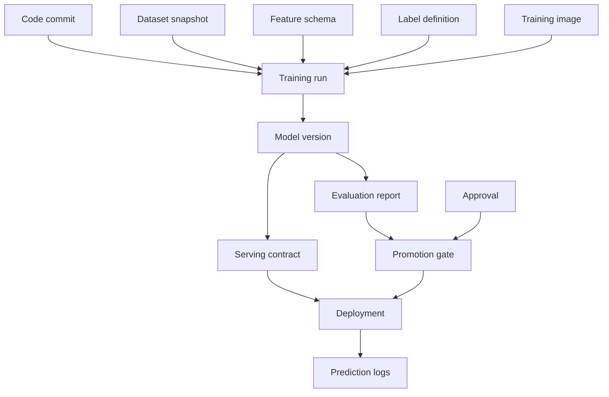

# モデルレジストリとMLメタデータ

> **翻訳についての注記:** 本ドキュメントは英語原文 `16-ml-systems/13-model-registry-metadata.md` を日本語に翻訳したものです。コードブロック、YAML、SQL、Mermaidダイアグラムは原文のまま維持しています。

## TL;DR

モデルレジストリはモデルファイルのフォルダではありません。MLリリースのコントロールプレーンです: どのアーティファクトが存在し、何がそれを生み、何に依存し、どのライフサイクル状態にあり、どのゲートを通過し、誰が承認し、どこにデプロイされ、どうロールバックするかを述べる、記録のシステム(system of record)です。モデルのバイナリは、メタデータのグラフ — データセットスナップショット、特徴量スキーマ、ラベル定義、訓練コード、ランタイムイメージ、評価レポート、閾値ポリシー、承認、デプロイメント、予測ログ — の中の1オブジェクトにすぎません。そのグラフが不完全なら、プラットフォームはインシデント中に重要な質問に答えられません: 何が提供中か、なぜ昇格されたか、何が変わったか、誰が承認したか、何にロールバックできるか、どの意思決定に影響したか? 核となる不変条件は、**レジストリがその来歴を再構築でき、提供コントラクトを検証でき、ロード可能なロールバックターゲットを名指しできない限り、モデルは本番に到達しない**ことです。

---

## レジストリはMLのコントロールプレーンである

普通のソフトウェアでは、リリースアーティファクトは通常コンテナイメージかバイナリであり、CI/CDメタデータがソースコミット、テスト、デプロイ状態を記録します。MLでは、リリースアーティファクトは意思決定システムです。モデルファイルは必要ですが不十分です。提供時の意思決定は、特徴量定義、前処理、ランタイムライブラリ、閾値、較正、ラベル定義、ロールアウトポリシーにも依存します。

レジストリが存在するのは、それらの依存関係が永続的でクエリ可能なコントロールプレーンを必要とするからです。それがなければ、チームはモデルファイルをオブジェクトストレージに保存し、バージョンをスプレッドシートで追跡し、リリースをSlackで承認し、ロールバックを部族の記憶に頼ります。それは最初の深刻なインシデントまでは機能します。そのとき、人間が答えられるより速く質問が到着します:

- 今この瞬間、このエンドポイントはどのモデルバージョンを提供しているか?
- どのデータセットとラベル定義がそれを訓練したか?
- どの特徴量スキーマを必要とするか?
- どの評価レポートが昇格を正当化したか?
- 誰が高リスクのロールアウトを承認したか?
- どのバージョンにロールバックでき、それは今もロード可能か?
- このモデルはどのユーザーや意思決定に影響したか?

レジストリはこれらを調査からクエリに変えます。

---

## メタデータグラフ

モデルバージョンは、パスを持つ行ではなく、メタデータグラフのノードとして表現されるべきです。



このグラフの有用な性質は双方向性です。デプロイ済みモデルから来歴へと後方に辿る。悪いデータセットから影響を受けたモデルへと前方に辿る。ユーザーの意思決定からモデルバージョンとポリシーへ辿る。モデルバージョンからデプロイメントと予測ログへ辿る。

これはデータセットリネージと訓練パイプラインに現れる来歴/影響の分割と同じものです。レジストリは、それらのエッジが運用可能になる場所です。

本番のレジストリは通常、グラフを文字通りのグラフデータベースではなく、リレーショナルテーブル+不変オブジェクト参照として保存します。決定的に重要なのはエッジです:

```yaml
model_version_record:
  model_id: fraud_classifier
  version: v42
  artifact:
    uri: s3://ml-artifacts/fraud/v42/model.onnx
    hash: sha256:9f86d08...
    format: onnx
  provenance:
    training_run_id: train_run_01J2
    code_commit: 4f3c9ab
    training_image: registry.example.com/train@sha256:91aa...
    dataset_snapshots:
      - fraud_train:2026-05-31.7
    feature_schema: fraud_features:v18
    label_definition: confirmed_chargeback:v6
  evaluation:
    report_id: eval_report_01J2
    primary_metric_delta: 0.014
    guardrails_passed: true
    uncertainty: bootstrap_95_ci
  serving_contract:
    contract_id: fraud_serving_contract:v42
    runtime_image: registry.example.com/serve@sha256:44aa...
    threshold_policy: fraud_policy:v10
    rollback_target: fraud_classifier:v41
  governance:
    risk_tier: high
    approvals:
      - role: model_owner
        actor: user:alice
        approved_at: 2026-06-24T08:10:00Z
      - role: independent_validator
        actor: user:bob
        approved_at: 2026-06-24T09:02:00Z
  lifecycle_state: approved
```

このレコードは、リリースエンジニアリング、監視、ガバナンス、インシデント対応の結合点です。モデルファイルは耐久性のある場所ならどこにでも保存できます。レジストリのレコードこそが、それを運用可能にするものです。

---

## モデルのアイデンティティ: アーティファクトハッシュはバージョン名に勝る

人間可読なバージョンは有用ですが不十分です。`fraud_model_v42` は名前であり、バイトの証明ではありません。レジストリはアーティファクトを暗号学的ハッシュと不変のストレージURIで識別すべきです。

```yaml
model: fraud_classifier
version: v42
artifact_uri: s3://ml-artifacts/fraud/v42/model.onnx
artifact_hash: sha256:9f86d08...
format: onnx
created_by_run: train_run_01J2...
created_at: 2026-06-24T03:12:00Z
```

アーティファクトハッシュは、誤った上書き、破損したアップロード、曖昧なロールバックから守ります。同じパスのモデルのバイトが変われば、それは別のアーティファクトであり、別のモデルバージョンでなければなりません。可変のアーティファクトパスは、トランザクションログなしにデータベースの行を編集することのモデル版です。

レジストリは環境のアイデンティティも、タグではなくダイジェストで保存すべきです:

```yaml
runtime_image: registry.example.com/ml-serving/fraud@sha256:44aa...
```

`ml-serving:latest` は再現可能なランタイムではありません。今日ロードでき、ベースイメージの再ビルド後の明日に失敗するモデルは、そもそも適切にバージョン管理されていなかったのです。

---

## 提供コントラクト(Serving Contract)

モデルアーティファクトは、提供時に期待するコントラクトを宣言している場合にのみ昇格可能です。コントラクトこそが、トラフィックがモデルに到達する前にプラットフォームが互換性を検証できるようにするものです。

```yaml
serving_contract:
  input_schema:
    account_risk:   { type: float32, feature_version: account_risk:v12, required: true }
    device_velocity:{ type: float32, feature_version: device_velocity:v7, required: true }
  preprocessing: fraud_preprocess:v5
  output_schema:
    score: { type: float32, range: [0, 1], meaning: calibrated_probability }
  threshold_policy: fraud_policy:v9
  latency_budget_ms: 45
  fallback: fraud_rules_policy:v3
  rollback_target: fraud_classifier:v41
```

このコントラクトはデプロイを希望から検証に変えます。ゲートは、オンライン特徴量が存在するか、提供ランタイムがモデルフォーマットをサポートするか、閾値ポリシーがスコアのセマンティクスと一致するか、フォールバックが存在するか、ロールバックがロード可能かを確認できます。

これが防ぐ最も一般的な本番障害は、特徴量/バージョンの不一致です: モデルは `device_velocity:v7` を期待するのに、提供側は `v6` を供給する。各コンポーネントは個々には健全なのに、意思決定は誤っている。レジストリはそのようなデプロイを不可能にすべきです。

---

## ライフサイクル状態はガードレールである

モデルバージョンは状態を移動します。それらの状態は命名規則で暗示されるのではなく、レジストリによって強制されるべきです。

```text
created → evaluated → approved → shadow → canary → production → deprecated → retired
              │           │          │        │
              └─ failed    └─ blocked └─ rolled_back
```

各遷移には必須の証拠があります:

| 遷移 | 必須の証拠 |
|---|---|
| created → evaluated | 訓練実行完了、アーティファクトハッシュ、リネージ完全 |
| evaluated → approved | 評価レポート、ベースライン比較、ガードレール合格 |
| approved → shadow | 提供コントラクト有効、アーティファクトがロード可能、特徴量スキーマ互換 |
| shadow → canary | レイテンシとスコア分布のチェック合格 |
| canary → production | ガードレール維持、リスクティアの承認充足 |
| production → deprecated | 代替が存在、ロールバックウィンドウ充足 |
| deprecated → retired | アクティブなデプロイメントなし、保持ポリシー充足 |

より強い状態表は、誰が遷移をトリガーでき、何がアトミックに書かれなければならないかを含みます:

| From → To | アクター | ゲート | アトミックな書き込み |
|---|---|---|---|
| created → evaluated | 訓練パイプライン | リネージ+アーティファクト検証 | 評価レポートのエッジ、メトリクス要約、状態イベント |
| evaluated → approved | モデルオーナー+承認者 | 昇格ポリシー | 承認レコード、証拠バンドルのハッシュ、状態イベント |
| approved → shadow | デプロイメントコントローラ | コントラクト検証 | デプロイメントレコード、シャドウトラフィック設定、状態イベント |
| shadow → canary | ロールアウトコントローラ | ランタイム安全性 | トラフィック分割、カナリアモニター設定、状態イベント |
| canary → production | ロールアウトコントローラ | ガードレール+承認 | アクティブポインタまたはトラフィック分割、ロールバックターゲット、状態イベント |
| production → rolled_back | オンコール / 自動化 | ロールバックターゲットがロード可能 | アクティブポインタの切替、インシデントリンク、状態イベント |
| deprecated → retired | オーナー / ライフサイクルジョブ | アクティブなデプロイメントなし | トゥームストーン、保持スケジュール、状態イベント |

レジストリの状態は安全境界です。エンジニアが必須メタデータを満たさずにモデルを直接productionとマークできるなら、レジストリは単なるドキュメントです。価値は、無効な遷移を表現不可能にすることから生まれます。

---

## ポリシー評価としての昇格ゲート

昇格ゲートは、レジストリのメタデータの上のポリシーエンジンです。デプロイスクリプトに埋もれたカスタムロジックであってはなりません。宣言的なポリシーが、要件をレビュー可能にし、モデル間で一貫させます。

```yaml
policies:
  production_promotion:
    all:
      - lineage.complete == true
      - evaluation.primary_metric_delta >= 0
      - evaluation.guardrails.all_pass == true
      - serving_contract.validated == true
      - rollback_target.load_tested == true
      - risk.required_approvals_present == true
      - owner.oncall_rotation_present == true
```

ゲートはリスクティアによって厳しくできます。プレイリストのレコメンダーはリネージ、評価、ロールバックを要求するかもしれません。クレジットモデルはさらに、独立検証、公平性スライスメトリクス、説明可能性アーティファクト、法務承認、争訟可能性の経路を要求するかもしれません。

重要な性質は、ゲートがレジストリの状態を読むことです。承認がSlackで行われ、レジストリで行われていないなら、デプロイの目的においては行われていないのです。

---

## ロールバックメタデータ

ロールバックは、レジストリがロールバックターゲットを名指しし検証できる場合にのみ現実です。モデルシステムでは、これはコードのロールバックより難しい。以前のモデルの依存関係が腐っているかもしれないからです。

ロールバックターゲットは以下を含まなければなりません:

- アーティファクトハッシュとストレージURI、
- ランタイムイメージのダイジェスト、
- 特徴量スキーマのバージョン、
- 前処理のバージョン、
- 閾値ポリシー、
- フォールバックポリシー、
- 最後のロードテスト結果、
- ウォームに保つ必要がある場合の容量状態。

```yaml
rollback:
  target_model: fraud_classifier:v41
  validated_at: 2026-06-24T02:00:00Z
  load_test: pass
  feature_schema_available: true
  runtime_image_available: true
  warm_replicas: 3
  rollback_method: registry_pointer_flip
  expected_recovery_time_seconds: 10
```

現在の本番ポインタしか保存しないレジストリはロールバックを保証できません。特に特徴量スキーマとランタイムイメージが非推奨化されるとき、ロールバックが可能であり続けることを継続的に検証しなければなりません。

---

## レジストリ対アーティファクトストア

アーティファクトストアはバイトを保持します。レジストリは意味を保持します。

| コンポーネント | 保存するもの | 最適化の対象 |
|---|---|---|
| アーティファクトストア | モデルバイナリ、前処理器、説明可能性アーティファクト | 耐久性、大きなオブジェクトの保存 |
| メタデータストア | リネージ、状態、コントラクト、承認、メトリクス | 一貫性、クエリ可能性 |
| デプロイメントコントロールプレーン | アクティブバージョンのポインタ、トラフィック分割 | 速く安全な変更 |
| 予測ログ | 提供された意思決定とコンテキスト | 追記専用の監査と監視 |

これらは1つの製品でも複数のシステムでも実装できます。境界は概念的に重要です: オブジェクトストレージはモデルが公平性レビューを通過したかに答えられません。レジストリは5GBのアーティファクトを効率的に提供できません。デプロイメントコントロールプレーンは、ロールバック中に評価レポートのスキャンに依存すべきではありません。

---

## 一貫性の要件

レジストリはコントロールプレーンなので、その一貫性の要件は多くのデータプレーンシステムより強い。2人のオペレータが、決定論的な結果なしに、同じエンドポイントの本番へ異なるバージョンを並行して昇格できてはなりません。ロールバックのポインタ切替はアトミックでなければなりません。モデルの状態遷移は、必須メタデータをすべて記録するか、起きないかのどちらかです。

これはレジストリのコアに普通のトランザクショナルストレージを示唆します。ライフサイクル状態、承認、アクティブなデプロイメントポインタには、リレーショナルデータベースまたは強一貫のメタデータストアを使うこと。大きなアーティファクトとログは他の場所に置けます。提供システムがアクティブバージョンの矛盾した読み取りを許容できない限り、レジストリは本番状態について結果整合であってはなりません。

アクティブモデルのポインタは特に敏感です:

```text
endpoint fraud_authorization → active_model fraud_classifier:v42
```

その変更は、監査ログ付きのアトミックなcompare-and-swapであるべきです:

```text
if active_model == v42:
    set active_model = v41
    append audit event rollback(v42 → v41, actor, reason)
```

データベースの言葉では、ポインタの切替は小さなトランザクションのように見えるべきです:

```sql
BEGIN;

SELECT active_model_version
FROM endpoint_active_model
WHERE endpoint = 'fraud_authorization'
FOR UPDATE;

-- compare-and-swap guard prevents overwriting a concurrent deploy
UPDATE endpoint_active_model
SET active_model_version = 'fraud_classifier:v41',
    updated_at = CURRENT_TIMESTAMP,
    updated_by = 'user:oncall'
WHERE endpoint = 'fraud_authorization'
  AND active_model_version = 'fraud_classifier:v42';

INSERT INTO registry_audit_log(
  event_type, endpoint, previous_model_version, new_model_version, actor, reason
) VALUES (
  'rollback', 'fraud_authorization', 'fraud_classifier:v42', 'fraud_classifier:v41',
  'user:oncall', 'canary false_positive_rate guardrail breach'
);

COMMIT;
```

提供ノードは、有界の古さを持つwatch/キャッシュプロトコルで新しいポインタを観測すべきです。ポインタキャッシュのTTLが60秒なら、レジストリのトランザクションがどれだけ速くても「10秒でロールバック」という主張は偽です。提供コントラクトは、ポインタ伝播のSLO、キャッシュ無効化の振る舞い、レジストリが利用不能な場合に何が起きるかを述べるべきです。

これはフィーチャーフラグとデプロイメントコントロールプレーンが注意深い一貫性を必要とするのと同じ理由です: ユーザーが何を経験するかを決めるからです。

---

## 監査ログ: 誰が、何を、いつ、なぜ変えたか

本番に影響するすべてのレジストリの変更は監査されなければなりません:

- モデルの登録、
- 評価の添付、
- 承認の付与、
- ライフサイクル状態の変更、
- トラフィック割合の変更、
- アクティブバージョンの変更、
- 閾値ポリシーの変更、
- ロールバックの実行、
- モデルの退役。

監査イベントは、アクター、タイムスタンプ、以前の状態、新しい状態、理由、リクエストIDを記録すべきです。規制対象のシステムでは、閾値の変更はモデルの変更と同じくらい重要です。スコアのカットオフは、モデルアーティファクトを一切変えずに何千もの意思決定を変え得ます。

```yaml
registry_audit_event:
  event_id: reg_evt_01J2Z
  occurred_at: 2026-06-24T11:04:19Z
  actor: user:oncall
  request_id: req_deploy_7781
  event_type: traffic_split_changed
  endpoint: fraud_authorization
  previous:
    model_version: fraud_classifier:v41
    traffic_percent: 100
    threshold_policy: fraud_policy:v9
  new:
    model_version: fraud_classifier:v42
    traffic_percent: 5
    threshold_policy: fraud_policy:v10
  gate_result: promotion_gate_run_01J2Y
  reason: canary_ramp_step_1
  rollback_target: fraud_classifier:v41
```

追記専用の監査ログはインシデントレビューも助けます。悪いロールアウトの後の質問は「どのモデルがこれを引き起こしたか?」だけでなく、「どのゲートがそれを捕まえ損ね、意思決定の時点で誰が情報を持っていたか?」です。

---

## マルチ環境の昇格

モデルはしばしば環境を跨いで移動します: dev、staging、shadow、canary、production、時にはリージョン固有のproduction。レジストリは、環境固有のデプロイメントをモデルのライフサイクルとは別に追跡すべきです。

```text
model fraud_classifier:v42
  lifecycle_state: approved
  deployments:
    staging: active 100%
    shadow-prod-us: active 5% shadow
    canary-prod-us: active 1% user traffic
    prod-eu: not deployed
```

これはよくある曖昧さを防ぎます: モデルは承認済みだが未デプロイであり得ます。シャドウにデプロイ済みだが本番ではなく、あるリージョンでは本番だが別のリージョンではブロックされていることもあります。ライフサイクル状態は適格性についてであり、デプロイメント状態はトラフィックが実際にどこを流れるかについてです。

---

## モデルレジストリAPIの形

最小限のレジストリAPIは、生のデータベース書き込みではなく、状態遷移とクエリの周りの操作を公開します。

```text
register_model(training_run_id, artifact_uri, artifact_hash)
attach_evaluation(model_version, evaluation_report_id)
validate_serving_contract(model_version, endpoint)
request_promotion(model_version, target_state)
approve(model_version, approver, role, justification)
promote(model_version, target_state)
set_traffic(endpoint, model_version, percent)
rollback(endpoint, target_model_version, reason)
retire(model_version)
```

クエリも同じくらい重要です:

```text
get_active_model(endpoint)
get_lineage(model_version)
get_impacted_models(dataset_version)
get_deployments(model_version)
get_decisions(model_version, time_range)
get_rollback_target(endpoint)
```

影響クエリがインシデント中に書かれるアドホックなSQLを必要とするなら、レジストリは仕事をしていません。

有用なAPIの性質は冪等性です。デプロイメントコントローラはリトライし、CIジョブはリトライし、オンコールのエンジニアはストレス下で二重送信します。レジストリの変更はリクエストIDを受け入れ、繰り返しの呼び出しを安全にすべきです:

```text
promote(model_version=v42, target_state=canary, request_id=req_123)
```

最初の呼び出しが成功しクライアントがタイムアウトした場合、リトライは既存の状態遷移を返すべきで、重複した承認を作ったりトラフィック変更を繰り返したりしてはなりません。レジストリはコントロールプレーンです。冪等性は安全性の一部です。

---

## 実在のレジストリはこの設計にどう対応するか

上記のすべてを実装する既製のレジストリは存在しません。各製品がどこで止まるかを知れば、その周りに何を構築しなければならないかがわかります。

**MLflow (2.x)** は最も一般的な出発点です。そのModel Registryは、トラッキング実行(パラメータ、メトリクス、コードコミット)へのリネージを持つバージョン付きアーティファクトを保存し、2.9以降、古い `Staging/Production` ステージを**エイリアス** — 提供システムがロード時に解決する `@champion` のような名前付きポインタ — で置き換えました:

```python
import mlflow
client = mlflow.MlflowClient()

mv = client.create_model_version("fraud_classifier",
                                 source="runs:/train_run_01J2/model",
                                 run_id="train_run_01J2")
client.set_registered_model_alias("fraud_classifier", "champion", mv.version)

# Serving resolves the pointer: models:/fraud_classifier@champion
```

このエイリアスは一貫性の節のアクティブモデルポインタ*そのもの*です — しかしMLflowが与えないものに注意してください: 切替はガードされたcompare-and-swapではなく、強制される昇格ゲートはなく(どの書き込み者もエイリアスを動かせる)、提供コントラクトの検証はなく、承認はあなたが実装するwebhookです。MLflowはメタデータグラフのストレージ層であり、コントロールプレーンの*強制*はあなたに委ねられています。

**SageMaker Model Registry** は、CI/CDパイプラインをゲートできる承認フィールド(`PendingManualApproval → Approved/Rejected`)を追加し、モデルパッケージは推論コンテナとスキーマのメタデータを運びます — 提供コントラクトに近い。**Vertex AI Model Registry** はエイリアス付きでモデルをバージョン管理し、Vertexのデプロイメントと監視に接続します。**Weights & Biases** はレジストリを、webhook駆動の昇格を持つリネージ豊かなアーティファクトグラフとして扱います。すべてのケースでパターンは同じです: 製品はアーティファクトのアイデンティティ、リネージのエッジ、ポインタのメカニズムを供給します。*ゲート* — コントラクト検証、ガードレールスライス、ロールバックターゲットのロードテスト、職務分掌 — は、レジストリを読むデプロイメントパイプラインであなたが強制するポリシーです。レジストリを買うことは名詞を買うことです。無効な遷移を表現不可能にする動詞はエンジニアリングプロジェクトのままであり、だからこそ本章はページの大半をそれに費やしているのです。

---

## 障害モード

**レジストリに化けたアーティファクトフォルダ**は、モデルファイルを保存しますが、リネージ、状態、承認、コントラクト、デプロイメントは保存しません。防御: 強制されたライフサイクル遷移を持つメタデータグラフ。

**可変のアーティファクトパス**は、同じバージョン名の下でバイトが変わることを許します。防御: アーティファクトハッシュと不変URI。バージョンのアイデンティティは内容に従う。

**コントロールプレーン外の承認**は、サインオフをSlackやチケットに記録し、レジストリの状態には記録しません。防御: 昇格ゲートはレジストリの承認だけを読む。

**特徴量コントラクトの不一致**は、互換性のないオンライン特徴量に対してモデルをデプロイします。防御: 昇格前に検証される提供コントラクト。

**ロールバック健忘症**は、インシデント中に、以前のアーティファクト、イメージ、特徴量スキーマ、閾値ポリシーが消えていることを発見します。防御: ロールバックメタデータと継続的なロード検証。

**スプリットブレインの本番ポインタ**は、並行するデプロイ操作が、異なる提供ノードに意図せず異なるアクティブバージョンを読ませるときに起きます。防御: 強一貫のアクティブポインタとアトミックなトラフィック変更。

**孤児モデル**は、所有チームが消えた後も本番に残ります。防御: オーナーメタデータ、オンコール検証、古い所有権のアラート、退役ポリシー。

**閾値のみのインシデント**は、モデルアーティファクトが変わらなかったためにレジストリの監査なしでポリシー値を変えます。防御: 閾値ポリシーは、モデルと同様にガバナンスされる、バージョン管理された本番アーティファクトです。

---

## 判断のフレームワーク

モデルレジストリが本番級であるのは、これらの質問にプログラム的に答えられるときです:

1. 各エンドポイント、リージョン、トラフィックセグメントでどのモデルバージョンがアクティブか?
2. 正確にどのアーティファクトのバイトとランタイムイメージが提供中か?
3. どの訓練実行、データセット、特徴量、ラベル、コードがモデルを生んだか?
4. どの評価レポートとガードレールが昇格を正当化したか?
5. どのリスクティアと承認が適用されたか?
6. モデルはどの特徴量と出力のコントラクトを必要とするか?
7. 今この瞬間どのロールバックターゲットが有効で、どれだけ速く有効化できるか?
8. どのデプロイメントと予測ログがこのモデルを使ったか?
9. 誰がライフサイクル状態、トラフィック、閾値、アクティブバージョンを変えたか?
10. 悪いデータセット、特徴量、ラベル定義によってどのモデルが影響を受けるか?

これらが手動の調査なら、レジストリは不完全です。クエリなら、レジストリは本物のコントロールプレーンです。

---

## 要点

1. モデルレジストリはMLリリースのコントロールプレーンであり、ファイルカタログではありません。
2. 核となるオブジェクトは、コード、データ、特徴量、ラベル、訓練実行、モデルアーティファクト、評価、承認、デプロイメント、予測ログをつなぐメタデータグラフです。
3. アーティファクトは不変URIと暗号学的ハッシュで識別すること。名前はバイトの証明ではありません。
4. 提供コントラクトは、必要な特徴量、前処理、出力セマンティクス、閾値、フォールバック、レイテンシ予算、ロールバックターゲットを宣言します。
5. ライフサイクル状態は、命名規則ではなく、強制されるガードレールであるべきです。
6. 昇格ゲートはレジストリメタデータの上のポリシー評価です。レジストリ状態の外の承認はカウントされません。
7. ロールバックには、以前のアーティファクトとすべての依存関係の検証済みメタデータが必要です。
8. レジストリのコアは、本番ポインタと状態遷移に強一貫性を必要とします。アクティブポインタの切替はアトミックで監査されるべきです。
9. 提供ノードには有界のポインタ伝播の振る舞いが必要です。さもなければロールバック時間の主張はフィクションです。
10. 閾値とポリシーの変更は本番の変更であり、バージョン管理と監査が必要です。
11. デプロイコントローラも人間もリトライするので、レジストリの変更APIは冪等であるべきです。
12. 来歴、影響、アクティブなデプロイメント、承認、ロールバックの質問がすべてクエリになったとき、レジストリは成功しています。

---

## 参考文献

1. [MLflow Model Registry](https://mlflow.org/docs/latest/ml/model-registry/)
2. [TFX: A TensorFlow-Based Production-Scale Machine Learning Platform](https://dl.acm.org/doi/10.1145/3097983.3098021) — Baylor et al., 2017
3. [Hidden Technical Debt in Machine Learning Systems](https://proceedings.neurips.cc/paper_files/paper/2015/file/86df7dcfd896fcaf2674f757a2463eba-Paper.pdf) — Sculley et al., 2015
4. [Uber Michelangelo: Machine Learning Platform](https://www.uber.com/blog/michelangelo-machine-learning-platform/)
5. [Model Cards for Model Reporting](https://arxiv.org/abs/1810.03993) — Mitchell et al., 2019
6. [ML Metadata](https://www.tensorflow.org/tfx/guide/mlmd) — TensorFlow Extendedのメタデータシステム
7. [デプロイ戦略](../15-deployment/01-deployment-strategies.md)
