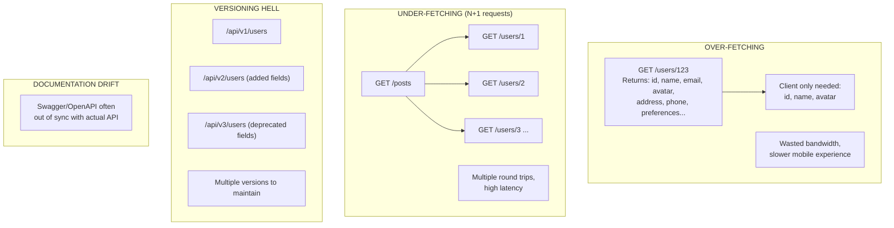
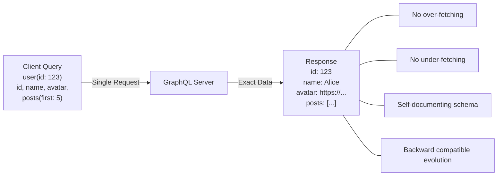
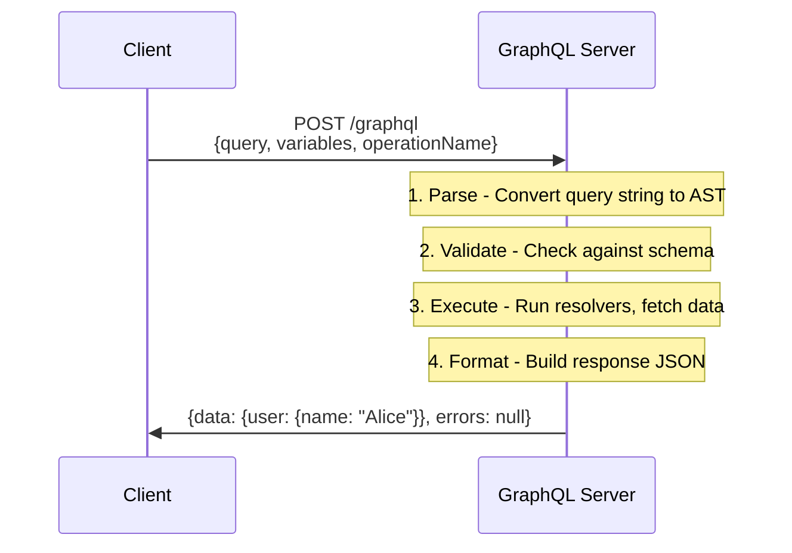

# GraphQL基礎

> **注:** この記事は英語版からの翻訳です。コードブロック（GraphQL SDL、Python、JavaScript）およびMermaidダイアグラムは原文のまま保持しています。

## TL;DR

GraphQLは、クライアントが必要なデータを正確にリクエストできるAPIのためのクエリ言語およびランタイムです。固定的なエンドポイントを公開するRESTとは異なり、GraphQLは厳密に型付けされたスキーマを持つ単一のエンドポイントを使用します。クライアントがデータ要件を指定することで、オーバーフェッチとアンダーフェッチを削減します。主要な概念には、スキーマ、型、クエリ、ミューテーション、サブスクリプションがあります。

---

## GraphQLが解決する問題

### REST APIの課題



### GraphQLによる解決



---

## コアコンセプト

### スキーマ定義言語（SDL）

```graphql
# Type definitions using SDL
type User {
  id: ID!                    # Non-nullable ID
  name: String!              # Non-nullable String
  email: String!
  avatar: String             # Nullable String
  posts: [Post!]!            # Non-nullable array of non-nullable Posts
  followers: [User!]!
  createdAt: DateTime!
}

type Post {
  id: ID!
  title: String!
  content: String!
  author: User!
  comments: [Comment!]!
  tags: [String!]
  publishedAt: DateTime
  viewCount: Int!
}

type Comment {
  id: ID!
  text: String!
  author: User!
  post: Post!
  createdAt: DateTime!
}

# Custom scalar types
scalar DateTime
scalar JSON

# Enum types
enum PostStatus {
  DRAFT
  PUBLISHED
  ARCHIVED
}

# Input types for mutations
input CreatePostInput {
  title: String!
  content: String!
  tags: [String!]
  status: PostStatus = DRAFT
}

# Query type - entry point for reads
type Query {
  user(id: ID!): User
  users(first: Int, after: String): UserConnection!
  post(id: ID!): Post
  posts(filter: PostFilter): [Post!]!
  me: User
}

# Mutation type - entry point for writes
type Mutation {
  createPost(input: CreatePostInput!): Post!
  updatePost(id: ID!, input: UpdatePostInput!): Post!
  deletePost(id: ID!): Boolean!
  followUser(userId: ID!): User!
}

# Subscription type - entry point for real-time
type Subscription {
  postCreated: Post!
  commentAdded(postId: ID!): Comment!
}
```

### 型システム

```mermaid
graph TD
    TS["GraphQL Type System"]
    TS --> SCALAR["SCALAR TYPES<br/>(leaf nodes)"]
    TS --> OBJ["OBJECT TYPES"]
    TS --> ABS["ABSTRACT TYPES"]
    TS --> MOD["MODIFIERS"]
    TS --> INP["INPUT TYPES"]

    SCALAR --> S1["Int - 32-bit signed integer"]
    SCALAR --> S2["Float - Double-precision"]
    SCALAR --> S3["String - UTF-8"]
    SCALAR --> S4["Boolean - true/false"]
    SCALAR --> S5["ID - Unique identifier"]
    SCALAR --> S6["Custom - DateTime, JSON, URL"]

    OBJ --> O1["User, Post, Comment, etc."]
    OBJ --> O2["Query, Mutation, Subscription<br/>(root types)"]

    ABS --> A1["Interface - Shared fields,<br/>multiple implementations"]
    ABS --> A2["Union - One of several types,<br/>no shared fields"]

    MOD --> M1["Type - List of Type"]
    MOD --> M2["Type! - Non-null Type"]
    MOD --> M3["Type!! - Non-null list<br/>of non-null Types"]

    INP --> I1["input TypeInput -<br/>For mutation arguments"]
```



### インターフェースとユニオン

```graphql
# Interface - shared fields with multiple implementations
interface Node {
  id: ID!
}

interface Timestamped {
  createdAt: DateTime!
  updatedAt: DateTime!
}

type User implements Node & Timestamped {
  id: ID!
  createdAt: DateTime!
  updatedAt: DateTime!
  name: String!
  email: String!
}

type Post implements Node & Timestamped {
  id: ID!
  createdAt: DateTime!
  updatedAt: DateTime!
  title: String!
  content: String!
}

# Union - one of several types (no shared fields required)
union SearchResult = User | Post | Comment

type Query {
  node(id: ID!): Node
  search(query: String!): [SearchResult!]!
}

# Querying interfaces/unions requires inline fragments
query {
  search(query: "graphql") {
    ... on User {
      name
      email
    }
    ... on Post {
      title
      content
    }
    ... on Comment {
      text
    }
  }
}
```

---

## オペレーション

### クエリ

```graphql
# Basic query
query GetUser {
  user(id: "123") {
    name
    email
  }
}

# Query with variables
query GetUser($userId: ID!) {
  user(id: $userId) {
    name
    email
    posts(first: 10) {
      title
    }
  }
}

# Variables passed separately:
# { "userId": "123" }

# Aliases - query same field with different arguments
query GetUsers {
  alice: user(id: "1") {
    name
  }
  bob: user(id: "2") {
    name
  }
}

# Fragments - reusable field selections
fragment UserFields on User {
  id
  name
  email
  avatar
}

query GetUsersWithFragments {
  alice: user(id: "1") {
    ...UserFields
    posts {
      title
    }
  }
  bob: user(id: "2") {
    ...UserFields
  }
}

# Directives - conditional inclusion
query GetUser($includeEmail: Boolean!, $skipPosts: Boolean!) {
  user(id: "123") {
    name
    email @include(if: $includeEmail)
    posts @skip(if: $skipPosts) {
      title
    }
  }
}
```

### ミューテーション

```graphql
# Create mutation
mutation CreatePost($input: CreatePostInput!) {
  createPost(input: $input) {
    id
    title
    content
    author {
      name
    }
  }
}

# Update mutation
mutation UpdatePost($id: ID!, $input: UpdatePostInput!) {
  updatePost(id: $id, input: $input) {
    id
    title
    updatedAt
  }
}

# Delete mutation
mutation DeletePost($id: ID!) {
  deletePost(id: $id)
}

# Multiple mutations in one request (executed sequentially)
mutation CreateAndPublish {
  createPost(input: { title: "Draft", content: "..." }) {
    id
  }
  publishPost(id: "123") {
    status
  }
}
```

### サブスクリプション

```graphql
# Subscribe to new posts
subscription OnPostCreated {
  postCreated {
    id
    title
    author {
      name
    }
  }
}

# Subscribe with filter
subscription OnCommentAdded($postId: ID!) {
  commentAdded(postId: $postId) {
    id
    text
    author {
      name
    }
  }
}
```

---

## アーキテクチャ

### リクエスト/レスポンスフロー



### サーバー実装

```python
from ariadne import QueryType, MutationType, make_executable_schema
from ariadne.asgi import GraphQL

# Type definitions
type_defs = """
type Query {
    user(id: ID!): User
    users: [User!]!
}

type Mutation {
    createUser(name: String!, email: String!): User!
}

type User {
    id: ID!
    name: String!
    email: String!
    posts: [Post!]!
}

type Post {
    id: ID!
    title: String!
}
"""

# Resolvers
query = QueryType()
mutation = MutationType()

@query.field("user")
async def resolve_user(_, info, id):
    return await db.users.find_one({"id": id})

@query.field("users")
async def resolve_users(_, info):
    return await db.users.find().to_list(100)

@mutation.field("createUser")
async def resolve_create_user(_, info, name, email):
    user = {"id": str(uuid4()), "name": name, "email": email}
    await db.users.insert_one(user)
    return user

@query.field("posts")
async def resolve_user_posts(user, info):
    return await db.posts.find({"author_id": user["id"]}).to_list(100)

schema = make_executable_schema(type_defs, query, mutation)
app = GraphQL(schema, debug=True)
```

### Node.js実装

```javascript
const { ApolloServer } = require('@apollo/server');
const { startStandaloneServer } = require('@apollo/server/standalone');

const typeDefs = `#graphql
  type Query {
    user(id: ID!): User
    users: [User!]!
  }

  type Mutation {
    createUser(name: String!, email: String!): User!
  }

  type User {
    id: ID!
    name: String!
    email: String!
    posts: [Post!]!
  }

  type Post {
    id: ID!
    title: String!
  }
`;

const resolvers = {
  Query: {
    user: async (_, { id }, context) => {
      return context.db.users.findById(id);
    },
    users: async (_, __, context) => {
      return context.db.users.findAll();
    },
  },

  Mutation: {
    createUser: async (_, { name, email }, context) => {
      return context.db.users.create({ name, email });
    },
  },

  User: {
    posts: async (user, _, context) => {
      return context.db.posts.findByAuthorId(user.id);
    },
  },
};

const server = new ApolloServer({
  typeDefs,
  resolvers,
});

const { url } = await startStandaloneServer(server, {
  context: async ({ req }) => ({
    db: database,
    user: await authenticateUser(req),
  }),
  listen: { port: 4000 },
});
```

---

## GraphQL vs REST

### 比較

| 観点 | REST | GraphQL |
|--------|------|---------|
| エンドポイント | 複数 | 単一（/graphql） |
| データ取得 | 固定構造 | クライアント指定 |
| オーバーフェッチ | よくある | 排除 |
| アンダーフェッチ | よくある（N+1） | 排除 |
| バージョニング | URLベース（/v1） | スキーマ進化 |
| キャッシング | HTTPキャッシング | カスタムソリューション |
| ファイルアップロード | ネイティブサポート | 仕様拡張 |
| エラーハンドリング | HTTPステータスコード | errors配列 |
| ドキュメント | 外部（Swagger） | イントロスペクション |
| 学習コスト | 低い | 高い |
| ツール | 成熟 | 急速に成長中 |

**RESTが最適な場合:** シンプルなCRUD API、多様なクライアントを持つパブリックAPI、ファイル主体の操作、HTTPキャッシングが重要な場合

**GraphQLが最適な場合:** 複雑なデータ要件、モバイルアプリ（帯域幅重視）、フロントエンドの高速イテレーション、複数サービスの集約、リアルタイム機能が必要な場合

### GraphQLを使うべきでない場合

```
1. ネストデータのないシンプルなCRUD
   → RESTの方がシンプルで十分

2. ファイルアップロードが主なユースケース
   → RESTの方がmultipartを扱いやすい

3. 多様な未知のクライアントを持つパブリックAPI
   → RESTの方が普遍的に理解されている

4. 積極的なHTTPキャッシングが必要
   → REST + CDNの方が簡単

5. GraphQL経験のない小規模チーム
   → 学習コストに見合わない可能性

6. 既存のREST APIが問題なく動作している
   → GraphQLのためだけに書き換えない
```

---

## エラーハンドリング

### ユニオンベースのエラー（推奨）

```graphql
type Query {
  user(id: ID!): UserResult!
}

union UserResult = User | UserNotFoundError | PermissionDeniedError

type UserNotFoundError {
  message: String!
  userId: ID!
}

type PermissionDeniedError {
  message: String!
  requiredRole: String!
}

query GetUser($id: ID!) {
  user(id: $id) {
    ... on User {
      id
      name
      email
    }
    ... on UserNotFoundError {
      message
      userId
    }
    ... on PermissionDeniedError {
      message
      requiredRole
    }
  }
}
```

---

## セキュリティの考慮事項

### クエリ複雑度分析

```python
from graphql import GraphQLError

def calculate_complexity(info, max_complexity=1000):
    """
    Prevent expensive queries by limiting complexity
    """
    complexity = 0

    def visit_field(field, multiplier=1):
        nonlocal complexity

        cost = 1

        if is_list_field(field):
            first = get_argument(field, "first") or 10
            cost *= first

        complexity += cost * multiplier

        for sub_field in field.selection_set.selections:
            visit_field(sub_field, cost)

    for field in info.field_nodes:
        visit_field(field)

    if complexity > max_complexity:
        raise GraphQLError(
            f"Query complexity {complexity} exceeds maximum {max_complexity}"
        )

    return complexity
```

---

## ベストプラクティス

### スキーマ設計

```
□ 明確で説明的な型名とフィールド名を使用する
□ デフォルトでフィールドをnon-null (!)にし、必要な場合のみnullableにする
□ 識別子にはStringやIntではなくID型を使用する
□ 入力型にはオペレーション名をプレフィックスとして付ける（CreateUserInput）
□ 固定値のセットにはenumを使用する
□ ドキュメントのために型とフィールドに説明を追加する
□ ページネーションにはRelay Connection仕様に従う
□ ミューテーションは変更されたオブジェクトを返すよう設計する
```

### パフォーマンス

```
□ バッチ処理にDataLoaderを実装する（N+1問題）
□ 本番環境ではPersisted Queriesを使用する
□ クエリ複雑度制限を設定する
□ クエリ深度制限を設定する
□ 適切な場合にレスポンスキャッシングを実装する
□ 大きなレスポンスには@deferと@streamを使用する
□ リゾルバのパフォーマンスを監視する
```

### セキュリティ

```
□ 入力を常にバリデーションしサニタイズする
□ コンテキストレベルで認証を実装する
□ 機密データにはフィールドレベルの認可を使用する
□ ユーザーとクエリ複雑度によるレート制限を行う
□ 本番環境ではイントロスペクションを無効にする
□ 異常なクエリパターンをログに記録し監視する
□ HTTPSのみを使用する
```

---

## 参考文献

- [GraphQL Specification](https://spec.graphql.org/)
- [GraphQL Best Practices](https://graphql.org/learn/best-practices/)
- [Apollo GraphQL Documentation](https://www.apollographql.com/docs/)
- [How to GraphQL](https://www.howtographql.com/)
- [Production Ready GraphQL](https://productionreadygraphql.com/)
- [GraphQL at Scale (Netflix)](https://netflixtechblog.com/our-learnings-from-adopting-graphql-f099de39ae5f)
