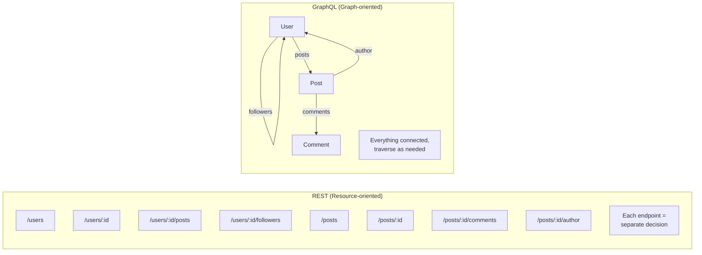
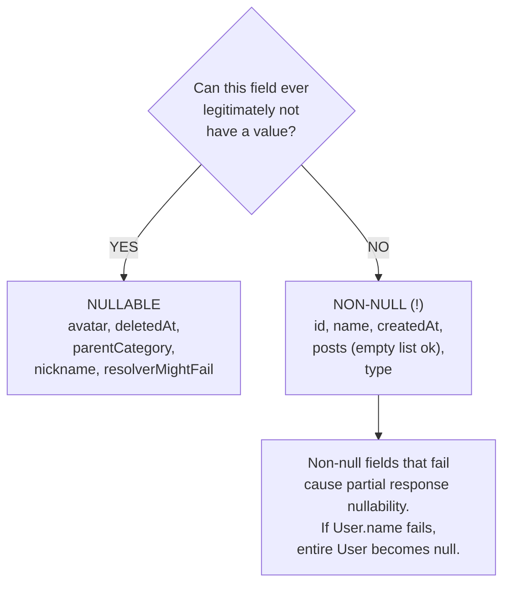
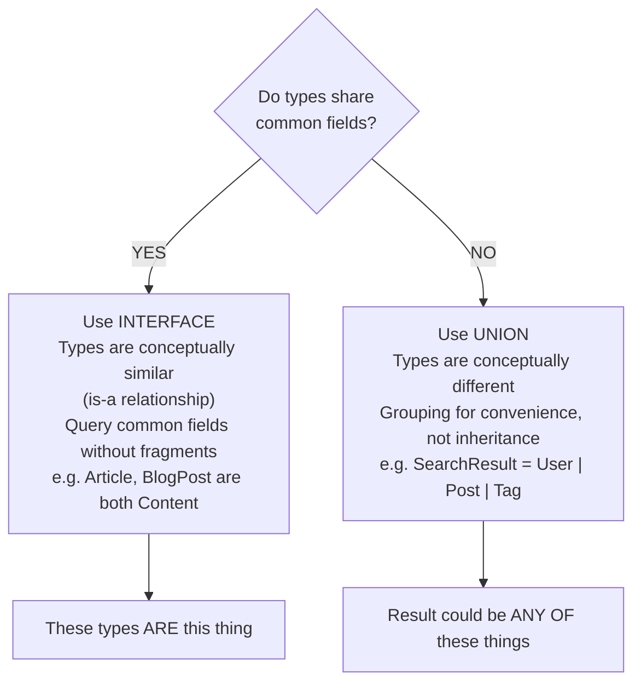
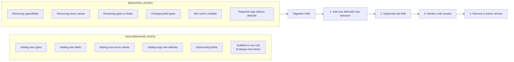

# スキーマ設計

> **注:** この記事は英語版からの翻訳です。コードブロック（GraphQL SDL、Python、JavaScript）およびMermaidダイアグラムは原文のまま保持しています。

## TL;DR

優れたGraphQLスキーマ設計は、APIの使いやすさ、パフォーマンス、進化可能性に不可欠です。主要原則には、クライアントのユースケースに合わせた設計、nullableフィールドの慎重な使用、Connectionによるページネーション実装、インターフェース/ユニオンによるポリモーフィズムの活用があります。適切に設計されたスキーマは自己文書化されており、破壊的変更なしにスキーマの進化を可能にします。

---

## 設計原則

### エンドポイントではなくグラフで考える



### ユースケースに合わせた設計

```graphql
# BAD: Database-oriented schema
type User {
  id: ID!
  first_name: String!    # Snake case from DB
  last_name: String!
  email_address: String!
  created_at: DateTime!
  updated_at: DateTime!
  is_deleted: Boolean!   # Internal field exposed
}

# GOOD: Client-oriented schema
type User {
  id: ID!
  firstName: String!     # camelCase for clients
  lastName: String!

  # Computed field - what clients actually need
  fullName: String!

  email: String!

  # Formatted for display
  memberSince: String!

  # Don't expose internal flags
  # is_deleted stays internal
}
```

---

## Null許容性

### デフォルトでNon-Null

```graphql
type User {
  id: ID!           # Always exists
  name: String!     # Required field
  email: String!    # Required field

  # Nullable fields have clear reasons:
  avatar: String              # Optional, user may not have set
  bio: String                 # Optional profile field
  deletedAt: DateTime         # Only set when deleted

  # Lists: usually non-null list of non-null items
  posts: [Post!]!             # May be empty [], but never null
  roles: [Role!]!             # Same pattern
}
```

### いつNullableにするか



---

## ページネーション

### カーソルベースページネーション（Relay Connection仕様）

```graphql
type Query {
  users(
    first: Int
    after: String
    last: Int
    before: String
  ): UserConnection!
}

type UserConnection {
  edges: [UserEdge!]!
  pageInfo: PageInfo!
  totalCount: Int!
}

type UserEdge {
  node: User!
  cursor: String!
}

type PageInfo {
  hasNextPage: Boolean!
  hasPreviousPage: Boolean!
  startCursor: String
  endCursor: String
}
```

### オフセット vs カーソルページネーション

| | オフセットベース（非推奨） | カーソルベース（推奨） |
|---|---|---|
| API | `users(limit: 10, offset: 20)` | `users(first: 10, after: "xyz")` |
| パフォーマンス | 大きなオフセットで高コスト | 効率的（DBがインデックスを使用） |
| 一貫性 | 変更時にスキップ/重複 | スキップ/重複なし |
| リアルタイム | 不整合 | リアルタイムデータでも動作 |
| 実装 | 透過的 | 不透明なカーソルで実装を隠蔽 |

**オフセットが許される場合:** 小さなデータセット、「ページNに移動」の要件、安定したデータの管理画面

---

## インターフェースとユニオン

### インターフェース vs ユニオンの判断



---

## 命名規約

### 型とフィールド

```graphql
# Types: PascalCase
type UserProfile { }
type BlogPost { }

# Fields: camelCase
type User {
  firstName: String!
  lastName: String!
  emailAddress: String!
}

# Enums: SCREAMING_SNAKE_CASE values
enum OrderStatus {
  PENDING
  PROCESSING
  SHIPPED
}

# Input types: PascalCase with Input suffix
input CreateUserInput { }
input UpdatePostInput { }

# Connection types: PascalCase with Connection/Edge suffix
type UserConnection { }
type UserEdge { }
```

---

## スキーマの進化

### 破壊的変更（避けるべき）



---

## ベストプラクティスチェックリスト

```
命名:
□ 型はPascalCase
□ フィールドはcamelCase
□ EnumはSCREAMING_SNAKE_CASE
□ 入力型にはInputサフィックス
□ ミューテーションは動詞+名詞パターン

Null許容性:
□ デフォルトでnon-null、意味がある場合のみnullable
□ リストは[Type!]!（non-nullリストのnon-nullアイテム）
□ エラー伝播の動作を考慮

ページネーション:
□ カーソルベースページネーション（Relay Connection仕様）を使用
□ pageInfoとtotalCountを含める
□ first/lastに適切なデフォルト値を提供

型:
□ DBスキーマではなくクライアントのユースケースに合わせて設計
□ 計算/派生フィールドを必要に応じて追加
□ 共有フィールドにはインターフェースを使用
□ 異種結果にはユニオンを使用

進化:
□ フィールドを削除せず、まず非推奨にする
□ 既存を変更する代わりに新しいフィールドを追加
□ 非推奨の理由と移行パスを文書化
□ 削除前にフィールド使用状況を監視
```

---

## 参考文献

- [GraphQL Best Practices](https://graphql.org/learn/best-practices/)
- [Relay Connection Specification](https://relay.dev/graphql/connections.htm)
- [Relay Global Object Identification](https://relay.dev/graphql/objectidentification.htm)
- [Principled GraphQL](https://principledgraphql.com/)
- [GraphQL Schema Design (Shopify)](https://github.com/Shopify/graphql-design-tutorial)
- [Production Ready GraphQL](https://productionreadygraphql.com/)
