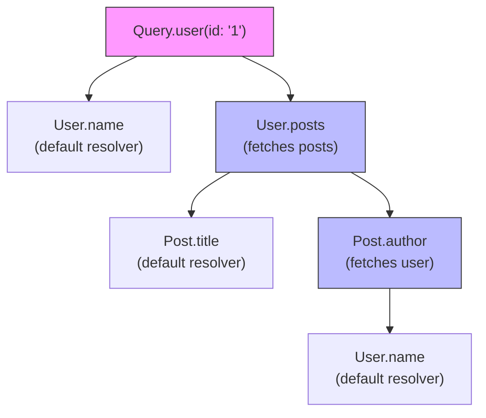
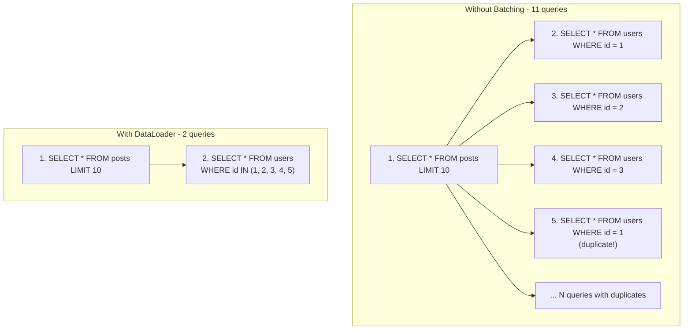
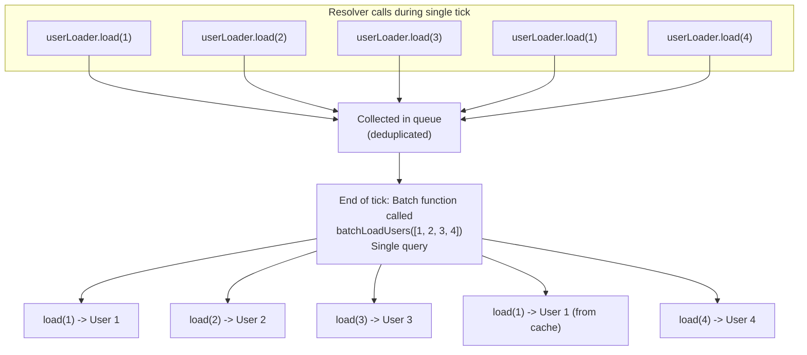

# リゾルバとデータフェッチ

> **注:** この記事は英語版からの翻訳です。コードブロック（Python、JavaScript）およびMermaidダイアグラムは原文のまま保持しています。

## TL;DR

リゾルバは、GraphQLフィールドのデータを取得する関数です。主な課題はN+1問題で、ネストされたクエリが多数のデータベース呼び出しを引き起こします。DataLoaderは、単一リクエスト内でリクエストをバッチ処理しキャッシュすることでこの問題を解決します。リゾルバの実行順序、コンテキスト管理、効率的なデータフェッチパターンの理解は、パフォーマンスの高いGraphQL APIに不可欠です。

---

## リゾルバの基礎

### リゾルバの動作原理



**実行順序（深さ優先）:**
1. `Query.user(id: "1")`
2. `User.name`（親オブジェクトを使用）
3. `User.posts`（投稿を取得）
4. 各投稿に対して: `Post.title`（親を使用）、`Post.author`（ユーザーを取得）、`User.name`（親を使用）

---

## N+1問題

### 問題の理解



---

## DataLoader

### DataLoaderの動作原理



### JavaScript実装

```javascript
const DataLoader = require('dataloader');

async function batchUsers(userIds) {
  console.log('Batching users:', userIds);

  const users = await db.users.findByIds(userIds);

  // IMPORTANT: Return values in same order as input keys
  const userMap = new Map(users.map(u => [u.id, u]));
  return userIds.map(id => userMap.get(id) || null);
}

const userLoader = new DataLoader(batchUsers);

const resolvers = {
  Post: {
    author: async (post, _, context) => {
      return context.loaders.userLoader.load(post.authorId);
    }
  }
};

function createContext(req) {
  return {
    db: database,
    loaders: {
      userLoader: new DataLoader(batchUsers),
      postLoader: new DataLoader(batchPosts),
    }
  };
}
```

### Python実装

```python
from aiodataloader import DataLoader
from typing import List

class UserLoader(DataLoader):
    async def batch_load_fn(self, user_ids: List[str]):
        """
        Batch load function - called once per tick with all requested IDs
        Must return results in same order as input IDs
        """
        users = await db.users.find({"_id": {"$in": user_ids}}).to_list(None)
        user_map = {str(u["_id"]): u for u in users}
        return [user_map.get(uid) for uid in user_ids]

def create_context(request):
    return {
        "user_loader": UserLoader(),
        "post_loader": PostLoader(),
        "db": db,
    }

@post_type.field("author")
async def resolve_author(post, info):
    return await info.context["user_loader"].load(post["author_id"])
```

---

## ベストプラクティス

### DataLoaderガイドライン

```
□ リクエストごとに新しいDataLoaderインスタンスを作成する
□ リクエスト間でDataLoaderを共有しない
□ 入力キーの正確な順序で結果を返す
□ 欠損値を処理する（undefinedではなくnullを返す）
□ 複合キーにはcache_key_fnを使用する
□ データが既にある場合はキャッシュをプライミングする
□ データが変更された場合はキャッシュをクリアする
```

### リゾルバガイドライン

```
□ リゾルバをフォーカスさせる - 単一責任
□ 繰り返しのデータフェッチにはDataLoaderを使用する
□ リクエストされたフィールドを確認してクエリを最適化する
□ オプションデータの欠損にはnullを返す
□ 必須データの欠損にはエラーをスローする
□ リゾルバのパフォーマンスをログに記録し監視する
□ 可能な場合は並列フェッチを使用する
```

### パフォーマンスガイドライン

```
□ N+1問題が起きやすいフィールドには常にDataLoaderを使用する
□ リストフィールドに適切なデフォルト制限を設定する
□ クエリ複雑度分析を実装する
□ リゾルバのタイミング/トレーシングを追加する
□ 必要なフィールドのみを取得するプロジェクションを使用する
□ 高コストな計算をキャッシュする
□ 遅いクエリを監視しアラートを設定する
```

---

## 参考文献

- [DataLoader Documentation](https://github.com/graphql/dataloader)
- [GraphQL Resolvers Best Practices](https://www.apollographql.com/docs/apollo-server/data/resolvers/)
- [Solving the N+1 Problem](https://shopify.engineering/solving-the-n-1-problem-for-graphql-through-batching)
- [GraphQL Performance (Shopify)](https://shopify.engineering/how-shopify-reduced-storefront-api-response-times-80-graphql)
- [Apollo Server Performance](https://www.apollographql.com/docs/apollo-server/performance/caching/)
