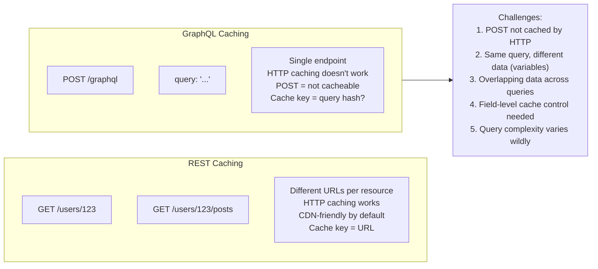
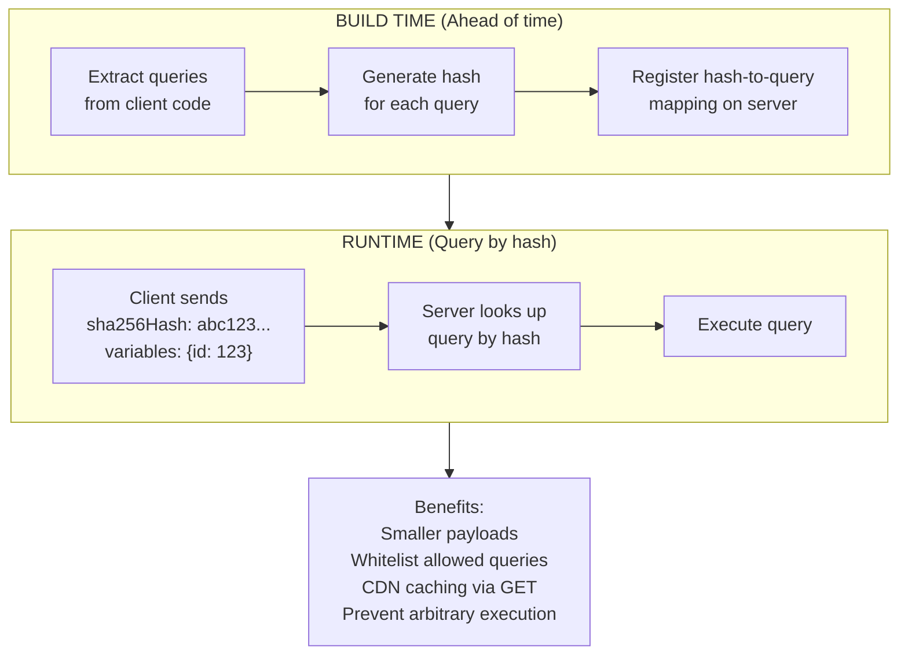
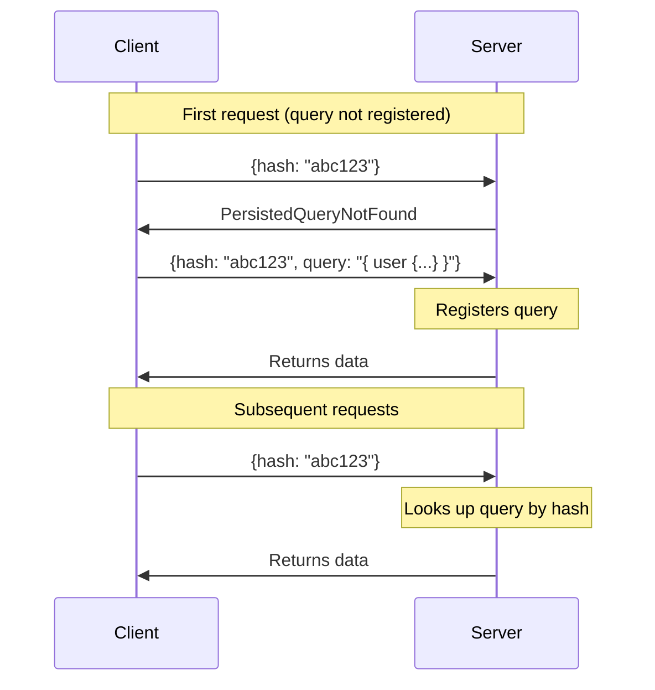
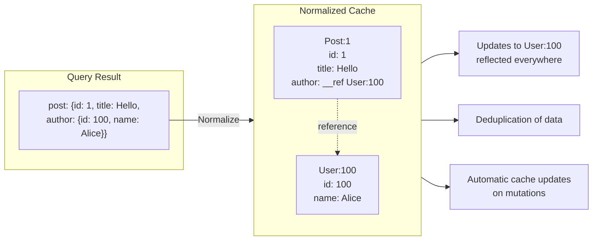

# キャッシングとパフォーマンス

> **注:** この記事は英語版からの翻訳です。コードブロック（Python、JavaScript、GraphQL SDL）およびMermaidダイアグラムは原文のまま保持しています。

## TL;DR

GraphQLのキャッシングはRESTよりも複雑です。リクエストがさまざまなクエリで単一のエンドポイントに送信されるためです。主要な戦略には、レスポンスキャッシング（完全なクエリ結果）、正規化キャッシング（エンティティレベル）、Persisted Queries（事前登録クエリ）、CDNキャッシングがあります。Automatic Persisted Queries（APQ）は帯域幅を削減し、キャッシュコントロールディレクティブはフィールドごとのきめ細かいTTLを可能にします。

---

## キャッシングの課題

### GraphQLのキャッシングが異なる理由



---

## Persisted Queries

### Persisted Queriesの動作原理



### Automatic Persisted Queries（APQ）



メリット: ビルドステップ不要、初回使用時に自動登録、ユニークなクエリあたり1回の追加ラウンドトリップのみ、動的生成クエリでも動作

---

## クライアントサイドキャッシング

### 正規化キャッシュ（Apollo Client）



---

## パフォーマンス最適化

### 遅延実行（@defer）

```graphql
query GetPost($id: ID!) {
  post(id: $id) {
    id
    title
    content

    # Defer expensive fields
    ... @defer {
      comments {
        id
        text
        author {
          name
        }
      }
      relatedPosts {
        id
        title
      }
    }
  }
}
```

---

## ベストプラクティス

```
レスポンスキャッシング:
□ フィールドレベルのTTLにキャッシュコントロールディレクティブを使用する
□ フィールドヒントから全体のキャッシュポリシーを計算する
□ パブリックとプライベートのキャッシュデータを分離する
□ ミューテーション時にキャッシュを無効化する

Persisted Queries:
□ 自動登録にAPQを使用する
□ 本番環境では静的抽出を検討する
□ CDNキャッシングのためにGETリクエストを有効にする
□ 高セキュリティ環境ではクエリをホワイトリスト化する

クライアントキャッシング:
□ 適切なキーフィールドで正規化キャッシュを設定する
□ ページネーションマージのための型ポリシーを定義する
□ より良いUXのためにオプティミスティック更新を使用する
□ ログアウト/ユーザー切替時にキャッシュをクリーンアップする

パフォーマンス:
□ クエリ複雑度/コスト分析を実装する
□ 適切な制限を設定する（深度、複雑度、バッチサイズ）
□ 高コストなフィールドには@deferを使用する
□ リゾルバのパフォーマンスを監視する
□ 遅いクエリをログに記録し分析する
```

---

## 参考文献

- [Apollo Server Caching](https://www.apollographql.com/docs/apollo-server/performance/caching/)
- [Automatic Persisted Queries](https://www.apollographql.com/docs/apollo-server/performance/apq/)
- [Apollo Client Cache](https://www.apollographql.com/docs/react/caching/overview/)
- [GraphQL CDN Caching (Fastly)](https://www.fastly.com/blog/caching-graphql-apis)
- [GraphQL Persisted Documents](https://github.com/apollographql/graphql-persisted-document-loader)
