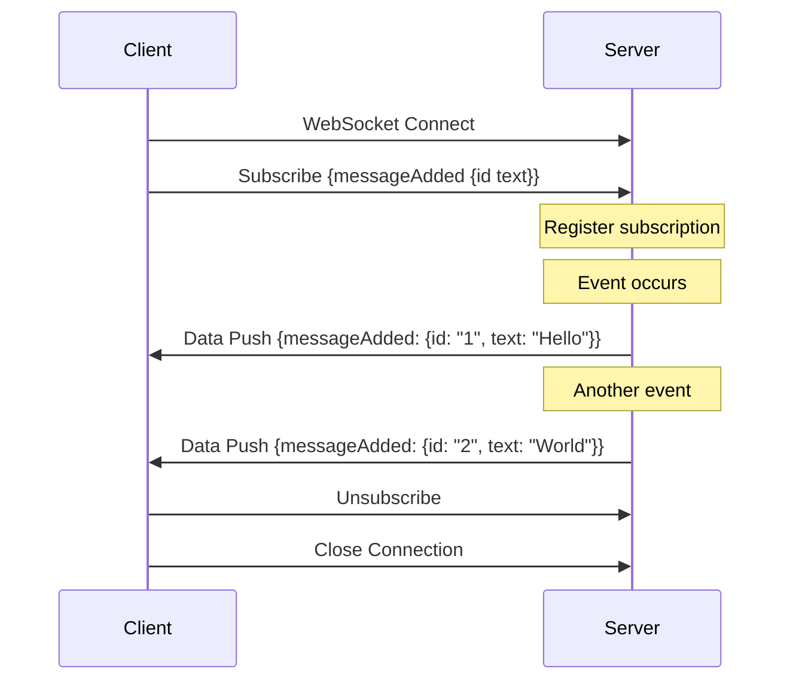
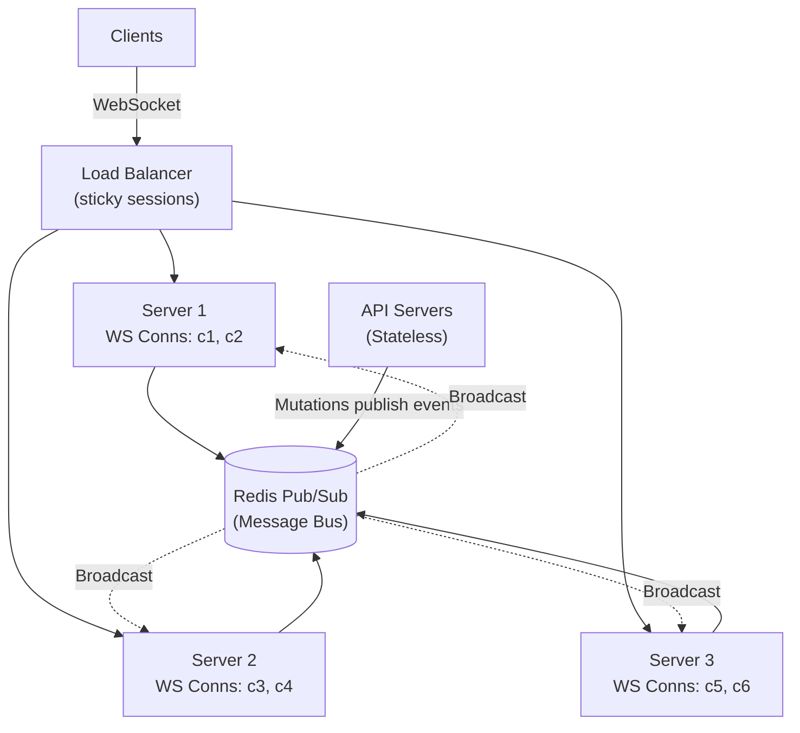

# サブスクリプションとリアルタイム

> **注:** この記事は英語版からの翻訳です。コードブロック（Python、JavaScript、GraphQL SDL）およびMermaidダイアグラムは原文のまま保持しています。

## TL;DR

GraphQLサブスクリプションは、永続的な接続（通常はWebSocket）を介してサーバーからクライアントへのリアルタイムデータストリーミングを可能にします。クエリやミューテーションとは異なり、サブスクリプションはオープンな接続を維持し、イベント発生時に更新をプッシュします。主な考慮事項には、接続管理、pub/subシステムによるスケーリング、認証、再接続のグレースフルな処理があります。

---

## サブスクリプションの基礎

### サブスクリプションの動作原理



### スキーマ定義

```graphql
type Subscription {
  messageAdded: Message!
  messageAdded(channelId: ID!): Message!
  postEvent: PostEvent!
  notificationReceived: Notification!
}

union PostEvent = PostCreated | PostUpdated | PostDeleted

type PostCreated {
  post: Post!
}

type PostUpdated {
  post: Post!
  updatedFields: [String!]!
}

type PostDeleted {
  postId: ID!
}
```

---

## スケーリング

### Redis Pub/Subによるスケーリング



**フロー:** 1. 任意のAPIサーバーでのミューテーションがRedisにパブリッシュ。2. Redisがすべてのサブスクリプションサーバーにブロードキャスト。3. 各サーバーが接続中のクライアントにプッシュ。

---

## ライブクエリ（サブスクリプションの代替）

| | サブスクリプション | ライブクエリ |
|---|---|---|
| アプローチ | クライアントがイベントを購読 | クライアントがクエリを購読 |
| データフロー | サーバーがイベントデータをプッシュ | サーバーが変更時にクエリを再実行 |
| キャッシュ | クライアントがキャッシュを管理 | 自動キャッシュ同期 |
| **メリット** | きめ細かい制御、低帯域幅、標準仕様 | シンプルなクライアントコード、自動キャッシュ同期、常に最新 |
| **デメリット** | クライアントがキャッシュを管理、複雑なロジック | サーバー負荷が高い、非標準仕様、帯域幅集約的 |

---

## ベストプラクティス

### 設計ガイドライン

```
□ 離散的なイベントにサブスクリプションを使用し、状態同期には使わない
□ サブスクリプションのペイロードを小さく保つ（変更データのみ）
□ クライアントがキャッシュを更新できる十分なコンテキストを含める
□ 複数のイベントタイプにはユニオン型を検討する
□ サブスクリプションのペイロード構造を明確に文書化する
```

### パフォーマンス

```
□ 水平スケーリングにはRedis pub/subを使用する
□ ユーザーあたりの接続数制限を実装する
□ サブスクリプション操作にレート制限を追加する
□ 接続数とメッセージスループットを監視する
□ 接続のヘルスチェックにハートビート/キープアライブを実装する
```

### 信頼性

```
□ クライアントでの再接続をグレースフルに処理する
□ 切断中の重要なイベントを永続化する
□ 見逃したイベントのキャッチアップメカニズムを実装する
□ サブスクリプションレベルのエラーハンドリングを追加する
□ サブスクリプション障害をログに記録し監視する
```

### セキュリティ

```
□ WebSocket接続を認証する
□ 各サブスクリプションチャネルを認可する
□ 定期的に認可を再検証する
□ サブスクリプションのスロットリングを実装する
□ サブスクリプション引数をバリデーションする
```

---

## 参考文献

- [GraphQL Subscriptions Spec](https://spec.graphql.org/draft/#sec-Subscription)
- [graphql-ws Protocol](https://github.com/enisdenjo/graphql-ws/blob/master/PROTOCOL.md)
- [Apollo Subscriptions](https://www.apollographql.com/docs/react/data/subscriptions/)
- [Scaling GraphQL Subscriptions (Hasura)](https://hasura.io/blog/scaling-graphql-subscriptions/)
- [Live Queries (Relay)](https://relay.dev/docs/guided-tour/updating-data/graphql-subscriptions/)
