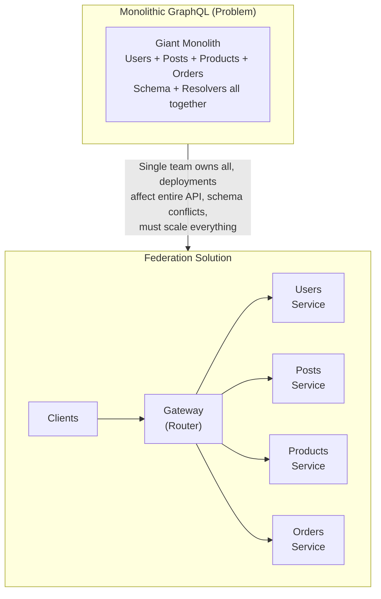
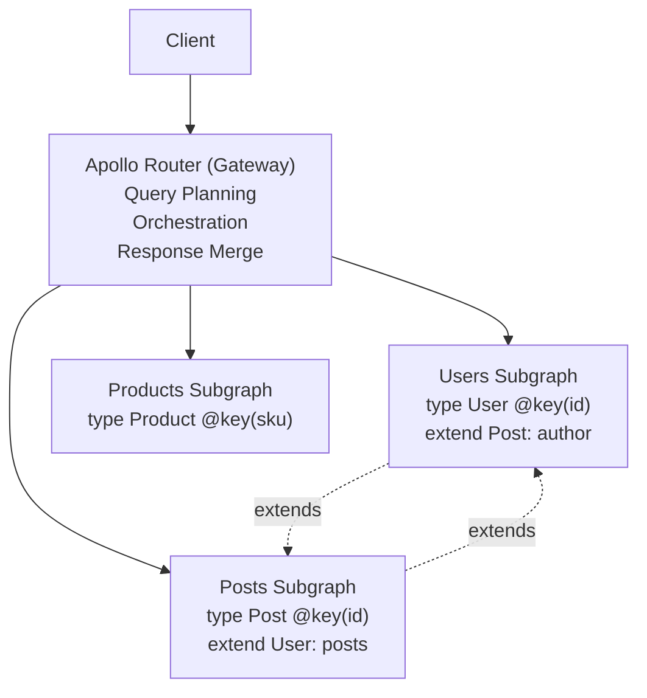
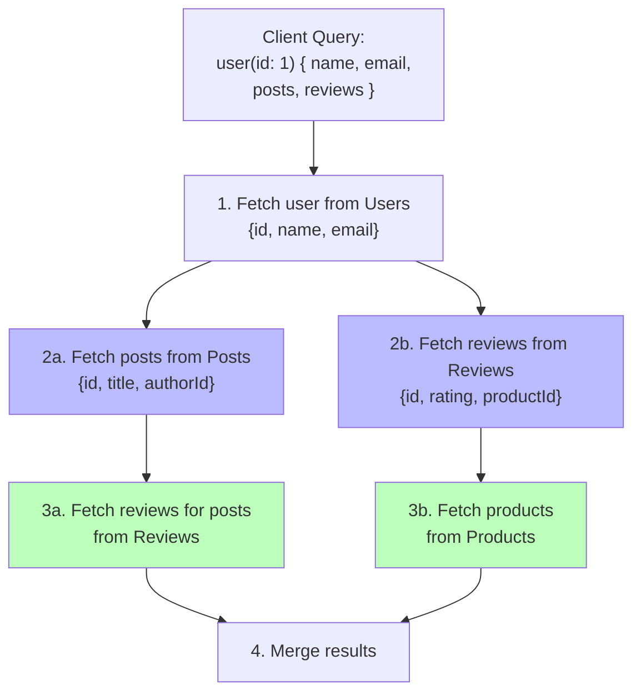
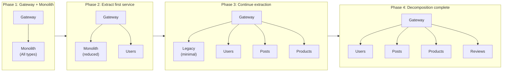

# フェデレーションとマイクロサービス

> この記事は英語版から翻訳されました。最新版は[英語版](/17-graphql/06-federation)をご覧ください。

## TL;DR

GraphQL Federationは、複数のGraphQLサービスを単一の統合グラフに構成することを可能にします。各サービスはスキーマの自分の担当部分を所有し、他のサービスの型を拡張できます。Apollo Federationは最も成熟した実装であり、ゲートウェイ（ルーター）を使用してサービス間のクエリをオーケストレーションします。これにより、チームは独立して作業しながら、クライアントにシームレスなAPIを提供できます。

---

## Federationが解決する課題

### モノリシックGraphQLの課題



---

## Apollo Federationの概念

### アーキテクチャ概要



各サブグラフは、自身の型を所有し、他の型を拡張でき、独立してデプロイされ、異なるチーム・言語で開発できます。

### 主要なディレクティブ

```graphql
# @key - サービス間参照のためのエンティティの主キーを定義します
type User @key(fields: "id") {
  id: ID!
  name: String!
  email: String!
}

# 複数キーのサポート
type Product @key(fields: "id") @key(fields: "sku") {
  id: ID!
  sku: String!
  name: String!
  price: Float!
}

# @external - フィールドが別のサブグラフで定義されていることを示します
type User @key(fields: "id") {
  id: ID!
  # これらのフィールドはUsersサブグラフから取得されます
  name: String! @external
}

# @requires - このフィールドの解決に外部フィールドが必要です
type User @key(fields: "id") {
  id: ID!
  name: String! @external

  # 計算にUsersサービスのnameが必要です
  greeting: String! @requires(fields: "name")
}

# @provides - このリゾルバが返すフィールドを指定します
type Review @key(fields: "id") {
  id: ID!
  body: String!

  # このリゾルバはauthor.nameを提供します
  author: User! @provides(fields: "name")
}

# @shareable - フィールドが複数のサブグラフで解決可能です
type Product @key(fields: "id") {
  id: ID!
  name: String! @shareable
  price: Float!
}

# @inaccessible - 合成スキーマからフィールドを非公開にします
type User @key(fields: "id") {
  id: ID!
  name: String!
  internalId: String! @inaccessible  # クライアントには公開されません
}

# @override - 別のサブグラフからフィールドの所有権を引き継ぎます
type Product @key(fields: "id") {
  id: ID!
  name: String!

  # Productsサービスがこのフィールドの所有者になります
  inventory: Int! @override(from: "inventory")
}
```

---

## サブグラフの実装

### Usersサブグラフ

```javascript
// users-subgraph/schema.graphql
const { gql } = require('apollo-server');
const { buildSubgraphSchema } = require('@apollo/subgraph');

const typeDefs = gql`
  extend schema @link(
    url: "https://specs.apollo.dev/federation/v2.0"
    import: ["@key", "@shareable"]
  )

  type Query {
    me: User
    user(id: ID!): User
    users: [User!]!
  }

  type Mutation {
    createUser(input: CreateUserInput!): User!
    updateUser(id: ID!, input: UpdateUserInput!): User!
  }

  type User @key(fields: "id") {
    id: ID!
    name: String!
    email: String!
    avatar: String
    createdAt: DateTime!
  }

  input CreateUserInput {
    name: String!
    email: String!
  }

  input UpdateUserInput {
    name: String
    email: String
    avatar: String
  }
`;

const resolvers = {
  Query: {
    me: (_, __, context) => context.dataSources.users.getUser(context.userId),
    user: (_, { id }, context) => context.dataSources.users.getUser(id),
    users: (_, __, context) => context.dataSources.users.getAllUsers(),
  },

  Mutation: {
    createUser: (_, { input }, context) =>
      context.dataSources.users.createUser(input),
    updateUser: (_, { id, input }, context) =>
      context.dataSources.users.updateUser(id, input),
  },

  User: {
    // 参照リゾルバ - 別のサブグラフがUserを必要とするときに呼ばれます
    __resolveReference: (user, context) => {
      return context.dataSources.users.getUser(user.id);
    },
  },
};

const server = new ApolloServer({
  schema: buildSubgraphSchema({ typeDefs, resolvers }),
});
```

### Postsサブグラフ（Userを拡張）

```javascript
// posts-subgraph/schema.graphql
const typeDefs = gql`
  extend schema @link(
    url: "https://specs.apollo.dev/federation/v2.0"
    import: ["@key", "@external", "@requires"]
  )

  type Query {
    post(id: ID!): Post
    posts(authorId: ID): [Post!]!
    feed(first: Int, after: String): PostConnection!
  }

  type Mutation {
    createPost(input: CreatePostInput!): Post!
    deletePost(id: ID!): Boolean!
  }

  type Post @key(fields: "id") {
    id: ID!
    title: String!
    content: String!
    authorId: ID!
    createdAt: DateTime!

    # Userエンティティへの参照（Usersサブグラフで解決されます）
    author: User!
  }

  # Usersサブグラフで定義されたUser型を拡張します
  extend type User @key(fields: "id") {
    id: ID! @external

    # Userにpostsフィールドを追加します
    posts: [Post!]!
  }

  type PostConnection {
    edges: [PostEdge!]!
    pageInfo: PageInfo!
  }

  type PostEdge {
    node: Post!
    cursor: String!
  }

  input CreatePostInput {
    title: String!
    content: String!
  }
`;

const resolvers = {
  Query: {
    post: (_, { id }, context) =>
      context.dataSources.posts.getPost(id),
    posts: (_, { authorId }, context) =>
      authorId
        ? context.dataSources.posts.getPostsByAuthor(authorId)
        : context.dataSources.posts.getAllPosts(),
  },

  Mutation: {
    createPost: (_, { input }, context) =>
      context.dataSources.posts.createPost({
        ...input,
        authorId: context.userId,
      }),
  },

  Post: {
    __resolveReference: (post, context) =>
      context.dataSources.posts.getPost(post.id),

    // Userへの参照を返します（ゲートウェイが解決します）
    author: (post) => ({ __typename: 'User', id: post.authorId }),
  },

  // 拡張されたUser型のリゾルバ
  User: {
    posts: (user, _, context) =>
      context.dataSources.posts.getPostsByAuthor(user.id),
  },
};
```

### Reviewsサブグラフ（ProductとUserを拡張）

```javascript
const typeDefs = gql`
  extend schema @link(
    url: "https://specs.apollo.dev/federation/v2.0"
    import: ["@key", "@external", "@provides"]
  )

  type Query {
    reviews(productId: ID!): [Review!]!
  }

  type Mutation {
    createReview(input: CreateReviewInput!): Review!
  }

  type Review @key(fields: "id") {
    id: ID!
    rating: Int!
    body: String!
    createdAt: DateTime!

    # 参照
    author: User!
    product: Product!
  }

  # Productsサブグラフからproduct型を拡張します
  extend type Product @key(fields: "id") {
    id: ID! @external

    reviews: [Review!]!
    averageRating: Float
  }

  # Usersサブグラフからuser型を拡張します
  extend type User @key(fields: "id") {
    id: ID! @external

    reviews: [Review!]!
  }

  input CreateReviewInput {
    productId: ID!
    rating: Int!
    body: String!
  }
`;

const resolvers = {
  Query: {
    reviews: (_, { productId }, context) =>
      context.dataSources.reviews.getReviewsForProduct(productId),
  },

  Mutation: {
    createReview: (_, { input }, context) =>
      context.dataSources.reviews.createReview({
        ...input,
        authorId: context.userId,
      }),
  },

  Review: {
    __resolveReference: (review, context) =>
      context.dataSources.reviews.getReview(review.id),

    author: (review) => ({ __typename: 'User', id: review.authorId }),
    product: (review) => ({ __typename: 'Product', id: review.productId }),
  },

  Product: {
    reviews: (product, _, context) =>
      context.dataSources.reviews.getReviewsForProduct(product.id),

    averageRating: async (product, _, context) => {
      const reviews = await context.dataSources.reviews
        .getReviewsForProduct(product.id);
      if (!reviews.length) return null;
      const sum = reviews.reduce((acc, r) => acc + r.rating, 0);
      return sum / reviews.length;
    },
  },

  User: {
    reviews: (user, _, context) =>
      context.dataSources.reviews.getReviewsByAuthor(user.id),
  },
};
```

---

## ゲートウェイ（ルーター）のセットアップ

### Apollo Router

```yaml
# router.yaml
supergraph:
  introspection: true
  listen: 0.0.0.0:4000

# サブグラフの設定
override_subgraph_url:
  users: http://users-service:4001/graphql
  posts: http://posts-service:4002/graphql
  reviews: http://reviews-service:4003/graphql
  products: http://products-service:4004/graphql

# ヘッダーの伝播
headers:
  all:
    request:
      - propagate:
          named: authorization
      - propagate:
          named: x-request-id

# キャッシング
cache:
  redis:
    urls:
      - redis://redis:6379

# レート制限
limits:
  max_depth: 15
  max_height: 200

# テレメトリ
telemetry:
  tracing:
    otlp:
      endpoint: http://jaeger:4317
```

### スーパーグラフの構成

```bash
# rover CLIのインストール
npm install -g @apollo/rover

# サブグラフスキーマからスーパーグラフを構成します
rover supergraph compose --config ./supergraph.yaml > supergraph.graphql

# supergraph.yaml
federation_version: =2.3.1
subgraphs:
  users:
    routing_url: http://users-service:4001/graphql
    schema:
      file: ./users/schema.graphql
  posts:
    routing_url: http://posts-service:4002/graphql
    schema:
      file: ./posts/schema.graphql
  reviews:
    routing_url: http://reviews-service:4003/graphql
    schema:
      file: ./reviews/schema.graphql
  products:
    routing_url: http://products-service:4004/graphql
    schema:
      file: ./products/schema.graphql
```

### マネージドフェデレーション（Apollo Studio）

```javascript
// スキーマをApollo Studioに公開します
// 各サブグラフは独立して公開されます

// users-subgraphのCI/CDで:
// rover subgraph publish my-graph@production \
//   --name users \
//   --schema ./schema.graphql \
//   --routing-url http://users-service:4001/graphql

// ルーターはApollo Studioから合成されたスーパーグラフを取得します
// router.yaml
apollo:
  graph_ref: my-graph@production

// メリット:
// - デプロイ前のスキーマバリデーション
// - スキーマ変更履歴
// - 破壊的変更の検出
// - 構成エラーの早期発見
```

---

## クエリの実行

### クエリプランニング



### エンティティの解決

```javascript
// ゲートウェイがPostsサブグラフからUserの参照を解決する必要がある場合

// 1. Postsサブグラフが返すデータ:
{
  "posts": [
    { "id": "1", "title": "Hello", "author": { "__typename": "User", "id": "100" } }
  ]
}

// 2. ゲートウェイがUsersサブグラフに_entitiesクエリを送信します:
query {
  _entities(representations: [
    { "__typename": "User", "id": "100" }
  ]) {
    ... on User {
      id
      name
      email
    }
  }
}

// 3. Usersサブグラフの__resolveReferenceが呼ばれます:
User: {
  __resolveReference: (ref, context) => {
    // ref = { __typename: "User", id: "100" }
    return context.dataSources.users.getUser(ref.id);
  }
}

// 4. ゲートウェイがレスポンスをマージします:
{
  "posts": [
    {
      "id": "1",
      "title": "Hello",
      "author": { "id": "100", "name": "Alice", "email": "alice@example.com" }
    }
  ]
}
```

---

## 移行戦略

### 段階的な導入



### @overrideを使った移行

```graphql
# ステップ1: モノリスのオリジナル
# monolith/schema.graphql
type Product @key(fields: "id") {
  id: ID!
  name: String!
  price: Float!
  inventory: Int!  # 現在モノリスに存在します
}

# ステップ2: 新しいInventoryサービスが引き継ぎます
# inventory/schema.graphql
type Product @key(fields: "id") {
  id: ID! @external

  # モノリスから所有権を引き継ぎます
  inventory: Int! @override(from: "monolith")
}

# ステップ3: 移行完了後にモノリスから削除します
# monolith/schema.graphql
type Product @key(fields: "id") {
  id: ID!
  name: String!
  price: Float!
  # inventoryを削除しました
}
```

---

## エラーハンドリング

### 部分レスポンス

```javascript
// ゲートウェイは部分的な障害を適切に処理します

// クエリ:
{
  user(id: "1") {
    name           // Usersサービス
    posts {        // Postsサービス（障害発生）
      title
    }
    reviews {      // Reviewsサービス
      rating
    }
  }
}

// 部分的な障害を含むレスポンス:
{
  "data": {
    "user": {
      "name": "Alice",
      "posts": null,        // 障害発生
      "reviews": [
        { "rating": 5 }
      ]
    }
  },
  "errors": [
    {
      "message": "Could not fetch posts",
      "path": ["user", "posts"],
      "extensions": {
        "code": "SUBGRAPH_ERROR",
        "serviceName": "posts"
      }
    }
  ]
}

// クライアントはエラー通知とともに部分データを表示できます
```

### サブグラフのヘルスチェック

```javascript
// 各サブグラフのヘルスチェックエンドポイント
app.get('/health', async (req, res) => {
  const checks = {
    database: await checkDatabase(),
    cache: await checkCache(),
  };

  const healthy = Object.values(checks).every(c => c);

  res.status(healthy ? 200 : 503).json({
    status: healthy ? 'healthy' : 'unhealthy',
    checks,
  });
});

// ルーターのヘルス集約
// router.yaml
health_check:
  enabled: true
  path: /health
  subgraphs:
    - users
    - posts
    - products
```

---

## パフォーマンスに関する考慮事項

### エンティティリクエストのバッチ処理

```javascript
// 複数のエンティティ参照が単一のリクエストにバッチ化されます

// 以下の代わりに:
// _entities(representations: [{id: "1"}])
// _entities(representations: [{id: "2"}])
// _entities(representations: [{id: "3"}])

// ゲートウェイは以下を送信します:
// _entities(representations: [{id: "1"}, {id: "2"}, {id: "3"}])

// サブグラフはDataLoaderパターンを使用すべきです
User: {
  __resolveReference: async (ref, context) => {
    // DataLoaderを使用してバッチ処理します
    return context.loaders.users.load(ref.id);
  }
}
```

### クエリプランのキャッシング

```yaml
# router.yaml
# 繰り返しクエリのクエリプランをキャッシュします
query_planning:
  cache:
    in_memory:
      limit: 1000
    redis:
      urls:
        - redis://redis:6379
      ttl: 3600
```

### 遅延実行

```graphql
# コストの高いサービス間フィールドには@deferを使用します
query GetUser {
  user(id: "1") {
    name
    email

    ... @defer {
      posts {
        title
        # Postsサービスが必要です
      }
      reviews {
        rating
        # Reviewsサービスが必要です
      }
    }
  }
}
```

---

## ベストプラクティス

### スキーマ設計

```
□ 1サービスにつき1エンティティ（所有権を明確に）
□ すべてのエンティティに@keyを使用する
□ 型の共有よりも拡張を優先する
□ エンティティ参照を最小限に保つ
□ サービス境界をドキュメント化する
□ スキーマ変更を慎重にバージョン管理する
```

### サービス設計

```
□ 各サブグラフを独立してデプロイ可能にする
□ __resolveReferenceでDataLoaderを使用する
□ ヘルスチェックを実装する
□ 部分的な障害を適切に処理する
□ サービス間リクエストのトレースをログに記録する
□ サブグラフのレイテンシを監視する
```

### 運用

```
□ スキーマレジストリにマネージドフェデレーションを使用する
□ CIでスキーマ変更をバリデーションする
□ 構成エラーを監視する
□ サブグラフ障害のアラートを設定する
□ ゲートウェイにサーキットブレーカーを実装する
□ クエリプランとエンティティ解決をキャッシュする
```

---

## 参考資料

- [Apollo Federation仕様](https://www.apollographql.com/docs/federation/)
- [Apollo Routerドキュメント](https://www.apollographql.com/docs/router/)
- [Federationサブグラフ仕様](https://www.apollographql.com/docs/federation/subgraph-spec/)
- [NetflixにおけるGraphQL Federation](https://netflixtechblog.com/how-netflix-scales-its-api-with-graphql-federation-part-1-ae3557c187e2)
- [Federationへの移行](https://www.apollographql.com/docs/federation/entities-advanced/)
