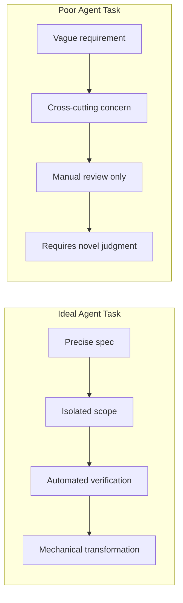
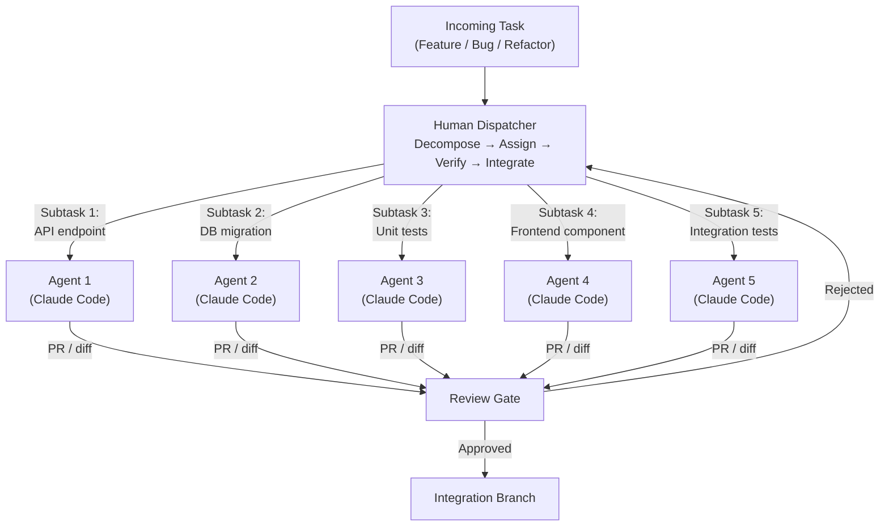
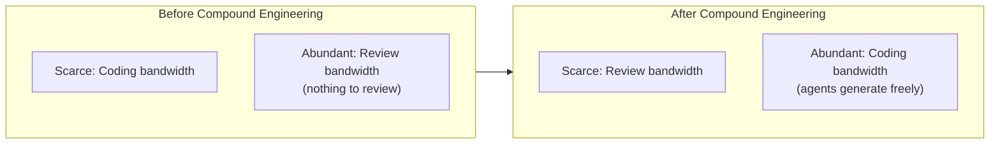
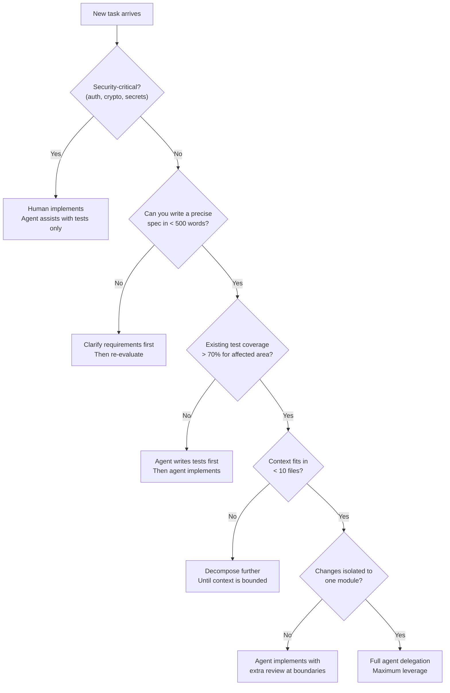
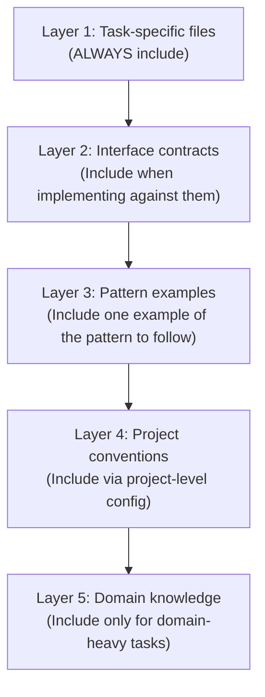

# コンパウンドエンジニアリングの基礎

> この記事は英語版から翻訳されました。最新版は[英語版](/18-compound-engineering/01-compound-engineering-fundamentals)をご覧ください。

## TL;DR

1人のスタッフエンジニアがN個のAIエージェントを並列に指揮することで、アウトプットは非線形に増大します。スループットの上限は、個人のコーディング速度からタスク分解の質とレビュー帯域幅へと移行します。これはシステム設計の問題です。あなたが設計しているのは、人間がスケジューラー、エージェントがワーカー、ボトルネックが検証であるhuman-in-the-loop分散システムです。他のアーキテクチャと同様に扱いましょう。制約を特定し、スループットを最適化し、オブザーバビリティを実装してください。

> **相互参照:** 一般的なエージェントアーキテクチャ、ループ、ツール使用パターンについては[`16-llm-systems/01-agent-fundamentals.md`](../16-llm-systems/01-agent-fundamentals.md)をご覧ください。

---

## パラダイムシフト

### 「コードを書く」から「コード生成を指揮する」へ

シニア/スタッフエンジニアの役割は、もはや「最も多くのコードを書く人」ではありません。「マシンが正しく実装できるほど精密に問題を分解する人」です。レバレッジポイントは次のように移動しました。

| 時代 | ボトルネック | レバレッジスキル |
|-----|-----------|----------------|
| 1950年代 - アセンブリ | 機械命令 | オペコードの知識 |
| 1970年代 - コンパイラ | 意図を機械語に変換 | 言語設計 |
| 2000年代 - フレームワーク | ボイラープレート、配管作業 | API選定、グルーコード |
| 2020年代 - AIエージェント | 実装 | タスク分解、レビュー |

### 歴史的アナロジー

各遷移は同じパターンを辿りました。

1. **コンパイラの発明** -- エンジニアはアセンブリを書かなくなりました。最初の抵抗は「生成された機械語は信用できない」でした。10年以内に、手書きのアセンブリは例外になりました。
2. **フレームワークの発明** -- エンジニアはボイラープレートを書かなくなりました。最初の抵抗は「フレームワークは意見が強すぎる」でした。10年以内に、手書きのHTTPサーバーは例外になりました。
3. **AIエージェント** -- エンジニアは実装を書かなくなります。現在の抵抗は「生成されたコードは信用できない」です。パターンはまったく同じです。

3つの遷移すべてに共通する法則は、**下の抽象化レイヤーを理解しているエンジニアが、上の抽象化レイヤーをより効果的に使いこなせる**ということです。コードを深く理解しているスタッフエンジニアは、まったくコードが書けない人よりもはるかに効果的にAIエージェントを指揮できます。

また、各遷移に共通する誤解もあります。それは、以前のスキルが時代遅れになるというものです。コンパイラエンジニアは最適化のためにアセンブリを理解する必要があります。フレームワークユーザーはデバッグのためにHTTPを理解する必要があります。コンパウンドエンジニアは、レビュー、分解、統合を効果的に行うために、コードを深く理解する必要があります。スキルは時代遅れになるのではなく、次のレイヤーでのレバレッジの基盤となります。

### 「10xエンジニア」神話が現実になる

「10xエンジニア」は常にやや神話的でした。個人のタイピング速度と構文知識には収穫逓減があります。しかし、コンパウンドエンジニアリングは計算式を変えます。

```
従来型:     output = skill × hours × 1 (シングルスレッド)
コンパウンド: output = decomposition_quality × agents × review_throughput
```

強力な分解スキルを持つスタッフエンジニアが5つのエージェントを並列実行すると、適切なタスクにおいて単独のエンジニアの10-30倍のアウトプットを本当に生産します [1]。注意点は「適切なタスク」という条件が大きな役割を果たしているということです。

---

## 生産性倍率モデル

すべてのタスクがエージェント委任から等しく恩恵を受けるわけではありません。倍率は3つの軸に依存します。

1. **仕様の明確さ** -- タスクをプロンプトで曖昧さなく記述できますか？
2. **検証コスト** -- 正確性を確認するのにどれだけのコストがかかりますか？
3. **コンテキスト要件** -- どれだけの暗黙知が必要ですか？

### 倍率テーブル

| タスク種別 | 倍率 | 理由 | 検証方法 |
|-----------|-----|------|---------|
| グリーンフィールド機能 | 3-5倍 | 明確な仕様、独立したスコープ、暗黙の制約が少ない | テスト、手動レビュー |
| リファクタリング | 5-10倍 | 機械的な変換、明確な入出力 | 既存テストスイート、差分レビュー |
| テスト生成 | 8-15倍 | パターンマッチングの強み、仕様がテストそのもの | カバレッジ指標、ミューテーションテスト |
| バグ調査 | 2-3倍 | 深いコンテキストが必要、非自明な因果関係 | 根本原因の確認 |
| アーキテクチャ設計 | 1-1.5倍 | 判断集約型、トレードオフが多い、組織コンテキストが必要 | ピアレビュー、経験 |
| セキュリティクリティカルなコード | 0.5-1倍 | 高いレビューコストが速度向上を相殺、敵対的思考が必要 | セキュリティ監査、ペネトレーションテスト |

### 倍率の読み方

1倍未満の倍率は、総時間（生成+レビュー+修正）が手動実装を超えることを意味します。セキュリティクリティカルなコードがここに該当することが多い理由は以下の通りです。

- AI生成の暗号/認証コードのレビューコストは、自分で書くコストを超えます
- 微妙なバグ（タイミング攻撃、パディングオラクル）はカジュアルレビューでは見えません
- バグを見逃した場合の影響範囲が壊滅的です

5倍を超える倍率は、エージェントの速度優位がレビューオーバーヘッドを圧倒するタスクを示します。テスト生成はその典型例です。「仕様」はテスト対象のコードであり、検証はテストの実行であり、パターンは非常に反復的です。

### コンパウンド倍率の計算式

分解されたサブタスクに対してN個のエージェントを並列実行する場合：

```
effective_multiplier = base_multiplier × min(N, decomposable_subtasks) × (1 - review_overhead)
```

各変数の説明：
- `base_multiplier` は上記テーブルの値
- `N` は並列エージェント数
- `decomposable_subtasks` は真に独立した部分の数
- `review_overhead` はレビューに費やす時間の割合（通常0.15-0.35）

**例：** 5つのエージェントで10個の独立モジュールのテストを生成する場合：

```
effective = 10 × min(5, 10) × (1 - 0.20) = 10 × 5 × 0.80 = 40倍
```

これがテスト生成キャンペーンがコンパウンドエンジニアリングの代表例である理由です。

---

## コンパウンドエンジニアリングが機能する条件

コンパウンドエンジニアリングは以下の条件が満たされたときに最大の価値を発揮します。並列エージェントを起動する前のプリフライトチェックリストとして使用してください。

### プリフライトチェックリスト

```
✅ 明確なインターフェース   — モジュール境界が明確に定義されている（APIコントラクト、型、スキーマ）
✅ 良好なテストカバレッジ   — 既存テストがエージェント出力の正確性オラクルとして機能する
✅ 決定論的な仕様         — 要件が曖昧さなく記述できる
✅ 独立したモジュール      — 変更がコードベース全体に波及しない
✅ 強い型システム         — コンパイラがエージェント出力のカテゴリエラーを検出する
✅ CI/CDパイプライン      — エージェント生成のコミットごとに自動検証
✅ リンティング/フォーマット — スタイルの一貫性がレビューではなく機械的に強制される
✅ 文書化されたパターン    — エージェントが参照できる既存のコード例
```

### 各条件が重要な理由

**明確なインターフェース** -- エージェントはコンテキストウィンドウ上で動作します。タスクがコードベース全体の理解を必要とする場合、エージェントは境界をハルシネーションします。明確に定義されたインターフェースにより、エージェントのコンテキストを単一モジュールにスコープできます。

**良好なテストカバレッジ** -- テストは最も安価な検証メカニズムです。200個の既存テストに合格するコードを生成するエージェントは、手動検証が必要なコードを生成するエージェントよりも圧倒的に信頼性が高いです。

**決定論的な仕様** -- 「もっとサクサクにして」はエージェントに委任できるタスクではありません。「/api/searchのp95レイテンシを800msから200msに削減するために、5分TTLのRedisキャッシュを追加する」は委任可能です。

**独立したモジュール** -- モジュールAを変更するためにB、C、Dの協調的な変更が必要な場合、エージェント間で作業を並列化できません。独立性は並列性の前提条件です。分散システムと同じです。

### 理想的なタスクプロファイル



---

## 失敗する場合

各失敗モードには明確な根本原因があります。根本原因を理解することで、真の問題がタスクのフレーミングにあるにもかかわらず「AIの限界」を責めるという一般的な間違いを防げます。

### 失敗モード1: 暗黙のコンベンション

**症状：** エージェント生成のコードは技術的に正しいが、チームのコンベンションに違反している。

**根本原因：** コンベンションがコードではなく部族知識として存在している。エージェントは「ここでは常にリポジトリパターンを使用する」や「エラーメッセージは顧客向けにフレンドリーでなければならない」にアクセスできません。

**例：**
```python
# Team convention (undocumented): all database queries go through the repository layer
# Agent generates:
class OrderService:
    def get_order(self, order_id: str):
        return db.session.query(Order).filter_by(id=order_id).first()  # Direct DB access

# Expected:
class OrderService:
    def __init__(self, order_repo: OrderRepository):
        self.order_repo = order_repo

    def get_order(self, order_id: str):
        return self.order_repo.find_by_id(order_id)
```

**修正：** コンベンションをリンティングルール、アーキテクチャ判断記録（ADR）、または`.cursorrules`/`CLAUDE.md`スタイルのプロジェクト指示に成文化してください。機械的に強制できないコンベンションは、エージェントによって違反されます。

### 失敗モード2: 文書化されていない不変条件

**症状：** エージェント生成のコードが「全員が知っている」が誰も書き留めていない不変条件を破る。

**根本原因：** システム不変条件（例：「user.emailは常に小文字」「タイムスタンプは常にUTC」「アカウントIDはシャード間でグローバルに一意」）がエンジニアの頭の中にある。

**例：**
```go
// Undocumented invariant: account IDs must be prefixed with region code
// Agent generates:
func CreateAccount(name string) Account {
    return Account{
        ID:   uuid.New().String(),  // Missing region prefix
        Name: name,
    }
}

// Expected:
func CreateAccount(name string, region string) Account {
    return Account{
        ID:   fmt.Sprintf("%s-%s", region, uuid.New().String()),
        Name: name,
    }
}
```

**修正：** 不変条件は型レベルまたはバリデーションレイヤーで強制する必要があります。コードレビューでのみ強制される不変条件は、エージェントが見逃し、最終的には人間も見逃します。

### 失敗モード3: レガシーのもつれ

**症状：** エージェント生成のコードは単独で動作するが、レガシーシステムに統合すると壊れる。

**根本原因：** レガシーシステムは暗黙の依存関係を蓄積します。実行順序の前提、共有可変状態、文書化されていない副作用。エージェントは見せられたコードからこれらを推論できません。

**修正：** レガシーコードベースで作業を委任する前に、特性テストに投資してください。これらのテストは実際のシステム動作（意図された動作ではなく）をキャプチャし、エージェントに正確性のオラクルを提供します。

### 失敗モード4: セキュリティ重要パス

**症状：** エージェント生成の認証/暗号コードに微妙な脆弱性がある。

**根本原因：** セキュリティコードは敵対的思考を必要とします。攻撃者が何をするかを推論する必要があります。LLMは一般的なケースに最適化しており、敵対的なケースには最適化していません。タイミング攻撃、TOCTOU競合、暗号の誤用は体系的に過小評価されています。

**修正：** 専門家によるセキュリティレビューなしにセキュリティクリティカルな実装をエージェントに委任しないでください。レビューコストは通常、生成速度の利点を超えるため、実効倍率は1倍未満になります。

### 失敗モードのまとめ

| 失敗モード | 根本原因 | 検出 | 予防 |
|------------|---------|------|------|
| 暗黙のコンベンション | 部族知識 | コードレビューで遅れて発覚 | リンティング/プロジェクトルールに成文化 |
| 文書化されていない不変条件 | 非公式な契約 | 統合テストの失敗 | 型レベルでの強制 |
| レガシーのもつれ | 隠れた依存関係 | 本番障害 | 特性テスト |
| セキュリティ重要パス | 非敵対的最適化 | セキュリティ監査（運が良ければ） | セキュリティコードは人間が書く |

---

## ディスパッチャーメンタルモデル

コンパウンドエンジニアリングでは、人間はワークスティーリングスケジューラーにおける**ディスパッチャー**として機能します [1]。あなたはコードを書いているのではなく、パイプラインを運用しているのです。

### ディスパッチループ

```
1. INTAKE      — フィーチャー/タスク/バグを受け取る
2. DECOMPOSE   — 明確な仕様を持つエージェントサイズのサブタスクに分解する
3. ASSIGN      — スコープされたコンテキストと共にサブタスクを並列エージェントに割り当てる
4. VERIFY      — エージェント出力を仕様、テスト、不変条件に対してレビューする
5. INTEGRATE   — 検証済みの出力をマージし、横断的な関心事を解決する
6. REPEAT      — 統合の問題を新しいサブタスクとしてフィードバックする
```

### ディスパッチャーアーキテクチャ



### 分解品質がボトルネック

システム全体のスループットは分解品質に制約されます。不適切な分解は以下を引き起こします。

- **エージェントのスラッシング** -- 不明確な仕様のタスクがエージェントに誤った出力を生成させ、複数回のイテレーションを必要とする
- **統合地獄** -- 隠れた依存関係を持つタスクがマージ時に競合する出力を生成する
- **レビュー爆発** -- スコープが不適切なタスクがレビューにコストのかかる大きな差分を生成する

良い分解は以下の特性を持ちます。

| 特性 | 説明 | テスト |
|------|------|--------|
| **アトミック** | 各サブタスクが単一のレビュー可能な作業単位を生成する | 期待される出力を一文で記述できますか？ |
| **独立** | サブタスクは任意の順序で実行可能 | サブタスクAの完了にサブタスクBの出力が必要ですか？ |
| **テスト可能** | 各サブタスクに検証メカニズムがある | エージェントが開始する前にテストを書けますか？ |
| **コンテキスト制約付き** | エージェントはリポジトリ全体ではなく数ファイルのみ必要 | エージェントが読む必要のあるすべてのファイルをリストできますか？ |

### 実際の分解例

**タスク：** SaaSアプリケーションに新しい「チーム」機能を追加する。

**悪い分解（1エージェント、モノリシック）：**
```
"CRUD操作、メンバーシップ管理、ロールベースアクセス制御、
 課金統合、React UIを含むチーム機能を追加してください。"
```

**良い分解（5エージェント、並列化）：**

| エージェント | サブタスク | 入力コンテキスト | 出力 | 検証 |
|------------|----------|----------------|------|------|
| 1 | チーム、メンバーシップのDBスキーマ + マイグレーション | 既存スキーマファイル、マイグレーション規約 | マイグレーションファイル | マイグレーションが前進/後退ともにクリーンに実行 |
| 2 | チームCRUD APIエンドポイント | API規約ドキュメント、認証ミドルウェア、エージェント1のスキーマ | ルートハンドラー + リクエスト/レスポンス型 | APIコントラクトテスト合格 |
| 3 | メンバーシップサービス（招待、参加、退出、ロール） | エージェント1のスキーマ、RBACパターンファイル | サービス + ユニットテスト | ユニットテスト合格、RBACルール検証済み |
| 4 | チーム管理UI用Reactコンポーネント | デザインシステムコンポーネント、エージェント2のAPI型 | Reactコンポーネント + stories | Storybookレンダリング、スナップショットテスト合格 |
| 5 | チームライフサイクル全体の統合テスト | エージェント2のAPIエンドポイント、エージェント3のサービス | テストスイート | 全統合テストがグリーン |

依存関係の順序に注目してください。エージェント1が最初に実行され（スキーマ）、次に2+3が並列、その後4+5が並列です。人間がウェーブを順序付けます。

### ツーエージェントパターン

複数セッションにまたがる長期実行プロジェクトでは、Anthropicはプロジェクトのブートストラップとインクリメンタルな進捗を分離する実証済みのツーエージェントパターンに収束しています [2]。

**イニシャライザーエージェント（最初のセッション）：**

イニシャライザーはプロジェクト基盤を確立するために一度だけ実行されます。

- プロジェクト構造を設定する（ディレクトリ、設定、ボイラープレート）
- **フィーチャーリスト**を作成する。重要なのは、MarkdownではなくJSON形式です [2]。JSONはセッション間でのモデルによる破損に対してより耐性があります：
  ```json
  [
    {"feature": "auth", "status": "failing", "tests": ["test_login", "test_logout"]},
    {"feature": "dashboard", "status": "not_started", "tests": ["test_render", "test_data_fetch"]},
    {"feature": "notifications", "status": "not_started", "tests": ["test_send", "test_preferences"]}
  ]
  ```
- `init.sh`を書く。後続セッションが環境状態を復元するために実行するブートストラップスクリプト
- 新しい作業を開始する前に合格しなければならないベースラインテストを確立する
- `claude-progress.txt`をセッション間ログファイルとして作成する [2]

**コーディングエージェント（後続セッション）：**

各コーディングセッションは決定論的なスタートアップシーケンスに従います [2]。

1. `pwd` -- 作業ディレクトリを確認
2. gitログを読む -- 前回のセッション以降の変更を把握
3. `claude-progress.txt`を読む -- 何が達成され何が失敗したかを把握
4. JSONフィーチャーリストから次のフィーチャーを選択（最初の`not_started`または`failing`アイテム）
5. `init.sh`を実行 -- 環境を復元、依存関係をインストール、ツールチェーンを検証
6. ベースラインテストを実行 -- 開始前に何も壊れていないことを確認
7. 選択したフィーチャーを実装
8. フィーチャーリストJSONとプログレスファイルを更新
9. フィーチャーを参照する明確なメッセージでコミット

**なぜこれが機能するか：**

スタートアップシーケンスは「コールドスタート」問題を解消します。エージェントはプロジェクト状態を再発見する必要がありません。前回のセッションが残した構造化されたアーティファクトを読むだけです。JSONフィーチャーリストは、モデルがMarkdownチェックリストを編集する際に発生するドリフト（チェック済みアイテムが外れる、順序が変わる、重複が出現する）を防ぎます。

**主要なアンチパターン：「ワンショット」。** 単一セッションでアプリケーション全体を構築しようとすることは、最も一般的な失敗モードです [2]。複雑なプロジェクトは複合的な進捗を伴う複数セッションが必要です。ツーエージェントパターンはこの現実をワークフローにエンコードします。イニシャライザーはスプリントではなくマラソンのためにセットアップします。

**アーティファクトによるセッション継続性：**

```
claude-progress.txt (追記のみ):
  [2026-03-14 09:00] Session started. Selected feature: auth
  [2026-03-14 09:15] Created auth middleware, login endpoint
  [2026-03-14 09:30] test_login passing, test_logout failing (session expiry bug)
  [2026-03-14 09:45] Session ended. Auth feature status: failing

  [2026-03-15 10:00] Session started. Selected feature: auth (retry)
  [2026-03-15 10:10] Fixed session expiry, both tests passing
  [2026-03-15 10:15] Updated feature list. Selected next: dashboard
```

このパターンは数十セッションにわたる20以上のフィーチャーを持つプロジェクトにスケールします。プログレスファイルはプロジェクトの真実の情報源となります。差分だけでなく意図をキャプチャするため、gitの履歴単体よりも信頼性が高くなります。

---

## 認知負荷のシフト

コンパウンドエンジニアリングは認知負荷を削減するのではなく、シフトさせます。このシフトを理解することは、間違った活動で燃え尽きることなくモデルを採用するために重要です。

### 人間がやめること

| 活動 | 委任される理由 | 残存する人間の役割 |
|------|--------------|------------------|
| ボイラープレートの作成 | 機械的、パターンベース | パターンを一度指定する |
| 構文の検索 | エージェントは完全な言語知識を持つ | なし |
| ユニットテストの作成 | 高パターンマッチング、仕様はコード | テスト戦略の定義、エッジケースのレビュー |
| 既知のアルゴリズムの実装 | 教科書的な解法、十分に文書化済み | 正しいアルゴリズムの選択 |
| CRUDエンドポイントの作成 | 極めて定型的 | リソースモデルの定義 |
| 仕様からのCSS/スタイリング | デザインからの決定論的変換 | 視覚出力のレビュー |

### 人間が始めること

| 活動 | 人間が担当する理由 | 必要なスキル |
|------|------------------|-------------|
| タスク分解 | システムレベルの理解が必要 | アーキテクチャ、経験 |
| レビューと検証 | すべてのエージェント出力をtrust-but-verify | 深いコードリーディング |
| 統合オーケストレーション | 横断的な関心事がエージェント境界をまたぐ | システム思考 |
| 品質ゲート | 「これで十分か」の判断 | 判断力、テイスト |
| コンテキストキュレーション | エージェントが見るべきものの選択 | コードベースの知識 |
| 失敗モード分析 | エージェントが誤った出力を生成した理由の理解 | コードではなくプロンプトのデバッグ |

### 新たな希少リソース



**レビュー帯域幅**がシステムのボトルネックになりました。その影響は以下の通りです。

1. **レビューはバッチで、小出しにしない** -- エージェントの5つのPRを集中セッションでレビューし、他のタスクの合間に1つずつレビューしない
2. **自動検証に投資する** -- 書くテスト1つごとに、レビュー帯域幅を恒久的に回収できます
3. **タスクタイプごとのレビューチェックリストを作成する** -- 構造化によりレビューの認知負荷を削減
4. **エージェントにエージェントをレビューさせる** -- 2番目のエージェントが最初のエージェントの出力をレビューすることで機械的なエラーを検出し、人間のレビューを判断力が必要な部分に集中させる

### 認知負荷バジェット

有用なメンタルモデル：あなたには固定の日次認知バジェットがあります。コンパウンドエンジニアリングにより再配分が可能になります。

```
従来の配分:
  40% — 実装（タイピング、構文、デバッグ）
  25% — 設計（アーキテクチャ、API設計）
  20% — コミュニケーション（PR、ドキュメント、ミーティング）
  15% — レビュー（他者のコード）

コンパウンド配分:
  10% — 実装（エージェントが処理できないエッジケース）
  20% — 設計（アーキテクチャ、分解）
  15% — コミュニケーション（PR、ドキュメント、ミーティング）
  40% — レビュー（エージェント出力、統合）
  15% — オーケストレーション（タスクディスパッチ、コンテキストキュレーション）
```

実装の40%からレビューの40%へのシフトが、コンパウンドエンジニアリングの定義的特徴です。

---

## 組織への影響

コンパウンドエンジニアリングは単なる個人の生産性テクニックではありません。スケールすると、チーム構造、採用基準、コストモデル、キャリアラダーを変化させます。

### チームサイズの変化

**以前：** チームは実装能力に基づいてサイズが決まりました。6-8人の「ツーピザチーム」が限られたサービスセットを担当していました。

**以降：** 各エンジニアのスループットが向上するため、チームは小さくできます。しかし制約は移動します。

| チームサイズの決定要因 | 以前 | 以降 |
|---------------------|------|------|
| 実装スループット | 6-8人のエンジニア | 2-3人のエンジニア + エージェント |
| レビュースループット | ボトルネックではない | 主要な制約 |
| システム理解 | チーム全体に分散 | 集中させる必要がある |
| オンコール体制 | ヘッドカウントが必要 | 変わらない（人間が本番をデバッグ） |

**警告：** チームを積極的に縮小するのは罠です。オンコール、休暇対応、知識の冗長性には依然として人間のヘッドカウントが必要です。コンパウンドエンジニアリングは主に実装ボトルネックを削減しますが、運用上のボトルネックは削減しません。

### 役割の進化

| 役割 | 従来型 | コンパウンドエンジニアリング時代 |
|------|--------|-------------------------------|
| ジュニアエンジニア | シンプルな機能を書き、パターンを学ぶ | エージェント出力をレビューし、より多くのコードを読んで学ぶ |
| ミッドレベルエンジニア | 機能をエンドツーエンドで実装 | 2-3個のエージェントをオーケストレーションし、モジュールを担当 |
| シニアエンジニア | システムを設計し、メンタリング | 分解を設計し、品質ゲートを設定 |
| スタッフエンジニア | アーキテクチャを定義し、組織に影響を与える | コンパウンドエンジニアリングワークフロー自体を設計 |
| エンジニアリングマネージャー | 人材とデリバリーを管理 | 人間-エージェントシステムとAPIコスト予算を管理 |

### コストモデルの変化

コスト方程式は根本的に変わります。

```
従来のコスト:
  total_cost = engineer_salary × headcount × time

コンパウンドコスト:
  total_cost = (engineer_salary × reduced_headcount × time) + (api_cost × tokens × agents)
```

主要な違い：

| 次元 | 給与モデル | APIモデル |
|------|-----------|----------|
| スケーリング | ヘッドカウントに線形 | トークン従量課金、弾力的 |
| アイドルコスト | アイドル時も全額給与 | 生成しない時はゼロ |
| 立ち上げ時間 | 新規採用者は3-6ヶ月 | 即時（コンテキストはプロンプトで） |
| 知識の保持 | 退職すると失われる | ドキュメント + プロンプトから再現可能 |
| タスク1件追加の限界コスト | 機会費用（他の作業を押しのける） | 直接コスト（トークン） |

**コスト監視がエンジニアリングの関心事になりました。** フィーチャーごと、エージェントごと、タスクタイプごとのAPIコストを追跡してください。予算を設定してください。異常にアラートを出してください。これはクラウドコスト管理と同じ規律であり、同等に重要です。

### 新しい採用シグナル

| 従来のシグナル | コンパウンドエンジニアリングのシグナル |
|--------------|--------------------------------------|
| コーディングチャレンジが速い | コード差分のレビューが速い |
| 1つの言語の深い知識 | 言語を横断する幅広さ（エージェントはポリグロット） |
| 複雑なアルゴリズムを実装できる | 複雑な問題を分解できる |
| ゼロからクリーンなコードを書く | 生成されたコードの問題を特定できる |
| 強い個人貢献者 | 強いオーケストレーターとレビュアー |
| コードを書いた年数 | コードを読んだ年数 |

これはコーディングスキルが無関係であることを意味しません。むしろその逆です。理解できないコードをレビューすることはできません。構築したことのないシステムを分解することはできません。深い実装経験は効果的なコンパウンドエンジニアリングの前提条件であり、置き換え対象ではありません。

### コンパウンドループ

Every.toの方法論から、コンパウンドエンジニアリングを生産性テクニックから自己改善システムに昇華させる原則が生まれています。**各エンジニアリング作業単位が、後続の単位をより容易にするべきです。** [1]

**ループ：**

```
Plan (80% of effort)
  → Work (20% of effort)
    → Review
      → Compound (feed learning back)
        → Plan (next iteration, now easier)
```

直感に反する比率 -- 80%の計画、20%の実行 [1] -- は、エージェントの実行はコストが低いが、方向性を誤った実行はコストが高いという現実を反映しています。十分に分解され、十分に仕様化されたタスクはエージェント時間10分で済みます。不十分に仕様化されたものはエージェント時間10分に加えて人間の修正45分がかかります。計画への投資は最初のイテレーションで元を取り、以降のすべてのイテレーションで複利効果を生みます。

**学習の体系的な文書化：**

エージェント支援の作業中に遭遇したすべてのバグ、パフォーマンスの問題、問題解決の洞察をキャプチャし、将来の作業のためにエージェントのコンテキストにフィードバックする必要があります [1]。これは任意のドキュメントではなく、複利メカニズムそのものです。

キャプチャすべきもの：

- **失敗パターン：** 「エージェントはデータベースタイムアウトのエラーハンドリング追加を一貫して忘れる。CLAUDE.mdチェックリストに追加する。」
- **効果的なプロンプト：** 「正確なテストファイルパスをプロンプトに指定すると、イテレーション回数が3から1に減少する。」
- **アーキテクチャの発見：** 「決済モジュールにユーザーセッションキャッシュへの文書化されていない依存関係がある。モジュール依存関係マップに追加する。」
- **パフォーマンスの洞察：** 「1000行を超えるバッチ挿入はチャンクトランザクションを使用する必要がある。明示的な指示がないとエージェントは単一トランザクションをデフォルトとする。」

**プロジェクト後のレトロスペクティブ：**

すべての重要なプロジェクト（スプリントだけでなく、個別のマルチセッションプロジェクト）の後に、再利用可能なパターンを抽出してください。

1. どの分解戦略が機能しましたか？どれが統合コンフリクトを生みましたか？
2. どのプロンプトパターンが初回で成功しましたか？どれがイテレーションを必要としましたか？
3. エージェントエラーの原因となった欠落コンテキストは何でしたか？
4. 成文化すべき新しいコンベンションは何が浮上しましたか？

**生きたドキュメントとしてのCLAUDE.md：**

これが、プロジェクトレベルの指示ファイル（`.claude/CLAUDE.md`、`.cursorrules`など）を生きたドキュメントとして扱い、すべてのプロジェクトの後に更新すべき理由です。一度書いて忘れるのではありません。各レトロスペクティブはプロジェクト指示への少なくとも1つの更新を生成すべきです。数ヶ月を経て、このファイルはエージェントがコードベースについて知る必要のあるすべてを、過去の失敗の言語で書かれた密なエンコーディングになります。コンパウンドループはすべての失敗を恒久的な改善に変えます。

---

## アンチパターン

### 1. レビューなしのバイブコーディング

**説明：** エージェント出力を行単位のレビューやテスト検証なしに「正しそうに見える」からと受け入れる。

**根本原因：** レビュー疲れ。エージェントが大量のコードを生成すると、スキム承認の誘惑が強くなります。

**結果：** 微妙なバグが蓄積します。技術的負債が複利で増大します。最終的に、本番障害がレビューされていないエージェントコードに遡及し、モデル全体への信頼が崩壊します。

**修正：** レビュー品質ゲートを強制してください。差分を注意深くレビューできない場合、エージェントタスクが大きすぎます。各出力が10-15分でレビュー可能になるまでさらに分解してください。

```
経験則: エージェントの差分が300行を超える場合、
タスク分解が粗すぎます。
```

### 2. セキュリティ/暗号/認証の過剰委任

**説明：** 認証フロー、暗号実装、または認可ロジックをエージェントに委任する。

**根本原因：** セキュリティコードは通常のコードに見えます。エージェントはコンパイルが通り基本テストに合格するものを生成します。脆弱性はコードが行っていないことにあります（タイミングセーフ比較、定数時間操作、適切な鍵導出）。

**結果：** 検出に専門知識が必要なため、コードレビューを通過するセキュリティ脆弱性。

**修正：** 人間による実装が必要なセキュリティクリティカルパスのリストを維持してください。

```
エージェントに委任してはいけないもの:
  - 認証フロー（ログイン、MFA、セッション管理）
  - 暗号操作（ハッシュ化、暗号化、署名）
  - 認可チェック（RBAC、ABAC、権限境界）
  - インジェクション防止のための入力サニタイゼーション
  - シークレット/鍵管理
  - レート制限と不正利用防止
```

### 3. コンテキストウィンドウの乱用

**説明：** コードベース全体をエージェントのコンテキストに投入し、何が関連するかを「理解してくれる」ことを期待する。

**根本原因：** コンテキストキュレーションの怠慢。関連ファイルを慎重に選択するよりも、すべてを含める方が簡単に感じます。

**結果：** エージェントの注意力が希釈されます。無関係なコード間の接続をハルシネーションします。出力品質が低下します。トークンコストが爆発します。

**修正：** コンテキストを意図的にキュレーションしてください。

| コンテキスト項目 | 含める場合 | 除外する場合 |
|-----------------|----------|------------|
| 対象ファイル | 常に | 決して除外しない |
| インターフェース定義 | それに対して実装する場合 | 型から自明な場合 |
| テストファイル | テスト可能なコードを生成する場合 | テスト自体を生成する場合 |
| 設定ファイル | 動作が設定に依存する場合 | デフォルトを使用する場合 |
| モジュール全体 | 決して含めない | 常に -- 特定のファイルを選択 |

### 4. プロンプト・アンド・フォーゲット

**説明：** タスクをエージェントにディスパッチし、出力を検証せずに次に進む。

**根本原因：** エージェントを自己修正できる人間のチームメンバーのように扱うこと。人間と異なり、エージェントは不明確な仕様に異議を唱えたり、エッジケースを先回りして提起したり、確信のないコードの生成を拒否したりしません。

**結果：** 誰も検証していない「たぶん大丈夫」なコードの蓄積。これはテストされていない、レビューされていない変更の時限爆弾を作ります。

**修正：** すべてのエージェントディスパッチに対応するレビュースロットをスケジュールに設けてください。出力をレビューする時間がない場合、タスクをディスパッチしないでください。実用的なルール：エージェント生成時間30分ごとに、カレンダーに15分のレビュー時間をブロックしてください。

**診断：** 未レビューのエージェント出力が同時に3つ以上ある場合、検証できるよりも速くディスパッチしています。ペースを落としてください。

### 5. エージェント＝ジュニアエンジニアの誤解

**説明：** エージェントをコードベースを時間とともに「学習」し改善するジュニアチームメンバーとして扱う。

**根本原因：** エージェントの擬人化。各エージェント呼び出しは（セッション制限内で）ステートレスです。エージェントは昨日のセッションでのフィードバックを覚えていません。

**結果：** 同じコンベンションの繰り返しの指示、「同じミスを繰り返す」ことへのフラストレーションの増大。

**修正：** すべての再利用可能な指示をプロジェクトレベルの設定ファイル（`.claude/CLAUDE.md`、`.cursorrules`など）にエンコードしてください。これらはセッション間で永続化されます。エージェントのオンボーディングドキュメントとして考え、毎回新しくロードされるものと捉えてください。

```
プロジェクトレベルの指示は、エージェントセッション間で
唯一永続的な「メモリ」です。投資してください。
```

---

## 意思決定フレームワーク

このフレームワークを使用して、特定のタスクがエージェント委任に適しているかどうかを判断してください。

### 意思決定フローチャート



### 意思決定マトリックス

クイックリファレンスとして、各軸を1-5で採点し合計してください。

| 軸 | 1（不適合） | 3（中程度の適合） | 5（非常に適合） |
|-----|-----------|-----------------|---------------|
| **タスクの明確さ** | 曖昧で変化する要件 | 多少の曖昧さ、明確化が必要 | 正確な仕様、明確な受入基準 |
| **テストカバレッジ** | テストなし、手動QAのみ | 部分的なカバレッジ、一部にギャップ | 包括的なスイート、CIで強制 |
| **セキュリティ感度** | 認証、暗号、PII処理 | 認証境界に接触 | セキュリティへの影響なし |
| **コンテキストサイズ** | 50以上のファイルが必要 | 10-20のファイルが必要 | 1-5のファイルが必要 |
| **モジュールの独立性** | 5以上のサービスにまたがる横断的 | 2-3モジュールに接触 | 単一モジュール、明確なインターフェース |

**採点ガイド：**

| 合計スコア | 推奨 |
|-----------|------|
| 20-25 | 完全委任 -- エージェントが実装し、人間がレビュー |
| 14-19 | 部分委任 -- エージェントがドラフトし、人間が洗練 |
| 8-13 | 支援 -- 人間が実装し、エージェントがテスト/ドキュメントを支援 |
| 5-7 | 手動 -- 人間が完全に実装 |

### タスク適合性クイックリファレンス

| タスク | 委任？ | 備考 |
|--------|-------|------|
| 既存リソースの新しいRESTエンドポイント | はい | 高パターンマッチング、明確なコンベンション |
| データベースマイグレーション（カラム追加） | はい | 機械的、明確に定義 |
| 循環的複雑性を減らすための関数リファクタリング | はい | 機械的な変換 |
| 既存モジュールのユニットテスト作成 | はい | 典型的なエージェントタスク |
| OAuth2フローの実装 | いいえ | セキュリティクリティカル |
| 本番の競合状態のデバッグ | 部分的 | エージェントはログ/トレースを追加可能、人間が診断 |
| 新しいマイクロサービス境界の設計 | いいえ | 判断集約型、組織コンテキスト |
| RESTからGraphQLへの移行 | はい（分割して） | リソースごとに分解、並列化 |
| 統合テストの作成 | はい | 明確なパターン、自動検証 |
| パフォーマンス最適化 | 部分的 | エージェントがプロファイリング、人間が戦略を決定 |
| ADRの作成 | いいえ | 組織コンテキストと判断が必要 |
| 依存関係のメジャーバージョンアップグレード | はい | 機械的、コンパイラ/テストガイド |

---

## コンテキストキュレーション戦略

エージェント出力の品質は、提供するコンテキストの品質に正比例します。コンテキストキュレーションはコンパウンドエンジニアリングにおける一級のエンジニアリングスキルです。

### コンテキストピラミッド



### コンテキストバジェットルール

有用なヒューリスティック：**エージェントのコンテキストを10ファイル、合計2000行以下に保ってください。** このしきい値を超えると、出力品質が計測可能に低下します。その理由は以下の通りです。

- 注意力の希釈によりハルシネーション率が増加する
- エージェントが無関係なファイルからパターンを交差汚染し始める
- トークンコストは線形にスケールするが、品質はサブリニアにスケールする

### コンテキストキュレーションチェックリスト

```
各エージェントタスクについて、以下に回答してコンテキストを選択してください：

1. エージェントがどのファイルを修正しますか？           → 常に含める
2. 新しいコードはどのインターフェースを実装しますか？   → 型/インターフェースファイルを含める
3. どの既存コードをパターンマッチすべきですか？        → 1つの例を含める（5つではない）
4. どのテストが出力を検証しますか？                   → テストファイルが存在すれば含める
5. どのコンベンションに従う必要がありますか？          → プロジェクトレベル設定に依存
6. 知る必要がないものは何ですか？                     → 明示的に除外
```

最後の質問は他の質問と同じくらい重要です。無関係なコンテキストを積極的に除外することで、エージェントが偽のパターンを見つけることを防ぎます。

---

## 実践的ワークフロー：5つのエージェントの並列実行

コンパウンドエンジニアリングの実例です。

### シナリオ

タスクを受け取ります：「OrdersサービスのすべてのAPIエンドポイントに監査ログを追加する。」

### ステップ1：分解（15分、人間）

サブタスクを特定します：
1. 監査ログスキーマとデータベースマイグレーションの定義
2. 監査ログミドルウェアの作成
3. すべてのorderエンドポイントにミドルウェアを追加
4. 監査ミドルウェアのユニットテストの作成
5. 監査ログの正確性の統合テストの作成

### ステップ2：ディスパッチ（5分、人間）

スコープされたコンテキストで5つのエージェントセッションを開始します。

```
Agent 1: "Create a database migration for an audit_logs table.
          Columns: id, timestamp, user_id, action, resource_type,
          resource_id, request_body, response_status.
          Reference: db/migrations/ for convention."

Agent 2: "Create an Express middleware that logs every request
          to the audit_logs table. Accept: user_id from req.auth,
          action from req.method, resource from req.path.
          Reference: src/middleware/ for patterns."

Agent 3: (blocked on Agent 2) "Apply the audit middleware to all
          routes in src/routes/orders/. Reference: Agent 2's
          middleware file."

Agent 4: "Write unit tests for the audit logging middleware.
          Mock the database. Test: successful log, failed log,
          missing auth. Reference: tests/middleware/ for patterns."

Agent 5: (blocked on Agents 1+2) "Write integration tests that
          hit order endpoints and verify audit_logs table entries.
          Reference: tests/integration/ for patterns."
```

### ステップ3：レビュー（30分、人間）

エージェントが完了するごとに、各出力をレビューします。
- エージェント1：スキーマ、インデックスの選択、マイグレーションのロールバックを確認
- エージェント2：ミドルウェアの登録、エラーハンドリング、非同期動作を確認
- エージェント3：ルートカバレッジの完全性を確認
- エージェント4：エッジケース、モックの正確性を確認
- エージェント5：テストの独立性、クリーンアップを確認

### ステップ4：統合（15分、人間）

すべてのエージェント出力をマージし、コンフリクトを解決し、フルテストスイートを実行します。

**合計時間：** 従来4-6時間かかるものが約65分。

---

## コンパウンドエンジニアリングの有効性測定

計測しないものは改善できません。以下のメトリクスを追跡してください。

### 個人メトリクス

| メトリクス | 定義 | 目標 |
|-----------|------|------|
| 分解ヒット率 | 初回で使える出力を生成するエージェントタスクの割合 | > 80% |
| 差分あたりのレビュー時間 | 各エージェント出力のレビューに費やす分数 | < 15分 |
| イテレーション数 | タスクあたりのやり取り回数 | < 2 |
| 統合失敗率 | 統合時に失敗するエージェント出力の割合 | < 10% |

### チームメトリクス

| メトリクス | 定義 | 目標 |
|-----------|------|------|
| エージェント支援ベロシティ | スプリントあたりのエージェント支援で完了したストーリーポイント | 上昇傾向 |
| ストーリーポイントあたりのコスト | APIコスト / 完了したストーリーポイント | 下降傾向 |
| 欠陥エスケープ率 | エージェント生成コードからの本番バグ | 人間生成と同等以下 |
| レビューボトルネック比率 | タスクがレビュー待ちの時間 / タスク合計時間 | < 30% |

### トラブルの先行指標

- レビュー時間が上昇傾向 → エージェントタスクが大きすぎる、さらに分解する
- イテレーション数が上昇傾向 → 仕様が曖昧すぎる、プロンプトエンジニアリングに投資する
- 統合失敗が上昇傾向 → タスク間の隠れた依存関係
- タスクあたりのAPIコストが上昇傾向 → コンテキストウィンドウの乱用、コンテキストをより適切にキュレーションする

---

## 成熟度モデル

コンパウンドエンジニアリングの採用は予測可能な成熟度カーブに従います。自分がどこにいるかを知ることで、適切な改善に集中できます。

### 成熟度レベル

| レベル | 名称 | 特徴 | 典型的な倍率 |
|--------|------|------|-------------|
| 0 | **手動** | エージェント使用なし。すべてのコードが人間作成。 | 1倍（ベースライン） |
| 1 | **支援** | エージェントをオートコンプリートとして使用。シングルターン補完。分解なし。 | 1.5-2倍 |
| 2 | **委任** | エージェントがフルタスクを処理。人間が分解とレビュー。シングルエージェント。 | 3-5倍 |
| 3 | **並列** | 分解されたサブタスクに複数エージェント。人間がオーケストレーション。 | 5-15倍 |
| 4 | **体系化** | ワークフローがツールにエンコード。メトリクス追跡。コスト管理。エージェントがエージェントをレビュー。 | 10-30倍 |

ほとんどのチームはレベル2で停滞します。レベル3への跳躍には「エージェント＝アシスタント」から「エージェント＝分散システム内のワーカー」へのメンタルモデルの転換が必要です。レベル4への跳躍にはツール、メトリクス、プロセスへの組織的投資が必要です。

### 次のレベルへの準備ができているサイン

- **レベル0 → 1：** LLMをコード生成に少なくとも一度使用し、その価値を実感した。
- **レベル1 → 2：** エージェントに行の補完だけでなく関数全体を書かせるほど信頼している。
- **レベル2 → 3：** ボトルネックがエージェントの可用性ではなく、レビュー帯域幅になっている。
- **レベル3 → 4：** 倍率と失敗モードに関する十分なデータがあり、体系的なワークフローを構築できる。

---

## 重要なポイント

1. **コンパウンドエンジニアリングはシステム設計の問題です。** 人間スケジューラー、AIワーカー、レビューベースの合意メカニズムを持つ分散システムを設計しているのです。他の分散アーキテクチャと同じ厳密さを適用してください。

2. **分解品質がボトルネックです。** システム全体のスループットは、タスクをエージェントサイズの断片にどれだけうまく分解できるかに制約されます。これが新しいコアスキルです。

3. **すべてのタスクが委任可能なわけではありません。** セキュリティクリティカルなコード、アーキテクチャの決定、判断力が求められるタスクは人間が担当すべきです。委任しないことを知ることは、委任することを知ることと同じくらい重要です。

4. **レビュー帯域幅が新たな希少リソースです。** 自動検証（テスト、リンティング、型チェック）に積極的に投資し、人間のレビュー負担を削減してください。

5. **実効倍率はタスクタイプによって0.5-15倍で変動します。** 実際の倍率を計測してください。一律の改善を仮定しないでください。

6. **アンチパターンは体系的であり、偶発的ではありません。** バイブコーディング、過剰委任、コンテキスト乱用はモデルの誤解に起因します。明示的にトレーニングしてください。

7. **組織への影響は実在します。** チームサイズ、採用基準、コストモデル、キャリアラダーのすべてがシフトします。先回りして計画してください。

8. **再利用可能なものはすべてプロジェクトレベルの設定にエンコードしてください。** エージェントにはセッション間のメモリがありません。プロジェクト指示ファイルが唯一の永続的な知識ベースです。

9. **下の抽象化レイヤーを理解するエンジニアが、上のレイヤーを最も効果的に使いこなせます。** 深いコーディングスキルはコンパウンドエンジニアリングの前提条件であり、その犠牲者ではありません。

10. **計測、計測、計測。** 分解ヒット率、レビュー時間、イテレーション数、タスクあたりのコストを追跡してください。計装なしのコンパウンドエンジニアリングはただの推測です。

---

> **次へ：** `18-compound-engineering/02-task-decomposition-patterns.md` -- コンパウンドエンジニアリングワークフローのための分解戦略、依存関係グラフ、並列化パターンの詳細解説。

---

## References

1. [Every.to - Compound Engineering: How Every Codes With Agents](https://every.to/chain-of-thought/compound-engineering-how-every-codes-with-agents), 2026
2. [Anthropic - Effective Harnesses for Long-Running Agents](https://www.anthropic.com/engineering/effective-harnesses-for-long-running-agents), 2026
