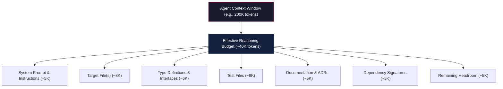
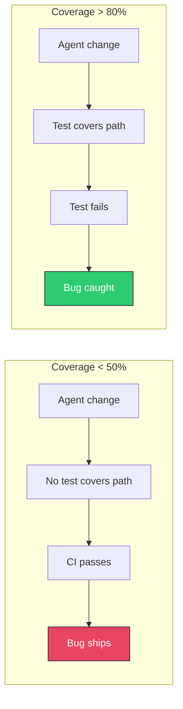
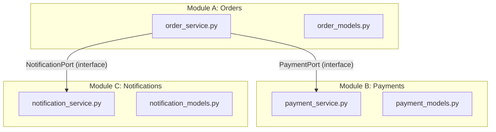
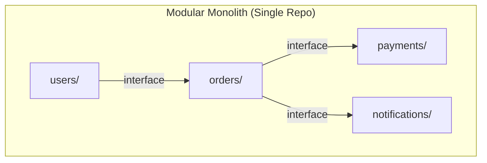
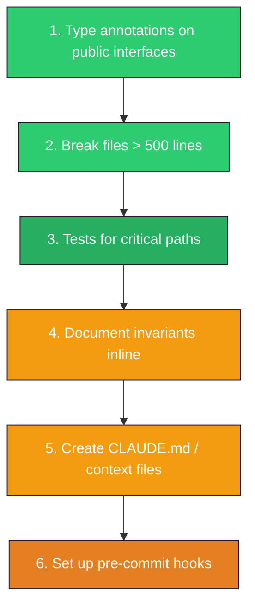

# AI ネイティブアーキテクチャ

> この記事は英語版から翻訳されました。[English version](../../18-compound-engineering/04-ai-native-software-architecture.md)

> AIエージェントによる変更に最適化されたソフトウェアシステムの設計 — パフォーマンス、セキュリティ、保守性と並ぶアーキテクチャ品質属性として、エージェントフレンドリーさを扱います。

---

## TL;DR

AIによる変更に最適化されたソフトウェアは、巧妙で暗黙的あるいは密結合な設計よりも、小さく、十分にテストされ、明示的にドキュメント化されたユニットを優先します [6]。暗黙的な規約のコストは、エージェントの無駄なループとレビュー失敗で測定されます。部族的知識、マジックなメタプログラミング、またはドキュメント化されていない不変条件に依存するすべてのアーキテクチャのショートカットは、すべてのエージェントインタラクションで支払われる税金となり、チームと時間にわたって複利的に増大します。

核心的な洞察 [6]：**新しいエンジニアが初日に理解しやすいコードを作る特性は、AIエージェントが初回の試行で正しく変更しやすいコードを作る特性と同じです。** 違いは、エージェントはこれらの摩擦点に1日に何千回もぶつかるため、修正のROIが劇的に高くなるということです。

---

## 新しいアーキテクチャ制約

すべてのAIコーディングエージェントは**コンテキストウィンドウ** [1] 内で動作します。これは1回のパスで推論できるテキスト量の厳格な上限です。これは緩やかに劣化するソフトリミットではありません。それを超えると、エージェントは文字通りコードを見ることができません。

> **正しい変更を行うために必要な関連コンテキストの総量は、エージェントの実効的な推論能力内に収まらなければなりません。**

200Kトークンのコンテキストウィンドウは、200Kトークンの有用な推論を意味するわけではありません。経験的に、エージェントの精度はウィンドウが満杯になるかなり前から劣化します [2]。実用的なバジェットは、単一の集中的な変更に対して20〜40Kトークンの*関連*コンテキストに近いです。

### コンテキストバジェット配分



### アーキテクチャへの影響

この制約は従来の知見の一部を逆転させます：

| 従来の優先事項 | AI ネイティブの優先事項 |
|---|---|
| あらゆるコストでDRY | DRYよりもコンテキストの局所性 |
| 抽象化レイヤー | 明示的で浅い呼び出しチェーン |
| 設定より規約 | 規約より設定 |
| 巧妙で簡潔なコード | 明白で自己説明的なコード |
| wikiにドキュメント | リポジトリ内、インラインにドキュメント |

優勝するアーキテクチャは、任意の変更に対して**エージェントがロードする必要のある関連コンテキストを最小化**します — CPU設計におけるキャッシュ局所性に類似していますが、キャッシュはコンテキストウィンドウです。

### コンテキスト局所性の原則

任意の変更`C`に対して、`R(C)`をエージェントが`C`を正しく行うために読まなければならないファイルの集合と定義します。アーキテクチャの**コンテキスト局所性**は次のようになります：

```
Context Locality = 1 / avg(|R(C)|) for all common changes C
```

高いほど良いです。すべての変更が正確に1つのファイルにのみ影響する完全にモジュラーなコードベースは、最大のコンテキスト局所性を持ちます。すべての変更が完全な依存関係グラフの理解を必要とする深く結合されたモノリスは、最小のコンテキスト局所性を持ちます。

**設計目標**：変更の90%で、`|R(C)| <= 5ファイル`かつ`total_tokens(R(C)) <= 15K`。

---

## インターフェースとしてのファイルサイズ

ファイルサイズは、エージェントフレンドリーさの最もアクション可能な代理指標です [3]。これは美的な好みではありません — エージェントの失敗モードに関する経験的な観察です。

### 大きなファイルがエージェントを壊す理由

**部分的なファイル読み取り。** 快適な読み取りしきい値を超えるファイルは、チャンク読み取りを強制します。エージェントは2番目のチャンクを処理する間に最初のチャンクのメンタルモデルを失い、離れた行間での調整失敗を引き起こします。

**編集間のコンテキスト喪失。** 大きなファイルへの複数の編集はその都度再読み取りします。1500行のファイルはコンテキストバジェットのほとんどを再ロードに消費し、推論の余地がほとんど残りません。

**分割変更エラー。** 大きなファイルは複数の責務を含みます。2000行の`services.py`で「決済ロジック」を変更するエージェントは、間違った関数を変更したり、800行離れた関連する変更を見逃したりする可能性があります。

**ハルシネーションの増幅。** エージェントのハルシネーション率（関数名の捏造、パラメータ型の誤記憶）はファイルサイズとともに増加します [3] — 追跡するシンボルが増え、注意力が劣化します。

### サイズガイドライン

| ファイルサイズ | エージェントへの影響 | 推奨事項 |
|---|---|---|
| < 200行 | 最適。完全なコンテキスト。 | 集中モジュールに理想的。 |
| 200-400行 | 良好。信頼性のある処理。 | ほとんどのファイルの目標範囲。 |
| 400-500行 | 許容範囲。軽微な劣化。 | 監視し、成長すればリファクタリング。 |
| 500-800行 | 劣化。部分読み取り、調整エラー。 | 先行的にリファクタリング。 |
| 800行以上 | 敵対的。高い失敗率、複数回のリトライ。 | 即座にリファクタリング。 |

### モノリシックファイルのリファクタリングをAIレディネス作業として

```python
# BEFORE: monolithic services.py (1400 lines)
# AFTER: modular package
# services/
# ├── __init__.py          (re-exports for backward compat)
# ├── user_service.py      (280 lines)
# ├── payment_service.py   (320 lines)
# ├── notification.py      (240 lines)
# └── reporting.py         (290 lines)
```

`__init__.py`の再エクスポートパターンは後方互換性を維持します。これにより、決済ロジックを変更するエージェントは1400行をスキャンする代わりに320行のみを読むことになります。

チームは一貫して、500行を超えるファイルの分割後にエージェントのリトライループが30〜50%削減され、「間違った場所」の編集が40〜60%削減されたと報告しています [4]。

---

## 自己文書化APIの原則

AIエージェントは、人間がドキュメントを読むように関数シグネチャを読みます。シグネチャ*こそが*プロンプトです。型なし、ドキュメントなしの関数は、エージェントに実装全体を読むことを強制します。

### Before：エージェント敵対的なインターフェース

```python
def process(data, opts=None):
    """Process the data."""
    if opts is None:
        opts = {}
    threshold = opts.get("threshold", 0.5)
    mode = opts.get("mode", "fast")
    # ... 200 lines of implementation ...
    if result is None:
        return {"status": "error"}
    return {"status": "ok", "output": result, "metadata": {"took": elapsed}}
```

エージェントはdictのキー、型、デフォルト値、返却の形状を発見するために200行の実装を読まなければなりません。

### After：エージェントフレンドリーなインターフェース

```python
class ProcessingMode(Enum):
    FAST = "fast"
    ACCURATE = "accurate"

@dataclass(frozen=True)
class ProcessingOptions:
    """# INVARIANT: threshold must be in [0.0, 1.0]"""
    threshold: float = 0.5
    mode: ProcessingMode = ProcessingMode.FAST
    max_retries: int = 3

@dataclass(frozen=True)
class ProcessingResult(Generic[T]):
    success: bool
    output: T | None
    elapsed_ms: float
    error_message: str | None = None

def process_dataset(
    records: list[dict[str, float]],
    options: ProcessingOptions = ProcessingOptions(),
) -> ProcessingResult[list[float]]:
    """Process numeric records through the scoring pipeline.

    Args:
        records: Input records, keys are feature names, values are scores. Must be non-empty.
        options: Processing configuration. See ProcessingOptions for defaults.

    Returns:
        ProcessingResult with scored outputs on success, or error message on failure.

    Raises:
        ValueError: If records is empty or contains invalid feature names.
    """
    ...
```

エージェントは*実装を読まずに*正しい呼び出し箇所を生成できます。

### シグネチャ完全性チェックリスト

- [ ] すべてのパラメータと戻り値の型アノテーション
- [ ] 動作説明を含むdocstring（単なる「Process the data」ではなく）
- [ ] 文書化された事前条件と事後条件
- [ ] 明示的なエラー/例外のドキュメント
- [ ] 自明でない制約に対するインライン不変条件コメント
- [ ] モード選択にはstringリテラルの代わりにEnum型

---

## エージェントセーフティネットとしてのテストカバレッジ

テストは「エージェントが変更を行った」ことと「エージェントが*正しい*変更を行った」ことの違いです。テストなしでは、エージェントの出力は人間の行ごとのレビューなしに検証不可能です。

### 80%以上のカバレッジが前提条件である理由

80%未満では、エージェントの変更によって重要なコードパスがチェックされません [5]。80%を超えると、残りの20%はエラーハンドリングやインフラストラクチャの糊付けコードである傾向があり、エージェントが変更を行うことが少ない領域です。



### 「エージェント前テスト」ワークフロー

1. **人間が失敗テストを書き**、望ましい動作を仕様化します
2. **エージェントがテストをパスさせる**機能を実装します
3. **人間がdiffをレビュー**し、テスト仕様に対して確認します

これが機能するのは、テストが明確な成功基準を持つ正確で実行可能な仕様だからです。人間のレビュー対象は小さく、「実装はテストの意図と一致しているか？」です。

```python
# Step 1: Human writes this test
def test_transfer_between_accounts():
    ledger = Ledger()
    source = ledger.create_account("source", balance=Decimal("1000.00"))
    target = ledger.create_account("target", balance=Decimal("500.00"))

    tx = ledger.transfer(source, target, amount=Decimal("250.00"))

    assert source.balance == Decimal("750.00")
    assert target.balance == Decimal("750.00")
    assert tx.status == TransactionStatus.COMPLETED

def test_transfer_insufficient_funds():
    ledger = Ledger()
    source = ledger.create_account("source", balance=Decimal("100.00"))
    target = ledger.create_account("target", balance=Decimal("500.00"))

    with pytest.raises(InsufficientFundsError):
        ledger.transfer(source, target, amount=Decimal("200.00"))

    # INVARIANT: balances unchanged on failure
    assert source.balance == Decimal("100.00")
    assert target.balance == Decimal("500.00")

# Step 2: Agent implements Ledger.transfer() to make these pass
# Step 3: Human reviews the implementation
```

### エージェント安全性のためのテスト構造

- **変更検出器としてのユニットテスト**：高速、隔離、1モジュールにつき1テストファイル
- **リグレッションガードとしての統合テスト**：クロスモジュールインタラクションの検証
- **API境界のためのコントラクトテスト**：リクエスト/レスポンス形状の検証

---

## エージェント境界のためのインターフェース分離

モジュールインターフェースがクリーンで狭い場合、エージェントは依存先の内部をロードせずに1つのモジュール内で作業できます。

### エージェントスコープとしてのモジュール境界



エージェントが`payment_service.py`を変更する場合、必要なのはそのファイル（約300行）、`payment_models.py`（約150行）、`PaymentPort`インターフェース（約20行）のみです。合計：約470行。注文や通知を理解する必要はありません。

### スコープ境界としてのパッケージレベルAPI

```python
# payments/__init__.py
"""Payment processing module.

Public API:
    - PaymentService: orchestrates payment flows
    - PaymentResult: outcome of a payment attempt
    - PaymentError: base exception for payment failures
"""
from .payment_service import PaymentService
from .payment_models import PaymentResult, PaymentMethod
from .payment_errors import PaymentError

__all__ = ["PaymentService", "PaymentResult", "PaymentMethod", "PaymentError"]
```

### 境界付きコンテキストとの整合

これはDDDの境界付きコンテキストに直接マッピングされます（`01-foundations/`を参照）。各境界付きコンテキストがエージェントの作業境界になります。「返金リトライロジックの追加」を割り当てられたエージェントは、完全にPaymentsコンテキスト内で作業します — OrdersやNotificationsとのインターフェースコントラクトは安定しています。

### エージェント安全性のための依存性逆転

```python
# ports.py — stable interface, rarely changes
class PaymentGateway(ABC):
    """# CONTRACT: charge() is idempotent for the same idempotency_key
    # CONTRACT: refund() must be called with a valid charge_id"""

    @abstractmethod
    def charge(self, amount_cents: int, currency: str,
               idempotency_key: str) -> ChargeResult: ...

    @abstractmethod
    def refund(self, charge_id: str, amount_cents: int) -> RefundResult: ...
```

新しいペイメントゲートウェイを実装するエージェントは、ポート定義とテストを読みます — 既存のアダプター実装は不要です。

---

## 暗黙的な規約の排除

部族的知識は、エージェント敵対的アーキテクチャの最も陰湿な形態です。コード内では不可視で、人間の頭の中にのみ存在し、エージェントにもっともらしく見えるが微妙に間違った出力を生成させます。

### 暗黙的知識のコスト

| 暗黙的な規約 | エージェントの失敗モード |
|---|---|
| 「タイムスタンプには常にUTCを使う」 | エージェントがローカル時間を使用、タイムゾーンバグ |
| 「K8sのサービス名はケバブケース」 | エージェントがスネークケースを使用、デプロイ失敗 |
| 「データベースマイグレーションは可逆でなければならない」 | エージェントが不可逆なマイグレーションを作成 |
| 「削除は行わず、常にソフトデリートのみ」 | エージェントが`DELETE FROM`クエリを追加 |

### 機械可読なコンテキストとしてのADR

```markdown
# ADR-0002: Soft-Delete Over Hard-Delete
## Status: Accepted
## Decision
All entity deletions use soft-delete via `deleted_at` timestamp column.
Never use `DELETE FROM` on user-facing tables.
## Consequences
- All queries must include `WHERE deleted_at IS NULL` (enforced via ORM default scope)
- Restore operations set `deleted_at = NULL`
```

### インライン制約コメント

```python
class Account:
    def __init__(self, account_id: str, balance: Decimal):
        # INVARIANT: balance must never go negative
        # INVARIANT: all balance mutations must go through debit()/credit()
        # INVARIANT: account_id is immutable after creation
        self._account_id = account_id
        self._balance = balance
```

`# INVARIANT`、`# PRECONDITION`、`# POSTCONDITION`マーカーは、機械的にスキャン可能な制約として機能します。

### スキーマによるコントラクト強制

暗黙的な「このJSON形状を期待する」を明示的なスキーマで置き換えます：

```yaml
# config/schema.yaml
type: object
required: [database, redis, feature_flags]
properties:
  database:
    type: object
    required: [host, port, name]
    properties:
      host:
        type: string
        description: "Database hostname. Must be a valid FQDN or IP."
      port:
        type: integer
        minimum: 1024
        maximum: 65535
        default: 5432
      name:
        type: string
        pattern: "^[a-z][a-z0-9_]*$"
```

エージェントはスキーマを読み、準拠した出力を自動的に生成します。

### コード化された規約

| 規約 | 強制方法 |
|---|---|
| コードフォーマット | `.prettierrc`、`ruff.toml` |
| インポート順序 | `isort`設定、ESLintルール |
| ファイルエンコーディング / 改行 | `.editorconfig` |
| コミットメッセージフォーマット | `commitlint.config.js` |
| API命名規則 | OpenAPIリンティング（`spectral`） |

エージェントはこれらの設定ファイルを読み、自動的にそれに従います。部族的知識は不要です。

---

## エージェント作業におけるモノリス vs モジュラー

### モジュラーモノリス：エージェントフレンドリーなデフォルト



**利点**：単一リポジトリのクローン、単一ビルドシステム、単一テストスイート、アトミックなクロスモジュール変更、境界を越えたリファクタリングの安全性。

### マイクロサービス：エージェントの課題

- **クロスリポジトリ変更**：フィールドの追加にプロデューサーとコンシューマーリポジトリでの協調的な変更が必要
- **コントラクトドリフト**：エージェントがサービスAのレスポンス形状を変更し、サービスBのクライアントを更新しない
- **コンテキストの断片化**：エージェントが異なるリポジトリの両方のサービスを同時に読めない

### マイクロサービスが有効な場合

- **独立デプロイ可能性**：1つのサービスへのエージェント変更が別のサービスを壊せない（コントラクトが保たれる場合）
- **小さなリポジトリ**：各リポジトリが完全に理解できるほど小さい
- **チーム境界**：1つのチームのサービスにスコープされたエージェント作業がクロスチーム協調を回避

### 判断マトリックス

| 要素 | モジュラーモノリス | マイクロサービス |
|---|---|---|
| エージェントコンテキストのロード | 単一リポジトリ、シンプル | マルチリポジトリ、断片的 |
| クロスモジュール変更 | アトミック、容易 | 協調的、リスクあり |
| テスト検証 | 単一スイート | 複数スイート + コントラクトテスト |
| **エージェントフレンドリーさ** | **高い** | **中程度**（良いコントラクトがあれば） |

**推奨事項**：モジュラーモノリスから始めてください。組織的なスケーリングが要求する場合にのみマイクロサービスに抽出します — そしてそれは成熟したコントラクトテストとスキーマファーストAPIがある場合です。

---

## スキーマファースト設計

スキーマは二重の目的を果たします：ランタイムデータ検証*と*API統合のための正確なエージェントコンテキスト。よく仕様化されたスキーマは、不正なリクエスト/レスポンス形状、必須フィールドの欠落、間違ったデータ型を排除します。

### エージェントコンテキストとしてのOpenAPI

```yaml
# api/openapi.yaml
paths:
  /v2/charges:
    post:
      operationId: createCharge
      summary: Create a new payment charge
      description: |
        Idempotent: repeated calls with the same Idempotency-Key return original result.
        # CONSTRAINT: amount_cents must be >= 50 (minimum charge)
        # CONSTRAINT: currency must be a valid ISO 4217 code
      parameters:
        - name: Idempotency-Key
          in: header
          required: true
          schema: { type: string, format: uuid }
      requestBody:
        required: true
        content:
          application/json:
            schema:
              type: object
              required: [amount_cents, currency, payment_method_id, description]
              properties:
                amount_cents:
                  type: integer
                  minimum: 50
                  description: "Charge amount in smallest currency unit"
                currency:
                  type: string
                  pattern: "^[A-Z]{3}$"
                payment_method_id:
                  type: string
                  format: uuid
                description:
                  type: string
                  maxLength: 500
```

この仕様があれば、エージェントはサーバー実装を読まずに正しいクライアントを生成できます：

```python
class PaymentClient:
    def create_charge(self, request: CreateChargeRequest) -> ChargeResponse:
        response = self._client.post(
            "/v2/charges",
            json=asdict(request),
            headers={"Idempotency-Key": str(uuid4())},
        )
        response.raise_for_status()
        return ChargeResponse(**response.json())
```

### 強い型付けのためのProtobuf

内部サービス通信には、Protobufスキーマがさらに強い保証を提供します：

```protobuf
// payment/v2/charge.proto
syntax = "proto3";
package payment.v2;

message CreateChargeRequest {
  int64 amount_cents = 1;         // Must be >= 50
  string currency = 2;             // ISO 4217
  string payment_method_id = 3;    // UUID
  string description = 4;          // Max 500 chars
  map<string, string> metadata = 5;
}

enum ChargeStatus {
  CHARGE_STATUS_UNSPECIFIED = 0;
  CHARGE_STATUS_PENDING = 1;
  CHARGE_STATUS_SUCCEEDED = 2;
  CHARGE_STATUS_FAILED = 3;
}
```

Protobufから生成されたコードは、エージェントに型安全なスタブを提供します。コンパイラが、そうでなければ本番環境でランタイムエラーとして表面化するエラーを検出します。エージェントはProtobufで定義されたAPIを誤用できません — 型がコンパイル時に正しさを強制します。

---

## アンチパターン：エージェント敵対的アーキテクチャ

### 1. メタプログラミング / リフレクションによるマジック

```python
# HOSTILE: dynamically generated methods — agent cannot discover them
class Model(metaclass=ModelMeta):
    fields = ["name", "email"]
    # ModelMeta generates get_name(), set_name() — invisible to agent
```

**修正**：明示的なメソッド定義、または生成されたインターフェースを宣言する型スタブを使用します：

```python
# FRIENDLY: explicit declarations with type stubs
class Model:
    name: str
    email: str

    def get_name(self) -> str: ...
    def set_name(self, value: str) -> None: ...
    def validate_name(self) -> bool: ...
```

### 2. 暗黙的なグローバル状態

```python
# HOSTILE: function depends on hidden global
_current_tenant = None
def get_orders():
    return db.query(Order).filter(tenant_id=_current_tenant).all()
```

**修正**：パラメータにより依存関係を明示的にします：`def get_orders(tenant_id: str) -> list[Order]`。

### 3. ドキュメント化されていない副作用

```python
# HOSTILE: save() also sends email, updates cache, publishes event
def save_user(user: User) -> None:
    db.save(user)
    email_service.send_welcome(user.email)
    cache.invalidate(f"user:{user.id}")
    event_bus.publish(UserCreated(user.id))
```

**修正**：永続化と副作用を分離し、明示的にドキュメント化します：

```python
# FRIENDLY: separated concerns
def save_user(user: User) -> None:
    """Persist user to database. Does NOT trigger notifications or events."""
    db.save(user)

def on_user_created(user: User) -> None:
    """Trigger all side effects for a newly created user.

    Side effects: sends welcome email, invalidates cache, publishes UserCreated event.
    """
    email_service.send_welcome(user.email)
    cache.invalidate(f"user:{user.id}")
    event_bus.publish(UserCreated(user.id))
```

### 4. 深くネストされた継承階層

```python
# HOSTILE: 5 levels — agent must read all to understand behavior
class BaseEntity: ...              # 200 lines
class AuditableEntity(BaseEntity): ...
class TenantEntity(AuditableEntity): ...
class SoftDeletable(TenantEntity): ...
class Order(SoftDeletable): ...    # ~870 lines total to understand Order.save()
```

**修正**：継承よりコンポジションを優先します：

```python
# FRIENDLY: composition makes dependencies explicit
@dataclass
class Order:
    id: str
    tenant_id: str
    items: list[OrderItem]
    audit: AuditLog       # Composition, not inheritance
    deletion: SoftDelete   # Composition, not inheritance

    def save(self, repo: OrderRepository) -> None:
        self.audit.record_update()
        repo.save(self)
```

### 5. テストのないホットパス

テストカバレッジゼロの重要なビジネスロジックは、検証なしのギャンブルを意味します。

**修正**：エージェントの変更を許可する前に、期待される動作をドキュメント化したパラメータ化テストを追加します：

```python
@pytest.mark.parametrize("sale,tier,quarter,accel,expected", [
    (Decimal("10000"), "gold", 1, False, Decimal("1500")),
    (Decimal("10000"), "gold", 4, True,  Decimal("2250")),
    (Decimal("10000"), "silver", 1, False, Decimal("1000")),
    (Decimal("0"),     "gold", 1, False, Decimal("0")),
])
def test_calculate_commission(sale, tier, quarter, accel, expected):
    assert calculate_commission(sale, tier, quarter, accel) == expected
```

### 6. スキーマなしのConfiguration-as-Code

```python
# HOSTILE: arbitrary dict — agent guesses at valid keys
config = {"retry_count": 3, "timeout": 30, "feature_flags": {"new_checkout": True}}
```

**修正**：バリデーション付きの型付き設定を使用します：

```python
from pydantic import BaseModel, Field

class RetryConfig(BaseModel):
    """# CONSTRAINT: max_retries * backoff_seconds should not exceed timeout"""
    max_retries: int = Field(3, ge=0, le=10, description="Max retry attempts")
    backoff_seconds: float = Field(1.0, gt=0, description="Base backoff duration")

class AppConfig(BaseModel):
    """Top-level application configuration. Loaded from config.yaml."""
    retry: RetryConfig = RetryConfig()
    request_timeout_seconds: int = Field(30, ge=1, le=300)
    feature_flags: dict[str, bool] = Field(
        default_factory=dict,
        description="Feature flag overrides. Keys must match registered flags.",
    )
```

---

## 移行パス：既存コードベースの堅牢化

### 優先順位付きチェックリスト



### フェーズ1：クイックウィン（数日）

**1. パブリックインターフェースに型アノテーションを追加。** 最も変更頻度の高いファイル（`git log`ホットスポット）から始めます。内部変数ではなく関数シグネチャに集中します。

**2. 500行を超えるファイルをモジュールに分割。** 責務の境界に沿って分割します。`__init__.py`の再エクスポートにより後方互換性を維持します。

### フェーズ2：基盤（数週間）

**3. クリティカルパスにテストを追加。** 以下で特定：収益に影響するコード、頻繁に変更されるコード、既知のバグを持つコード。現在の動作をキャプチャするキャラクタリゼーションテストから始めます。

**4. 不変条件をインラインでドキュメント化。** コアドメインモデルを監査します。自明でない制約に`# INVARIANT`、`# PRECONDITION`、`# POSTCONDITION`コメントを追加します。

### フェーズ3：インフラストラクチャ（数週間）

**5. CLAUDE.md / コンテキストファイルを作成。** 最低限、以下をドキュメント化します：

```markdown
# CLAUDE.md

## Build & Test
- `make test` runs all tests
- `make lint` runs type checking and linting
- `make docker-up` starts local dependencies

## Architecture
- Modular monolith: each top-level directory is a bounded context
- Database: PostgreSQL, migrations in `migrations/`
- All timestamps UTC, stored as timestamptz

## Conventions
- Soft-delete only: never use DELETE FROM on user-facing tables
- Error codes: 4xxx = client error, 5xxx = server error
- Feature flags: registered in `feature_flags.yaml`, never hard-coded
```

**6. プリコミットフックを設定。** フォーマット、型チェック、リンティング、テスト実行。プリコミットフックは、コードがレビューに到達する前のエージェントエラーに対する最後の防衛線です。

```yaml
# .pre-commit-config.yaml
repos:
  - repo: local
    hooks:
      - id: ruff-format
        entry: ruff format --check
        language: system
        types: [python]
      - id: mypy
        entry: mypy --strict
        language: system
        types: [python]
      - id: pytest
        entry: pytest --tb=short -q
        language: system
        pass_filenames: false
```

### フェーズ4：成熟（継続的）

**7. 新しいAPIにはスキーマファースト。** すべての新しいエンドポイントはOpenAPI/Protobuf仕様から始めます。実装は仕様に従います。

**8. 重要な決定にはADR。** 15分の執筆で、すべての将来のエージェントインタラクションが正しくなるという利点があります。

---

## AIレディネスの測定

### コアメトリクス

| メトリクス | 目標 | 測定方法 |
|---|---|---|
| 平均ファイルサイズ | < 300行 | `find . -name "*.py" -exec wc -l {} +` |
| 最大ファイルサイズ | < 500行 | サイズでソートし、上位ファイルを確認 |
| テストカバレッジ | > 80% | `pytest --cov --cov-fail-under=80` |
| 型アノテーションカバレッジ | > 90%（パブリックAPI） | `mypy --txt-report` または `pyright` |
| ドキュメントカバレッジ | > 75%（パブリック関数） | `interrogate -v`（Python） |
| コンテキストファイルの鮮度 | 30日以内に更新 | `git log -1 --format='%cr' CLAUDE.md` |

### エージェント固有のメトリクス

| メトリクス | 説明 | 目標 |
|---|---|---|
| 初回試行成功率 | 初回で正しいタスクの割合 | > 70% |
| 平均リトライループ | 成功までの再試行回数 | < 2 |
| レビュー却下率 | 却下されたエージェントPRの割合 | < 15% |
| タスクあたりのコンテキストロード | ロードされた平均トークン数 | < 20K |
| 正しい出力までの時間 | タスク開始から承認PRまでの実時間 | 減少傾向 |

### ダッシュボードの例

```
AI-Readiness Score: 73/100

Code Quality Metrics:
  Avg file size:        287 lines  [PASS] (target: <300)
  Max file size:        612 lines  [WARN] (target: <500)
  Test coverage:         84%       [PASS] (target: >80%)
  Type coverage:         78%       [WARN] (target: >90%)
  Doc coverage:          81%       [PASS] (target: >75%)

Agent Performance:
  First-attempt success:  68%      [WARN] (target: >70%)
  Avg retry loops:        1.8      [PASS] (target: <2)
  Review rejection rate:  12%      [PASS] (target: <15%)
  Avg context load:     18.2K tok  [PASS] (target: <20K)

Top Action Items:
  1. Refactor payments/gateway.py (612 lines -> split into adapter modules)
  2. Add type annotations to users/ module (62% coverage)
  3. Update CLAUDE.md (last modified 45 days ago)
```

### 継続的トラッキング

AIレディネスチェックをCIに統合します：

```yaml
# .github/workflows/ai-readiness.yml
name: AI-Readiness Check
on: [pull_request]
jobs:
  check:
    runs-on: ubuntu-latest
    steps:
      - uses: actions/checkout@v4
      - name: Check max file size
        run: |
          MAX=$(find . -name "*.py" -not -path "*/migrations/*" \
                -exec wc -l {} + | sort -rn | head -1 | awk '{print $1}')
          if [ "$MAX" -gt 500 ]; then
            echo "::warning::Largest file is $MAX lines (target: <500)"
          fi
      - name: Check test coverage
        run: pytest --cov --cov-fail-under=80
```

---

## 主要なポイント

1. **コンテキストウィンドウは新しいアーキテクチャ制約です [1]。** 変更あたりの関連コンテキストを最小化するよう設計してください。エージェントが5ファイル以上または15Kトークン以上を必要とする場合、アーキテクチャが足を引っ張っています。

2. **ファイルサイズは最もレバレッジの高いメトリクスです [3]。** ファイルを500行以下（理想的には200〜400行）に保ちます。この単一のプラクティスは、他のどの介入よりもハルシネーション、分割変更エラー、リトライループを削減します。

3. **型アノテーションはエージェントプロンプトです。** 完全に型付けされた関数シグネチャにより、エージェントは実装を読まずに正しい呼び出し箇所を生成できます。

4. **テストは唯一の信頼性のあるエージェントセーフティネットです [5]。** 80%以上のカバレッジがなければ、エージェントの変更は検証不可能です。「エージェント前テスト」ワークフローは最も高い信頼性のパターンです。

5. **暗黙的知識はエージェント敵対的です。** ADR、インラインコメント（`# INVARIANT`）、スキーマ、リンター設定、プリコミットフックで制約をコード化してください。

6. **モジュラーモノリスがエージェントフレンドリーなデフォルトです。** 単一リポジトリ、単一ビルド、明確なモジュール境界。組織的なスケーリングが要求する場合にのみマイクロサービスに抽出してください。

7. **スキーマファースト設計は二重の価値を提供します。** OpenAPIとProtobuf仕様はランタイムでデータを検証し、エージェントに正確で機械可読なAPIドキュメントを提供します。

8. **アンチパターンは複合します。** メタプログラミングのマジック、暗黙的なグローバル状態、ドキュメント化されていない副作用、深い継承、テストのないホットパス、スキーマのない設定は、それぞれ独立してエージェントの失敗率を増加させます。組み合わさると、エージェント支援開発は事実上不可能になります。

9. **移行は段階的です。** 型アノテーションとファイル分割から始めます（数日）。テストカバレッジとドキュメントを経て進みます（数週間）。スキーマファーストAPIとADRへと成熟します（継続的）。

10. **改善するために測定します。** ファイルサイズ、テストカバレッジ、型カバレッジ、エージェント固有のメトリクスを追跡します。AIレディネス作業のROIはこれらの数値で直接観測可能です。

---

> *相互参照：DDDの境界付きコンテキストパターンについては`01-foundations/`を参照。コンテキストウィンドウ最適化戦略については`16-llm-systems/08-context-management.md`を参照。クロスサービスエージェント作業に関連するマイクロサービス通信パターンについては`12-service-mesh/`を参照。*

## References

1. [Anthropic - Long Context Prompting Tips](https://docs.anthropic.com/en/docs/build-with-claude/prompt-caching#long-context-tips), 2025
2. [Anthropic - Building Effective Agents](https://www.anthropic.com/engineering/building-effective-agents), 2025
3. [HumanLayer - Skill Issue: Harness Engineering for Coding Agents](https://www.humanlayer.dev/blog/skill-issue-harness-engineering-for-coding-agents), 2026
4. [Anthropic - Claude Code Best Practices](https://code.claude.com/docs/en/best-practices), 2026
5. [Simon Willison - AI-Assisted Development and Testing Patterns](https://simonwillison.net/2025/Mar/19/writing-code-for-llms/), 2025
6. [HumanLayer - AI-Native Software Architecture Principles](https://www.humanlayer.dev/blog/skill-issue-harness-engineering-for-coding-agents), 2026
