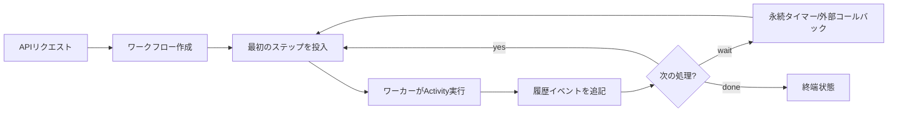
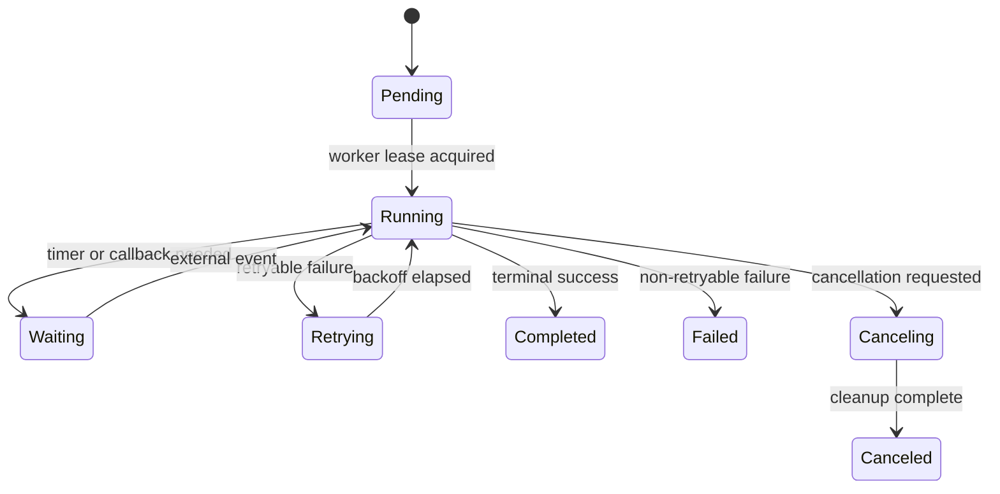
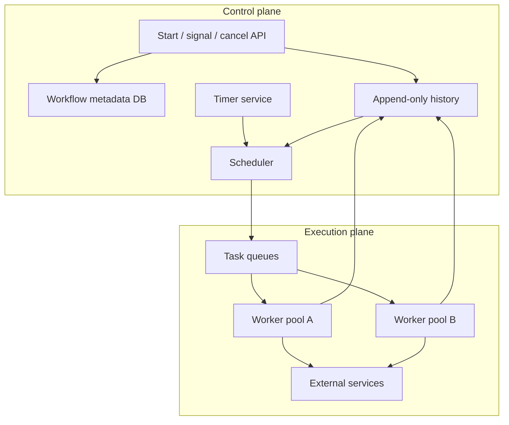

# ワークフローシステム基礎

> この記事は英語版から翻訳されました。最新版は[英語版](/18-workflow-job-systems/01-workflow-system-fundamentals)をご覧ください。

ワークフローシステムは、1回のリクエスト内に収まらない処理を安全に進めるための仕組みです。注文、返金、アカウント開設、データインポート、モデル学習、承認フローのような処理は、時間がかかり、複数サービスにまたがり、途中で失敗します。重要なのは「あとでコードを実行する」ことではなく、「クラッシュ、重複実行、部分失敗、コード変更があっても業務プロセスを前進させる」ことです。

## 問題

リクエスト/レスポンスだけでは次の処理を扱いにくくなります。

- クライアントのタイムアウトより処理が長い
- 1つの業務操作が複数サービスを更新する
- 決済確定、在庫、外部コールバック、人間の承認を待つ必要がある
- 一部の副作用だけ成功したあとに失敗する
- 運用者が「この注文はいまどこで止まっているか」を知る必要がある

最初はキューで十分です。しかしメッセージが状態を持つ業務プロセスになった時点で、ワークフローとして扱うべきです。

## Queue / Workflow / DAG の違い

| パターン | 向いている用途 | 状態の所有者 | 典型的な失敗 |
|---|---|---|---|
| メッセージキュー | 独立したバックグラウンドタスク | コンシューマとキューオフセット | 重複実行、毒メッセージ |
| ワークフローエンジン | 状態を持つ業務プロセス | 永続履歴 | 非決定的リプレイ、補償漏れ |
| DAGオーケストレータ | データ/バッチ依存グラフ | スケジューラDB | バックフィル嵐、依存停止 |
| 分散cron | 時刻起点の処理 | スケジュールストアとリース所有者 | tick漏れ、tick重複 |

これらは重なります。ワークフローエンジンは内部でキューを使い、DAGは依存グラフに特化したワークフローであり、分散cronはワークフローを起動することが多いです。

## 中核モデル

ワークフローには少なくとも4つの永続オブジェクトがあります。

| オブジェクト | 目的 |
|---|---|
| ワークフロー定義 | 許可された遷移を表すバージョン付きコード/グラフ |
| ワークフローインスタンス | `order-123-refund` のような1回の実行 |
| 履歴 | started、scheduled、completed、timer fired、failed などの追記ログ |
| 作業アイテム | いま実行可能でリースできるタスク |

重要な設計は、**履歴を真実のソースにする**ことです。キューアイテムは消え、ワーカーは落ち、APIプロセスは再起動します。しかし履歴が残れば復旧できます。

## 状態遷移

終端状態は明示してください。「キューにメッセージがない」は終端条件ではありません。遅延メッセージ、バグによる投入漏れ、別パーティションで待っている処理がありえます。

## 保証

多くのワークフローシステムが目指す保証は次の通りです。

- Durable start: 開始がコミットされたら復旧可能
- At-least-once activity execution: Activityは複数回実行される可能性がある
- Exactly-once state transition: 論理的な状態遷移は履歴に一度だけ記録する
- Durable timers: 待機に生きたプロセスを必要としない
- Recoverable progress: 履歴から実行可能タスクを再生成できる

外部副作用の exactly-once は通常保証できません。[冪等性](../01-foundations/08-idempotency.md)、フェンシング、重複排除テーブル、補償処理で守ります。

## 参照アーキテクチャ

Control planeは「何を実行すべきか」を決め、ワーカーは副作用を実行します。この分離により、ワーカーだけをスケールしたり、デプロイ時にdrainしたり、履歴から復旧できます。

## 設計質問

1. 冪等性の単位はワークフロー、ステップ、副作用、リクエストのどれか
2. どの状態遷移に強い一貫性が必要か
3. ワークフローは最大どれくらい長く実行されるか
4. 古いワークフロー定義は新しいコードの後も継続できるか
5. 外部副作用後、完了記録前にワーカーが落ちたらどうするか
6. 1インスタンスの最大fan-outはいくつか
7. キャンセルの意味を誰が所有するか
8. 運用者は停止したインスタンスをどう調査、リプレイ、修復するか

## 障害モード

| 障害 | 症状 | 対策 |
|---|---|---|
| 副作用後にワーカーが落ちる | ステップが再実行される | 外部境界で冪等キーを使う |
| タスク投入漏れ | 履歴上は次があるのに止まる | 履歴をスキャンしてタスク再生成 |
| タイマー停止 | 実行が遅れる | タイマーを永続化し期限超過をスキャン |
| 非決定的コード | リプレイ結果が分岐する | 決定的API、バージョン付きコード |
| 履歴肥大化 | リプレイが遅い | continue-as-new、スナップショット |

## 運用メトリクス

- ワークフロー開始率、完了率
- running、waiting、failed、stuck の件数
- スケジューララグ
- タイマーラグ
- Activity retry率
- キュー深さと最古タスク年齢
- リース期限切れ数
- 手動修復数

## 使うべき場合

- 処理が複数サービスや複数コミットにまたがる
- プロセス再起動やデプロイをまたいで継続する必要がある
- 待機が業務ロジックの一部である
- 永続的な監査証跡が必要
- 分散トランザクションより補償が現実的

## 関連パターン

- [メッセージキュー](../05-messaging/01-message-queues.md)
- [配送保証](../05-messaging/04-delivery-guarantees.md)
- [Sagaパターン](../05-messaging/09-saga-pattern.md)
- [冪等性](../01-foundations/08-idempotency.md)
- [分散ロック](../01-foundations/09-distributed-locks.md)
