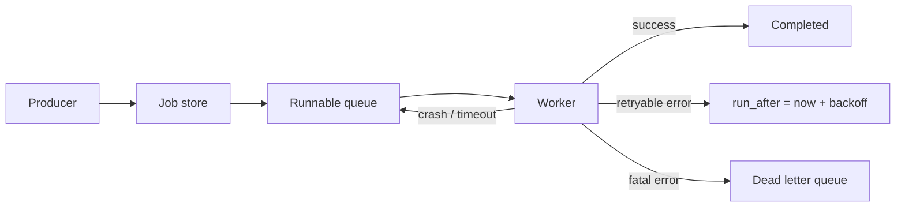
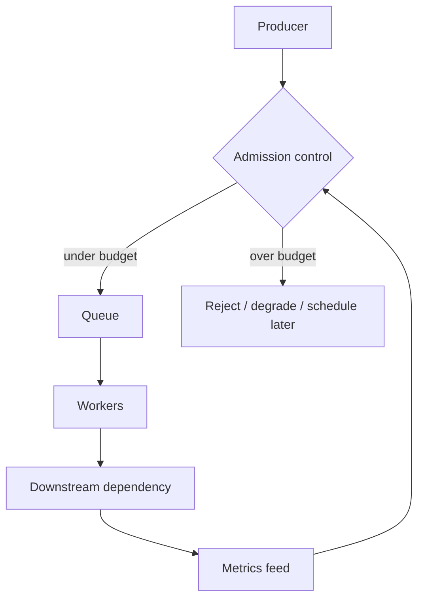

# バックグラウンドジョブとワーカープール

> この記事は英語版から翻訳されました。最新版は[英語版](/18-workflow-job-systems/02-background-jobs-worker-pools)をご覧ください。

バックグラウンドジョブは、メール送信、エクスポート、画像処理、請求照合、キャッシュウォームアップ、Webhook配信、クリーンアップのような処理をリクエスト経路の外で実行します。難しいのはenqueue/dequeueではありません。重複実行、キャパシティ分離、graceful shutdown、毒ジョブ、無限リトライ、古い作業が進んでいることの証明です。

## メンタルモデル

ジョブは「作業を行う永続的な意図」です。ワーカーリースは「一時的にそれを試行する権利」です。



キューだけで全状態、リトライ、試行、リースを表現できない場合、DBを真実のソースにし、キューは起床通知として使う設計が有効です。

## ジョブライフサイクル

| 状態 | 意味 |
|---|---|
| Pending | 作成済みだがまだ実行不可 |
| Runnable | ワーカーが取得可能 |
| Leased | `lease_until` までワーカーが所有 |
| Succeeded | 終端成功 |
| Retryable failed | 失敗したがbackoff後に再実行 |
| Dead | リトライポリシー超過の終端失敗 |
| Canceled | 完了前にキャンセル |

booleanの成功/失敗だけでは足りません。attempt数、次回実行時刻、エラー種別、最終heartbeatが必要です。

## ワーカーリース

```sql
UPDATE jobs
SET lease_owner = :worker_id,
    lease_until = now() + interval '5 minutes',
    attempts = attempts + 1
WHERE id = (
  SELECT id
  FROM jobs
  WHERE status = 'runnable'
    AND run_after <= now()
    AND (lease_until IS NULL OR lease_until < now())
  ORDER BY priority DESC, run_after ASC
  FOR UPDATE SKIP LOCKED
  LIMIT 1
)
RETURNING *;
```

リースが切れたら別ワーカーが再試行できます。ただし古いワーカーが遅いだけで生きている可能性があるため、処理自体は冪等である必要があります。

## キュー設計

| 設計 | 強み | リスク |
|---|---|---|
| Brokerのみ | 単純で高スループット | 複雑な状態の調査/修復が難しい |
| DB-backed jobs | 検査性とトランザクションが強い | polling/lockingがボトルネック |
| DB truth + broker wakeup | 永続状態と応答性の両立 | 部品が増える |
| Partitioned queues | 高スケールと分離 | rebalanceとhot partition |

## ワーカープールのサイズ決定

| ボトルネック | スケールシグナル | 保護策 |
|---|---|---|
| CPU-bound | CPU飽和、実行時間 | ワーカーautoscaling |
| DB-bound | DB接続、lock wait、query latency | ジョブ種別ごとの並列上限 |
| 外部API | 429、timeout、vendor quota | integration別token bucket |
| メモリ重量級 | RSS、OOM、spill | ジョブクラス分離 |

キュー深さだけでは不十分です。最古ジョブ年齢を必ず見ます。

## Graceful Shutdown

ワーカーのデプロイ契約:

1. 新しいリース取得を止める
2. drain window内で実行中ジョブを終える
3. 長いジョブはheartbeatする
4. 未完了ジョブのリースを解放するか期限切れにする
5. 再開に必要な進捗を保存する

デプロイでワーカーを強制終了すると、毎回重複実行テストになります。

## リトライと毒ジョブ

| エラー | リトライ | ポリシー |
|---|---|---|
| network timeout | する | jitter付き指数backoff |
| DB deadlock | する | 短い bounded retry |
| 429 | する | `Retry-After` またはquota状態に従う |
| validation error | しない | 明確な理由でdead |

毒ジョブ対策:

- 最大attempt数
- Dead letter queue
- エラー種別ごとのretry budget
- 依存先ごとのcircuit breaker
- 修復後の手動replay

## Backpressure

Producer admissionもジョブシステムの一部です。無限にenqueueできるなら、キューは遅延債務の台帳になります。



## 運用メトリクス

- job type/tenant/priority別のキュー深さ
- 最古runnable jobの年齢
- job duration histogram
- successあたりattempt数
- retry率、DLQ率
- lease expiration数
- worker utilization
- downstream latencyとthrottle

## 関連パターン

- [メッセージキュー](../05-messaging/01-message-queues.md)
- [Dead Letter Queues](../05-messaging/08-dead-letter-queues.md)
- [Backpressure](../06-scaling/07-backpressure.md)
- [Circuit Breakers](../06-scaling/06-circuit-breakers.md)
