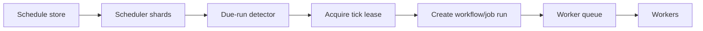

# 分散cronとスケジューリング

> この記事は英語版から翻訳されました。最新版は[英語版](/18-workflow-job-systems/03-distributed-cron-scheduling)をご覧ください。

分散cronは、クラスタ全体で「時刻」を作業に変換します。単純に見えますが、時計ずれ、スケジューラ再起動、夏時間、長時間実行、複数リージョンの二重所有があると難しくなります。本番のスケジューラには、永続スケジュール、リース、missed-run policy、jitter、backpressure、重複tickの意味定義が必要です。

## モデル



作業開始前にrun recordを永続化します。run recordは監査証跡であり、tick重複排除キーです。

## Schedule と Run

| オブジェクト | 例 | 変更可能性 |
|---|---|---|
| Schedule | 毎日09:00 Asia/Tokyo | ユーザー/設定により変更可能 |
| Run | schedule A at 2026-06-15T00:00Z | identityは不変、statusは変更 |

run identityは `(schedule_id, scheduled_time)` にします。現在時刻の丸めだけを使うと重複や漏れの原因になります。

## Tick Claim

```sql
INSERT INTO scheduled_runs (schedule_id, scheduled_at, status, created_at)
VALUES (:schedule_id, :scheduled_at, 'created', now())
ON CONFLICT (schedule_id, scheduled_at) DO NOTHING;
```

DB制約で重複検出します。run作成後にスケジューラが落ちても、reconcilerが created-but-not-started run をenqueueできます。

## 時刻セマンティクス

| 要件 | 設計 |
|---|---|
| UTC interval | intervalと次のUTC fire timeを保存 |
| ローカル業務時刻 | numeric offsetではなくIANA timezoneを保存 |
| DST spring forward | skipまたはshiftを定義 |
| DST fall back | 1回か2回か定義 |
| 月末 | clampまたはskipを定義 |
| SLA window | latest acceptable startを保存 |

時刻ポリシーは利用者に見える仕様にします。隠れたデフォルトは請求/コンプライアンス事故になります。

## Missed Runs

| ポリシー | 使う場合 |
|---|---|
| Skip | 新鮮さが完全性より重要 |
| Catch up all | すべての期間が法的/金銭的に必要 |
| Catch up latest only | 最新状態だけ意味がある |
| Bounded catch-up | 古い作業は一定期間だけ有用 |

backfillはlive tickと無制限に同じcapacityを共有させないでください。

## Jitter

全テナントが0時に実行されると、自分で障害を作ります。決定的jitterを使います。

```text
offset_seconds = hash(schedule_id) % jitter_window_seconds
actual_fire_time = nominal_fire_time + offset_seconds
```

## Sharding

| 戦略 | 強み | リスク |
|---|---|---|
| schedule ID hash | 単純で均等 | hot tenantは残る |
| time bucket | due scanが効率的 | common timeがhotになる |
| tenant shard | 分離とquota制御 | tenantサイズが偏る |
| DB range scan + leases | 復旧が簡単 | DBがscheduler bottleneck |

## 障害モード

| 障害 | 症状 | 対策 |
|---|---|---|
| clock skew | tickが早い/遅い | NTP、DB/server time基準 |
| scheduler split brain | duplicate runs | unique run keyと冪等start |
| catch-up storm | 障害復旧後にworkers飽和 | bounded catch-upと別queue |
| DST ambiguity | 二重請求/レポート漏れ | 明示timezone policy |
| long-running overlap | 同じjobが並行実行 | scheduleごとのconcurrency policy |

## 運用メトリクス

- schedule scan lag
- dueだが未評価の最古schedule
- run creation latency
- duplicate run conflict数
- missed run数
- catch-up backlog
- scheduler shard ownership churn

## 関連パターン

- [分散時間](../01-foundations/05-distributed-time.md)
- [Leader Election](../02-distributed-databases/09-leader-election.md)
- [分散ロック](../01-foundations/09-distributed-locks.md)
- [Auto-Scaling](../06-scaling/08-auto-scaling.md)
