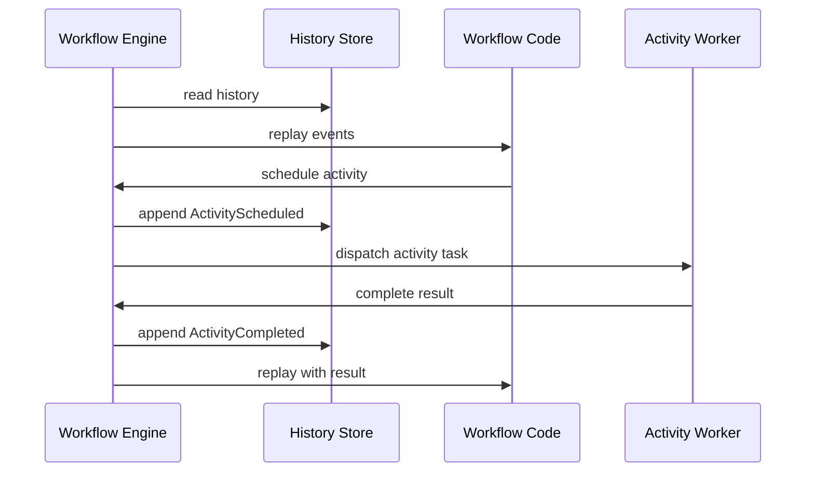
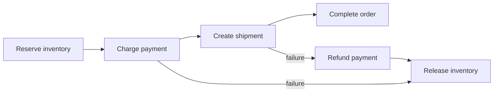

# Durable Executionとワークフローエンジン

> この記事は英語版から翻訳されました。最新版は[英語版](/18-workflow-job-systems/04-durable-execution-workflow-engines)をご覧ください。

Durable executionは、通常のプログラムのようにワークフローコードを書きながら、クラッシュ後に復元できるだけの履歴を記録する方式です。エンジンは決定、タイマー、Activity完了、signalを永続化し、再起動時に履歴をreplayして状態を再構築します。

## 中核アイデア

ワークフロー関数は決定的な状態機械です。Activityが非決定的な副作用を実行します。



replayが耐久性を作ります。同時に、決定性が必須になります。

## Workflow Code と Activity Code

| コード種別 | network call | wall clock | retry owner | 決定性 |
|---|---|---|---|---|
| Workflow code | 不可 | engine API経由のみ | Engine | 厳格 |
| Activity code | 可 | 可 | Activity policy | 冪等 |

Workflow codeは決定し、Activity codeは実行します。

## Event History

代表的なイベント:

- WorkflowStarted
- ActivityScheduled
- ActivityStarted
- ActivityCompleted
- ActivityFailed
- TimerStarted
- TimerFired
- SignalReceived
- ChildWorkflowStarted
- WorkflowCompleted

履歴は1インスタンスの追記ログです。決定的replay、監査、復旧を可能にします。

## Durable Timer

プロセス内sleepは耐久的ではありません。durable timerは永続イベントです。

```text
TimerStarted(id=payment-settlement, fire_at=2026-06-16T00:00:00Z)
...
TimerFired(id=payment-settlement)
```

待機中にワーカーが生きている必要はありません。

## バージョニング

長時間ワークフローはデプロイをまたぎます。新コードで古い履歴をreplayすると分岐する可能性があります。

安全策:

- workflow historyにversion markerを残す
- continue-as-newで長い履歴を新コードに移す
- 古いrunがdrainするまで旧workerを残す
- map/setの非決定的iterationを避ける
- workflow typeをversion別にrouteする

## 副作用とSaga

外部副作用はActivityに閉じ込め、冪等キーを使います。

```text
idempotency_key = workflow_id + ":" + activity_id + ":" + logical_operation
```

Durable workflow engineは[Saga](../05-messaging/09-saga-pattern.md)の自然な実装です。



成功済みのforward stepが履歴に残るため、必要な補償だけを実行できます。

## スケーリング

| 圧力 | 設計対応 |
|---|---|
| 大量のwaiting workflow | timerを効率保存しworkerを常駐させない |
| 巨大履歴 | snapshotまたはcontinue-as-new |
| hot workflow | signalとchild fan-outを制限 |
| activity throughput | activity class別task queue |
| worker deploy | drainとversioning |
| multi-tenant load | namespace quota |

## 障害モード

| 障害 | 原因 | 対策 |
|---|---|---|
| 非決定的replay | random/time/networkをworkflow codeで読む | 決定的API、replay test |
| Activity結果喪失 | 副作用後にworker crash | 冪等キーとactivity retry |
| 履歴肥大化 | 長いloopやchatty signal | continue-as-new |
| version break | 新コードが旧履歴をreplayできない | version marker |
| stuck workflow | signal待ちが永遠に来ない | timer、escalation、repair |

## 関連パターン

- [Event Sourcing](../05-messaging/05-event-sourcing.md)
- [Saga Pattern](../05-messaging/09-saga-pattern.md)
- [Outbox Pattern](../05-messaging/07-outbox-pattern.md)
- [Failure Modes](../01-foundations/06-failure-modes.md)
