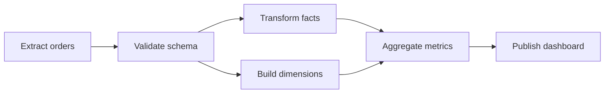

# DAGオーケストレーション

> この記事は英語版から翻訳されました。最新版は[英語版](/18-workflow-job-systems/05-dag-orchestration)をご覧ください。

DAGオーケストレーションは、抽出、変換、モデル学習、メトリクス公開、検索インデックス更新、分析backfillのような依存関係を持つ処理を調整します。DAGシステムは依存構造を実行可能タスクに変換し、data interval、retry、backfill、部分完了を追跡します。

## DAGモデル



DAGはacyclicであるべきです。繰り返しはcycleではなく、別のrun/intervalとして表現します。

## 用語

| 用語 | 意味 |
|---|---|
| DAG definition | タスクと依存関係のバージョン付きグラフ |
| DAG run | 1回の実行。多くはdata intervalを持つ |
| Task | グラフのノード |
| Task attempt | タスクの1回の試行 |
| Sensor | 外部状態を待つタスク |
| Backfill | 過去intervalの実行 |

## Scheduler責務

```text
task is runnable when:
  all upstream tasks succeeded
  task run_after <= now
  task concurrency limits allow it
  DAG run is not canceled
  required external conditions are met
```

依存関係のready判定はworkerではなくschedulerが所有します。

## Data Interval

| Run label | Data interval | よくあるバグ |
|---|---|---|
| `2026-06-15` daily run | `2026-06-15T00:00Z` to `2026-06-16T00:00Z` | run dateとexecution dateの混同 |
| 10:00 hourly run | 09:00 to 10:00 | 遅延データを読めない |
| May backfill | 複数daily intervals | live warehouse capacityを圧迫 |

interval境界をtask inputとoutput pathに明示します。

## 冪等な出力

```text
s3://warehouse/orders_daily/dt=2026-06-15/_tmp/run_id=abc
s3://warehouse/orders_daily/dt=2026-06-15/part-000.parquet
```

一時領域に書き、検証後にatomic publishします。失敗後の半端なpartitionを避けます。

## Backfill

Backfillは本番負荷です。

- backfill専用queue
- DAG/dataset別concurrency cap
- warehouse budget limit
- dry runで依存展開を確認
- pause/resume
- overwrite policy

## Dynamic DAG

| パターン | リスク | 制御 |
|---|---|---|
| customerごとtask | 数百万task | shard単位にbatch |
| fileごとtask | scheduler metadata爆発 | manifest task + worker batching |
| runtime graph expansion | retry推論が難しい | runごとに展開後graphを永続化 |

## 障害セマンティクス

| 障害 | 望ましい動作 |
|---|---|
| upstream失敗 | downstreamはblockedまたはskipped |
| task timeout | 冪等ならretry、そうでなければfail fast |
| data quality失敗 | publish pathを止めてalert |
| worker death | lease expiration後にretry |
| scheduler death | metadataからrunnable tasks再構築 |

## 観測性

- critical path duration
- task duration by attempt
- queue wait vs execution time
- failed dependency count
- late data count
- backfill progress by interval
- dataset freshness
- output row counts and quality checks

## 関連パターン

- [Batch Processing](../13-data-pipelines/01-batch-processing.md)
- [Stream Processing](../13-data-pipelines/02-stream-processing.md)
- [Training Pipelines](../16-ml-systems/05-training-pipelines.md)
- [Lakehouse and Open Table Formats](../13-data-pipelines/05-lakehouse-table-formats.md)
