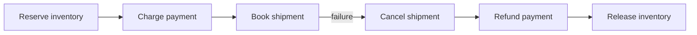
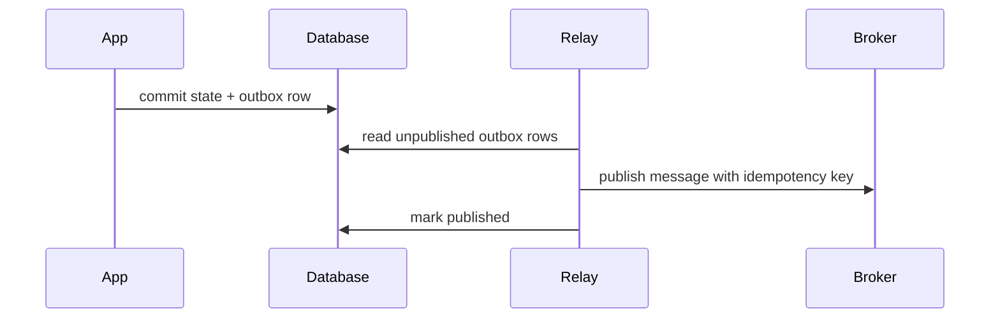

# リトライ、冪等性、補償

> この記事は英語版から翻訳されました。最新版は[英語版](/18-workflow-job-systems/06-retry-idempotency-compensation)をご覧ください。

ワークフローとジョブシステムは「もう一度試す」と「二重に実行してはいけない」の間にあります。ネットワーク、ワーカー、依存先は失敗するためリトライは必要です。しかし外部副作用がすでに起きている可能性があるため危険です。設計の中心は、再試行に対する冪等性と、コミット済みステップに対する補償です。

## リトライは契約

リトライポリシーは次を定義します。

- どのエラーがretryableか
- 最大attempt数または最大経過時間
- backoffとjitter
- cancellation後のattempt可否
- retry exhaustion後の状態
- どの冪等キーで副作用を守るか

## Backoff

```text
delay = min(max_delay, base_delay * 2 ** attempts)
delay = random_between(delay * 0.5, delay * 1.5)
```

jitterは依存先障害後の同期retry stormを防ぎます。

## 冪等キー

| 操作 | 良いkey |
|---|---|
| 顧客に課金 | `payment:{order_id}:{payment_attempt_id}` |
| 注文メール送信 | `email:order-confirmation:{order_id}` |
| 出荷作成 | `shipment:{order_id}:{warehouse_id}` |
| 日次レポート公開 | `report:{report_id}:{data_interval}` |

keyはretryをまたいで安定させます。attemptごとに新しいkeyを作ると冪等性は無効になります。

## Dedupe Store

```sql
CREATE TABLE idempotency_records (
  key TEXT PRIMARY KEY,
  status TEXT NOT NULL,
  response JSONB,
  created_at TIMESTAMPTZ NOT NULL,
  expires_at TIMESTAMPTZ
);
```

dedupe storeの確認と書き込みは、副作用境界でatomicに行うか、下流サービスに委譲します。

## 補償

補償はrollbackではありません。過去のコミット済みアクションを業務的に打ち消す新しいアクションです。



補償も失敗します。補償にもretry、冪等性、alert、監査証跡が必要です。

## Retry Matrix

| エラー種別 | Retry | Compensation | 備考 |
|---|---|---|---|
| response前timeout | Yes | Unknown | idempotency recordを照会 |
| 5xx | Yes | 通常No | bounded retryとcircuit breaker |
| 4xx validation | No | No | 理由付きfail |
| partial multi-step failure | Maybe | Yes | 成功済みstepを補償 |
| human rejection | No | 業務依存 | rejected終端状態 |

## Outbox

DB commitとmessage publishを同時に扱う場合は[Outbox Pattern](../05-messaging/07-outbox-pattern.md)を使います。



## Retry Budget

無限リトライはインシデントを隠し、コストを爆発させます。

- workflow instance別
- activity type別
- tenant別
- downstream dependency別
- time window別

budgetが尽きたら、可視的にfailするかrepair queueへ送ります。

## 関連パターン

- [冪等性](../01-foundations/08-idempotency.md)
- [Outbox Pattern](../05-messaging/07-outbox-pattern.md)
- [Saga Pattern](../05-messaging/09-saga-pattern.md)
- [Retries, Timeouts, and Hedging](../06-scaling/10-retries-timeouts-hedging.md)
