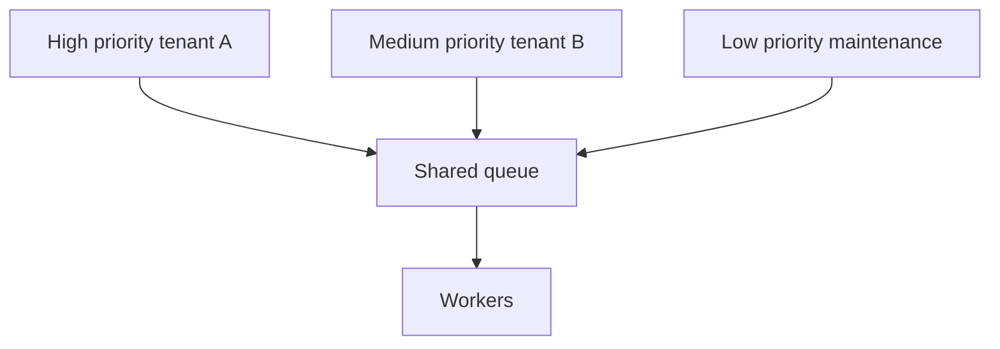
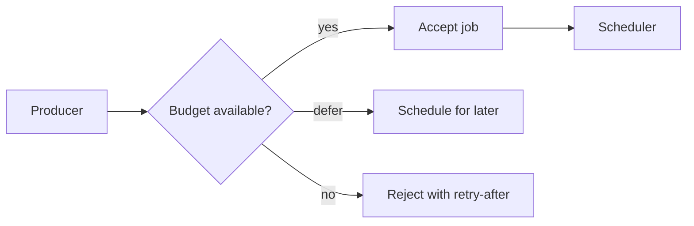

# 優先度、公平性、Backpressure

> この記事は英語版から翻訳されました。最新版は[英語版](/18-workflow-job-systems/07-priority-fairness-backpressure)をご覧ください。

ジョブシステムが共有基盤になると、スケジューリングポリシーはプロダクト機能になります。公平性がなければ1つのテナントやジョブ種別が全員をstarveさせます。backpressureがなければ、一時的な依存先遅延が巨大な遅延債務になります。優先度は有用ですが、quotaなしの優先度はDoSの仕組みになります。

## スケジューリング問題

workerは有限です。jobは等価ではありません。

- user-visibleなjob
- batch maintenance
- 有料tenantの強いSLA
- strict quotaを持つdownstream
- fresh workより後ろに回すべきretry

スケジューラは希少なexecution slotを誰に渡すかを決めます。

## Priorityだけでは足りない



tenant Aがhigh-priority jobを出し続けると他がstarveします。priorityにはfairnessまたはadmission controlが必要です。

## ポリシー

| Policy | 仕組み | リスク |
|---|---|---|
| FIFO | 古いjobから実行 | bulk workがurgent workを塞ぐ |
| Strict priority | 最高priorityから実行 | starvation |
| Weighted fair queueing | classごとにshareを持つ | scheduler complexity |
| Deficit round robin | job costに応じcredit消費 | cost estimateが必要 |
| Earliest deadline first | 近いdeadlineから実行 | 見積もり誤りでthrashing |

## Tenant Fairness

```text
effective_score =
  priority_weight
  + age_boost
  - tenant_over_budget_penalty
  - downstream_pressure_penalty
```

公平性は「全員同じthroughput」ではなく、「誰も無制限に共有capacityを消費できない」ことです。

## Aging

```text
age_boost = min(max_boost, floor(wait_seconds / aging_interval) * boost_step)
```

agingは低priority jobが永久に待つことを防ぎます。

## Backpressure Signals

| Signal | Producer response |
|---|---|
| queue ageがSLO超過 | background workを減速/拒否 |
| downstream 429増加 | integration concurrency削減 |
| DB latency spike | DB-heavy jobをpause |
| worker error spike | retry amplification停止 |
| tenant quota超過 | deferまたはreject |

backpressureはworkerだけでなくenqueue側に効かせます。

## Admission Control



ユーザー向け操作では、数時間後に完了するjobを受け付けるより早く拒否する方が正しいことがあります。

## 障害モード

| 障害 | 症状 | 対策 |
|---|---|---|
| starvation | 古い低priority jobが実行されない | agingとminimum share |
| priority inversion | 低priority jobが希少依存先を占有 | dependency別concurrency pool |
| retry amplification | failed jobがworkerを支配 | retry queueを低priorityにする |
| noisy tenant | 1 tenantがqueueを埋める | tenant quota |
| scheduler hot loop | runnableでないjobをscanし続ける | runnable time/classでpartition |

## 関連パターン

- [Rate Limiting](../06-scaling/05-rate-limiting.md)
- [Backpressure](../06-scaling/07-backpressure.md)
- [Multi-Tenancy Patterns](../06-scaling/12-multi-tenancy.md)
- [Cell-Based Architecture and Shuffle Sharding](../06-scaling/11-cell-based-architecture.md)
